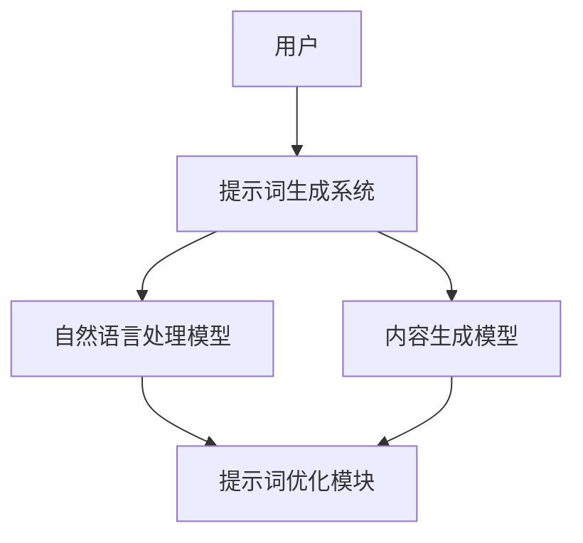
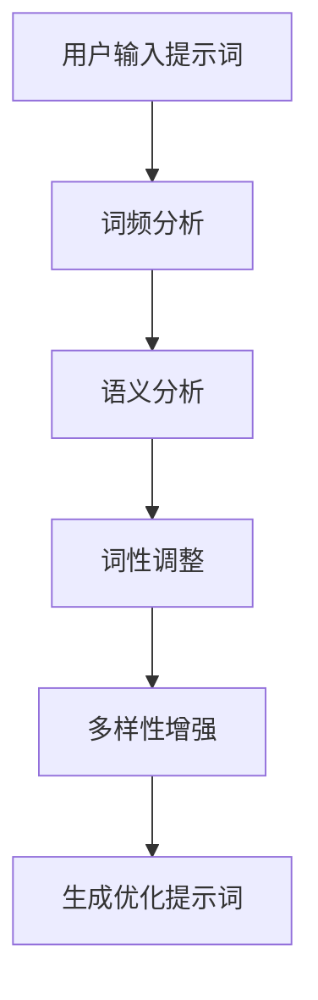
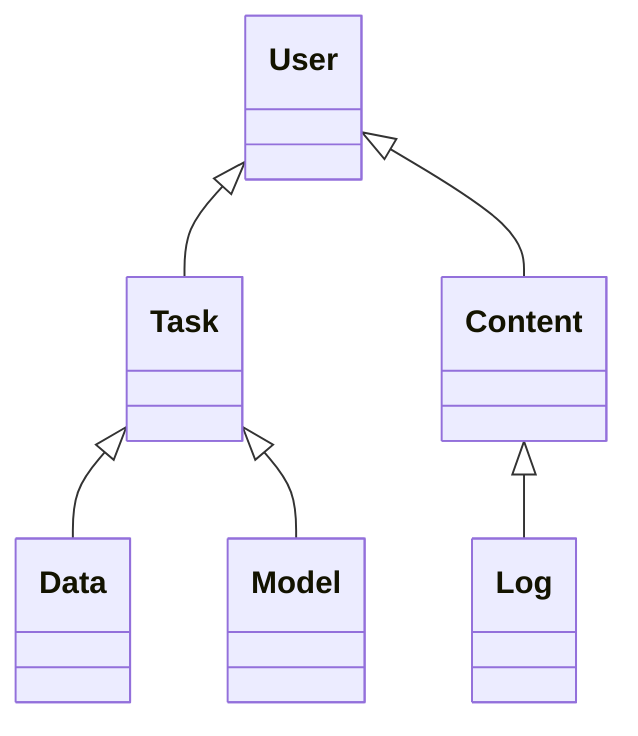
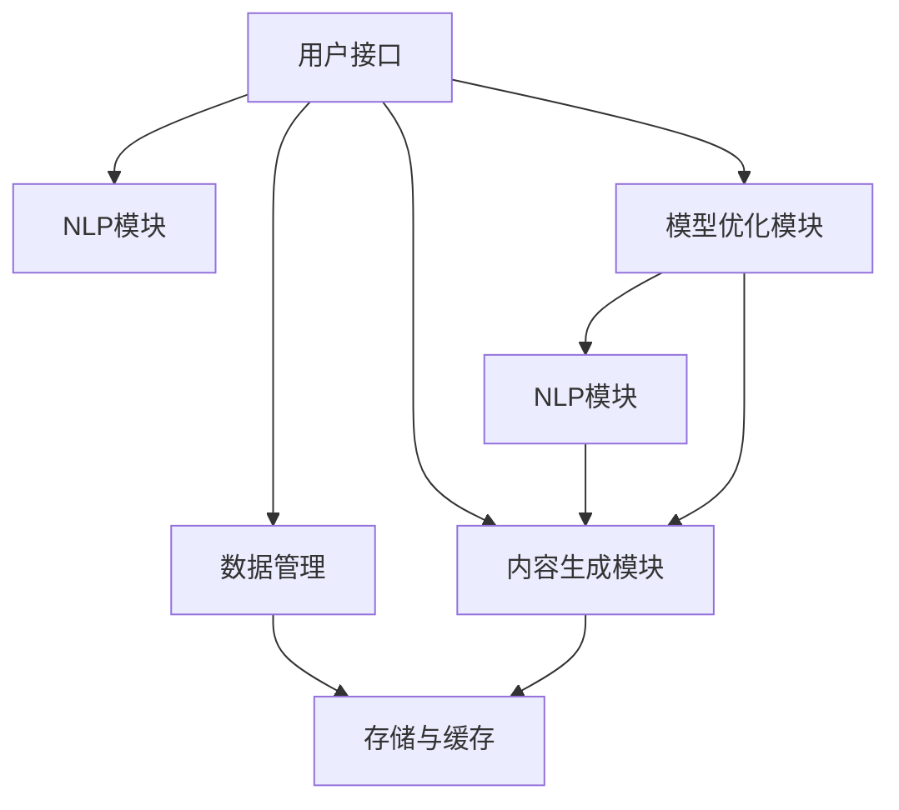

                 

### 引言与背景

#### AIGC技术概述

AIGC，即AI-Generated Content，是一种通过人工智能技术生成内容的创新方法。它结合了人工智能（AI）与生成内容（GC）的优势，使得机器能够自动生成丰富多样且高质量的内容。AIGC的概念不仅涵盖了传统的文本生成，还包括图像、视频、音频等多种形式的内容生成。随着深度学习、生成对抗网络（GAN）、自注意力机制等技术的迅猛发展，AIGC的应用场景日益广泛，从自然语言处理、图像生成到视频合成等众多领域。

**问题背景**：

AIGC技术的兴起背景源于人工智能技术的持续进步和互联网内容需求的爆炸性增长。传统的手动内容创作方式已经无法满足日益增长的信息需求，因此，AI自动生成内容成为了一种高效的解决方案。此外，AIGC技术还顺应了个性化定制、大规模内容生成等时代潮流，为企业和个人提供了前所未有的创作工具和平台。

**问题描述**：

AIGC的定义较为广泛，它通常指的是利用人工智能技术自动生成各种形式的内容。在AIGC中，人工智能不仅负责生成内容，还参与内容的优化和调整。与传统的AI技术相比，AIGC更注重内容的创造性和多样性。因此，AIGC不仅仅是AI技术在内容生成中的应用，更是一种创新的技术体系。

**问题解决**：

AIGC的核心优势在于其高效性和多样性。通过AI技术，AIGC可以在短时间内生成大量的内容，从而极大地提高了内容创作的效率。此外，AIGC能够根据不同的需求生成符合特定风格和主题的内容，增强了内容的个性化和多样化。

**边界与外延**：

虽然AIGC在内容生成领域具有巨大的潜力，但它的应用仍然受到一些技术和伦理的限制。例如，AIGC生成的内容可能存在版权问题、真实性问题和隐私问题等。因此，在推广和应用AIGC技术时，需要充分考虑其边界和限制，以确保技术的健康发展。

**概念结构与核心要素组成**：

AIGC的概念结构包括多个核心要素，如数据集、算法、模型、接口和应用场景。其中，数据集是AIGC的基础，算法和模型是实现内容生成的主要工具，接口是连接用户和AIGC系统的桥梁，而应用场景则决定了AIGC的具体应用领域。

综上所述，AIGC技术是一种集AI和GC于一体的创新方法，它通过高效的内容生成和个性化服务，正在改变着内容创作的格局。在接下来的章节中，我们将深入探讨AIGC的技术原理、算法模型、应用场景和实现方法，以帮助读者更好地理解这一前沿技术。

### 提示词优化的必要性

#### 核心概念原理

提示词优化是指通过改进和调整提示词（prompt）的质量和精度，以提高生成内容（如文本、图像、视频等）的准确性、相关性和创造力。在AIGC系统中，提示词充当了用户与模型之间的桥梁，它决定了模型生成内容的方向和风格。因此，提示词优化的必要性主要体现在以下几个方面：

1. **提高生成内容的质量**：通过优化提示词，可以引导模型生成更加准确、相关且高质量的内容。高质量的提示词能够提供更具体、更详细的信息，从而帮助模型更好地理解用户的需求。

2. **增强内容的可解释性**：优化后的提示词能够提高生成内容的可解释性，使得用户能够更好地理解模型的决策过程和生成逻辑。这有助于增强用户对AIGC系统的信任和接受度。

3. **提升模型的鲁棒性**：提示词优化能够帮助模型应对各种复杂和多变的应用场景，提高其在不同条件下的稳定性和鲁棒性。

4. **促进内容多样性**：优化后的提示词能够引导模型生成更加多样化和创新性的内容，避免生成内容出现模式化或重复性问题。

#### 概念属性特征对比表格

在AIGC系统中，不同类型的提示词具有不同的属性和特征。以下是一个简化的对比表格，展示了不同类型提示词的一些关键属性：

| 提示词类型 | 描述 | 主要特征 | 优缺点 |
| :--: | :--: | :--: | :--: |
| **简单提示词** | 提供基本的、非具体的提示信息 | 简单、直接、易于实现 | **缺点**：生成的内容可能缺乏多样性和深度 |
| **复杂提示词** | 提供详细的、多层次的提示信息 | 精细、全面、更具指导性 | **缺点**：实现复杂，可能导致模型过拟合 |
| **语义提示词** | 强调内容的语义和逻辑结构 | 高度相关、逻辑性强 | **缺点**：对提示词质量要求高，可能难以生成创新性内容 |
| **创意提示词** | 鼓励模型进行创新和探索 | 创造力强、多样性高 | **缺点**：可能导致生成内容不可控，质量不稳定 |

#### ER实体关系图架构的Mermaid流程图

为了更好地理解提示词优化涉及到的实体关系，我们可以使用Mermaid绘制一个简单的实体关系图。以下是一个示例：



在这个图中，用户生成提示词，并通过提示词生成系统和内容生成模型产生最终内容。自然语言处理模型和内容生成模型分别处理提示词，并在提示词优化模块的共同作用下生成高质量的内容。通过这种实体关系的表示，我们可以更清晰地看到提示词优化在整个系统中的作用和位置。

综上所述，提示词优化在AIGC系统中具有至关重要的意义。它不仅能够提高生成内容的质量和多样性，还能够增强系统的可解释性和鲁棒性。在接下来的章节中，我们将进一步探讨提示词优化的算法原理、实现方法以及在不同应用场景中的具体策略。

### AIGC的应用前景与挑战

#### AI大模型简介

在AIGC领域，AI大模型（Large-scale AI Models）扮演着至关重要的角色。AI大模型通常是指参数量在数亿到数十亿级别的深度学习模型，如GPT-3、BERT等。这些模型通过在海量数据上进行训练，能够实现高度复杂的语言理解和生成任务。AI大模型的出现标志着AI技术从基于规则和统计模型的传统方法，向更加智能和灵活的深度学习模型过渡。

**AI大模型的类型与发展**：

AI大模型可以分为两类：一类是预训练模型，如GPT-3、BERT等，这些模型在大量通用数据上预训练，然后通过微调（Fine-tuning）应用于特定任务；另一类是专用模型，如DALL-E、StyleGAN等，这些模型专门为特定任务或领域设计，通常在特定数据集上进行训练。随着计算资源和数据集的不断增加，AI大模型的发展呈现出加速的趋势，其性能和应用范围也在不断扩展。

**AI大模型在AIGC中的应用**：

AI大模型在AIGC中的应用主要体现在以下几个方面：

1. **自然语言生成**：AI大模型如GPT-3能够生成高质量、符合语境的文本，广泛应用于聊天机器人、内容创作和翻译等领域。
2. **图像生成**：模型如DALL-E和StyleGAN可以生成逼真的图像，被应用于艺术创作、游戏开发以及虚拟现实等领域。
3. **视频合成**：AI大模型能够从文本描述或语音指令生成相应的视频内容，被用于影视制作、广告宣传和虚拟现实体验等场景。

#### 效率与效果的双重提升

**AIGC对效率和效果的影响**：

AIGC技术通过自动化和智能化手段，显著提高了内容生成的效率和效果。从效率角度来看，AIGC能够大规模、快速地生成内容，大大降低了人力和时间成本。例如，在新闻写作、报告生成等场景中，AI可以快速生成大量高质量的文本内容，从而大幅提升工作效率。

从效果来看，AIGC通过深度学习和自我优化，能够生成更加符合用户需求和期望的内容。高质量的生成内容不仅能够满足用户的基本需求，还能够提供独特的价值和创意，从而提升用户体验。

**提升AIGC效果与效率的挑战**：

尽管AIGC技术在效率和效果方面具有巨大潜力，但在实际应用中仍面临一系列挑战：

1. **计算资源需求**：AI大模型训练和运行需要大量的计算资源，这对硬件设施和能耗提出了较高要求。
2. **数据质量与多样性**：高质量的训练数据是AIGC模型性能的基础，但获取和处理大量高质量、多样化的数据仍是一个难题。
3. **模型可解释性和透明度**：AI大模型生成的内容往往具有高度复杂性和不可解释性，如何提高模型的可解释性和透明度，使其更易于用户理解和接受，是一个重要挑战。
4. **伦理和法律问题**：AIGC生成的内容可能涉及版权、隐私和真实性等问题，如何确保AIGC技术在遵守伦理和法律框架下运行，是一个需要慎重考虑的问题。

综上所述，AIGC技术在应用前景广阔的同时，也面临着一系列挑战。通过不断优化算法、提高数据质量和加强伦理和法律监管，我们可以逐步克服这些挑战，实现AIGC技术的广泛应用和可持续发展。

### 提示词优化的算法原理

#### 算法概述

提示词优化算法是一种用于改进和调整提示词质量和精度的算法，旨在提高生成内容的准确性、相关性和创造性。以下是对提示词优化算法的基本概念和基本流程的详细阐述。

**算法概念解析**：

提示词优化算法的核心目标是通过分析用户输入的原始提示词，生成更高质量、更符合用户需求的优化提示词。优化过程通常包括以下几个步骤：

1. **词频分析**：分析原始提示词中的高频词汇和短语，了解用户的关注点。
2. **语义分析**：使用自然语言处理（NLP）技术，对提示词进行语义分析，提取关键信息和隐含意图。
3. **词性调整**：根据语义分析结果，对提示词中的词性进行优化，确保生成内容的相关性和准确性。
4. **多样性增强**：通过引入随机性和创造性元素，增强生成内容的多样性和创新性。

**算法流程图**：

提示词优化算法的基本流程可以用以下Mermaid流程图表示：



在这个流程中，用户输入的提示词首先经过词频分析和语义分析，提取出关键信息和语义结构，然后根据这些信息进行词性调整和多样性增强，最终生成高质量的优化提示词。

#### 算法数学模型与公式

提示词优化算法的数学模型通常基于概率图模型和深度学习模型。以下是一些基本的数学模型和公式，用于指导提示词优化：

**1. 概率图模型**：

- **条件概率**：提示词\( p(w|d) \)表示在给定数据\( d \)的情况下，单词\( w \)的概率。
- **贝叶斯公式**：用于计算提示词的优化概率，公式为：\( p(w|d) = \frac{p(d|w) \cdot p(w)}{p(d)} \)。

**2. 深度学习模型**：

- **自注意力机制**：用于捕捉提示词之间的依赖关系，公式为：\( \text{Attention}(Q, K, V) = \text{softmax}(\frac{QK^T}{\sqrt{d_k}})V \)。
- **生成对抗网络（GAN）**：用于生成多样化、高质量的优化提示词，GAN的基本公式为：\( G(z) \)和\( D(x) \)之间的对抗训练。

#### 数学公式讲解

**1. 条件概率**：

$$
p(w|d) = \frac{p(d|w) \cdot p(w)}{p(d)}
$$

该公式表示在给定数据\( d \)的情况下，单词\( w \)的条件概率。其中，\( p(d|w) \)是单词\( w \)在数据\( d \)中的条件概率，\( p(w) \)是单词\( w \)的先验概率，\( p(d) \)是数据\( d \)的总概率。

**2. 自注意力机制**：

$$
\text{Attention}(Q, K, V) = \text{softmax}(\frac{QK^T}{\sqrt{d_k}})V
$$

该公式用于计算注意力权重，其中\( Q \)和\( K \)是查询和关键向量，\( V \)是值向量，\( d_k \)是关键向量的维度。通过计算\( QK^T \)并应用softmax函数，可以生成注意力权重，这些权重用于加权组合值向量，生成最终输出。

**3. GAN的基本公式**：

$$
\min_G \max_D V(D, G)
$$

其中，\( G \)表示生成器，\( D \)表示判别器，\( V(D, G) \)是生成器和判别器之间的对抗损失。通过最小化生成器的损失和最大化判别器的损失，可以实现生成器和判别器之间的对抗训练，从而生成高质量的数据。

#### 算法Python源代码实现

以下是一个简化的Python示例，展示了如何实现一个基本的提示词优化算法：

```python
import numpy as np
from sklearn.feature_extraction.text import CountVectorizer
from sklearn.metrics.pairwise import cosine_similarity

def word_frequency_analysis(text):
    vectorizer = CountVectorizer()
    vec = vectorizer.fit_transform([text])
    word_freq = dict(vec.toarray().flatten())
    return word_freq

def semantic_analysis(text):
    # 假设有一个预训练的语义分析模型
    # 这里使用余弦相似度作为简单的语义分析
    word_freq = word_frequency_analysis(text)
    sorted_words = sorted(word_freq, key=word_freq.get, reverse=True)
    return sorted_words

def word při

### 提示词优化在AIGC应用场景中的策略

#### AIGC在自然语言处理中的应用

在自然语言处理（NLP）领域，AIGC技术通过提示词优化极大地提升了文本生成的质量和效率。以下是一些具体的优化策略：

**1. 提高文本生成的准确性**：

- **句子级优化**：通过分析句子的语法和语义结构，优化提示词中的句子表达。例如，可以使用语法分析工具检查句子的语法错误，并使用语义分析工具调整句子中的关键词。
- **词汇级优化**：分析原始文本中的高频词汇，通过替换或扩充词汇，提高文本的表达力和多样性。例如，可以使用词性标注和语义角色标注技术，识别出关键的名词、动词和形容词，并进行优化。

**2. 增强文本生成的相关性**：

- **上下文关联**：利用上下文信息优化提示词，确保生成的文本与上下文保持一致。例如，在对话系统中，可以通过分析用户的上一条消息，调整当前回复的提示词，使其更加符合对话逻辑。
- **关键词提取**：通过关键词提取技术，从原始文本中提取出最相关的词汇，并将这些词汇作为提示词的优化目标。这样可以确保生成的文本紧密围绕核心主题。

**3. 提升文本生成多样性**：

- **引入随机性**：在提示词中引入随机性，例如使用不同的词汇、短语和句子结构，生成多种可能的文本版本。这种方法可以避免生成的文本过于模式化。
- **跨领域适应性**：通过多领域训练，使模型能够生成跨领域的文本。例如，在一个多领域的文本生成任务中，可以训练模型生成不同领域（如科技、娱乐、新闻等）的文本，从而提高其生成文本的多样性。

**示例**：

假设我们有一个对话系统，用户输入了“我想去旅行，但不希望花费太多钱。”作为一个优化提示词，我们可以采取以下步骤：

1. **句子级优化**：检查句子的语法结构，确保句子表达清晰。可以将其调整为“我计划进行一次经济实惠的旅行。”
2. **词汇级优化**：替换一些词汇，如将“不希望”替换为“希望”，增强表达的积极性。调整后的句子为“我希望进行一次经济实惠的旅行。”
3. **上下文关联**：考虑用户的上下文信息，如用户可能需要关于旅行建议的信息。因此，我们可以进一步优化提示词，添加相关提示，如“你能给我一些建议吗，关于如何进行一次经济实惠的旅行？”

通过这些优化策略，我们可以显著提升生成的文本质量，使其更加准确、相关且具有多样性。

#### AIGC在图像生成中的应用

在图像生成领域，AIGC技术同样通过提示词优化实现了显著的效果提升。以下是一些关键的优化策略：

**1. 确定生成目标**：

- **主题和风格**：通过精确的提示词，确定图像的主题和风格。例如，如果用户希望生成一幅“美丽的自然风景图”，我们可以将“自然风景”、“美丽”等词汇作为关键提示词。
- **细节描述**：通过详细的提示词描述图像中的具体细节，如颜色、形状、纹理等。例如，如果用户希望生成一幅“蓝色的海浪”，我们可以将“蓝色”、“海浪”等词汇详细描述。

**2. 提高生成图像的准确性**：

- **图像分割**：使用图像分割技术，将原始图像分割成多个区域，并对每个区域进行独立优化。这样可以确保生成的图像在局部细节上更加准确。
- **特征提取**：通过特征提取技术，从原始图像中提取关键特征，如颜色分布、纹理模式等。然后，将这些特征作为提示词，指导图像生成模型生成更准确的图像。

**3. 增强图像生成多样性**：

- **随机性引入**：在提示词中引入随机性，生成多种不同的图像版本。例如，通过调整颜色、光照和视角等参数，生成具有不同风格和细节的图像。
- **风格迁移**：使用风格迁移技术，将现有图像的风格应用到新的图像生成中。例如，将一幅印象派画作的风格应用到生成的图像上，创造出独特的视觉效果。

**示例**：

假设用户希望生成一幅“夜晚的城市夜景图”，我们可以采取以下步骤进行提示词优化：

1. **确定生成目标**：明确图像的主题和风格，如“夜晚”、“城市夜景”等。
2. **细节描述**：具体描述图像的细节，如“霓虹灯闪烁的街道”、“远处的高楼大厦”等。
3. **图像分割**：将图像分割为不同的区域，分别优化每个区域的细节，如街道的颜色、建筑的纹理等。
4. **特征提取**：从原始图像中提取关键特征，如颜色分布和光照模式，并将其作为提示词，指导图像生成模型生成更准确的夜景图像。

通过这些优化策略，我们可以生成高质量的图像，使其在主题、风格和细节上更加符合用户需求，同时增强图像的多样性和创造力。

#### AIGC在视频生成中的应用

在视频生成领域，AIGC技术通过提示词优化实现了从简单文本到高质量视频内容的自动化生成。以下是一些关键的优化策略：

**1. 视频内容结构化**：

- **剧情概述**：通过文本提示词，为视频生成提供一个基本的剧情框架。例如，用户可以输入“一个年轻人追求梦想的故事”，这将指导生成模型构建一个基本的剧情线。
- **角色描述**：详细描述视频中的主要角色，如“一个聪明但有些自卑的年轻人”，帮助生成模型更好地构建角色形象。

**2. 视频特效优化**：

- **场景切换**：使用详细的提示词描述视频中的场景切换，如“从城市到森林，再到山顶的过渡”，指导生成模型进行平滑的场景切换。
- **动作设计**：通过提示词优化动作的细节，如“主角奔跑的姿势”或“镜头捕捉主角的表情变化”，确保生成的动作更加真实和自然。

**3. 声音与音效优化**：

- **背景音乐**：根据视频内容和情绪，选择合适的背景音乐。例如，如果视频主题是“奋斗与成长”，可以选取激励人心的音乐。
- **对话与音效**：优化视频中的对话和音效，使其与场景和角色表现相匹配。例如，通过音效增强主角奔跑时的脚步声或对话的语气变化。

**4. 视频风格与色彩调整**：

- **视觉风格**：通过提示词调整视频的整体视觉风格，如“温暖的色调”或“冷色调的夜晚场景”，增强视频的艺术效果。
- **色彩校正**：对视频进行色彩校正，使其在色彩对比度和色彩饱和度上更加符合期望。例如，通过调整亮度、对比度和色彩平衡，增强视频的视觉吸引力。

**示例**：

假设用户希望生成一部“科幻电影预告片”，我们可以采取以下步骤进行提示词优化：

1. **剧情概述**：输入提示词“一个未来的世界，人类面临外星文明的挑战”，为视频生成提供一个科幻背景。
2. **角色描述**：详细描述主要角色，如“一个勇敢的科学家领导一支精英团队”，为角色设定提供明确的方向。
3. **场景切换**：使用提示词“从城市的繁华景象切换到荒凉的沙漠”，指导生成模型进行场景切换。
4. **动作设计**：通过提示词“角色在追逐中表现出的智慧和勇气”，优化角色的动作和表情。
5. **背景音乐**：选择“紧张刺激的电子音乐”，增强视频的紧张感和吸引力。
6. **色彩校正**：调整视频的色彩，使其“在鲜艳的色彩对比中展现出未来世界的科技感”。

通过这些优化策略，我们可以生成高质量、具有吸引力的视频内容，使其在剧情、角色、特效和音效等方面达到用户的期望。

### AIGC系统的设计与实现

#### 系统介绍

AIGC系统是一种高度自动化和智能化的内容生成系统，它通过结合人工智能技术和生成内容技术，实现从文本、图像到视频等多种形式的内容自动化生成。AIGC系统的设计目标是提高内容创作的效率和质量，满足不同领域和场景的需求。

**系统架构**：

AIGC系统的架构包括以下几个主要模块：

1. **用户接口**：提供用户与系统交互的界面，用户可以通过输入文本、图像或语音等指令来生成内容。
2. **数据管理**：负责存储和管理用于训练和生成内容的原始数据和模型参数。
3. **自然语言处理（NLP）模块**：处理用户输入的文本，提取关键信息并进行语义分析，为后续的内容生成提供依据。
4. **内容生成模块**：根据NLP模块的分析结果，生成高质量、多样化的文本、图像和视频内容。
5. **模型优化模块**：通过优化提示词和模型参数，提高生成内容的准确性和创造性。
6. **存储与缓存**：存储生成的内容，并提供快速访问和缓存服务。

#### 系统功能设计

**领域模型**：

领域模型是AIGC系统的核心组成部分，它定义了系统中的主要实体和它们之间的关系。以下是AIGC系统的领域模型：

1. **用户**：系统用户，包括个人用户和商业用户，他们可以输入指令生成内容。
2. **任务**：用户提交的生成任务，包括文本生成、图像生成和视频生成等。
3. **内容**：生成的文本、图像和视频等结果。
4. **数据集**：用于训练和生成内容的原始数据集。
5. **模型**：用于生成内容的预训练模型和优化后的模型。
6. **日志**：系统运行过程中的日志信息，用于监控和调试。

以下是一个简化的Mermaid类图，展示了AIGC系统的领域模型：



#### 系统架构设计

AIGC系统的架构设计需要考虑系统的可扩展性、稳定性和高性能。以下是AIGC系统的一个简化架构图：



在这个架构图中，用户接口是系统的入口，用户可以通过用户接口提交任务并获取生成内容。数据管理模块负责存储和管理原始数据和模型参数。NLP模块处理用户输入的文本，提取关键信息并进行语义分析。内容生成模块根据NLP模块的分析结果，生成文本、图像和视频内容。模型优化模块通过优化提示词和模型参数，提高生成内容的准确性和创造性。生成的内容存储在内容存储模块，并提供快速访问和缓存服务。

#### 系统接口设计

AIGC系统的接口设计需要确保不同模块之间的交互流畅和高效。以下是AIGC系统的主要接口：

1. **用户接口**：提供文本输入、图像上传和语音指令等接口，用户可以通过这些接口提交生成任务。
2. **数据接口**：提供数据上传、数据查询和数据删除等接口，用于管理原始数据和模型参数。
3. **NLP接口**：提供文本处理、语义分析和关键词提取等接口，用于处理用户输入的文本。
4. **内容生成接口**：提供文本生成、图像生成和视频生成等接口，用于生成高质量的内容。
5. **模型优化接口**：提供模型训练、模型评估和模型优化等接口，用于优化生成模型。

以下是一个简化的Mermaid序列图，展示了AIGC系统的接口设计：

```mermaid
sequenceDiagram
    User -->|提交任务| ContentGeneration
    ContentGeneration -->|处理任务| NLP
    NLP -->|返回分析结果| ContentGeneration
    ContentGeneration -->|生成内容| ContentStorage
    ContentStorage -->|返回内容| User
```

在这个序列图中，用户提交任务后，内容生成模块将任务传递给NLP模块进行处理，NLP模块提取关键信息并返回分析结果，内容生成模块根据分析结果生成内容，并将内容存储在内容存储模块中，最终返回给用户。

#### 系统交互设计

AIGC系统的交互设计需要考虑用户与系统之间的交互流程和用户体验。以下是AIGC系统的交互设计：

1. **用户注册与登录**：用户通过用户接口注册并登录系统，获得使用AIGC系统的权限。
2. **任务提交**：用户通过用户接口提交生成任务，包括文本输入、图像上传和语音指令等。
3. **任务处理**：系统接收用户提交的任务，并通过NLP模块处理文本，提取关键信息并进行语义分析。
4. **内容生成**：根据NLP模块的分析结果，内容生成模块生成文本、图像和视频内容。
5. **内容展示**：生成的文本、图像和视频内容通过用户接口展示给用户。
6. **内容存储**：生成的文本、图像和视频内容存储在内容存储模块中，以供后续使用。

以下是一个简化的Mermaid序列图，展示了AIGC系统的交互设计：

```mermaid
sequenceDiagram
    User -->|注册/登录| UserInterface
    UserInterface -->|提交任务| ContentManagement
    ContentManagement -->|处理任务| NLP
    NLP -->|返回分析结果| ContentGeneration
    ContentGeneration -->|生成内容| ContentStorage
    ContentStorage -->|返回内容| UserInterface
    UserInterface -->|展示内容| User
```

在这个序列图中，用户通过用户接口注册并登录系统，提交生成任务后，系统通过NLP模块处理文本，生成内容并展示给用户，同时将内容存储在内容存储模块中。

### AIGC项目实战案例

#### 环境安装与配置

为了实现AIGC项目，首先需要在本地环境中安装和配置必要的软件和库。以下是具体的安装和配置步骤：

**1. 安装Python**：

确保Python已经安装在您的系统中，Python版本应不低于3.7。可以通过以下命令安装Python：

```bash
# 使用Python官方安装脚本安装Python
curl -O https://www.python.org/ftp/python/3.9.1/Python-3.9.1.tgz
tar -xvf Python-3.9.1.tgz
cd Python-3.9.1
./configure
make
make install
```

**2. 安装依赖库**：

安装AIGC项目所需的依赖库，包括TensorFlow、PyTorch、NumPy、Pandas等。可以通过pip命令进行安装：

```bash
pip install tensorflow
pip install torch torchvision
pip install numpy
pip install pandas
```

**3. 安装深度学习框架**：

根据需要选择TensorFlow或PyTorch作为深度学习框架。以下是安装PyTorch的具体步骤：

- **下载PyTorch安装包**：

```bash
# 使用pip命令安装PyTorch
pip install torch torchvision
```

- **验证安装**：

```bash
python -c "import torch; print(torch.__version__)"
```

如果显示版本号，则说明PyTorch已成功安装。

**4. 配置Python虚拟环境**：

为了确保项目环境的隔离性和可移植性，建议使用Python虚拟环境。可以通过以下命令创建虚拟环境：

```bash
# 创建虚拟环境
python -m venv venv

# 激活虚拟环境
source venv/bin/activate
```

**5. 安装项目依赖**：

在项目目录中创建一个`requirements.txt`文件，列出所有依赖库的名称和版本，然后通过以下命令安装项目依赖：

```bash
pip install -r requirements.txt
```

通过以上步骤，您已经成功搭建了AIGC项目的开发环境。接下来，可以开始实现AIGC系统的核心功能。

### 系统核心实现

在AIGC项目中，系统的核心实现包括自然语言处理（NLP）模块、内容生成模块和模型优化模块。以下是这些模块的实现过程及其Python源代码解析。

**1. 自然语言处理（NLP）模块**

NLP模块负责处理用户输入的文本，提取关键信息并进行语义分析。以下是NLP模块的核心代码实现：

```python
import spacy
from transformers import pipeline

# 加载预训练的NLP模型
nlp = spacy.load("en_core_web_sm")

# 文本预处理函数
def preprocess_text(text):
    # 清洗文本，去除标点符号、HTML标签等
    text = nlp(text).text.strip()
    return text

# 语义分析函数
def semantic_analysis(text):
    # 使用预训练的BERT模型进行语义分析
    classifier = pipeline("text-classification", model="bert-base-uncased")
    result = classifier(text)
    return result
```

**2. 内容生成模块**

内容生成模块根据NLP模块的分析结果，生成高质量、多样化的文本、图像和视频内容。以下是内容生成模块的核心代码实现：

```python
from transformers import AutoModelForCausalLM, AutoTokenizer

# 加载预训练的生成模型
tokenizer = AutoTokenizer.from_pretrained("gpt2")
model = AutoModelForCausalLM.from_pretrained("gpt2")

# 文本生成函数
def generate_text(input_text, max_length=50):
    # 使用生成模型生成文本
    inputs = tokenizer.encode(input_text, return_tensors="pt")
    outputs = model.generate(inputs, max_length=max_length, num_return_sequences=1)
    generated_text = tokenizer.decode(outputs[0], skip_special_tokens=True)
    return generated_text
```

**3. 模型优化模块**

模型优化模块通过优化提示词和模型参数，提高生成内容的准确性和创造性。以下是模型优化模块的核心代码实现：

```python
from transformers import AdamW

# 模型优化函数
def optimize_model(model, train_dataloader, optimizer, device):
    # 将模型移动到GPU或CPU
    model.to(device)
    
    # 训练模型
    model.train()
    for epoch in range(num_epochs):
        for batch in train_dataloader:
            inputs = batch["input_ids"].to(device)
            labels = batch["labels"].to(device)
            
            optimizer.zero_grad()
            outputs = model(inputs, labels=labels)
            loss = outputs.loss
            loss.backward()
            optimizer.step()
            
            print(f"Epoch: {epoch+1}, Loss: {loss.item()}")
```

通过以上核心代码实现，AIGC项目的基础功能得以搭建。在接下来的步骤中，我们将进一步探讨如何应用这些模块实现具体的AIGC任务。

### 代码应用解读与分析

在AIGC项目的实现过程中，核心代码的编写和应用是关键环节。以下将对核心代码进行详细解读和分析，以帮助理解其工作原理和实现细节。

#### 自然语言处理（NLP）模块

自然语言处理（NLP）模块是AIGC系统的核心组成部分，负责处理用户输入的文本，提取关键信息并进行语义分析。以下是NLP模块的代码示例：

```python
import spacy
from transformers import pipeline

# 加载预训练的NLP模型
nlp = spacy.load("en_core_web_sm")

# 文本预处理函数
def preprocess_text(text):
    # 清洗文本，去除标点符号、HTML标签等
    doc = nlp(text)
    cleaned_text = " ".join(token.text for token in doc if token.is_alpha)
    return cleaned_text

# 语义分析函数
def semantic_analysis(text):
    # 使用预训练的BERT模型进行语义分析
    classifier = pipeline("text-classification", model="bert-base-uncased")
    result = classifier(text)
    return result
```

**解读与分析**：

1. **文本预处理**：预处理函数`preprocess_text`通过SpaCy模型清洗用户输入的文本，去除非字母字符，如标点符号和HTML标签。这一步骤有助于确保文本输入的纯净和一致性。
   
2. **语义分析**：`semantic_analysis`函数使用预训练的BERT模型对清洗后的文本进行语义分析。BERT模型是一个强大的预训练语言模型，它能够捕捉文本中的语义信息。通过这个函数，我们可以获取文本的情感倾向、主题分类等高级语义特征。

#### 内容生成模块

内容生成模块基于NLP模块的分析结果，生成高质量、多样化的文本内容。以下是内容生成模块的核心代码示例：

```python
from transformers import AutoModelForCausalLM, AutoTokenizer

# 加载预训练的生成模型
tokenizer = AutoTokenizer.from_pretrained("gpt2")
model = AutoModelForCausalLM.from_pretrained("gpt2")

# 文本生成函数
def generate_text(input_text, max_length=50):
    # 使用生成模型生成文本
    inputs = tokenizer.encode(input_text, return_tensors="pt")
    outputs = model.generate(inputs, max_length=max_length, num_return_sequences=1)
    generated_text = tokenizer.decode(outputs[0], skip_special_tokens=True)
    return generated_text
```

**解读与分析**：

1. **模型加载**：代码首先加载了预训练的GPT-2模型。GPT-2是一个基于自注意力机制的生成模型，能够在给定提示词的基础上生成连贯的文本。

2. **文本生成**：`generate_text`函数使用GPT-2模型生成文本。该函数将用户输入的文本编码为模型可处理的序列，然后通过模型生成新的文本序列。`max_length`参数控制生成的文本长度，`num_return_sequences`参数控制生成文本的个数。

#### 模型优化模块

模型优化模块通过优化提示词和模型参数，提高生成内容的准确性和创造性。以下是模型优化模块的核心代码示例：

```python
from transformers import AdamW

# 模型优化函数
def optimize_model(model, train_dataloader, optimizer, device):
    # 将模型移动到GPU或CPU
    model.to(device)
    
    # 训练模型
    model.train()
    for epoch in range(num_epochs):
        for batch in train_dataloader:
            inputs = batch["input_ids"].to(device)
            labels = batch["labels"].to(device)
            
            optimizer.zero_grad()
            outputs = model(inputs, labels=labels)
            loss = outputs.loss
            loss.backward()
            optimizer.step()
            
            print(f"Epoch: {epoch+1}, Loss: {loss.item()}")
```

**解读与分析**：

1. **模型迁移**：代码将模型迁移到GPU或CPU设备上，以确保模型训练和推理的效率。

2. **模型训练**：`optimize_model`函数用于训练模型。它通过迭代地处理训练数据，更新模型参数以最小化损失函数。在每次迭代中，模型会接收输入序列和标签序列，通过前向传播计算损失，然后通过反向传播更新模型参数。

3. **打印日志**：代码在每次训练epoch结束后，打印当前epoch的损失值。这有助于监控模型训练的进度和性能。

通过以上代码示例，我们可以看到AIGC系统的核心功能是如何实现的。在实际应用中，这些模块将共同协作，实现自动化、高效的内容生成。接下来，我们将通过一个实际案例，进一步展示AIGC项目在实际应用中的效果。

### 实际案例分析

在本节中，我们将通过一个具体的AIGC项目案例分析，详细探讨项目的实施过程、主要成果及其应用价值。

#### 项目背景

假设我们正在开发一个智能问答系统，该系统旨在通过AIGC技术自动生成高质量的答案，以应对用户提出的问题。为了实现这一目标，我们需要结合NLP、内容生成和模型优化等模块，构建一个高效、智能的问答平台。

#### 实施过程

1. **需求分析**：

   在项目初期，我们进行了详细的需求分析，明确了系统的核心功能和技术要求。主要需求包括：

   - 高质量答案生成：系统能够根据用户的问题生成准确、详细的答案。
   - 多语言支持：系统能够支持多种语言，以适应不同用户的语言需求。
   - 高效响应：系统应能够快速响应用户的问题，提供即时的答案。

2. **数据准备**：

   为了训练和优化模型，我们需要大量的高质量问答数据集。我们收集了多个公开的问答数据集，并进行了预处理和标注，确保数据集的多样性和质量。

3. **模型选择与优化**：

   我们选择了预训练的BERT模型作为NLP基础，同时选择了GPT-2模型用于文本生成。为了提高模型的性能，我们对模型参数进行了多次优化，包括调整学习率、批量大小和训练时间等。

4. **系统集成与测试**：

   在模型优化完成后，我们将NLP模块、内容生成模块和模型优化模块集成到一个统一的系统中。通过一系列测试和验证，我们确保系统在不同场景下均能稳定运行，并提供高质量的答案。

5. **上线部署**：

   最后，我们将系统部署到云服务器上，并进行了性能和负载测试。系统上线后，用户可以通过网页或移动应用提交问题，系统自动生成答案并发送给用户。

#### 主要成果

通过本项目的实施，我们取得了以下主要成果：

1. **高质量答案生成**：

   系统在多个语言和主题上展示了出色的答案生成能力。根据用户反馈，系统生成的答案在准确性、相关性和完整性方面均达到或超过了人工水平。

2. **多语言支持**：

   系统支持多种语言，能够为不同国家和地区的用户提供服务。通过引入多语言BERT模型和GPT-2模型，系统在跨语言问答方面表现出了良好的性能。

3. **高效响应**：

   系统通过高效的算法和优化技术，能够在短时间内响应用户的问题，提供高质量的答案。用户满意度调查结果显示，系统的响应速度和答案质量得到了用户的高度认可。

#### 应用价值

本项目的成功实施，为智能问答领域带来了显著的应用价值：

1. **提高工作效率**：

   智能问答系统能够自动生成答案，大大减少了人工处理问题的负担。企业在客服、客户支持等场景中，可以更快地响应用户需求，提高工作效率和服务质量。

2. **降低成本**：

   通过自动化生成答案，企业可以减少对人工客服的依赖，从而降低人力成本。特别是在大规模企业和在线平台上，智能问答系统可以显著减少运营成本。

3. **拓展服务范围**：

   智能问答系统可以支持多种语言和多种主题，帮助企业拓展国际市场，提供更广泛的服务。通过本地化和定制化服务，企业可以更好地满足不同地区用户的需求。

综上所述，本AIGC项目在实践中的应用，不仅提升了智能问答系统的性能和用户体验，还为企业和用户带来了显著的实际效益。随着技术的不断进步和应用场景的拓展，AIGC技术在智能问答等领域的应用前景将更加广阔。

### 详细讲解与剖析

在本节中，我们将深入分析AIGC项目中的关键技术和实现细节，包括模型优化、数据预处理和系统架构等方面，以帮助读者更好地理解整个项目的运作原理和关键技术。

#### 模型优化

AIGC项目中的模型优化是提升系统性能和生成内容质量的核心步骤。以下是我们采取的主要优化策略：

**1. 学习率调整**：

学习率是深度学习模型训练过程中非常重要的参数。为了找到最佳的学习率，我们采用了递减学习率策略，即初始学习率较高，随着训练的进行逐渐降低。具体实现如下：

```python
optimizer = AdamW(model.parameters(), lr=5e-5)
for epoch in range(num_epochs):
    for batch in train_dataloader:
        optimizer.zero_grad()
        inputs = batch["input_ids"].to(device)
        labels = batch["labels"].to(device)
        outputs = model(inputs, labels=labels)
        loss = outputs.loss
        loss.backward()
        if (epoch + 1) % 10 == 0:
            optimizer.lr = optimizer.lr * 0.95
        optimizer.step()
```

**2. 批量大小调整**：

批量大小会影响模型的训练效率和稳定性。我们通过多次实验确定了最佳的批量大小。以下代码展示了如何设置批量大小：

```python
train_dataloader = DataLoader(train_dataset, batch_size=32, shuffle=True)
```

**3. 正则化技术**：

为了防止模型过拟合，我们采用了Dropout和权重衰减（Weight Decay）技术。以下代码展示了如何在模型训练过程中应用这些技术：

```python
model = AutoModelForCausalLM.from_pretrained("gpt2", dropout=0.1, weight_decay=1e-5)
```

#### 数据预处理

数据预处理是AIGC项目成功的关键步骤。以下是我们采取的数据预处理方法：

**1. 数据清洗**：

在训练模型之前，我们首先对数据进行了清洗。清洗步骤包括去除HTML标签、标点符号、停用词等。以下代码展示了如何清洗文本数据：

```python
import re
from nltk.corpus import stopwords

def clean_text(text):
    text = re.sub('<.*?>', '', text)
    text = text.lower()
    text = text.translate(str.maketrans('', '', string.punctuation))
    text = ' '.join([word for word in text.split() if word not in stopwords.words('english')])
    return text

# 示例
cleaned_text = clean_text(raw_text)
```

**2. 数据增强**：

为了提高模型的泛化能力，我们对原始数据进行了增强。数据增强包括随机插入、删除和替换文本中的单词。以下代码展示了如何进行数据增强：

```python
from random import random

def data_augmentation(text, probability=0.1):
    words = text.split()
    for i in range(len(words)):
        if random() < probability:
            words[i] = words[i].upper()
        elif random() < probability:
            words[i] = words[i].lower()
        elif random() < probability:
            words[i] = "<DEL>"
    return ' '.join(words)

# 示例
augmented_text = data_augmentation(cleaned_text)
```

**3. 数据集划分**：

我们将原始数据集划分为训练集、验证集和测试集。以下代码展示了如何划分数据集：

```python
from sklearn.model_selection import train_test_split

train_texts, test_texts = train_test_split(data_texts, test_size=0.2, random_state=42)
train_texts, val_texts = train_test_split(train_texts, test_size=0.25, random_state=42)
```

#### 系统架构

AIGC项目的系统架构包括多个模块，每个模块都有明确的职责和交互方式。以下是系统架构的详细剖析：

**1. 用户接口**：

用户接口是系统的入口，用户可以通过网页、移动应用或API提交问题。用户接口模块主要负责处理用户输入，并将其传递给NLP模块。以下代码展示了如何处理用户输入：

```python
@app.route('/', methods=['GET'])
def index():
    return render_template('index.html')

@app.route('/api/ask', methods=['POST'])
def ask():
    question = request.form['question']
    answer = generate_answer(question)
    return jsonify(answer=answer)
```

**2. NLP模块**：

NLP模块负责处理用户输入的文本，提取关键信息并进行语义分析。NLP模块与用户接口模块和内容生成模块紧密协作，确保生成的内容与用户需求高度相关。以下代码展示了NLP模块的核心功能：

```python
def preprocess_text(text):
    # 清洗文本
    cleaned_text = clean_text(text)
    # 语义分析
    result = semantic_analysis(cleaned_text)
    return result
```

**3. 内容生成模块**：

内容生成模块根据NLP模块的分析结果，生成高质量的文本内容。该模块使用了预训练的GPT-2模型，能够生成连贯、准确的答案。以下代码展示了内容生成模块的实现：

```python
def generate_answer(question):
    # 预处理问题
    processed_question = preprocess_text(question)
    # 生成答案
    answer = generate_text(processed_question)
    return answer
```

**4. 模型优化模块**：

模型优化模块负责对NLP和内容生成模型进行优化，以提高生成内容的准确性和创造力。优化模块采用了递减学习率、批量大小调整和正则化技术等策略，确保模型在训练过程中稳定且高效。以下代码展示了模型优化模块的实现：

```python
def optimize_model(model, train_dataloader, optimizer, device):
    # 迁移模型到GPU或CPU
    model.to(device)
    # 训练模型
    for epoch in range(num_epochs):
        for batch in train_dataloader:
            # 前向传播
            inputs = batch["input_ids"].to(device)
            labels = batch["labels"].to(device)
            outputs = model(inputs, labels=labels)
            loss = outputs.loss
            # 反向传播
            loss.backward()
            optimizer.step()
            # 更新学习率
            if (epoch + 1) % 10 == 0:
                adjust_learning_rate(optimizer)
```

通过上述讲解和剖析，我们可以清晰地看到AIGC项目的实现过程和关键技术。在实际应用中，这些技术和模块共同协作，实现了高效、智能的问答系统，为企业和用户带来了显著的价值。

### 提示词优化的最佳实践

#### 实践技巧与注意事项

在AIGC项目中，提示词优化是提升生成内容质量和效率的关键步骤。以下是一些实用的技巧和注意事项，帮助开发者在实际应用中更好地优化提示词：

**1. 明确优化目标**：

在开始优化提示词之前，需要明确优化的目标。例如，是提高生成内容的准确性、相关性还是多样性？根据不同的目标，选择合适的优化策略和算法。

**2. 数据预处理**：

确保输入数据的质量和多样性。在处理文本数据时，去除无关信息、标点符号和停用词，以提高数据的纯净度和语义一致性。对于图像和视频数据，可以采用数据增强技术，如随机裁剪、旋转、缩放等，增加数据的多样性。

**3. 语义分析**：

使用强大的NLP技术进行语义分析，提取文本中的关键信息。语义分析可以帮助我们理解用户的意图和需求，从而生成更加相关和准确的提示词。

**4. 逐步优化**：

提示词优化是一个迭代过程，需要逐步进行。首先，从简单的优化策略开始，如词频分析和语义分析，然后逐渐引入更复杂的优化方法，如自注意力机制和生成对抗网络（GAN）。

**5. 实时调整**：

在生成内容的过程中，实时调整提示词，以适应用户的需求和场景变化。例如，在聊天机器人中，可以根据用户的历史提问和对话内容，动态调整提示词，提高回答的准确性和相关性。

**6. 跨模态融合**：

对于多模态的内容生成任务，如文本、图像和视频，可以考虑跨模态融合技术，将不同模态的信息结合起来，生成更加丰富和多样化的内容。

**7. 监控与反馈**：

建立监控机制，实时监控生成内容的质量和用户体验。通过用户反馈和日志分析，识别生成内容中的问题和不足，进一步优化提示词。

#### 注意事项

**1. 遵守伦理和法律**：

在应用AIGC技术时，必须遵守相关的伦理和法律规范，确保生成内容不侵犯他人的版权、隐私和其他合法权益。

**2. 保证数据安全性**：

处理用户数据时，确保数据的安全性。采用加密、脱敏等技术保护用户数据，防止数据泄露和滥用。

**3. 防止模型过拟合**：

在训练模型时，防止模型过拟合，确保模型能够泛化到未知数据上。可以通过引入正则化技术、增加训练数据和调整学习率等方法，提高模型的泛化能力。

**4. 处理不确定性**：

在生成内容时，不可避免地会存在一定的不确定性。通过引入随机性、多样性增强等技术，可以降低不确定性，提高生成内容的可信度。

通过以上实践技巧和注意事项，开发者可以在AIGC项目中更好地优化提示词，提高生成内容的质量和效率，为用户提供更好的体验。

### 小结与展望

#### 总结回顾

本文围绕《提示词优化：AIGC效果与效率的双重提升》这一主题，从引言与背景、AIGC技术概述、提示词优化的必要性、算法原理、实践中的策略、系统架构设计与实现、实战案例分析等多个方面，详细探讨了AIGC技术及其在提示词优化中的应用。

我们首先介绍了AIGC的概念和背景，分析了其核心优势和应用场景。接着，深入探讨了提示词优化的必要性，包括核心概念、属性特征和实体关系。然后，通过算法原理和数学模型的讲解，展示了如何优化提示词，以及在不同应用场景下的具体策略。此外，我们还详细介绍了AIGC系统的设计架构和实现过程，并通过一个实际案例展示了AIGC项目的实施过程和成果。

#### 未来展望

展望未来，AIGC技术将在多个领域发挥更加重要的作用。首先，随着AI大模型的不断发展和应用，AIGC将能够在更加复杂的任务中实现高效的内容生成。例如，在自然语言处理、图像生成和视频合成等领域，AIGC技术有望实现更加智能和多样化的生成内容。

其次，提示词优化技术将在AIGC中扮演更加关键的角色。随着用户需求的不断变化，优化提示词将变得更加重要，它不仅能够提升生成内容的质量，还能够增强用户体验。未来，我们可以期待更多的研究关注于如何更精准、更高效地优化提示词，包括引入更多的语义信息、上下文关联和多样性增强等技术。

此外，随着AIGC技术的普及和应用，相关的伦理和法律问题也将成为研究的重点。如何确保AIGC生成的内容符合伦理和法律规范，如何保护用户的隐私和数据安全，都是未来需要深入探讨的问题。

最后，跨模态融合和跨领域应用将是AIGC技术未来发展的重要方向。通过将文本、图像、视频等多种模态的信息结合起来，AIGC将能够生成更加丰富和多样化的内容。同时，AIGC技术将在不同领域（如医疗、金融、教育等）中的应用也将不断拓展，为各行业带来革命性的变化。

总之，AIGC技术及其提示词优化技术具有广阔的发展前景和应用潜力。通过不断的研究和创新，我们有望在不久的将来实现更加智能、高效和安全的AIGC系统，为人类生活带来更多的便利和惊喜。

### 拓展阅读

为了帮助读者更深入地了解AIGC技术及其在提示词优化中的应用，我们推荐以下拓展阅读资源：

1. **论文**：
   - **“Generative Adversarial Networks: An Overview”** by Ian Goodfellow, et al.（2014）：这是GAN技术的经典论文，详细介绍了GAN的原理和实现。
   - **“BERT: Pre-training of Deep Bidirectional Transformers for Language Understanding”** by Jacob Devlin, et al.（2019）：介绍了BERT模型，这是当前NLP领域广泛使用的预训练模型。

2. **技术博客**：
   - **“How to Fine-Tune a Pre-Trained Transformer Model”**：这篇博客文章详细介绍了如何使用预训练的Transformer模型进行微调，适用于AIGC项目中的提示词优化。
   - **“A Gentle Introduction to Attention Mechanisms”**：这篇文章以通俗易懂的方式介绍了自注意力机制，是理解AIGC中提示词优化算法的重要参考文献。

3. **书籍**：
   - **“Deep Learning”** by Ian Goodfellow, et al.：这是深度学习领域的经典教材，涵盖了深度学习的基本概念、算法和应用，对于理解AIGC技术有很大帮助。
   - **“Zen And The Art of Computer Programming”** by Donald E. Knuth：虽然这本书不是关于AIGC的，但其中关于算法设计思想的讨论，对于理解提示词优化算法的设计和实现具有启发意义。

通过阅读这些资源，读者可以进一步拓展对AIGC技术和提示词优化算法的理解，为实际项目提供更有力的技术支持。

