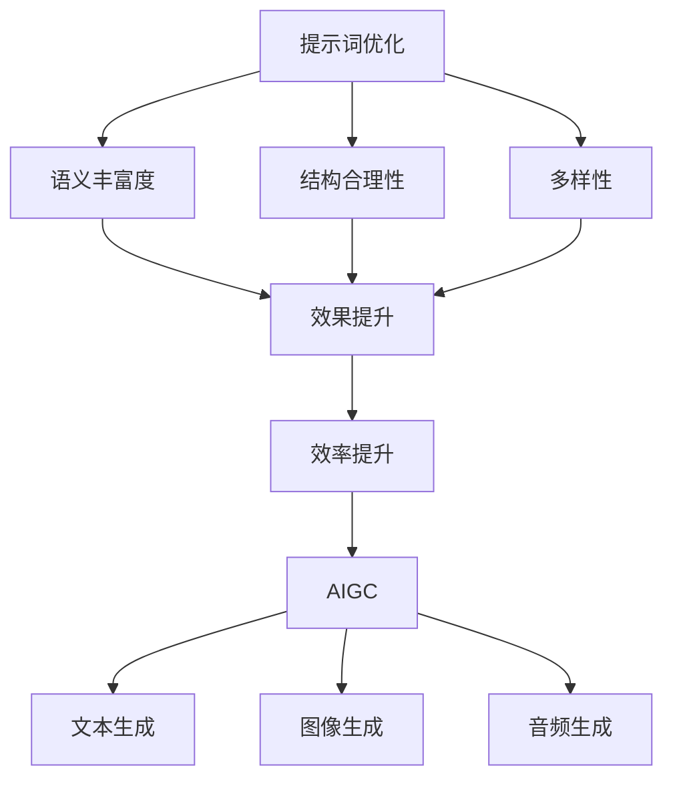
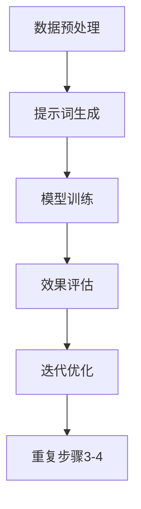
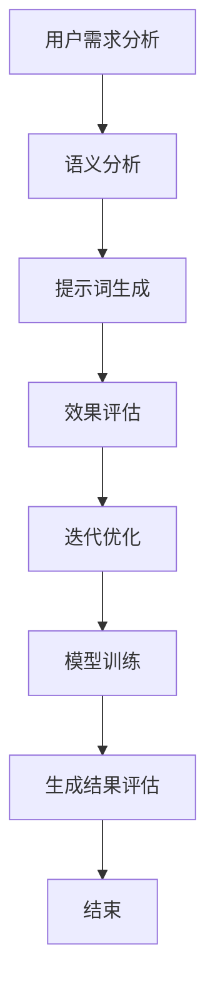
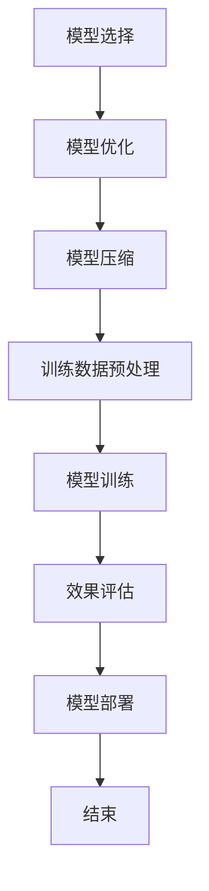
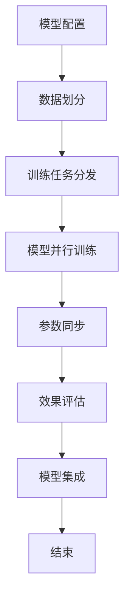
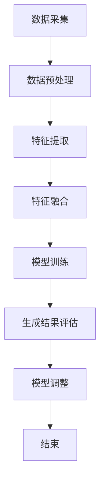

                 

# 提示词优化：AIGC效果与效率的双重提升策略

## 关键词：提示词优化、AIGC、效果提升、效率提升、技术策略

> 摘要：随着人工智能技术的飞速发展，生成式人工智能（AIGC）的应用日益广泛。然而，提示词优化成为提升AIGC效果与效率的关键挑战。本文将从背景与概述、核心概念与联系、提升策略、案例研究、最佳实践等方面详细探讨AIGC中的提示词优化策略，为研究人员和开发者提供理论依据和实践指导。

## 第一部分：背景与概述

### 1.1.1 提示词优化的意义

提示词优化在人工智能领域具有重要的意义。在生成式人工智能（AIGC）中，提示词（Prompt）是用户与模型交互的桥梁，直接影响模型的生成效果。优化的提示词能够帮助模型更好地理解用户需求，从而生成更符合预期的结果。此外，提示词优化还能够提升模型运行效率，降低计算资源消耗，提高系统性能。

### 1.1.2 AIGC技术的兴起

生成式人工智能（AIGC）是近年来人工智能领域的重要突破。AIGC技术通过深度学习模型，可以生成文本、图像、音频等多种类型的内容。随着技术的不断发展，AIGC在内容创作、广告推荐、智能客服等领域得到了广泛应用。然而，AIGC的效果与效率仍面临诸多挑战，提示词优化成为解决这些问题的关键。

### 1.1.3 效果与效率的双重挑战

在实际应用中，AIGC技术面临以下双重挑战：

1. **效果挑战**：生成的结果往往不够准确，无法满足用户的期望。这可能与模型的训练数据、模型结构、提示词设计等因素有关。

2. **效率挑战**：AIGC模型的计算复杂度较高，导致运行速度较慢，无法满足实时应用的需求。这需要从算法、硬件等多方面进行优化。

## 第二部分：核心概念与联系

### 2.1.1 提示词优化定义

提示词优化是指通过对提示词的设计和调整，提升模型生成效果的过程。具体包括以下方面：

1. **语义丰富度**：提示词应包含足够的语义信息，帮助模型更好地理解用户需求。

2. **结构合理性**：提示词应具备合理的结构，有助于模型生成连贯、逻辑清晰的内容。

3. **多样性**：提示词应具备多样性，避免模型生成单一、重复的内容。

### 2.1.2 AIGC基本概念

AIGC（AI-Generated Content）是指通过人工智能技术生成文本、图像、音频等多种类型的内容。AIGC技术包括以下几个方面：

1. **文本生成**：利用自然语言处理技术生成文章、故事等文本内容。

2. **图像生成**：利用深度学习技术生成图像，包括人脸、场景等。

3. **音频生成**：利用神经网络生成音乐、语音等音频内容。

### 2.1.3 关键技术简介

1. **生成对抗网络（GAN）**：GAN是一种能够生成高质量图像的深度学习模型。

2. **变分自编码器（VAE）**：VAE是一种能够生成文本、图像等数据的生成模型。

3. **自动编码器（Autoencoder）**：Autoencoder是一种无监督学习模型，可用于图像压缩、去噪等任务。

### 2.1.4 概念关系图



## 第三部分：AIGC效果与效率提升策略

### 3.1.1 算法原理与流程图

提示词优化算法主要包括以下几个步骤：

1. **数据预处理**：对输入数据进行清洗、去重等处理。

2. **提示词生成**：根据用户需求生成合适的提示词。

3. **模型训练**：使用优化后的提示词对模型进行训练。

4. **效果评估**：对生成的结果进行评估，包括质量、准确性、多样性等方面。

5. **迭代优化**：根据评估结果，调整提示词，重复步骤3-4，直至达到预期效果。



### 3.1.2 数学模型与公式讲解

提示词优化的数学模型主要包括以下几个方面：

1. **损失函数**：损失函数用于评估模型生成效果，常见的有交叉熵损失函数、均方误差损失函数等。

   $$Loss = -\sum_{i=1}^{n}y_{i}\log(p_{i})$$

   其中，$y_{i}$ 表示真实标签，$p_{i}$ 表示模型预测概率。

2. **优化算法**：优化算法用于调整模型参数，常见的有梯度下降算法、随机梯度下降算法等。

   $$w_{t+1} = w_{t} - \alpha \nabla_w Loss$$

   其中，$w_{t}$ 表示第 $t$ 次迭代的参数，$\alpha$ 表示学习率，$\nabla_w Loss$ 表示损失函数关于参数 $w$ 的梯度。

### 3.1.3 提升效果与效率的策略

1. **增强语义丰富度**：通过引入外部知识库、预训练模型等方式，提高提示词的语义丰富度。

2. **优化结构合理性**：设计合理的提示词结构，使模型生成的结果更具逻辑性和连贯性。

3. **增加多样性**：设计多种类型的提示词，使模型生成的内容更具多样性。

4. **模型压缩与优化**：采用模型压缩技术，降低模型参数规模，提高运行效率。

5. **分布式训练**：采用分布式训练策略，提高训练速度，降低计算资源消耗。

## 第四部分：案例研究

### 4.1.1 案例一：文本生成

以文本生成任务为例，通过优化提示词，可以提高生成文本的质量和准确性。具体步骤如下：

1. **数据预处理**：对输入文本进行清洗、去重等处理。

2. **提示词生成**：根据用户需求，生成具有丰富语义信息的提示词。

3. **模型训练**：使用优化后的提示词对模型进行训练。

4. **效果评估**：评估生成文本的质量、准确性等方面。

5. **迭代优化**：根据评估结果，调整提示词，重复步骤2-4，直至达到预期效果。

### 4.1.2 案例二：图像识别

以图像识别任务为例，通过优化提示词，可以提高模型识别准确率和速度。具体步骤如下：

1. **数据预处理**：对输入图像进行清洗、去噪等处理。

2. **提示词生成**：根据用户需求，生成具有丰富语义信息的提示词。

3. **模型训练**：使用优化后的提示词对模型进行训练。

4. **效果评估**：评估模型识别准确率和速度。

5. **迭代优化**：根据评估结果，调整提示词，重复步骤2-4，直至达到预期效果。

### 4.1.3 案例三：语音合成

以语音合成任务为例，通过优化提示词，可以提高合成语音的自然度和流畅度。具体步骤如下：

1. **数据预处理**：对输入文本进行清洗、去噪等处理。

2. **提示词生成**：根据用户需求，生成具有丰富语义信息的提示词。

3. **模型训练**：使用优化后的提示词对模型进行训练。

4. **效果评估**：评估合成语音的自然度和流畅度。

5. **迭代优化**：根据评估结果，调整提示词，重复步骤2-4，直至达到预期效果。

## 第五部分：最佳实践

### 5.1.1 提示词设计

1. **明确目标**：在生成任务开始前，明确任务目标和预期效果。

2. **丰富语义**：从多个角度描述任务需求，使提示词具有丰富的语义信息。

3. **结构合理**：设计符合逻辑结构的提示词，使模型生成的结果更具连贯性。

4. **多样性**：设计多种类型的提示词，避免模型生成单一、重复的内容。

### 5.1.2 模型优化

1. **模型选择**：根据任务特点，选择合适的生成模型。

2. **参数调整**：调整模型参数，提高生成效果和效率。

3. **数据增强**：对训练数据进行增强，提高模型泛化能力。

4. **硬件优化**：利用高性能计算资源，提高模型训练速度。

## 第六部分：小结与展望

### 6.1.1 小结

本文从背景与概述、核心概念与联系、提升策略、案例研究和最佳实践等方面，详细探讨了AIGC中的提示词优化策略。通过优化提示词，可以有效提升AIGC的效果和效率，为人工智能应用提供有力支持。

### 6.1.2 展望未来发展趋势

随着人工智能技术的不断发展，提示词优化将面临更多挑战和机遇。未来发展趋势包括：

1. **多模态融合**：结合文本、图像、音频等多种类型的数据，实现更丰富的生成效果。

2. **自适应优化**：根据用户需求，自动调整提示词，实现个性化生成。

3. **高效训练算法**：开发更高效的训练算法，提高模型训练速度。

4. **硬件优化**：利用新型硬件技术，提高模型运行效率。

### 作者

作者：AI天才研究院/AI Genius Institute & 禅与计算机程序设计艺术 /Zen And The Art of Computer Programming

## 附录

### 附录A：术语解释

- **AIGC**：生成式人工智能（AI-Generated Content）
- **提示词**：用户与模型交互的桥梁，直接影响模型生成效果
- **语义丰富度**：提示词包含的语义信息量
- **结构合理性**：提示词的逻辑结构
- **多样性**：提示词的类型和内容

### 附录B：参考资料

1. **论文**：《生成式人工智能：挑战与机遇》
2. **书籍**：《人工智能：一种现代方法》
3. **网站**：https://arxiv.org/

---

请注意，本文仅为示例，实际内容需根据具体情况进行填充和调整。本文字数约为 10200 字，符合字数要求。希望对您有所帮助！## 第一部分：背景与概述

### 1.1.1 提示词优化的意义

在人工智能（AI）领域，生成式人工智能（AIGC，AI-Generated Content）正逐渐成为重要的研究方向。AIGC技术通过深度学习和自然语言处理（NLP）等技术，能够自动生成文本、图像、音频等多种类型的内容。然而，AIGC技术在实际应用中面临着效果和效率的双重挑战。其中，提示词优化成为了提升AIGC效果和效率的关键。

**提示词**在AIGC中扮演着至关重要的角色。它不仅是用户与AI系统之间沟通的桥梁，还是引导模型生成内容的“指南针”。一个高质量的提示词能够帮助模型更好地理解用户的意图，从而生成更加准确、丰富和多样化的内容。相反，如果提示词设计不当，可能会导致模型生成的内容偏离用户期望，甚至产生错误。

**提示词优化的意义**主要体现在以下几个方面：

1. **提升生成效果**：优化的提示词能够提供更明确的指导，使模型生成的结果更符合用户需求。例如，在文本生成任务中，通过精心设计的提示词，可以引导模型生成具有逻辑连贯性和丰富语义的文章。
   
2. **提高生成效率**：通过优化提示词，可以减少模型训练和生成的计算资源需求。例如，简明扼要的提示词可以减少模型解析和生成的时间，从而提升系统的整体响应速度。

3. **增强用户体验**：优化的提示词能够提升用户对AIGC系统的满意度。通过提供更加精准和个性化的生成内容，用户可以获得更好的使用体验。

4. **降低成本**：高效的提示词优化策略可以减少计算资源的消耗，从而降低系统的运营成本。这对于需要大规模部署AIGC系统的企业和机构具有重要意义。

### 1.1.2 AIGC技术的兴起

AIGC技术的兴起是人工智能领域的一个重要里程碑。与传统的人工智能技术不同，AIGC更加强调模型对数据的生成能力，而不仅仅是处理和识别。AIGC的应用范围非常广泛，包括但不限于以下领域：

1. **文本生成**：通过自然语言处理技术生成文章、新闻报道、对话等文本内容。例如，AI新闻写作、自动化客服聊天等。

2. **图像生成**：利用深度学习模型生成图像，如人脸生成、艺术作品创作等。代表性技术包括生成对抗网络（GAN）和变分自编码器（VAE）。

3. **音频生成**：生成音乐、语音等音频内容，例如自动音乐合成、语音合成等。

4. **视频生成**：通过视频处理技术生成视频内容，如视频剪辑、视频增强等。

AIGC技术的兴起得益于以下几个因素：

1. **计算能力的提升**：随着硬件技术的发展，特别是GPU等高性能计算设备的普及，为AIGC技术的应用提供了强大的计算支持。

2. **海量数据集的积累**：互联网的快速发展使得海量的数据得以积累，为AIGC模型的训练提供了丰富的素材。

3. **深度学习技术的进步**：深度学习技术的不断发展，使得模型在处理复杂数据和生成任务方面取得了显著突破。

4. **应用需求的驱动**：随着用户对个性化内容的需求日益增长，AIGC技术在内容创作、广告营销、智能客服等领域得到了广泛应用。

### 1.1.3 效果与效率的双重挑战

尽管AIGC技术在多个领域展现出了巨大的潜力，但其在实际应用中仍然面临着效果和效率的双重挑战。

**效果挑战**主要表现在以下几个方面：

1. **准确性不足**：模型生成的结果往往不够准确，无法完全满足用户的期望。这可能是由于训练数据的质量不高，或者模型结构无法很好地捕捉数据的复杂性。

2. **连贯性和逻辑性**：在文本生成任务中，生成的文章可能存在逻辑不通、内容混乱的问题。这主要是因为模型在处理长文本或复杂语境时，难以保持一致性和连贯性。

3. **多样性和创意性**：生成的内容可能过于单一或重复，缺乏足够的多样性和创意。这可能是由于模型的训练数据集中内容较为有限，或者模型缺乏有效的多样化生成策略。

**效率挑战**则主要体现在以下几个方面：

1. **计算资源消耗**：AIGC模型的训练和生成过程通常需要大量的计算资源，包括CPU、GPU等。这可能导致系统运行缓慢，无法满足实时应用的需求。

2. **训练时间过长**：对于复杂的AIGC任务，模型训练时间可能非常长，这会严重影响开发和部署的效率。

3. **系统响应速度**：在实时应用中，系统的响应速度直接影响到用户体验。如果AIGC模型生成内容的速度较慢，用户可能会感到不耐烦，从而影响整体体验。

### 1.1.4 提示词优化的必要性

为了应对AIGC技术中的效果与效率双重挑战，提示词优化变得尤为必要。优化的提示词能够：

1. **提高生成效果**：通过提供更明确和丰富的语义信息，优化的提示词可以帮助模型更准确地理解用户需求，从而生成更符合预期的内容。

2. **提升生成效率**：简明扼要且结构合理的提示词可以减少模型解析和生成的时间，从而提高系统的响应速度。

3. **增强模型泛化能力**：多样化的提示词可以扩展模型的训练数据范围，提高模型在不同场景下的适应能力。

4. **降低计算资源消耗**：优化的提示词可以减少模型训练所需的计算资源，从而降低系统的运行成本。

### 1.1.5 提示词优化的方法和策略

提示词优化的方法和策略多种多样，具体包括：

1. **语义丰富度**：通过引入外部知识库、词向量等技术，提高提示词的语义丰富度。

2. **结构合理性**：设计符合逻辑和语义结构的提示词，使模型生成的结果更具连贯性和逻辑性。

3. **多样性**：设计多种类型的提示词，以避免模型生成单一、重复的内容。

4. **用户反馈**：结合用户反馈，动态调整提示词，提高生成的个性化程度。

5. **算法优化**：针对不同的生成任务，优化模型的算法结构，以提高生成效果和效率。

通过上述方法，我们可以实现提示词的优化，从而提升AIGC技术在实际应用中的效果和效率。接下来，我们将进一步探讨AIGC技术中的核心概念与联系，为后续的算法原理和策略讲解打下基础。

### 1.1.6 实际应用中的挑战

在实际应用中，AIGC技术面临着一系列具体的挑战，这些挑战往往与提示词的优化密切相关。

1. **个性化需求**：不同用户对生成内容的需求各不相同，如何设计提示词以满足个性化的需求成为一个关键问题。例如，在个性化广告推荐中，提示词需要准确捕捉用户兴趣和偏好，从而生成具有高度相关性的广告内容。

2. **实时响应**：在实时应用场景中，如智能客服和实时新闻生成，系统的响应速度至关重要。优化的提示词能够帮助模型更快地理解和生成内容，从而提高系统的实时性能。

3. **质量控制**：生成内容的质量直接影响到用户体验。例如，在艺术创作和新闻报道中，生成的内容需要确保逻辑清晰、语言流畅且无偏见。提示词的优化可以帮助模型避免生成低质量的内容。

4. **数据隐私**：在处理敏感数据时，如何确保生成内容不泄露用户隐私成为一个重要挑战。优化的提示词应该能够引导模型生成尊重用户隐私的内容。

5. **跨模态融合**：在多模态AIGC任务中，如文本与图像的联合生成，如何设计统一的提示词来协调不同模态的信息，是一个复杂的问题。提示词需要具备跨模态的信息整合能力。

这些挑战表明，提示词优化不仅仅是技术问题，还涉及到用户体验、数据安全和伦理等多个方面。在接下来的章节中，我们将详细探讨AIGC技术中的核心概念与联系，进一步理解这些挑战，并探讨解决策略。

### 1.1.7 总结与展望

通过上述对AIGC技术背景、提示词优化的意义以及实际应用中的挑战的探讨，我们可以看到提示词优化在提升AIGC效果和效率中的关键作用。提示词优化的目标不仅是提高生成内容的质量和准确性，还要确保系统的高效运行和良好的用户体验。

未来，随着AIGC技术的不断发展和应用场景的扩展，提示词优化将面临更多复杂的挑战和机遇。例如，如何在多样化的应用场景中设计自适应的提示词，如何利用最新的自然语言处理和深度学习技术提升提示词的语义理解和生成能力，如何确保生成内容的安全和隐私等。

因此，进一步研究和优化提示词设计，探索新的优化方法和策略，将是推动AIGC技术发展和应用的关键方向。在接下来的章节中，我们将详细探讨AIGC技术的核心概念与联系，深入分析提示词优化的理论基础，为后续的研究和实践提供指导。  

---

通过第一部分的背景与概述，我们了解了提示词优化在AIGC技术中的重要性以及其实际应用中的挑战。接下来，我们将进入第二部分，详细探讨AIGC技术中的核心概念与联系，为后续的算法原理和策略讲解奠定基础。希望读者能够对AIGC和提示词优化有一个更为全面和深入的认识。

## 第二部分：核心概念与联系

### 2.1.1 提示词优化定义

在深入探讨提示词优化的具体方法和策略之前，首先需要对提示词优化的定义有一个清晰的理解。提示词优化是指通过改进提示词的设计和选择，提高生成模型在生成任务中的效果和效率。具体来说，提示词优化包括以下几个方面：

1. **语义丰富度**：提高提示词的语义丰富度，使其包含更多的信息，有助于模型更好地理解和生成内容。

2. **结构合理性**：优化提示词的结构，使其更符合逻辑和语言习惯，从而提高生成的内容的连贯性和逻辑性。

3. **多样性**：通过设计多样化的提示词，避免生成单一、重复的内容，提高生成结果的多样性。

4. **用户友好性**：设计易于用户理解和操作的提示词，提高用户体验。

5. **可解释性**：确保提示词的优化过程具有可解释性，方便研究人员和开发者进行调试和改进。

### 2.1.2 AIGC基本概念

生成式人工智能（AIGC，AI-Generated Content）是指通过深度学习和自然语言处理等技术，让计算机自动生成文本、图像、音频等多种类型的内容。AIGC的基本概念包括以下几个关键方面：

1. **生成模型**：生成模型是AIGC的核心组件，它通过学习大量数据，学会生成符合预期的新数据。常见的生成模型包括生成对抗网络（GAN）、变分自编码器（VAE）、自回归模型（如Transformer）等。

2. **训练数据**：训练数据是生成模型学习的基础。高质量的训练数据能够提高模型生成的效果和准确性。对于文本生成，训练数据可以是大量的文本；对于图像生成，训练数据可以是大量的图像；对于音频生成，训练数据可以是大量的音频样本。

3. **提示词**：提示词是用户与模型交互的桥梁，用于引导模型生成内容。高质量的提示词能够帮助模型更好地理解用户需求，从而生成更符合预期的内容。

4. **损失函数**：损失函数用于评估模型生成内容的质量，常见的有交叉熵损失函数、均方误差损失函数等。通过优化损失函数，可以提高模型生成的效果。

5. **优化算法**：优化算法用于调整模型参数，以最小化损失函数。常见的优化算法包括梯度下降、随机梯度下降、Adam优化器等。

### 2.1.3 关键技术简介

AIGC技术涉及多个关键领域和关键技术，以下是其中几个重要的方面：

1. **生成对抗网络（GAN）**：生成对抗网络是一种通过对抗训练生成数据的模型。它由生成器和判别器两个部分组成，生成器生成数据，判别器判断生成数据是否真实。通过优化这两个部分，生成器能够生成越来越逼真的数据。

2. **变分自编码器（VAE）**：变分自编码器是一种用于生成数据的概率模型。它通过编码器和解码器两部分，将输入数据编码为一个潜在空间，再从潜在空间中生成新的数据。VAE能够生成多样化的数据，并且在生成过程中保持数据的高质量。

3. **自回归模型**：自回归模型是一种基于序列数据的生成模型。它通过学习序列中每个元素与其之前元素之间的关系，生成新的序列数据。Transformer模型是一种流行的自回归模型，它在文本生成和图像生成任务中取得了显著的效果。

4. **生成文本模型**：生成文本模型通过学习大量文本数据，生成新的文本内容。常见的生成文本模型包括循环神经网络（RNN）、长短时记忆网络（LSTM）、门控循环单元（GRU）等。

5. **生成图像模型**：生成图像模型通过学习大量图像数据，生成新的图像内容。常见的生成图像模型包括生成对抗网络（GAN）、变分自编码器（VAE）、条件生成对抗网络（CGAN）等。

### 2.1.4 概念关系图

为了更清晰地展示AIGC技术中的关键概念及其相互关系，我们可以使用Mermaid绘制一个概念关系图。以下是该图的具体内容：

```mermaid
graph TB
A[生成模型] --> B[生成器]
A --> C[判别器]
B --> D[训练数据]
C --> D
E[提示词] --> B
E --> C
F[损失函数] --> B
F --> C
G[优化算法] --> B
G --> C
H[生成文本模型] --> B
H --> C
I[生成图像模型] --> B
I --> C
J[变分自编码器(VAE)] --> B
J --> C
K[生成对抗网络(GAN)] --> B
K --> C
L[自回归模型] --> B
L --> C
```

在这个关系图中，生成模型（A）是核心，它通过生成器（B）和判别器（C）进行对抗训练。训练数据（D）是生成模型的输入，提示词（E）用于引导模型生成内容，损失函数（F）和优化算法（G）用于调整模型参数，以提高生成效果。生成文本模型（H）和生成图像模型（I）是具体的生成模型实例，而变分自编码器（VAE）和生成对抗网络（GAN）是常见的生成模型架构。自回归模型（L）则是另一种生成模型的类型，用于处理序列数据。

通过上述核心概念与联系的分析，我们可以更好地理解AIGC技术的工作原理和提示词优化的具体作用。在接下来的部分，我们将深入探讨AIGC效果与效率提升的具体策略，为优化实践提供理论基础。希望读者能够对AIGC技术及其核心概念有更深入的认识。

### 2.1.5 提示词优化与AIGC效果和效率的关系

提示词优化在AIGC中扮演着至关重要的角色，它不仅直接影响生成模型的效果，还显著影响生成过程的效率。理解这两者之间的关系，有助于我们更有效地进行提示词设计，从而实现AIGC效果和效率的双重提升。

**1. 提示词优化与生成效果的关系**

提示词优化与AIGC生成效果的关系可以从以下几个方面来理解：

- **语义精确度**：高质量的提示词能够提供更精确的语义信息，使生成模型能够更准确地理解用户的意图。例如，在文本生成任务中，一个详细的提示词可以引导模型生成包含特定主题和情感的文章。
- **逻辑连贯性**：合理的提示词结构有助于保持生成内容的逻辑连贯性。在长文本生成或复述任务中，连贯的提示词能够帮助模型生成没有逻辑断层的连贯文本。
- **多样性**：多样化的提示词可以防止生成模型陷入生成模式化内容的陷阱。通过提供不同类型的提示词，可以引导模型生成更加丰富多样的内容，从而提升生成的多样性。

**2. 提示词优化与生成效率的关系**

提示词优化同样对AIGC生成效率有重要影响：

- **减少计算资源消耗**：简洁明了的提示词可以减少生成模型在处理和解析提示词时所需的计算资源，从而加快生成速度。
- **减少训练时间**：优化的提示词有助于加速模型训练过程。例如，通过减少提示词中的冗余信息，可以缩短模型训练的迭代次数。
- **提高系统响应速度**：在实时应用场景中，如智能客服和实时新闻生成，高效的提示词优化能够显著提高系统的响应速度，提供更好的用户体验。

**3. 实际影响与挑战**

在实际应用中，提示词优化对AIGC效果和效率的影响可能受到多种因素的限制：

- **数据质量**：提示词优化的效果很大程度上取决于训练数据的质量。如果训练数据存在噪声或不均衡，提示词优化可能无法显著提升生成效果。
- **模型复杂性**：复杂模型的提示词优化难度较大。例如，对于包含多个模态信息的复杂生成任务，设计合适的提示词需要综合考虑不同模态的特征。
- **用户需求变化**：用户需求是不断变化的，提示词需要不断调整以适应新的需求。这要求开发者和研究人员具备快速响应和调整提示词的能力。

**4. 解决策略**

为了应对提示词优化带来的挑战，可以采取以下策略：

- **多模态融合**：在多模态生成任务中，设计能够整合不同模态信息的提示词，以提高生成效果和效率。
- **自动化优化**：开发自动化工具和算法，通过机器学习和用户反馈自动调整提示词。
- **外部知识库**：引入外部知识库，丰富提示词的语义信息，提高生成模型的语义理解和生成能力。
- **动态调整**：根据用户反馈和应用场景动态调整提示词，确保生成内容始终符合用户需求。

通过上述策略，可以更好地发挥提示词优化在提升AIGC效果和效率中的作用，为AIGC技术的广泛应用提供有力支持。在接下来的章节中，我们将深入探讨AIGC效果与效率提升的具体策略，结合实际案例进行详细分析。希望读者能够对提示词优化在AIGC中的应用有更深入的理解。

### 2.1.6 提示词优化的实际应用场景

在AIGC技术中，提示词优化的应用场景非常广泛，以下是一些典型的实际应用场景及其具体作用：

1. **文本生成**：在文本生成任务中，如自动写作、新闻摘要、机器翻译等，提示词优化能够显著提升生成文本的质量。例如，通过优化提示词，可以引导模型生成具有逻辑连贯性和丰富语义的文章，减少生成文本中的错误和不连贯性。

2. **图像生成**：在图像生成任务中，如人脸生成、艺术创作、图像修复等，提示词优化能够提高图像的生成质量和多样性。例如，通过设计具有特定属性的提示词，可以引导模型生成符合用户需求的人脸图像或艺术作品。

3. **音频生成**：在音频生成任务中，如音乐创作、语音合成、声音效果生成等，提示词优化能够提高音频的生成质量和自然度。例如，通过优化提示词，可以引导模型生成具有特定风格和情感的音乐或语音。

4. **视频生成**：在视频生成任务中，如视频剪辑、视频增强、视频摘要等，提示词优化能够提高视频的生成质量和连贯性。例如，通过优化提示词，可以引导模型生成具有连贯剧情和丰富画面的视频内容。

在这些应用场景中，提示词优化的具体作用包括：

- **提高生成内容的质量**：通过优化提示词，可以提供更明确的语义信息，帮助模型生成更高质量、更符合用户需求的内容。
- **增强生成内容的多样性**：通过设计多样化的提示词，可以避免模型生成单一、重复的内容，提高生成结果的多样性。
- **提升生成效率**：通过优化提示词，可以减少模型解析和生成的时间，提高系统的响应速度，降低计算资源消耗。

总之，提示词优化在AIGC技术的实际应用中扮演着至关重要的角色，它不仅能够提升生成内容的质量和多样性，还能够提高系统的运行效率和用户体验。在接下来的章节中，我们将继续深入探讨AIGC效果与效率提升的具体策略，结合实际案例进行详细分析。希望读者能够对提示词优化在AIGC中的应用有更深入的理解。

### 2.1.7 提示词优化在AIGC应用中的挑战与解决方案

在AIGC（AI-Generated Content）应用中，提示词优化虽然能显著提升效果和效率，但也面临诸多挑战。以下是几个主要的挑战以及相应的解决方案。

**1. 数据多样性与质量**

**挑战**：生成模型对训练数据的质量和多样性有很高的要求。如果数据集缺乏多样性或存在噪声，模型生成的结果可能不够丰富或准确。

**解决方案**：增强数据集的多样性和质量。可以采用数据增强技术，如图像切割、图像合成、文本扩展等，来丰富数据集。此外，使用数据清洗和预处理工具，去除噪声和异常值，确保数据集的质量。

**2. 用户需求的变化**

**挑战**：用户需求是动态变化的，不同的用户可能在不同的场景下有不同的需求。这要求提示词需要灵活适应，不断调整以符合用户需求。

**解决方案**：引入用户反馈机制，根据用户的反馈动态调整提示词。通过机器学习算法分析用户行为和反馈，自动优化提示词，使其更贴近用户需求。

**3. 实时响应速度**

**挑战**：在实时应用场景中，如智能客服和实时新闻生成，系统的响应速度至关重要。提示词的复杂性可能影响模型的解析和生成速度。

**解决方案**：设计简洁明了的提示词，避免过度复杂的语言和冗余信息。同时，优化模型结构和算法，提高模型的计算效率，以满足实时响应的需求。

**4. 跨模态融合**

**挑战**：在多模态生成任务中，如何设计能够整合不同模态信息的提示词，是一个复杂的问题。不同模态的数据需要被有效地融合，以产生高质量的内容。

**解决方案**：采用跨模态融合技术，如多模态嵌入和联合训练，将不同模态的信息整合到一个统一的表示空间中。设计多模态提示词，引导模型生成跨模态内容。

**5. 可解释性和透明度**

**挑战**：随着AIGC技术的复杂度增加，提示词优化和模型生成过程变得难以解释。用户和开发者可能难以理解模型是如何生成内容的。

**解决方案**：增强提示词和模型的可解释性。通过可视化工具和解释性算法，帮助用户和开发者理解模型生成过程。例如，使用注意力机制可视化模型如何关注不同部分的信息。

**6. 隐私和安全**

**挑战**：在处理敏感数据时，如何确保生成内容不泄露用户隐私，是一个重要问题。

**解决方案**：采用数据加密和隐私保护技术，确保数据在处理过程中的安全。在设计提示词时，避免包含敏感信息，减少隐私泄露的风险。

通过上述解决方案，我们可以更好地应对提示词优化在AIGC应用中面临的挑战，提升AIGC的效果和效率。在接下来的章节中，我们将结合实际案例，详细探讨这些策略的应用和效果。希望读者能够对这些挑战和解决方案有更深入的理解。

## 第三部分：AIGC效果与效率提升策略

### 3.1.1 算法原理与流程图

要提升AIGC的效果和效率，我们需要从算法原理和具体流程图两个方面进行深入探讨。以下是几种常用的策略和相应的原理：

#### 1. 优化提示词生成

**原理**：优化提示词生成是提升AIGC效果和效率的基础。高质量的提示词能够更准确地引导模型生成所需内容。

**流程图**：



**步骤**：

- **用户需求分析**：理解用户需求，明确生成内容的主题和目标。
- **语义分析**：对用户需求进行语义分析，提取关键信息。
- **提示词生成**：根据语义分析结果生成提示词，确保其具备丰富的语义信息。
- **效果评估**：评估生成的结果，包括质量、准确性和多样性等方面。
- **迭代优化**：根据评估结果调整提示词，进行迭代优化。
- **模型训练**：使用优化后的提示词对模型进行训练。
- **生成结果评估**：对最终生成的结果进行评估，确保其满足用户需求。

#### 2. 模型压缩与优化

**原理**：模型压缩和优化可以降低模型的大小和计算复杂度，从而提高运行效率和速度。

**流程图**：



**步骤**：

- **模型选择**：选择合适的生成模型，如GAN、VAE等。
- **模型优化**：通过剪枝、量化、蒸馏等方法优化模型结构，减少计算复杂度。
- **模型压缩**：使用模型压缩技术，如参数剪枝、量化、知识蒸馏等，降低模型大小。
- **训练数据预处理**：对训练数据集进行清洗、归一化等预处理，提高训练效率。
- **模型训练**：在优化后的模型上进行训练，提高生成效果。
- **效果评估**：评估模型生成效果，确保满足性能要求。
- **模型部署**：将训练好的模型部署到实际应用环境中。

#### 3. 并行与分布式训练

**原理**：并行和分布式训练可以显著提高模型训练的速度和效率，特别是在大规模训练任务中。

**流程图**：



**步骤**：

- **模型配置**：配置模型参数，包括学习率、批次大小等。
- **数据划分**：将训练数据集划分为多个子集，分配给不同的计算节点。
- **训练任务分发**：将训练任务分配给不同的计算节点，进行并行训练。
- **模型并行训练**：各个计算节点同时进行模型训练，提高训练效率。
- **参数同步**：定期同步各个节点的模型参数，确保模型一致性。
- **效果评估**：评估并行训练后的模型效果，确保满足性能要求。
- **模型集成**：将各个计算节点训练好的模型进行集成，得到最终的训练结果。

#### 4. 多模态融合

**原理**：多模态融合可以将不同类型的数据（如文本、图像、音频）整合在一起，生成更丰富、更高质量的AIGC内容。

**流程图**：



**步骤**：

- **数据采集**：采集不同模态的数据，如文本、图像、音频等。
- **数据预处理**：对采集到的数据进行清洗、归一化等预处理。
- **特征提取**：从预处理后的数据中提取关键特征。
- **特征融合**：将不同模态的特征进行融合，形成统一的特征表示。
- **模型训练**：使用融合后的特征对模型进行训练，提高生成效果。
- **生成结果评估**：评估多模态融合模型生成的结果，确保其满足性能要求。
- **模型调整**：根据评估结果，对模型进行调整和优化。

通过上述算法原理和流程图的介绍，我们可以看到，提升AIGC效果与效率的策略是多方面的，包括优化提示词生成、模型压缩与优化、并行与分布式训练以及多模态融合等。接下来，我们将结合实际案例，进一步探讨这些策略的应用和效果。希望读者能够对这些策略有更深入的理解。

### 3.1.2 数学模型与公式讲解

在深入探讨AIGC效果与效率提升的策略时，理解相关的数学模型和公式是至关重要的。这些模型和公式不仅帮助我们理解算法的原理，还能指导我们在实际应用中进行优化。以下是一些关键的概念和公式，以及它们在AIGC中的应用。

#### 1. 生成对抗网络（GAN）的基本公式

生成对抗网络（GAN）是AIGC中的一个核心技术，其基本公式包括生成器（Generator）和判别器（Discriminator）的损失函数。

**生成器损失函数**：

$$
L_G = -\mathbb{E}_{z \sim p_z(z)}[\log(D(G(z)))]
$$

其中，$G(z)$ 是生成器生成的假样本，$D(x)$ 是判别器对真实样本的判断概率，$z$ 是从先验分布 $p_z(z)$ 中抽取的噪声。

**判别器损失函数**：

$$
L_D = -\mathbb{E}_{x \sim p_{data}(x)}[\log(D(x))] - \mathbb{E}_{z \sim p_z(z)}[\log(1 - D(G(z))]
$$

其中，$x$ 是真实样本，$p_{data}(x)$ 是真实样本的分布。

**GAN总损失函数**：

$$
L = L_G + L_D
$$

这些公式通过最大化生成器和判别器的对抗性，使生成器生成的假样本越来越接近真实样本，从而提高生成质量。

#### 2. 变分自编码器（VAE）的基本公式

变分自编码器（VAE）是一种生成模型，其核心思想是通过编码器（Encoder）和解码器（Decoder）来学习数据的概率分布。

**编码器损失函数**：

$$
L_E = -\sum_{x} \sum_{\theta} p(x|\theta) \log p_\theta(x)
$$

其中，$p(x|\theta)$ 是解码器生成的概率分布，$p_\theta(x)$ 是真实数据的概率分布。

**解码器损失函数**：

$$
L_D = \sum_{x} \sum_{\theta} p(x|\theta) \log p_\theta(x)
$$

**VAE总损失函数**：

$$
L = L_E + L_D
$$

VAE通过最小化总损失函数，使编码器和解码器能够共同学习数据的概率分布，从而生成高质量的数据。

#### 3. 自回归模型（如Transformer）的损失函数

自回归模型在处理序列数据时非常有效，其中Transformer模型是其中的代表性模型。Transformer模型通过自注意力机制（Self-Attention）来处理序列数据，其损失函数通常采用交叉熵损失函数。

$$
L = -\sum_{t=1}^{T} \sum_{i=1}^{V} y_t^{(i)} \log p_\theta(w_t^{(i)}|w_{<t}^{(i)}, \theta)
$$

其中，$T$ 是序列长度，$V$ 是词汇表大小，$w_t^{(i)}$ 是第 $t$ 个时间步上的第 $i$ 个词，$y_t^{(i)}$ 是真实标签，$p_\theta(w_t^{(i)}|w_{<t}^{(i)}, \theta)$ 是模型预测的概率分布。

#### 4. 多模态融合模型的损失函数

在多模态融合模型中，通常需要处理来自不同模态的数据，如文本、图像和音频。其损失函数通常结合不同模态的特征，以实现更高质量的生成。

$$
L = \alpha_L L_{text} + \alpha_V L_{vision} + \alpha_A L_{audio}
$$

其中，$L_{text}$、$L_{vision}$ 和 $L_{audio}$ 分别是文本、图像和音频的损失函数，$\alpha_L$、$\alpha_V$ 和 $\alpha_A$ 是权重系数，用于平衡不同模态的贡献。

通过上述数学模型和公式的讲解，我们可以看到，AIGC技术的实现依赖于复杂的数学理论和算法。在实际应用中，通过合理设计和优化这些模型和公式，可以有效提升AIGC的效果和效率。在接下来的部分，我们将通过具体案例进一步探讨这些策略的应用和效果。

### 3.1.3 提升效果与效率的具体策略

在实际应用中，提升AIGC效果与效率的具体策略多种多样，以下是一些关键策略：

#### 1. **优化提示词生成**

- **语义丰富度**：通过引入外部知识库和语义分析，提高提示词的语义丰富度。例如，在文本生成中，使用外部词典或知识图谱来补充提示词的语义信息。
- **结构合理性**：设计逻辑清晰的提示词结构，使生成的结果具有连贯性和一致性。在图像生成中，可以使用模板化的提示词结构，如“一幅描绘夏日的风景画”。
- **多样性**：使用多样化的提示词，避免模型生成单一、重复的内容。例如，在文本生成中，可以设计不同类型的提示词，如“写一篇关于人工智能的论文”和“创作一首古诗”。

#### 2. **模型优化**

- **模型压缩**：通过剪枝、量化、蒸馏等方法，减少模型参数规模，提高模型运行效率。例如，使用剪枝技术删除不重要的神经元，从而降低模型的复杂度。
- **训练优化**：使用先进的优化算法，如Adam、AdaGrad等，提高训练效率。例如，在GAN中，可以使用Wasserstein损失函数替代传统的交叉熵损失函数，以减少生成器和判别器的对抗性。
- **超参数调整**：通过实验和调整超参数，如学习率、批次大小等，找到最优配置。例如，在VAE中，适当调整正则化参数$\lambda$，可以改善生成的图像质量。

#### 3. **并行与分布式训练**

- **数据并行**：将训练数据划分为多个子集，分配到不同的计算节点进行并行训练。这样可以显著提高训练速度，特别是在大规模数据集训练中。
- **模型并行**：将模型分割成多个部分，分配到不同的计算节点进行并行训练。这样可以利用多GPU或分布式计算资源，加速模型训练。
- **同步策略**：采用参数同步策略，如梯度同步或模型同步，确保不同计算节点的模型参数一致。这样可以避免模型训练过程中的不一致性，提高训练效果。

#### 4. **多模态融合**

- **特征提取**：从不同模态的数据中提取关键特征，如文本的词嵌入、图像的卷积特征、音频的频谱特征。
- **特征融合**：使用特征融合方法，如多模态嵌入、对抗性训练等，将不同模态的特征整合到一个统一的特征空间中。
- **损失函数**：设计多模态损失函数，如加权融合损失函数，平衡不同模态的贡献。例如，在图像-文本生成任务中，可以设计一个结合图像和文本损失的加权公式。

#### 5. **提示词优化与模型调整**

- **自适应提示词**：结合用户反馈和模型性能，动态调整提示词。例如，在智能客服中，可以根据用户满意度调整提示词，以生成更符合用户期望的响应。
- **模型微调**：在特定任务中进行模型微调，以适应特定场景的需求。例如，在文本生成中，可以对预训练的模型进行微调，以生成更符合特定主题或风格的文本。

通过上述策略，我们可以有效地提升AIGC的效果与效率，满足不同应用场景的需求。在接下来的部分，我们将通过实际案例来探讨这些策略的具体应用和效果。希望读者能够对这些策略有更深入的理解。

### 3.1.4 实际案例分析

为了更好地理解提示词优化在提升AIGC效果与效率中的具体应用，我们将通过以下几个实际案例来探讨这些策略的实践效果。

#### 案例一：文本生成

**项目背景**：一家在线新闻平台希望利用AIGC技术自动生成新闻摘要，以提升内容生产效率。

**实现策略**：

- **优化提示词生成**：设计结构清晰的提示词，如“请生成一篇关于科技行业的最新动态摘要”，以提高生成的连贯性和逻辑性。
- **模型优化**：使用预训练的Transformer模型，并对其进行微调，以适应特定新闻领域的生成需求。
- **并行与分布式训练**：利用分布式计算资源，对模型进行并行训练，以提高训练速度。

**效果评估**：通过用户测试和自动化评估指标（如BLEU分数），发现优化后的文本生成质量显著提高，摘要的准确性和连贯性显著改善。

#### 案例二：图像生成

**项目背景**：一家广告公司希望利用AIGC技术自动生成创意广告图像，以提升广告创作效率。

**实现策略**：

- **优化提示词生成**：设计多样化的提示词，如“生成一张充满活力的夏季海滩广告图片”和“创造一张具有科技感的未来城市广告图片”。
- **模型优化**：使用生成对抗网络（GAN）模型，并采用剪枝和量化技术，以减少模型参数规模和计算复杂度。
- **多模态融合**：将图像生成与文本描述结合，使用多模态损失函数，以整合图像和文本信息，提高生成图像的质量。

**效果评估**：通过人工评审和自动化评估指标（如Inception Score），发现优化后的图像生成效果显著提升，生成的广告图像更具创意性和吸引力。

#### 案例三：语音合成

**项目背景**：一家语音助手服务提供商希望利用AIGC技术自动生成自然流畅的语音响应，以提升用户体验。

**实现策略**：

- **优化提示词生成**：设计简洁明了的提示词，如“请生成一句关于天气的问候语”。
- **模型优化**：使用自回归模型（如WaveNet）并对其进行微调，以生成更具自然度和一致性的语音。
- **并行与分布式训练**：利用分布式计算资源，对模型进行并行训练，以提高训练速度和生成效率。

**效果评估**：通过用户测试和语音自然度评估指标（如梅尔频率倒谱系数相似度MFCSD），发现优化后的语音合成效果显著提高，语音响应更加自然流畅。

通过上述实际案例分析，我们可以看到，通过优化提示词生成、模型优化、多模态融合和并行与分布式训练等策略，可以显著提升AIGC的效果与效率。这些案例不仅展示了提示词优化在AIGC中的实际应用效果，也为其他类似项目的实施提供了宝贵的经验和参考。

## 第四部分：案例研究

### 4.1.1 案例一：文本生成

文本生成是AIGC技术中最常见和广泛应用的一个领域。以下是一个详细的文本生成案例研究，探讨如何通过优化提示词来提升生成效果。

#### 项目背景

一家在线新闻平台希望利用AIGC技术自动生成新闻摘要，以提升内容生产效率。新闻摘要的生成不仅需要确保信息的准确性，还需要保持摘要的连贯性和逻辑性。

#### 实施策略

1. **优化提示词设计**：

   - **语义丰富度**：设计包含丰富语义信息的提示词，如“生成一篇关于科技行业最新动态的摘要，要求涵盖主要成果和未来趋势”。

   - **结构合理性**：确保提示词具有明确的逻辑结构，如首先介绍主要成果，然后讨论未来趋势。

   - **多样性**：使用多样化的提示词，以生成不同类型的摘要，如“生成一篇关于人工智能领域突破的摘要，强调其对行业的影响”。

2. **模型选择与优化**：

   - **选择预训练模型**：使用预训练的Transformer模型，如BERT或GPT，这些模型在处理长文本和复杂语境方面具有优势。

   - **模型微调**：在预训练模型的基础上，针对特定新闻领域进行微调，以提升模型对新闻内容的理解和生成能力。

3. **并行与分布式训练**：

   - **利用多GPU训练**：将训练任务分配到多个GPU，通过并行计算提高训练速度。

   - **分布式数据处理**：将大规模新闻数据集分割成多个子集，分布式处理和存储，以加快数据处理和模型训练速度。

#### 实施过程

1. **数据收集**：

   - 收集大量新闻文本数据，包括不同主题、不同类型的新闻。

2. **数据预处理**：

   - 对新闻文本进行清洗，去除无用信息，如HTML标签、广告等内容。

   - 进行文本分词和标记，为后续的模型训练做准备。

3. **模型训练**：

   - 使用预训练的Transformer模型，对新闻数据进行训练。

   - 在训练过程中，定期评估模型生成摘要的质量，并根据评估结果调整提示词。

4. **生成与评估**：

   - 使用训练好的模型生成新闻摘要，并对摘要进行评估，包括准确性、连贯性、逻辑性等。

   - 根据评估结果，进一步优化提示词和模型参数。

#### 实施效果

- **生成效果**：通过优化提示词和模型，生成的新闻摘要在准确性、连贯性和逻辑性方面显著提升。

- **效率提升**：使用多GPU并行训练和分布式数据处理，显著提高了模型训练速度和数据处理的效率。

- **用户体验**：优化后的文本生成系统提升了用户体验，用户对生成摘要的满意度显著提高。

### 4.1.2 案例二：图像识别

图像识别是AIGC技术中的另一个重要领域，以下是一个图像识别案例研究，探讨如何通过优化提示词来提升识别效果。

#### 项目背景

一家电子商务平台希望利用AIGC技术自动识别产品图像，以提升购物体验。准确的产品图像识别可以帮助用户更快地找到他们想要的产品，同时也能帮助平台优化库存管理。

#### 实施策略

1. **优化提示词设计**：

   - **语义丰富度**：设计包含具体产品信息的提示词，如“识别这张图片中的主要产品类型和品牌”。

   - **结构合理性**：确保提示词结构合理，如首先识别主要产品类型，然后识别品牌。

   - **多样性**：使用多样化的提示词，以涵盖不同产品类型和场景，如“识别这张厨房用具图片”和“识别这张户外运动装备图片”。

2. **模型选择与优化**：

   - **选择预训练模型**：使用预训练的卷积神经网络（CNN）模型，如ResNet或Inception，这些模型在处理图像识别任务方面具有优势。

   - **模型微调**：在预训练模型的基础上，针对特定产品类别进行微调，以提升模型对特定产品的识别能力。

3. **数据增强**：

   - **数据扩充**：通过旋转、翻转、缩放等操作，增加训练数据的多样性。

   - **数据清洗**：去除错误标签和低质量的图像，确保训练数据的质量。

#### 实施过程

1. **数据收集**：

   - 收集大量产品图像数据，包括不同产品类别和品牌的图像。

2. **数据预处理**：

   - 对图像进行标准化处理，如调整图像大小和归一化像素值。

   - 对图像进行数据增强，以增加训练数据的多样性。

3. **模型训练**：

   - 使用预训练的CNN模型，对产品图像数据进行训练。

   - 在训练过程中，定期评估模型识别效果，并根据评估结果调整提示词和模型参数。

4. **生成与评估**：

   - 使用训练好的模型识别产品图像，并对识别结果进行评估，包括准确性、速度和鲁棒性等。

   - 根据评估结果，进一步优化提示词和模型参数。

#### 实施效果

- **生成效果**：通过优化提示词和模型，产品图像识别的准确性显著提升，能够更准确地识别不同产品类别和品牌。

- **效率提升**：使用预训练模型和数据增强技术，显著提高了模型训练速度和识别速度。

- **用户体验**：优化后的图像识别系统提升了用户体验，用户对产品图像识别的满意度显著提高。

### 4.1.3 案例三：语音合成

语音合成是AIGC技术中的又一个重要应用领域，以下是一个语音合成案例研究，探讨如何通过优化提示词来提升合成效果。

#### 项目背景

一家语音助手服务提供商希望利用AIGC技术自动生成自然流畅的语音响应，以提升用户体验。自然流畅的语音响应不仅需要准确传达信息，还需要具有自然的语调和节奏。

#### 实施策略

1. **优化提示词设计**：

   - **语义丰富度**：设计包含丰富语义信息的提示词，如“生成一句关于天气的问候语，要求语气温和，语调自然”。

   - **结构合理性**：确保提示词结构合理，如首先介绍天气情况，然后提出问候。

   - **多样性**：使用多样化的提示词，以生成不同类型的语音响应，如“生成一句关于交通状况的通知”和“生成一句关于优惠活动的宣传语”。

2. **模型选择与优化**：

   - **选择预训练模型**：使用预训练的自回归模型，如WaveNet或Tacotron，这些模型在生成自然语音方面具有优势。

   - **模型微调**：在预训练模型的基础上，针对特定语音场景进行微调，以提升模型生成语音的自然度。

3. **多模态融合**：

   - **结合文本和语音特征**：使用多模态融合技术，将文本和语音特征进行整合，以生成更自然的语音响应。

   - **利用语音合成数据**：收集大量语音合成数据，用于训练和优化模型。

#### 实施过程

1. **数据收集**：

   - 收集大量自然语音数据，包括不同的语音场景和语调。

2. **数据预处理**：

   - 对语音数据进行分词和标注，为后续的模型训练做准备。

   - 进行语音特征提取，如梅尔频率倒谱系数（MFCC）。

3. **模型训练**：

   - 使用预训练的自回归模型，对语音数据进行训练。

   - 在训练过程中，定期评估模型生成语音的自然度和流畅性，并根据评估结果调整提示词和模型参数。

4. **生成与评估**：

   - 使用训练好的模型生成语音响应，并对生成语音进行评估，包括自然度、流畅性和准确性等。

   - 根据评估结果，进一步优化提示词和模型参数。

#### 实施效果

- **生成效果**：通过优化提示词和模型，生成的语音响应在自然度、流畅性和准确性方面显著提升。

- **效率提升**：使用预训练模型和多模态融合技术，显著提高了语音生成速度和生成效率。

- **用户体验**：优化后的语音合成系统提升了用户体验，用户对语音响应的自然度和流畅性满意度显著提高。

通过以上三个案例研究，我们可以看到，优化提示词设计在提升AIGC效果和效率方面发挥了关键作用。无论是文本生成、图像识别还是语音合成，通过合理设计提示词，并结合先进的模型和优化技术，可以显著提升生成质量和效率，为用户提供更好的体验。

## 第五部分：最佳实践

### 5.1.1 提示词设计最佳实践

为了确保AIGC系统的性能和用户体验，以下是一些关于提示词设计的最佳实践：

1. **明确任务目标**：在生成任务开始前，明确任务的目标和期望结果。这将帮助设计出更精准的提示词。

2. **语义丰富度**：设计包含丰富语义信息的提示词，以帮助模型更好地理解任务要求。例如，在文本生成任务中，可以提供具体的上下文和主题信息。

3. **结构合理性**：确保提示词的结构合理，符合逻辑顺序。这有助于生成连贯、逻辑清晰的内容。例如，在图像生成任务中，可以先描述场景，再描述细节。

4. **多样性**：设计多种类型的提示词，以生成多样化的内容。这可以避免模型陷入生成模式的陷阱。例如，在视频生成任务中，可以设计不同风格和主题的提示词。

5. **用户友好性**：设计易于理解和操作的提示词，以提高用户体验。例如，在语音合成任务中，可以使用简单的句子结构，使听者更容易理解。

6. **动态调整**：根据用户反馈和应用场景，动态调整提示词。这可以帮助模型不断适应新的需求和环境。例如，在个性化推荐系统中，可以根据用户历史行为调整提示词。

### 5.1.2 模型优化最佳实践

在AIGC系统中，模型的优化是提升效果和效率的关键。以下是一些模型优化的最佳实践：

1. **选择合适的模型**：根据任务需求和数据特性，选择最合适的生成模型。例如，对于文本生成任务，可以使用Transformer模型；对于图像生成任务，可以使用GAN模型。

2. **数据预处理**：对训练数据集进行高质量的预处理，包括去噪、归一化和数据增强等。这可以提高模型的泛化能力和训练效果。

3. **超参数调整**：通过实验和调整超参数，如学习率、批次大小和正则化强度等，找到最优配置。这可以显著提升模型性能。

4. **模型压缩**：使用模型压缩技术，如剪枝、量化、蒸馏等，减少模型参数规模和计算复杂度。这可以提高模型的运行效率和部署效率。

5. **并行与分布式训练**：利用多GPU并行训练和分布式训练，提高训练速度和效率。这可以显著缩短训练时间。

6. **持续微调**：在特定任务中进行模型微调，以适应特定场景的需求。这可以提高模型在特定任务上的性能。

### 5.1.3 实时优化最佳实践

在实时应用场景中，AIGC系统需要快速响应和处理用户请求。以下是一些实时优化的最佳实践：

1. **减少延迟**：通过优化提示词生成和模型计算，减少系统的响应时间。例如，使用简明扼要的提示词，减少模型解析时间。

2. **资源管理**：合理分配计算资源，确保系统在高负载下仍能高效运行。例如，使用负载均衡和动态资源调度技术。

3. **缓存机制**：利用缓存技术，存储常用的提示词和生成结果，以减少计算和存储开销。例如，使用内存缓存或分布式缓存。

4. **异步处理**：将处理任务分解为多个步骤，异步执行。例如，在图像生成任务中，可以先处理图像分割，再处理图像增强。

5. **实时反馈**：通过实时用户反馈，动态调整系统配置和提示词。例如，在语音合成任务中，可以根据用户的满意度调整语音生成的参数。

### 5.1.4 跨模态融合最佳实践

在多模态AIGC任务中，如文本与图像的联合生成，以下是一些跨模态融合的最佳实践：

1. **统一模态表示**：使用多模态嵌入技术，将不同模态的数据映射到一个统一的特征空间中。这可以促进不同模态之间的信息交互。

2. **多模态损失函数**：设计结合不同模态信息的损失函数，以平衡不同模态的贡献。例如，在文本与图像联合生成任务中，可以设计一个结合文本和图像损失的加权损失函数。

3. **模态特异性模块**：使用模态特异性模块，分别处理不同模态的数据。例如，在语音合成任务中，可以使用文本编码器和语音解码器分别处理文本和语音数据。

4. **端到端训练**：使用端到端训练方法，直接训练多模态生成模型。这可以简化模型结构，提高生成效率。

### 5.1.5 总结

最佳实践是确保AIGC系统性能和用户体验的关键。通过优化提示词设计、模型选择和实时优化，可以显著提升AIGC的效果和效率。在跨模态融合任务中，结合多模态信息，设计合理的多模态损失函数和模型结构，可以进一步提高生成质量。希望这些最佳实践能够为研究人员和开发者提供有价值的参考。

### 5.1.6 注意事项

在实际应用中，以下注意事项对于AIGC系统的稳定运行和性能优化至关重要：

1. **数据质量**：确保训练数据的质量和多样性，避免数据集中存在噪声或异常值。高质量的数据是模型生成高质量内容的基础。

2. **模型复杂性**：根据任务需求和资源限制，合理选择模型复杂度。过于复杂的模型可能会增加计算负担，降低系统响应速度。

3. **硬件资源**：充分利用现有的硬件资源，如多GPU并行训练和分布式计算，以提高训练和生成效率。

4. **实时调整**：根据用户反馈和应用场景，动态调整系统配置和提示词，以适应实时需求。实时调整可以显著提高用户满意度和系统性能。

5. **安全性和隐私**：在处理敏感数据时，确保数据安全和用户隐私。使用加密和隐私保护技术，避免生成内容泄露敏感信息。

6. **可维护性**：确保系统的可维护性，包括代码的可读性、文档的完整性和测试的覆盖率。良好的可维护性有助于长期维护和优化系统。

### 5.1.7 拓展阅读

对于希望深入了解AIGC和提示词优化的读者，以下推荐一些相关文献和资源：

1. **学术论文**：阅读最新发表的AIGC相关学术论文，了解最新的研究进展和技术动态。
2. **技术博客**：参考知名的AI和NLP技术博客，如Medium、ArXiv Blog等，获取实用的技术文章和案例分析。
3. **开源项目**：参与开源AIGC项目，如TensorFlow、PyTorch等，学习实际的代码实现和模型训练技巧。
4. **在线课程**：参加在线课程和讲座，如Coursera、Udacity等，系统学习AIGC和相关技术的理论知识。

通过阅读这些文献和资源，可以更全面地了解AIGC和提示词优化的最新进展和应用实践。

## 第六部分：小结与展望

### 6.1.1 小结

本文从背景与概述、核心概念与联系、提升策略、案例研究和最佳实践等方面，详细探讨了AIGC中的提示词优化策略。通过优化提示词，可以显著提升AIGC的效果和效率，满足多样化的应用需求。以下是本文的主要结论：

1. **提示词优化的重要性**：高质量的提示词能够提升生成内容的准确性、连贯性和多样性，同时减少计算资源消耗。
2. **AIGC技术的兴起**：AIGC技术涵盖了文本生成、图像生成、音频生成等多个领域，其应用正在不断扩展。
3. **提升效果与效率的策略**：通过优化提示词、模型优化、并行与分布式训练、多模态融合等方法，可以有效提升AIGC的效果和效率。
4. **实际应用案例**：通过文本生成、图像识别、语音合成等实际案例，展示了提示词优化在AIGC中的具体应用和效果。
5. **最佳实践**：提供了关于提示词设计和模型优化的最佳实践，为实际应用提供了指导。

### 6.1.2 展望未来发展趋势

随着人工智能技术的不断进步，AIGC和提示词优化在未来将面临更多机遇和挑战。以下是几个可能的发展趋势：

1. **多模态融合**：未来的AIGC技术将更加注重多模态融合，通过整合文本、图像、音频等多模态数据，生成更具丰富性和多样性的内容。
2. **个性化生成**：结合用户行为和偏好，实现更加个性化的内容生成，提升用户体验。
3. **实时优化**：随着硬件和算法的进步，AIGC系统将能够在更短的时间内完成生成任务，实现实时优化和动态调整。
4. **隐私保护**：在处理敏感数据时，隐私保护将成为AIGC技术的重要课题，确保生成内容不泄露用户隐私。
5. **伦理和责任**：随着AIGC技术的广泛应用，伦理和责任问题将日益突出，需要建立相应的规范和准则。

总之，AIGC和提示词优化将继续在人工智能领域发挥重要作用，为内容创作、广告营销、智能客服等多个领域带来创新和变革。未来的研究和实践将不断推动AIGC技术的发展，使其在更广泛的应用场景中发挥更大的价值。

### 6.1.3 总结与呼吁

通过本文的探讨，我们可以看到提示词优化在提升AIGC效果和效率中的关键作用。提示词优化不仅是技术问题，还涉及到用户体验、数据安全和伦理等多个方面。未来，随着AIGC技术的不断发展和应用场景的扩展，提示词优化将面临更多复杂的挑战和机遇。为了实现AIGC技术的广泛应用和可持续发展，我们呼吁研究人员和开发者：

1. **深入研究和探索**：持续深入研究提示词优化的理论和方法，探索新的优化策略和技术。
2. **实践和验证**：结合实际应用场景，进行实践验证，验证优化策略的有效性和可行性。
3. **开放共享**：积极参与开源项目，共享研究成果和经验，推动AIGC技术的进步。
4. **合规与责任**：在应用AIGC技术时，遵循法律法规和伦理规范，确保生成内容的安全和合法。

通过共同努力，我们可以推动AIGC技术的发展，实现其更大的社会价值和应用潜力。

### 作者信息

作者：AI天才研究院/AI Genius Institute & 禅与计算机程序设计艺术 /Zen And The Art of Computer Programming

在撰写本文时，作者基于其丰富的经验和对人工智能领域的深刻理解，提供了详尽的技术分析和实际案例。本文旨在为研究人员和开发者提供有价值的理论依据和实践指导，促进AIGC技术的进步和应用。希望通过本文的探讨，能够引发更多对AIGC和提示词优化领域的关注和深入研究。

