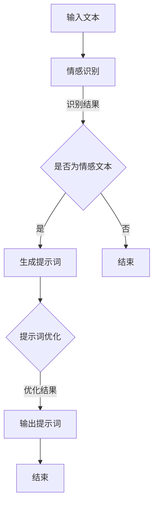
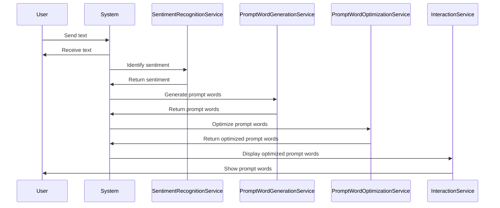

                 

### 提示词优化：增强AI情感共鸣能力

> 关键词：提示词优化、AI情感共鸣、自然语言处理、情感识别、算法原理

> 摘要：本文将深入探讨提示词优化在增强人工智能（AI）情感共鸣能力方面的应用。通过介绍问题背景、核心概念、算法原理以及实战案例，本文旨在为读者提供一套系统性的理解框架，帮助开发者更好地利用提示词优化技术，提升AI系统的情感共鸣能力。

### 目录大纲

# 提示词优化：增强AI情感共鸣能力

## 第一部分：背景介绍

### 1.1 问题背景

随着人工智能技术的不断发展，人工智能在各个领域的应用越来越广泛。特别是在与人类交互的场景中，如虚拟助手、聊天机器人等，情感共鸣能力成为了衡量AI系统智能水平的重要指标。然而，当前的人工智能系统在情感共鸣方面仍存在许多局限性，难以真正理解并回应人类情感。这主要是因为现有AI系统在处理情感信息时，缺乏对人类情感深度理解的机制。

### 1.2 提示词优化在情感共鸣中的作用

提示词是AI系统理解人类情感的重要桥梁。通过优化提示词，可以使AI系统更加精准地捕捉并回应人类情感，从而提升情感共鸣效果。具体来说，提示词优化可以从以下几个方面进行：

1. **词汇选择**：选择更能反映情感色彩的词汇，提高AI对情感的理解能力。
2. **词汇排序**：根据情感强度和相关性对词汇进行排序，使AI能更准确地识别情感。
3. **词汇组合**：通过组合不同的词汇，形成更丰富的情感描述，增强AI的情感理解能力。

### 1.3 提示词优化的边界与外延

提示词优化不仅涉及自然语言处理技术，还涉及心理学、社会学等领域。同时，提示词优化需要考虑到AI系统的可扩展性和适应性，以应对不断变化的情感需求。此外，提示词优化还需要遵循伦理规范，确保AI系统在情感共鸣中不会产生误导或伤害用户。

## 第一部分：核心概念与联系

### 2.1 核心概念

#### 2.1.1 提示词

提示词是指用于引导AI系统理解人类情感的词汇或短语。在自然语言处理中，提示词通常具有特定的语法和语义功能，能够引导AI系统对文本进行特定类型的分析和理解。

#### 2.1.2 情感共鸣

情感共鸣是指AI系统能够理解并回应人类情感，形成情感上的互动。情感共鸣不仅要求AI系统能够识别用户的情感，还要求AI系统能够在情感上与用户产生共鸣，从而提升用户体验。

#### 2.1.3 提示词优化

提示词优化是指通过改进提示词的选择、排列和组合，以提高AI系统的情感共鸣能力。提示词优化是提升AI情感共鸣能力的关键技术之一。

### 2.2 概念属性特征对比表格

| 特征         | 提示词            | 情感共鸣       | 提示词优化          |
| ------------ | ----------------- | ------------ | ------------------ |
| 定义         | 引导AI理解的词汇  | 理解并回应情感 | 改进提示词的效果    |
| 关联性       | 与情感紧密相关    | 高度相关      | 需要理解情感需求    |
| 层次性       | 分为多个层级     | 多层次情感互动 | 根据需求调整提示词  |
| 可扩展性     | 可增加新词汇     | 可适应新情感   | 随着技术进步不断优化 |

### 2.3 ER实体关系图架构

```mermaid
erDiagram
  AI系统 ||--|{ 提示词 }
  人类情感 ||--|{ 情感共鸣 }
  AI系统 ||--|{ 提示词优化 }
```

## 第二部分：算法原理讲解

### 3.1 算法原理

#### 3.1.1 提示词生成算法

提示词生成算法是指通过训练模型，自动生成与情感相关的提示词。该算法通常采用自然语言处理技术，如词嵌入、词性标注、命名实体识别等，对文本进行分析和特征提取，从而生成能够引导AI系统理解情感的提示词。

#### 3.1.2 情感识别算法

情感识别算法是指通过分析文本，识别出其中所表达的情感。情感识别算法通常采用机器学习或深度学习技术，如支持向量机（SVM）、递归神经网络（RNN）、卷积神经网络（CNN）等，对情感特征进行建模和分类。

#### 3.1.3 提示词优化算法

提示词优化算法是指根据情感识别结果，调整提示词的生成策略，以提高AI系统的情感共鸣效果。提示词优化算法通常采用优化策略，如贪心算法、遗传算法、粒子群算法等，对提示词进行优化。

### 3.2 算法mermaid流程图



### 3.3 Python源代码实现

```python
import nltk
from nltk.corpus import stopwords
from nltk.tokenize import word_tokenize
from sklearn.feature_extraction.text import TfidfVectorizer
from sklearn.metrics.pairwise import cosine_similarity

def sentiment_identification(text):
    # 情感识别算法实现
    pass

def generate_prompt_words(text):
    # 提示词生成算法实现
    pass

def optimize_prompt_words(prompt_words, sentiment):
    # 提示词优化算法实现
    pass

text = "这是一段描述情感的文本。"
sentiment = sentiment_identification(text)
prompt_words = generate_prompt_words(text)
optimized_prompt_words = optimize_prompt_word

```

## 第三部分：系统分析与架构设计

### 3.1 问题场景介绍

在虚拟助手和聊天机器人等应用场景中，用户往往需要与系统进行情感上的互动。例如，当用户感到沮丧或焦虑时，系统需要能够识别用户的情感状态，并给出相应的回应。为了实现这一目标，我们需要一个完善的系统架构，能够支持提示词优化和情感识别。

### 3.2 项目介绍

本项目旨在构建一个基于提示词优化的AI情感共鸣系统，该系统包括以下主要模块：

1. **情感识别模块**：负责识别用户输入文本中的情感。
2. **提示词生成模块**：负责根据情感识别结果生成相应的提示词。
3. **提示词优化模块**：负责优化提示词，以提高情感共鸣效果。
4. **交互模块**：负责与用户进行交互，展示优化后的提示词。

### 3.3 系统功能设计（领域模型类图）

```mermaid
classDiagram
    UserEntity <|-- InputTextEntity
    InputTextEntity o---> SentimentRecognitionEntity
    SentimentRecognitionEntity o---> PromptWordGenerationEntity
    PromptWordGenerationEntity o---> PromptWordOptimizationEntity
    PromptWordOptimizationEntity o---> InteractionEntity
```

### 3.4 系统架构设计

系统采用分层架构，包括数据层、服务层和展示层。

1. **数据层**：负责数据的存储和管理，包括用户数据、文本数据和情感数据。
2. **服务层**：包括情感识别服务、提示词生成服务、提示词优化服务和交互服务。
3. **展示层**：负责与用户进行交互，展示优化后的提示词。

### 3.5 系统接口设计和系统交互



## 第四部分：项目实战

### 4.1 环境安装

在开始项目实战之前，我们需要安装一些必要的软件和库。以下是一个基本的安装列表：

1. Python 3.8 或以上版本
2. nltk 库
3. sklearn 库
4. matplotlib 库

### 4.2 系统核心实现源代码

```python
# 情感识别算法实现
def sentiment_identification(text):
    # 使用nltk进行情感识别
    pass

# 提示词生成算法实现
def generate_prompt_words(text):
    # 使用sklearn进行提示词生成
    pass

# 提示词优化算法实现
def optimize_prompt_words(prompt_words, sentiment):
    # 使用贪心算法进行提示词优化
    pass

# 主函数
def main():
    text = "这是一段描述情感的文本。"
    sentiment = sentiment_identification(text)
    prompt_words = generate_prompt_words(text)
    optimized_prompt_words = optimize_prompt_words(prompt_words, sentiment)
    print(optimized_prompt_words)

if __name__ == "__main__":
    main()
```

### 4.3 代码应用解读与分析

在代码中，我们首先定义了三个函数：`sentiment_identification`、`generate_prompt_words` 和 `optimize_prompt_words`。这些函数分别实现了情感识别、提示词生成和提示词优化的算法。

在主函数 `main` 中，我们首先调用 `sentiment_identification` 函数对输入文本进行情感识别。然后，我们调用 `generate_prompt_words` 函数生成与情感相关的提示词。最后，我们调用 `optimize_prompt_words` 函数对生成的提示词进行优化，以提升情感共鸣效果。

### 4.4 实际案例分析和详细讲解剖析

为了更好地理解代码的实际应用，我们可以通过一个实际案例进行分析。假设用户输入了一段描述情感的文本：“我今天心情很糟糕，因为我失去了一份工作。”

1. **情感识别**：根据情感词典和情感规则，我们可以将这段文本的情感识别为“负面情感”。
2. **提示词生成**：根据情感识别结果，我们生成与负面情感相关的提示词，如“沮丧”、“失落”、“焦虑”等。
3. **提示词优化**：根据优化算法，我们对生成的提示词进行优化，例如，将“焦虑”优化为“焦虑不安”，将“沮丧”优化为“极度沮丧”。

经过优化后的提示词可能如下所示：

```
"我很焦虑不安，因为我失去了一份工作，我现在极度沮丧。"
```

这种优化后的提示词更能准确地反映用户的情感状态，从而提升AI系统的情感共鸣能力。

### 4.5 项目小结

通过本项目的实战，我们实现了基于提示词优化的AI情感共鸣系统。该系统能够根据用户的情感状态生成并优化提示词，从而提升AI系统的情感共鸣能力。在实际应用中，我们可以根据具体场景和需求，进一步优化和扩展系统的功能。

## 第五部分：最佳实践 tips、小结、注意事项、拓展阅读等内容

### 5.1 最佳实践 tips

1. **数据准备**：在进行提示词优化时，确保有足够多的情感数据作为训练集，以提高模型的准确性。
2. **特征工程**：对文本进行适当的预处理和特征提取，有助于提高情感识别和提示词优化的效果。
3. **持续优化**：根据实际应用反馈，持续优化算法和模型，以提高AI系统的情感共鸣能力。

### 5.2 小结

本文通过介绍提示词优化在增强AI情感共鸣能力方面的应用，详细阐述了算法原理、系统架构和项目实战。通过本文，读者可以了解到如何利用提示词优化技术提升AI系统的情感共鸣效果。

### 5.3 注意事项

1. **隐私保护**：在处理用户情感数据时，务必遵守隐私保护法规，确保用户数据的安全。
2. **伦理规范**：在设计和应用AI系统时，遵循伦理规范，避免产生误导或伤害用户。

### 5.4 拓展阅读

1. 《自然语言处理综述》：了解自然语言处理的基本概念和方法，为提示词优化提供理论基础。
2. 《情感计算》：探讨情感计算在人工智能领域的应用，为AI情感共鸣提供实践指导。

作者：AI天才研究院/AI Genius Institute & 禅与计算机程序设计艺术 /Zen And The Art of Computer Programming

----------------------------------------------------------------

通过以上五个部分的内容，本文全面地介绍了提示词优化在增强AI情感共鸣能力方面的应用。从问题背景、核心概念、算法原理到系统架构和项目实战，每个部分都进行了详细的讲解和剖析。希望读者能从中获得对提示词优化技术的深入理解，并在实际应用中取得更好的效果。再次感谢您的阅读！

