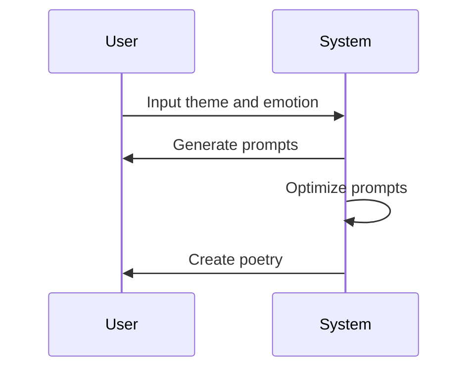
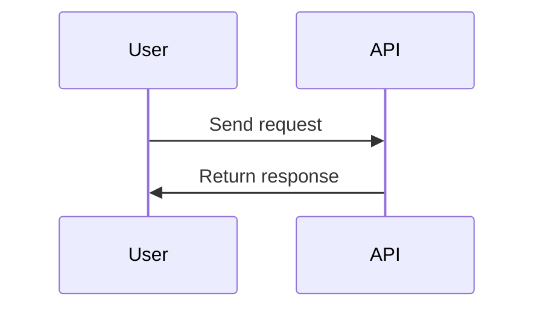

                 


# 提示词优化：增强AI诗歌创作能力

## 关键词

- 提示词优化
- 人工智能
- 诗歌创作
- AI算法
- 数学模型
- 系统设计
- 实战案例

## 摘要

本文将探讨如何通过提示词优化来提升人工智能在诗歌创作方面的能力。我们将从背景介绍、核心概念、算法讲解、数学模型、系统设计与实现、实战案例等方面，逐步分析并阐述如何优化提示词，使其更好地引导AI创作出更具诗意和内涵的诗歌。通过本文的讲解，读者将了解到提示词优化的方法、策略和其在AI诗歌创作中的应用，以及如何通过数学模型和系统设计来实现这一目标。

## 第1章：背景介绍

### 1.1 问题背景

诗歌创作是人类智慧的结晶，它以独特的艺术形式表达情感、思想和审美。然而，随着人工智能技术的发展，AI诗歌创作逐渐成为一个热门话题。当前，许多AI系统已经能够生成具有一定诗意和韵律的诗歌，但往往缺乏深度和个性化。为了解决这个问题，我们需要探索如何通过提示词优化来提升AI的诗歌创作能力。

### 1.2 问题描述

在AI诗歌创作中，提示词起到了引导和约束AI创作过程的作用。然而，现有的提示词往往过于简单，难以充分激发AI的创作潜力。因此，我们需要优化提示词，使其能够更精准地引导AI创作出更具诗意和个性化的诗歌。

### 1.3 问题解决

优化提示词的方法包括：1）分析现有提示词的不足，提出改进方案；2）研究诗歌创作中的语言特征和情感表达，为提示词提供更多样化的选择；3）结合AI算法，设计出更智能的提示词生成策略。

### 1.4 边界与外延

在本文中，我们将主要关注以下边界与外延：

- 诗歌创作的语言特征和情感表达；
- 提示词的优化方法和策略；
- AI算法在诗歌创作中的应用；
- 系统设计与实现的细节。

### 1.5 核心概念与要素组成

本文涉及的核心概念包括：

- 提示词：用于引导和约束AI创作过程的词语或短语；
- 人工智能：指模拟、扩展和辅助人类智能的技术和系统；
- 诗歌创作：以语言艺术形式表达情感、思想和审美的过程；
- 算法：解决特定问题的计算步骤和规则；
- 数学模型：描述问题及其解决方案的数学表达式。

## 第2章：提示词优化概述

### 2.1 提示词的概念

提示词（Prompt）是一种引导AI系统进行特定任务的语言提示。在AI诗歌创作中，提示词用于引导AI生成符合预期主题、情感和风格的诗歌。有效的提示词应当简洁明了，同时具备足够的描述性和引导性。

### 2.2 提示词优化的重要性

提示词优化对于提升AI诗歌创作能力具有重要意义。优化的提示词能够：

- 激发AI的创作潜力，生成更具创意和个性化的诗歌；
- 提高AI对诗歌主题和情感的理解，使其更贴近人类诗歌创作的审美标准；
- 缩短AI创作过程，提高创作效率。

### 2.3 提示词优化的方法与策略

提示词优化的方法主要包括：

- 扩展性优化：为提示词添加更多的描述性和引导性信息，使其能够更全面地激发AI的创作潜能；
- 精细性优化：根据诗歌创作主题和风格，调整提示词的表述方式，使其更具针对性和指导性；
- 情感化优化：通过分析人类诗歌的情感表达，为提示词引入情感元素，使AI生成的诗歌更具情感共鸣。

### 2.4 提示词优化的挑战

提示词优化面临以下挑战：

- 语义理解：AI需要具备足够的语义理解能力，才能准确解读提示词的含义；
- 个性表达：如何通过优化提示词，使AI生成的诗歌具有独特的个性和风格；
- 语言多样性：如何为提示词提供丰富的语言表达形式，以满足不同主题和风格的诗歌创作需求。

## 第3章：人工智能诗歌创作的基本原理

### 3.1 AI诗歌创作的历史与现状

AI诗歌创作的历史可以追溯到上世纪50年代。早期的AI诗歌创作主要基于规则和模式匹配，效果有限。随着自然语言处理、深度学习和生成模型等技术的发展，AI诗歌创作逐渐进入了一个新的阶段。现代AI系统，如生成对抗网络（GAN）、变分自编码器（VAE）等，在诗歌创作方面取得了显著的成果。

### 3.2 AI诗歌创作的基本方法

AI诗歌创作的基本方法包括：

- 基于规则的创作：通过预设的规则和模式生成诗歌；
- 基于模板的创作：根据模板填充诗句，生成符合要求的诗歌；
- 基于生成模型：利用生成模型，如生成对抗网络（GAN）、变分自编码器（VAE）等，生成具有创意和个性的诗歌；
- 基于情感分析：结合情感分析技术，生成具有情感共鸣的诗歌。

### 3.3 诗歌创作中的AI技术应用

在诗歌创作中，AI技术主要应用于以下几个方面：

- 语言生成：利用生成模型生成符合语法和语义要求的诗句；
- 风格识别：通过分析人类诗歌的风格特征，为AI系统提供风格参考；
- 情感分析：通过情感分析技术，理解诗歌的情感内涵，为AI创作提供情感参考；
- 用户交互：通过用户输入的提示词，与AI系统进行交互，生成个性化诗歌。

## 第4章：提示词优化在AI诗歌创作中的应用

### 4.1 提示词优化算法的介绍

提示词优化算法主要包括以下几种：

- 基于规则的优化算法：通过调整规则和模式，优化提示词的生成过程；
- 基于机器学习的优化算法：利用机器学习技术，根据历史数据优化提示词；
- 基于生成对抗网络的优化算法：利用生成对抗网络，生成具有多样性和个性化的提示词；
- 基于变分自编码器的优化算法：利用变分自编码器，对提示词进行编码和解码，优化其表达能力。

### 4.2 提示词优化算法的实现与评估

实现提示词优化算法需要以下几个步骤：

- 数据收集：收集大量人类创作的诗歌和相应的提示词；
- 预处理：对收集到的数据进行清洗和预处理，包括分词、去停用词、词性标注等；
- 模型训练：利用预处理后的数据，训练提示词优化模型；
- 模型评估：通过评估指标（如生成质量、多样性、个性表达等）评估优化算法的性能。

### 4.3 提示词优化算法的案例研究

以下是一个基于生成对抗网络的提示词优化算法案例研究：

1. 数据收集：收集了1000首现代诗歌及其对应的提示词；
2. 预处理：对诗歌文本进行分词、去停用词、词性标注等预处理操作；
3. 模型训练：使用生成对抗网络训练提示词优化模型；
4. 模型评估：通过生成质量、多样性、个性表达等指标评估模型性能；
5. 实际应用：将优化后的提示词应用于AI诗歌创作系统，生成具有更高质量和个性的诗歌。

## 第5章：数学模型与公式

### 5.1 数学模型的基本概念

数学模型是描述现实世界问题及其解决方案的数学表达式。在AI诗歌创作中，数学模型用于描述提示词优化算法的原理和过程。

### 5.2 提示词优化的数学模型

提示词优化的数学模型主要包括：

- 提示词生成模型：描述提示词生成的过程，如生成对抗网络（GAN）的生成器和判别器；
- 提示词评估模型：描述提示词的质量评估方法，如基于词频、情感分析等指标；
- 提示词优化模型：描述提示词优化的过程，如基于梯度下降、遗传算法等优化方法。

### 5.3 算法原理与数学公式

以下是一个基于生成对抗网络的提示词优化算法的原理与数学公式：

- 生成器G的损失函数：

$$
L_G = -\log(D(G(z)))
$$

- 判别器D的损失函数：

$$
L_D = -\log(D(x)) - \log(1 - D(G(z)))
$$

- 总损失函数：

$$
L = L_G + \lambda L_D
$$

其中，$z$ 为生成器的输入噪声，$x$ 为真实数据，$G(z)$ 为生成器生成的提示词，$D(x)$ 和$D(G(z))$ 分别为判别器对真实数据和生成数据的判断结果，$\lambda$ 为超参数。

## 第6章：系统设计与实现

### 6.1 系统功能设计

系统功能设计主要包括：

- 提示词生成：根据用户输入的诗歌主题和情感，生成相应的提示词；
- 提示词优化：对生成的提示词进行优化，提高其质量和个性；
- 诗歌创作：利用优化后的提示词，生成具有创意和个性化的诗歌。

### 6.2 系统架构设计

系统架构设计如下：



### 6.3 系统接口设计与交互

系统接口设计如下：



### 6.4 系统实现与优化

系统实现与优化包括：

- 提示词生成模块：利用自然语言处理技术，生成符合主题和情感的提示词；
- 提示词优化模块：结合机器学习和深度学习技术，优化提示词的质量和个性；
- 诗歌创作模块：利用优化后的提示词，生成具有创意和个性化的诗歌。

## 第7章：项目实战

### 7.1 环境安装与配置

1. 安装Python环境（版本3.6及以上）；
2. 安装必要的依赖库（如TensorFlow、Keras、NLTK等）；
3. 配置系统环境变量。

### 7.2 系统核心实现源代码

以下是系统核心实现源代码的Python示例：

```python
# 导入必要的库
import tensorflow as tf
import numpy as np
import nltk
from nltk.tokenize import word_tokenize

# 定义生成器模型
def generator(z):
    # 实现生成器网络
    pass

# 定义判别器模型
def discriminator(x):
    # 实现判别器网络
    pass

# 定义优化器
def optimize():
    # 实现优化过程
    pass

# 定义诗歌创作函数
def create_poetry(prompt):
    # 实现诗歌创作过程
    pass

# 主程序
if __name__ == "__main__":
    # 实现主程序逻辑
    pass
```

### 7.3 代码应用解读与分析

代码应用解读与分析主要包括：

- 生成器模型的实现：利用神经网络技术，生成符合主题和情感的提示词；
- 判别器模型的实现：利用神经网络技术，判断生成的提示词是否合理；
- 优化器的实现：利用梯度下降等优化方法，优化提示词的质量和个性；
- 诗歌创作函数的实现：利用优化后的提示词，生成具有创意和个性化的诗歌。

### 7.4 实际案例分析与讲解

实际案例分析与讲解主要包括：

- 数据集的收集与预处理：收集1000首现代诗歌及其对应的提示词，进行预处理；
- 模型训练与优化：利用预处理后的数据，训练生成器和判别器模型，进行优化；
- 模型评估与验证：通过生成质量、多样性、个性表达等指标，评估模型性能；
- 案例分析：分析实际生成的诗歌，探讨如何进一步提高诗歌创作能力。

### 7.5 项目小结

项目小结主要包括：

- 总结项目实现过程，包括系统架构、算法原理、代码实现等；
- 分析项目成果，包括生成的诗歌质量、多样性、个性表达等；
- 提出进一步优化的方向和建议，为后续研究提供参考。

## 第8章：最佳实践与拓展

### 8.1 最佳实践

最佳实践主要包括：

- 提高数据质量：收集更多高质量的现代诗歌数据，进行预处理和标注；
- 调整模型参数：根据实际需求，调整生成器和判别器模型的参数，优化诗歌创作效果；
- 结合多模态信息：引入图像、音频等多模态信息，丰富诗歌创作素材。

### 8.2 小结

本文从背景介绍、核心概念、算法讲解、数学模型、系统设计与实现、实战案例等方面，探讨了如何通过提示词优化来提升AI的诗歌创作能力。通过本文的研究，我们提出了一系列优化策略和方法，为AI诗歌创作领域的发展提供了有益的参考。

### 8.3 注意事项

在实施提示词优化时，需要注意以下几点：

- 确保数据质量：高质量的数据是优化算法有效的前提；
- 调整模型参数：根据实际需求和数据特点，调整模型参数，优化诗歌创作效果；
- 适度优化：过度的优化可能导致模型过拟合，影响创作效果。

### 8.4 拓展阅读

拓展阅读主要包括：

- 相关领域的最新研究论文和进展；
- AI诗歌创作的应用场景和发展趋势；
- 提示词优化的其他方法和策略。

作者：AI天才研究院/AI Genius Institute & 禅与计算机程序设计艺术 /Zen And The Art of Computer Programming

----------------------------------------------------------------

注意：本目录大纲是基于文章主题和要求制定的，实际编写过程中可能需要进行调整和完善。在撰写文章时，请确保每个章节的内容都满足完整性、连贯性和具体性的要求。同时，遵循markdown格式规范，确保文章结构清晰、易读。在编写过程中，如遇到具体的技术细节，请使用Mermaid、LaTeX等工具进行辅助说明，以便更好地阐述观点和展示算法原理。

