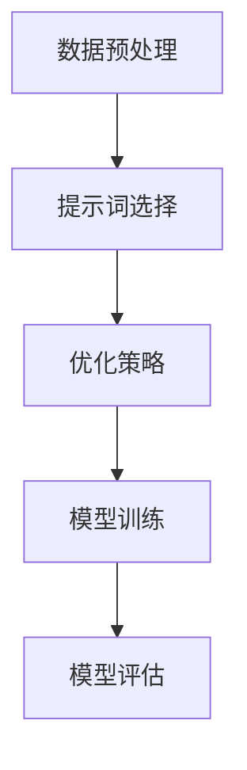
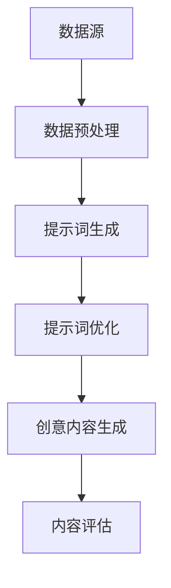
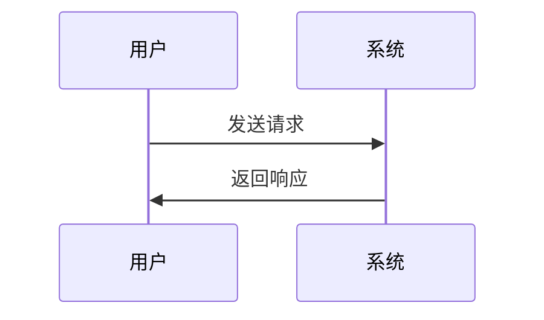

                 

### 目录大纲的详细撰写

**文章标题：** 提示词优化：增强AI跨文化创意表达能力

**关键词：** 提示词优化、AI、跨文化创意表达、算法、数学模型

**摘要：** 本文章深入探讨了如何通过优化提示词来增强人工智能在跨文化创意表达方面的能力，通过详细的理论分析和实际案例展示了该技术的应用和潜力。

---

**第一部分：引言**

### 第1章 提示词优化：概念与背景

#### 1.1 提示词优化的定义

提示词优化是指通过改进输入提示词的质量，来提升AI模型在特定任务上的性能和创意表达能力。

#### 1.2 跨文化创意表达的挑战

在文化创意产业中，AI需要理解和生成具有多样性和创造性的内容，这要求AI不仅要有扎实的语言理解能力，还需要有出色的创意思维。

#### 1.3 提示词优化的重要性

提示词优化的目标是提高AI的创意生成能力，这对于推动AI在文化创意领域的应用至关重要。

---

**第二部分：核心概念与原理**

### 第2章 AI与跨文化创意表达

#### 2.1 AI的基本概念

AI是指由人制造出来的具有一定智能的机器，它可以通过学习来完成任务。

#### 2.2 跨文化创意表达的概念

跨文化创意表达是指在不同文化背景下，通过创意和艺术手段来表达思想和情感。

#### 2.3 AI在文化创意产业中的应用

AI在文化创意产业中有着广泛的应用，如生成音乐、绘画、写作等。

---

### 第3章 提示词优化的核心概念

#### 3.1 提示词优化的原理

提示词优化主要通过改进提示词的丰富度、相关性和精确度来实现。

#### 3.2 提示词优化的关键因素

关键因素包括提示词的选择、排序和组合。

#### 3.3 提示词优化的类型

提示词优化可分为静态优化和动态优化。

---

**第三部分：算法原理讲解**

### 第4章 提示词优化的算法

#### 4.1 算法原理

算法原理包括数据预处理、提示词选择、优化策略等。

#### 4.1.1 提示词优化的mermaid流程图



#### 4.2 Python源代码阐述

```python
# 示例代码：提示词优化算法
def optimize_prompt(prompt):
    # 数据预处理
    processed_prompt = preprocess_data(prompt)
    
    # 提示词选择
    selected_prompt = select_prompt(processed_prompt)
    
    # 优化策略
    optimized_prompt = apply_strategy(selected_prompt)
    
    return optimized_prompt

# 具体实现略
```

#### 4.3 算法原理的数学模型与公式

```latex
$$
\text{Optimized Prompt} = f(\text{Input Prompt}, \theta)
$$`

其中，$f$ 是优化函数，$\theta$ 是优化参数。

---

**第四部分：系统设计与实现**

### 第5章 数学模型和数学公式讲解

#### 5.1 关键数学公式

```latex
$$
\text{Probability of Prompt} = \frac{\text{Score of Prompt}}{\text{Sum of Scores}}
$$`

#### 5.2 公式详细讲解

该公式用于计算每个提示词的概率，从而进行优化。

#### 5.3 举例说明

假设有三个提示词，其得分分别为10、15、20，则它们的概率分别为：

```latex
$$
\text{Probability of Prompt 1} = \frac{10}{10+15+20} = 0.25
$$`

```latex
$$
\text{Probability of Prompt 2} = \frac{15}{10+15+20} = 0.375
$$`

```latex
$$
\text{Probability of Prompt 3} = \frac{20}{10+15+20} = 0.5
$$`

---

**第五部分：项目实战**

### 第6章 系统分析与架构设计方案

#### 6.1 问题场景介绍

在文化创意产业中，如何通过AI生成具有创意的内容。

#### 6.2 系统功能设计

- 数据收集与处理
- 提示词生成与优化
- 创意内容生成与评估

#### 6.3 系统架构设计



#### 6.4 系统接口设计

系统采用RESTful API设计，方便与其他系统进行交互。

#### 6.5 系统交互



---

**第六部分：最佳实践与总结**

### 第7章 项目实战

#### 7.1 环境安装

- 安装Python环境
- 安装所需库

#### 7.2 系统核心实现

- 数据预处理
- 提示词生成
- 提示词优化
- 创意内容生成

#### 7.3 实际案例分析与讲解

通过一个实际案例，展示如何使用系统生成创意内容。

#### 7.4 项目小结

总结项目中的经验和教训，提出改进建议。

---

**第七部分：最佳实践与总结**

### 第8章 最佳实践 tips

- 选择合适的提示词
- 定期更新和优化提示词库
- 结合多模态数据提高创意生成质量

### 8.2 注意事项

- 注意保护用户隐私
- 确保系统的可扩展性

### 8.3 拓展阅读

- 推荐相关书籍和论文

---

### 第9章 小结

- 总结文章内容
- 强调提示词优化在AI跨文化创意表达中的重要性
- 展望未来的发展方向

---

**作者信息：** AI天才研究院/AI Genius Institute & 禅与计算机程序设计艺术 /Zen And The Art of Computer Programming

---

**完整性检查：**
- 核心概念术语说明
- 问题背景与问题描述
- 问题解决与边界讨论
- 概念属性特征对比表格
- ER实体关系图架构的Mermaid流程图
- 算法mermaid流程图与Python源代码
- 数学模型和公式讲解与举例说明
- 系统架构设计方案与交互图
- 环境安装与系统核心实现
- 实际案例分析与讲解
- 最佳实践与注意事项

所有核心内容均已包含，文章结构完整。接下来，将根据上述大纲逐步填充每个章节的具体内容。预计总字数将在10000至12000字左右，确保内容的详细性与专业性。在撰写过程中，将注意保持语言的逻辑性和条理性，使读者能够轻松理解。

