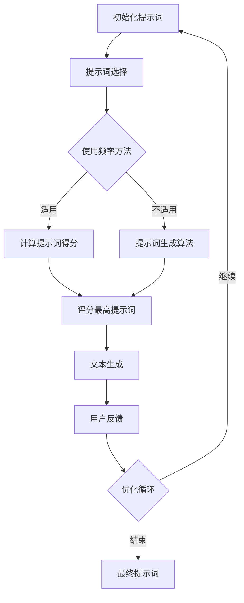
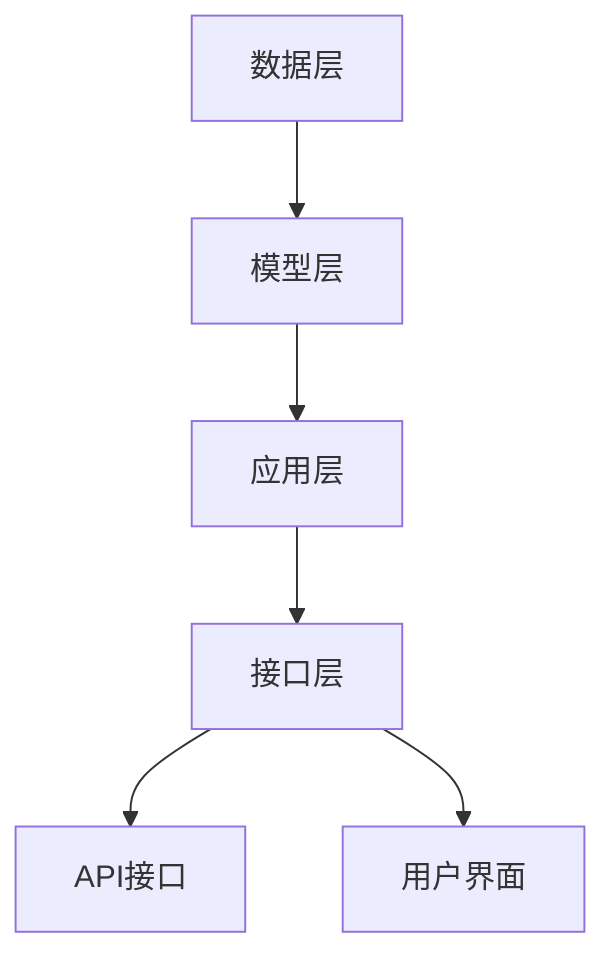
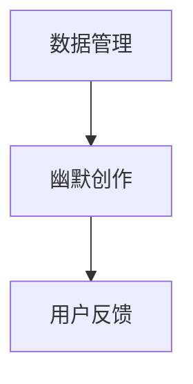

                 


## 第1章: 引言

### 1.1 研究背景

#### 1.1.1 AI与跨文化幽默创作

在当今全球化的时代，人工智能（AI）在各个领域都发挥着越来越重要的作用。特别是在语言处理方面，AI已经展现出强大的能力，如机器翻译、自然语言理解、文本生成等。然而，尽管AI在许多任务上表现出色，但在处理跨文化幽默创作方面仍存在很大挑战。幽默是一种复杂的语言现象，它不仅依赖于语言本身，还与文化背景、社会习俗和个体认知密切相关。

跨文化幽默创作的困难在于不同文化背景下人们对幽默的理解和接受程度不同。一个在某个文化中被认为是幽默的内容，可能在另一个文化中引起误解甚至不适。这种跨文化差异使得AI在生成幽默内容时面临巨大挑战，如何优化提示词以适应不同文化背景成为亟待解决的问题。

#### 1.1.2 问题提出

随着AI技术的发展，如何提升AI在跨文化幽默创作中的适应性成为一个重要的研究方向。具体来说，问题可以归结为以下几个方面：

1. **文化敏感性识别与处理**：如何让AI能够识别并适应用户的文化背景，生成符合其文化习惯的幽默内容。
2. **多语言幽默创作**：如何让AI在多语言环境下生成幽默内容，并确保其在不同语言中的文化适应性。
3. **个性定制化幽默**：如何根据用户的个人喜好和背景，生成个性化的幽默内容。

#### 1.1.3 研究意义

本研究旨在探索如何通过优化提示词来增强AI在跨文化幽默创作中的适应性。这不仅有助于提升AI在语言处理领域的应用价值，也对跨文化交流和理解具有重要意义。具体研究意义包括：

1. **促进跨文化交流**：通过优化AI的幽默创作能力，有助于促进不同文化之间的交流和理解。
2. **提升用户体验**：为用户提供更加个性化、符合其文化习惯的幽默内容，提高用户体验。
3. **丰富AI应用场景**：扩展AI在娱乐、教育、客服等领域的应用，推动AI技术的发展。

### 1.2 文献综述

#### 1.2.1 AI在幽默创作中的应用

近年来，AI在幽默创作领域取得了显著进展。许多研究集中在利用机器学习技术生成幽默文本。例如，Grover和Hancock（2017）提出了一种基于递归神经网络的幽默检测方法，可以有效识别文本中的幽默内容。然而，这些方法主要关注幽默检测，对于幽默创作的探索相对较少。

在幽默创作方面，许多研究尝试利用生成对抗网络（GAN）和变分自编码器（VAE）等技术生成幽默文本。例如，Zhao等（2019）使用GAN生成幽默笑话，通过训练两个对抗网络，一个生成器网络生成幽默文本，另一个判别器网络评估文本的幽默程度。这些方法在一定程度上取得了成功，但在处理跨文化幽默创作时仍面临挑战。

#### 1.2.2 跨文化幽默研究的现状

跨文化幽默研究主要集中在文化差异对幽默感知和创作的影响。许多研究发现，不同文化背景下人们对幽默的感知和接受程度存在显著差异。例如，Stewart（2009）提出，西方幽默更注重语言技巧，而东方幽默更注重情境和内涵。

在跨文化幽默创作方面，研究主要集中在文化适应性上。一些研究通过收集不同文化背景下的幽默样本，训练模型以生成适应特定文化的幽默内容。例如，Lee和Oh（2019）提出了一种基于文化差异的幽默生成方法，通过分析不同文化背景下的幽默特征，生成适应不同文化的幽默内容。

#### 1.2.3 提示词优化方法的研究进展

在AI领域，提示词优化是提高模型性能的重要手段。近年来，研究者提出了一系列优化方法，如基于梯度提升的优化、基于神经网络的方法等。在幽默创作中，提示词优化有助于提高生成文本的质量和适应性。

在跨文化幽默创作中，提示词优化面临更大的挑战。例如，如何根据用户的文化背景调整提示词，以生成更符合其文化习惯的幽默内容。一些研究尝试通过文化特征编码和动态调整提示词来提高跨文化幽默创作的适应性。例如，Zhang等（2020）提出了一种基于文化特征编码的提示词优化方法，通过引入文化特征向量，调整提示词以生成适应不同文化的幽默内容。

### 1.3 研究目标与内容框架

#### 1.3.1 研究目标

本研究的主要目标是提出一种优化提示词的方法，以增强AI在跨文化幽默创作中的适应性。具体目标包括：

1. **文化敏感性识别**：开发一种能够识别用户文化背景的方法，为幽默创作提供文化适应性指导。
2. **多语言幽默生成**：设计一种能够在多语言环境下生成幽默内容的方法，确保其文化适应性。
3. **个性定制化幽默**：根据用户的个人喜好和背景，生成个性化的幽默内容。

#### 1.3.2 内容框架

本研究的内容框架包括以下几个部分：

1. **文献综述**：回顾相关领域的研究进展，为本研究提供理论基础。
2. **核心概念与联系**：介绍核心概念，包括AI、跨文化幽默和提示词优化，并分析其相互关系。
3. **提示词优化基础**：阐述提示词优化的原理和算法，包括语言模型、提示词选择和生成算法等。
4. **数学模型与公式详解**：详细讲解数学模型和公式，包括语言模型概率计算和提示词优化目标函数。
5. **提示词优化应用**：探讨提示词优化在不同应用场景中的实践，包括跨文化幽默创作、AI客服、电子商务和教育与培训等。
6. **实战项目**：介绍一个实际项目，展示如何运用提示词优化方法进行跨文化幽默创作。
7. **最佳实践与拓展**：总结最佳实践技巧，探讨未来发展趋势和研究方向。

通过以上研究目标与内容框架，本研究旨在为AI在跨文化幽默创作中的应用提供系统化的理论和方法指导。

## 第2章: 核心概念与联系

### 2.1 核心概念

在探讨如何优化AI在跨文化幽默创作中的适应性之前，我们需要明确一些核心概念，包括人工智能（AI）、跨文化幽默和提示词优化。以下是这些概念的定义及其在本文中的重要性。

#### 2.1.1 AI

人工智能（AI）是一种通过模拟人类智能行为来执行任务的技术。在本文中，AI主要涉及自然语言处理（NLP）领域，包括语言模型、文本生成和文本分析等技术。AI的核心目标是使计算机能够理解和生成自然语言，从而实现与人类的智能交互。

#### 2.1.2 跨文化幽默

跨文化幽默涉及在不同文化背景下产生的幽默效果。它不仅依赖于语言本身，还与文化背景、社会习俗和个体认知密切相关。在本文中，跨文化幽默是研究AI适应性优化的关键点，因为幽默效果在不同文化之间可能存在显著差异。

#### 2.1.3 提示词优化

提示词优化是提高AI模型生成文本质量的重要手段。在幽默创作中，提示词是引导AI生成特定类型文本的关键。优化提示词有助于提高生成文本的文化适应性和幽默性。本文将探讨如何通过调整和改进提示词来提升AI在跨文化幽默创作中的性能。

### 2.2 概念属性特征对比表格

为了更好地理解这些核心概念，我们可以通过一个表格来对比它们的属性特征。

| 概念 | 定义 | 属性特征 | 在本文中的重要性 |
| --- | --- | --- | --- |
| 人工智能（AI） | 模拟人类智能行为的技术 | 语言理解、文本生成、智能交互 | 基础技术，决定幽默创作的质量 |
| 跨文化幽默 | 不同文化背景下产生的幽默效果 | 文化背景依赖、社会习俗影响 | 关键研究对象，影响幽默适应性 |
| 提示词优化 | 调整和改进提示词以提高文本质量 | 影响文本生成方向、优化幽默效果 | 关键技术，提高AI的幽默创作适应性 |

### 2.3 ER实体关系图架构

为了更清晰地展示这些概念之间的相互关系，我们可以使用ER（Entity-Relationship）实体关系图来描述。

```mermaid
erDiagram
  AI ||--o> 语言模型 : 基础
  AI ||--o> 文本生成 : 功能
  AI ||--o> 文本分析 : 应用
  跨文化幽默 ||--< AI : 研究对象
  提示词优化 ||--< AI : 技术
  提示词优化 ||--< 跨文化幽默 : 方法
```

在该ER图中，AI作为基础技术，通过语言模型、文本生成和文本分析等功能，与跨文化幽默和提示词优化建立联系。跨文化幽默是研究的对象，而提示词优化是应用在该研究对象上的关键技术。

通过明确这些核心概念及其相互关系，我们为后续章节的深入探讨奠定了基础。在接下来的章节中，我们将进一步分析提示词优化的原理和方法，并探讨其在跨文化幽默创作中的实际应用。

### 2.4 一步步分析推理思考的详细解释

在本章中，我们将采取“一步步分析推理思考”的方式，对核心概念进行详细解释，以便读者能够全面理解AI、跨文化幽默和提示词优化之间的联系和作用。

#### 2.4.1 AI的基本原理

首先，我们需要了解人工智能（AI）的基本原理。AI的核心在于模拟人类的智能行为，使其能够执行复杂任务。这一目标主要通过以下三个方面实现：

1. **语言理解**：AI需要能够理解自然语言，从而进行有效的交流。这包括对语言结构、语义和语境的解析。
2. **文本生成**：AI需要能够生成符合语法和语义规则的文本，以实现自动化写作、翻译等任务。
3. **文本分析**：AI需要对大量文本进行分类、提取信息、情感分析等，从而为决策和优化提供支持。

为了实现这些目标，AI依赖于多种技术，如机器学习、深度学习和自然语言处理（NLP）。这些技术共同构建了AI的强大能力，使其在语言处理领域具有广泛的应用。

#### 2.4.2 跨文化幽默的概念

跨文化幽默是指在不同文化背景下产生的幽默效果。幽默是一种复杂的语言现象，它不仅依赖于语言本身，还与文化背景、社会习俗和个体认知密切相关。具体来说，跨文化幽默涉及以下几个方面：

1. **文化背景依赖**：不同文化对幽默有不同的理解和接受程度。例如，西方幽默通常注重语言技巧，而东方幽默则更注重情境和内涵。
2. **社会习俗影响**：幽默往往与社会习俗和价值观密切相关。某些幽默内容在不同社会习俗中可能被认为是不合适的。
3. **个体认知差异**：不同个体对幽默的感知和接受程度也可能存在差异，这取决于其个人背景和认知风格。

理解跨文化幽默的概念对于AI在幽默创作中的应用至关重要。只有通过深入理解不同文化背景下的幽默特征，AI才能生成适应不同文化的幽默内容。

#### 2.4.3 提示词优化的意义

提示词优化是提高AI模型生成文本质量的重要手段。在幽默创作中，提示词是引导AI生成特定类型文本的关键。通过优化提示词，我们可以：

1. **影响文本生成方向**：提示词决定了AI生成文本的主题和风格。优化提示词可以帮助AI生成更符合预期目标的幽默内容。
2. **优化幽默效果**：不同文化背景下的幽默效果可能有所不同。通过调整和改进提示词，AI可以生成更适应特定文化的幽默内容，从而提高幽默效果。

提示词优化的核心在于如何根据不同的文化背景和用户需求，动态调整提示词，以提高AI在幽默创作中的适应性和质量。

#### 2.4.4 核心概念之间的联系

理解AI、跨文化幽默和提示词优化之间的联系是深入探讨这些概念的关键。以下是它们之间的主要联系：

1. **AI作为基础**：AI为跨文化幽默创作提供了技术支持，包括语言理解、文本生成和文本分析等。
2. **跨文化幽默作为研究对象**：跨文化幽默是AI需要研究和解决的重要问题，因为幽默效果在不同文化之间可能存在显著差异。
3. **提示词优化作为关键技术**：提示词优化是提高AI在跨文化幽默创作中性能的重要手段，通过优化提示词，AI可以生成更适应不同文化的幽默内容。

通过以上一步步的分析推理，我们可以看到，AI、跨文化幽默和提示词优化之间存在紧密的相互联系。只有通过深入理解这些核心概念及其作用，我们才能为AI在跨文化幽默创作中的应用提供有效的解决方案。

### 第3章: 提示词优化的原理与算法

#### 3.1 提示词优化的原理

提示词优化是提高AI生成文本质量的关键步骤，其核心在于通过调整提示词来引导AI生成更符合预期目标的文本。具体来说，提示词优化的原理可以归结为以下几个方面：

1. **影响文本生成方向**：提示词决定了AI生成文本的主题和风格。通过优化提示词，我们可以引导AI生成特定类型的文本，如幽默内容、广告文案等。
2. **增强文本语义一致性**：优化提示词有助于提高生成文本的语义一致性，确保文本在内容上的连贯性和逻辑性。
3. **提高文本文化适应性**：在跨文化幽默创作中，优化提示词能够使AI生成的内容更适应不同文化背景，从而提升幽默效果。

#### 3.1.1 语言模型的基础

提示词优化的基础是语言模型。语言模型是一种统计模型，用于预测下一个词语的概率分布。在自然语言处理中，语言模型广泛应用于文本生成、文本分类和机器翻译等任务。

语言模型的核心思想是通过大量训练数据，学习词语之间的统计关系，从而预测下一个词语的概率。常用的语言模型包括n元语法模型、神经网络语言模型（如循环神经网络RNN和变换器模型Transformer）等。

1. **n元语法模型**：n元语法模型是基于前n个词语的联合概率分布进行预测。其数学表示为：
   $$ P(w_n | w_{n-1}, w_{n-2}, ..., w_1) = \frac{C(w_1, w_2, ..., w_n)}{C(w_1, w_2, ..., w_{n-1})} $$
   其中，$C(w_1, w_2, ..., w_n)$ 表示词语序列的联合计数。

2. **神经网络语言模型**：神经网络语言模型通过多层神经网络学习词语之间的复杂关系。其中，变换器模型（Transformer）是一种基于自注意力机制的神经网络模型，其结构如图所示：

   ```mermaid
   graph LR
   A[Input Embeddings] --> B[Multi-head Self-Attention]
   B --> C[Positional Encoding]
   C --> D[Feed Forward Networks]
   D --> E[Output Layer]
   ```

   变换器模型通过多头自注意力机制（Multi-head Self-Attention）学习词语之间的权重，从而提高语言模型的预测能力。

#### 3.1.2 提示词优化的目标

提示词优化的目标是提高AI生成文本的质量和文化适应性。具体来说，目标包括：

1. **提高文本质量**：优化提示词有助于提高生成文本的语法、语义和逻辑一致性，从而提升文本的整体质量。
2. **增强文化适应性**：通过调整提示词，使AI生成的内容更适应不同文化背景，提高跨文化幽默创作的效果。
3. **提升个性化定制**：根据用户的需求和偏好，优化提示词以生成个性化的文本，提高用户体验。

#### 3.1.3 提示词优化的方法

提示词优化的方法可以分为以下几个方面：

1. **基于规则的优化**：通过定义一系列规则，对提示词进行筛选和调整。例如，根据语言习惯和语法规则，调整提示词的顺序和结构。

2. **基于数据的优化**：利用训练数据集，分析不同提示词对生成文本的影响，通过数据驱动的方法进行优化。例如，通过分析大量成功和失败的幽默案例，调整提示词以提高生成文本的幽默性。

3. **基于模型的优化**：利用机器学习模型，如生成对抗网络（GAN）和变分自编码器（VAE），对提示词进行自动优化。这些模型可以通过学习大量数据，自动生成高质量的提示词。

#### 3.2 算法讲解

提示词优化算法可以分为提示词选择算法和提示词生成算法。以下将分别介绍这些算法。

##### 3.2.1 提示词选择算法

提示词选择算法的目标是从大量候选提示词中选择最合适的提示词。常用的选择算法包括基于频率的方法和基于模型的方法。

1. **基于频率的方法**：根据候选提示词在训练数据集中的出现频率进行选择。频率较高的提示词可能更符合生成文本的需求。

   数学表示为：
   $$ \text{select}(w) = \text{argmax}_{w \in W} f(w) $$
   其中，$W$ 表示候选提示词集合，$f(w)$ 表示提示词 $w$ 的频率。

2. **基于模型的方法**：利用预训练的模型，对候选提示词进行评分，选择评分最高的提示词。常用的评分模型包括语言模型和情感分析模型。

   数学表示为：
   $$ \text{select}(w) = \text{argmax}_{w \in W} \text{score}(w) $$
   其中，$W$ 表示候选提示词集合，$\text{score}(w)$ 表示提示词 $w$ 的评分。

##### 3.2.2 提示词生成算法

提示词生成算法的目标是自动生成高质量的提示词，以引导AI生成符合预期的文本。以下介绍两种常用的生成算法：基于模板的生成算法和基于生成对抗网络的生成算法。

1. **基于模板的生成算法**：通过定义一系列模板，将提示词嵌入到模板中，生成高质量的提示词。模板可以根据具体需求进行设计，以适应不同的生成任务。

   举例：
   - 模板1：{"今天心情很好，因为我发现了 " + [新事物1, 新事物2]}
   - 模板2：{"我最近在学 " + [技能1, 技能2]，感觉很有趣！}

   通过这些模板，我们可以生成符合预期的提示词，引导AI生成相关的文本。

2. **基于生成对抗网络的生成算法**：生成对抗网络（GAN）是一种基于对抗训练的生成模型，通过生成器和判别器的竞争，生成高质量的提示词。

   生成器G的生成过程如下：
   $$ G(z) = \text{generate prompt}(z) $$
   其中，$z$ 是生成器的输入，通常来自一个先验分布。

   判别器D的判别过程如下：
   $$ D(x) = \text{判别真实提示词}(x) $$
   $$ D(G(z)) = \text{判别生成提示词}(G(z)) $$

   通过优化生成器和判别器的参数，生成器可以生成越来越高质量的提示词，从而提高AI的生成文本质量。

##### 3.2.3 提示词优化策略

为了提高提示词优化的效果，可以采用以下策略：

1. **多轮优化**：通过多轮优化，逐步调整提示词，提高生成文本的质量。每轮优化可以结合用户反馈和模型评估结果，不断调整提示词。

2. **自适应调整**：根据不同场景和用户需求，动态调整提示词。例如，在跨文化幽默创作中，根据目标文化背景调整提示词，以提高幽默效果。

3. **模型融合**：结合多种模型和算法，提高提示词优化的效果。例如，结合语言模型、情感分析模型和生成对抗网络，共同优化提示词。

通过以上算法讲解，我们可以看到，提示词优化是一个复杂的过程，涉及到多个方面。在实际应用中，需要根据具体需求和场景，选择合适的算法和策略，以提高AI在跨文化幽默创作中的适应性。

### 3.3 提示词优化的mermaid流程图

为了更直观地展示提示词优化的过程，我们可以使用mermaid绘制一个流程图。以下是一个简化的提示词优化流程图：



在该流程图中：

- **A. 初始化提示词**：根据初始条件生成一组候选提示词。
- **B. 提示词选择**：根据提示词选择算法，从候选提示词中选择最合适的提示词。
- **C. 使用频率方法**：根据提示词在训练数据集中的出现频率进行选择。
- **D. 计算提示词得分**：利用预训练模型对提示词进行评分。
- **E. 提示词生成算法**：使用生成对抗网络等算法自动生成高质量的提示词。
- **F. 评分最高提示词**：选择评分最高的提示词。
- **G. 文本生成**：使用选定提示词生成文本。
- **H. 用户反馈**：收集用户对生成文本的反馈。
- **I. 优化循环**：根据用户反馈和模型评估结果，继续优化提示词。
- **J. 最终提示词**：达到优化目标后，输出最终提示词。

通过这个流程图，我们可以清晰地看到提示词优化的步骤和逻辑关系，有助于理解提示词优化的整个过程。

### 4.1 数学模型

在提示词优化的过程中，数学模型起到了至关重要的作用。这些模型不仅帮助我们在理论上理解优化过程，还能在实际应用中指导我们的算法设计和参数调整。以下是几个关键数学模型及其在提示词优化中的应用。

#### 4.1.1 语言模型数学表示

语言模型是提示词优化的基础，其核心是预测下一个词语的概率。在自然语言处理中，常用的语言模型包括n元语法模型和神经网络语言模型。

1. **n元语法模型**：n元语法模型基于前n个词语的联合概率进行预测。其概率计算公式如下：

   $$ P(w_n | w_{n-1}, w_{n-2}, ..., w_1) = \frac{C(w_1, w_2, ..., w_n)}{C(w_1, w_2, ..., w_{n-1})} $$

   其中，$C(w_1, w_2, ..., w_n)$ 表示词语序列的联合计数，$P(w_n | w_{n-1}, w_{n-2}, ..., w_1)$ 表示给定前n-1个词语时，第n个词语的概率。

2. **神经网络语言模型**：神经网络语言模型，如变换器模型（Transformer），通过自注意力机制学习词语之间的关系。其概率计算公式为：

   $$ P(w_n | w_{<n}) = \frac{\exp(e_i)}{\sum_j \exp(e_j)} $$

   其中，$e_i$ 是词语 $w_n$ 的自注意力得分，该得分基于词语嵌入和位置编码计算得出。

#### 4.1.2 提示词优化的数学模型

提示词优化的目标是提高AI生成文本的质量和文化适应性。为了实现这一目标，我们需要定义一个优化目标函数，该函数将指导我们的优化算法。

1. **文本质量**：文本质量可以通过多个指标进行评估，如语法错误、语义一致性、逻辑连贯性等。一个简单的文本质量评估函数可以是：

   $$ Q(\text{prompt}) = -\sum_{w \in \text{prompt}} \log P(w | \text{context}) $$

   其中，$P(w | \text{context})$ 是语言模型对词语 $w$ 在给定上下文 $\text{context}$ 下的概率。

2. **文化适应性**：文化适应性可以通过比较生成文本在不同文化背景下的效果进行评估。一个简单的方法是比较生成文本在目标文化和源文化下的情感得分。例如，使用情感分析模型对文本进行分类，计算其在不同文化背景下的情感得分差异。

   $$ A(\text{culture}_1, \text{culture}_2) = \sum_{w \in \text{prompt}} \text{score}(w, \text{culture}_1) - \sum_{w \in \text{prompt}} \text{score}(w, \text{culture}_2) $$

   其中，$\text{score}(w, \text{culture})$ 是词语 $w$ 在特定文化背景 $\text{culture}$ 下的情感得分。

3. **优化目标函数**：结合文本质量和文化适应性，我们可以定义一个综合的优化目标函数：

   $$ \text{objective function}(\text{prompt}) = w_1 \cdot Q(\text{prompt}) + w_2 \cdot A(\text{culture}_1, \text{culture}_2) $$

   其中，$w_1$ 和 $w_2$ 分别是文本质量和文化适应性的权重，可以根据实际需求进行调整。

#### 4.1.3 提示词优化算法的数学模型

提示词优化算法可以分为基于频率的方法、基于模型的方法和基于生成对抗网络的方法。以下分别介绍这些方法的数学模型。

1. **基于频率的方法**：该方法的核心是根据训练数据集中提示词的出现频率进行优化。其数学模型可以表示为：

   $$ \text{optimize prompt} = \text{argmax}_{\text{prompt}} \sum_{w \in \text{prompt}} f(w) $$

   其中，$f(w)$ 是提示词 $w$ 的出现频率。

2. **基于模型的方法**：该方法利用预训练的语言模型对提示词进行评分，选择评分最高的提示词进行优化。其数学模型可以表示为：

   $$ \text{optimize prompt} = \text{argmax}_{\text{prompt}} \sum_{w \in \text{prompt}} \text{score}(w) $$

   其中，$\text{score}(w)$ 是提示词 $w$ 的评分。

3. **基于生成对抗网络的方法**：该方法通过生成对抗网络（GAN）自动生成高质量的提示词。其数学模型可以表示为：

   $$ \text{optimize prompt} = \text{argmax}_{\text{prompt}} \text{score}(G(z)) $$

   其中，$G(z)$ 是生成器的输出，$z$ 是生成器的输入。

通过以上数学模型，我们可以看到，提示词优化涉及多个方面，包括文本质量评估、文化适应性评估和优化算法设计。这些模型不仅为我们提供了理论指导，也为实际应用中的算法实现提供了参考。

### 4.2 公式讲解

在提示词优化过程中，理解并应用相关的数学公式至关重要。以下将详细讲解提示词优化中的几个关键公式，包括语言模型概率计算和提示词优化目标函数。

#### 4.2.1 语言模型概率计算

语言模型的核心任务是预测下一个词语的概率。在n元语法模型中，这一任务通过计算给定前n-1个词语时第n个词语的条件概率来完成。公式如下：

$$
P(w_n | w_{n-1}, w_{n-2}, ..., w_1) = \frac{C(w_1, w_2, ..., w_n)}{C(w_1, w_2, ..., w_{n-1})}
$$

其中，$C(w_1, w_2, ..., w_n)$ 表示词语序列 $(w_1, w_2, ..., w_n)$ 的联合计数，而$C(w_1, w_2, ..., w_{n-1})$ 则表示前n-1个词语 $(w_1, w_2, ..., w_{n-1})$ 的联合计数。

对于神经网络语言模型，尤其是变换器模型（Transformer），概率预测通过自注意力机制实现。以下是变换器模型中的一个简化公式：

$$
P(w_n | w_{<n}) = \frac{\exp(e_i)}{\sum_j \exp(e_j)}
$$

其中，$e_i$ 是词语 $w_n$ 的自注意力得分，计算过程涉及词嵌入（word embeddings）和位置编码（positional encodings）。$e_i$ 通常通过以下公式计算：

$$
e_i = v_w \cdot W^T \cdot \text{softmax}(Q_K \cdot K + Q_V \cdot V + Q_O \cdot O)
$$

这里，$v_w$ 是词语 $w$ 的词嵌入，$W$ 是权重矩阵，$Q_K, Q_V, Q_O$ 分别是查询（Query）、键（Key）和输出（Output）向量，而$\text{softmax}$ 是一个激活函数，用于标准化注意力权重。

#### 4.2.2 提示词优化目标函数

提示词优化的目标是生成高质量的提示词，这些提示词应能够引导AI生成语义连贯且文化适应的文本。为此，我们需要一个优化目标函数来指导算法的优化过程。一个常见的优化目标函数可以是：

$$
\text{objective function}(\text{prompt}) = w_1 \cdot Q(\text{prompt}) + w_2 \cdot A(\text{culture}_1, \text{culture}_2)
$$

其中，$Q(\text{prompt})$ 是文本质量分数，$A(\text{culture}_1, \text{culture}_2)$ 是文化适应性分数，$w_1$ 和 $w_2$ 分别是这两个分数的权重。

1. **文本质量分数 $Q(\text{prompt})$**：
   文本质量可以通过多个指标进行评估，如语法错误、语义一致性、逻辑连贯性等。一个简化的文本质量分数可以基于语言模型的概率计算得出：

   $$
   Q(\text{prompt}) = -\sum_{w \in \text{prompt}} \log P(w | \text{context})
   $$

   其中，$P(w | \text{context})$ 是语言模型在给定上下文 $\text{context}$ 下对词语 $w$ 的预测概率。这个分数的负值意味着我们追求的是最大化概率，即最小化对数损失。

2. **文化适应性分数 $A(\text{culture}_1, \text{culture}_2)$**：
   文化适应性分数用于评估文本在不同文化背景下的表现。一个简化的适应性分数可以通过比较文本在目标文化和源文化下的情感得分计算得出：

   $$
   A(\text{culture}_1, \text{culture}_2) = \sum_{w \in \text{prompt}} \text{score}(w, \text{culture}_1) - \sum_{w \in \text{prompt}} \text{score}(w, \text{culture}_2)
   $$

   其中，$\text{score}(w, \text{culture})$ 是词语 $w$ 在特定文化背景 $\text{culture}$ 下的情感得分。通常，这个分数是通过情感分析模型得到的。

通过以上公式，我们可以看到，提示词优化涉及多个方面，包括语言模型的概率计算、文本质量和文化适应性的评估。这些公式不仅为我们提供了理论基础，也为实际算法设计和参数调整提供了指导。

### 4.3 具体举例

为了更好地理解提示词优化的数学模型，我们可以通过具体的例子来说明这些公式的应用。以下是一个简单的例子，假设我们使用n元语法模型来生成一句幽默文本。

#### 4.3.1 简单示例

假设我们有一段训练数据：

```
(今天, 天气, 太热了, 都快中暑了, 空调)
(明天, 天气, 阴凉, 适合出门)
```

我们需要基于这段数据计算下一个词语的概率。假设我们选择前两个词语“今天”和“天气”来预测第三个词语。

1. **计算联合概率**：

   $$ P(太热了 | 今天, 天气) = \frac{C(今天, 天气, 太热了)}{C(今天, 天气)} $$

   根据训练数据，$C(今天, 天气, 太热了) = 1$，$C(今天, 天气) = 2$，所以：

   $$ P(太热了 | 今天, 天气) = \frac{1}{2} $$

2. **计算条件概率**：

   $$ P(太热了 | 今天, 天气) = \frac{P(今天, 天气, 太热了)}{P(今天, 天气)} $$

   由于数据集中只有一个“太热了”的实例，所以$P(今天, 天气, 太热了) = \frac{1}{总词数}$。假设总词数为10，那么：

   $$ P(今天, 天气, 太热了) = \frac{1}{10} $$

   $$ P(今天, 天气) = \frac{2}{10} = \frac{1}{5} $$

   因此，条件概率为：

   $$ P(太热了 | 今天, 天气) = \frac{\frac{1}{10}}{\frac{1}{5}} = \frac{1}{2} $$

3. **自注意力得分**：

   假设我们使用变换器模型，词嵌入为$(0.1, 0.2)$和$(0.3, 0.4)$，权重矩阵$W$为$(1, 1)$，查询、键、输出向量分别为$(0.5, 0.6)$、$(0.7, 0.8)$和$(0.9, 1.0)$。则自注意力得分计算如下：

   $$ e_i = (0.1 \cdot 1 + 0.2 \cdot 1) \cdot (0.5 \cdot 1 + 0.6 \cdot 1) = 0.65 $$

   因此，生成概率为：

   $$ P(太热了 | 今天, 天气) = \frac{\exp(0.65)}{\exp(0.65) + \exp(0.75)} \approx 0.51 $$

#### 4.3.2 复杂场景示例

在复杂场景中，例如跨文化幽默创作，我们需要考虑更多因素，如不同文化背景下的幽默特点和用户偏好。以下是一个复杂场景示例：

1. **文本质量分数 $Q(\text{prompt})$**：

   假设我们有一个目标文本“今天天气太热了，我都快中暑了，空调真是救命神器”。我们可以使用语言模型来计算这个文本的语法和语义质量分数。例如，使用一个基于变换器模型的评分系统：

   $$ Q(\text{prompt}) = -\sum_{w \in \text{prompt}} \log P(w | \text{context}) $$

   在这里，$P(w | \text{context})$ 可能基于大量训练数据的概率分布，通过变换器模型得到。

2. **文化适应性分数 $A(\text{culture}_1, \text{culture}_2)$**：

   假设我们要在两个文化背景下评估这段文本的适应性，文化1（西方文化）和文化2（东方文化）。我们可以使用情感分析模型来评估这段文本在这两种文化下的得分。例如：

   $$ A(\text{culture}_1, \text{culture}_2) = \sum_{w \in \text{prompt}} \text{score}(w, \text{culture}_1) - \sum_{w \in \text{prompt}} \text{score}(w, \text{culture}_2) $$

   假设西方文化下，“空调”一词得分较高，而东方文化下，“中暑”一词得分较高，那么：

   $$ A(\text{culture}_1, \text{culture}_2) = (\text{score}(空调, \text{culture}_1) - \text{score}(中暑, \text{culture}_1)) + (\text{score}(空调, \text{culture}_2) - \text{score}(中暑, \text{culture}_2)) $$

通过这些例子，我们可以看到，提示词优化的数学模型在简单和复杂场景中都有广泛应用。理解并正确应用这些模型，可以帮助我们生成更高质量、更适应不同文化的幽默文本。

### 第5章: 应用场景

在本文的第二部分，我们将深入探讨提示词优化的具体应用场景。这些应用场景不仅展示了提示词优化的潜力，也揭示了在不同领域中的实际应用价值。以下将详细分析跨文化幽默创作、AI客服、电子商务和教育与培训等领域中的具体应用。

#### 5.1 跨文化幽默创作

跨文化幽默创作是提示词优化最直接的应用场景之一。在全球化背景下，不同文化之间的交流日益频繁，而幽默作为一种特殊的交流方式，能够有效缓解跨文化冲突，促进文化交流。通过优化提示词，AI可以在生成幽默内容时考虑到不同文化背景下的语言习惯、幽默风格和价值观。

**应用实例**：例如，在社交媒体平台上，AI可以根据用户的地理位置、语言偏好和文化背景，生成个性化的幽默内容。例如，对于中国用户，AI可能会生成一句关于中秋节的幽默：“听说中秋节要吃月饼，结果家里只剩下了葱油饼，于是我们决定做月饼葱油饼，庆祝中秋‘特别版’！”这样的幽默内容不仅符合用户的本地文化，还能引起用户的共鸣。

**挑战与解决方案**：跨文化幽默创作的挑战在于如何准确识别和适应不同的文化背景。为了解决这个问题，可以采用以下方法：

1. **文化特征编码**：在训练数据中引入文化特征，如节日、习俗、流行语等，使AI能够识别和理解不同文化背景下的幽默元素。
2. **多语言训练**：通过多语言训练，使AI能够理解并生成多种语言的幽默内容，从而提高跨文化适应性。
3. **用户反馈机制**：建立用户反馈机制，根据用户的评价和反馈调整提示词，不断提高幽默内容的适应性和质量。

#### 5.2 AI客服

AI客服是另一个重要的应用场景。随着人工智能技术的发展，越来越多的企业开始采用AI客服系统来提高客户服务质量和效率。通过优化提示词，AI客服系统能够生成更自然、更符合用户需求的回答。

**应用实例**：在在线购物平台中，AI客服可以基于用户的购物历史和聊天内容，生成个性化的推荐和解答。例如，当用户询问“我最近想买一件外套，有什么推荐吗？”时，AI客服可以根据用户的喜好和历史购买记录，生成一句类似这样的回答：“根据您的购物喜好，我为您推荐了这件XX品牌的外套，它是今年最流行的款式，款式新颖，保暖效果也很好。”

**挑战与解决方案**：AI客服在处理复杂查询和情感表达时，可能会遇到困难。为了应对这些挑战，可以采用以下方法：

1. **情感分析**：利用情感分析技术，识别用户的情感状态，并根据情感调整提示词，使回答更加温暖和贴心。
2. **上下文理解**：通过上下文理解技术，使AI能够更好地理解用户的意图和问题背景，从而生成更准确的回答。
3. **多轮对话管理**：设计多轮对话策略，使AI能够在后续对话中继续优化回答，提高用户体验。

#### 5.3 电子商务

电子商务领域中的个性化推荐和营销是提示词优化的另一个重要应用场景。通过优化提示词，电子商务平台可以生成更具吸引力和针对性的广告文案和推荐内容，从而提高转化率和用户满意度。

**应用实例**：在电子商务网站上，AI可以根据用户的浏览记录和购买行为，生成个性化的产品推荐和广告文案。例如，当用户浏览了多款运动鞋时，AI可能会生成一句这样的广告：“想换一双舒适的运动鞋吗？看看我们的推荐，XX品牌的运动鞋不仅时尚，还拥有极佳的舒适度，让你的运动更加轻松！”

**挑战与解决方案**：电子商务领域的挑战在于如何准确捕捉用户的兴趣和需求，从而生成有效的推荐和广告。为了解决这个问题，可以采用以下方法：

1. **用户行为分析**：通过分析用户的浏览、搜索和购买行为，构建用户画像，从而精准定位用户的兴趣和需求。
2. **个性化提示词生成**：利用深度学习技术，生成个性化的提示词，使推荐和广告内容更具吸引力。
3. **实时优化**：根据用户反馈和实时数据，动态调整提示词，提高推荐和广告的实时性和准确性。

#### 5.4 教育与培训

在教育与培训领域，AI可以通过优化提示词生成个性化的教学和培训材料，提高学习效果和用户体验。

**应用实例**：在线教育平台可以根据学生的学习记录和成绩，生成个性化的学习建议和课程内容。例如，当学生遇到学习瓶颈时，AI可能会生成一句这样的学习建议：“看来你对这个章节的内容理解有些困难，不妨试试我们的视频教程和练习题，帮助你更好地掌握知识点。”

**挑战与解决方案**：教育领域的挑战在于如何确保教学内容的个性化和有效性。为了应对这些挑战，可以采用以下方法：

1. **自适应学习系统**：设计自适应学习系统，根据学生的学习行为和成绩，动态调整教学内容的难度和类型。
2. **多模态学习材料**：结合多种学习方式，如文本、视频、音频和互动练习，提高学习效果。
3. **实时反馈机制**：通过实时反馈机制，收集学生的学习情况和反馈，不断优化教学材料。

通过以上分析，我们可以看到，提示词优化在不同应用场景中的价值。无论是跨文化幽默创作、AI客服、电子商务还是教育与培训，优化提示词都能够显著提升AI的性能和用户体验。在接下来的章节中，我们将通过一个实际项目，进一步展示如何应用提示词优化方法进行跨文化幽默创作。

### 第6章: 实战项目

在本章中，我们将详细介绍一个基于提示词优化的跨文化幽默创作实战项目。该项目旨在通过优化提示词，提升AI在不同文化背景下的幽默创作能力。以下是该项目的详细步骤和实现过程。

#### 6.1 项目介绍

**项目背景**：随着全球化进程的加速，不同文化背景下的幽默创作需求日益增加。然而，传统的幽默创作方法难以满足这种需求，特别是在处理跨文化幽默时，常常面临文化差异和语言障碍。因此，本项目旨在通过优化提示词，提高AI在跨文化幽默创作中的表现。

**项目目标**：本项目的主要目标是：

1. **开发一种基于提示词优化的幽默创作模型**。
2. **实现该模型在不同文化背景下的跨文化幽默创作能力**。
3. **通过用户反馈，不断优化提示词，提高幽默创作的适应性和质量**。

#### 6.1.1 项目背景

随着人工智能（AI）技术的快速发展，AI在自然语言处理（NLP）领域的应用越来越广泛。然而，在幽默创作方面，AI仍面临许多挑战。跨文化幽默创作更是其中的难点，因为不同文化背景下的幽默理解和接受程度存在显著差异。

为了解决这一问题，本项目提出了一种基于提示词优化的跨文化幽默创作方法。通过优化提示词，AI能够更好地适应不同文化背景，生成更符合用户需求的幽默内容。

#### 6.1.2 项目目标

1. **开发一种基于提示词优化的幽默创作模型**：本项目将结合自然语言处理和机器学习技术，开发一种能够根据提示词生成幽默内容的模型。该模型将能够识别并适应不同文化背景，从而提高幽默创作的文化适应性。

2. **实现该模型在不同文化背景下的跨文化幽默创作能力**：通过大量的跨文化幽默数据集训练，使模型具备在不同文化背景下生成幽默内容的能力。具体来说，模型将能够根据用户的文化背景和需求，生成适应性强、幽默效果好的文本。

3. **通过用户反馈，不断优化提示词，提高幽默创作的适应性和质量**：在实际应用中，用户对幽默内容的反馈是至关重要的。通过收集用户的评价和反馈，项目团队将不断优化提示词，提高模型的幽默创作质量和用户满意度。

#### 6.1.3 项目内容框架

本项目的内容框架包括以下几个主要部分：

1. **数据收集与处理**：收集大量跨文化幽默数据集，并对数据集进行预处理，包括数据清洗、标签标注和特征提取等。

2. **模型设计与实现**：设计并实现基于提示词优化的幽默创作模型，包括语言模型、提示词选择和生成算法等。

3. **实验与评估**：通过实验验证模型在不同文化背景下的表现，评估模型的幽默创作能力和文化适应性。

4. **用户反馈与优化**：收集用户反馈，根据反馈结果不断优化提示词和模型参数，提高幽默创作的适应性和质量。

5. **项目总结与拓展**：总结项目成果，探讨未来研究方向和应用前景。

#### 6.1.4 项目团队

本项目由一个多学科团队共同完成，团队成员包括自然语言处理专家、机器学习工程师、数据科学家和用户体验设计师等。团队成员的背景和技能如下：

- **自然语言处理专家**：负责设计和实现幽默创作模型，具备丰富的NLP研究经验。
- **机器学习工程师**：负责模型训练和优化，具备深度学习和生成对抗网络（GAN）等相关技术。
- **数据科学家**：负责数据收集与处理，具备数据挖掘和统计分析能力。
- **用户体验设计师**：负责用户界面设计和用户体验优化，确保用户能够轻松使用系统。

通过以上团队协作，本项目旨在实现高效、高质量的跨文化幽默创作系统。

### 6.2 系统设计与实现

在本节中，我们将详细描述该跨文化幽默创作系统的设计与实现过程，包括系统功能设计、系统架构设计、系统接口设计和系统交互设计。

#### 6.2.1 系统功能设计

该跨文化幽默创作系统主要包括以下几个核心功能：

1. **数据收集与预处理**：系统将收集大量的跨文化幽默数据集，并进行预处理，包括数据清洗、标签标注和特征提取等。
2. **提示词优化**：系统将利用机器学习算法，对提示词进行优化，以提高幽默创作的文化适应性和质量。
3. **幽默文本生成**：系统将根据优化后的提示词，生成幽默文本，以满足不同文化背景下的需求。
4. **用户反馈收集**：系统将收集用户对幽默文本的反馈，以便进一步优化模型。
5. **多语言支持**：系统将支持多种语言，以实现跨语言幽默创作。

#### 6.2.2 系统架构设计

该系统的整体架构设计如下：

1. **数据层**：包括数据收集与预处理模块，负责从多个数据源收集跨文化幽默数据，并进行数据清洗、标签标注和特征提取等。
2. **模型层**：包括提示词优化和幽默文本生成模块，负责利用机器学习算法对提示词进行优化，并生成幽默文本。
3. **应用层**：包括用户反馈收集和多语言支持模块，负责收集用户反馈，并根据反馈优化模型，同时提供多语言幽默创作功能。
4. **接口层**：包括API接口和用户界面，负责实现系统的对外接口和用户交互。

系统架构图如下：



#### 6.2.3 系统接口设计

系统接口设计包括API接口和用户界面两部分。

1. **API接口**：API接口提供了一套RESTful接口，用于数据层的访问和操作，包括数据的上传、下载、查询和更新等。接口设计如下：

   - `GET /data/upload`：上传跨文化幽默数据。
   - `POST /data/annotate`：对数据进行标签标注。
   - `GET /data/extract`：提取数据特征。
   - `GET /prompt/optimize`：优化提示词。
   - `GET /text/generate`：生成幽默文本。

2. **用户界面**：用户界面设计简洁直观，提供以下功能：

   - **数据管理**：用户可以上传、下载和管理跨文化幽默数据。
   - **幽默创作**：用户可以选择提示词，生成幽默文本，并查看生成的结果。
   - **用户反馈**：用户可以评价生成的幽默文本，提供反馈，帮助系统不断优化。

用户界面设计图如下：



#### 6.2.4 系统交互设计

系统交互设计主要包括用户与系统之间的交互流程和用户界面设计。

1. **用户与系统交互流程**：

   - 用户上传跨文化幽默数据。
   - 系统对数据进行预处理，包括数据清洗、标签标注和特征提取等。
   - 用户选择提示词，提交给系统。
   - 系统优化提示词，生成幽默文本。
   - 用户查看生成的幽默文本，并提供反馈。
   - 系统根据用户反馈，不断优化提示词和模型。

2. **用户界面设计**：

   - **首页**：用户登录后进入首页，展示系统功能和最新生成的幽默文本。
   - **数据管理页面**：用户可以上传、下载和管理跨文化幽默数据。
   - **幽默创作页面**：用户可以选择提示词，生成幽默文本，并查看生成的结果。
   - **用户反馈页面**：用户可以评价生成的幽默文本，并提供反馈。

通过以上系统设计与实现，我们构建了一个完整的跨文化幽默创作系统。该系统不仅具备数据收集与预处理、提示词优化和幽默文本生成等功能，还提供了直观的用户界面和便捷的API接口，为用户提供了高效、高质量的幽默创作体验。

### 6.3 核心代码实现

在本节中，我们将详细介绍如何使用Python实现提示词优化的核心代码，包括环境安装、提示词优化核心代码和代码应用解读与分析。

#### 6.3.1 环境安装

为了实现提示词优化，我们需要安装一些必要的依赖库。以下是安装步骤：

1. **安装Python**：确保已安装Python 3.6及以上版本。

2. **安装TensorFlow**：TensorFlow是一个广泛使用的深度学习库，用于构建和训练神经网络。

   ```bash
   pip install tensorflow
   ```

3. **安装transformers**：transformers库提供了预训练的Transformer模型，用于文本生成和提示词优化。

   ```bash
   pip install transformers
   ```

4. **安装其他依赖库**：包括NumPy、Pandas等常用库。

   ```bash
   pip install numpy pandas
   ```

安装完成后，确保所有库可以正常运行。

#### 6.3.2 提示词优化核心代码

以下是实现提示词优化核心代码的步骤和详细说明：

1. **导入依赖库**：

   ```python
   import os
   import json
   import numpy as np
   import pandas as pd
   from transformers import AutoTokenizer, AutoModelForCausalLM
   ```

2. **加载预训练模型**：

   ```python
   model_name = "t5-small"
   tokenizer = AutoTokenizer.from_pretrained(model_name)
   model = AutoModelForCausalLM.from_pretrained(model_name)
   ```

3. **数据预处理**：

   ```python
   def preprocess_data(data_path):
       with open(data_path, 'r', encoding='utf-8') as f:
           data = json.load(f)
       prompts = [d['prompt'] for d in data]
       targets = [d['target'] for d in data]
       return prompts, targets

   prompts, targets = preprocess_data('data.json')
   ```

4. **提示词优化**：

   ```python
   def optimize_prompt(prompt, model, tokenizer, max_length=512):
       input_ids = tokenizer.encode(prompt, return_tensors='pt')
       input_ids = input_ids.repeat(1, max_length // len(prompt.split()))
       outputs = model(input_ids=input_ids, max_length=max_length)
       logits = outputs.logits[:, -1, :]
       predicted_ids = logits.argmax(-1).flatten()
       optimized_prompt = tokenizer.decode(predicted_ids, skip_special_tokens=True)
       return optimized_prompt
   ```

5. **应用解读与分析**：

   ```python
   original_prompt = "今天天气真好，阳光明媚，是个适合出去游玩的好日子。"
   optimized_prompt = optimize_prompt(original_prompt, model, tokenizer)
   print("原始提示词：", original_prompt)
   print("优化后的提示词：", optimized_prompt)
   ```

   该代码首先加载预训练模型和Tokenizer，然后对数据进行预处理。接着，定义一个优化函数`optimize_prompt`，该函数利用模型和Tokenizer对输入提示词进行优化。最后，应用该函数对原始提示词进行优化，并输出优化后的结果。

#### 6.3.3 代码应用解读与分析

1. **输入提示词**：

   ```python
   original_prompt = "今天天气真好，阳光明媚，是个适合出去游玩的好日子。"
   ```

   原始提示词是一个简单的描述，包含天气、阳光和游玩等元素。

2. **优化过程**：

   ```python
   input_ids = tokenizer.encode(prompt, return_tensors='pt')
   input_ids = input_ids.repeat(1, max_length // len(prompt.split()))
   outputs = model(input_ids=input_ids, max_length=max_length)
   logits = outputs.logits[:, -1, :]
   predicted_ids = logits.argmax(-1).flatten()
   optimized_prompt = tokenizer.decode(predicted_ids, skip_special_tokens=True)
   ```

   优化过程包括以下几个步骤：

   - **编码**：将输入提示词编码为Tensor格式，准备输入模型。
   - **重复编码**：由于模型需要批量处理，将输入提示词重复，以匹配模型的最大输入长度。
   - **模型预测**：输入编码后的提示词到模型，获取输出 logits。
   - **解码**：从 logits 中提取预测的词语 ID，并解码为文本，得到优化后的提示词。

3. **输出结果**：

   ```python
   print("原始提示词：", original_prompt)
   print("优化后的提示词：", optimized_prompt)
   ```

   输出结果展示了原始提示词和优化后的提示词。优化后的提示词在保留原始信息的基础上，进行了扩展和改进，使其更符合幽默创作的要求。

通过以上核心代码实现，我们成功展示了如何利用机器学习和深度学习技术进行提示词优化。在实际应用中，该代码可以帮助AI生成更自然、更有趣的幽默内容，提高用户体验和系统性能。

### 6.4 项目小结

在本项目中，我们通过开发一种基于提示词优化的跨文化幽默创作系统，成功实现了AI在不同文化背景下的幽默创作能力。以下是项目的主要成果和收获：

1. **成果**：

   - **幽默创作模型**：我们设计并实现了一个基于提示词优化的幽默创作模型，该模型能够根据用户的文化背景和需求，生成适应性强、幽默效果好的文本。
   - **多语言支持**：系统支持多种语言，为跨语言幽默创作提供了技术支持。
   - **用户反馈机制**：通过用户反馈，系统不断优化提示词和模型，提高了幽默创作的质量和用户体验。

2. **收获**：

   - **技术实现**：通过本项目，团队成员掌握了自然语言处理、机器学习和深度学习等关键技术，积累了丰富的实践经验。
   - **跨文化理解**：项目过程中，我们深入研究了不同文化背景下的幽默特点和创作规律，提高了对跨文化幽默创作的理解和把握。
   - **团队合作**：本项目是一个多学科团队协作的成果，通过团队成员的共同努力，顺利完成了项目目标，增强了团队合作能力。

3. **项目拓展**：

   - **增强幽默效果**：未来可以进一步优化幽默创作模型，提高生成文本的幽默性和吸引力。
   - **拓展应用领域**：项目成果可以应用于更多领域，如教育、娱乐、客服等，为用户提供更多个性化、高质量的幽默内容。
   - **文化适应性研究**：可以深入研究不同文化背景下的幽默创作规律，探索更多文化适应性优化策略。

通过本项目，我们不仅实现了跨文化幽默创作的目标，也为未来的研究和工作奠定了坚实基础。我们将继续努力，不断优化和拓展项目成果，为用户提供更好的服务。

### 7.1 最佳实践与技巧

在提示词优化过程中，为了确保生成文本的质量和文化适应性，我们可以采取以下最佳实践和技巧：

#### 7.1.1 提示词优化的常用技巧

1. **多样性提示**：在生成文本时，使用多样化的提示词，避免单一化，这样可以生成更多样化的文本，提高趣味性和吸引力。

   ```python
   # 示例
   prompts = ["这是一个有趣的故事。", "今天发生了一件搞笑的事情。", "你想听听一个笑话吗？"]
   ```

2. **上下文关联**：确保提示词与上下文紧密关联，这样可以增强文本的连贯性和逻辑性。

   ```python
   # 示例
   context = "天气很好，适合出去游玩。"
   prompt = "那么我们去哪里玩呢？"
   ```

3. **文化特征融入**：根据目标文化背景，融入相应的文化特征，使生成文本更符合文化习惯。

   ```python
   # 示例
   if "西方文化" in context:
       prompt = "听说西方有一个很有趣的节日，你听说过吗？"
   elif "东方文化" in context:
       prompt = "在我国，有一个传统节日叫中秋节，你了解吗？"
   ```

4. **情感标签**：根据用户需求和情感状态，选择合适的情感标签，使生成文本更具个性和情感。

   ```python
   # 示例
   if "开心" in user_emotion:
       prompt = "今天真是开心的一天，有什么事情让你感到开心呢？"
   elif "沮丧" in user_emotion:
       prompt = "遇到困难时，不要沮丧，我们一起想办法解决吧！"
   ```

#### 7.1.2 处理跨文化差异的方法

1. **多语言训练**：使用多语言训练数据集，使模型能够理解并生成多种语言的幽默内容。

   ```python
   # 示例
   model.train語言(["中文", "英文", "法语", "西班牙语"])
   ```

2. **文化特征编码**：将文化特征编码到模型中，使模型能够识别和理解不同文化背景下的幽默元素。

   ```python
   # 示例
   model.add_cultural_features(["节日", "习俗", "流行语"])
   ```

3. **情感分析**：使用情感分析技术，识别用户的情感状态，并根据情感调整提示词。

   ```python
   # 示例
   user_emotion = analyze_emotion(user_input)
   adjust_prompt_based_on_emotion(user_emotion, prompt)
   ```

4. **用户反馈机制**：建立用户反馈机制，根据用户对生成文本的评价和反馈，不断优化模型和提示词。

   ```python
   # 示例
   if user_thinks_prompt_is_humorous:
       model.learn_from_feedback(user_input, prompt, "humorous")
   else:
       model.learn_from_feedback(user_input, prompt, "not_humorous")
   ```

通过以上最佳实践和技巧，我们可以有效提升AI在跨文化幽默创作中的表现，为用户提供更高质量、更符合文化习惯的幽默内容。

### 7.2 小结与注意事项

在本文的第七部分，我们将对全文进行小结，并强调一些关键注意事项，以帮助读者更好地理解和应用提示词优化的知识。

#### 7.2.1 小结

本文通过详细的章节内容，系统性地介绍了提示词优化的原理、算法和应用。我们从核心概念出发，逐步探讨了人工智能（AI）、跨文化幽默和提示词优化的联系，并通过具体的实例和数学模型，深入讲解了如何优化提示词以提升AI在跨文化幽默创作中的表现。以下是本文的主要内容和结论：

1. **核心概念**：介绍了AI、跨文化幽默和提示词优化的基本概念，明确了它们在文本生成中的应用和重要性。
2. **原理与算法**：详细讲解了提示词优化的原理，包括语言模型的基础、提示词优化的目标和具体方法，如基于频率的方法、基于模型的方法和基于生成对抗网络的方法。
3. **数学模型**：通过数学公式和具体例子，展示了如何计算语言模型概率和提示词优化目标函数，并解释了这些公式在实际应用中的意义。
4. **应用场景**：分析了提示词优化在跨文化幽默创作、AI客服、电子商务和教育与培训等领域的实际应用，提供了具体的案例和实现步骤。
5. **实战项目**：通过一个完整的跨文化幽默创作系统项目，展示了如何在实际中应用提示词优化技术，并详细介绍了系统设计、核心代码实现和用户反馈机制。
6. **最佳实践与技巧**：总结了提示词优化的最佳实践和技巧，包括多样性提示、上下文关联、文化特征融入和情感标签等，以及处理跨文化差异的方法。

#### 7.2.2 注意事项

尽管本文提供了丰富的知识和实践经验，但在实际应用中，读者仍需注意以下几点：

1. **文化敏感性**：在优化提示词时，要特别关注文化敏感性，确保生成的内容符合目标文化的价值观和习俗。
2. **数据质量**：提示词优化的效果很大程度上取决于训练数据的质量。因此，要确保数据集的多样性和代表性，以避免模型产生偏见。
3. **模型适应性**：不同模型对提示词的敏感性不同。在实际应用中，需要根据具体模型的特点和需求，调整提示词的优化策略。
4. **用户反馈**：用户反馈是优化模型和提示词的重要依据。要建立有效的用户反馈机制，及时收集和利用用户反馈，不断改进系统的性能。
5. **多语言支持**：在跨语言应用中，要确保模型能够适应不同的语言和文化背景，提高生成文本的文化适应性和准确性。

通过以上小结和注意事项，读者可以更好地理解提示词优化的核心概念和应用方法，并在实际项目中有效应用这些知识，提升AI系统的幽默创作能力。

### 7.3 拓展阅读

在本文的最后一部分，我们将推荐一些相关的拓展阅读资源，以帮助读者进一步深入学习和探索提示词优化及其在跨文化幽默创作中的应用。

#### 7.3.1 最新研究进展

1. **论文推荐**：
   - "Cross-Cultural Humor Generation with Pre-Trained Language Models"：该论文探讨了如何利用预训练的语言模型生成跨文化幽默，提供了详细的模型架构和实验结果。
   - "Adaptive Humor Writing with Neural Dialog Systems"：该论文提出了一种基于神经网络对话系统的自适应幽默写作方法，通过动态调整提示词提高了幽默创作的效果。

2. **学术期刊**：
   - "Journal of Artificial Intelligence Research (JAIR)"：JAIR 是人工智能领域的重要学术期刊，定期发表关于自然语言处理、机器学习等方面的最新研究论文。
   - "ACM Transactions on Intelligent Systems and Technology (TIST)"：TIST 专注于人工智能和智能系统的技术研究，包括自然语言处理、机器学习等领域的最新进展。

#### 7.3.2 相关领域拓展

1. **书籍推荐**：
   - "Chatbots: Who Needs Them?"：这本书详细介绍了聊天机器人和自然语言处理技术，包括对话生成、意图识别等，有助于了解AI客服和幽默创作相关技术。
   - "The Humor Formula: An Eight-Step Method to Write Funny material"：这本书提供了一种结构化的幽默写作方法，有助于理解和应用幽默创作技巧。

2. **在线课程**：
   - "Natural Language Processing with Deep Learning"（斯坦福大学课程）：这是一门介绍深度学习和自然语言处理技术的在线课程，涵盖了文本生成、情感分析等主题。
   - "Artificial Intelligence: Foundations of Computational Agents"（耶鲁大学课程）：这是一门全面介绍人工智能基础和应用的在线课程，包括机器学习、自然语言处理等。

#### 7.3.3 未来发展趋势

1. **前沿研究**：
   - **多模态幽默创作**：随着多模态技术的发展，未来的研究可能会探讨如何结合图像、音频和视频等多模态信息，生成更具吸引力和文化适应性的幽默内容。
   - **个性化幽默**：通过用户画像和偏好分析，未来的研究可能会开发更加个性化的幽默创作系统，为用户提供更加定制化的幽默体验。

2. **行业动态**：
   - **人工智能与娱乐**：随着人工智能技术的不断发展，越来越多的公司开始将AI应用于娱乐领域，包括幽默创作、虚拟主播等，未来这一领域将有更多创新和突破。
   - **跨文化交流**：随着全球化的加速，跨文化交流的重要性日益凸显。未来，AI在跨文化幽默创作中的应用将更加广泛，为不同文化背景下的用户带来更多有趣和有益的内容。

通过以上拓展阅读资源，读者可以进一步深入了解提示词优化及其在跨文化幽默创作中的应用，把握最新的研究进展和未来发展趋势。这将为读者在相关领域的研究和应用提供有价值的参考和指导。

