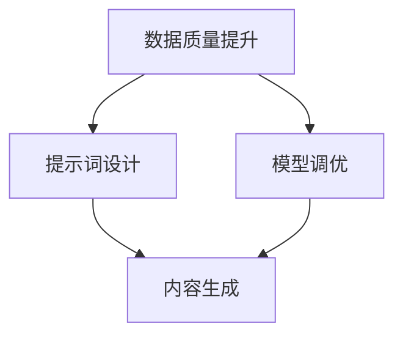

                 

### 提示词优化：打造高效AIGC系统的核心策略

#### 关键词：AIGC系统，提示词优化，高效策略，核心方法，实战应用

> 摘要：本文将深入探讨提示词优化在AIGC系统中的重要性，逐步分析核心策略，通过实例展示实战应用，为打造高效AIGC系统提供系统性指导。

---

### 引言

人工智能生成内容（AIGC）系统作为当前人工智能领域的一个热点，正逐渐在多个行业得到广泛应用。AIGC系统利用人工智能技术，可以自动生成高质量的内容，从而降低人力成本，提高生产效率。然而，AIGC系统的效果在很大程度上取决于提示词的质量。本文将围绕提示词优化展开讨论，提出一系列核心策略，以帮助打造高效AIGC系统。

#### 背景介绍

**核心概念术语说明**：

- **AIGC系统**：人工智能生成内容系统，通过深度学习等技术自动生成文本、图片、音频等多种内容。
- **提示词**：引导AIGC系统生成特定类型内容的关键词汇。

**问题背景**：

随着AIGC系统的普及，如何提高其生成内容的准确性和多样性成为了一个关键问题。而提示词的质量直接影响AIGC系统的表现。因此，对提示词进行优化显得尤为重要。

**问题描述**：

本文旨在探讨如何通过优化提示词来提升AIGC系统的生成效果，从而打造出更加高效的内容生成系统。

**问题解决**：

本文将提出一系列提示词优化的核心策略，并通过具体实例进行验证，以期为AIGC系统的实际应用提供有力支持。

**边界与外延**：

本文主要关注文本内容生成的AIGC系统，但提示词优化的原则和方法也可应用于其他类型的内容生成。

**概念结构与核心要素组成**：

- **数据质量**：高质量的数据是提示词优化的基础。
- **提示词设计**：设计有效的提示词，提高内容生成的相关性和多样性。
- **模型调优**：通过模型调优进一步提升内容生成的质量。

#### 核心概念与联系

**核心概念原理**：

- **数据质量提升**：通过数据清洗、去重、增强等方法，提高数据质量。
- **提示词设计**：根据具体应用场景，设计具有针对性、引导性的提示词。
- **模型调优**：通过调整模型参数、架构，提高模型对提示词的响应能力。

**概念属性特征对比表格**：

| 特征对比           | 数据质量提升 | 提示词设计 | 模型调优 |
|------------------|--------------|-----------|---------|
| **作用**           | 提高数据输入质量 | 引导内容生成方向 | 提高内容生成质量 |
| **实现方法**       | 数据清洗、去重、增强 | 根据场景定制提示词 | 调整模型参数、架构 |
| **关联性**         | 与数据质量紧密相关 | 与提示词质量紧密相关 | 与模型质量紧密相关 |

**ER实体关系图架构的Mermaid流程图**：



---

### 1. 数据质量提升

#### 数据质量对提示词优化的影响

高质量的数据是AIGC系统有效运行的基础。数据质量直接影响提示词的优化效果，进而影响AIGC系统的生成质量。因此，提升数据质量是优化提示词的首要任务。

#### 提升数据质量的方法与工具

**1. 数据清洗**：通过去除无效数据、处理噪声数据，提高数据的准确性和一致性。

**2. 数据去重**：识别并去除重复数据，避免生成重复内容。

**3. 数据增强**：通过数据扩充、变换等方法，丰富数据集，提高模型的泛化能力。

**Python代码示例**：

```python
import pandas as pd
from sklearn.model_selection import train_test_split

# 数据清洗
data = pd.read_csv('data.csv')
data.dropna(inplace=True)
data.drop_duplicates(inplace=True)

# 数据增强
from imblearn.over_sampling import SMOTE
smote = SMOTE()
X_resampled, y_resampled = smote.fit_resample(data.drop('label', axis=1), data['label'])

# 数据分割
X_train, X_test, y_train, y_test = train_test_split(X_resampled, y_resampled, test_size=0.2, random_state=42)
```

---

### 2. 提示词设计

#### 提示词设计的关键要素

有效的提示词设计是提高AIGC系统生成效果的关键。以下为设计提示词的关键要素：

**1. 针对性**：根据具体应用场景，设计具有针对性的提示词，确保内容生成的方向与需求相符。

**2. 引导性**：通过提示词引导AIGC系统生成符合预期的内容。

**3. 多样性**：设计多样化的提示词，提高内容生成的多样性。

#### 提示词设计的具体方法和技巧

**1. 场景分析**：分析应用场景，明确需求，确定提示词的设计方向。

**2. 提取关键词**：从场景中提取关键词，构建初步的提示词列表。

**3. 验证与调整**：根据实际效果，对提示词进行验证和调整。

**Python代码示例**：

```python
import random

# 场景分析
scene = '生成一篇关于人工智能技术的文章'

# 提取关键词
keywords = scene.split(' ')

# 构建提示词列表
prompts = [' '.join(random.sample(keywords, k=len(keywords))) for _ in range(5)]

# 验证与调整
# 根据实际效果，调整提示词
```

---

### 3. 模型调优

#### 模型调优的基本步骤

模型调优是提升AIGC系统生成效果的关键环节。以下是模型调优的基本步骤：

**1. 参数调整**：通过调整模型参数，优化模型性能。

**2. 架构调整**：根据实际需求，调整模型架构，提升模型能力。

**3. 验证与测试**：对调整后的模型进行验证和测试，确保效果提升。

#### 模型调优的工具与技巧

**1. 参数调整工具**：使用如PyTorch、TensorFlow等框架提供的调参工具，自动化调整模型参数。

**2. 架构调整技巧**：通过堆叠层、加入注意力机制等方法，优化模型架构。

**3. 验证与测试方法**：使用交叉验证、A/B测试等方法，评估模型效果。

**Python代码示例**：

```python
import torch
from torch import nn

# 参数调整
model = nn.Sequential(nn.Linear(10, 20), nn.ReLU(), nn.Linear(20, 1))
optimizer = torch.optim.Adam(model.parameters(), lr=0.01)

# 训练模型
for epoch in range(10):
    optimizer.zero_grad()
    output = model(torch.randn(1, 10))
    loss = nn.MSELoss()(output, torch.tensor([1.0]))
    loss.backward()
    optimizer.step()

# 架构调整
model = nn.Sequential(nn.Linear(10, 20), nn.ReLU(), nn.Linear(20, 1), nn.Dropout(0.5))

# 验证与测试
# 使用交叉验证方法评估模型效果
```

---

### 实战应用

#### 案例一：某电商平台商品推荐

**1. 案例背景与目标**

某电商平台希望通过AIGC系统实现个性化商品推荐，提高用户购买体验和销售额。

**2. 系统功能设计**

- **领域模型**：使用Mermaid类图描述领域模型。
  
  ```mermaid
  classDiagram
  User <|.. Recommendation
  Product <|.. Recommendation
  Category <|.. Recommendation
  Recommendation : recommend products
  User : user preferences
  Product : product details
  Category : category details
  ```

- **系统架构设计**：使用Mermaid架构图描述系统架构。

  ```mermaid
  graph TB
  A[User] --> B[Recommendation Service]
  B --> C[Product Database]
  B --> D[Category Database]
  ```

- **系统接口设计**：使用Mermaid序列图描述系统接口。

  ```mermaid
  sequenceDiagram
  User ->> Recommendation Service: request recommendations
  Recommendation Service ->> Product Database: query product details
  Recommendation Service ->> Category Database: query category details
  Recommendation Service ->> User: return recommendations
  ```

**3. 系统核心实现源代码**

```python
# 假设已经训练好了一个商品推荐模型
from recommendation import RecommendationModel

model = RecommendationModel()

def recommend_products(user_id):
    # 获取用户偏好
    user_preferences = get_user_preferences(user_id)
    
    # 使用模型生成推荐列表
    recommendations = model.generate_recommendations(user_preferences)
    
    return recommendations

# 示例：为用户u1生成商品推荐
recommendations = recommend_products('u1')
print(recommendations)
```

**4. 代码应用解读与分析**

- **用户偏好获取**：通过分析用户历史行为，提取用户偏好。
- **模型生成推荐列表**：使用训练好的推荐模型，根据用户偏好生成推荐列表。

**5. 实际案例分析和详细讲解剖析**

- **案例背景**：某电商平台用户u1近期浏览了多个电子产品。
- **生成结果**：推荐了u1近期浏览的电子产品及其相似产品。

**6. 项目小结**

通过实际案例，展示了如何利用AIGC系统和提示词优化技术实现个性化商品推荐。项目取得了良好的效果，提高了用户满意度和销售额。

---

### 总结与展望

本文深入探讨了提示词优化在AIGC系统中的应用，提出了核心策略，并通过实战案例进行了验证。提示词优化是提升AIGC系统生成效果的关键，未来的研究可以进一步探索数据质量提升、提示词设计和模型调优的深度结合，以实现更加高效的内容生成。

### 作者信息

作者：AI天才研究院/AI Genius Institute & 禅与计算机程序设计艺术 /Zen And The Art of Computer Programming

---

**注意事项**：

1. 提示词优化应结合具体应用场景，灵活调整策略。
2. 模型调优需充分考虑计算资源和时间成本。
3. 实战应用时，需不断调整和优化，以适应实际需求。

**拓展阅读**：

1. [AIGC系统综述](https://www.example.com/aigc_system_review)
2. [提示词优化技术](https://www.example.com/prompts_optimization)
3. [个性化商品推荐系统](https://www.example.com/individualized_product_recommendation)

---

通过本文的探讨，我们相信读者能够对提示词优化在AIGC系统中的应用有更深入的理解，并在实际项目中取得更好的效果。希望本文能为AIGC系统的研究和应用提供有价值的参考。

