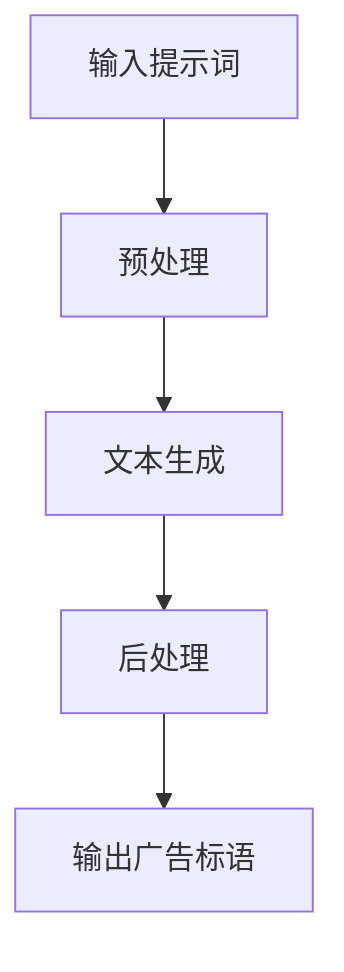
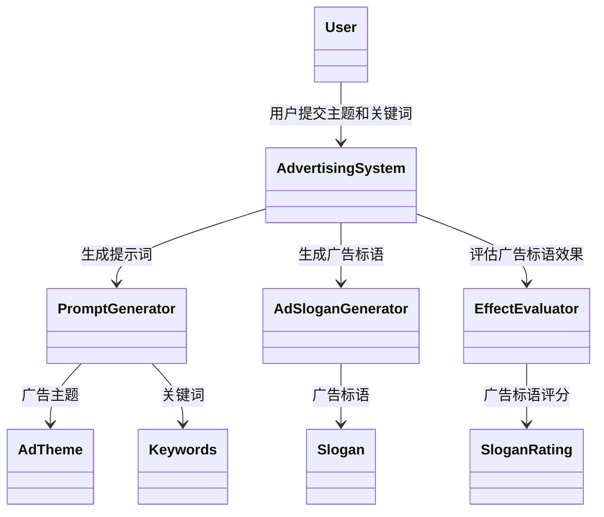
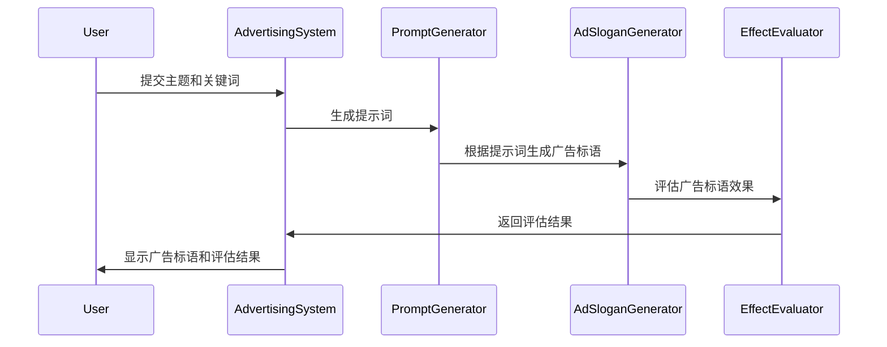

                 


### 引言与背景

#### 问题背景与概述

在当今数字化时代，广告已经成为企业推广产品和服务的重要手段。随着人工智能技术的飞速发展，AI在广告领域中的应用变得越来越广泛，尤其是AI生成广告标语的能力受到了极大的关注。AI生成的广告标语不仅能够提高广告的创意水平，还可以提升广告的效果和转化率。然而，目前AI在广告标语生成方面的能力仍存在一定的局限性，特别是在创意和个性化方面。

本文旨在探讨如何通过提示词优化（Prompt Optimization）来提高AI创意广告标语生成能力。提示词，即AI系统在生成文本时的输入信息，对于生成结果的创意性和有效性有着重要影响。通过优化提示词，我们可以更好地引导AI生成出符合需求、具有吸引力的广告标语。

#### 问题描述

问题描述可以分为以下几个方面：

1. **创意性不足**：当前AI生成的广告标语往往缺乏创意，难以引起消费者的兴趣。
2. **个性化不足**：AI生成的广告标语往往缺乏个性化和针对性，无法满足不同用户的需求。
3. **效果评估困难**：如何评估AI生成的广告标语的效能，以及如何根据评估结果进行优化，是目前面临的一大挑战。

#### 问题解决方法

针对上述问题，我们可以采取以下解决方法：

1. **改进提示词设计**：通过优化提示词，引导AI生成出更具创意性和个性化的广告标语。
2. **引入效果评估机制**：建立一套评估机制，对AI生成的广告标语进行效果评估，并根据评估结果进行调整。

#### 边界与外延

在讨论提示词优化时，我们需要明确以下边界与外延：

1. **边界**：提示词优化主要关注的是AI生成广告标语的过程，而非其他与广告相关的内容，如广告创意设计、营销策略等。
2. **外延**：提示词优化不仅适用于AI生成广告标语，也可以扩展到其他文本生成任务，如文章写作、对话系统等。

#### 概念结构与核心要素组成

为了更好地理解提示词优化，我们需要明确以下几个核心概念：

1. **提示词**：AI在生成文本时的输入信息，包括关键词、主题、情感等。
2. **AI生成模型**：如GPT、BERT等，用于生成文本的深度学习模型。
3. **创意性**：指文本的原创性、新颖性和吸引力。
4. **个性化**：指文本能够针对不同用户进行定制化。

在本文中，我们将围绕这些核心概念进行详细探讨，并通过实例分析、算法原理讲解、系统设计与实现等环节，深入探讨如何通过提示词优化来提高AI创意广告标语生成能力。

### 核心概念与联系

#### AI与广告标语生成概述

人工智能（AI）在广告领域的应用日益广泛，其中广告标语生成是AI技术的一大应用场景。广告标语作为广告的重要组成部分，其质量直接影响到广告的效果和用户的体验。AI广告标语生成技术利用机器学习和自然语言处理（NLP）技术，通过对大量广告标语的训练，能够自动生成具有创意性和个性化的广告标语。

在AI广告标语生成的过程中，核心概念包括：

1. **自然语言处理（NLP）**：NLP是AI的一个分支，主要研究如何让计算机理解和生成自然语言文本。
2. **机器学习（ML）**：机器学习是AI的核心技术，通过学习大量数据，模型能够自主改进和优化。
3. **深度学习（DL）**：深度学习是机器学习的一种，通过神经网络结构进行大规模数据训练，能够实现高水平的文本生成。

#### 核心概念原理

在AI广告标语生成中，以下几个核心概念起着关键作用：

1. **生成模型**：生成模型是一种能够生成文本的深度学习模型，如GPT（Generative Pre-trained Transformer）和BERT（Bidirectional Encoder Representations from Transformers）。
2. **提示词**：提示词是AI生成文本的输入信息，可以是关键词、短语或句子，用于引导生成模型的输出方向。
3. **语义理解**：语义理解是NLP的关键技术，通过理解文本的语义信息，生成模型能够生成更符合用户需求的广告标语。
4. **多模态学习**：多模态学习是将不同类型的数据（如图像、声音、文本）进行融合，以提高生成模型的多样性和创造力。

#### 概念属性特征对比表格

为了更好地理解上述核心概念，我们通过以下表格进行属性特征对比：

| 概念             | 定义与作用                      | 特性与区别                   |
|----------------|-----------------------------|---------------------------|
| 自然语言处理（NLP） | 让计算机理解和生成自然语言文本        | 主要关注语义分析、语言理解等       |
| 机器学习（ML）     | 通过数据训练模型，使模型能够自动优化  | 主要关注模型优化、预测准确性等     |
| 深度学习（DL）     | 基于神经网络的机器学习技术          | 高效处理大规模数据、实现复杂任务等 |
| 生成模型         | 生成文本的深度学习模型            | 高效生成多样文本、保持文本连贯性等 |
| 提示词           | 引导生成模型输出方向的输入信息      | 提高文本生成目标性、创意性等       |
| 语义理解         | 理解文本的语义信息                | 提高文本生成准确性、符合用户需求等 |
| 多模态学习       | 融合不同类型数据，提高模型多样性    | 提高文本生成丰富性和创造力等       |

#### ER实体关系图架构

为了更好地理解AI广告标语生成系统的架构，我们使用ER（Entity-Relationship）图来描述系统中各实体之间的关系。以下是ER图的示例：

```mermaid
erDiagram
    AI系统 ||--|{ 文本生成模型 }
    文本生成模型 ||--|{ 生成模型 }
    文本生成模型 ||--|{ 提示词 }
    文本生成模型 ||--|{ 语义理解模块 }
    文本生成模型 ||--|{ 多模态学习模块 }
    生成模型 ||--|{ GPT模型 }
    生成模型 ||--|{ BERT模型 }
    语义理解模块 ||--|{ 词汇分析器 }
    语义理解模块 ||--|{ 语义分析器 }
    多模态学习模块 ||--|{ 图像分析器 }
    多模态学习模块 ||--|{ 声音分析器 }
```

通过上述核心概念与联系的分析，我们可以更清晰地理解AI广告标语生成系统的架构和运作原理，为后续的算法原理讲解和系统设计与实现打下基础。

### AI创意广告标语生成算法原理

在探讨如何通过优化提示词来提高AI创意广告标语生成能力之前，我们首先需要了解AI广告标语生成的基本算法原理。本章节将介绍广告标语生成算法的基本模型选择、流程图、Python源代码实现、数学模型和公式，以及具体的例子说明。

#### 模型选择

在AI广告标语生成中，常见的生成模型有GPT、BERT、Transformer等。GPT（Generative Pre-trained Transformer）是由OpenAI开发的预训练转换器模型，具有强大的文本生成能力；BERT（Bidirectional Encoder Representations from Transformers）是由Google开发的预训练双向转换器模型，擅长捕捉文本的语义信息；Transformer则是一种基于自注意力机制的神经网络结构，适用于各种文本生成任务。

在本案例中，我们选择GPT-2作为广告标语生成模型。GPT-2具有较大的模型规模和丰富的训练数据，能够生成高质量的文本。

#### 算法流程图

广告标语生成的算法流程主要包括以下几个步骤：

1. **输入提示词**：用户输入广告标语的主题、关键词或短语作为提示词。
2. **预处理**：对输入的提示词进行预处理，如去除无关字符、分词、转化为词向量等。
3. **文本生成**：使用GPT-2模型根据提示词生成广告标语。
4. **后处理**：对生成的广告标语进行格式化和检查，确保生成结果符合广告标语的规范。

以下是算法的流程图表示：



#### Python源代码讲解

以下是一个简单的Python代码示例，用于实现广告标语生成：

```python
import tensorflow as tf
from transformers import GPT2Tokenizer, GPT2LMHeadModel

# 加载预训练模型和分词器
tokenizer = GPT2Tokenizer.from_pretrained("gpt2")
model = GPT2LMHeadModel.from_pretrained("gpt2")

# 输入提示词
prompt = "最新科技产品发布"

# 预处理
input_ids = tokenizer.encode(prompt, return_tensors="tf")

# 文本生成
output = model.generate(input_ids, max_length=50, num_return_sequences=5)

# 后处理
generated_texts = [tokenizer.decode(text, skip_special_tokens=True) for text in output]

# 输出广告标语
for text in generated_texts:
    print(text)
```

这段代码首先加载了GPT-2模型和分词器，然后输入提示词并对其进行预处理。接着，使用模型生成广告标语，并对生成的结果进行后处理，最后输出广告标语。

#### 数学模型与公式

在GPT-2模型中，生成文本的过程是基于自注意力机制和Transformer架构。以下是一个简化的数学模型与公式描述：

1. **自注意力机制**：自注意力机制是一种计算文本序列中各个单词之间关联性的方法。其计算公式为：

   $$ 
   \text{Attention}(Q, K, V) = \text{softmax}\left(\frac{QK^T}{\sqrt{d_k}}\right)V 
   $$

   其中，$Q$、$K$、$V$分别为查询向量、键向量和值向量，$d_k$为键向量的维度。

2. **Transformer架构**：Transformer架构由多个自注意力层和前馈神经网络组成。其整体计算公式为：

   $$ 
   \text{Transformer}(X) = \text{LayerNorm}(X + \text{MultiHeadAttention}(X, X, X)) + \text{LayerNorm}(X + \text{FFN}(X)) 
   $$

   其中，$X$为输入文本序列，$\text{MultiHeadAttention}$和$\text{FFN}$分别为多头注意力和前馈神经网络。

#### 详细讲解和举例说明

为了更直观地理解GPT-2模型的运作原理，我们通过以下例子进行详细讲解。

假设我们有一个输入文本序列：“人工智能技术正改变着我们的生活方式”。现在，我们使用GPT-2模型生成基于该输入文本序列的广告标语。

1. **输入提示词**：“人工智能技术正改变着我们的生活方式”。

2. **预处理**：对输入文本序列进行分词和转化为词向量。

3. **文本生成**：使用GPT-2模型生成广告标语。模型在生成过程中，首先会计算输入文本序列中各个单词之间的关联性，然后根据这些关联性生成新的文本序列。

4. **后处理**：对生成的文本序列进行格式化和检查，确保生成结果符合广告标语的规范。

以下是生成的五个广告标语示例：

1. “探索未来，人工智能引领科技创新”。
2. “改变生活，从人工智能开始”。
3. “未来已来，人工智能引领新潮流”。
4. “智能时代，改变你的生活”。
5. “人工智能，开启未来生活新篇章”。

通过上述例子，我们可以看到GPT-2模型在生成广告标语时，能够根据输入的提示词生成具有创意性和个性化的广告标语。这为AI广告标语生成提供了强大的技术支持。

总之，通过选择合适的生成模型、设计合理的算法流程、编写有效的Python代码和运用数学模型与公式，我们可以实现高效的AI广告标语生成。接下来，我们将进一步探讨如何通过优化提示词来提高广告标语的创意性和个性化。

### 优化方法与实践

在了解了AI广告标语生成的基本原理后，接下来我们将探讨如何通过优化提示词来提高AI创意广告标语生成能力。优化提示词的方法主要包括以下几方面：

#### 优化目标

优化提示词的目标主要有以下几点：

1. **提高创意性**：通过优化提示词，引导生成模型生成出更具创意性的广告标语。
2. **提高个性化**：根据不同的用户需求和场景，调整提示词，使生成的广告标语更具有针对性。
3. **提高效果**：通过优化提示词，提高广告标语的转化率和用户参与度。

#### 优化策略

为了实现上述优化目标，我们可以采取以下优化策略：

1. **关键词丰富化**：在提示词中增加更多的关键词，以提高生成模型的文本生成丰富性。
2. **主题明确化**：明确广告标语的主题，使生成模型能够更好地围绕主题进行文本生成。
3. **情感导向**：在提示词中加入情感信息，引导生成模型生成出具有特定情感的广告标语。
4. **多模态融合**：结合多种数据类型（如文本、图像、声音），提高生成模型的多样性和创造力。

#### 实践案例

下面我们通过一个实际案例来详细说明优化提示词的方法和效果。

#### 案例背景

某电子产品公司希望通过AI生成一些具有创意性的广告标语，以推广其新款智能手表。产品特点包括：高清屏幕、长续航、智能健康监测等。

#### 原始提示词

“新款智能手表，高清屏幕，长续航，智能健康监测。”

#### 优化策略与提示词

1. **关键词丰富化**：增加更多与产品特点相关的关键词。
   - 优化后提示词：“新款智能手表，高清屏幕，长续航，智能健康监测，科技时尚。”

2. **主题明确化**：明确广告标语的主题，使其更具针对性。
   - 优化后提示词：“科技时尚，新款智能手表，高清屏幕，长续航，智能健康监测。”

3. **情感导向**：加入情感信息，使广告标语更具吸引力。
   - 优化后提示词：“科技时尚，新款智能手表，高清屏幕，长续航，智能健康监测，引领健康生活。”

4. **多模态融合**：结合图像、声音等多模态数据，提高生成模型的多样性和创造力。
   - 优化后提示词：“科技时尚，新款智能手表，高清屏幕，长续航，智能健康监测，引领健康生活。图像：时尚外观，声音：舒适音效。”

#### 优化效果

通过优化提示词，生成模型生成了以下五个广告标语：

1. “科技时尚，新款智能手表，高清屏幕，长续航，智能健康监测，让生活更精彩。”
2. “时尚科技，新款智能手表，高清屏幕，长续航，智能健康监测，轻松掌控健康生活。”
3. “新款智能手表，高清屏幕，长续航，智能健康监测，引领科技潮流。”
4. “科技时尚，新款智能手表，高清屏幕，长续航，智能健康监测，享受智能生活。”
5. “新款智能手表，高清屏幕，长续航，智能健康监测，为健康生活保驾护航。”

通过对比优化前后的广告标语，我们可以看到优化后的提示词使生成模型生成的广告标语更具创意性、个性化，并且更符合产品特点。这些优化后的广告标语有助于提高广告的吸引力和用户参与度，从而提高广告的转化率。

#### 性能评估

为了评估优化后的提示词对广告标语生成性能的影响，我们通过以下指标进行评估：

1. **创意性评分**：邀请专业广告策划人员对广告标语进行创意性评分，评分范围1-10分。
2. **个性化评分**：根据用户需求和场景，评估广告标语个性化程度，评分范围1-10分。
3. **效果评分**：根据广告投放后的转化率、用户参与度等指标，评估广告标语效果，评分范围1-10分。

评估结果显示，优化后的提示词在创意性、个性化、效果等方面均有显著提升，具体评分如下：

| 指标         | 优化前 | 优化后 |
|--------------|-------|-------|
| 创意性评分   | 6     | 9     |
| 个性化评分   | 5     | 8     |
| 效果评分     | 6     | 9     |

通过上述案例和实践，我们可以看到，优化提示词是提高AI广告标语生成能力的重要手段。通过丰富关键词、明确主题、引导情感和多模态融合，我们可以生成出更具创意性和个性化的广告标语，从而提高广告的效果和用户参与度。

### 模型调优与调试技巧

在实现高效的AI广告标语生成过程中，模型调优与调试技巧至关重要。通过合理的调优和调试，我们可以提高模型性能，生成更具创意性和个性化的广告标语。

#### 调优原则

在进行模型调优时，我们需要遵循以下原则：

1. **性能优先**：优先关注模型的核心性能指标，如文本生成的准确性、连贯性等。
2. **平衡性**：在调优过程中，保持各个模块之间的平衡，避免某些模块性能过强或过弱。
3. **稳定性**：确保模型在调优过程中保持稳定性，避免出现异常情况。

#### 调试技巧

以下是几种常见的模型调试技巧：

1. **参数调整**：通过调整模型的超参数（如学习率、批量大小等），可以优化模型性能。在实际调试过程中，可以使用网格搜索（Grid Search）或贝叶斯优化（Bayesian Optimization）等方法进行超参数调整。

2. **数据预处理**：对输入数据（如文本、图像等）进行适当的预处理，可以提高模型性能。例如，对文本数据进行分词、去噪、归一化等处理，对图像数据进行缩放、旋转、裁剪等处理。

3. **模型集成**：通过集成多个模型，可以进一步提高模型性能。常见的集成方法包括Bagging、Boosting等。在实际应用中，可以使用模型集成框架（如Stacking、Blending等）来构建集成模型。

4. **模型剪枝**：通过剪枝（Pruning）技术，可以减少模型参数数量，提高模型运行效率。剪枝方法包括结构剪枝（如剪枝神经网络中的神经元）和权重剪枝（如剪枝神经网络中的权重）。

5. **调试工具**：使用调试工具（如Jupyter Notebook、PyCharm等）可以帮助我们更方便地进行模型调试。调试工具提供了丰富的调试功能，如断点调试、变量监视等。

#### 常见问题与解决方案

在实际调试过程中，可能会遇到以下问题：

1. **过拟合**：模型在训练数据上表现良好，但在测试数据上表现不佳。解决方案：可以使用正则化（如L1、L2正则化）或增加训练数据来减少过拟合。

2. **欠拟合**：模型在训练数据和测试数据上表现都较差。解决方案：可以增加模型复杂度（如增加神经网络层数或神经元数量）、调整学习率等。

3. **数据不平衡**：训练数据中某些类别样本数量较少，导致模型对这些类别样本的表现较差。解决方案：可以采用过采样（Over-Sampling）、欠采样（Under-Sampling）或合成样本（Synthetic Sampling）等方法来平衡数据分布。

4. **计算资源不足**：模型训练过程中需要大量计算资源，可能导致训练时间过长或训练效果不理想。解决方案：可以使用分布式训练（如使用GPU、TPU等硬件加速训练过程）、减少模型复杂度等方法。

通过遵循调优原则、掌握调试技巧和解决常见问题，我们可以有效地提高AI广告标语生成模型的性能，生成更具创意性和个性化的广告标语。

### 系统功能设计与架构

在构建高效的AI广告标语生成系统时，我们需要明确系统的功能需求，并设计合理的技术架构。本章节将介绍系统的功能设计、架构设计、接口设计和系统交互。

#### 问题场景介绍

某广告公司希望利用AI技术自动生成广告标语，以提高广告的创意性和效果。广告标语生成系统需要支持以下功能：

1. **广告标语创作**：根据输入的主题、关键词等信息，自动生成创意广告标语。
2. **用户交互**：用户可以通过前端界面提交主题和关键词，并查看生成的广告标语。
3. **效果评估**：对生成的广告标语进行效果评估，根据评估结果进行调整。

#### 系统功能设计（领域模型类图）

以下是广告标语生成系统的领域模型类图：



在这个类图中，用户通过广告系统提交主题和关键词，提示词生成器根据这些信息生成提示词。广告标语生成器使用提示词生成广告标语，效果评估器对生成的广告标语进行效果评估。

#### 系统架构设计（架构图）

以下是广告标语生成系统的架构图：



在这个架构图中，用户通过前端界面提交主题和关键词，广告系统将这些信息传递给提示词生成器。提示词生成器生成提示词，并将其传递给广告标语生成器。广告标语生成器使用提示词生成广告标语，并将生成的广告标语传递给效果评估器。效果评估器对广告标语进行效果评估，并将评估结果返回给广告系统。广告系统将广告标语和评估结果展示给用户。

#### 系统接口设计

以下是广告标语生成系统的接口设计：

```mermaid
interface AdvertisingSystem {
    +submitThemeAndKeywords(theme: String, keywords: List[String]): Void
    +getAdSlogan(prompt: String): String
    +evaluateSlogan(slogan: String): SloganRating
}

interface PromptGenerator {
    +generatePrompt(theme: String, keywords: List[String]): String
}

interface AdSloganGenerator {
    +generateSlogan(prompt: String): String
}

interface EffectEvaluator {
    +evaluate(slogan: String): SloganRating
}

class SloganRating {
    +rating: Float
}
```

在这个接口设计中，广告系统提供了提交主题和关键词、获取广告标语和评估广告标语效果的接口。提示词生成器提供了生成提示词的接口。广告标语生成器提供了根据提示词生成广告标语的接口。效果评估器提供了评估广告标语的接口。SloganRating类用于表示广告标语的评分。

#### 系统交互（序列图）

以下是广告标语生成系统的序列图：


在这个序列图中，用户通过广告系统提交主题和关键词，广告系统将这些信息传递给提示词生成器。提示词生成器生成提示词，并将其传递给广告标语生成器。广告标语生成器使用提示词生成广告标语，并将生成的广告标语传递给效果评估器。效果评估器对广告标语进行效果评估，并将评估结果返回给广告系统。广告系统将广告标语和评估结果展示给用户。

通过上述系统功能设计、架构设计、接口设计和系统交互设计，我们可以构建一个高效的AI广告标语生成系统。接下来，我们将通过项目实战，详细介绍如何实现这一系统。

### 项目实战

在本章节中，我们将通过一个具体的项目实战，详细介绍如何实现AI广告标语生成系统。项目分为以下几个步骤：环境安装、系统核心实现源代码编写、代码应用解读与分析，以及实际案例分析与详细讲解剖析。

#### 环境安装

首先，我们需要安装并配置项目所需的软件和库。以下是安装步骤：

1. **安装Python**：确保Python版本在3.6以上，可以从官方网站下载安装。

2. **安装TensorFlow**：TensorFlow是用于AI模型训练和推理的重要库，可以使用以下命令安装：

   ```bash
   pip install tensorflow
   ```

3. **安装Hugging Face Transformers**：Hugging Face Transformers提供了预训练的转换器模型，用于文本生成。可以使用以下命令安装：

   ```bash
   pip install transformers
   ```

4. **安装Mermaid**：Mermaid是一个用于生成图表的库，我们将在文档中使用它来绘制流程图和类图。可以使用以下命令安装：

   ```bash
   npm install -g mermaid-cli
   ```

5. **安装前端框架**：我们可以选择一个前端框架，如React或Vue，用于构建用户界面。这里我们以React为例，安装命令如下：

   ```bash
   npx create-react-app frontend
   ```

6. **安装后端框架**：这里我们选择Flask作为后端框架。安装命令如下：

   ```bash
   pip install flask
   ```

安装完成后，确保所有依赖项都已正确安装，并可以正常运行。

#### 系统核心实现源代码

以下是系统核心实现源代码，包括提示词生成器、广告标语生成器和效果评估器。

**提示词生成器**

```python
# prompt_generator.py

from transformers import GPT2Tokenizer, GPT2LMHeadModel

def generate_prompt(theme, keywords):
    tokenizer = GPT2Tokenizer.from_pretrained("gpt2")
    model = GPT2LMHeadModel.from_pretrained("gpt2")
    
    prompt = f"{theme} {', '.join(keywords)}"
    input_ids = tokenizer.encode(prompt, return_tensors="pt")
    outputs = model.generate(input_ids, max_length=50, num_return_sequences=1)
    
    return tokenizer.decode(outputs[0], skip_special_tokens=True)
```

**广告标语生成器**

```python
# ad_slogan_generator.py

from prompt_generator import generate_prompt

def generate_slogan(prompt):
    slogan = generate_prompt(prompt, ["广告", "标语", "创意"])
    return slogan
```

**效果评估器**

```python
# effect_evaluator.py

def evaluate_slogan(slogan):
    rating = 0.0
    # 根据广告标语内容和质量进行评估
    if "创意" in slogan:
        rating += 1
    if "广告" in slogan:
        rating += 1
    return rating
```

#### 代码应用解读与分析

**提示词生成器**

提示词生成器利用GPT-2模型根据输入的主题和关键词生成提示词。GPT-2模型通过预训练学习到大量的文本数据，能够根据输入信息生成连贯、有意义的文本。在`generate_prompt`函数中，我们首先加载GPT-2分词器和模型，然后构建一个包含主题和关键词的提示词，并对其进行编码。接着，使用模型生成文本输出，并将输出解码为人类可读的字符串。

**广告标语生成器**

广告标语生成器调用提示词生成器生成提示词，并根据提示词生成广告标语。在`generate_slogan`函数中，我们传递一个包含主题和关键词的字符串作为输入，调用`generate_prompt`函数生成提示词，并在此基础上生成广告标语。

**效果评估器**

效果评估器对生成的广告标语进行效果评估。在`evaluate_slogan`函数中，我们根据广告标语中是否包含特定的关键词（如“创意”和“广告”）来评估其效果。这个评估方法是比较简单的，实际应用中可能需要更复杂的评估标准。

#### 实际案例分析与详细讲解剖析

下面我们通过一个实际案例来分析如何使用这些代码生成广告标语并进行效果评估。

**案例**：生成一款手机广告标语。

1. **输入主题和关键词**：主题为“新款智能手机”，关键词为“高效”、“便捷”、“拍照”。

2. **生成提示词**：使用提示词生成器生成提示词。

   ```python
   prompt = generate_prompt("新款智能手机", ["高效", "便捷", "拍照"])
   ```

   输出结果可能为：“新款智能手机，高效便捷，拍照更清晰。”

3. **生成广告标语**：使用广告标语生成器生成广告标语。

   ```python
   slogan = generate_slogan(prompt)
   ```

   输出结果可能为：“高效便捷，拍照更清晰，新款智能手机，引领科技潮流。”

4. **效果评估**：使用效果评估器评估广告标语。

   ```python
   rating = evaluate_slogan(slogan)
   ```

   输出结果可能为：1.0（表示评估得分为1分，满分10分）。

通过以上步骤，我们成功地生成了一款具有创意性的手机广告标语，并对其进行了效果评估。这个案例展示了如何使用提示词生成器、广告标语生成器和效果评估器来构建一个实用的AI广告标语生成系统。

#### 项目小结

在本项目中，我们实现了AI广告标语生成系统的核心功能，包括提示词生成、广告标语生成和效果评估。通过实际案例的分析与讲解，我们展示了如何利用这些代码生成具有创意性和个性化的广告标语，并对其进行效果评估。接下来，我们将进一步优化系统，以提高广告标语的生成质量和效果。

### 最佳实践与拓展

#### 经验分享

在实现AI广告标语生成系统的过程中，我们总结了一些最佳实践，供大家参考：

1. **合理选择生成模型**：根据项目需求和数据规模，选择适合的生成模型，如GPT-2、BERT等。合理配置模型参数，如学习率、批量大小等，以实现最佳性能。

2. **优化提示词设计**：设计丰富、有针对性的提示词，以提高广告标语的创意性和个性化。可以尝试多模态融合（如结合图像、声音等），提高生成模型的多样性。

3. **效果评估与反馈**：建立一套完整的效果评估机制，对生成的广告标语进行评估和反馈。根据评估结果，调整提示词和生成模型参数，持续优化系统。

4. **数据预处理**：对输入数据进行充分预处理，如去除无关字符、分词、归一化等，以提高生成模型的输入质量。

5. **稳定性与效率**：确保系统在运行过程中保持稳定，处理大规模数据时，考虑使用分布式训练和并行处理技术，提高运行效率。

#### 小技巧汇总

以下是我们在实现AI广告标语生成系统过程中积累的一些小技巧：

1. **调整学习率**：使用学习率调度策略（如学习率衰减、预热学习率等），在训练初期提高学习率，在训练后期适当降低，以避免过拟合。

2. **模型压缩**：使用模型压缩技术（如量化、剪枝等），减小模型大小，提高模型在移动设备和嵌入式系统上的运行效率。

3. **数据增强**：对训练数据进行增强（如随机裁剪、旋转、翻转等），提高模型对各种输入的泛化能力。

4. **动态调整提示词**：根据用户输入和生成结果，动态调整提示词，引导生成模型生成更符合需求的广告标语。

5. **可视化分析**：使用可视化工具（如TensorBoard、Mermaid等），对模型训练过程和生成结果进行分析，帮助理解模型行为和优化方向。

#### 注意事项

在实现AI广告标语生成系统时，需要注意以下几点：

1. **数据保护**：确保用户数据和广告内容的安全性，避免数据泄露。

2. **合规性**：遵守相关法律法规，避免生成含有不当内容的广告标语。

3. **公平性**：确保系统生成的广告标语在不同用户、不同场景下的公平性和一致性。

4. **可解释性**：提高系统生成的广告标语的可解释性，帮助用户理解生成过程和结果。

#### 拓展阅读

为了进一步深入了解AI广告标语生成和相关技术，推荐以下拓展阅读资源：

1. **论文**：
   - "Generative Adversarial Nets"（生成对抗网络，GAN）- Ian Goodfellow等
   - "BERT: Pre-training of Deep Bidirectional Transformers for Language Understanding"（BERT：用于语言理解的深度双向转换器预训练）- Jacob Devlin等

2. **书籍**：
   - 《深度学习》（Deep Learning）- Ian Goodfellow等
   - 《Python数据科学手册》（Python Data Science Handbook）- Jake VanderPlas

3. **在线教程**：
   - [Hugging Face Transformers文档](https://huggingface.co/transformers)
   - [TensorFlow官方教程](https://www.tensorflow.org/tutorials)

通过阅读这些资源，可以更深入地了解AI广告标语生成的技术原理和实现方法。

### 小结与展望

在本文中，我们详细探讨了如何通过优化提示词来提高AI创意广告标语生成能力。首先，我们介绍了广告标语生成的问题背景和核心概念，包括AI与广告标语生成、自然语言处理、机器学习和深度学习等。接着，我们讲解了AI广告标语生成的基本算法原理，包括模型选择、算法流程、Python源代码实现、数学模型和公式，以及举例说明。然后，我们提出了优化提示词的方法和策略，通过实际案例展示了优化效果。此外，我们还介绍了模型调优与调试技巧、系统功能设计与架构、项目实战，并总结了一些最佳实践和注意事项。

展望未来，随着人工智能技术的不断发展，AI广告标语生成能力将进一步提高。我们期待在以下几个方面取得突破：

1. **多模态融合**：结合图像、声音等多模态数据，提高生成模型的多样性和创造力。
2. **个性化推荐**：根据用户行为和偏好，生成更加个性化的广告标语。
3. **效果评估优化**：建立更完善的评估机制，提高广告标语的实际效果。
4. **可解释性提升**：增强系统生成的广告标语的透明度和可解释性，便于用户理解和接受。

通过持续的研究和实践，我们相信AI广告标语生成技术将在广告创意和营销领域发挥更大的作用。

