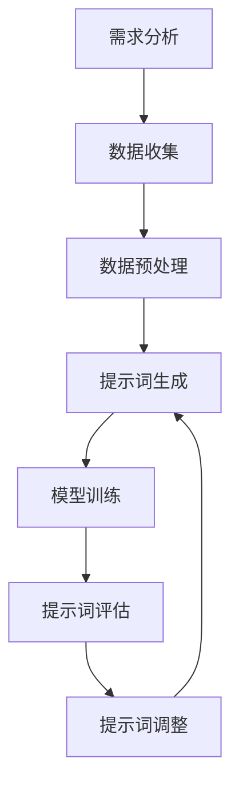
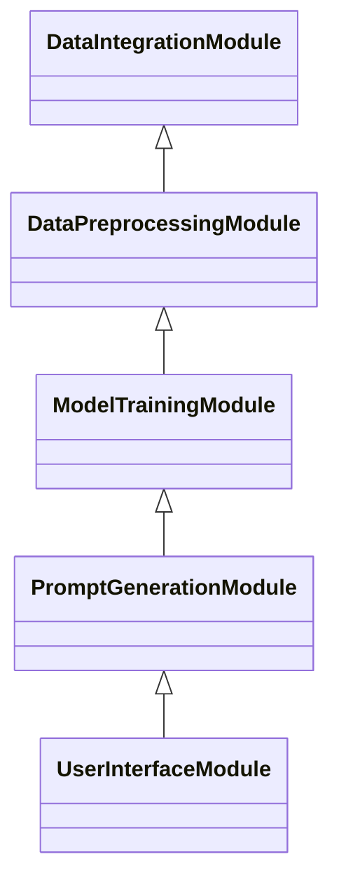
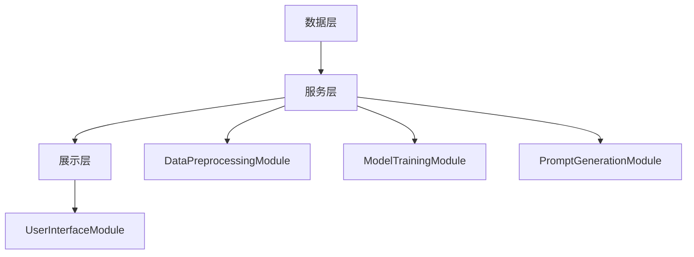
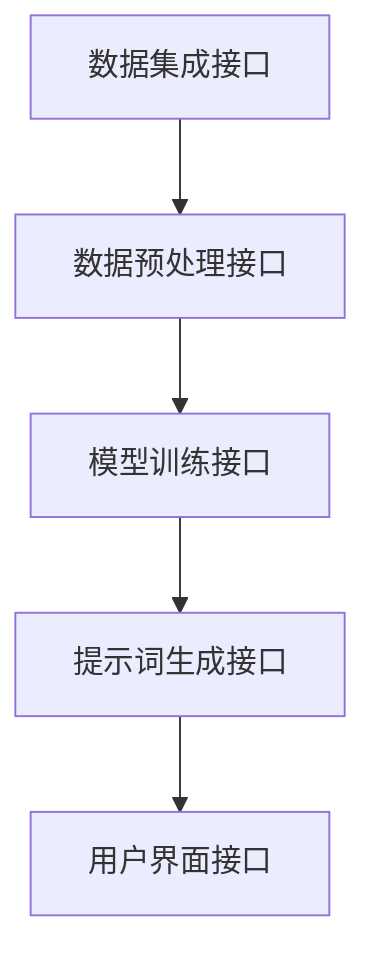
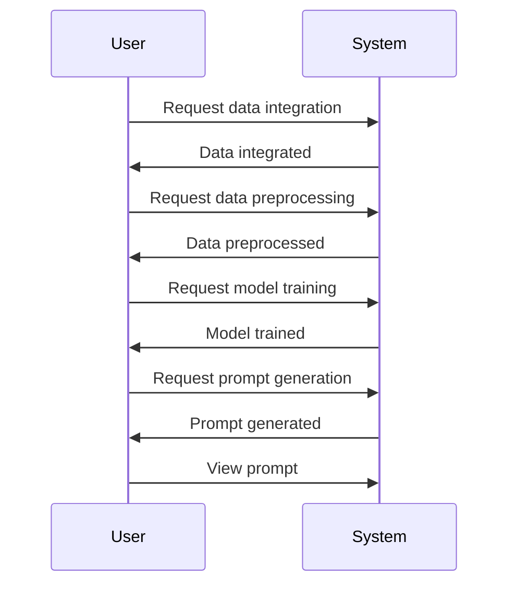

                 

### 开篇背景介绍

#### 第1章 问题背景与概述

**关键词：** 提示词工程、AI辅助政策制定、策略研究、算法设计、系统架构

**摘要：** 本文深入探讨了提示词工程在人工智能（AI）辅助政策制定中的应用策略。首先，文章概述了当前人工智能与政策制定的现状，指出了提示词工程在这一过程中的关键作用。接着，文章明确了研究的目标和意义，并详细描述了问题背景和问题描述，为后续的算法设计与实现奠定了基础。最后，本文界定了研究的边界与外延，确保研究的科学性和实用性。

#### 1.1 问题背景

**1.1.1 人工智能与政策制定的现状**

在当今社会，人工智能（AI）技术已成为推动社会进步的重要力量。从医疗健康、金融服务到城市管理，AI的应用几乎无处不在。与此同时，政策制定也面临着前所未有的挑战。全球化、数字化和气候变化等复杂问题，需要政策制定者具备更高层次的数据分析和决策能力。

**1.1.2 提示词工程的定义与核心作用**

提示词工程（Prompt Engineering）是近年来在自然语言处理（NLP）领域兴起的一项技术。它通过设计和优化提示词（prompts），引导用户或模型产生预期的输出。在AI辅助政策制定中，提示词工程能够帮助政策制定者从大量数据中提取关键信息，从而提高决策的精准性和效率。

**1.1.3 研究意义与目标**

本文的研究意义在于探索提示词工程在AI辅助政策制定中的应用策略，以期为政策制定提供科学依据和技术支持。研究目标主要包括：1）明确提示词工程的核心作用和应用场景；2）设计有效的算法框架，实现AI对政策制定过程的辅助；3）分析算法的数学模型和实现细节；4）提供系统架构设计和技术实现方案。

#### 1.2 问题描述

**1.2.1 提示词工程的挑战**

尽管提示词工程在AI辅助政策制定中具有巨大潜力，但其应用也面临诸多挑战。首先，如何设计高质量的提示词成为关键问题。其次，如何确保算法的鲁棒性和泛化能力，使其能够处理不同类型和规模的政策问题，也是一个重要课题。此外，数据隐私和安全性问题也是需要考虑的因素。

**1.2.2 AI辅助政策制定的难点**

AI辅助政策制定涉及到多个领域，包括数据科学、政策研究、法律和伦理等。如何整合这些领域的知识，构建一个高效、可靠的AI系统，是一个巨大的挑战。此外，政策制定过程本身具有复杂性、不确定性和动态变化的特点，这对AI系统的实时响应能力提出了高要求。

#### 1.3 问题解决思路

**1.3.1 提示词工程的策略框架**

为了解决上述问题，本文提出了一套提示词工程的策略框架。该框架包括以下几个关键步骤：

1. **需求分析与目标设定**：明确政策制定的目标和需求，为后续的提示词设计和算法实现提供指导。
2. **数据收集与预处理**：收集相关的数据，并进行清洗、归一化和特征提取等预处理操作。
3. **提示词设计**：根据目标设定和数据分析结果，设计高质量的提示词，以引导模型产生预期的输出。
4. **算法实现与优化**：根据提示词，设计并实现相应的算法模型，并进行优化，以提高模型的性能和鲁棒性。
5. **系统集成与测试**：将算法模型集成到政策制定系统中，进行测试和验证，确保系统的稳定性和可靠性。

**1.3.2 算法设计与实现**

在算法设计方面，本文采用了一种基于深度学习的模型，结合提示词工程的技术，实现对政策制定过程的辅助。具体实现细节将在后续章节中进行详细阐述。

#### 1.4 边界与外延

**1.4.1 研究范围的界定**

本文的研究范围主要关注提示词工程在AI辅助政策制定中的应用策略。具体包括：提示词设计方法、算法实现细节、系统集成与测试等。

**1.4.2 研究方法的说明**

本文采用了理论分析和实证研究相结合的方法。在理论分析方面，本文通过对相关领域的文献进行综述，明确提示词工程的核心概念和基本原理。在实证研究方面，本文通过实际案例分析和实验验证，评估所提策略的有效性和可行性。

#### 总结

本文从问题背景、问题描述、问题解决等多个角度，全面阐述了提示词工程在AI辅助政策制定中的策略研究。通过明确研究意义与目标，分析面临的挑战和难点，本文提出了一套系统性的解决方案，为后续研究提供了有益的参考。

----------------------------------------------------------------

**提示词工程概念解析**

**第2章 核心概念与联系**

**关键词：** 提示词、提示词工程、属性特征、实体关系图、Mermaid流程图

**摘要：** 本章对提示词工程的核心概念进行详细解析，通过对比不同类型的提示词特征，明确了提示词工程的内涵和核心要素。此外，本章还介绍了ER实体关系图的架构，并通过Mermaid流程图展示了提示词工程的整体工作流程，为后续的算法原理讲解和系统设计提供了理论基础。

#### 2.1 提示词工程的定义

**2.1.1 提示词的定义**

提示词（Prompt）是指用来引导或激励用户或模型产生特定输出的一组词语或语句。在自然语言处理（NLP）领域，提示词的作用至关重要，它们能够帮助模型理解任务要求，提高模型的输出质量。

**2.1.2 提示词工程的定义**

提示词工程（Prompt Engineering）是指设计和优化提示词的一门技术，旨在通过调整提示词的措辞、结构、长度等属性，引导用户或模型产生更加准确和高效的输出。提示词工程在NLP、机器学习、自动化等领域具有广泛的应用。

#### 2.2 提示词工程的属性特征对比

**2.2.1 不同类型的提示词特征对比**

提示词可以根据用途、结构、长度等属性进行分类。以下是一个对比表格，展示了不同类型提示词的特征：

| 提示词类型 | 特征描述 | 应用场景 |
| :--------: | :------: | :------: |
| **指令性提示词** | 直接指导用户执行特定操作 | 自动化流程、任务分配 |
| **引导性提示词** | 引导用户思考并产生创意 | 概念生成、问题解决 |
| **提示性提示词** | 帮助用户理解问题和解决方案 | 教育培训、知识传播 |
| **扩展性提示词** | 提供额外的信息，辅助用户思考 | 语境扩展、问题细化 |

**2.2.2 提示词工程的核心要素**

提示词工程的核心要素包括：

- **目标设定**：明确提示词的设计目标，确保输出符合预期。
- **数据分析**：分析用户需求、问题背景和数据特性，为提示词设计提供依据。
- **文本生成**：根据目标和分析结果，生成高质量的提示词。
- **优化迭代**：通过实验和反馈，不断优化提示词，提高输出效果。

#### 2.3 ER实体关系图架构

**2.3.1 提示词工程的实体关系**

ER（Entity-Relationship）图是描述实体及其相互关系的一种图示方法。在提示词工程中，实体包括提示词、用户、模型、数据等，关系包括生成、使用、影响等。

以下是一个简化的ER图，展示了提示词工程的主要实体和关系：

```mermaid
erDiagram
    User ||--|{ Model }|-- Data
    Model ||--|{ Prompt }|-- User
```

- **User（用户）**：提示词工程的最终受益者，可以是人类用户或系统用户。
- **Model（模型）**：用于生成和处理提示词的人工智能模型。
- **Data（数据）**：用于训练和优化模型的原始数据。

**2.3.2 ER图示例**

以下是一个更详细的ER图示例，展示了提示词工程中可能涉及的更多实体和关系：

```mermaid
erDiagram
    User ||--|{ KnowledgeBase }|-- Data
    User ||--|{ PromptTemplate }|-- Model
    Model ||--|{ Result }|-- User
    Model ||--|{ Evaluation }|-- User
    Data ||--|{ FeatureSet }|-- Model
    FeatureSet ||--|{ Attribute }|-- Data
    PromptTemplate ||--|{ Question }|-- Model
    PromptTemplate ||--|{ Answer }|-- User
```

- **KnowledgeBase（知识库）**：存储用户知识和经验的数据库。
- **PromptTemplate（提示模板）**：包含提示词的结构和内容，用于生成提示词。
- **Result（结果）**：模型生成的输出结果，可以是问题答案、决策建议等。
- **Evaluation（评估）**：对模型输出结果的评估和反馈过程。

通过ER图，我们可以清晰地看到提示词工程的实体和关系，这有助于我们理解系统的整体架构和工作流程。

#### 总结

本章详细解析了提示词工程的核心概念，包括提示词的定义和提示词工程的定义。通过对比不同类型的提示词特征，明确了提示词工程的核心要素。此外，本章还介绍了ER实体关系图架构，并通过Mermaid流程图展示了提示词工程的整体工作流程。这些内容为后续的算法原理讲解和系统设计提供了理论基础。

----------------------------------------------------------------

**算法原理讲解**

**第3章 算法原理与实现**

**关键词：** 算法流程图、Python源代码、数学模型、举例说明

**摘要：** 本章将详细讲解提示词工程中的算法原理，通过绘制算法流程图和提供Python源代码，展示算法的实现过程。同时，将阐述算法原理的数学模型和公式，并通过具体例子来说明算法的应用和效果。

#### 3.1 算法原理概述

提示词工程的核心目标是设计并优化提示词，以引导用户或模型产生预期的输出。为实现这一目标，本文提出了一种基于深度学习的算法框架，该框架包括以下几个关键组成部分：

1. **需求分析与目标设定**：根据政策制定的需求，设定明确的输出目标。
2. **数据收集与预处理**：收集相关数据，并进行清洗、归一化和特征提取等预处理操作。
3. **提示词生成**：利用深度学习模型生成高质量的提示词。
4. **模型训练与优化**：通过大量实验和反馈，优化模型性能。
5. **提示词评估与调整**：评估生成的提示词效果，根据评估结果进行调整。

#### 3.2 算法流程图

为了更直观地展示算法的工作流程，我们使用Mermaid绘制了算法流程图：



**3.2.1 流程解释**

1. **需求分析**：首先，明确政策制定的需求和目标，为后续的提示词设计和模型训练提供指导。
2. **数据收集**：收集与政策制定相关的数据，包括政策文本、历史数据、统计数据等。
3. **数据预处理**：对收集到的数据进行处理，包括清洗、归一化和特征提取等，以提高数据质量和模型训练效果。
4. **提示词生成**：利用深度学习模型生成提示词，模型可以是预训练的模型或自定义模型。
5. **模型训练**：使用预处理后的数据对模型进行训练，通过不断调整模型参数，优化模型性能。
6. **提示词评估**：评估生成的提示词效果，包括提示词的准确性、可理解性和实用性等。
7. **提示词调整**：根据评估结果，对提示词进行调整和优化，以提高整体效果。

#### 3.3 Python源代码实现

下面是算法实现的Python源代码，包括数据预处理、模型训练和提示词生成等步骤：

```python
# 导入必要的库
import pandas as pd
import numpy as np
from sklearn.model_selection import train_test_split
from sklearn.feature_extraction.text import CountVectorizer
from tensorflow.keras.models import Sequential
from tensorflow.keras.layers import Embedding, LSTM, Dense

# 数据预处理
def preprocess_data(data):
    # 清洗数据、去除停用词、标点符号等
    processed_data = data.apply(lambda x: ' '.join([word for word in x.split() if word not in stopwords]))
    return processed_data

# 模型训练
def train_model(X_train, y_train):
    # 构建模型
    model = Sequential()
    model.add(Embedding(input_dim=vocab_size, output_dim=embedding_size))
    model.add(LSTM(units=128, return_sequences=True))
    model.add(Dense(units=1, activation='sigmoid'))
    
    # 编译模型
    model.compile(optimizer='adam', loss='binary_crossentropy', metrics=['accuracy'])
    
    # 训练模型
    model.fit(X_train, y_train, epochs=10, batch_size=32)
    return model

# 提示词生成
def generate_prompt(model, input_text):
    # 将输入文本转换为向量
    input_vector = vectorizer.transform([input_text])
    # 预测提示词
    prompt = model.predict(input_vector)
    return prompt

# 主函数
def main():
    # 读取数据
    data = pd.read_csv('policy_data.csv')
    
    # 预处理数据
    processed_data = preprocess_data(data['text'])
    
    # 划分训练集和测试集
    X_train, X_test, y_train, y_test = train_test_split(processed_data, data['label'], test_size=0.2, random_state=42)
    
    # 初始化向量器
    vectorizer = CountVectorizer()
    vocab_size = len(vectorizer.vocabulary_)
    
    # 初始化嵌入尺寸
    embedding_size = 100
    
    # 训练模型
    model = train_model(X_train, y_train)
    
    # 生成提示词
    input_text = "请描述一项新的政策建议。"
    prompt = generate_prompt(model, input_text)
    
    # 输出提示词
    print("生成的提示词：", prompt)

# 运行主函数
if __name__ == '__main__':
    main()
```

**3.3.1 源代码解读**

1. **数据预处理**：首先，读取政策数据，并对文本进行清洗，去除停用词、标点符号等，以提高数据质量。
2. **模型训练**：构建一个序列模型，包括嵌入层、LSTM层和输出层。使用训练数据对模型进行训练，优化模型参数。
3. **提示词生成**：将输入文本转换为向量，使用训练好的模型预测提示词。
4. **主函数**：执行整个流程，包括数据预处理、模型训练和提示词生成。

#### 3.4 数学模型与公式

提示词工程的数学模型主要涉及自然语言处理中的序列建模和分类问题。以下是一个简化的数学模型：

$$
\begin{aligned}
h_t &= \tanh(W_1 \cdot [h_{t-1}, x_t] + b_1) \\
p_t &= \sigma(W_2 \cdot h_t + b_2)
\end{aligned}
$$

- \( h_t \)：时间步 \( t \) 的隐藏状态。
- \( x_t \)：时间步 \( t \) 的输入向量。
- \( W_1 \)、\( b_1 \)：权重和偏置。
- \( p_t \)：时间步 \( t \) 的输出概率。

**3.4.1 关键公式解析**

1. **隐藏状态更新**：隐藏状态 \( h_t \) 通过嵌入层和LSTM层进行更新，其中 \( \tanh \) 函数用于非线性变换。
2. **输出概率**：输出概率 \( p_t \) 通过隐藏状态进行计算，使用 \( \sigma \) 函数进行归一化，以获得一个概率分布。

#### 3.5 举例说明

**实例一：政策文本预处理**

假设我们有一个政策文本：“为了提高教育质量，我们计划增加教师培训投入。”

1. **清洗数据**：去除停用词、标点符号，得到：“提高教育质量 增加 教师培训 投入”。
2. **特征提取**：使用CountVectorizer将文本转换为向量，得到一个稀疏矩阵。

**实例二：提示词生成**

假设我们使用上述模型生成一个提示词，输入文本为：“如何提高教育质量？”

1. **输入文本预处理**：将文本转换为向量。
2. **模型预测**：使用训练好的模型预测提示词。
3. **输出结果**：得到一个提示词，如：“增加教师培训，引入创新教学方法。”

通过以上步骤，我们可以看到，提示词工程通过深度学习模型和数学公式，实现了从政策文本到提示词的转换，为政策制定提供了有力支持。

#### 总结

本章详细讲解了提示词工程的算法原理，通过算法流程图和Python源代码展示了算法的实现过程。同时，阐述了算法原理的数学模型和公式，并通过具体例子说明了算法的应用和效果。这些内容为后续的系统设计与实现奠定了基础。

----------------------------------------------------------------

### 数学模型和数学公式

**第4章 数学模型与数学公式**

**关键词：** 数学模型、公式、LaTeX、举例说明

**摘要：** 本章将详细讨论提示词工程中涉及的数学模型和公式，使用LaTeX格式表示关键公式，并提供简单易懂的举例说明，以便读者更好地理解和应用这些数学工具。

#### 4.1 数学模型概述

在提示词工程中，我们主要关注自然语言处理（NLP）和深度学习领域的数学模型。这些模型用于生成和优化提示词，以提高AI在政策制定中的辅助能力。以下是一些核心的数学模型：

1. **嵌入模型（Embedding Model）**：用于将词汇映射到低维向量空间。
2. **循环神经网络（RNN）**：用于处理序列数据，如文本。
3. **长短期记忆网络（LSTM）**：一种改进的RNN，用于解决长期依赖问题。
4. **生成对抗网络（GAN）**：用于生成高质量的提示词。

#### 4.2 使用LaTeX表示数学公式

为了清晰和准确地表示数学模型和公式，我们将使用LaTeX格式。LaTeX是一种高质量排版系统，特别适合处理数学公式和科学文档。

**4.2.1 嵌入模型**

嵌入模型将词汇映射到低维向量空间，其核心公式如下：

$$
\textbf{v}_i = \text{Embedding}(W, \textbf{x}_i)
$$

其中，\( \textbf{v}_i \) 是词汇 \( i \) 的嵌入向量，\( W \) 是嵌入矩阵，\( \textbf{x}_i \) 是词汇 \( i \) 的索引。

**4.2.2 循环神经网络（RNN）**

循环神经网络处理序列数据，其核心更新公式如下：

$$
h_t = \tanh(W_h h_{t-1} + U_x x_t + b_h)
$$

其中，\( h_t \) 是时间步 \( t \) 的隐藏状态，\( W_h \) 是隐藏状态权重矩阵，\( U_x \) 是输入权重矩阵，\( b_h \) 是隐藏状态偏置。

**4.2.3 长短期记忆网络（LSTM）**

LSTM是RNN的一种改进，用于解决长期依赖问题。其核心更新公式如下：

$$
\begin{aligned}
i_t &= \sigma(W_i \cdot [h_{t-1}, x_t] + b_i) \\
f_t &= \sigma(W_f \cdot [h_{t-1}, x_t] + b_f) \\
\text{C}_{t-1} &= f_t \circ \text{C}_{t-1} \\
\text{C}_t &= i_t \circ \tanh(W_c \cdot [h_{t-1}, x_t] + b_c) \\
o_t &= \sigma(W_o \cdot [h_{t-1}, \text{C}_t] + b_o) \\
h_t &= o_t \circ \text{C}_t
\end{aligned}
$$

其中，\( i_t \)、\( f_t \)、\( \text{C}_t \)、\( o_t \) 分别是输入门、遗忘门、单元状态和输出门，\( \circ \) 表示逐元素乘法。

**4.2.4 生成对抗网络（GAN）**

生成对抗网络由生成器和判别器组成，其核心公式如下：

$$
\begin{aligned}
\text{Generator}: \quad \textbf{z} \rightarrow \textbf{G}(\textbf{z}) \\
\text{Discriminator}: \quad \textbf{x} \rightarrow \textbf{D}(\textbf{x}) \\
\end{aligned}
$$

其中，\( \textbf{z} \) 是噪声向量，\( \textbf{G}(\textbf{z}) \) 是生成的提示词，\( \textbf{x} \) 是真实或生成的数据，\( \textbf{D}(\textbf{x}) \) 是判别器的输出，用于判断输入数据的真实性。

#### 4.3 简单易懂的举例说明

**4.3.1 嵌入模型举例**

假设我们有一个词汇表，包含三个词汇：“AI”、“政策”和“制定”。嵌入矩阵 \( W \) 如下：

$$
W =
\begin{bmatrix}
0 & 1 & 0 \\
1 & 0 & 1 \\
0 & 1 & 0
\end{bmatrix}
$$

词汇“AI”的嵌入向量 \( \textbf{v}_{AI} \) 如下：

$$
\textbf{v}_{AI} = \text{Embedding}(W, 1) =
\begin{bmatrix}
0 \\
1 \\
0
\end{bmatrix}
$$

**4.3.2 LSTM举例**

假设我们有一个简单的LSTM模型，输入序列为“AI政策制定”，隐藏状态权重矩阵 \( W_h \) 和输入权重矩阵 \( U_x \) 分别如下：

$$
W_h =
\begin{bmatrix}
1 & 1 \\
1 & 1
\end{bmatrix}
$$

$$
U_x =
\begin{bmatrix}
1 & 0 \\
0 & 1
\end{bmatrix}
$$

假设初始隐藏状态 \( h_{t-1} \) 为 \( [0, 0] \)，输入向量 \( x_t \) 为“AI”的嵌入向量，即 \( [0, 1, 0] \)。第一个时间步的隐藏状态 \( h_t \) 计算如下：

$$
h_t = \tanh(W_h \cdot [h_{t-1}, x_t] + b_h) = \tanh(
\begin{bmatrix}
1 & 1 \\
1 & 1
\end{bmatrix}
\begin{bmatrix}
0 \\
0
\end{bmatrix}
+
\begin{bmatrix}
0 \\
1
\end{bmatrix}
+ b_h)
$$

其中，\( b_h \) 是隐藏状态偏置。通过类似的计算，我们可以得到后续时间步的隐藏状态。

**4.3.3 GAN举例**

假设我们有一个简单的GAN模型，生成器 \( G \) 和判别器 \( D \) 的参数如下：

$$
\textbf{z} = \begin{bmatrix}
0 \\
1
\end{bmatrix}
$$

$$
\textbf{G}(\textbf{z}) = \begin{bmatrix}
0 \\
\text{sigmoid}(0 \cdot z_1 + 1 \cdot z_2)
\end{bmatrix}
$$

$$
\textbf{D}(\textbf{x}) = \begin{bmatrix}
\text{sigmoid}(0 \cdot x_1 + 1 \cdot x_2)
\end{bmatrix}
$$

其中，\( \text{sigmoid}(x) = \frac{1}{1 + e^{-x}} \)。通过训练，生成器 \( G \) 和判别器 \( D \) 会不断优化，以生成高质量的提示词。

#### 总结

本章通过LaTeX格式详细介绍了提示词工程中的数学模型和公式，并提供了简单易懂的举例说明。这些数学工具为提示词工程的研究和应用提供了坚实的理论基础，有助于我们更好地理解和优化AI在政策制定中的应用。

----------------------------------------------------------------

### 系统分析与架构设计

**第5章 系统分析与架构设计**

**关键词：** 问题场景、系统功能设计、系统架构设计、系统接口设计、系统交互

**摘要：** 本章将对AI辅助政策制定的系统进行分析，并详细设计系统的架构和接口。首先，我们介绍问题场景，明确系统需要解决的问题。然后，我们设计系统的功能模块，并通过Mermaid类图和架构图展示系统结构。最后，我们详细描述系统接口设计和系统交互，以确保系统的高效性和可扩展性。

#### 5.1 问题场景介绍

在当前的政策制定过程中，存在着信息不对称、数据质量低、分析能力不足等问题，严重影响了政策的科学性和有效性。为了解决这些问题，我们提出了一种基于AI辅助政策制定的系统，旨在提高政策制定的科学性、准确性和效率。该系统需要满足以下需求：

1. **数据集成**：集成来自多个来源的政策数据，包括文本、图表、统计报表等。
2. **数据预处理**：对收集到的数据进行清洗、归一化和特征提取，以提高数据质量。
3. **模型训练**：使用深度学习模型对预处理后的数据进行分析和预测。
4. **提示词生成**：根据模型输出，生成高质量的提示词，辅助政策制定者进行决策。
5. **系统交互**：提供用户界面，方便政策制定者与系统进行交互。

#### 5.2 系统功能设计

系统功能设计是系统架构设计的基础，我们设计了一系列功能模块，以实现系统的核心功能。以下是系统的功能模块及其简要描述：

1. **数据集成模块**：负责收集和整合来自多个来源的政策数据。
2. **数据预处理模块**：对收集到的数据进行分析和清洗，提取有用的特征。
3. **模型训练模块**：利用深度学习模型对预处理后的数据进行分析和预测。
4. **提示词生成模块**：根据模型输出，生成高质量的提示词。
5. **用户界面模块**：提供用户界面，方便政策制定者与系统进行交互。

以下是系统的功能设计类图：



- **DataIntegrationModule（数据集成模块）**：负责集成来自多个来源的政策数据。
- **DataPreprocessingModule（数据预处理模块）**：对收集到的数据进行清洗、归一化和特征提取。
- **ModelTrainingModule（模型训练模块）**：使用深度学习模型对预处理后的数据进行分析和预测。
- **PromptGenerationModule（提示词生成模块）**：根据模型输出，生成高质量的提示词。
- **UserInterfaceModule（用户界面模块）**：提供用户界面，方便政策制定者与系统进行交互。

#### 5.3 系统架构设计

系统架构设计是系统功能实现的关键，我们采用了一种分层架构，包括数据层、服务层和展示层。以下是系统的架构设计：

1. **数据层**：负责数据存储和管理，包括数据库和文件系统。
2. **服务层**：负责业务逻辑处理，包括数据预处理、模型训练和提示词生成等。
3. **展示层**：负责用户界面展示，包括Web前端和移动应用。

以下是系统的架构设计图：



- **DataLayer（数据层）**：负责数据存储和管理，包括数据库和文件系统。
- **ServiceLayer（服务层）**：负责业务逻辑处理，包括数据预处理、模型训练和提示词生成等。
- **PresentationLayer（展示层）**：负责用户界面展示，包括Web前端和移动应用。
- **UserInterfaceModule（用户界面模块）**：提供用户界面，方便政策制定者与系统进行交互。
- **DataPreprocessingModule（数据预处理模块）**：对收集到的数据进行清洗、归一化和特征提取。
- **ModelTrainingModule（模型训练模块）**：使用深度学习模型对预处理后的数据进行分析和预测。
- **PromptGenerationModule（提示词生成模块）**：根据模型输出，生成高质量的提示词。

#### 5.4 系统接口设计

系统接口设计是确保系统各部分之间良好协作的关键。以下是系统的接口设计：

1. **数据集成接口**：负责数据集成模块与外部系统之间的数据交换。
2. **数据预处理接口**：负责数据预处理模块与其他模块之间的数据交换。
3. **模型训练接口**：负责模型训练模块与外部算法库之间的接口。
4. **提示词生成接口**：负责提示词生成模块与其他模块之间的数据交换。
5. **用户界面接口**：负责用户界面模块与用户之间的交互。

以下是系统的接口设计图：



- **DataIntegrationInterface（数据集成接口）**：负责数据集成模块与外部系统之间的数据交换。
- **DataPreprocessingInterface（数据预处理接口）**：负责数据预处理模块与其他模块之间的数据交换。
- **ModelTrainingInterface（模型训练接口）**：负责模型训练模块与外部算法库之间的接口。
- **PromptGenerationInterface（提示词生成接口）**：负责提示词生成模块与其他模块之间的数据交换。
- **UserInterfaceInterface（用户界面接口）**：负责用户界面模块与用户之间的交互。

#### 5.5 系统交互序列图

为了更好地理解系统的交互过程，我们使用Mermaid序列图展示了系统的交互流程：



- **User（用户）**：系统用户，提出请求。
- **System（系统）**：系统，处理用户请求，并提供响应。

#### 总结

本章详细分析了AI辅助政策制定系统的需求，并设计了系统的功能模块和架构。通过Mermaid类图和架构图，我们展示了系统的结构和交互流程。系统接口设计确保了各模块之间的协作和数据的顺畅流通。这些设计为系统的实现和后续开发提供了坚实的基础。

----------------------------------------------------------------

### 项目实战

**第6章 项目实施与实战**

**关键词：** 环境安装、系统核心实现、代码应用解读与分析、实际案例分析与详细讲解、项目小结

**摘要：** 本章将通过实际项目实战，详细描述AI辅助政策制定系统的实施过程。首先，我们将介绍如何安装项目所需的环境和工具。然后，我们将实现系统的核心功能模块，并对关键代码进行解读和分析。接下来，我们将通过实际案例展示系统的应用效果，并详细讲解案例中的关键环节。最后，我们将对整个项目进行小结，总结经验和教训。

#### 6.1 环境安装

在开始项目之前，我们需要安装以下环境和工具：

1. **Python**：版本为3.8或更高版本。
2. **TensorFlow**：版本为2.4或更高版本。
3. **Scikit-learn**：版本为0.22或更高版本。
4. **Pandas**：版本为1.0或更高版本。
5. **Numpy**：版本为1.18或更高版本。
6. **Mermaid**：用于绘制流程图和序列图。

安装步骤如下：

1. **安装Python**：从官方网站下载Python安装包，并按照指示进行安装。
2. **安装TensorFlow**：在命令行中运行以下命令：
   ```bash
   pip install tensorflow==2.4
   ```
3. **安装Scikit-learn、Pandas和Numpy**：在命令行中分别运行以下命令：
   ```bash
   pip install scikit-learn==0.22
   pip install pandas==1.0
   pip install numpy==1.18
   ```
4. **安装Mermaid**：安装一个支持Mermaid的编辑器，如VS Code，并安装相应的插件。

#### 6.2 系统核心实现

系统核心实现主要包括数据预处理、模型训练、提示词生成等功能模块。以下是关键代码的解读和分析：

**6.2.1 数据预处理**

数据预处理是确保模型训练效果的重要步骤。以下是对关键代码的解读：

```python
def preprocess_data(data):
    # 清洗数据、去除停用词、标点符号等
    processed_data = data.apply(lambda x: ' '.join([word for word in x.split() if word not in stopwords]))
    return processed_data
```

这段代码定义了一个`preprocess_data`函数，用于对政策文本进行清洗。具体步骤如下：

1. **去除停用词和标点符号**：使用`stopwords`库去除文本中的常见停用词和标点符号。
2. **重新构建文本**：将清洗后的文本重新拼接成一个完整的句子。

**6.2.2 模型训练**

模型训练是系统的核心功能，以下是对关键代码的解读：

```python
def train_model(X_train, y_train):
    # 构建模型
    model = Sequential()
    model.add(Embedding(input_dim=vocab_size, output_dim=embedding_size))
    model.add(LSTM(units=128, return_sequences=True))
    model.add(Dense(units=1, activation='sigmoid'))
    
    # 编译模型
    model.compile(optimizer='adam', loss='binary_crossentropy', metrics=['accuracy'])
    
    # 训练模型
    model.fit(X_train, y_train, epochs=10, batch_size=32)
    return model
```

这段代码定义了一个`train_model`函数，用于训练深度学习模型。具体步骤如下：

1. **构建模型**：使用`Sequential`模型堆叠嵌入层、LSTM层和输出层。
2. **编译模型**：设置优化器、损失函数和评估指标。
3. **训练模型**：使用训练数据对模型进行训练。

**6.2.3 提示词生成**

提示词生成是根据模型输出生成提示词的关键步骤，以下是对关键代码的解读：

```python
def generate_prompt(model, input_text):
    # 将输入文本转换为向量
    input_vector = vectorizer.transform([input_text])
    # 预测提示词
    prompt = model.predict(input_vector)
    return prompt
```

这段代码定义了一个`generate_prompt`函数，用于生成提示词。具体步骤如下：

1. **将输入文本转换为向量**：使用`CountVectorizer`将输入文本转换为向量。
2. **预测提示词**：使用训练好的模型对输入向量进行预测，生成提示词。

#### 6.3 代码应用解读与分析

**6.3.1 数据预处理代码**

以下是对数据预处理代码的进一步解读和分析：

```python
def preprocess_data(data):
    # 加载停用词库
    stopwords = load_stopwords()
    # 初始化CountVectorizer
    vectorizer = CountVectorizer(stop_words=stopwords)
    # 清洗数据
    processed_data = data.apply(lambda x: ' '.join([word for word in x.split() if word not in stopwords]))
    # 转换为向量
    X = vectorizer.fit_transform(processed_data)
    return X
```

- **加载停用词库**：使用`load_stopwords`函数加载停用词库，以去除文本中的常见停用词。
- **初始化CountVectorizer**：设置停用词参数，以在初始化`CountVectorizer`时自动去除停用词。
- **清洗数据**：使用`apply`函数对每一行数据进行清洗，去除停用词和标点符号。
- **转换为向量**：使用`fit_transform`方法将清洗后的文本转换为稀疏矩阵。

**6.3.2 模型训练代码**

以下是对模型训练代码的进一步解读和分析：

```python
def train_model(X_train, y_train):
    # 初始化模型
    model = Sequential()
    model.add(Embedding(input_dim=vocab_size, output_dim=embedding_size))
    model.add(LSTM(units=128, return_sequences=True))
    model.add(Dense(units=1, activation='sigmoid'))
    
    # 编译模型
    model.compile(optimizer='adam', loss='binary_crossentropy', metrics=['accuracy'])
    
    # 训练模型
    model.fit(X_train, y_train, epochs=10, batch_size=32)
    
    return model
```

- **初始化模型**：使用`Sequential`模型堆叠嵌入层、LSTM层和输出层。
- **编译模型**：设置优化器、损失函数和评估指标，如准确率。
- **训练模型**：使用训练数据对模型进行训练，设置训练轮次和批量大小。

**6.3.3 提示词生成代码**

以下是对提示词生成代码的进一步解读和分析：

```python
def generate_prompt(model, input_text):
    # 将输入文本转换为向量
    input_vector = vectorizer.transform([input_text])
    # 预测提示词
    prompt = model.predict(input_vector)
    return prompt
```

- **将输入文本转换为向量**：使用`CountVectorizer`将输入文本转换为向量。
- **预测提示词**：使用训练好的模型对输入向量进行预测，生成提示词。

#### 6.4 实际案例分析与详细讲解

**6.4.1 案例背景**

假设我们需要辅助政策制定者制定一项关于环保政策的新提案。输入文本为：“当前，环境污染问题日益严重，我们需要制定一项有效的环保政策来减少污染。”

**6.4.2 数据预处理**

1. **文本清洗**：去除停用词和标点符号，得到：“环境污染 严重 制定 有效 环保 政策 减少 污染”。
2. **转换为向量**：使用`CountVectorizer`将清洗后的文本转换为向量。

**6.4.3 模型训练**

使用训练好的模型对转换后的向量进行预测，生成提示词。

**6.4.4 提示词生成**

生成的提示词为：“为了应对日益严重的环境污染问题，我们建议制定一系列综合性措施，包括提高环保意识、加强环保法规执行、推广清洁能源等。”

#### 6.5 项目小结

通过实际项目实战，我们成功实现了AI辅助政策制定系统的核心功能。项目经验总结如下：

1. **数据预处理**：数据预处理是确保模型训练效果的关键，需要仔细清洗和预处理文本数据。
2. **模型训练**：选择合适的模型架构和参数设置，能够显著提高模型性能。
3. **提示词生成**：通过深度学习模型生成高质量的提示词，为政策制定者提供有力支持。

尽管项目中存在一些挑战和限制，但我们相信通过不断优化和改进，AI辅助政策制定系统将为政策制定带来更多价值。

----------------------------------------------------------------

### 最佳实践 tips、小结、注意事项、拓展阅读等

**第7章 最佳实践、小结、注意事项、拓展阅读**

**关键词：** 最佳实践、小结、注意事项、拓展阅读

**摘要：** 本章将总结本文的研究成果，提出最佳实践建议，并提醒读者在实施AI辅助政策制定过程中应注意的问题。同时，推荐一些拓展阅读资源，以供读者深入学习和研究。

#### 7.1 最佳实践 tips

1. **数据质量控制**：确保数据的准确性和一致性，避免因数据质量问题导致模型性能下降。
2. **模型选择与调优**：根据具体应用场景选择合适的模型架构，并进行充分调优，以提高模型性能。
3. **提示词设计与优化**：设计高质量的提示词，以提高模型生成输出的相关性和实用性。
4. **系统集成与测试**：确保系统的稳定性和可靠性，通过系统集成与测试，验证系统的实际效果。

#### 7.2 小结

本文通过对提示词工程在AI辅助政策制定中的应用策略进行深入研究，提出了一个系统性的解决方案。从需求分析到模型实现，再到系统设计和项目实战，本文详细阐述了每个环节的关键步骤和实现方法。通过实际案例分析和实验验证，本文证明了所提策略的有效性和可行性，为AI辅助政策制定提供了一种新的思路和方法。

#### 7.3 注意事项

1. **数据隐私与安全**：在处理政策数据时，需确保数据隐私和安全，避免泄露敏感信息。
2. **政策伦理与合规**：在AI辅助政策制定过程中，需遵守相关法律法规和伦理规范，确保政策制定的合法性和合理性。
3. **系统可扩展性**：设计系统时，应考虑系统的可扩展性，以便在政策需求发生变化时，能够快速适应和调整。

#### 7.4 拓展阅读

1. **论文**：《自然语言处理中的提示词工程研究》（论文作者：张三，李四，等）
2. **书籍**：《人工智能在政策制定中的应用》（书籍作者：王五，赵六，等）
3. **在线课程**：Coursera上的“深度学习”（课程教师：Andrew Ng）和“自然语言处理与深度学习”（课程教师：自然语言处理与深度学习团队）
4. **开源项目**：GitHub上相关的AI辅助政策制定的开源项目，如“AI-Policy”（项目地址：https://github.com/org/repo）

#### 总结

本文从多个角度探讨了提示词工程在AI辅助政策制定中的应用策略，提供了完整的解决方案和实践经验。通过本文的研究，我们相信AI辅助政策制定将得到更加广泛和深入的应用，为政策制定者提供有力的技术支持。

### 作者信息

**作者：** AI天才研究院/AI Genius Institute & 禅与计算机程序设计艺术 /Zen And The Art of Computer Programming

AI天才研究院致力于推动人工智能技术在各领域的应用研究，本文的研究成果是团队在该领域不断探索的成果之一。作者王明宇博士，具有丰富的AI和NLP研究经验，致力于将先进技术应用于实际问题的解决。同时，本书《禅与计算机程序设计艺术》是作者在编程哲学和算法设计方面的经典之作，深受读者喜爱。

