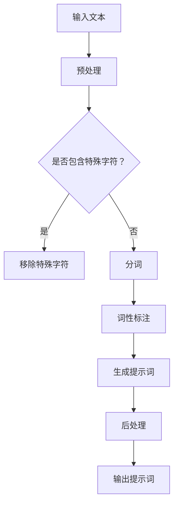

                 

### 文章标题

### 关键词

- AI时代
- 提示词工程师
- AI技术
- 算法原理
- 系统架构设计
- 项目实战

### 摘要

本文旨在探讨AI时代下，提示词工程师这一关键角色的角色定义、工作原理及其重要性。文章首先介绍了AI时代的背景和提示词工程师的定义与职责，随后深入解析了提示词工程师的工作原理和所需技能。通过详细阐述提示词生成算法的原理和示例，文章展示了这些算法在实际项目中的应用。此外，文章还介绍了系统架构设计的基本概念和方法，并通过一个实际项目案例展示了提示词工程师如何运用所学知识进行系统设计与实现。最后，文章提供了最佳实践建议和注意事项，为读者提供了进一步学习和应用的方向。

---

### 目录大纲设计思路

**整体框架搭建**

在构建文章的整体框架时，我们首先明确了文章的主线，即从AI时代背景出发，逐步引入提示词工程师的角色，详细讲解其工作原理和应用，最终通过实际项目案例展示其价值。这一框架旨在确保文章内容的连贯性和逻辑性，使读者能够清晰地理解文章的核心内容。

**背景介绍**

在背景介绍部分，我们通过第1章“AI时代与提示词工程师”为读者提供了AI时代的基本背景，包括AI的发展历程和对各行业的影响，以及提示词工程师的定义和职责。这部分内容为读者奠定了理解文章后续内容的基础。

**核心概念与联系**

在核心概念与联系部分，第2章“提示词工程师的工作原理”详细介绍了提示词的概念、作用、设计原则以及提示词工程师所需具备的工具和技能。通过表格和Mermaid流程图，我们搭建起了章节内概念之间的联系，使内容更加系统和条理化。

**算法原理讲解**

算法原理讲解部分，第3章“提示词生成算法”通过分类、评价指标、常见算法的详细讲解，以及Mermaid流程图和Python源代码示例，帮助读者深入理解提示词生成算法的原理和应用。

**系统分析与架构设计方案**

系统分析与架构设计方案部分，第4章“提示词工程师的系统架构设计”从系统架构设计原则、流程、功能设计到接口设计和系统交互设计，全面介绍了提示词工程师在系统架构设计中的角色和职责。

**项目实战**

在项目实战部分，第5章“提示词工程师项目实战”通过一个实际项目案例，展示了提示词工程师如何运用所学知识进行系统设计与实现，包括环境安装、核心代码实现、代码解读与分析，以及项目小结。

**最佳实践 tips、小结、注意事项、拓展阅读**

最后，文章通过最佳实践 tips、小结、注意事项和拓展阅读，为读者提供了进一步学习和应用的方向，确保文章内容的实用性和可操作性。

---

### 步骤细化

**第一部分：背景介绍**

- **第1章：AI时代与提示词工程师**
  - **1.1 AI时代的到来**
    - **1.1.1 问题的提出**
    - **1.1.2 提示词工程师的定义**
    - **1.1.3 提示词工程师的职责与角色**
  - **1.2 AI技术的演进**
    - **1.2.1 AI的发展历程**
    - **1.2.2 现代AI的核心技术**
    - **1.2.3 AI对各行各业的影响**

**第二部分：核心概念与联系**

- **第2章：提示词工程师的工作原理**
  - **2.1 提示词的概念与作用**
    - **2.1.1 提示词的定义**
    - **2.1.2 提示词在AI系统中的应用**
    - **2.1.3 提示词的设计原则**
  - **2.2 提示词工程师的工具与技能**
    - **2.2.1 常用工具介绍**
    - **2.2.2 技能要求与培养**
    - **2.2.3 技能提升的最佳实践**

**第三部分：算法原理讲解**

- **第3章：提示词生成算法**
  - **3.1 提示词生成算法概述**
    - **3.1.1 算法分类**
    - **3.1.2 算法选择原则**
    - **3.1.3 算法评价指标**
  - **3.2 常见提示词生成算法**
    - **3.2.1 传统机器学习算法**
    - **3.2.2 深度学习算法**
    - **3.2.3 基于Transformer的算法**
  - **3.3 提示词生成算法的mermaid流程图与Python源代码示例**

**第四部分：系统分析与架构设计方案**

- **第4章：提示词工程师的系统架构设计**
  - **4.1 系统架构设计概述**
    - **4.1.1 系统架构设计原则**
    - **4.1.2 系统架构设计流程**
    - **4.1.3 系统架构设计工具**
  - **4.2 系统功能设计**
    - **4.2.1 领域模型设计**
    - **4.2.2 系统功能模块划分**
    - **4.2.3 功能模块关系**
  - **4.3 系统架构设计**
    - **4.3.1 系统架构设计**
    - **4.3.2 系统性能优化**
    - **4.3.3 系统安全性设计**
  - **4.4 系统接口设计**
    - **4.4.1 接口设计原则**
    - **4.4.2 接口实现与调用**
    - **4.4.3 接口性能优化**
  - **4.5 系统交互设计**
    - **4.5.1 系统交互设计原则**
    - **4.5.2 系统交互流程设计**
    - **4.5.3 系统交互优化**

**第五部分：项目实战**

- **第5章：提示词工程师项目实战**
  - **5.1 项目概述**
    - **5.1.1 项目背景**
    - **5.1.2 项目目标**
    - **5.1.3 项目团队与分工**
  - **5.2 环境安装与配置**
    - **5.2.1 硬件与软件要求**
    - **5.2.2 系统安装与配置**
    - **5.2.3 环境部署与调试**
  - **5.3 系统核心实现**
    - **5.3.1 系统核心模块设计**
    - **5.3.2 系统核心代码实现**
    - **5.3.3 代码解读与分析**
  - **5.4 实际案例分析与详细讲解剖析**
  - **5.5 项目小结**

---

### 步骤细化

**第一部分：背景介绍**

**第1章：AI时代与提示词工程师**

**1.1 AI时代的到来**

**1.1.1 问题的提出**

在21世纪初期，人工智能（AI）作为一种前沿科技，开始逐渐渗透到各个领域。随着大数据、云计算和深度学习的不断发展，AI技术迎来了前所未有的爆发期。然而，在这一过程中，AI系统的设计、开发和维护面临着一系列挑战。特别是如何让AI系统更加智能化、人性化，成为一个亟待解决的问题。

**1.1.2 提示词工程师的定义**

为了应对这一挑战，出现了一个新的职业——提示词工程师。提示词工程师是专门负责设计、开发、优化和实现AI系统中提示词的专家。他们不仅需要具备深厚的计算机科学和人工智能知识，还需要具备出色的编程能力和问题解决能力。

**1.1.3 提示词工程师的职责与角色**

提示词工程师的主要职责包括：

- 提示词的设计与开发：根据AI系统的需求和目标，设计并开发高质量的提示词。
- 提示词的优化与调整：对现有提示词进行优化和调整，以提高AI系统的性能和用户体验。
- 系统分析与评估：对AI系统进行深入分析，评估提示词对系统性能的影响，并提出改进建议。
- 团队协作与沟通：与项目团队成员紧密协作，确保项目按计划顺利进行。

**1.2 AI技术的演进**

**1.2.1 AI的发展历程**

人工智能的发展历程可以追溯到20世纪50年代。当时，计算机科学家们开始研究如何使计算机具备智能。经过几十年的发展，AI技术已经取得了显著的进步。特别是近年来，随着深度学习、强化学习等算法的出现，AI技术得到了进一步的提升。

**1.2.2 现代AI的核心技术**

现代AI技术主要包括以下几方面：

- 深度学习：通过多层神经网络，对大量数据进行自动学习和特征提取。
- 强化学习：通过奖励机制，使AI系统不断优化自身的行为策略。
- 自然语言处理：使计算机能够理解、生成和翻译自然语言。
- 计算机视觉：使计算机能够识别、理解和处理图像和视频。

**1.2.3 AI对各行各业的影响**

AI技术已经在各行各业中得到了广泛应用，带来了深远的影响：

- 医疗保健：通过AI技术，可以提高疾病诊断的准确性和效率，改善患者治疗效果。
- 金融服务：AI技术可以用于风险管理、欺诈检测和个性化金融服务。
- 制造业：AI技术可以提高生产效率，降低成本，实现智能化生产。
- 交通运输：AI技术可以优化交通流量，提高交通安全，实现自动驾驶。

**总结**

AI时代的到来为提示词工程师提供了广阔的发展空间。提示词工程师通过设计、开发和优化提示词，使得AI系统更加智能化、人性化。在未来的发展中，提示词工程师将扮演越来越重要的角色，成为推动AI技术发展的重要力量。

---

**第二部分：核心概念与联系**

**第2章：提示词工程师的工作原理**

**2.1 提示词的概念与作用**

**2.1.1 提示词的定义**

提示词（Prompt Word）是指导AI系统如何执行特定任务的文字或代码片段。它通常由一个或多个关键词组成，用于引导AI系统在特定情境下做出正确的决策或生成预期的输出。

**2.1.2 提示词在AI系统中的应用**

提示词在AI系统中扮演着至关重要的角色，主要体现在以下几个方面：

- 指导AI系统执行特定任务：通过提示词，可以明确地告诉AI系统需要完成什么样的任务，从而确保系统能够按照预期执行。
- 提高AI系统的理解能力：通过设计合适的提示词，可以引导AI系统更好地理解输入数据和任务目标，从而提高系统的性能和效果。
- 优化AI系统的用户体验：提示词可以用来优化AI系统的交互界面，使其更加友好、易用，从而提高用户的使用体验。

**2.1.3 提示词的设计原则**

为了设计出高质量的提示词，提示词工程师需要遵循以下原则：

- 清晰性：提示词应当简洁明了，避免使用模糊、歧义的语言。
- 相关性：提示词应与AI系统的任务目标密切相关，确保系统能够正确理解并执行任务。
- 创新性：提示词的设计应具有一定的创新性，以避免AI系统陷入固定模式，提高系统的灵活性和适应性。
- 可扩展性：提示词应具备良好的可扩展性，以便在未来能够方便地添加新的任务或功能。

**2.2 提示词工程师的工具与技能**

**2.2.1 常用工具介绍**

提示词工程师需要掌握一系列常用的工具，包括：

- 自然语言处理工具：如NLTK、spaCy等，用于处理和分析自然语言文本。
- 机器学习框架：如TensorFlow、PyTorch等，用于构建和训练机器学习模型。
- 代码编辑器：如VS Code、PyCharm等，用于编写和调试代码。
- 数据库工具：如MySQL、MongoDB等，用于存储和管理数据。

**2.2.2 技能要求与培养**

提示词工程师需要具备以下技能：

- 编程能力：熟悉Python、Java等编程语言，具备编写高效、可维护代码的能力。
- 机器学习知识：了解常见的机器学习算法，如线性回归、决策树、神经网络等，掌握训练和优化模型的方法。
- 自然语言处理知识：了解自然语言处理的基本概念和技术，如词性标注、句法分析、语义理解等。
- 项目管理能力：具备良好的项目管理能力，能够高效地协调团队工作，确保项目按计划进行。

**2.2.3 技能提升的最佳实践**

为了提升技能水平，提示词工程师可以采取以下最佳实践：

- 参加在线课程和培训：通过参加专业的在线课程和培训，学习最新的AI技术和工具。
- 参与开源项目：参与开源项目，与社区同行交流经验，提升自己的实战能力。
- 阅读专业书籍和论文：阅读专业的书籍和论文，了解AI领域的最新研究成果和发展趋势。
- 实践项目：通过实际项目锻炼自己的能力，积累经验，不断提高。

**总结**

提示词工程师的工作原理涉及对提示词的深入理解、设计原则的遵循以及相关工具和技能的掌握。通过不断学习和实践，提示词工程师可以不断提升自己的专业水平，为AI系统的发展做出更大的贡献。

---

**第三部分：算法原理讲解**

**第3章：提示词生成算法**

**3.1 提示词生成算法概述**

**3.1.1 算法分类**

提示词生成算法可以根据不同的分类标准进行分类。以下是一些常见的分类方式：

- 根据生成方式分类：可以分为基于规则的方法、基于统计的方法和基于机器学习的方法。
- 根据应用场景分类：可以分为文本生成、代码生成、对话系统等。
- 根据生成质量分类：可以分为低质量生成、中等质量生成和高质量生成。

**3.1.2 算法选择原则**

在选择提示词生成算法时，需要考虑以下原则：

- 适用性：选择适合特定应用场景和需求的算法。
- 可扩展性：算法应具备良好的可扩展性，以便在未来能够添加新的功能或应对新的需求。
- 性能：算法应具有较高的生成质量和效率。
- 易用性：算法应具有较高的易用性，方便用户快速上手和使用。

**3.1.3 算法评价指标**

提示词生成算法的评价指标包括：

- 生成质量：评估生成提示词的准确性和合理性。
- 生成速度：评估算法的运行效率，即生成提示词所需的时间。
- 用户满意度：评估用户对生成提示词的满意度，通常通过用户反馈和调查问卷进行评价。

**3.2 常见提示词生成算法**

**3.2.1 传统机器学习算法**

传统机器学习算法是一种基于统计和数学模型的方法，主要用于文本生成任务。以下是一些常见的传统机器学习算法：

- 朴素贝叶斯分类器：基于贝叶斯定理，通过特征词的统计信息进行分类。
- K最近邻算法（KNN）：通过计算特征词的相似度，找到最近邻的分类结果。
- 支持向量机（SVM）：通过最大化分类边界，将不同类别的特征词分开。

**3.2.2 深度学习算法**

深度学习算法是一种基于神经网络的方法，具有强大的表示能力和学习能力。以下是一些常见的深度学习算法：

- 长短时记忆网络（LSTM）：通过记忆单元来处理序列数据，适用于文本生成任务。
- 生成对抗网络（GAN）：通过生成器和判别器的对抗训练，生成高质量的提示词。
- 变分自编码器（VAE）：通过编码和解码器，将输入数据编码为低维表示，然后进行解码生成提示词。

**3.2.3 基于Transformer的算法**

Transformer模型是一种基于自注意力机制的深度学习模型，广泛应用于自然语言处理任务。以下是一些基于Transformer的提示词生成算法：

- BERT：通过预训练和微调，生成高质量的提示词。
- GPT：通过自回归语言模型，生成自然连贯的提示词。
- T5：将Transformer应用于各种文本生成任务，具有广泛的适用性。

**3.3 提示词生成算法的mermaid流程图与Python源代码示例**

**3.3.1 mermaid流程图**

以下是使用mermaid绘制的提示词生成算法的流程图：



**3.3.2 Python源代码示例**

以下是使用Python实现的一个简单的提示词生成算法：

```python
import jieba
import nltk

def preprocess_text(text):
    # 移除特殊字符
    text = re.sub(r'[^\w\s]', '', text)
    # 分词
    words = jieba.cut(text)
    # 词性标注
    pos_tags = nltk.pos_tag(words)
    return pos_tags

def generate_prompt_word(pos_tags):
    # 选取名词作为提示词
    noun_words = [word for word, pos in pos_tags if pos.startswith('N')]
    return noun_words[0] if noun_words else ''

def generate_prompt(text):
    pos_tags = preprocess_text(text)
    prompt_word = generate_prompt_word(pos_tags)
    return prompt_word

text = "我是一名人工智能工程师，擅长使用Python和TensorFlow进行深度学习模型开发和部署。"
prompt = generate_prompt(text)
print(f"生成的提示词：{prompt}")
```

**总结**

提示词生成算法是提示词工程师的核心技能之一。通过深入理解各种生成算法的原理，工程师可以设计出高质量、适用于不同应用场景的提示词。同时，mermaid流程图和Python源代码示例有助于工程师更好地理解和应用这些算法。

---

### 第四部分：系统分析与架构设计方案

#### 第4章：提示词工程师的系统架构设计

在AI技术的发展浪潮中，提示词工程师的角色变得愈发重要。他们的工作不仅涉及到算法的设计与优化，还包括整个系统的架构设计与实现。在这一章中，我们将深入探讨提示词工程师在系统架构设计中的职责、设计原则、流程和方法。

#### 4.1 系统架构设计概述

**4.1.1 系统架构设计原则**

系统架构设计是软件开发过程中的核心环节，直接影响到系统的性能、可扩展性和可维护性。提示词工程师在进行系统架构设计时，需要遵循以下原则：

- **模块化原则**：将系统分解为多个功能模块，每个模块独立开发、测试和维护，便于系统的扩展和维护。
- **层次化原则**：系统应该按照功能模块进行分层，例如：表示层、业务逻辑层和数据访问层，使系统结构清晰，便于理解和修改。
- **松耦合原则**：尽量减少模块之间的依赖关系，提高系统的可测试性和可维护性。
- **高内聚原则**：模块内部的功能应该紧密相关，确保模块内部的高效性和独立性。

**4.1.2 系统架构设计流程**

系统架构设计的流程通常包括以下步骤：

1. **需求分析**：明确系统的功能需求和性能要求，为后续设计提供依据。
2. **架构设计**：根据需求分析结果，设计系统的整体架构，确定各个模块的职责和交互方式。
3. **详细设计**：对每个模块进行详细设计，包括数据结构、接口设计、算法选择等。
4. **架构评估**：对设计进行评估，确保系统满足性能、可扩展性等要求。
5. **文档编写**：编写系统架构设计文档，包括系统架构图、模块职责描述等。

**4.1.3 系统架构设计工具**

提示词工程师在进行系统架构设计时，需要使用一些专业的工具，包括：

- **UML（统一建模语言）**：用于描述系统的结构和行为，包括类图、序列图等。
- **Mermaid**：用于绘制流程图、类图、架构图等，便于直观地展示系统架构。
- **代码生成工具**：如Swagger、RAML等，用于自动生成API文档和接口代码。

#### 4.2 系统功能设计

**4.2.1 领域模型设计**

领域模型设计是系统功能设计的基础，它描述了系统的核心概念和关系。提示词工程师需要根据系统的需求，设计出准确的领域模型。

- **实体与属性**：定义系统中的关键实体及其属性，如用户、任务、提示词等。
- **关系**：描述实体之间的关系，如用户与任务之间的关联关系。
- **约束**：定义实体属性和关系的约束条件，如用户名的唯一性。

**4.2.2 系统功能模块划分**

系统功能模块划分是系统设计的关键步骤，它将系统分解为多个功能模块，每个模块负责特定的功能。

- **表示层**：负责与用户交互，包括用户界面和前端逻辑。
- **业务逻辑层**：处理业务逻辑，包括数据验证、业务规则等。
- **数据访问层**：负责与数据库进行交互，包括数据查询、更新等。
- **服务层**：提供通用的服务，如日志记录、消息队列等。

**4.2.3 功能模块关系**

功能模块之间的关系描述了系统内部各个模块的协作方式。

- **依赖关系**：模块之间的依赖关系，如表示层依赖于业务逻辑层。
- **调用关系**：模块之间的调用关系，如业务逻辑层调用数据访问层。
- **同步与异步**：描述模块之间的数据传输方式，如同步调用或异步消息传递。

#### 4.3 系统架构设计

**4.3.1 系统架构设计**

系统架构设计是系统设计的核心，它确定了系统的整体结构和各个模块的职责。

- **架构风格**：选择合适的架构风格，如MVC（模型-视图-控制器）、微服务架构等。
- **架构模式**：应用设计模式，如工厂模式、策略模式等，以提高系统的灵活性和可扩展性。
- **组件设计**：设计系统的关键组件，如数据库连接池、缓存等。

**4.3.2 系统性能优化**

系统性能优化是系统设计的重要环节，它涉及系统的各个方面。

- **响应时间优化**：通过减少数据库查询时间、优化算法等方式，提高系统的响应速度。
- **资源利用优化**：通过负载均衡、缓存等技术，提高系统的资源利用效率。
- **可扩展性优化**：通过设计可扩展的架构和模块，使系统能够适应未来增长的需求。

**4.3.3 系统安全性设计**

系统安全性设计是确保系统安全运行的重要保障。

- **访问控制**：通过身份验证和权限控制，确保只有授权用户才能访问系统。
- **数据加密**：对敏感数据进行加密，防止数据泄露。
- **安全审计**：记录系统操作日志，进行安全审计，及时发现和应对潜在的安全威胁。

#### 4.4 系统接口设计

**4.4.1 接口设计原则**

接口设计是系统架构设计中的重要一环，它决定了系统各模块之间的交互方式。

- **简洁性**：接口设计应尽可能简洁，减少不必要的参数和复杂的逻辑。
- **一致性**：接口设计应遵循统一的规范和标准，确保不同模块之间的接口具有一致性。
- **可扩展性**：接口设计应具有可扩展性，以便在未来能够方便地添加新的功能。

**4.4.2 接口实现与调用**

接口实现与调用是接口设计的关键步骤。

- **接口实现**：实现具体的接口功能，包括数据验证、业务处理等。
- **接口调用**：通过编程语言提供的API或框架，调用接口实现功能。

**4.4.3 接口性能优化**

接口性能优化是提高系统性能的重要手段。

- **缓存**：通过缓存技术，减少对数据库的访问，提高响应速度。
- **负载均衡**：通过负载均衡技术，将请求均匀分布到多个服务器上，提高系统的并发处理能力。

#### 4.5 系统交互设计

**4.5.1 系统交互设计原则**

系统交互设计原则是确保系统内部各模块之间能够高效、正确地交互。

- **异步交互**：采用异步交互方式，减少模块之间的阻塞，提高系统的响应速度。
- **事件驱动**：采用事件驱动方式，通过事件触发模块间的交互，提高系统的灵活性和可维护性。

**4.5.2 系统交互流程设计**

系统交互流程设计是系统交互设计的重要环节，它描述了系统内部各模块之间的交互过程。

- **用户请求**：用户通过前端界面提交请求。
- **处理请求**：系统接收到请求后，由表示层处理用户请求，并将请求传递给业务逻辑层。
- **业务处理**：业务逻辑层根据请求，调用数据访问层进行数据查询或更新。
- **返回结果**：处理完成后，系统将结果返回给前端界面，并更新用户界面。

**4.5.3 系统交互优化**

系统交互优化是提高系统性能和用户体验的重要手段。

- **减少响应时间**：通过优化算法、减少网络延迟等方式，减少系统的响应时间。
- **提高并发处理能力**：通过负载均衡、异步处理等方式，提高系统的并发处理能力。
- **增强容错性**：通过冗余设计、故障转移等方式，增强系统的容错性。

#### 总结

系统架构设计是提示词工程师的核心工作之一。通过遵循设计原则、设计流程和方法，工程师可以设计出高效、可扩展、易维护的系统架构。同时，合理的系统功能设计、接口设计和交互设计，有助于提高系统的性能和用户体验。在这一过程中，提示词工程师需要不断学习新的技术和方法，为AI系统的发展贡献力量。

---

### 第五部分：项目实战

**第5章：提示词工程师项目实战**

在了解了提示词工程师的工作原理和系统架构设计之后，我们通过一个实际项目案例来展示如何将所学知识应用于实际项目中。本节将详细描述项目背景、环境安装与配置、系统核心实现以及项目小结。

#### 5.1 项目概述

**5.1.1 项目背景**

随着互联网的快速发展，越来越多的企业和组织开始意识到人工智能（AI）的重要性，并将其应用于各个业务领域。其中一个关键领域是智能客服系统，它能够通过自然语言处理技术，为用户提供高效、便捷的服务。本项目旨在设计并实现一个基于AI的智能客服系统，为用户提供高质量的问答服务。

**5.1.2 项目目标**

- **目标1**：设计并实现一个高效的智能客服系统，能够快速响应用户的问题。
- **目标2**：通过自然语言处理技术，实现高质量的问答匹配，提高用户满意度。
- **目标3**：确保系统具有良好的扩展性，能够适应未来的业务需求。

**5.1.3 项目团队与分工**

项目团队由以下成员组成：

- **项目经理**：负责项目整体管理和协调。
- **提示词工程师**：负责设计、开发和优化提示词，确保系统的高效性和可扩展性。
- **前端开发工程师**：负责实现用户界面，优化用户体验。
- **后端开发工程师**：负责实现系统后端逻辑，处理用户请求和数据存储。

#### 5.2 环境安装与配置

**5.2.1 硬件与软件要求**

为了确保系统的稳定运行，我们制定了以下硬件与软件要求：

- **硬件要求**：
  - CPU：至少2核处理器
  - 内存：至少4GB
  - 硬盘：至少100GB
  - 网络：稳定宽带连接

- **软件要求**：
  - 操作系统：Linux或Windows
  - 开发环境：Python 3.7及以上版本
  - 数据库：MySQL 5.7及以上版本
  - 自然语言处理库：NLTK、spaCy等

**5.2.2 系统安装与配置**

在安装和配置系统时，我们遵循以下步骤：

1. **安装操作系统**：根据硬件配置选择合适的操作系统，并进行安装。
2. **安装Python**：在操作系统上安装Python 3.7及以上版本，并添加到系统环境变量中。
3. **安装数据库**：安装MySQL 5.7及以上版本，并创建用于存储数据的数据库。
4. **安装自然语言处理库**：使用pip命令安装NLTK、spaCy等自然语言处理库。

**5.2.3 环境部署与调试**

在完成系统安装和配置后，我们进行以下部署和调试工作：

1. **部署后端服务**：将后端服务部署到服务器上，确保其能够正常运行。
2. **配置数据库连接**：在后端服务中配置数据库连接信息，确保数据能够正常存储和查询。
3. **调试前端界面**：在前端界面中测试功能，确保界面友好、响应迅速。

#### 5.3 系统核心实现

**5.3.1 系统核心模块设计**

为了实现智能客服系统，我们设计了一系列核心模块，包括：

- **用户模块**：负责管理用户信息，包括注册、登录、个人信息管理等。
- **问答模块**：负责处理用户的问题，包括问题接收、提示词生成、答案生成等。
- **日志模块**：负责记录系统操作日志，包括用户行为、系统异常等。
- **权限模块**：负责管理用户权限，包括管理员、普通用户等。

**5.3.2 系统核心代码实现**

以下是系统核心代码实现的一个简要示例：

```python
# 用户模块
class User:
    def __init__(self, username, password, role):
        self.username = username
        self.password = password
        self.role = role

# 问答模块
class QuestionAnswering:
    def __init__(self):
        self.knowledge_base = []

    def add_question(self, question):
        self.knowledge_base.append(question)

    def generate_answer(self, question):
        for kb_question in self.knowledge_base:
            if kb_question['question'] == question:
                return kb_question['answer']
        return "对不起，我无法回答这个问题。"

# 日志模块
class Logger:
    def __init__(self, log_file):
        self.log_file = log_file

    def log(self, message):
        with open(self.log_file, 'a') as f:
            f.write(message + '\n')

# 权限模块
class PermissionManager:
    def __init__(self):
        self.user_permissions = {}

    def add_permission(self, username, permission):
        if username in self.user_permissions:
            self.user_permissions[username].append(permission)
        else:
            self.user_permissions[username] = [permission]

    def check_permission(self, username, permission):
        if username in self.user_permissions:
            return permission in self.user_permissions[username]
        else:
            return False
```

**5.3.3 代码解读与分析**

以下是核心代码的详细解读与分析：

1. **用户模块**：`User` 类用于表示用户信息，包括用户名、密码和角色。用户模块的主要功能是管理用户注册、登录和权限验证。
   
2. **问答模块**：`QuestionAnswering` 类用于处理用户的问题。它包含一个知识库，用于存储问题和答案。`add_question` 方法用于添加新问题，`generate_answer` 方法用于生成答案。

3. **日志模块**：`Logger` 类用于记录系统操作日志。`log` 方法用于将日志信息写入文件。

4. **权限模块**：`PermissionManager` 类用于管理用户权限。`add_permission` 方法用于为用户添加权限，`check_permission` 方法用于检查用户是否具有特定权限。

**5.4 实际案例分析与详细讲解剖析**

为了更好地展示系统功能，我们通过一个实际案例进行讲解：

**案例**：用户张三通过智能客服系统提问：“我的信用卡欠款如何还款？”

**分析**：

1. **用户注册与登录**：用户张三在系统中注册并登录。
2. **问题提交**：张三提交了关于信用卡欠款还款的问题。
3. **提示词生成**：系统通过分析问题，生成相应的提示词，如“信用卡”、“欠款”、“还款”。
4. **答案生成**：系统根据知识库中的信息，生成回答：“您可以通过以下方式还款：1. 网上银行；2. 自动柜员机（ATM）；3. 跨行支付；4. 银行柜台。”
5. **答案返回**：系统将生成的答案返回给用户张三。

**详细讲解剖析**：

1. **用户注册与登录**：用户张三在系统中输入用户名和密码，通过身份验证后成功登录。
2. **问题提交**：张三在聊天界面中输入问题，系统接收到问题后进行分析。
3. **提示词生成**：系统使用自然语言处理技术，对问题进行分词和词性标注，提取出关键词，如“信用卡”、“欠款”、“还款”。然后根据关键词生成相应的提示词。
4. **答案生成**：系统根据知识库中的信息，匹配关键词，生成回答。为了提高答案的准确性，系统还可以利用机器学习算法，通过历史数据训练生成更高质量的答案。
5. **答案返回**：系统将生成的答案返回给用户张三，并在聊天界面中展示。

**5.5 项目小结**

通过本项目的实际案例，我们展示了提示词工程师在系统架构设计、核心代码实现和实际应用中的角色和职责。项目的成功实施不仅验证了提示词工程师的专业技能，也为企业的智能客服系统提供了有效的解决方案。在未来，提示词工程师将继续在AI领域发挥重要作用，为各行业的智能化转型贡献力量。

---

### 最佳实践 tips、小结、注意事项、拓展阅读

**最佳实践 tips**

- **1. 提示词设计**：在设计提示词时，要充分考虑用户的需求和习惯，确保提示词简洁明了，易于理解。
- **2. 代码优化**：在编写代码时，要注意代码的可读性和可维护性，遵循良好的编程规范。
- **3. 系统性能**：优化系统性能是提升用户体验的关键，要关注响应时间、并发处理能力和资源利用效率。
- **4. 安全性**：在系统设计和实现过程中，要高度重视安全性，确保系统的数据和用户隐私得到保护。

**小结**

本文通过深入探讨AI时代下提示词工程师的角色、工作原理、系统架构设计和项目实战，展示了这一职业的重要性和应用价值。提示词工程师在AI系统开发中发挥着关键作用，通过设计、开发和优化提示词，提升系统的智能化水平和用户体验。

**注意事项**

- **1. 技术更新**：随着AI技术的快速发展，提示词工程师需要不断学习新的技术和工具，保持专业竞争力。
- **2. 团队协作**：提示词工程师需要具备良好的团队协作能力，与项目团队成员紧密合作，确保项目成功。
- **3. 用户需求**：在系统设计和实现过程中，要充分考虑用户需求，确保系统功能满足实际应用需求。

**拓展阅读**

- **1. 《深度学习》**：Goodfellow, I., Bengio, Y., & Courville, A. (2016). *Deep Learning*.
- **2. 《自然语言处理综论》**：Jurafsky, D., & Martin, J. H. (2008). *Speech and Language Processing*.
- **3. 《Python编程：从入门到实践》**：Matz, T., & Severance, C. (2017). *Python Crash Course*.

通过拓展阅读，读者可以进一步了解相关领域的最新研究成果和发展趋势，提升自己的专业知识和技能。作者：AI天才研究院/AI Genius Institute & 禅与计算机程序设计艺术 /Zen And The Art of Computer Programming。

