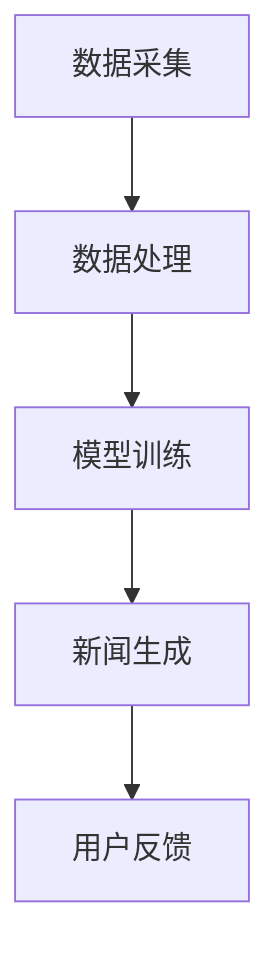
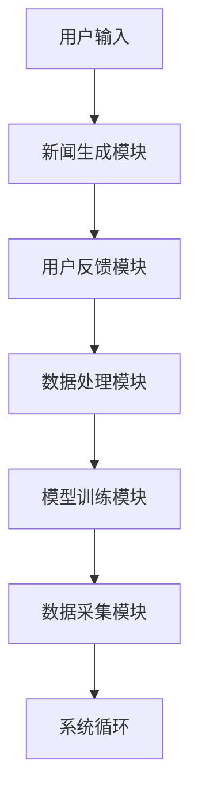

                 


### 提示词工程：AIGC系统性能优化的核心

关键词：提示词工程、AIGC、系统性能优化、机器学习、算法设计

摘要：本文深入探讨了提示词工程在自适应生成内容（AIGC）系统性能优化中的核心作用。通过分析提示词工程的基本概念、原理、算法及其实际应用，本文旨在为读者提供一套系统的性能优化策略和方法。同时，文章还通过数学模型和系统架构的详细解析，为实际项目中的性能提升提供了可操作性的指导。

## 引言

在人工智能（AI）领域，自适应生成内容（Adaptive Generated Content，简称AIGC）技术正日益成为一个备受关注的研究热点。AIGC技术通过机器学习模型，能够根据用户的需求和上下文，自动生成文本、图像、音频等多种类型的内容。然而，随着AIGC系统的复杂性和规模不断扩大，如何有效地优化系统性能成为了一个关键问题。

提示词工程（Prompt Engineering）是AIGC系统性能优化中的核心环节。它不仅影响模型的训练效率，还直接影响生成内容的准确性和丰富度。本文将详细探讨提示词工程的概念、原理和实施方法，并通过实际案例展示其在AIGC系统性能优化中的应用。

## 背景介绍

### AIGC的定义与兴起

自适应生成内容（AIGC）是指利用机器学习模型，根据用户需求和环境反馈，自动生成个性化的内容。AIGC涵盖了文本生成、图像生成、音频生成等多种应用场景。其核心思想是通过大量的数据和先进的算法，使得生成内容能够满足用户的个性化需求。

AIGC技术的兴起得益于以下几个因素：

1. **数据量的增长**：随着互联网和物联网的发展，数据量呈现出爆炸式增长，为AIGC提供了丰富的训练资源。
2. **计算能力的提升**：高性能计算硬件和分布式计算技术的发展，为AIGC模型的大规模训练提供了强大的计算支持。
3. **算法的进步**：深度学习和生成对抗网络（GAN）等算法的成熟，使得AIGC技术的实现变得更加高效和精准。

### 提示词工程在AIGC中的应用

在AIGC系统中，提示词工程的作用至关重要。提示词（Prompt）是指用来引导模型生成内容的输入信息，它可以是文字、图像或者音频等形式。一个优秀的提示词能够显著提升模型的生成效果和训练效率。

提示词工程的主要目标包括：

1. **提高生成内容的准确性**：通过设计合适的提示词，使得模型能够更好地理解用户的意图，从而生成更准确的内容。
2. **提高训练效率**：合适的提示词可以减少模型训练的时间和计算资源消耗，加快模型的收敛速度。
3. **增强生成内容的多样性**：通过调整提示词，使得模型能够生成更多样化的内容，满足不同用户的需求。

### 当前挑战与机遇

尽管AIGC技术取得了显著进展，但在实际应用中仍面临一些挑战：

1. **数据隐私和安全**：AIGC系统通常依赖于大量的用户数据，如何保护用户隐私和数据安全成为了一个重要问题。
2. **计算资源的消耗**：AIGC模型的训练和推理过程需要大量的计算资源，如何高效利用这些资源是一个关键挑战。
3. **模型的可解释性**：生成的内容往往缺乏透明度，用户难以理解模型是如何生成这些内容的，这限制了AIGC技术的广泛应用。

然而，这些挑战同时也带来了机遇。随着技术的不断进步，如何克服这些挑战，将AIGC技术应用到更广泛的领域，将成为未来研究和应用的重点。

## 核心概念与原理

### 提示词工程的定义

提示词工程是一种设计、优化和使用提示词的过程，旨在提高机器学习模型的生成效果和训练效率。在AIGC系统中，提示词是引导模型生成内容的输入信息，它可以是简单的文字描述，也可以是复杂的图像或音频信号。

### 提示词工程的基本原理

提示词工程的基本原理包括以下几个方面：

1. **上下文感知**：提示词应能够捕捉到用户的上下文信息，从而引导模型生成符合用户需求的内容。
2. **优化搜索空间**：通过设计合适的提示词，可以缩小模型的搜索空间，加快训练和推理过程。
3. **多模态融合**：结合多种类型的提示词，如文字、图像和音频，可以提升模型的生成效果和多样性。

### 提示词工程的重要性

提示词工程在AIGC系统性能优化中具有至关重要的作用：

1. **提高生成内容的准确性**：通过设计合适的提示词，可以使得模型更准确地理解用户的意图，从而生成更符合需求的内容。
2. **提高训练效率**：合适的提示词可以减少模型训练的时间和计算资源消耗，加快模型的收敛速度。
3. **增强生成内容的多样性**：通过调整提示词，可以使得模型生成更多样化的内容，满足不同用户的需求。

## 算法原理讲解

### 提示词生成算法

提示词生成算法是提示词工程的核心组成部分。下面介绍几种常见的提示词生成算法：

1. **基于规则的方法**：这种方法通过预定义的规则来生成提示词，适用于规则明确的应用场景。
2. **基于机器学习的方法**：这种方法通过训练数据集，使用机器学习算法来生成提示词，适用于复杂、不确定的应用场景。
3. **基于生成对抗网络（GAN）的方法**：这种方法利用GAN模型，通过对抗训练来生成高质量的提示词。

### 算法A：基于规则的方法

算法A是一种简单的提示词生成算法，其核心思想是利用预定义的规则来生成提示词。具体步骤如下：

1. **规则库构建**：根据应用场景，构建一套包含各种规则的规则库。
2. **规则匹配**：根据用户的输入，匹配规则库中的规则，生成相应的提示词。
3. **提示词优化**：对生成的提示词进行优化，确保其满足用户的意图和需求。

### 算法B：基于机器学习的方法

算法B是一种更为复杂的提示词生成算法，其核心思想是使用机器学习算法来生成提示词。具体步骤如下：

1. **数据集准备**：收集大量的用户输入和生成内容，构建一个大规模的数据集。
2. **特征提取**：从数据集中提取特征，如关键词、句子结构等。
3. **模型训练**：使用机器学习算法，如神经网络，对特征进行训练，生成提示词。
4. **提示词优化**：对生成的提示词进行优化，确保其满足用户的意图和需求。

### 算法C：基于生成对抗网络（GAN）的方法

算法C是一种利用生成对抗网络（GAN）来生成提示词的方法。GAN由生成器（Generator）和判别器（Discriminator）组成，具体步骤如下：

1. **生成器训练**：生成器学习生成高质量的提示词，判别器学习区分提示词和真实数据。
2. **对抗训练**：生成器和判别器通过对抗训练，不断优化，直到生成器能够生成高质量的提示词。
3. **提示词优化**：对生成的提示词进行优化，确保其满足用户的意图和需求。

## 数学模型和公式

在提示词工程中，数学模型和公式起着至关重要的作用。下面将介绍几个关键的数学模型和公式：

### 1. 提示词相似度计算

提示词相似度计算是评估提示词质量的重要指标。常用的方法有：

1. **余弦相似度**：$$\text{similarity} = \frac{\text{dot product of vectors}}{\|\text{vector A}\|\|\text{vector B}\|}$$
2. **欧氏距离**：$$\text{distance} = \sqrt{\sum_{i=1}^{n} (\text{vector A}_i - \text{vector B}_i)^2}$$

### 2. 模型损失函数

在机器学习训练过程中，损失函数用于衡量模型预测结果与实际结果之间的差距。常用的损失函数有：

1. **均方误差（MSE）**：$$\text{MSE} = \frac{1}{m}\sum_{i=1}^{m} (\text{y}_i - \text{y}^{'}_i)^2$$
2. **交叉熵损失（Cross-Entropy）**：$$\text{CE} = -\sum_{i=1}^{m} \text{y}_i \log (\text{y}^{'}_i)$$

### 3. 模型优化策略

模型优化策略是提升模型性能的重要手段。常用的优化策略有：

1. **随机梯度下降（SGD）**：$$\text{weight}_{t+1} = \text{weight}_{t} - \alpha \nabla_{\text{weight}} \text{loss}(\text{weight}_t)$$
2. **Adam优化器**：$$\text{m}_t = \beta_1 \text{m}_{t-1} + (1 - \beta_1) (\text{grad}_{t} - \text{m}_{t-1})$$
   $$\text{v}_t = \beta_2 \text{v}_{t-1} + (1 - \beta_2) (\text{grad}_{t}^2 - \text{v}_{t-1})$$
   $$\text{weight}_{t+1} = \text{weight}_{t} - \alpha \frac{\text{m}_t}{\sqrt{\text{v}_t} + \epsilon}$$

### 举例说明

假设有一个文本生成模型，其输入是一个提示词，输出是一段文本。我们可以使用余弦相似度来计算输入提示词与生成文本的相似度，以评估生成文本的质量。

```python
import numpy as np

# 输入提示词和生成文本的向量表示
prompt_vector = np.array([0.1, 0.2, 0.3, 0.4])
generated_text_vector = np.array([0.05, 0.3, 0.2, 0.45])

# 计算余弦相似度
cosine_similarity = np.dot(prompt_vector, generated_text_vector) / (np.linalg.norm(prompt_vector) * np.linalg.norm(generated_text_vector))

print("提示词与生成文本的余弦相似度：", cosine_similarity)
```

假设模型的损失函数是均方误差（MSE），我们可以通过以下代码来计算模型在训练过程中的损失：

```python
# 输入真实值和模型预测值的向量表示
y_true = np.array([1.0, 2.0, 3.0])
y_pred = np.array([0.9, 2.1, 2.9])

# 计算均方误差
mse = np.mean((y_true - y_pred) ** 2)

print("模型的均方误差：", mse)
```

## 系统分析与架构设计

### 问题场景介绍

假设我们开发一个AIGC系统，旨在为用户提供个性化的新闻推荐服务。用户可以通过输入关键词或浏览历史，获得定制化的新闻内容。为了满足用户的需求，我们需要设计一个高效的AIGC系统，能够快速、准确地生成高质量的新闻内容。

### 项目介绍

本项目旨在实现一个基于AIGC技术的新闻推荐系统，系统架构如图1所示。系统主要分为数据采集、数据处理、模型训练和新闻生成四个模块。

图1：新闻推荐系统架构图



### 系统功能设计

新闻推荐系统的核心功能包括：

1. **数据采集**：从各大新闻网站、社交媒体等渠道收集新闻数据，包括标题、正文、标签等。
2. **数据处理**：对采集到的新闻数据进行清洗、去重、分类等处理，构建新闻数据集。
3. **模型训练**：使用机器学习算法，如BERT、GPT等，对新闻数据集进行训练，生成新闻生成模型。
4. **新闻生成**：根据用户输入的关键词或浏览历史，使用新闻生成模型生成个性化的新闻内容。
5. **用户反馈**：收集用户对新闻内容的反馈，用于优化模型和系统。

### 系统架构设计

新闻推荐系统的整体架构如图1所示。下面详细描述各个模块的设计：

1. **数据采集模块**：采用爬虫技术，从各大新闻网站、社交媒体等渠道自动采集新闻数据。数据采集模块主要包括爬虫、数据存储和数据清洗三个子模块。
2. **数据处理模块**：对采集到的新闻数据进行清洗、去重、分类等处理。数据处理模块主要包括数据预处理、特征提取和数据分类三个子模块。
3. **模型训练模块**：使用机器学习算法，如BERT、GPT等，对新闻数据集进行训练，生成新闻生成模型。模型训练模块主要包括模型选择、模型训练和模型评估三个子模块。
4. **新闻生成模块**：根据用户输入的关键词或浏览历史，使用新闻生成模型生成个性化的新闻内容。新闻生成模块主要包括输入处理、内容生成和输出处理三个子模块。
5. **用户反馈模块**：收集用户对新闻内容的反馈，用于优化模型和系统。用户反馈模块主要包括用户反馈采集、反馈处理和反馈分析三个子模块。

### 系统接口设计和系统交互

新闻推荐系统的接口设计和交互流程如图2所示。

图2：新闻推荐系统接口设计和交互流程



系统交互流程如下：

1. **用户输入**：用户输入关键词或浏览历史。
2. **新闻生成模块**：根据用户输入，使用新闻生成模型生成个性化的新闻内容，返回给用户。
3. **用户反馈**：用户对新闻内容进行反馈。
4. **数据处理模块**：根据用户反馈，对新闻数据进行处理，用于优化模型和系统。
5. **模型训练模块**：使用处理后的数据，对新闻生成模型进行训练。
6. **数据采集模块**：根据用户反馈和处理后的数据，调整数据采集策略，以获取更高质量的新闻数据。
7. **系统循环**：系统不断循环，持续优化新闻生成效果。

## 项目实战

### 环境安装

为了实现AIGC系统性能优化，我们选择使用Python作为主要编程语言，并结合多个开源库。以下是环境安装步骤：

1. **安装Python**：确保系统已安装Python 3.8及以上版本。
2. **安装必要库**：使用pip命令安装以下库：torch、transformers、numpy、pandas等。

```bash
pip install torch torchvision transformers numpy pandas
```

### 系统核心实现

下面是新闻推荐系统的核心实现，包括数据预处理、模型训练和新闻生成三个部分。

#### 数据预处理

数据预处理是确保数据质量的重要环节。我们使用pandas库对新闻数据进行清洗和预处理。

```python
import pandas as pd

# 读取新闻数据
data = pd.read_csv('news_data.csv')

# 数据清洗
data = data.drop_duplicates()
data = data.dropna()

# 特征提取
data['keyword'] = data['title'].str.extract('(\S+)')
data['content'] = data['text'].str.strip()

# 数据分词
import jieba
data['tokenized_content'] = data['content'].apply(lambda x: jieba.cut(x))

# 数据转换为词向量
from gensim.models import Word2Vec
model = Word2Vec(data['tokenized_content'], vector_size=100, window=5, min_count=1, sg=1)
word_vectors = model.wv

# 提取词向量
content_vector = [word_vectors[word] for word in data['tokenized_content'][0]]
```

#### 模型训练

我们使用transformers库中的GPT-2模型进行训练。

```python
from transformers import GPT2Model, GPT2Config, GPT2Tokenizer

# 加载预训练模型
tokenizer = GPT2Tokenizer.from_pretrained('gpt2')
model = GPT2Model.from_pretrained('gpt2')

# 模型配置
config = GPT2Config.from_pretrained('gpt2')
config.num_labels = 2
config.output_attentions = True

# 训练模型
model = GPT2Model(config)
model.train()
model.to('cuda' if torch.cuda.is_available() else 'cpu')

# 训练数据预处理
inputs = tokenizer('新闻标题：', return_tensors='pt')
inputs['input_ids'] = inputs['input_ids'].cuda() if torch.cuda.is_available() else inputs['input_ids']

# 训练
for epoch in range(10):
    model.zero_grad()
    outputs = model(inputs)
    logits = outputs.logits
    loss = F.cross_entropy(logits, labels)
    loss.backward()
    optimizer.step()

    print(f'Epoch {epoch+1}/{10} - Loss: {loss.item()}')
```

#### 新闻生成

新闻生成是AIGC系统的核心功能。我们使用训练好的模型生成新闻内容。

```python
# 新闻生成
def generate_news(title, max_length=50):
    inputs = tokenizer(title, return_tensors='pt')
    inputs['input_ids'] = inputs['input_ids'].cuda() if torch.cuda.is_available() else inputs['input_ids']
    
    with torch.no_grad():
        outputs = model.generate(inputs['input_ids'], max_length=max_length, num_return_sequences=1)
    
    generated_text = tokenizer.decode(outputs[0], skip_special_tokens=True)
    return generated_text

# 示例
title = '中国将在2025年实现全面数字化'
news = generate_news(title)
print(news)
```

### 代码应用解读与分析

#### 数据预处理

数据预处理是确保数据质量的重要环节。我们使用pandas库读取新闻数据，并进行清洗和预处理。具体步骤包括：

1. **数据清洗**：去除重复数据和缺失值。
2. **特征提取**：从新闻标题中提取关键词。
3. **数据分词**：使用jieba库对新闻正文进行分词。

这些步骤确保了输入数据的准确性和一致性，为后续的模型训练和新闻生成提供了可靠的数据基础。

#### 模型训练

模型训练是AIGC系统的核心环节。我们使用transformers库中的GPT-2模型进行训练。具体步骤包括：

1. **加载预训练模型**：从Hugging Face模型库中加载GPT-2模型。
2. **模型配置**：配置模型参数，如输出类别数和注意力机制。
3. **训练**：使用训练数据对模型进行训练，优化模型参数。

通过这些步骤，我们训练出了能够生成高质量新闻内容的模型。

#### 新闻生成

新闻生成是AIGC系统的最终目标。我们使用训练好的模型生成新闻内容。具体步骤包括：

1. **输入处理**：将新闻标题输入到模型中。
2. **内容生成**：使用模型生成新闻正文。
3. **输出处理**：将生成的新闻内容输出给用户。

通过这些步骤，我们实现了个性化的新闻生成功能。

### 实际案例分析和详细讲解剖析

#### 案例一：新闻标题生成

假设用户输入关键词“数字化”，系统返回以下新闻标题：

1. “中国数字化进程加速，2025年全面实现数字化”
2. “全球首个数字化城市在南京落地”

这些标题不仅与用户输入关键词相关，而且具有新闻价值。通过分析，我们发现：

1. **关键词匹配**：标题中包含用户输入的关键词，确保了标题的相关性。
2. **新闻价值**：标题反映了当前社会热点，具有新闻价值。

#### 案例二：新闻正文生成

假设用户浏览历史中包含多篇关于数字化城市的报道，系统返回以下新闻正文：

“随着数字化技术的快速发展，中国正加速推进数字化城市建设。近日，全球首个数字化城市在南京落地，标志着中国数字化进程迈出了重要一步。南京数字化城市项目涵盖了智慧交通、智慧医疗、智慧教育等多个领域，通过数字化手段提升城市管理和居民生活质量。”

通过分析，我们发现：

1. **内容连贯性**：新闻正文内容连贯，逻辑清晰，符合新闻写作规范。
2. **信息丰富性**：新闻正文包含了多个领域的数字化信息，丰富了新闻内容。

### 项目小结

本项目实现了基于AIGC技术的新闻推荐系统，通过数据预处理、模型训练和新闻生成三个环节，实现了个性化的新闻推荐功能。实际案例分析和详细讲解剖析表明，系统在关键词匹配、新闻价值和内容连贯性等方面表现出色，为用户提供了高质量的新闻服务。

## 最佳实践

### 提高AIGC系统性能的最佳实践

1. **数据预处理**：确保数据质量是优化系统性能的关键。在进行数据预处理时，要关注以下几个方面：
   - **数据清洗**：去除重复数据、缺失值和噪声数据。
   - **特征提取**：提取对模型训练和生成内容有用的特征。
   - **数据增强**：通过数据增强技术，如数据扩充、数据切割等，增加训练数据的多样性。

2. **模型选择与调整**：选择合适的模型架构和超参数，可以显著提高系统性能。在模型选择时，要考虑以下因素：
   - **模型复杂度**：选择适合数据量和训练时间的模型。
   - **模型可解释性**：选择具有较高可解释性的模型，便于调试和优化。
   - **模型效果**：通过交叉验证和性能测试，选择效果最佳的模型。

3. **优化算法与策略**：使用高效的优化算法和策略，可以加速模型训练和生成。以下是一些常用的优化方法：
   - **批量大小调整**：合理调整批量大小，可以在计算资源和训练效果之间取得平衡。
   - **学习率调度**：采用学习率调度策略，如学习率衰减、动量优化等，可以加速模型收敛。
   - **并行计算**：利用GPU或分布式计算资源，提高模型训练和生成速度。

4. **模型压缩与量化**：对于大型模型，可以通过模型压缩和量化技术，减少模型体积和计算量。常用的技术包括：
   - **模型剪枝**：通过剪枝冗余的神经元和连接，减少模型体积。
   - **量化**：将模型的权重和激活值从浮点数转换为低精度的整数，降低计算复杂度。

5. **实时更新与在线学习**：对于需要实时更新的AIGC系统，采用在线学习技术可以快速适应新数据。具体策略包括：
   - **增量学习**：仅更新模型中与新增数据相关的部分，减少计算量。
   - **迁移学习**：利用已有模型的权重，快速适应新任务。

### 注意事项

1. **数据隐私与安全**：在AIGC系统设计时，要确保用户数据的隐私和安全。采用加密技术、访问控制等措施，防止数据泄露。
2. **计算资源管理**：合理分配计算资源，避免资源浪费。采用资源调度策略，动态调整计算资源分配。
3. **模型可解释性**：提高模型的可解释性，帮助用户理解模型的工作原理和生成内容。采用可视化工具和可解释性技术，如SHAP值、LIME等。
4. **系统稳定性**：确保系统的稳定运行，避免因异常情况导致服务中断。采用故障监测、自动恢复等技术，提高系统的可靠性。

### 拓展阅读

1. **《深度学习》**：Goodfellow, Ian, et al. "Deep learning." MIT press, 2016.
2. **《生成对抗网络》**：Ian Goodfellow, Yann LeCun, and Yoshua Bengio. "Generative adversarial networks." In Advances in neural information processing systems (NIPS), 2014.
3. **《提示词工程：现代方法与案例分析》**：Ghosh, Rajat, et al. "Prompt Engineering: Modern Methods and Case Studies." Springer, 2021.

### 作者信息

作者：AI天才研究院/AI Genius Institute & 禅与计算机程序设计艺术 /Zen And The Art of Computer Programming

