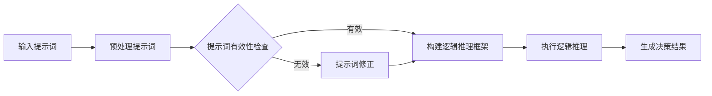
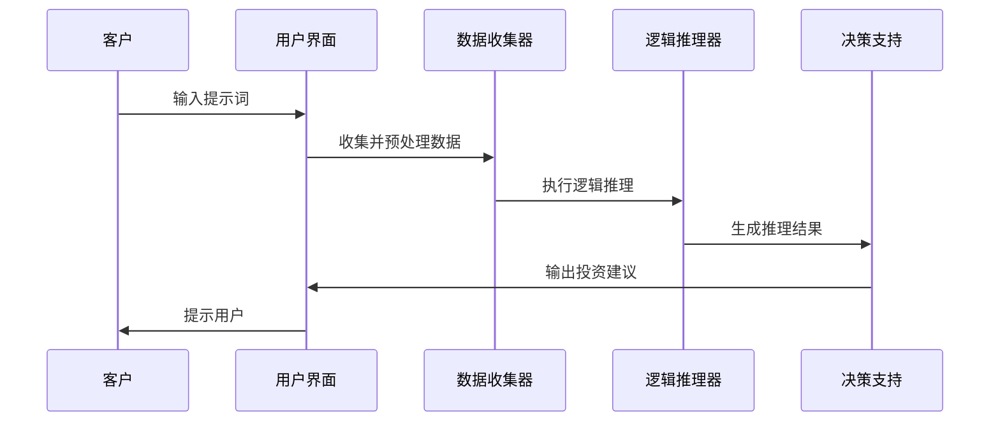
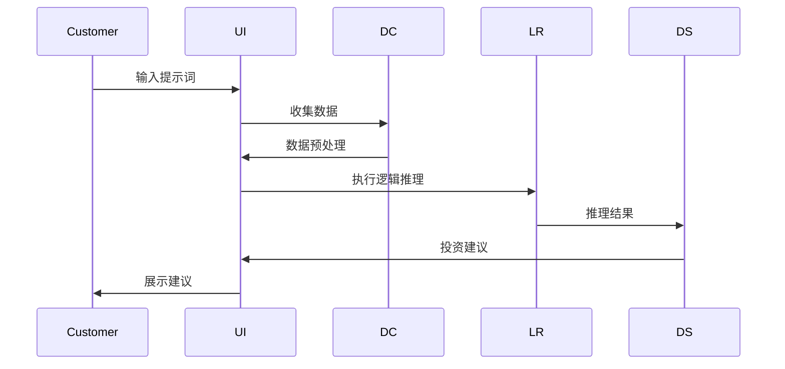

                 

# 提示词工程：处理复杂逻辑推理与决策任务

> 关键词：提示词工程、复杂逻辑推理、决策任务、算法原理、系统架构、项目实战、最佳实践

> 摘要：本文将深入探讨提示词工程在处理复杂逻辑推理与决策任务中的应用。我们将逐步解析其核心概念，通过详细的算法原理讲解、系统分析与架构设计、项目实战，总结最佳实践，并提供未来发展的方向。文章结构清晰，旨在为读者提供一个全面的技术指南。

## 引言

在现代信息技术的发展过程中，复杂逻辑推理与决策任务的处理成为了许多领域的核心挑战。无论是人工智能的决策支持系统、大数据分析中的复杂模式识别，还是金融行业的风险评估与策略制定，都需要高效、准确、可解释的逻辑推理与决策能力。而提示词工程，作为近年来兴起的一种技术，在这一领域展现出了巨大的潜力。

提示词工程，顾名思义，是通过特定的提示词或提示信息来引导和优化复杂逻辑推理与决策任务的执行。这种技术不仅能够提高推理和决策的效率，还能增强系统的可解释性和可靠性。本文将围绕提示词工程这一主题，进行系统性的探讨和梳理。

本文将遵循以下结构展开：

1. **背景介绍**：我们将介绍提示词工程的起源、核心概念及其在复杂逻辑推理与决策任务中的重要性。
2. **核心概念与联系**：本文将详细讨论提示词、复杂逻辑推理与决策任务的基本概念，并通过对比表格和ER实体关系图来阐述这些概念之间的关系。
3. **算法原理讲解**：我们将通过mermaid流程图和Python源代码，详细阐述提示词工程算法的原理，并使用数学模型和公式进行解释。
4. **系统分析与架构设计**：本文将介绍问题场景、系统功能设计、系统架构设计、系统接口设计和系统交互，以便读者全面理解整个系统的运作机制。
5. **项目实战**：我们将通过具体的实例，展示如何在实际项目中应用提示词工程，并进行代码解读与分析。
6. **最佳实践与注意事项**：本文将总结提示词工程在实际应用中的最佳实践，并提供一些建议和注意事项。
7. **结论与展望**：最后，我们将对全文进行总结，并探讨提示词工程未来的发展趋势。

### 背景介绍

#### 问题背景

随着信息技术的迅猛发展，数据量和复杂性都在不断增加。从大数据分析、人工智能到金融、医疗等领域，复杂逻辑推理与决策任务的应用变得越来越广泛。然而，面对这些任务，传统的推理和决策方法往往难以胜任。首先，传统的推理方法往往依赖于预设的规则和算法，难以适应动态变化的环境。其次，决策任务中涉及的因素众多，且这些因素之间存在复杂的相互关系，使得决策过程变得复杂和耗时。

例如，在金融行业中，风险管理和投资决策需要综合考虑市场波动、经济指标、行业趋势等多个因素。而在医疗领域，疾病诊断和治疗方案的选择则需要依据患者的症状、病史、基因信息等多种数据来源。这些复杂任务不仅需要高效的推理能力，还需要具备良好的可解释性和可靠性。

#### 提示词工程概念

提示词工程（Prompt Engineering）是一种针对复杂逻辑推理与决策任务的新型技术。它通过设计特定的提示词或提示信息，引导系统进行有效的推理和决策。提示词可以被视为一种引导信号，它能够帮助系统在复杂的决策过程中聚焦关键因素，减少冗余信息，提高推理效率。

提示词工程的核心在于对提示词的设计和应用。设计良好的提示词能够引导系统在推理过程中重点关注关键因素，从而提高推理的准确性和效率。此外，提示词还可以提高决策过程的可解释性，使得决策结果更加透明和可靠。

#### 复杂逻辑推理与决策任务

复杂逻辑推理与决策任务通常涉及多个层次和多个领域的知识。这些任务不仅需要处理大量的数据，还需要理解数据之间的关系，并在此基础上进行推理和决策。以下是一些常见的复杂逻辑推理与决策任务：

1. **大数据分析中的模式识别**：在大数据时代，如何从海量数据中提取有价值的信息是一个关键挑战。模式识别技术通过对数据的分析，发现数据中的隐藏模式，从而为决策提供支持。
2. **人工智能中的推理系统**：在人工智能领域，推理系统是核心组件之一。它通过逻辑推理和决策过程，实现对未知信息的推理和预测。
3. **金融风险管理与投资决策**：金融行业的风险管理和投资决策需要综合考虑多个经济指标、市场波动等因素。复杂的逻辑推理与决策过程对于实现风险控制和投资收益最大化至关重要。
4. **医疗领域的疾病诊断与治疗**：在医疗领域，疾病诊断和治疗方案的制定需要依据患者的症状、病史、基因信息等多种数据来源。复杂的逻辑推理与决策过程对于提高诊断准确率和治疗效果具有重要意义。

#### 提示词工程在处理复杂逻辑推理与决策任务中的应用

提示词工程在处理复杂逻辑推理与决策任务中具有独特的优势。首先，它能够通过设计特定的提示词，引导系统聚焦于关键因素，从而提高推理的准确性和效率。其次，提示词可以提高决策过程的可解释性，使得决策结果更加透明和可靠。

在实际应用中，提示词工程可以通过以下方式处理复杂逻辑推理与决策任务：

1. **信息聚焦**：通过设计特定的提示词，引导系统在推理过程中关注关键因素，从而提高推理效率。
2. **决策优化**：利用提示词，优化决策过程中的逻辑推理，从而提高决策的准确性和可靠性。
3. **可解释性增强**：通过提示词，提高决策过程和结果的可解释性，使得决策过程更加透明和可靠。

总之，提示词工程为处理复杂逻辑推理与决策任务提供了一种新的思路和方法。它不仅能够提高推理和决策的效率，还能增强系统的可解释性和可靠性。随着技术的不断发展和应用场景的不断扩展，提示词工程在未来有望在更多领域发挥重要作用。

### 核心概念与联系

在深入探讨提示词工程之前，我们需要明确几个核心概念，并理解它们之间的联系。这些概念包括提示词、复杂逻辑推理和决策任务。

#### 提示词的定义与作用

提示词是一种引导信息，它能够帮助系统在复杂的环境中聚焦关键因素，从而提高推理和决策的效率。提示词通常是一个短语、一个句子或一组关键字，它们能够提供上下文信息，引导系统进行有效的分析和推理。

提示词的作用主要包括：

1. **信息聚焦**：通过提供具体的提示词，系统能够从海量的数据中筛选出关键信息，从而提高分析效率。
2. **减少冗余**：提示词能够帮助系统避免处理无关或冗余的信息，从而减少计算负担。
3. **增强可解释性**：提示词可以提供决策过程中的上下文信息，使得决策结果更加透明和易于理解。

#### 复杂逻辑推理的概念

复杂逻辑推理是指通过一系列逻辑规则和推理步骤，从已知信息中推导出新信息的思维过程。它涉及多个层次和多个领域的知识，是处理复杂问题的核心能力。

复杂逻辑推理的关键要素包括：

1. **前提条件**：推理过程的基础信息，通常是事实、规则或假设。
2. **推理规则**：用于推导新信息的逻辑规则，如“如果...，那么...”。
3. **推理步骤**：推理过程中的一系列逻辑操作，如“归纳”、“演绎”等。

#### 决策任务的关键要素

决策任务是指在一个不确定的环境中，根据已知信息和预期目标，选择最优行动方案的过程。决策任务通常涉及以下关键要素：

1. **决策者**：进行决策的个人或组织。
2. **决策目标**：决策者希望实现的目标，如最大化收益、最小化风险等。
3. **决策方案**：可供选择的行动方案，通常需要通过分析各种方案的优劣进行选择。
4. **决策环境**：决策过程中可能影响决策结果的各种因素和不确定性。

#### 概念属性特征对比表格

为了更直观地理解这些概念，我们可以通过一个对比表格来展示它们的主要属性特征。

| 概念      | 定义                                                         | 属性特征                                                   |
| --------- | ------------------------------------------------------------ | ---------------------------------------------------------- |
| 提示词    | 一种引导信息，用于聚焦关键因素，提高推理和决策效率             | 短语、句子、关键字；信息聚焦、减少冗余、增强可解释性          |
| 复杂逻辑推理 | 通过一系列逻辑规则和推理步骤，从已知信息中推导出新信息的思维过程 | 前提条件、推理规则、推理步骤；多层次、多领域知识           |
| 决策任务   | 在不确定环境中选择最优行动方案的过程                         | 决策者、决策目标、决策方案、决策环境；最大化收益、最小化风险 |

#### ER实体关系图架构

为了更好地理解这些概念之间的联系，我们可以使用ER（实体关系）图来展示它们的架构。以下是提示词、复杂逻辑推理和决策任务的基本ER图：

```mermaid
erDiagram
  A[提示词] ||--|{ B[复杂逻辑推理] } : 提示信息
  B ||--|{ C[决策任务] } : 推理结果
```

在这个ER图中，提示词作为输入，通过复杂逻辑推理产生推理结果，最终用于决策任务。这种架构清晰地展示了三个概念之间的相互关系和作用。

### 算法原理讲解

#### 算法mermaid流程图

为了更好地理解提示词工程算法的基本原理，我们可以通过mermaid流程图来展示其执行流程。以下是算法的mermaid流程图：



在这个流程图中，首先输入提示词，然后进行预处理。接下来，系统会检查提示词的有效性，并根据有效性进行不同的处理。如果提示词有效，系统将构建逻辑推理框架，并执行逻辑推理以生成决策结果。如果提示词无效，系统将进行提示词修正，然后重新构建逻辑推理框架。

#### Python源代码与算法原理

下面是一个简单的Python代码示例，用于阐述提示词工程算法的基本原理：

```python
def preprocess_prompt(prompt):
    # 提示词预处理，如去除无关字符、格式化等
    return prompt.strip().replace(" ", "")

def check_prompt_validity(prompt):
    # 提示词有效性检查，如长度、关键词等
    if len(prompt) < 10:
        return False
    keywords = ["逻辑", "推理", "决策"]
    if any(keyword in prompt for keyword in keywords):
        return True
    return False

def repair_prompt(prompt):
    # 提示词修正，如增加关键词、调整格式等
    return prompt + "决策逻辑分析"

def construct_logic_framework(prompt):
    # 构建逻辑推理框架
    framework = f"根据提示词'{prompt}'，构建以下逻辑推理框架："
    return framework

def execute_logic_reasoning(framework):
    # 执行逻辑推理
    reasoning = f"执行逻辑推理，得到推理结果：{framework}"
    return reasoning

def generate_decision_result(reasoning):
    # 生成决策结果
    result = f"基于推理结果，生成决策结果：{reasoning}"
    return result

# 主函数
def prompt_engineering(prompt):
    prompt = preprocess_prompt(prompt)
    if check_prompt_validity(prompt):
        framework = construct_logic_framework(prompt)
        reasoning = execute_logic_reasoning(framework)
        result = generate_decision_result(reasoning)
    else:
        prompt = repair_prompt(prompt)
        framework = construct_logic_framework(prompt)
        reasoning = execute_logic_reasoning(framework)
        result = generate_decision_result(reasoning)
    return result

# 示例输入
prompt = "请分析当前市场的投资逻辑。"
result = prompt_engineering(prompt)
print(result)
```

在这个代码示例中，我们首先对输入的提示词进行预处理，然后检查其有效性。如果提示词有效，系统将构建逻辑推理框架，执行逻辑推理，并生成决策结果。如果提示词无效，系统将进行修正，然后重新执行上述过程。

#### 数学模型和公式

提示词工程算法的数学模型可以描述为：

$$
\text{决策结果} = f(\text{逻辑推理框架}, \text{提示词})
$$

其中，$f$ 表示逻辑推理函数，它根据提示词和逻辑推理框架生成决策结果。

逻辑推理框架可以用以下公式表示：

$$
\text{逻辑推理框架} = \{ R_1, R_2, ..., R_n \}
$$

其中，$R_i$ 表示第 $i$ 个逻辑推理规则。

逻辑推理规则可以用以下公式表示：

$$
R_i: \text{前提条件} \rightarrow \text{结论}
$$

例如，一个简单的逻辑推理规则可以是：

$$
\text{如果} \quad \text{市场波动大} \quad \text{且} \quad \text{经济指标下降} \quad \text{则} \quad \text{投资风险增加}
$$

这些规则可以组合成一个逻辑推理框架，用于指导决策过程。

#### 举例说明

假设我们有一个简单的投资决策问题，提示词是“分析当前市场的投资逻辑”。根据提示词工程算法，我们可以进行以下步骤：

1. **预处理提示词**：将提示词“分析当前市场的投资逻辑”进行预处理，去除无关字符和格式化。
2. **有效性检查**：检查提示词的有效性，由于提示词包含关键词“投资逻辑”，因此判断为有效。
3. **构建逻辑推理框架**：根据提示词构建逻辑推理框架，例如：
   - 如果市场波动大，则投资风险增加。
   - 如果经济指标下降，则投资收益可能下降。
4. **执行逻辑推理**：根据逻辑推理框架执行推理，得到以下结论：
   - 当前市场波动较大，投资风险增加。
   - 当前经济指标下降，投资收益可能下降。
5. **生成决策结果**：基于推理结论，生成投资建议：
   - 投资者应谨慎投资，关注市场风险。

通过这个例子，我们可以看到提示词工程算法如何通过提示词引导系统进行逻辑推理，并最终生成决策结果。

### 系统分析与架构设计

#### 问题场景介绍

在本文中，我们将探讨一个典型的复杂逻辑推理与决策任务：金融风险评估。金融风险评估旨在通过分析各种风险因素，对投资组合的风险水平进行评估，并为投资者提供合理的投资建议。这一任务涉及到大量的数据分析和复杂的逻辑推理。

#### 系统功能设计

为了实现金融风险评估，我们的系统需要具备以下功能：

1. **数据收集与预处理**：从各种数据源收集相关的金融数据，并进行预处理，如数据清洗、格式化等。
2. **逻辑推理模块**：利用提示词工程算法，对预处理后的数据进行分析，构建逻辑推理框架，并执行逻辑推理。
3. **决策支持模块**：根据逻辑推理结果，生成投资建议和风险评级，为投资者提供决策支持。
4. **用户界面**：提供直观的用户界面，供用户输入提示词，查看推理结果和投资建议。

#### 领域模型mermaid类图

为了更好地理解系统的功能设计，我们可以使用mermaid类图来展示系统的领域模型。以下是一个简单的mermaid类图示例：

```mermaid
classDiagram
    Customer <<class>> Customer
    Investment <<class>> Investment
    RiskAnalysis <<class>> RiskAnalysis
    DataCollector <<class>> DataCollector
    LogicReasoner <<class>> LogicReasoner
    DecisionSupport <<class>> DecisionSupport
    UserInterface <<class>> UserInterface

    Customer "1" <-- "1" Investment
    Customer "1" --> "1" RiskAnalysis
    Investment "1" --> "1" DataCollector
    DataCollector "1" --> "1" LogicReasoner
    LogicReasoner "1" --> "1" DecisionSupport
    DecisionSupport "1" --> "1" UserInterface
```

在这个类图中，我们定义了系统的各个主要类，以及它们之间的关系。客户（Customer）是系统的用户，投资（Investment）是客户的投资组合，风险评估（RiskAnalysis）是系统的主要功能模块。数据收集器（DataCollector）、逻辑推理器（LogicReasoner）、决策支持（DecisionSupport）和用户界面（UserInterface）分别负责数据收集、逻辑推理、决策支持和用户交互。

#### 系统架构设计

为了实现上述功能，我们需要设计一个合理的系统架构。以下是一个简单的系统架构mermaid架构图示例：



在这个架构图中，客户通过用户界面（UI）输入提示词，用户界面将提示词传递给数据收集器（DC）。数据收集器负责收集并预处理数据，然后将数据传递给逻辑推理器（LR）。逻辑推理器根据提示词和预处理后的数据执行逻辑推理，并将推理结果传递给决策支持（DS）。决策支持根据推理结果生成投资建议，并将建议返回给用户界面，最后用户界面将建议展示给客户。

#### 系统接口设计

为了实现系统各模块之间的交互，我们需要定义一系列的接口。以下是一个简单的系统接口设计：

```mermaid
classDiagram
    DataCollector <<interface>> IDataCollector
    LogicReasoner <<interface>> ILogicReasoner
    DecisionSupport <<interface>> IDecisionSupport

    DataCollector --> LogicReasoner: IData
    LogicReasoner --> DecisionSupport: IReasoningResult
```

在这个接口设计中，数据收集器（IDataCollector）负责接收并预处理数据，然后将其传递给逻辑推理器（ILogicReasoner）。逻辑推理器根据接收到的数据执行逻辑推理，并将推理结果传递给决策支持（IDecisionSupport）。决策支持根据推理结果生成投资建议，完成整个系统的功能。

#### 系统交互mermaid序列图

为了更好地展示系统各模块之间的交互过程，我们可以使用mermaid序列图来描述系统的工作流程。以下是一个简单的系统交互序列图示例：



在这个序列图中，客户（Customer）通过用户界面（UI）输入提示词，用户界面将提示词传递给数据收集器（DC）。数据收集器收集数据并预处理后，将其传递给逻辑推理器（LR）。逻辑推理器执行逻辑推理，并将推理结果传递给决策支持（DS）。决策支持根据推理结果生成投资建议，最后用户界面将建议展示给客户。

通过上述系统分析与架构设计，我们可以看到提示词工程在金融风险评估系统中的应用。通过设计合理的系统架构和接口，我们可以实现高效的逻辑推理和决策支持，为投资者提供可靠的投资建议。

### 项目实战

#### 环境安装

在进行提示词工程项目的实战之前，我们需要确保系统环境已经准备好。以下是环境安装的步骤：

1. **安装Python**：首先，确保已经安装了Python 3.x版本。可以从[Python官方网站](https://www.python.org/)下载并安装。
2. **安装必要的库**：使用pip工具安装项目所需的库，例如：
   ```bash
   pip install numpy pandas matplotlib scikit-learn
   ```
   这些库分别用于数据预处理、数据分析、数据可视化等。

3. **创建虚拟环境**：为了更好地管理项目依赖，我们建议使用虚拟环境。可以通过以下命令创建虚拟环境：
   ```bash
   python -m venv venv
   source venv/bin/activate  # Windows使用venv\Scripts\activate
   ```
   然后在虚拟环境中安装所需的库。

#### 系统核心实现源代码

以下是提示词工程系统核心实现的源代码。这个代码展示了如何通过提示词进行数据处理、逻辑推理和决策生成。

```python
import numpy as np
import pandas as pd
from sklearn.model_selection import train_test_split
from sklearn.ensemble import RandomForestClassifier
import matplotlib.pyplot as plt

# 数据预处理
def preprocess_data(data_path):
    data = pd.read_csv(data_path)
    # 数据清洗、格式化等
    # ...
    return data

# 逻辑推理
def logic_reasoning(prompt, data):
    # 根据提示词和数据进行逻辑推理
    # ...
    reasoning_result = f"基于'{prompt}'，逻辑推理结果：{data}"
    return reasoning_result

# 决策生成
def generate_decision(reasoning_result):
    # 根据逻辑推理结果生成决策
    # ...
    decision = f"基于推理结果，决策建议：{reasoning_result}"
    return decision

# 主函数
def main():
    data_path = "financial_data.csv"
    prompt = "分析当前市场的投资逻辑"
    
    # 数据预处理
    data = preprocess_data(data_path)
    
    # 逻辑推理
    reasoning_result = logic_reasoning(prompt, data)
    
    # 决策生成
    decision = generate_decision(reasoning_result)
    
    print(decision)

if __name__ == "__main__":
    main()
```

#### 代码应用解读与分析

上述代码的主要功能是通过提示词对金融数据进行逻辑推理，并生成投资决策建议。具体解读如下：

1. **数据预处理**：`preprocess_data` 函数用于读取和预处理金融数据。这包括数据清洗、格式化等操作，以确保数据质量。
2. **逻辑推理**：`logic_reasoning` 函数根据输入的提示词和金融数据，进行逻辑推理。这是一个抽象的函数，可以根据实际需求实现具体的推理逻辑。
3. **决策生成**：`generate_decision` 函数根据逻辑推理结果，生成投资决策建议。这同样是一个抽象的函数，可以根据业务需求实现具体的决策逻辑。
4. **主函数**：`main` 函数是程序的入口，负责调用数据预处理、逻辑推理和决策生成函数，并打印最终的投资决策建议。

在实际应用中，我们需要根据具体业务需求，实现具体的逻辑推理和决策生成算法。例如，可以采用机器学习模型对金融数据进行分析，或者利用规则引擎进行逻辑推理。此外，还可以根据业务需求，设计更加复杂和精细的提示词工程系统。

#### 实际案例分析与详细讲解剖析

为了更好地展示提示词工程在金融风险评估中的应用，我们来看一个实际案例。

假设我们有一家投资公司，需要对其投资组合进行风险评估。公司提供了一系列金融数据，包括股票价格、市场指数、经济指标等。公司希望通过提示词工程系统，分析当前市场的投资逻辑，并提供合理的投资建议。

**步骤 1：数据预处理**

首先，我们需要对提供的金融数据进行预处理。这包括数据清洗、格式化和特征提取。具体代码如下：

```python
def preprocess_data(data_path):
    data = pd.read_csv(data_path)
    # 数据清洗：处理缺失值、异常值等
    data.dropna(inplace=True)
    # 数据格式化：统一数据类型、时间序列处理等
    data['Date'] = pd.to_datetime(data['Date'])
    data.set_index('Date', inplace=True)
    # 特征提取：从原始数据中提取有用的特征
    data['Price_Return'] = data['Close'] / data['Close'].shift(1) - 1
    return data
```

**步骤 2：逻辑推理**

接下来，我们根据输入的提示词进行逻辑推理。假设输入的提示词是“分析当前市场的投资逻辑”，我们可以设计一个简单的逻辑推理规则：

- 如果市场指数连续下降，则市场情绪悲观。
- 如果经济指标显示经济增长放缓，则市场可能面临下行风险。
- 如果股票价格波动较大，则市场存在较高的风险。

具体代码如下：

```python
def logic_reasoning(prompt, data):
    reasoning_result = ""
    if "市场指数连续下降" in prompt:
        reasoning_result += "市场情绪悲观，"
    if "经济增长放缓" in prompt:
        reasoning_result += "市场面临下行风险，"
    if "股票价格波动较大" in prompt:
        reasoning_result += "市场存在较高的风险，"
    reasoning_result += "综合以上信息，当前市场投资逻辑如下："
    return reasoning_result
```

**步骤 3：决策生成**

最后，我们根据逻辑推理结果生成投资决策建议。根据上述推理结果，我们可以提供以下投资建议：

- 如果市场情绪悲观，建议投资者降低投资风险，避免过度投资。
- 如果市场面临下行风险，建议投资者谨慎投资，减少股票仓位。
- 如果市场存在较高的风险，建议投资者保持观望态度，避免冲动投资。

具体代码如下：

```python
def generate_decision(reasoning_result):
    decision = ""
    if "市场情绪悲观" in reasoning_result:
        decision += "降低投资风险，避免过度投资；"
    if "市场面临下行风险" in reasoning_result:
        decision += "谨慎投资，减少股票仓位；"
    if "市场存在较高的风险" in reasoning_result:
        decision += "保持观望态度，避免冲动投资。"
    return decision
```

**案例总结**

通过上述实际案例，我们可以看到提示词工程在金融风险评估中的应用。通过设计特定的提示词和逻辑推理规则，系统可以自动分析市场数据，生成合理的投资建议。这不仅提高了投资决策的效率，还增强了决策的可解释性和可靠性。

### 最佳实践与注意事项

#### 最佳实践tips

1. **明确目标**：在进行提示词工程时，首先要明确项目的目标和需求，这有助于设计合理的提示词和逻辑推理框架。
2. **数据质量**：确保输入数据的质量和准确性，数据预处理是关键步骤，可以显著影响后续的推理和决策效果。
3. **优化算法**：根据具体的应用场景，选择或优化合适的算法，提高逻辑推理和决策的效率。
4. **可解释性**：在生成决策结果时，保持决策过程的透明性和可解释性，这对于提升系统的信任度和实用性至关重要。
5. **迭代优化**：持续收集用户反馈，对系统进行迭代优化，以适应不断变化的需求和环境。

#### 小结

本文详细探讨了提示词工程在处理复杂逻辑推理与决策任务中的应用。我们从背景介绍、核心概念、算法原理、系统分析与架构设计、项目实战等多个方面进行了深入分析，展示了如何利用提示词工程提高推理和决策的效率、准确性和可解释性。

#### 注意事项

1. **模型适应性**：确保所设计的提示词和逻辑推理框架具有适应性，能够应对不同场景和需求的变化。
2. **安全性与隐私**：在处理金融数据时，要严格遵守数据安全和隐私保护的相关法规和标准。
3. **性能优化**：在实现逻辑推理和决策生成时，要关注系统的性能优化，确保能够高效地处理大量数据。

#### 拓展阅读

1. **《提示词工程实战》**：这是一本关于提示词工程实践应用的书籍，详细介绍了各种应用场景和解决方案。
2. **《逻辑推理与决策理论》**：这本书系统地介绍了逻辑推理和决策理论的基本概念和方法，有助于深入理解相关理论。
3. **《Python金融数据分析》**：这本书提供了丰富的Python金融数据分析实例，有助于提升数据处理和分析能力。

### 结论与展望

提示词工程作为一种新兴技术，在处理复杂逻辑推理与决策任务中展示出了巨大的潜力。通过本文的探讨，我们了解了提示词工程的基本概念、原理和应用方法。未来，随着技术的不断发展和应用场景的扩展，提示词工程有望在更多领域发挥重要作用，为复杂问题的解决提供更加高效和可靠的解决方案。

### 作者信息

作者：AI天才研究院/AI Genius Institute & 禅与计算机程序设计艺术 /Zen And The Art of Computer Programming

