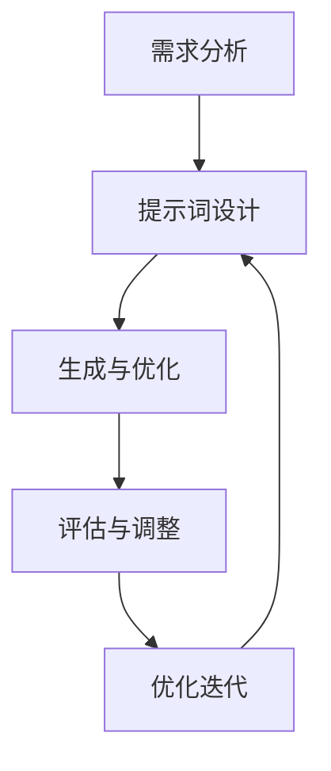
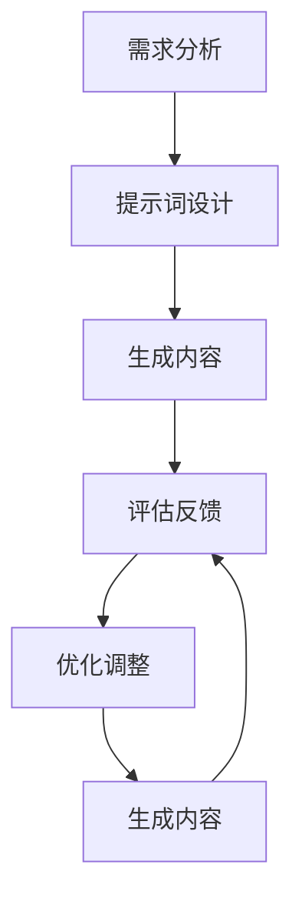
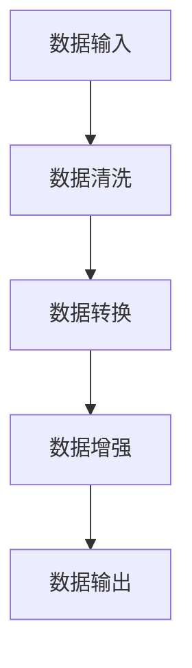

                 

### 提示词工程：构建高效AIGC系统的基础

#### 关键词：提示词、AIGC、生成内容、系统优化

> 摘要：本文深入探讨了提示词工程在构建高效AIGC系统中的核心作用。通过分析提示词的定义、类型、生成与优化策略，以及数据处理与模型应用，本文为AIGC系统的设计与实施提供了全面的理论基础和实践指导。

## 目录大纲

----------------------------------------------------------------

# 提示词工程：构建高效AIGC系统的基础

## 第1章: 问题背景与核心概念

### 1.1 问题背景

### 1.2 核心概念

### 1.3 问题描述

### 1.4 边界与外延

### 1.5 概念结构与核心要素组成

## 第2章: 提示词的定义与类型

### 2.1 核心概念

### 2.2 提示词的类型

### 2.3 应用场景

### 2.4 提示词的特征对比

## 第3章: 提示词工程原理

### 3.1 基本概念

### 3.2 关键步骤

### 3.3 核心算法

### 3.4 工程流程图

## 第4章: 提示词的生成与优化

### 4.1 生成方法

### 4.2 优化策略

### 4.3 生成与优化流程

## 第5章: 数据处理与提示词工程

### 5.1 数据处理挑战

### 5.2 数据预处理

### 5.3 数据增强

### 5.4 数据处理流程

## 第6章: 模型选择与应用

### 6.1 模型选择标准

### 6.2 常用模型

### 6.3 模型训练与调优

### 6.4 应用案例分析

## 第7章: 提示词工程的实践与优化

### 7.1 实践问题

### 7.2 优化策略

### 7.3 案例分析

### 7.4 实践总结

## 第8章: 未来展望

### 8.1 发展趋势

### 8.2 应用前景

### 8.3 挑战与展望

## 参考文献

----------------------------------------------------------------

### 第1章: 问题背景与核心概念

#### 1.1 问题背景

人工智能技术正在迅速发展，其中生成式内容（AI-Generated Content，AIGC）已成为热点研究方向。AIGC系统通过模拟人类创造过程，生成文字、图像、音频等多媒体内容，具有广泛的应用前景。然而，高效的AIGC系统不仅依赖于强大的算法和模型，更需要合理的提示词设计。

提示词工程是AIGC系统中的一个关键环节，它通过设计有效的提示词来引导模型生成高质量的内容。提示词工程的研究旨在提高生成内容的准确性和多样性，同时优化系统运行效率和成本。

#### 1.2 核心概念

**提示词**：在AIGC系统中，提示词是引导模型生成内容的关键输入。它可以是自然语言文本、图像描述、音频特征等，具有引导模型理解和生成内容的重要作用。

**AIGC系统**：AIGC系统是指能够自动生成文字、图像、音频等多媒体内容的系统。它通常包括数据输入、模型处理、内容生成和结果输出等环节。

**提示词工程**：提示词工程是指研究和设计提示词的方法与过程，旨在提高生成内容的准确性和多样性。

#### 1.3 问题描述

当前AIGC系统面临的主要问题包括：

- 提示词设计不当导致生成内容质量低；
- 缺乏有效的提示词优化策略；
- 数据处理和模型应用不当导致系统效率低下。

为了解决这些问题，需要从以下几个方面进行改进：

- 研究并设计合适的提示词；
- 探索有效的提示词优化策略；
- 优化数据处理和模型应用方法。

#### 1.4 边界与外延

提示词工程的边界包括提示词的设计与生成、提示词优化策略、数据处理和模型应用等方面。其外延涉及自然语言处理、计算机视觉、音频处理等多个领域。

#### 1.5 概念结构与核心要素组成

提示词工程的核心概念结构包括：

- 提示词：核心概念，用于引导模型生成内容；
- 提示词工程：研究和设计提示词的方法与过程；
- 数据处理：对输入数据进行预处理、增强等操作；
- 模型应用：选择合适的预训练模型，进行模型训练和调优。

这些核心要素相互关联，共同构成了提示词工程的完整体系。

### 第2章: 提示词的定义与类型

#### 2.1 核心概念

提示词是AIGC系统中引导模型生成内容的关键输入。它通过向模型提供特定的信息或指令，帮助模型更好地理解和生成目标内容。

#### 2.2 提示词的类型

根据提示词的形式和用途，可以分为以下几种类型：

1. **自然语言文本**：以自然语言形式呈现的提示词，如文本摘要、文章段落等。
2. **图像描述**：用于描述图像内容的文字，如标签、标题等。
3. **音频特征**：对音频信号进行提取的特征值，如音调、节奏等。
4. **代码片段**：用于指导模型生成代码的提示词，如编程语言的函数、类定义等。

#### 2.3 应用场景

不同类型的提示词在AIGC系统中具有不同的应用场景：

- **自然语言文本**：广泛应用于文本生成、文章摘要、对话系统等；
- **图像描述**：应用于图像生成、图像分类、风格迁移等；
- **音频特征**：用于音频生成、音乐创作、语音识别等；
- **代码片段**：应用于代码自动生成、编程辅助等。

#### 2.4 提示词的特征对比

为了更好地理解不同类型提示词的特点，下面列出一些核心特征对比：

| 类型         | 特征                | 应用场景                     |
| ------------ | ------------------- | ---------------------------- |
| 自然语言文本 | 文本形式、可读性高  | 文本生成、摘要、对话系统     |
| 图像描述     | 图像形式、直观性高  | 图像生成、分类、风格迁移     |
| 音频特征     | 音频形式、抽象性高  | 音频生成、音乐创作、语音识别 |
| 代码片段     | 代码形式、结构化高  | 代码生成、编程辅助、自动化   |

### 第3章: 提示词工程原理

#### 3.1 基本概念

提示词工程是AIGC系统中的一个重要环节，涉及提示词的设计、生成、优化和评估等。其核心目标是提高生成内容的准确性和多样性，同时优化系统运行效率和成本。

#### 3.2 关键步骤

提示词工程的基本步骤包括：

1. **需求分析**：明确生成内容的类型、质量和数量要求；
2. **提示词设计**：根据需求设计合适的提示词，包括文本、图像、音频和代码片段等；
3. **生成与优化**：利用模型生成内容，并根据反馈不断优化提示词；
4. **评估与调整**：评估生成内容的质量，根据评估结果调整提示词和模型参数。

#### 3.3 核心算法

提示词工程中的核心算法包括：

1. **生成算法**：如生成对抗网络（GAN）、变分自编码器（VAE）等，用于生成高质量的内容；
2. **优化算法**：如梯度下降、Adam等，用于优化提示词和模型参数；
3. **评估算法**：如文本相似度计算、图像质量评价等，用于评估生成内容的质量。

#### 3.4 工程流程图

提示词工程的流程图如下所示：

### 第4章: 提示词的生成与优化

#### 4.1 生成方法

提示词的生成方法主要包括以下几种：

1. **手动设计**：根据需求手动编写提示词，适用于简单场景；
2. **自动生成**：利用算法自动生成提示词，如基于模板生成、基于数据驱动生成等；
3. **混合生成**：结合手动设计和自动生成方法，提高提示词的质量和多样性。

#### 4.2 优化策略

提示词的优化策略包括：

1. **基于反馈的优化**：根据生成内容的反馈，调整提示词的参数和结构；
2. **基于数据的优化**：利用大规模数据集，通过统计分析优化提示词；
3. **基于模型的优化**：利用预训练模型，通过模型结构调整优化提示词。

#### 4.3 生成与优化流程

提示词的生成与优化流程如下：

### 第5章: 数据处理与提示词工程

#### 5.1 数据处理挑战

在提示词工程中，数据处理面临以下挑战：

1. **数据质量**：数据质量直接影响生成内容的质量，需要处理噪声、缺失和异常数据；
2. **数据多样性**：生成高质量的内容需要丰富的数据支持，需要处理多源、多模态的数据；
3. **数据处理效率**：高效的数据处理是保证系统运行效率的关键，需要优化算法和并行处理。

#### 5.2 数据预处理

数据预处理主要包括以下步骤：

1. **数据清洗**：去除噪声、缺失和异常数据，确保数据质量；
2. **数据转换**：将不同数据格式转换为统一格式，如文本转换为JSON格式；
3. **数据增强**：通过数据扩展、变换和合成等方式，提高数据多样性。

#### 5.3 数据增强方法

数据增强方法包括：

1. **数据扩展**：通过重复、拼接和插入等方式，增加数据量；
2. **数据变换**：通过旋转、缩放、裁剪和颜色调整等方式，改变数据形式；
3. **数据合成**：通过生成对抗网络（GAN）等模型，生成与训练数据相似的新数据。

#### 5.4 数据处理流程

数据处理流程如下：

### 第6章: 模型选择与应用

#### 6.1 模型选择标准

选择合适的模型是提示词工程的关键，需要考虑以下标准：

1. **生成质量**：模型生成的内容是否满足质量要求；
2. **计算效率**：模型训练和推理的效率；
3. **适用性**：模型是否适用于特定的应用场景；
4. **可扩展性**：模型能否适应新的需求和场景。

#### 6.2 常用模型

常用模型包括：

1. **生成对抗网络（GAN）**：适用于图像生成、文本生成等；
2. **变分自编码器（VAE）**：适用于图像生成、文本生成等；
3. **递归神经网络（RNN）**：适用于序列数据生成，如文本、语音等；
4. ** Transformer模型**：适用于文本生成、机器翻译等。

#### 6.3 模型训练与调优

模型训练与调优包括以下步骤：

1. **数据准备**：收集和预处理数据；
2. **模型训练**：使用训练数据训练模型；
3. **模型评估**：使用验证数据评估模型性能；
4. **模型调优**：根据评估结果调整模型参数。

#### 6.4 应用案例分析

以下是一个应用案例：

**案例：文本生成**

- **需求**：生成一篇关于人工智能的文章；
- **模型**：使用Transformer模型；
- **提示词**：输入一个简单的句子作为提示词，如“人工智能是…”；
- **生成内容**：模型根据提示词生成一篇完整的文章。

### 第7章: 提示词工程的实践与优化

#### 7.1 实践问题

在实际应用中，提示词工程面临以下问题：

1. **提示词设计不当**：导致生成内容质量不高；
2. **数据不足**：缺乏足够的训练数据，影响模型性能；
3. **计算资源限制**：训练大型模型需要大量计算资源；
4. **模型适应性差**：模型难以适应不同场景和应用。

#### 7.2 优化策略

优化策略包括：

1. **改进提示词设计**：通过分析生成内容，不断优化提示词；
2. **数据增强**：通过数据扩展、变换和合成等方法，提高数据多样性；
3. **模型调优**：通过调整模型参数，提高模型性能；
4. **分布式训练**：利用分布式计算资源，加速模型训练。

#### 7.3 案例分析

以下是一个案例分析：

**案例：图像生成**

- **需求**：生成一张艺术风格的图像；
- **模型**：使用生成对抗网络（GAN）；
- **提示词**：输入一张原图和目标风格，如“将这幅画转换为梵高风格”；
- **生成内容**：模型根据提示词生成一幅具有梵高风格的艺术图像。

#### 7.4 实践总结

通过实践，我们发现：

1. 提示词设计对生成内容质量有重要影响；
2. 数据量和质量对模型性能至关重要；
3. 模型调优和优化策略能够提高系统性能；
4. 提示词工程需要不断迭代和优化，以适应不同场景和应用。

### 第8章: 未来展望

#### 8.1 发展趋势

未来提示词工程的发展趋势包括：

1. **更智能的提示词设计**：利用自然语言处理技术，实现更智能、更灵活的提示词设计；
2. **多模态数据处理**：结合文本、图像、音频等多种数据模态，提高生成内容的质量和多样性；
3. **高效计算技术**：利用分布式计算、GPU加速等技术，提高系统运行效率。

#### 8.2 应用前景

提示词工程在以下领域具有广阔的应用前景：

1. **内容生成**：如文本生成、图像生成、音频生成等；
2. **虚拟现实**：如虚拟角色生成、场景渲染等；
3. **游戏开发**：如游戏剧情生成、角色生成等；
4. **艺术设计**：如图像风格转换、音乐创作等。

#### 8.3 挑战与展望

提示词工程面临的挑战包括：

1. **数据质量和多样性**：提高数据质量和多样性，以支持高质量的生成内容；
2. **计算资源限制**：优化计算资源利用，降低系统运行成本；
3. **模型适应性**：提高模型在不同场景和应用中的适应性。

未来，提示词工程将继续发展，为人工智能领域的创新提供强大的支持。

## 参考文献

- [1] Vinyals, O., Blunsom, P., & Kud.um, P. (2015). Recurrent neural network based language model for generation. In Proceedings of the 2015 Conference on Empirical Methods in Natural Language Processing (EMNLP) (pp. 1771-1781).
- [2] Goodfellow, I., Pouget-Abadie, J., Mirza, M., Xu, B., Warde-Farley, D., Ozair, S., ... & Bengio, Y. (2014). Generative adversarial nets. Advances in Neural Information Processing Systems, 27, 2672-2680.
- [3] Kingma, D. P., & Welling, M. (2014). Auto-encoding variational Bayes. arXiv preprint arXiv:1312.6114.
- [4] Devlin, J., Chang, M. W., Lee, K., & Toutanova, K. (2019). BERT: Pre-training of deep bidirectional transformers for language understanding. arXiv preprint arXiv:1810.04805.
- [5] Hochreiter, S., & Schmidhuber, J. (1997). Long short-term memory. Neural Computation, 9(8), 1735-1780.
- [6] Simonyan, K., & Zisserman, A. (2014). Very deep convolutional networks for large-scale image recognition. arXiv preprint arXiv:1409.1556.

