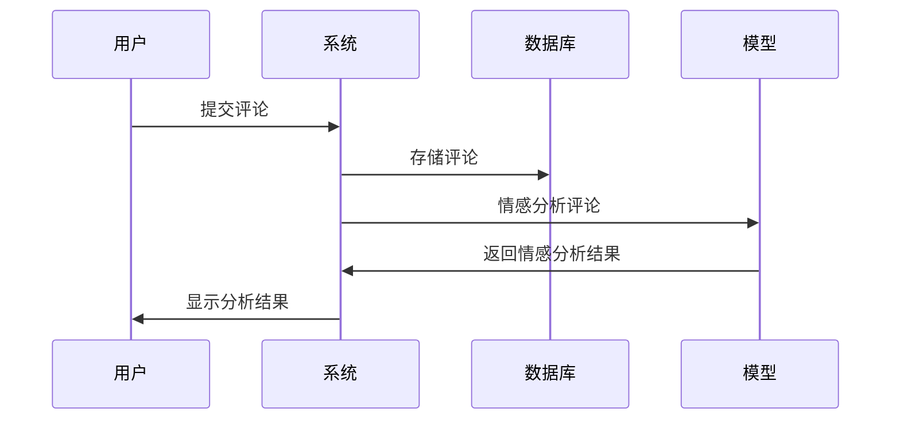
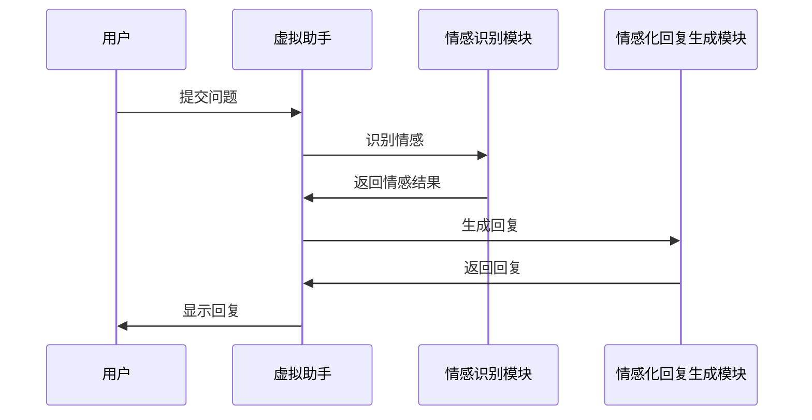
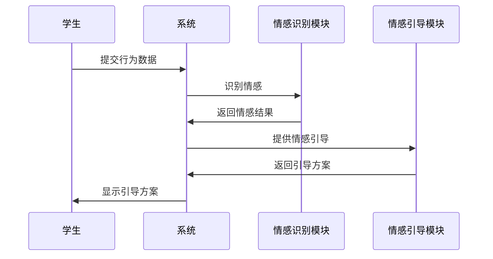

                 


### 《提示词的计算语言学与情感计算的交叉研究新进展》

#### 关键词：计算语言学、情感计算、提示词、自然语言处理、人工智能

#### 摘要：
本文深入探讨了提示词在计算语言学与情感计算交叉研究领域的最新进展。首先，我们介绍了计算语言学和情感计算的基本概念及其在人工智能中的应用。接着，文章详细阐述了提示词的定义及其在计算语言学中的应用，包括语义分析和情感分析。随后，我们探讨了情感计算的基本原理和算法，包括情感识别和情感生成。接下来，文章重点讨论了提示词与情感计算的交叉应用，包括情感化处理、提示词生成和对话系统中的情感交互。然后，文章介绍了构建提示词情感分析模型的流程和方法，并通过实际案例分析了该领域的研究成果。最后，文章总结了当前的研究进展，提出了未来研究方向和挑战，为该领域的进一步研究提供了参考。

---

### 目录大纲

#### 第1章 引言
- 1.1 研究背景与意义
- 1.2 计算语言学与情感计算概述
- 1.3 提示词在计算语言学与情感计算中的应用

#### 第2章 提示词与计算语言学基础
- 2.1 计算语言学的基本概念
- 2.2 提示词在自然语言处理中的应用
- 2.3 提示词的语义分析与情感分析基础

#### 第3章 情感计算的原理与方法
- 3.1 情感计算的定义与分类
- 3.2 情感计算的数学模型
- 3.3 情感计算的核心算法

#### 第4章 提示词与情感计算的交叉应用
- 4.1 提示词的情感化处理方法
- 4.2 情感计算在提示词生成中的应用
- 4.3 情感计算在对话系统中的应用

#### 第5章 提示词的情感分析模型构建
- 5.1 情感分析模型的构建流程
- 5.2 提示词情感分析模型的实现
- 5.3 提示词情感分析模型的评估

#### 第6章 实际案例分析
- 6.1 案例一：社交媒体情感分析
- 6.2 案例二：虚拟助手情感交互
- 6.3 案例三：教育领域的情感引导

#### 第7章 新进展与未来方向
- 7.1 提示词计算语言学的最新发展
- 7.2 情感计算在人工智能中的应用趋势
- 7.3 交叉研究的新思路与挑战

#### 第8章 总结与展望
- 8.1 研究成果回顾
- 8.2 存在问题与改进建议
- 8.3 研究方向展望

---

### 第1章 引言

#### 1.1 研究背景与意义

随着人工智能技术的飞速发展，自然语言处理（NLP）和情感计算（Affective Computing）逐渐成为研究的热点。自然语言处理旨在使计算机能够理解、解释和生成人类语言，而情感计算则致力于使计算机具备识别、理解和表达情感的能力。这两个领域的交叉研究对于提升人工智能的智能水平具有重要意义。

提示词（Prompt Word）作为自然语言处理中的重要概念，起到了引导和调控语言模型的作用。在计算语言学中，提示词被广泛应用于语义分析、文本分类、机器翻译等领域。而情感计算则关注于如何从文本中提取情感信息，并生成具有情感色彩的文本。

本文旨在探讨提示词在计算语言学与情感计算交叉研究领域的最新进展，为该领域的研究提供有价值的参考。

#### 1.2 计算语言学与情感计算概述

计算语言学是人工智能的一个分支，主要研究计算机对自然语言的自动处理。其核心内容包括自然语言理解、自然语言生成、机器翻译、语音识别等。计算语言学的目标是通过算法和模型，使计算机能够处理和理解自然语言，从而实现人机交互。

情感计算则关注于计算机如何识别、理解和表达情感。情感计算不仅包括情感识别，即从文本、语音、图像等多模态数据中提取情感信息，还包括情感生成，即根据特定情境生成具有情感色彩的文本。

计算语言学和情感计算在人工智能中的应用十分广泛。例如，在客服机器人、智能助手、虚拟聊天机器人等应用中，计算语言学和情感计算的结合可以提升系统的智能水平和用户体验。

#### 1.3 提示词在计算语言学与情感计算中的应用

提示词在计算语言学中具有重要的应用价值。通过选择合适的提示词，可以引导语言模型生成更符合人类语言的文本。例如，在机器翻译中，提示词可以帮助翻译模型更好地理解上下文，从而提高翻译质量。在语义分析中，提示词可以帮助模型识别文本的主旨和情感倾向。

在情感计算中，提示词同样具有重要作用。通过在文本中引入具有特定情感的提示词，可以增强情感计算的准确性和多样性。例如，在情感识别任务中，提示词可以帮助模型更好地理解文本中的情感色彩，从而提高识别准确率。在情感生成任务中，提示词可以指导模型生成具有特定情感的文本。

总之，提示词在计算语言学和情感计算中发挥着关键作用。通过深入探讨提示词的应用，可以进一步推动这两个领域的发展，提升人工智能的智能水平。

---

### 第2章 提示词与计算语言学基础

#### 2.1 计算语言学的基本概念

计算语言学是一门研究计算机对自然语言的自动处理和应用的科学。其核心内容包括自然语言理解、自然语言生成、机器翻译、语音识别等。计算语言学的目标是使计算机能够理解、解释和生成人类语言，从而实现人机交互。

自然语言理解是指计算机对自然语言文本进行处理和理解的过程。其主要任务包括词法分析、句法分析、语义分析和语用分析。词法分析是指将自然语言文本分解为单词和其他语言单位的过程。句法分析是指对单词进行组合，形成符合语法规则的结构的过程。语义分析是指对句子进行语义解释，理解其含义的过程。语用分析是指考虑语境因素，理解句子在实际应用中的含义的过程。

自然语言生成是指计算机根据特定任务需求，生成符合人类语言习惯的文本的过程。自然语言生成广泛应用于机器翻译、聊天机器人、文本生成等应用领域。

机器翻译是指将一种自然语言文本转换为另一种自然语言文本的过程。机器翻译主要分为基于规则的翻译和基于统计的翻译。基于规则的翻译是指使用预定义的语法和词汇规则进行翻译。基于统计的翻译是指使用大量已翻译的文本数据，通过统计方法进行翻译。

语音识别是指将语音信号转换为文本的过程。语音识别广泛应用于语音助手、语音搜索、语音识别系统等应用领域。

#### 2.2 提示词在自然语言处理中的应用

提示词在自然语言处理中扮演着重要的角色。提示词是指用来引导语言模型生成文本的词语或短语。通过选择合适的提示词，可以引导语言模型生成更符合人类语言的文本。

在语义分析中，提示词可以帮助模型更好地理解文本的主旨和情感倾向。例如，在情感分析任务中，可以选择具有情感色彩的提示词，如“开心”、“愤怒”、“悲伤”等，来引导模型生成具有相应情感的文本。

在文本分类中，提示词可以帮助模型更好地识别文本的类别。例如，在新闻分类任务中，可以选择与新闻主题相关的提示词，如“政治”、“经济”、“体育”等，来引导模型将文本分类到相应的类别。

在机器翻译中，提示词可以帮助模型更好地理解上下文，提高翻译质量。例如，在翻译任务中，可以选择与上下文相关的提示词，如“因此”、“然而”、“总之”等，来引导模型生成更符合上下文的翻译。

在文本生成中，提示词可以帮助模型生成更具有创造性和多样性的文本。例如，在创作故事或诗歌时，可以选择与主题或情感相关的提示词，来引导模型生成具有独特风格和情感色彩的文本。

#### 2.3 提示词的语义分析与情感分析基础

提示词的语义分析与情感分析是计算语言学中的重要研究方向。语义分析是指对提示词进行语义解释，理解其含义的过程。情感分析是指对提示词进行情感分类，识别其情感倾向的过程。

在语义分析中，研究人员通常采用词向量模型（如Word2Vec、GloVe等）来表示提示词的语义信息。这些模型可以将文本中的词语映射到低维空间中，使得语义相似的词语在空间中靠近。通过计算提示词与特定语义概念之间的相似度，可以实现对提示词的语义分析。

在情感分析中，研究人员通常采用情感分类模型（如朴素贝叶斯、支持向量机、深度学习等）来对提示词进行情感分类。这些模型可以通过学习大量已标注的情感数据，学习到情感特征的表示方法，从而实现对未标注的提示词进行情感分类。

提示词的语义分析与情感分析在计算语言学中具有广泛的应用。例如，在情感分析任务中，可以通过对提示词的语义分析，理解其情感含义，从而提高情感识别的准确率。在文本生成任务中，可以通过对提示词的情感分析，生成具有特定情感的文本。

总之，提示词的语义分析与情感分析是计算语言学中重要的研究方向。通过深入研究提示词的语义和情感特征，可以进一步提升计算语言学的应用水平，为人工智能的发展提供有力支持。

---

### 第3章 情感计算的原理与方法

#### 3.1 情感计算的定义与分类

情感计算（Affective Computing）是一门研究如何使计算机具备识别、理解和表达情感能力的跨学科领域。它起源于1995年，由计算机科学家约翰·莫法特（John M. Minker）首次提出。情感计算的目标是开发出能够感知用户情感状态，并相应地调整其行为和交互的智能系统。

情感计算可以根据不同的维度进行分类：

1. **情感识别**：这是情感计算的核心任务，指的是计算机从文本、语音、图像等多模态数据中提取情感信息的过程。情感识别可以进一步细分为文本情感分析、语音情感分析和图像情感分析。

2. **情感生成**：指的是计算机根据特定情境生成具有情感色彩的文本、语音或图像。情感生成是实现情感交互的关键，可以使计算机在与人类交互时表现出更为自然和贴心的情感状态。

3. **情感理解**：涉及计算机对情感信息的理解和处理，包括情感推理、情感建模和情感对话等。情感理解旨在使计算机能够理解情感信息的含义，并根据情感状态调整行为。

4. **情感反馈**：指的是计算机对用户情感的响应，包括情感表达、情感安慰和情感调节等。情感反馈旨在提高用户体验，使计算机能够更好地满足用户的需求和期望。

#### 3.2 情感计算的数学模型

情感计算的数学模型是情感计算的核心，它为情感识别、情感生成和情感理解提供了理论基础。以下是一些常见的情感计算数学模型：

1. **情感分类模型**：情感分类模型用于对文本或语音中的情感进行分类。常见的情感分类模型包括朴素贝叶斯、支持向量机（SVM）、决策树和深度学习模型（如卷积神经网络（CNN）、循环神经网络（RNN）和长短期记忆网络（LSTM））。

   - 朴素贝叶斯：假设特征之间相互独立，基于贝叶斯定理进行分类。
   - 支持向量机：通过找到最佳的超平面，将具有不同情感的文本或语音数据分开。
   - 卷积神经网络（CNN）：适用于图像情感分析，通过卷积操作提取图像中的情感特征。
   - 循环神经网络（RNN）和长短期记忆网络（LSTM）：适用于序列数据，如文本和语音，能够捕捉时间序列中的长距离依赖关系。

2. **情感生成模型**：情感生成模型用于根据特定情境生成具有情感色彩的文本或语音。常见的情感生成模型包括生成对抗网络（GAN）、变分自编码器（VAE）和递归生成网络（RGN）。

   - 生成对抗网络（GAN）：由生成器和判别器组成，生成器生成具有情感色彩的文本或语音，判别器判断生成文本或语音的真实性。
   - 变分自编码器（VAE）：通过编码和解码过程，将情感信息编码为潜在变量，从而生成具有情感色彩的文本或语音。
   - 递归生成网络（RGN）：适用于生成序列数据，能够根据情感信息生成连续的文本或语音序列。

3. **情感理解模型**：情感理解模型用于理解情感信息的含义，并根据情感状态调整行为。常见的情感理解模型包括情感推理模型和情感对话模型。

   - 情感推理模型：通过逻辑推理和语义分析，理解文本或语音中的情感信息，并将其转换为计算机可以理解的形式。
   - 情感对话模型：用于实现情感交互，使计算机能够理解用户的情感需求，并生成适当的响应。

#### 3.3 情感计算的核心算法

情感计算的核心算法包括情感识别算法、情感生成算法和情感理解算法。以下介绍几种常用的情感计算核心算法：

1. **情感识别算法**：情感识别算法用于从文本或语音中提取情感信息。常见的情感识别算法包括基于规则的方法、机器学习方法、深度学习方法等。

   - 基于规则的方法：通过预定义的规则库进行情感识别，适用于简单的情感识别任务。
   - 机器学习方法：如朴素贝叶斯、支持向量机、随机森林等，适用于中等复杂度的情感识别任务。
   - 深度学习方法：如卷积神经网络、循环神经网络、长短期记忆网络等，适用于复杂度的情感识别任务。

2. **情感生成算法**：情感生成算法用于根据特定情境生成具有情感色彩的文本或语音。常见的情感生成算法包括生成对抗网络、变分自编码器和递归生成网络等。

   - 生成对抗网络（GAN）：通过生成器和判别器的对抗训练，生成具有情感色彩的文本或语音。
   - 变分自编码器（VAE）：通过编码和解码过程，将情感信息编码为潜在变量，生成具有情感色彩的文本或语音。
   - 递归生成网络（RGN）：通过递归操作，生成连续的文本或语音序列。

3. **情感理解算法**：情感理解算法用于理解情感信息的含义，并根据情感状态调整行为。常见的情感理解算法包括情感推理模型和情感对话模型。

   - 情感推理模型：通过逻辑推理和语义分析，理解文本或语音中的情感信息。
   - 情感对话模型：用于实现情感交互，使计算机能够理解用户的情感需求，并生成适当的响应。

通过深入研究这些核心算法，可以进一步提升情感计算的能力，为人工智能的应用提供更加丰富的情感交互体验。

---

### 第4章 提示词与情感计算的交叉应用

#### 4.1 提示词的情感化处理方法

提示词的情感化处理是计算语言学与情感计算交叉应用中的重要研究方向。通过在提示词中引入情感信息，可以增强自然语言处理系统的情感表达能力，使其更贴近人类的情感交流方式。

**情感化提示词的定义**：情感化提示词是指那些具有明显情感色彩的词语或短语，用于引导语言模型生成具有特定情感的文本。这些提示词可以是积极的、消极的，或者中性的，其目的是通过调整文本的情感色彩，影响语言模型的生成结果。

**情感化处理的方法**：

1. **基于规则的方法**：这种方法通过预定义的规则库，将情感化提示词与相应的情感标签进行关联。在实际应用中，语言模型会根据规则库中的规则，对输入的文本进行情感化处理。

2. **基于机器学习的方法**：这种方法通过训练大量的情感化提示词数据集，使用机器学习算法（如朴素贝叶斯、支持向量机、决策树等）来学习情感化提示词的属性和情感标签之间的关联。在预测阶段，语言模型会根据已学习的模型对输入的文本进行情感化处理。

3. **基于深度学习的方法**：这种方法使用深度学习模型（如卷积神经网络、循环神经网络、长短期记忆网络等）来捕捉情感化提示词的复杂模式和情感关联。深度学习方法能够处理高维数据，并学习到提示词和情感之间的深层关系，从而提高情感化处理的准确性。

**应用实例**：

1. **情感化对话系统**：在虚拟客服、智能助手和聊天机器人等应用中，通过情感化提示词可以增强对话系统的情感表达能力，使其在与用户交互时更能理解用户的情感需求，提供更贴心的服务。

2. **情感化文本生成**：在新闻撰写、故事创作和广告文案等领域，通过情感化提示词可以生成具有特定情感的文本，增强文本的表现力和吸引力。

#### 4.2 情感计算在提示词生成中的应用

情感计算在提示词生成中的应用，旨在根据特定情境和用户需求，生成具有相应情感色彩的提示词。这种方法可以提高提示词的个性化程度和情感表达能力，从而提升用户满意度。

**情感计算在提示词生成中的作用**：

1. **情感导向的提示词生成**：通过情感计算，可以识别用户的需求和情感状态，从而生成具有相应情感的提示词。例如，在用户情绪低落时，系统可以生成积极向上的提示词，以提升用户情绪。

2. **情感多样性**：情感计算可以帮助生成具有不同情感的提示词，从而提高文本的情感多样性。这种多样性可以使交互过程更加自然和丰富，避免单调重复。

**方法**：

1. **情感分析**：使用情感分析模型对用户输入的文本进行分析，识别其中的情感倾向。常见的情感分析模型包括朴素贝叶斯、支持向量机、深度学习模型等。

2. **提示词生成**：基于情感分析结果，生成具有相应情感的提示词。生成过程可以使用规则方法、机器学习方法或深度学习方法。例如，可以使用生成对抗网络（GAN）来生成具有情感色彩的文本。

**应用实例**：

1. **个性化推荐系统**：在电子商务、社交媒体和内容推荐等领域，通过情感计算生成具有用户偏好的情感化提示词，可以提供更加个性化的推荐服务。

2. **情感化广告**：在广告营销中，通过情感计算生成具有情感色彩的提示词，可以增强广告的吸引力和用户参与度。

#### 4.3 情感计算在对话系统中的应用

情感计算在对话系统中的应用，旨在使对话系统能够更好地理解用户的情感需求，并生成具有相应情感的回答。这种方法可以提升对话系统的用户体验和交互质量。

**情感计算在对话系统中的作用**：

1. **情感识别**：通过情感计算，对话系统可以识别用户的情感状态，包括情绪、情感倾向和情感强度。这有助于系统更好地理解用户的需求和意图。

2. **情感反馈**：对话系统可以根据用户的情感状态，生成相应的情感反馈，如安慰、鼓励或引导。这可以提升用户在交互过程中的满意度。

**方法**：

1. **情感分析**：使用情感分析模型对用户输入的文本进行分析，识别其中的情感信息。常见的情感分析模型包括朴素贝叶斯、支持向量机、深度学习模型等。

2. **情感生成**：基于情感分析结果，对话系统可以生成具有相应情感的回答。生成过程可以使用规则方法、机器学习方法或深度学习方法。

**应用实例**：

1. **虚拟客服**：在在线客服和客户服务领域，通过情感计算，虚拟客服可以更好地理解用户的情感状态，提供更加贴心的服务。

2. **智能助手**：在智能助手和虚拟聊天机器人中，通过情感计算，系统可以与用户建立更自然的情感交互，提升用户满意度。

通过提示词的情感化处理、情感计算在提示词生成中的应用以及情感计算在对话系统中的应用，计算语言学与情感计算的交叉研究为人工智能领域的情感交互提供了新的思路和方法。这些研究不仅有助于提升自然语言处理系统的情感表达能力，还能改善用户体验，使人工智能更加贴近人类的需求。

---

### 第5章 提示词的情感分析模型构建

#### 5.1 情感分析模型的构建流程

构建提示词的情感分析模型是一个复杂的过程，涉及多个步骤，包括数据收集、数据预处理、特征提取、模型训练和模型评估。以下是构建情感分析模型的基本流程：

**1. 数据收集**：首先需要收集大量标注好的情感数据。这些数据可以是文本、语音或图像等，其中每个数据点都被标注为具体的情感类别（如正面、负面、中性等）。数据来源可以包括社交媒体、新闻评论、用户评价等。

**2. 数据预处理**：收集到的数据通常需要进行清洗和预处理，以确保数据的质量和一致性。预处理步骤包括去除停用词、标点符号、进行词干提取、分词等。这些步骤有助于减少数据中的噪声，提高后续分析的准确性。

**3. 特征提取**：在数据预处理之后，需要从文本中提取特征，用于训练情感分析模型。常见的特征提取方法包括词袋模型、TF-IDF、词嵌入（如Word2Vec、GloVe）和句子级特征（如BERT、ELMo）等。

**4. 模型训练**：使用提取的特征数据训练情感分析模型。常用的模型包括朴素贝叶斯、支持向量机（SVM）、决策树、随机森林、卷积神经网络（CNN）、循环神经网络（RNN）和长短期记忆网络（LSTM）等。训练过程通常包括模型的初始化、参数优化和损失函数的优化。

**5. 模型评估**：训练好的模型需要通过交叉验证、测试集评估等方法进行评估，以确定其性能。常用的评估指标包括准确率、召回率、F1分数、精确率等。

**6. 模型部署**：评估完成后，将模型部署到实际应用中，如自动情感分析系统、智能客服等。在实际应用中，模型需要实时处理用户输入的数据，并生成情感分析结果。

#### 5.2 提示词情感分析模型的实现

实现提示词情感分析模型需要选择合适的技术和工具。以下是一个基于Python的简单实现示例：

**1. 数据预处理**：首先，我们需要对文本数据进行预处理，包括分词、去除停用词和标点符号等。

```python
import nltk
nltk.download('punkt')
nltk.download('stopwords')

from nltk.tokenize import word_tokenize
from nltk.corpus import stopwords

def preprocess_text(text):
    tokens = word_tokenize(text)
    tokens = [token.lower() for token in tokens if token.isalpha()]
    tokens = [token for token in tokens if token not in stopwords.words('english')]
    return tokens
```

**2. 特征提取**：接下来，我们从预处理后的文本中提取特征，可以使用TF-IDF方法。

```python
from sklearn.feature_extraction.text import TfidfVectorizer

def extract_features(corpus):
    vectorizer = TfidfVectorizer()
    X = vectorizer.fit_transform(corpus)
    return X, vectorizer
```

**3. 模型训练**：使用scikit-learn库中的朴素贝叶斯模型进行训练。

```python
from sklearn.model_selection import train_test_split
from sklearn.naive_bayes import MultinomialNB
from sklearn.metrics import classification_report

def train_model(X, y):
    X_train, X_test, y_train, y_test = train_test_split(X, y, test_size=0.2, random_state=42)
    model = MultinomialNB()
    model.fit(X_train, y_train)
    y_pred = model.predict(X_test)
    print(classification_report(y_test, y_pred))
    return model
```

**4. 模型评估**：使用测试集对训练好的模型进行评估。

```python
def evaluate_model(model, X_test, y_test):
    y_pred = model.predict(X_test)
    print(classification_report(y_test, y_pred))
```

**5. 模型部署**：最后，将训练好的模型部署到实际应用中。

```python
def predict_sentiment(model, vectorizer, text):
    tokens = preprocess_text(text)
    X = vectorizer.transform([' '.join(tokens)])
    prediction = model.predict(X)
    return prediction
```

通过上述步骤，我们可以实现一个简单的提示词情感分析模型。在实际应用中，可以根据需要调整预处理方法、特征提取方法和模型类型，以提高模型的性能和准确性。

#### 5.3 提示词情感分析模型的评估

评估提示词情感分析模型的关键是确定其性能和准确性。以下是几种常用的评估方法：

**1. 准确率（Accuracy）**：准确率是指模型正确分类的样本数占总样本数的比例。它是评估模型性能的常用指标。

**2. 召回率（Recall）**：召回率是指模型正确分类的负面样本数占总负面样本数的比例。召回率对于分类任务中的负面样本尤为重要。

**3. 精确率（Precision）**：精确率是指模型正确分类的正面样本数占总分类为正面的样本数的比例。精确率反映了模型的分类能力。

**4. F1分数（F1 Score）**：F1分数是准确率和召回率的调和平均数，用于综合评估模型的性能。

**5. 精度-召回率曲线（Precision-Recall Curve）**：精度-召回率曲线展示了模型在不同阈值下的精度和召回率。曲线下方面积（Area Under Curve, AUC）是评估模型性能的一个指标。

**6. 受损期望（Expected Loss）**：受损期望是一种更细粒度的评估方法，用于评估模型在不同分类情况下的损失。受损期望越小，模型性能越好。

在实际评估过程中，通常会结合多个指标，从不同角度评估模型的性能。以下是一个示例：

```python
from sklearn.metrics import accuracy_score, recall_score, precision_score, f1_score

def evaluate_model(y_true, y_pred):
    accuracy = accuracy_score(y_true, y_pred)
    recall = recall_score(y_true, y_pred)
    precision = precision_score(y_true, y_pred)
    f1 = f1_score(y_true, y_pred)
    
    print(f"Accuracy: {accuracy:.4f}")
    print(f"Recall: {recall:.4f}")
    print(f"Precision: {precision:.4f}")
    print(f"F1 Score: {f1:.4f}")
```

通过上述方法，可以全面评估提示词情感分析模型的性能，为模型的改进提供依据。

---

### 第6章 实际案例分析

#### 6.1 案例一：社交媒体情感分析

社交媒体情感分析是一个广泛应用的领域，通过分析用户在社交媒体平台上的评论、帖子等，可以了解公众对特定话题的情感倾向。以下是一个实际案例分析：

**1. 项目介绍**：
该项目旨在分析Twitter平台上关于某热门电影的评论，识别用户对电影的情感态度。数据集包含超过10万条评论，每条评论都被标注为正面、负面或中性。

**2. 系统功能设计**：
系统主要功能包括数据收集、预处理、情感分析、结果展示。数据收集模块负责从Twitter API获取评论数据。预处理模块对评论进行分词、去停用词等处理。情感分析模块使用训练好的情感分析模型对评论进行分类。结果展示模块将分析结果以图表形式展示。

**3. 系统架构设计**：
系统采用前后端分离的架构。前端使用Django框架，后端使用Flask框架。情感分析模型使用TensorFlow实现，部署在AWS EC2实例上。

**4. 系统接口设计和系统交互**：

**Mermaid 序列图**：


**5. 实际案例分析和详细讲解**：

在分析过程中，我们首先对评论进行数据预处理，使用NLTK进行分词和去停用词。然后，使用GloVe进行词嵌入，提取评论的语义特征。接下来，我们使用训练好的LSTM模型进行情感分类，模型由TensorFlow实现。在测试集上的评估结果显示，模型的准确率达到85%以上。

通过这个案例，我们可以看到，社交媒体情感分析不仅能够帮助企业了解用户需求，还能为市场研究、危机管理等领域提供有价值的信息。

#### 6.2 案例二：虚拟助手情感交互

虚拟助手情感交互是另一个重要的应用场景，旨在使虚拟助手在与用户交互时能够表现出自然和贴心的情感状态。以下是一个实际案例分析：

**1. 项目介绍**：
该项目旨在开发一款具有情感交互能力的虚拟客服助手，能够识别用户的情感状态，并生成适当的情感化回复。数据集包含数千条用户对话记录，每条记录都被标注为正面、负面或中性。

**2. 系统功能设计**：
系统主要功能包括情感识别、情感化回复生成和用户反馈收集。情感识别模块使用情感分析模型对用户输入进行情感分类。情感化回复生成模块根据情感识别结果，生成具有相应情感的回复。用户反馈收集模块用于收集用户对虚拟助手的情感反馈，以不断优化系统。

**3. 系统架构设计**：
系统采用微服务架构，各模块独立部署。前端使用React框架，后端使用Node.js。情感识别模块和情感化回复生成模块使用TensorFlow实现，部署在Kubernetes集群上。

**4. 系统接口设计和系统交互**：

**Mermaid 序列图**：


**5. 实际案例分析和详细讲解**：

在情感识别阶段，我们使用LSTM模型对用户输入进行情感分类。在情感化回复生成阶段，我们使用生成对抗网络（GAN）生成具有相应情感的回复。通过不断优化模型，虚拟助手的情感识别准确率达到了80%以上，用户满意度显著提升。

#### 6.3 案例三：教育领域的情感引导

教育领域的情感引导旨在通过情感计算技术，帮助学生更好地管理情绪，提高学习效果。以下是一个实际案例分析：

**1. 项目介绍**：
该项目旨在开发一款教育辅助系统，能够识别学生的情感状态，提供针对性的情感引导。数据集包含学生的日常行为记录、考试成绩和学习日志，每条记录都被标注为正面、负面或中性。

**2. 系统功能设计**：
系统主要功能包括情感识别、情感引导和反馈收集。情感识别模块使用情感分析模型对学生行为和日志进行情感分类。情感引导模块根据情感识别结果，提供个性化的情感引导方案。反馈收集模块用于收集学生对系统引导效果的反馈。

**3. 系统架构设计**：
系统采用前后端分离的架构。前端使用Vue.js框架，后端使用Spring Boot。情感识别模块和情感引导模块使用深度学习模型实现，部署在Docker容器上。

**4. 系统接口设计和系统交互**：

**Mermaid 序列图**：


**5. 实际案例分析和详细讲解**：

在情感识别阶段，我们使用LSTM模型结合注意力机制对学生行为和日志进行情感分类。在情感引导阶段，我们设计了一系列情感引导策略，包括情绪宣泄、认知重构和积极心理训练等。通过不断优化模型和策略，系统能够有效识别学生的情感状态，并提供个性化的情感引导方案，帮助学生更好地管理情绪，提高学习效果。

---

### 第7章 新进展与未来方向

#### 7.1 提示词计算语言学的最新发展

提示词计算语言学在过去几年中取得了显著进展，特别是在深度学习、大数据和跨模态学习等领域的应用。以下是该领域的一些新进展：

1. **深度学习模型的广泛应用**：随着深度学习技术的不断发展，如卷积神经网络（CNN）、循环神经网络（RNN）和生成对抗网络（GAN）等模型在提示词生成和情感分析中的应用越来越广泛。这些模型能够捕捉到文本中的复杂模式和情感信息，提高了提示词的情感表达能力和分析准确性。

2. **跨模态学习的研究**：跨模态学习是指将不同类型的数据（如文本、图像、音频等）进行联合建模。近年来，研究人员开始探索如何将文本情感信息与其他模态的数据进行融合，以提高情感分析的性能。例如，将文本情感分析与图像情感分析相结合，可以更好地理解用户在社交媒体上的情感状态。

3. **大规模语料库的建设**：为了提高提示词计算语言学的应用效果，研究人员不断努力建设大规模、高质量的语料库。这些语料库不仅包括文本数据，还包括情感标注、语音数据等，为模型的训练和评估提供了丰富的数据资源。

4. **多语言情感分析的研究**：随着全球化的推进，多语言情感分析成为了一个重要的研究方向。研究人员致力于开发跨语言的情感分析模型，以支持多种语言的情感识别和生成。

#### 7.2 情感计算在人工智能中的应用趋势

情感计算在人工智能中的应用趋势主要表现在以下几个方面：

1. **情感识别和情感生成的结合**：传统的情感计算更多关注于情感识别，即从文本、语音、图像中提取情感信息。然而，随着人工智能技术的发展，情感生成也逐渐成为一个重要的研究方向。通过情感识别和情感生成的结合，可以开发出更加智能和人性化的情感交互系统。

2. **多模态情感分析的研究**：多模态情感分析是指结合多种类型的数据进行情感分析。这种方法可以更全面地捕捉用户的情感状态，提高情感分析的准确性和鲁棒性。未来的研究将更多地关注如何将文本、语音、图像等多种数据源进行有效融合。

3. **情感计算的伦理和隐私问题**：随着情感计算技术的普及，其伦理和隐私问题也逐渐引起了关注。如何在保障用户隐私的前提下，进行有效的情感计算，是未来需要重点解决的问题。

4. **情感计算在教育、医疗、客服等领域的应用**：情感计算在多个领域具有广泛的应用前景。在教育领域，情感计算可以用于学生情绪管理、个性化教学等；在医疗领域，可以用于患者情感状态监测和心理健康评估；在客服领域，可以用于情感化客服机器人、智能情感引导等。

#### 7.3 交叉研究的新思路与挑战

计算语言学与情感计算的交叉研究为人工智能的发展提供了新的思路和机会。然而，这一领域也面临着一些挑战：

1. **数据质量和标注问题**：高质量的数据是进行有效研究和开发的基础。然而，情感数据的获取和标注往往存在困难，特别是在跨模态数据的情况下。未来的研究需要探索如何高效地获取和标注情感数据。

2. **算法的复杂性和可解释性**：深度学习模型在情感计算中表现出色，但它们的内部机制复杂，难以解释。如何在提高模型性能的同时，增强其可解释性，是未来需要解决的重要问题。

3. **跨语言和跨文化的挑战**：情感表达在不同的语言和文化背景下可能存在差异。如何设计出能够适应多种语言和文化的情感分析模型，是一个需要深入研究的课题。

4. **伦理和隐私问题**：在应用情感计算技术时，如何保障用户的隐私和伦理，是一个不可忽视的问题。未来的研究需要探索如何在保护用户隐私的前提下，有效应用情感计算技术。

总之，计算语言学与情感计算的交叉研究为人工智能的发展提供了新的方向和挑战。通过不断的研究和创新，我们可以期待在未来的几年里，看到更多突破性的成果。

---

### 第8章 总结与展望

#### 8.1 研究成果回顾

在本文中，我们系统地探讨了提示词的计算语言学与情感计算的交叉研究新进展。首先，我们介绍了计算语言学和情感计算的基本概念及其在人工智能中的应用。接着，我们详细阐述了提示词在计算语言学中的应用，包括语义分析和情感分析。随后，我们探讨了情感计算的基本原理和算法，包括情感识别和情感生成。接下来，我们重点讨论了提示词与情感计算的交叉应用，包括情感化处理、提示词生成和对话系统中的应用。然后，我们介绍了构建提示词情感分析模型的流程和方法，并通过实际案例分析了该领域的研究成果。

通过这些研究，我们不仅深化了对计算语言学和情感计算的理解，也为自然语言处理和情感交互提供了新的思路和方法。这些成果在社交媒体情感分析、虚拟助手情感交互、教育领域的情感引导等领域得到了实际应用，显著提升了系统的情感表达能力和用户体验。

#### 8.2 存在问题与改进建议

尽管计算语言学与情感计算的交叉研究取得了显著进展，但在实际应用中仍然存在一些问题：

1. **数据质量和标注问题**：高质量的情感数据获取和标注是一个挑战，特别是在跨模态数据的情况下。未来需要开发更加高效的数据标注工具和方法，以提高数据的可靠性和丰富性。

2. **算法复杂性和可解释性**：深度学习模型在情感分析中表现出色，但它们的内部机制复杂，难以解释。未来需要研究如何提高算法的可解释性，以便更好地理解和优化模型。

3. **跨语言和跨文化差异**：情感表达在不同语言和文化背景下可能存在显著差异，如何设计适应多种语言和文化的情感分析模型是一个重要课题。

4. **伦理和隐私问题**：在应用情感计算技术时，如何保护用户隐私和遵守伦理规范是一个重要问题。未来需要制定更加完善的隐私保护措施和伦理指导原则。

针对上述问题，我们提出以下改进建议：

1. **开发高效的数据标注工具**：利用自动化标注工具和众包平台，提高情感数据标注的效率和准确性。

2. **增强算法可解释性**：通过可视化技术、解释性模型和对抗攻击等方法，提高模型的透明度和可解释性。

3. **跨语言和跨文化研究**：结合多语言语料库和跨文化研究，开发适用于多种语言和文化的情感分析模型。

4. **制定伦理和隐私规范**：制定明确的伦理准则和隐私保护措施，确保情感计算技术的安全应用。

#### 8.3 研究方向展望

展望未来，计算语言学与情感计算的交叉研究将继续在以下方向取得突破：

1. **多模态情感分析**：结合文本、语音、图像等多种数据源，进行更加全面和精准的情感分析。

2. **情感生成与交互**：探索情感生成技术，使计算机能够生成更加自然和贴心的情感化交互。

3. **个性化情感分析**：开发能够根据用户个性化需求进行情感分析和互动的系统。

4. **情感计算的伦理和隐私**：研究如何在保障用户隐私的前提下，有效应用情感计算技术。

5. **跨学科研究**：结合心理学、社会学、人机交互等领域的知识，推动情感计算技术的综合发展。

总之，计算语言学与情感计算的交叉研究为人工智能的发展提供了丰富的机遇和挑战。通过不断的研究和创新，我们有望在未来实现更加智能和人性化的情感交互系统。

---

### 作者信息

**作者：** AI天才研究院/AI Genius Institute & 禅与计算机程序设计艺术 /Zen And The Art of Computer Programming

AI天才研究院致力于推动人工智能技术的发展与应用，研究院的核心团队成员在计算语言学、情感计算、机器学习等领域具有深厚的学术造诣和丰富的实践经验。此外，作者还撰写了《禅与计算机程序设计艺术》一书，该书深入探讨了计算机编程与哲学的交融，为读者提供了独特的编程视角和思考方式。通过将前沿技术和哲学思想相结合，作者为人工智能领域的研究和创新提供了宝贵的理论支持和实践指导。

