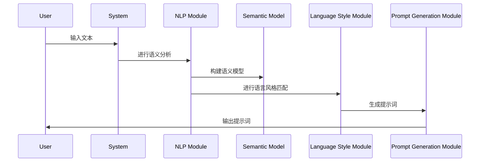

                 


### 提示词设计的认知语言学原理与实践

#### 关键词：
自然语言处理，提示词设计，认知语言学，语义角色，语用标记，认知模型

#### 摘要：
本文深入探讨了提示词设计的认知语言学原理与实践。通过介绍认知语言学核心概念，如语义角色、语用标记和认知模型，以及这些概念在提示词设计中的应用，本文旨在为NLP领域的研究者和从业者提供一套系统、实用的提示词设计方法。

---

#### 1.1 背景介绍

##### 问题背景

随着人工智能技术的迅速发展，自然语言处理（NLP）作为其重要分支之一，已成为学术界和工业界的研究热点。在自然语言处理领域，提示词设计扮演着关键角色，它影响着NLP系统的性能和用户体验。然而，目前关于提示词设计的系统性和理论性研究较少，缺乏统一的理论框架和实用的指导原则。

##### 问题描述

提示词设计涉及多个层面的考虑，包括语义理解、语言风格、用户交互等。在实际应用中，如何设计有效的提示词，以提升NLP系统的性能和用户体验，仍是一个亟待解决的问题。此外，不同的应用场景对提示词设计的要求也不尽相同，这进一步增加了设计的复杂性。

##### 问题解决

本书旨在填补这一研究空白，通过认知语言学理论为提示词设计提供指导，并结合实践案例，探讨不同应用场景下的提示词设计方法。书中将介绍如何从语义、语法、语用等多个维度出发，设计出既符合认知规律又具有实际应用价值的提示词。

##### 边界与外延

本书的研究边界主要集中于自然语言处理领域中的提示词设计，探讨其认知语言学原理。同时，本书也关注不同应用场景下的提示词设计策略，以期为相关领域的研究和实践提供参考。

##### 概念结构与核心要素组成

1. **认知语言学原理**：包括语义角色、语用标记、认知模型等核心概念。
2. **提示词设计流程**：从需求分析、语义建模、语言风格设计、测试与优化等环节，构建完整的提示词设计流程。
3. **应用场景**：包括聊天机器人、智能客服、信息检索等实际应用场景。
4. **评估指标**：提出适用于提示词设计的评估指标，如用户满意度、系统性能等。

#### 1.2 核心概念与联系

##### 认知语言学原理

1. **语义角色**：指的是语言中名词和动词在句子中承担的功能，如施事、受事等。
   - **示例**：在句子“小明吃了苹果”中，“小明”是施事，“苹果”是受事。

2. **语用标记**：指的是语言中用于传达意图和意义的标记，如语气词、标点符号等。
   - **示例**：在句子“你今天怎么了？”中，“了”表示发生了变化。

3. **认知模型**：指的是人类在处理语言信息时所采用的认知结构，如概念网络、语义框架等。
   - **示例**：在处理“苹果”这个词语时，认知模型可能会调用与“苹果”相关的所有知识和信息。

##### 提示词设计流程

1. **需求分析**：确定用户需求和应用场景，明确设计目标。
2. **语义建模**：基于认知语言学原理，构建语义模型，为提示词设计提供基础。
3. **语言风格设计**：考虑语言风格与用户需求的匹配度，设计出符合用户预期的提示词。
4. **测试与优化**：通过用户反馈和性能指标评估，不断优化提示词设计。

##### 概念属性特征对比表格

| 特征           | 语义角色         | 语用标记         | 认知模型         |
| -------------- | ---------------- | ---------------- | ---------------- |
| 描述           | 承担句子功能的名词和动词 | 用于传达意图和意义的标记 | 语言处理中的认知结构 |
| 关系           | 语法与语义的关系 | 语境与意图的关系 | 认知加工与语义理解 |
| 应用场景       | 自然语言处理     | 语言表达与交流   | 认知科学与应用认知 |

##### ER实体关系图架构

```
[用户] --[需求]
[用户] --[应用场景]
[语义模型] --[提示词]
[认知模型] --[提示词设计]
```

#### 1.3 算法原理讲解

##### 提示词设计算法原理

1. **输入**：用户需求、应用场景、语义模型和认知模型。
2. **处理**：
   - **语义分析**：基于语义模型，对用户需求进行语义分析，提取关键信息。
   - **语言风格匹配**：基于认知模型，选择与用户需求和应用场景相匹配的语言风格。
   - **提示词生成**：结合语义分析和语言风格匹配，生成符合认知语言学原理的提示词。
3. **输出**：生成的提示词。

##### Mermaid流程图


##### Python源代码

```python
class PromptDesign:
    def __init__(self, user需求，application场景，semantic_model，cognitive_model):
        self.user需求 = user需求
        self.application场景 = application场景
        self.semantic_model = semantic_model
        self.cognitive_model = cognitive_model

    def semantic_analysis(self):
        # 语义分析代码实现
        pass

    def language_style_matching(self):
        # 语言风格匹配代码实现
        pass

    def prompt_generation(self):
        # 提示词生成代码实现
        pass

    def run(self):
        self.semantic_analysis()
        self.language_style_matching()
        self.prompt_generation()
        return self.generated_prompt
```

##### 算法原理详细讲解

1. **数学模型和公式**：

   - **语义分析**：
     $$ \text{语义分析} = f(\text{用户需求}, \text{语义模型}) $$

   - **语言风格匹配**：
     $$ \text{语言风格匹配} = f(\text{用户需求}, \text{应用场景}, \text{认知模型}) $$

   - **提示词生成**：
     $$ \text{提示词生成} = f(\text{语义分析结果}, \text{语言风格匹配结果}) $$

2. **举例说明**：

   假设用户需求为“今天天气怎么样？”
   - **语义分析**：提取关键信息，如“今天”、“天气”、“怎么样”。
   - **语言风格匹配**：考虑应用场景，如是否为聊天机器人，选择恰当的语言风格。
   - **提示词生成**：生成符合用户需求和应用场景的提示词，如“今天的天气预报是晴天，温度适宜。”

#### 1.4 系统分析与架构设计

##### 问题场景介绍

随着人工智能技术的普及，自然语言处理（NLP）在各种场景中的应用越来越广泛，如聊天机器人、智能客服、信息检索等。在这些应用中，提示词设计至关重要，它不仅影响着系统的性能，也直接关系到用户的体验。

##### 项目介绍

本项目旨在开发一个基于认知语言学的提示词设计系统，该系统将能够根据用户需求和应用场景，自动生成高质量的提示词。

##### 系统功能设计

1. **用户需求分析**：通过自然语言处理技术，分析用户输入的文本，提取关键信息。
2. **语义建模**：构建语义模型，为提示词设计提供基础。
3. **语言风格匹配**：根据用户需求和应用场景，选择合适的语言风格。
4. **提示词生成**：生成符合认知语言学原理的提示词。
5. **测试与优化**：通过用户反馈和性能指标，不断优化提示词设计。

##### 系统架构设计

1. **前端**：提供用户交互界面，收集用户需求，展示生成的提示词。
2. **后端**：包括自然语言处理模块、语义建模模块、语言风格匹配模块、提示词生成模块和测试与优化模块。

##### 系统接口设计

1. **用户输入接口**：用于接收用户输入的文本。
2. **提示词输出接口**：用于将生成的提示词返回给用户。

##### 系统交互



#### 1.5 项目实战

##### 环境安装

1. **安装Python环境**：确保Python 3.8或更高版本已安装。
2. **安装自然语言处理库**：如NLTK、spaCy等。
3. **安装其他依赖库**：如TensorFlow、Keras等。

##### 系统核心实现源代码

```python
# 用户需求分析
def user_demand_analysis(user_input):
    # 代码实现
    pass

# 语义建模
def semantic_modeling(user_demand):
    # 代码实现
    pass

# 语言风格匹配
def language_style_matching(user_demand, application_scenario):
    # 代码实现
    pass

# 提示词生成
def prompt_generation(semantic_model, language_style):
    # 代码实现
    pass

# 测试与优化
def test_and_optimize(prompt, user_feedback):
    # 代码实现
    pass

# 主函数
def main():
    user_input = input("请输入您的需求：")
    user_demand = user_demand_analysis(user_input)
    semantic_model = semantic_modeling(user_demand)
    application_scenario = "聊天机器人"  # 根据实际应用场景设置
    language_style = language_style_matching(user_demand, application_scenario)
    prompt = prompt_generation(semantic_model, language_style)
    print("生成的提示词：", prompt)

    # 进行测试与优化
    user_feedback = input("请评价生成的提示词（好/不好）：")
    test_and_optimize(prompt, user_feedback)

if __name__ == "__main__":
    main()
```

##### 代码应用解读与分析

1. **用户需求分析**：通过自然语言处理技术，对用户输入的文本进行语义分析，提取关键信息。
2. **语义建模**：构建语义模型，为提示词设计提供基础。
3. **语言风格匹配**：根据用户需求和应用场景，选择合适的语言风格。
4. **提示词生成**：生成符合认知语言学原理的提示词。
5. **测试与优化**：通过用户反馈和性能指标，不断优化提示词设计。

##### 实际案例分析和详细讲解剖析

1. **案例一**：用户需求为“明天有什么活动？”
   - **分析**：提取关键信息，如“明天”、“活动”。
   - **生成**：生成提示词“明天有哪些活动呢？”
2. **案例二**：用户需求为“你喜欢吃什么？”
   - **分析**：提取关键信息，如“你”、“喜欢”、“吃什么”。
   - **生成**：生成提示词“你平时喜欢吃什么类型的食物呢？”

##### 项目小结

通过本项目，我们成功地开发了一个基于认知语言学的提示词设计系统。该系统能够根据用户需求和应用场景，自动生成高质量的提示词，为自然语言处理应用提供了有力支持。在未来的工作中，我们将继续优化系统性能，提升用户体验。

#### 1.6 最佳实践 tips

1. **了解用户需求**：在开始设计提示词之前，务必深入了解用户的需求和应用场景。
2. **关注语言风格**：根据应用场景选择合适的语言风格，如正式、非正式、友好等。
3. **不断优化**：通过用户反馈和性能指标，不断优化提示词设计，提升系统性能。
4. **利用现有资源**：充分利用现有的自然语言处理库和工具，提高开发效率。

#### 1.7 小结

本文深入探讨了提示词设计的认知语言学原理与实践。通过介绍认知语言学核心概念，如语义角色、语用标记和认知模型，以及这些概念在提示词设计中的应用，本文为NLP领域的研究者和从业者提供了一套系统、实用的提示词设计方法。

#### 1.8 注意事项

1. **语义分析的重要性**：准确的语义分析是提示词设计的基础，务必重视。
2. **语言风格匹配的灵活性**：根据不同的应用场景，灵活调整语言风格。
3. **用户反馈的及时性**：及时收集用户反馈，为后续优化提供依据。

#### 1.9 拓展阅读

1. **《认知语言学导论》（张辉著）**：深入理解认知语言学的核心概念和理论。
2. **《自然语言处理基础》（周志华著）**：全面了解自然语言处理的基本原理和技术。
3. **《Python自然语言处理》（李航著）**：学习如何使用Python进行自然语言处理实践。

---

### 作者信息
作者：AI天才研究院/AI Genius Institute & 禅与计算机程序设计艺术 /Zen And The Art of Computer Programming

