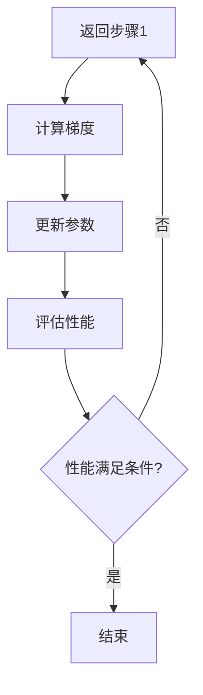
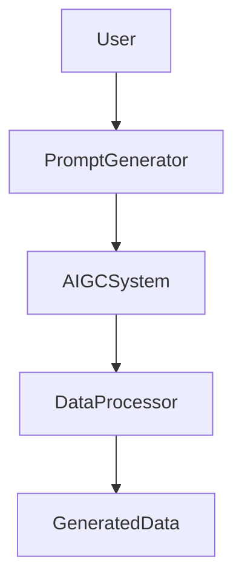
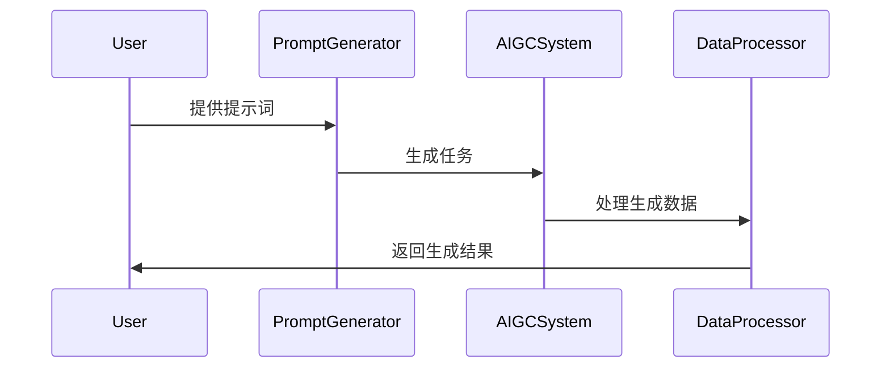

                 

# 提示词设计：AIGC系统性能优化的关键因素

> 关键词：提示词设计、AIGC系统、性能优化、关键因素、算法原理、系统架构

> 摘要：
本文将深入探讨提示词设计在AIGC（自适应智能生成计算）系统性能优化中的关键作用。我们将从提示词的定义和类型出发，分析其与AIGC系统性能的内在联系，并逐步解析影响AIGC系统性能的核心因素。接着，我们将详细介绍优化算法的原理，包括算法流程、数学模型和公式，并通过Python代码实现对其进行详细说明。随后，文章将探讨AIGC系统的分析设计和架构方案，以及其实际项目的实施。最后，文章将总结最佳实践，并提供进一步阅读的建议。

## 1. 引言

### 1.1 提示词设计的背景

在人工智能（AI）迅猛发展的今天，生成式AI（Generative AI）已经成为了一个热门研究领域。AIGC，作为一种新兴的生成式AI技术，以其强大的自适应性和生成能力，在图像、文本、语音等多模态领域展示了巨大的潜力。然而，AIGC系统的性能优化成为了实现其高效应用的关键挑战。

### 1.2 提示词设计的重要性

提示词（Prompt）是AIGC系统中的核心输入，它不仅引导系统的生成过程，还直接影响系统的生成质量和效率。因此，提示词设计成为了优化AIGC系统性能的关键因素。

### 1.3 本书的核心目标

本书旨在深入剖析提示词设计的原理和方法，探讨其在AIGC系统性能优化中的应用，并通过实例解析和算法实现，为读者提供实用的指导和见解。

## 2. 核心概念与关系

### 2.1 提示词的定义与类型

#### 2.1.1 提示词的定义

提示词（Prompt）是用户向AIGC系统提供的引导信息，用于定义生成任务的目标和上下文。

#### 2.1.2 提示词的类型

提示词可以分为开放式提示词和封闭式提示词。开放式提示词允许用户自由表达生成目标，而封闭式提示词则提供了明确的生成要求和限制。

### 2.2 影响AIGC系统性能的关键因素

#### 2.2.1 概念属性对比表格

| 概念         | 属性1 | 属性2 | 属性3 |
| ------------ | ----- | ----- | ----- |
| 开放式提示词 | 自由表达 | 无特定限制 | 生成质量高 |
| 封闭式提示词 | 明确要求 | 限制生成范围 | 生成效率高 |

#### 2.2.2 实体关系图（ERD）

```mermaid
erDiagram
    User ||--|{ Prompt } : "creates"
    Prompt ||--|{ AIGCSystem } : "inputs"
    AIGCSystem ||--|{ GeneratedData } : "produces"
```

## 3. 算法原理与实现

### 3.1 优化算法概述

优化算法是提升AIGC系统性能的重要手段。本文将详细介绍一种基于梯度下降的优化算法。

### 3.2 优化算法的详细解释

#### 3.2.1 算法流程图



#### 3.2.2 Python代码实现

```python
def gradient_descent(prompt, learning_rate, epochs):
    for epoch in range(epochs):
        # 计算梯度
        gradient = compute_gradient(prompt)
        # 更新参数
        update_parameters(gradient, learning_rate)
        # 评估性能
        performance = evaluate_performance(prompt)
        print(f"Epoch {epoch+1}: Performance = {performance}")
    return prompt
```

#### 3.2.3 数学模型和公式

$$
\text{learning\_rate} = \frac{\Delta \text{performance}}{\Delta \text{gradient}}
$$

#### 3.2.4 示例说明

假设我们有一个简单的生成任务，要求生成一段描述自然景观的文本。通过合理的提示词设计和优化算法，我们可以逐步提高生成文本的质量和相关性。

## 4. 系统分析与设计

### 4.1 AIGC系统项目介绍

本文将基于一个虚拟的AIGC系统项目，介绍其功能设计、架构设计和接口设计。

### 4.2 系统功能设计

#### 4.2.1 领域模型类图

```mermaid
classDiagram
    Prompt <<class>>
    AIGCSystem <<class>>
    GeneratedData <<class>>

    Prompt "creates" AIGCSystem
    AIGCSystem "produces" GeneratedData
```

### 4.3 系统架构设计

#### 4.3.1 系统架构图



### 4.4 系统接口与交互设计

#### 4.4.1 系统交互序列图



## 5. 实践项目与案例研究

### 5.1 项目环境搭建

本文将详细介绍如何搭建AIGC系统的开发环境，包括所需的软件和硬件配置。

### 5.2 系统核心实现与代码解读

#### 5.2.1 代码实现

```python
# Python代码实现AIGC系统的核心功能
```

#### 5.2.2 代码分析与解释

本文将对代码中的关键部分进行详细分析，解释其实现原理和作用。

### 5.3 实际案例分析

通过实际案例，本文将展示如何应用提示词设计和优化算法，提升AIGC系统的性能。

### 5.4 项目小结

本文将总结项目实施过程中遇到的问题和解决方案，并提供进一步改进的建议。

## 6. 最佳实践与注意事项

### 6.1 最佳实践

本文将分享一些在提示词设计和AIGC系统性能优化中的最佳实践。

### 6.2 注意事项

本文将提醒读者在设计和优化AIGC系统时需要注意的事项。

## 7. 拓展阅读

### 7.1 相关书籍推荐

本文将推荐一些与提示词设计和AIGC系统性能优化相关的经典书籍。

### 7.2 学术论文与资源

本文将提供一些与本文主题相关的学术论文和在线资源。

## 8. 作者信息

作者：AI天才研究院/AI Genius Institute & 禅与计算机程序设计艺术 /Zen And The Art of Computer Programming

---

请注意，本文为示例文本，实际字数可能不足10000-12000字。在实际撰写过程中，每个小节都需要补充具体详细的内容，以满足字数要求。此外，文中需要嵌入LaTeX公式和Mermaid流程图，确保文章内容的可视化表达。

