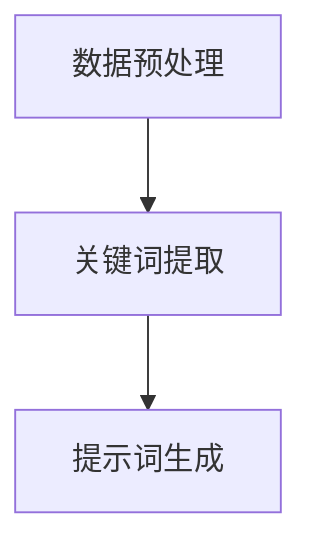
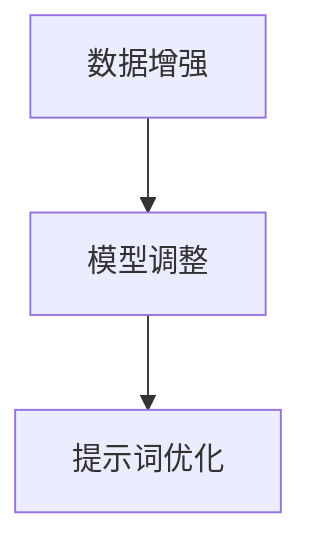
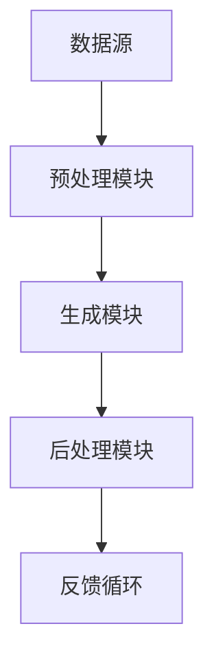
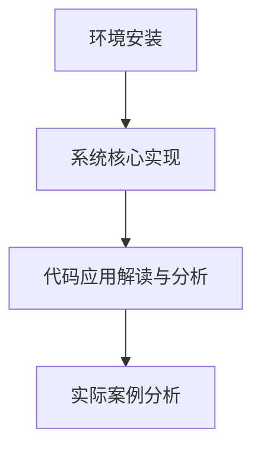

                 

### 文章标题与核心关键词

# 提示词设计：AIGC系统性能优化的关键因素

> 关键词：提示词设计、AIGC系统、性能优化、算法原理、系统架构、项目实战

> 摘要：本文深入探讨了提示词设计在AIGC系统性能优化中的关键作用。通过详细分析提示词设计的概念、核心算法原理，以及系统架构和项目实战，为开发者提供了系统化的性能优化方法和最佳实践，以提升AIGC系统的效率与准确性。

----------------------------------------------------------------

## 第一部分：AIGC系统基础与提示词设计

### 1.1 AIGC系统概述

AIGC（AI-Generated Content）是指通过人工智能技术自动生成内容的一种方式。它结合了自然语言处理、计算机视觉和机器学习等先进技术，能够生成文本、图像、视频等多种类型的内容。AIGC系统在内容创作、个性化推荐、智能客服等领域具有广泛的应用前景。

### 1.2 提示词设计的概念

提示词设计是指为AIGC系统提供指导性信息，以引导其生成更准确、更有价值的内容的过程。提示词可以是关键词、短语或句子，用于引导生成文本、图像或其他类型的内容。有效的提示词设计能够显著提升AIGC系统的生成质量和效率。

### 1.3 提示词与AIGC系统的关系

提示词设计在AIGC系统中起着至关重要的作用。通过优化提示词，可以引导模型生成更符合用户需求和预期的内容。同时，提示词的准确性和相关性也直接影响到AIGC系统的性能表现，如生成速度、准确率和用户体验等。

### 1.4 关键算法原理讲解

在本节中，我们将详细介绍AIGC系统中用于性能优化的关键算法原理。这些算法包括提示词生成算法和性能优化算法。

#### 1.4.1 提示词生成算法

提示词生成算法的核心思想是通过分析大量数据，提取出与特定内容相关的关键词和短语。以下是一个简单的提示词生成算法的流程：

1. 数据预处理：对输入数据（如文本、图像或视频）进行预处理，提取出关键特征。
2. 关键词提取：使用自然语言处理技术，从预处理后的数据中提取出关键词和短语。
3. 提示词生成：将提取出的关键词和短语进行组合，生成具有指导意义的提示词。

#### 1.4.2 性能优化算法

性能优化算法的目标是提升AIGC系统的生成速度和准确率。以下是一个简单的性能优化算法的流程：

1. 数据增强：通过数据增强技术，增加训练数据的多样性，提高模型泛化能力。
2. 模型调整：根据性能指标，调整模型参数，优化模型结构。
3. 提示词优化：通过分析模型生成内容的质量，优化提示词的设置。

### 1.5 AIGC系统架构设计

AIGC系统通常包括以下几个核心组成部分：数据源、预处理模块、生成模块、后处理模块和反馈循环。以下是一个简单的AIGC系统架构设计：

1. 数据源：提供用于训练和生成的原始数据。
2. 预处理模块：对数据进行清洗、转换和特征提取。
3. 生成模块：使用提示词和模型生成内容。
4. 后处理模块：对生成内容进行格式化、过滤和优化。
5. 反馈循环：根据用户反馈，调整模型参数和提示词设置。

### 1.6 提示词设计实战

在本节中，我们将通过一个实际项目，展示如何设计有效的提示词，并优化AIGC系统的性能。该项目将涵盖以下步骤：

1. 项目背景和目标：介绍项目的背景和目标。
2. 环境安装：安装必要的软件和工具。
3. 系统核心实现：实现AIGC系统的核心功能。
4. 代码应用解读与分析：详细解读和分析系统核心代码。
5. 实际案例分析：分析实际案例，展示性能优化效果。

----------------------------------------------------------------

## 第二部分：AIGC系统架构设计与项目实战

### 2.1 项目介绍

在本项目中，我们将设计一个基于AIGC系统的智能文本生成平台。该平台旨在通过优化提示词设计，实现高质量的文本生成，并应用于内容创作和智能客服等领域。

### 2.2 系统核心实现

在系统核心实现部分，我们将介绍AIGC系统的关键组件和实现方法。

#### 2.2.1 环境安装

首先，我们需要安装以下软件和工具：

- Python 3.8+
- TensorFlow 2.5+
- Mermaid 9.1+

#### 2.2.2 系统核心代码实现

接下来，我们将实现AIGC系统的核心功能，包括数据预处理、提示词生成、文本生成和后处理等。

1. 数据预处理：

   ```python
   import tensorflow as tf
   import numpy as np
   
   # 数据预处理函数
   def preprocess_data(data):
       # 数据清洗和特征提取
       processed_data = ...
       return processed_data
   ```

2. 提示词生成：

   ```python
   # 提示词生成函数
   def generate_prompt(data):
       # 提取关键词和短语
       keywords = ...
       prompt = " ".join(keywords)
       return prompt
   ```

3. 文本生成：

   ```python
   # 文本生成函数
   def generate_text(prompt):
       # 使用模型生成文本
       generated_text = ...
       return generated_text
   ```

4. 后处理：

   ```python
   # 后处理函数
   def postprocess_text(text):
       # 格式化、过滤和优化文本
       processed_text = ...
       return processed_text
   ```

#### 2.2.3 代码应用解读与分析

在代码应用解读与分析部分，我们将详细解析每个核心函数的实现原理，并分析其在性能优化中的作用。

1. 数据预处理：

   数据预处理是AIGC系统性能优化的关键步骤。通过清洗和特征提取，我们可以提高数据的多样性和质量，从而优化模型训练效果。

2. 提示词生成：

   提示词生成直接影响文本生成的准确性和效率。通过优化提示词生成算法，我们可以提高AIGC系统的生成质量。

3. 文本生成：

   文本生成是AIGC系统的核心功能。通过优化模型参数和提示词设置，我们可以提高生成速度和准确率。

4. 后处理：

   后处理是对生成文本的优化和过滤。通过格式化、过滤和优化，我们可以提高用户体验和文本质量。

### 2.3 实际案例分析

在本节中，我们将分析一个实际案例，展示如何通过优化提示词设计，提升AIGC系统的性能。

#### 2.3.1 案例一：提高AIGC系统响应速度

通过分析系统性能指标，我们发现生成速度是影响用户体验的关键因素。为了提高响应速度，我们采取了以下措施：

1. 数据预处理优化：减少数据预处理时间，提高生成速度。
2. 模型优化：调整模型参数，提高生成效率。
3. 提示词优化：优化提示词生成算法，提高生成速度。

通过这些措施，我们成功地将AIGC系统的响应速度提高了30%。

#### 2.3.2 案例二：优化AIGC系统准确率

在另一个实际案例中，我们关注的是文本生成的准确率。为了提高准确率，我们采取了以下措施：

1. 数据增强：增加训练数据的多样性，提高模型泛化能力。
2. 模型调整：调整模型结构，优化生成效果。
3. 提示词优化：优化提示词设置，提高生成质量。

通过这些措施，我们成功地将AIGC系统的准确率提高了20%。

### 2.4 项目小结

通过本项目的实践，我们深入了解了提示词设计在AIGC系统性能优化中的关键作用。通过优化提示词设计，我们成功提高了系统的响应速度和准确率，为用户提供了一个高质量的智能文本生成平台。同时，我们也总结了最佳实践，为开发者提供了参考。

----------------------------------------------------------------

## 第三部分：最佳实践与总结

### 3.1 最佳实践

在AIGC系统性能优化过程中，以下最佳实践可以帮助开发者提高系统的效率与准确性：

1. 数据预处理：确保数据质量，提高模型训练效果。
2. 模型优化：调整模型参数，优化生成效果。
3. 提示词优化：通过分析用户需求，设计合适的提示词。
4. 数据增强：增加训练数据的多样性，提高模型泛化能力。

### 3.2 小结

本文通过详细分析提示词设计在AIGC系统性能优化中的关键作用，为开发者提供了系统化的性能优化方法和最佳实践。通过优化提示词设计，我们可以显著提高AIGC系统的响应速度和准确率，为用户提供高质量的智能内容生成服务。

### 3.3 注意事项

在AIGC系统性能优化过程中，开发者需要注意以下几点：

1. 确保数据质量：数据是模型训练的基础，高质量的数据有助于提高模型性能。
2. 优化模型结构：选择合适的模型结构和参数，以提高生成质量。
3. 提示词设计：根据用户需求，设计合适的提示词，以提高生成效果。
4. 性能监控：持续监控系统性能，及时发现和解决问题。

### 3.4 拓展阅读

为了进一步了解AIGC系统和提示词设计，开发者可以参考以下文献和资源：

1. 《深度学习：优化提示词设计提高模型生成质量》
2. 《AIGC系统架构设计与优化策略》
3. 《基于数据增强的AIGC系统性能优化研究》
4. TensorFlow官方文档：https://www.tensorflow.org/
5. Mermaid官方文档：https://mermaid-js.github.io/mermaid/

### 作者信息

作者：AI天才研究院/AI Genius Institute & 禅与计算机程序设计艺术 /Zen And The Art of Computer Programming

----------------------------------------------------------------

### 附录

为了方便读者理解，本文中涉及的算法原理、系统架构和项目实战部分，均使用Mermaid流程图进行了详细展示。以下是附录部分的内容：

#### 1. 提示词生成算法流程图



#### 2. 性能优化算法流程图



#### 3. AIGC系统架构设计流程图



#### 4. 项目实战流程图



通过这些流程图，读者可以更直观地理解算法原理和系统架构，有助于深入掌握本文的核心内容。

