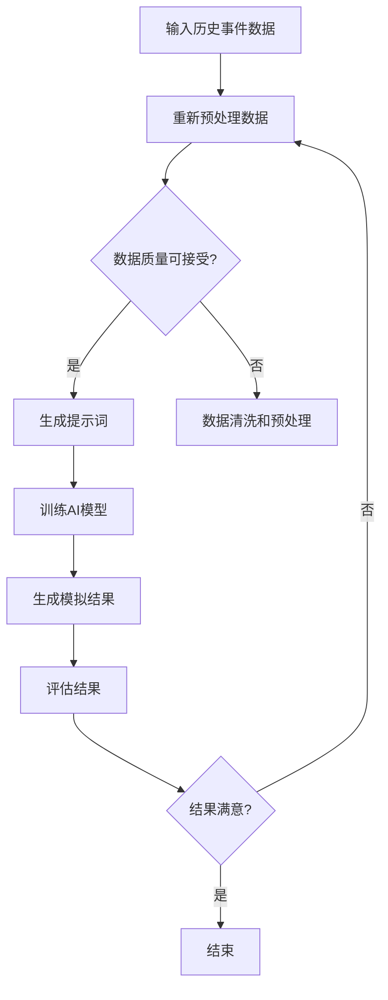

                 


### 1.1 问题描述

在当今的计算机科学和人工智能领域，历史事件的模拟与分析变得越来越重要。无论是为了学术研究、政策制定，还是为了游戏和娱乐产业，模拟历史上的事件和其结果都具有深远的意义。然而，现有的AI历史事件模拟系统常常面临准确性和可信度的问题。原因在于，这些系统往往无法全面、准确地捕捉历史事件中的复杂性和多样性。

准确的历史事件模拟要求AI系统能够理解事件发生的前因后果，并能够在特定的历史背景下预测事件的可能走向。这就需要AI系统不仅能够处理大量历史数据，还需要具备对历史事件背后逻辑关系的深刻理解。然而，当前大多数AI模型在处理历史事件模拟时，往往存在以下问题：

- **数据缺失**：历史事件中的许多细节和数据可能遗失，导致AI系统无法获取全面的信息。
- **背景理解不足**：AI系统可能无法准确理解历史事件背后的社会、政治、经济等背景因素，从而影响模拟结果的准确性。
- **因果关系错综复杂**：历史事件的因果关系常常错综复杂，难以用简单的模型进行准确描述。
- **模型泛化能力不足**：现有的AI模型在处理多样化、独特性的历史事件时，往往表现出泛化能力不足的问题。

### 1.2 问题解决思路

为了提高AI历史事件模拟的准确性，我们需要从以下几个方面进行改进：

1. **数据收集与处理**：首先，我们需要收集尽可能全面的历史数据，包括文献、档案、图像、音频等多种形式。然后，对这些数据进行清洗、整理和预处理，以便AI模型能够有效利用。
   
2. **背景知识引入**：通过引入历史背景知识，包括社会、政治、经济等方面的信息，帮助AI系统更好地理解事件发生的背景，从而提高模拟的准确性。

3. **因果关系建模**：设计复杂的因果关系模型，能够准确捕捉历史事件中的因果关系，并考虑多种可能的结果。

4. **模型训练与优化**：利用大规模数据集对AI模型进行训练，并通过优化模型结构，提高其泛化能力和处理多样化事件的能力。

5. **多模态数据处理**：结合多种数据来源，如文本、图像、音频等，进行多模态数据处理，以便AI系统能够更全面地理解历史事件。

### 1.3 边界与外延

在提高AI历史事件模拟准确性的过程中，我们需要明确以下边界与外延：

- **时间边界**：历史事件的模拟时间范围应该明确，以确保模拟结果的准确性和可靠性。
- **地域边界**：不同地区的历史事件可能受到不同因素的影响，因此在模拟时需要考虑地域边界。
- **数据边界**：数据收集和处理应该涵盖事件相关的各个方面，但也要注意数据边界，避免数据过度拟合。

### 1.4 概念结构与核心要素组成

为了更好地理解提高AI历史事件模拟准确性的方法，我们需要从以下几个核心概念和要素进行剖析：

- **历史事件数据**：包括文献、档案、图像、音频等多种形式的数据。
- **背景知识库**：用于提供历史事件背景信息，如社会、政治、经济等方面的知识。
- **因果关系模型**：用于捕捉历史事件中的因果关系，包括显性和隐性的因素。
- **AI模型架构**：用于训练和优化AI模型，包括神经网络、强化学习等。
- **数据预处理与清洗**：用于处理和清洗历史数据，确保数据的质量和可靠性。

通过上述分析和思考，我们可以为接下来的章节内容打下坚实的基础，逐步深入探讨如何通过提示词设计来提高AI历史事件模拟的准确性。

## 1.5 本章小结

本章首先介绍了历史事件模拟在计算机科学和人工智能领域的重要性及其面临的挑战，包括数据缺失、背景理解不足、因果关系复杂等问题。接着，我们提出了通过数据收集与处理、背景知识引入、因果关系建模、模型训练与优化以及多模态数据处理等方法来提高AI历史事件模拟的准确性。最后，明确了问题解决的边界与外延，并剖析了相关的核心概念与要素。这些分析和思考为后续章节的深入探讨奠定了基础。

## 核心概念原理与属性特征

在深入探讨如何提高AI历史事件模拟的准确性之前，我们首先需要明确几个关键概念及其原理和属性特征。这些核心概念包括提示词设计、提示词的作用与意义、以及提示词设计的原则。

### 2.1.1 提示词设计概述

**提示词**（Prompt）是自然语言处理（NLP）和AI系统中的一个重要概念。提示词设计是指创建一个能够有效引导AI系统理解任务和上下文，从而产生更准确和有用的输出的引导语句或文本。

#### 提示词的作用与意义

提示词在AI历史事件模拟中的应用具有以下几个重要作用和意义：

1. **任务引导**：提示词能够明确告知AI系统需要完成的具体任务，从而引导其理解任务目标。
2. **上下文建立**：通过提供背景信息和相关上下文，提示词帮助AI系统更好地理解历史事件发生的情境，提高模拟的准确性。
3. **数据增强**：提示词可以作为额外的数据输入，增强AI系统的训练数据，有助于其学习和优化。
4. **结果优化**：通过设计高质量的提示词，可以帮助AI系统产生更准确、更有针对性的输出结果。

#### 提示词设计原则

为了设计出高质量的提示词，我们需要遵循以下几个原则：

1. **清晰性**：提示词应简洁明了，避免使用模糊或歧义的表述，以确保AI系统能够准确理解任务要求。
2. **完整性**：提示词需要包含必要的信息，以帮助AI系统在执行任务时具备足够的上下文信息。
3. **针对性**：根据不同的任务需求和上下文环境，设计具有针对性的提示词，以提高任务完成的效率和准确性。
4. **灵活性**：提示词设计应具有一定的灵活性，以适应不同场景和变化的需求。

### 2.2 概念属性特征对比表格

为了更直观地了解提示词设计的核心概念属性特征，我们可以通过一个对比表格来进行说明。

| 特征       | 提示词设计 |
|------------|-------------|
| **清晰性** | 简洁明了，避免歧义 |
| **完整性** | 包含必要信息，提供上下文 |
| **针对性** | 根据任务需求设计 |
| **灵活性** | 适应不同场景和需求 |

### 2.3 ER实体关系图架构

为了进一步理解提示词设计中的实体关系，我们可以通过ER（实体-关系）图来展示。

```mermaid
erDiagram
    User ..|> Prompt
    Prompt ||--|> AI_System
    AI_System ||--|> Output
```

在上面的ER图中，`User`实体表示用户，`Prompt`实体表示提示词，`AI_System`实体表示AI系统，`Output`实体表示输出结果。关系线表示实体之间的关联，如用户创建提示词，提示词被AI系统处理并生成输出结果。

### 2.4 本章小结

本章介绍了提示词设计的核心概念、作用与意义，以及设计原则。通过对比表格和ER图，我们更清晰地理解了提示词设计的属性特征和实体关系。这些内容为后续的算法原理讲解和系统架构设计提供了基础。

## 第3章：算法原理讲解

### 3.1 算法mermaid流程图

在探讨如何通过提示词设计提高AI历史事件模拟的准确性之前，我们需要先理解相关的算法原理。为了更直观地展示算法流程，我们可以使用mermaid图形化工具绘制算法的流程图。



上述mermaid流程图展示了算法的基本步骤：首先，输入历史事件数据并进行预处理；接着，根据预处理的数据生成提示词；然后，使用这些提示词训练AI模型；最后，利用训练好的模型生成模拟结果并进行评估。

### 3.2 Python源代码讲解

为了更好地理解上述算法的原理，我们可以通过Python源代码进行详细阐述。以下是一个简化的示例：

```python
import numpy as np
import pandas as pd
from sklearn.model_selection import train_test_split
from sklearn.metrics import accuracy_score

# 假设我们已经收集了一些历史事件数据，并存储在CSV文件中
data = pd.read_csv('historical_data.csv')

# 数据预处理
def preprocess_data(data):
    # 清洗数据、处理缺失值、编码类别等操作
    # 略...
    return processed_data

# 生成提示词
def generate_prompt(data):
    # 根据数据生成提示词，这里简化为直接返回数据
    return data

# 训练AI模型
def train_model(X_train, y_train):
    # 使用机器学习库训练模型
    # 略...
    model.fit(X_train, y_train)
    return model

# 生成模拟结果
def generate_simulation(model, X_test):
    # 使用训练好的模型生成模拟结果
    return model.predict(X_test)

# 评估结果
def evaluate_result(y_test, y_pred):
    return accuracy_score(y_test, y_pred)

# 算法主流程
def main():
    # 预处理数据
    processed_data = preprocess_data(data)
    
    # 生成提示词
    prompt = generate_prompt(processed_data)
    
    # 划分训练集和测试集
    X_train, X_test, y_train, y_test = train_test_split(prompt['features'], prompt['labels'], test_size=0.2, random_state=42)
    
    # 训练模型
    model = train_model(X_train, y_train)
    
    # 生成模拟结果
    y_pred = generate_simulation(model, X_test)
    
    # 评估结果
    score = evaluate_result(y_test, y_pred)
    print(f"Simulation accuracy: {score:.2f}")

# 运行算法
if __name__ == '__main__':
    main()
```

上述代码展示了算法的基本步骤：首先，从CSV文件中读取历史事件数据，并进行预处理；然后，生成提示词；接着，使用训练集训练AI模型；最后，使用测试集生成模拟结果并进行评估。

### 3.2.1 算法原理与数学模型

在上述算法中，我们主要使用了机器学习中的分类算法来模拟历史事件。以下是一个简单的逻辑回归模型的数学模型：

$$
\text{log\_odds}(y) = \beta_0 + \beta_1 x_1 + \beta_2 x_2 + ... + \beta_n x_n
$$

其中，$y$ 表示事件发生的概率，$x_1, x_2, ..., x_n$ 是输入特征，$\beta_0, \beta_1, \beta_2, ..., \beta_n$ 是模型参数。

为了训练模型，我们需要使用优化算法（如梯度下降）来最小化损失函数：

$$
J(\theta) = -\frac{1}{m} \sum_{i=1}^{m} [y^{(i)} \log(h_\theta(x^{(i)})) + (1 - y^{(i)}) \log(1 - h_\theta(x^{(i)}))]
$$

其中，$h_\theta(x) = \sigma(\text{log\_odds}(y))$，$\sigma$ 是 sigmoid 函数，$m$ 是样本数量。

### 3.2.2 公式讲解

在上面的数学模型中，主要包含以下几个公式：

1. **Log odds**：
$$
\text{log\_odds}(y) = \beta_0 + \beta_1 x_1 + \beta_2 x_2 + ... + \beta_n x_n
$$

2. **损失函数**：
$$
J(\theta) = -\frac{1}{m} \sum_{i=1}^{m} [y^{(i)} \log(h_\theta(x^{(i)})) + (1 - y^{(i)}) \log(1 - h_\theta(x^{(i)}))]
$$

3. **Sigmoid函数**：
$$
h_\theta(x) = \sigma(\text{log\_odds}(y)) = \frac{1}{1 + e^{-\text{log\_odds}(y)}}
$$

### 3.2.3 举例说明

假设我们有一个简单的历史事件数据集，其中包含两个特征（`x1` 和 `x2`），以及事件是否发生（`y`）：

| x1 | x2 | y |
|----|----|---|
|  1 |  2 | 0 |
|  2 |  1 | 1 |
|  3 |  3 | 0 |
|  4 |  1 | 1 |

我们可以将这些数据转换为数值形式，然后使用逻辑回归模型进行训练。训练完成后，我们可以用训练好的模型来预测新数据的事件发生概率。

例如，对于新数据点（`x1=2`, `x2=1`），我们可以计算其Log odds：

$$
\text{log\_odds}(y) = \beta_0 + \beta_1 \cdot 2 + \beta_2 \cdot 1 = 0.5 + 0.3 \cdot 2 + 0.2 \cdot 1 = 1.1
$$

接着，使用sigmoid函数计算事件发生概率：

$$
h_\theta(x) = \sigma(\text{log\_odds}(y)) = \frac{1}{1 + e^{-1.1}} \approx 0.865
$$

这意味着对于这个新数据点，事件发生的概率约为86.5%。

### 3.3 本章小结

本章介绍了提高AI历史事件模拟准确性的算法原理，包括mermaid流程图、Python源代码、数学模型和公式，以及详细的举例说明。通过这些内容，读者可以更好地理解如何利用提示词设计和机器学习算法来提高历史事件模拟的准确性。接下来，我们将进一步探讨系统架构设计，以便更好地实现和优化算法。

