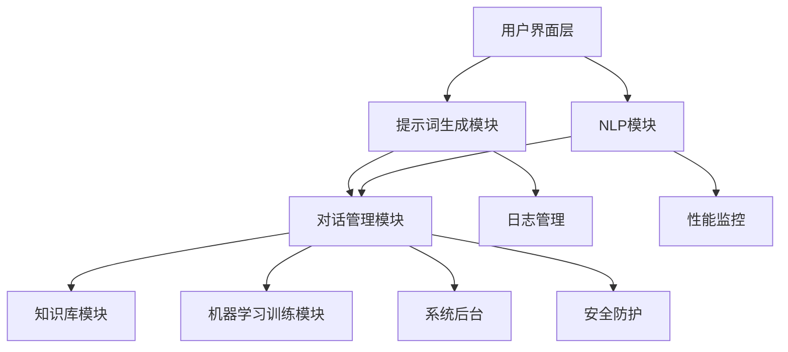

                 

# 提示词设计：构建智能AIGC对话系统的基石

> 关键词：提示词设计、AIGC、对话系统、自然语言处理、系统架构

> 摘要：本文旨在深入探讨提示词设计在构建智能AIGC（AI-Generated Content）对话系统中的重要性。通过分析其背景、核心概念、设计方法、自然语言处理应用以及实际挑战，本文为读者提供了一个全面而深刻的理解，并总结了最佳实践与未来发展方向。提示词设计不仅是智能对话系统的核心组成部分，更是提升用户体验和系统性能的关键。

## 目录大纲

1. [问题背景与概念介绍](#第1章--问题背景与概念介绍)
   1.1 [问题背景](#11-问题背景)
   1.2 [核心概念](#12-核心概念)
   1.3 [联系与边界](#13-联系与边界)
   1.4 [概念结构与核心要素组成](#14-概念结构与核心要素组成)
   1.5 [本章小结](#15-本章小结)
2. [提示词设计方法](#第2章--提示词设计方法)
   2.1 [设计原则](#21-设计原则)
   2.2 [设计流程](#22-设计流程)
   2.3 [设计技巧](#23-设计技巧)
   2.4 [工具与技术](#24-工具与技术)
   2.5 [本章小结](#25-本章小结)
3. [提示词设计与自然语言处理](#第3章--提示词设计与自然语言处理)
   3.1 [NLP基础](#31-nlp基础)
   3.2 [提示词在NLP中的作用](#32-提示词在nlp中的作用)
   3.3 [提示词设计策略](#33-提示词设计策略)
   3.4 [提示词设计案例分析](#34-提示词设计案例分析)
   3.5 [本章小结](#35-本章小结)
4. [提示词设计在实际应用中的挑战与解决方案](#第4章--提示词设计在实际应用中的挑战与解决方案)
   4.1 [数据集选择与处理](#41-数据集选择与处理)
   4.2 [对话上下文的理解](#42-对话上下文的理解)
   4.3 [提示词的多样性](#43-提示词的多样性)
   4.4 [提示词的动态调整](#44-提示词的动态调整)
   4.5 [本章小结](#45-本章小结)
5. [提示词设计的最佳实践](#第5章--提示词设计的最佳实践)
   5.1 [提示词设计案例精选](#51-提示词设计案例精选)
   5.2 [最佳实践总结](#52-最佳实践总结)
   5.3 [小结与展望](#53-小结与展望)
   5.4 [本章小结](#54-本章小结)
6. [提示词设计与系统架构](#第6章--提示词设计与系统架构)
   6.1 [提示词设计在系统架构中的角色](#61-提示词设计在系统架构中的角色)
   6.2 [系统架构设计](#62-系统架构设计)
   6.3 [本章小结](#63-本章小结)
7. [结语](#结语)

## 第1章 问题背景与概念介绍

### 1.1 问题背景

随着人工智能技术的快速发展，AI-Generated Content（AIGC）已经成为一个重要的研究领域。AIGC 涵盖了多种人工智能技术，如自然语言处理（NLP）、图像生成、音频生成等，旨在通过人工智能生成高质量、多样化的内容。而AIGC的核心应用之一就是智能对话系统，这些系统能够模拟人类的对话方式，与用户进行交互，提供信息、解答疑问或执行任务。

然而，AIGC对话系统的性能在很大程度上取决于提示词的设计。提示词是引导对话系统生成正确和有用回复的关键，它不仅影响了对话的质量，还决定了用户体验的满意度。因此，提示词设计成为构建高效、智能的AIGC对话系统的关键。

### 1.2 核心概念

1. **提示词（Prompt）**：提示词是指提供给AI模型的一段文本或指令，用以引导模型理解用户意图和生成相应的回复。

2. **自然语言处理（NLP）**：NLP是人工智能的一个分支，专注于使计算机能够理解、解释和生成人类语言。

3. **AIGC**：AI-Generated Content，即人工智能生成内容，是利用人工智能技术生成高质量、多样化内容的系统。

4. **对话系统**：对话系统是一种人机交互系统，能够模拟人类对话，与用户进行自然语言交流。

### 1.3 提示词设计的重要性

提示词设计在AIGC对话系统中具有以下几个重要性：

1. **提高对话质量**：有效的提示词能够引导模型更好地理解用户意图，从而生成更准确、更自然的回复。

2. **增强用户体验**：良好的提示词设计可以提升用户与对话系统的交互体验，增加用户满意度。

3. **提升系统性能**：合理的提示词设计有助于提高模型的训练效果，进而提升系统的整体性能。

4. **降低开发成本**：通过优化提示词设计，可以减少模型训练的时间和资源消耗，降低开发成本。

### 1.4 概念结构与核心要素组成

提示词设计的基本流程包括需求分析、内容创作和优化调整。其中，需求分析是关键的第一步，它决定了后续的设计方向。内容创作则需要结合自然语言处理技术，生成高质量的提示词。优化调整则是对已有提示词的不断改进，以提高系统的性能。

### 1.5 本章小结

本章首先介绍了AIGC对话系统背景和提示词设计的重要性，然后详细阐述了提示词的核心概念和结构。通过这些分析，为后续章节的深入探讨奠定了基础。

## 第2章 提示词设计方法

### 2.1 设计原则

提示词设计应遵循以下三个基本原则：

1. **简明性**：提示词应简洁明了，避免冗余和复杂性，以便模型能够快速理解。

2. **可理解性**：提示词应易于用户和AI模型理解，确保交互的顺畅。

3. **灵活性**：提示词设计应具有灵活性，能够适应不同的场景和用户需求。

### 2.2 设计流程

提示词设计的基本流程包括以下三个步骤：

1. **需求分析**：明确用户需求和场景，确定提示词的目标和功能。

2. **内容创作**：结合NLP技术，创作高质量的提示词。

3. **优化调整**：根据实际使用情况，对提示词进行优化和调整。

### 2.3 设计技巧

1. **对话流程设计**：设计合理的对话流程，确保对话的自然流畅。

2. **提示词模板设计**：使用模板化设计，提高设计效率和一致性。

3. **提示词的动态调整**：根据用户反馈和系统性能，实时调整提示词。

### 2.4 工具与技术

1. **自然语言处理工具**：如BERT、GPT等，用于提示词的生成和优化。

2. **数据库技术**：用于存储和管理提示词和相关数据。

3. **机器学习算法**：用于提示词的自动生成和优化。

### 2.5 本章小结

本章详细介绍了提示词设计的基本原则、流程、技巧和工具。通过这些设计方法，可以构建高效、智能的AIGC对话系统。

## 第3章 提示词设计与自然语言处理

### 3.1 NLP基础

自然语言处理（NLP）是提示词设计的重要基础。NLP主要包括以下三个核心概念：

1. **语言模型**：用于对自然语言文本进行建模，以预测下一个单词或句子。

2. **词嵌入**：将自然语言中的单词映射为高维向量，以便进行计算和处理。

3. **上下文理解**：通过对上下文信息的分析，理解单词和句子的含义，提高对话系统的交互质量。

### 3.2 提示词在NLP中的作用

提示词在NLP中扮演着重要角色，具体体现在以下几个方面：

1. **提高对话质量**：通过精准的提示词，使对话系统更好地理解用户意图，生成更准确的回复。

2. **增强对话连贯性**：合理的提示词设计有助于保持对话的自然流畅，提高用户满意度。

3. **促进用户参与度**：有效的提示词设计能够激发用户的兴趣，增强用户的参与感。

### 3.3 提示词设计策略

1. **基于规则的提示词设计**：通过预设的规则生成提示词，确保对话系统的稳定性和一致性。

2. **基于统计的提示词设计**：利用统计数据和用户行为数据，生成个性化的提示词。

3. **基于机器学习的提示词设计**：通过机器学习算法，自动生成和优化提示词。

### 3.4 提示词设计案例分析

1. **案例一：智能客服**：通过分析用户问题和历史对话，生成个性化的提示词，提高客服质量。

2. **案例二：语音助手**：根据用户语音输入，实时生成提示词，提供自然、流畅的交互体验。

### 3.5 本章小结

本章深入探讨了提示词设计与自然语言处理的关系，分析了提示词在NLP中的作用和设计策略，并通过案例分析展示了实际应用效果。

## 第4章 提示词设计在实际应用中的挑战与解决方案

### 4.1 数据集选择与处理

数据集的选择和处理是提示词设计的关键步骤。一个高质量的数据集可以显著提升提示词设计的效率和效果。

#### 4.1.1 数据集的选择标准

1. **多样性**：数据集应包含多种场景和用户意图，以覆盖不同的对话需求。

2. **准确性**：数据集应确保样本的准确性和可靠性，避免噪声和偏差。

3. **规模**：数据集规模应足够大，以保证模型的训练效果和泛化能力。

4. **更新频率**：数据集应定期更新，以反映用户行为和需求的变化。

#### 4.1.2 数据预处理方法

1. **数据清洗**：去除重复数据、错误数据和噪声数据，确保数据的质量。

2. **数据标注**：对数据进行标注，包括意图分类、实体识别等，以便后续的模型训练。

3. **数据增强**：通过数据扩增技术，如数据合成、数据扩展等，增加数据集的多样性。

#### 4.1.3 数据集构建技巧

1. **多源数据融合**：结合多种数据源，如用户反馈、社交媒体数据等，构建综合性的数据集。

2. **动态数据更新**：根据用户行为和需求的变化，实时更新数据集。

### 4.2 对话上下文的理解

对话上下文的理解是提升提示词设计的关键。有效的上下文理解可以使对话系统更准确地理解用户意图。

#### 4.2.1 上下文信息的提取

1. **关键词提取**：通过文本挖掘技术，提取对话中的关键信息。

2. **语义分析**：利用NLP技术，对提取的关键信息进行语义分析，理解其含义和关系。

#### 4.2.2 上下文信息的使用

1. **对话历史**：利用对话历史记录，将上下文信息与当前对话内容结合，提高对话连贯性。

2. **用户偏好**：结合用户偏好数据，为用户提供个性化的对话体验。

#### 4.2.3 上下文理解的挑战

1. **信息丢失**：由于上下文信息的有限性，可能导致重要信息的丢失。

2. **多轮对话**：在多轮对话中，上下文信息的传递和保持是一个挑战。

### 4.3 提示词的多样性

提示词的多样性是提高对话系统用户体验的关键。

#### 4.3.1 多样性的定义

多样性指的是提示词在表达方式和内容上的丰富性，包括但不限于：

1. **词汇多样性**：使用不同词汇和表达方式，避免重复。

2. **语义多样性**：表达相同意图的不同语义，提高对话的丰富度。

3. **语境多样性**：根据不同的对话场景，使用适合的提示词。

#### 4.3.2 多样性的重要性

1. **提升用户体验**：多样化的提示词可以提供更丰富、更自然的对话体验。

2. **增强用户参与度**：多样化的提示词可以激发用户的兴趣，增强用户参与度。

#### 4.3.3 多样性设计策略

1. **模板化设计**：使用模板化设计，生成多样化的提示词。

2. **动态调整**：根据对话场景和用户反馈，实时调整提示词。

### 4.4 提示词的动态调整

提示词的动态调整是适应对话环境变化的重要手段。

#### 4.4.1 动态调整的必要性

1. **用户需求变化**：用户需求是不断变化的，提示词需要动态调整以适应变化。

2. **系统性能优化**：通过动态调整，优化系统性能和用户体验。

#### 4.4.2 动态调整的方法

1. **实时反馈**：通过实时用户反馈，调整提示词。

2. **机器学习**：利用机器学习算法，自动调整提示词。

3. **规则引擎**：使用规则引擎，根据预设规则动态调整提示词。

#### 4.4.3 动态调整的案例

1. **智能客服**：根据用户问题和反馈，动态调整客服回复。

2. **语音助手**：根据用户语音输入和对话上下文，动态生成提示词。

### 4.5 本章小结

本章深入探讨了提示词设计在实际应用中面临的挑战和解决方案，包括数据集选择与处理、对话上下文的理解、提示词的多样性以及动态调整。通过这些分析，为提升AIGC对话系统的性能和用户体验提供了有力支持。

## 第5章 提示词设计的最佳实践

### 5.1 提示词设计案例精选

在本节中，我们将分析几个不同领域的提示词设计案例，以展示最佳实践。

#### 5.1.1 案例一：电商客服

在电商平台上，客服系统的提示词设计至关重要。以下是一些最佳实践：

1. **个性化回复**：根据用户的历史购买记录和偏好，生成个性化的回复，提高用户满意度。

2. **情境敏感**：对于不同类型的用户问题，如产品咨询、订单状态查询等，使用不同的提示词模板。

3. **语气自然**：使用自然、流畅的语言，使客服对话更具亲和力。

#### 5.1.2 案例二：医疗咨询

在医疗咨询领域，提示词的设计需要更加专业和准确。以下是一些最佳实践：

1. **专业术语使用**：在确保用户理解的前提下，适当使用医疗专业术语，提高咨询的准确性。

2. **安全提醒**：对于可能存在健康风险的问题，使用安全提示词，引导用户进行必要的医疗检查。

3. **多轮对话**：设计多轮对话流程，逐步了解用户的健康问题，提供详细的咨询和建议。

#### 5.1.3 案例三：金融顾问

在金融领域，提示词设计需要精确和可靠。以下是一些最佳实践：

1. **投资建议**：根据用户的风险偏好和投资目标，提供个性化的投资建议。

2. **政策解读**：对于金融政策的变化，提供及时的解读和指导，帮助用户做出明智的决策。

3. **风险提示**：在涉及高风险投资时，使用明确的提示词，提醒用户注意潜在的风险。

### 5.2 最佳实践总结

通过上述案例，我们可以总结出以下提示词设计的最佳实践：

1. **用户中心**：始终以用户需求为中心，设计个性化的提示词。

2. **情境敏感**：根据不同情境，使用适当的提示词模板。

3. **专业性**：在专业领域，确保提示词的准确性和专业性。

4. **多轮对话**：设计合理的多轮对话流程，逐步了解用户需求。

5. **实时反馈**：通过实时用户反馈，不断优化提示词。

### 5.3 提高提示词设计效果的方法

1. **数据驱动的优化**：通过用户数据和行为分析，持续优化提示词。

2. **多模态交互**：结合文本、语音、图像等多种交互方式，提供更丰富的用户交互体验。

3. **机器学习辅助**：利用机器学习算法，自动生成和调整提示词。

4. **用户测试**：在产品发布前进行用户测试，收集反馈，不断迭代优化。

### 5.4 小结与展望

提示词设计在AIGC对话系统中起着至关重要的作用。通过最佳实践，我们可以显著提升提示词设计的质量和效果。未来，随着人工智能技术的发展，提示词设计将继续演进，为用户提供更加智能、个性化的交互体验。

### 5.5 本章小结

本章通过案例分析和最佳实践总结，深入探讨了提示词设计的实际应用。这些实践为提升AIGC对话系统的性能和用户体验提供了有力支持。

## 第6章 提示词设计与系统架构

### 6.1 提示词设计在系统架构中的角色

在智能AIGC对话系统中，提示词设计不仅仅是对话交互的引导，更是整个系统架构的核心组成部分。它不仅决定了对话的流畅性和用户体验，还直接影响到系统的整体性能和效率。提示词设计在系统架构中扮演的角色可以概括为：

1. **引导交互**：提示词是用户与系统交互的桥梁，它引导用户输入和系统响应，确保对话的自然和连贯。

2. **优化模型训练**：高质量的提示词能够提供丰富的训练数据，帮助模型更好地学习用户意图和语言模式，提高模型的训练效果。

3. **提升用户体验**：合理的提示词设计可以增强用户体验，使用户在交互过程中感到舒适和满意。

### 6.2 系统架构设计

一个智能AIGC对话系统的架构设计需要综合考虑多个方面，包括数据流、模块分工和交互机制。以下是系统架构设计的基本原则和关键模块：

#### 6.2.1 基本原则

1. **模块化**：系统架构应具备模块化特点，每个模块具有明确的职责和接口，便于维护和扩展。

2. **灵活性**：系统架构应具备灵活性，能够适应不同场景和应用需求。

3. **可扩展性**：系统架构应具备良好的可扩展性，以支持未来的功能扩展和技术升级。

#### 6.2.2 关键模块

1. **用户界面层**：负责接收用户输入和展示系统输出，提供友好的交互界面。

2. **提示词生成模块**：根据用户输入和系统状态，生成高质量的提示词，引导对话流程。

3. **自然语言处理（NLP）模块**：负责处理用户输入的自然语言文本，进行意图识别、实体抽取和语义理解。

4. **对话管理模块**：管理对话流程，协调各个模块的交互，确保对话的连贯性和自然性。

5. **知识库模块**：存储系统的知识库，包括产品信息、FAQ、专业术语等，为对话提供丰富的信息支持。

6. **机器学习训练模块**：负责模型的训练和优化，提高系统的智能程度。

7. **系统后台**：包括日志管理、性能监控、安全防护等，确保系统的稳定运行。

### 6.2.3 系统架构设计

以下是智能AIGC对话系统的架构设计：



在这个架构中，用户界面层接收用户输入，经过提示词生成模块处理后，通过NLP模块进行意图识别和语义理解。对话管理模块负责协调各个模块，确保对话的自然流畅。知识库模块提供丰富的信息支持，机器学习训练模块则持续优化系统的智能程度。系统后台负责日志管理、性能监控和安全防护，确保系统的稳定运行。

### 6.3 系统接口设计

系统接口设计是确保系统各模块间高效协作的重要环节。以下是系统接口设计的基本原则：

1. **标准化**：接口设计应遵循标准化原则，确保模块间的数据交换一致性和可维护性。

2. **简洁性**：接口设计应简洁明了，减少冗余和复杂性，提高开发效率。

3. **灵活性**：接口设计应具备灵活性，能够适应未来的功能扩展和技术升级。

#### 6.3.1 用户界面层接口

用户界面层接口负责接收用户输入和展示系统输出，主要包括以下功能：

1. **输入接口**：接收用户输入的文本或语音，转换为系统可处理的格式。

2. **输出接口**：将系统生成的文本或语音输出给用户，展示在用户界面上。

#### 6.3.2 提示词生成模块接口

提示词生成模块接口负责根据用户输入和系统状态生成提示词，主要包括以下功能：

1. **输入接口**：接收用户输入的文本和系统状态信息。

2. **输出接口**：生成高质量的提示词，传递给对话管理模块。

#### 6.3.3 NLP模块接口

NLP模块接口负责处理用户输入的自然语言文本，进行意图识别、实体抽取和语义理解，主要包括以下功能：

1. **输入接口**：接收用户输入的文本。

2. **输出接口**：输出意图识别结果、实体信息和语义理解结果。

#### 6.3.4 对话管理模块接口

对话管理模块接口负责协调各个模块的交互，管理对话流程，主要包括以下功能：

1. **输入接口**：接收提示词生成模块、NLP模块和其他模块的输出结果。

2. **输出接口**：生成系统的响应文本或语音，传递给用户界面层。

#### 6.3.5 知识库模块接口

知识库模块接口负责提供系统的知识库信息，支持对话管理模块和其他模块的查询需求，主要包括以下功能：

1. **查询接口**：接收查询请求，返回相关知识库信息。

2. **更新接口**：接收更新请求，更新知识库中的信息。

#### 6.3.6 机器学习训练模块接口

机器学习训练模块接口负责模型的训练和优化，主要包括以下功能：

1. **训练接口**：接收训练数据和参数，进行模型训练。

2. **优化接口**：接收优化请求，调整模型参数，提高模型性能。

### 6.4 系统交互设计

系统交互设计是确保系统各模块间高效协作和响应的关键。以下是系统交互设计的基本原则：

1. **实时性**：系统交互应具备实时性，确保用户输入和系统响应的及时性。

2. **稳定性**：系统交互应具备稳定性，确保在多种环境下都能正常工作。

3. **可靠性**：系统交互应具备可靠性，确保数据传输和处理的准确性。

以下是智能AIGC对话系统的交互设计：

```mermaid
sequenceDiagram
    participant 用户 as 用户
    participant 系统后台 as 后台
    participant 用户界面层 as UI
    participant 提示词生成模块 as 提示词
    participant NLP模块 as NLP
    participant 对话管理模块 as 对话
    participant 知识库模块 as 知识库
    participant 机器学习训练模块 as 训练

    用户 -->|输入|> UI: 输入文本
    UI -->|传递|> 提示词: 用户输入文本
    提示词 -->|处理|> NLP: 生成提示词
    NLP -->|识别|> 对话: 意图识别结果
    对话 -->|查询|> 知识库: 查询知识库
    知识库 -->|返回|> 对话: 知识库信息
    对话 -->|生成|> UI: 生成系统响应
    UI -->|展示|> 用户: 展示系统响应
    用户 -->|反馈|> 后台: 用户反馈
    后台 -->|处理|> 训练: 调整模型参数
    训练 -->|更新|> 对话: 模型更新
```

在这个交互设计中，用户输入文本经过用户界面层传递给提示词生成模块，生成提示词后传递给NLP模块进行意图识别和语义理解。对话管理模块根据识别结果和知识库信息生成系统响应，展示在用户界面上。用户反馈传递给系统后台，用于模型更新和优化。

### 6.5 本章小结

本章详细介绍了提示词设计在系统架构中的角色和重要性，阐述了系统架构设计、接口设计和系统交互设计的基本原则和方法。通过这些设计，可以构建高效、智能的AIGC对话系统，为用户提供卓越的交互体验。

## 结语

提示词设计在构建智能AIGC对话系统中扮演着至关重要的角色。本文从问题背景、核心概念、设计方法、NLP应用、实际挑战和最佳实践等方面进行了深入探讨，为读者提供了一个全面的理解。

随着人工智能技术的不断进步，提示词设计将面临更多挑战和机遇。未来，提示词设计的发展趋势将包括：

1. **个性化与智能化**：通过更深入的用户数据分析和机器学习算法，实现个性化、智能化的提示词设计。

2. **跨领域应用**：提示词设计将在更多领域得到应用，如医疗、金融、教育等，为用户提供更加专业的服务。

3. **多模态交互**：结合文本、语音、图像等多种交互方式，提供更加丰富的用户交互体验。

4. **实时动态调整**：通过实时用户反馈和机器学习算法，实现提示词的动态调整，提高系统的适应能力和用户体验。

提示词设计的未来发展前景广阔，将为智能对话系统的性能提升和用户体验优化带来新的可能性。作为人工智能领域的研究者和开发者，我们期待在未来能够不断创新，推动提示词设计的进步和应用。

### 作者

**作者：AI天才研究院/AI Genius Institute & 禅与计算机程序设计艺术 /Zen And The Art of Computer Programming**

AI天才研究院致力于推动人工智能技术的发展和应用，专注于研究智能对话系统、机器学习、自然语言处理等领域。研究院通过创新的研究成果和技术解决方案，助力企业和组织实现智能化转型，提升用户体验和业务效率。

《禅与计算机程序设计艺术》是AI天才研究院的代表性著作，它融合了禅宗哲学与计算机编程技巧，旨在为开发者提供一种新的编程思维方式和实践方法。作者以其深厚的专业知识和独到的见解，为读者揭示了计算机程序设计中的智慧和美学。

在人工智能和计算机科学领域，AI天才研究院和《禅与计算机程序设计艺术》的作者们将继续探索前沿技术，推动行业创新，为人类的智能进步贡献力量。让我们共同期待一个更加智能、便捷的未来。

