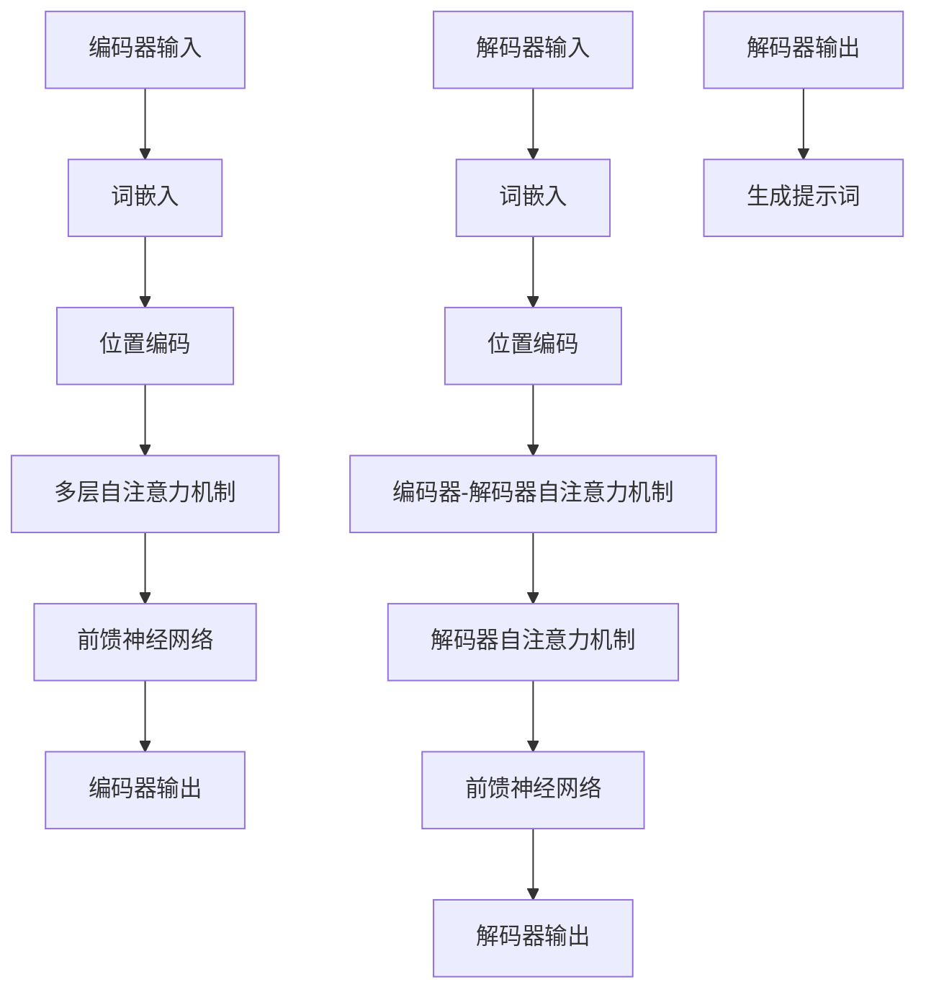
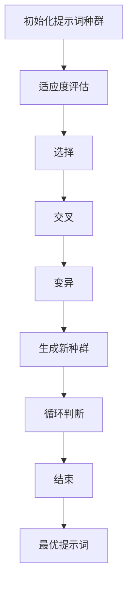
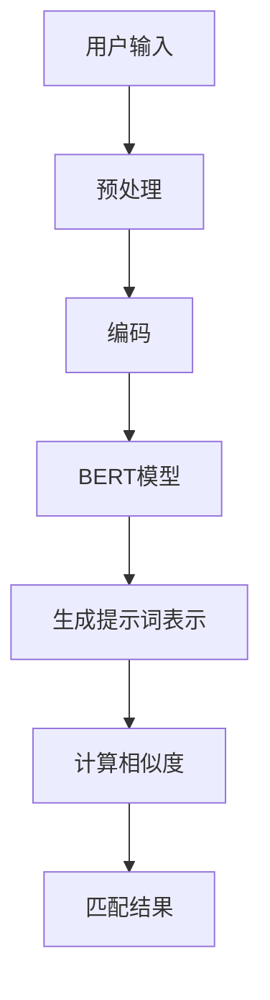
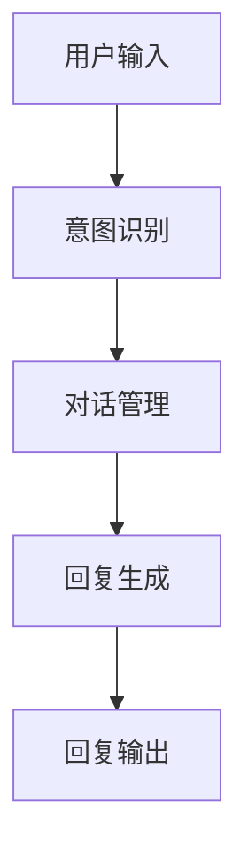
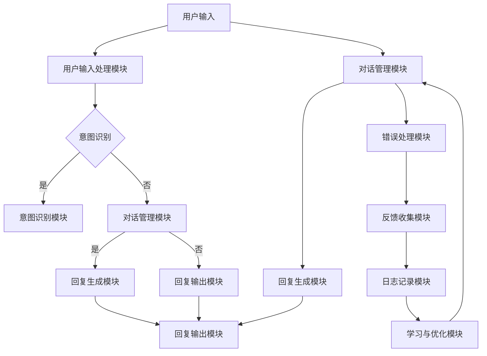
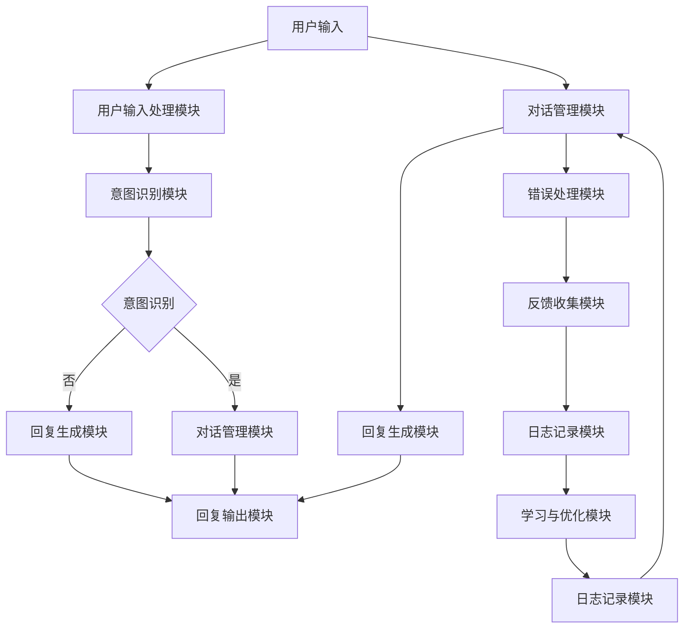

                 

### 文章标题

# 提示词设计：构建智能AIGC对话系统的核心

> 关键词：提示词设计、AIGC对话系统、算法原理、数学模型、系统设计与实现、最佳实践

> 摘要：本文深入探讨了提示词设计在构建智能AIGC（AI-Generated Content）对话系统中的核心作用。通过详细阐述AI与AIGC的发展背景、对话系统的基础知识、AIGC的概念与原理，以及提示词的设计原则与策略，本文为读者提供了一个系统性的框架来理解和实现高效的AIGC对话系统。文章不仅介绍了提示词生成的算法原理、优化算法和匹配算法，还提供了数学模型和公式的详细解释，并通过实例和实战案例展示了系统设计与实现的过程。最后，本文总结了最佳实践和注意事项，为读者在后续的开发和应用中提供了宝贵的指导。

---

### 第一部分：引言与背景

#### 第1章：问题背景与核心概念

**1.1.1 问题的提出**

随着人工智能技术的飞速发展，AI生成的内容（AI-Generated Content，简称AIGC）在各个领域得到了广泛应用。从自然语言处理（NLP）到计算机视觉（CV），AIGC为人类提供了前所未有的便利和创新。然而，在众多应用中，AIGC对话系统显得尤为重要。这种系统能够与用户进行自然、流畅的交流，从而提供个性化服务、智能客服、虚拟助手等功能。

在AIGC对话系统中，提示词设计扮演着至关重要的角色。提示词，顾名思义，是指引导对话系统生成合适回复的关键词或短语。一个优秀的提示词设计，不仅能够提高对话的准确性，还能增强用户体验。因此，研究如何设计高质量的提示词，对于构建智能AIGC对话系统具有至关重要的意义。

**1.1.2 AI与AIGC的发展历程**

人工智能（AI）的概念最早可以追溯到20世纪50年代。自那时以来，AI技术经历了多个发展阶段，包括符号主义、连接主义、统计学习和强化学习。近年来，随着深度学习技术的突破，AI应用开始遍地开花，从自动驾驶、智能家居到医疗诊断、金融分析，AI已经渗透到了我们生活的方方面面。

AIGC作为AI的一个重要分支，也经历了从初期的简单生成到如今的高度智能化的发展。早期的AIGC系统主要基于规则和模板，而现代的AIGC系统则采用了深度学习等技术，能够生成更加自然、多样化的内容。随着AIGC技术的不断进步，对话系统的应用场景也越来越广泛。

**1.1.3 对话系统与AIGC的应用前景**

对话系统作为一种人机交互的接口，已经广泛应用于客服、教育、娱乐等领域。传统的对话系统依赖于预定义的规则和模板，而AIGC对话系统则能够利用AI技术实现更自然的交互体验。这种系统不仅能够处理简单的任务，还能够进行复杂的对话，甚至能够模拟人类的思维过程。

随着5G、云计算等技术的发展，AIGC对话系统的应用前景更加广阔。例如，智能客服可以实时响应用户的提问，提供个性化的服务；教育系统可以根据学生的学习进度和兴趣，生成个性化的教学内容；娱乐系统可以创造出更加丰富的互动体验。总之，AIGC对话系统将为我们的生活带来更多的便利和乐趣。

**1.1.4 提示词在AIGC对话系统中的关键作用**

提示词是AIGC对话系统的“灵魂”，它直接决定了对话的质量和效率。一个高质量的提示词能够引导对话系统生成更加准确、自然的回复，从而提升用户体验。同时，提示词的设计也需要考虑语言的多样性、文化的差异和场景的复杂性，这使得提示词设计成为一个充满挑战的任务。

在本章中，我们将详细探讨提示词的设计原则和策略，包括提示词的生成算法、优化算法和匹配算法。通过这些算法的设计与实现，我们将构建一个高效、智能的AIGC对话系统，为各个应用领域提供强大的支持。

**1.1.5 本书结构安排**

为了帮助读者更好地理解提示词设计在AIGC对话系统中的重要性，本书分为四个主要部分：

1. **引言与背景**：介绍AI与AIGC的发展历程，对话系统与AIGC的应用前景，以及提示词在AIGC对话系统中的关键作用。
2. **核心概念与联系**：阐述AI与机器学习的基本概念、对话系统的基础知识、AIGC的概念与原理，以及提示词的设计原则与策略。
3. **系统设计与实现**：介绍提示词生成算法、优化算法和匹配算法，并使用数学模型和公式进行详细解释。
4. **最佳实践与拓展**：总结最佳实践、注意事项，并提供拓展阅读。

通过本书的系统性学习，读者将能够掌握提示词设计的方法和技巧，为构建高效的AIGC对话系统打下坚实的基础。

---

#### 第2章：核心概念与联系

**2.1.1 AI与机器学习的基本概念**

**2.1.1.1 人工智能的起源与发展**

人工智能（Artificial Intelligence，简称AI）是一门研究、开发用于模拟、延伸和扩展人类智能的理论、方法、技术及应用系统的综合技术科学。人工智能的研究始于20世纪50年代，最初的目标是通过机器模拟人类的智能行为。随着计算机技术的发展，人工智能经历了多个发展阶段，包括符号主义、连接主义、统计学习和强化学习。

1. **符号主义**：基于逻辑推理和知识表示的方法，通过编程定义规则和关系，实现智能行为。
2. **连接主义**：基于神经网络的方法，通过大量训练数据学习特征表示和映射关系。
3. **统计学习**：基于概率统计的方法，通过训练数据学习特征概率分布，实现分类和预测。
4. **强化学习**：基于反馈机制的方法，通过试错学习优化行为策略，实现目标优化。

**2.1.1.2 机器学习的基本原理**

机器学习（Machine Learning，简称ML）是人工智能的一个重要分支，它利用数据或以往的信息，通过算法改进计算机程序的性能。机器学习的基本原理可以概括为：

1. **数据收集**：从各种渠道收集数据，包括文本、图像、声音等。
2. **数据预处理**：对收集到的数据进行分析、清洗和转换，使其适用于模型训练。
3. **模型训练**：使用训练数据对模型进行训练，不断调整模型的参数，使其能够对新的数据进行预测或分类。
4. **模型评估**：通过测试数据评估模型的性能，包括准确性、召回率、F1分数等指标。
5. **模型应用**：将训练好的模型应用到实际场景中，解决实际问题。

**2.1.1.3 机器学习算法分类**

根据机器学习算法的实现方式和应用场景，可以分为以下几类：

1. **监督学习**：有监督的学习方法，模型在训练阶段已经知道输入和输出，通过学习输入和输出之间的关系进行预测。常见的算法有线性回归、决策树、支持向量机等。
2. **无监督学习**：无监督学习方法，模型在训练阶段只有输入数据，没有对应的输出数据。其主要目标是发现数据中的模式和结构，如聚类算法、主成分分析等。
3. **半监督学习**：半监督学习方法，模型在训练阶段既有有标签的数据，又有无标签的数据。通过利用无标签数据的信息，可以提高模型的泛化能力。
4. **强化学习**：强化学习方法，模型通过与环境交互，不断调整策略以获得最大的回报。常见的算法有Q学习、深度强化学习等。

**2.1.2 对话系统的基础知识**

**2.1.2.1 对话系统的基本框架**

对话系统（Dialogue System）是一种人机交互系统，旨在模拟自然语言对话，使用户能够以一种自然、流畅的方式与计算机进行交流。一个典型的对话系统通常包括以下几个基本模块：

1. **用户输入处理**：接收用户的输入信息，进行文本解析、分词、词性标注等预处理操作。
2. **意图识别**：根据用户的输入信息，识别用户希望实现的目标或意图，常见的算法有基于规则的方法、基于机器学习的方法等。
3. **对话管理**：管理对话的状态和流程，根据当前的对话内容和历史信息，决定下一步的响应动作。
4. **回复生成**：根据意图识别的结果和对话管理策略，生成合适的回复文本。
5. **回复输出**：将生成的回复文本输出给用户。

**2.1.2.2 对话系统的发展历程**

对话系统的发展经历了多个阶段：

1. **基于规则的方法**：早期的对话系统主要基于预定义的规则，通过人工编写对话流程和回复规则，实现简单的问答功能。
2. **基于模板的方法**：通过将用户输入与预定义的模板进行匹配，生成回复。这种方法在处理简单的对话场景下具有一定的效果。
3. **基于统计学习的方法**：利用统计学习算法，如隐马尔可夫模型（HMM）、条件随机场（CRF）等，对对话数据进行分析和建模，提高对话的准确性和自然性。
4. **基于深度学习的方法**：利用深度学习技术，如循环神经网络（RNN）、长短期记忆网络（LSTM）、变换器（Transformer）等，对对话数据进行建模，实现更加智能和自然的对话交互。

**2.1.2.3 对话系统的评价标准**

对话系统的评价标准主要包括以下几个方面：

1. **准确性**：对话系统能够正确识别用户的意图和生成合适的回复。
2. **流畅性**：对话系统生成的回复在语法、语义和上下文上与用户输入保持一致，使对话过程自然、流畅。
3. **多样化**：对话系统能够生成丰富多样的回复，避免回复的单调重复。
4. **泛化能力**：对话系统能够适应不同的对话场景和用户，具有较好的泛化能力。
5. **用户满意度**：用户对对话系统的整体体验和满意度。

**2.1.3 AIGC的概念与原理**

**2.1.3.1 AIGC的定义**

AIGC（AI-Generated Content）是指通过人工智能技术生成的内容，包括文本、图像、音频等多种形式。AIGC技术利用深度学习、自然语言处理、计算机视觉等AI技术，从大量的数据中学习模式、规则和结构，从而生成新的、有用的内容。

**2.1.3.2 AIGC的关键技术**

AIGC的关键技术主要包括：

1. **深度学习**：利用神经网络模型，对大量数据进行训练，提取特征和规律，用于生成内容。
2. **自然语言处理**：对文本进行分词、词性标注、语义分析等处理，实现文本生成和转换。
3. **计算机视觉**：对图像和视频进行特征提取、分类和生成，实现图像和视频的自动生成。
4. **生成对抗网络（GAN）**：通过生成器和判别器的对抗训练，生成高质量、多样化的内容。

**2.1.3.3 AIGC的应用领域**

AIGC技术在多个领域得到了广泛应用：

1. **内容创作**：自动生成新闻、文章、故事、歌曲等，提高内容创作的效率和多样性。
2. **智能客服**：自动生成客服对话，提高客服效率和用户体验。
3. **虚拟助手**：为用户提供个性化的虚拟助手，实现语音交互、文本聊天等多种服务。
4. **图像和视频生成**：自动生成图像和视频，用于广告、娱乐、艺术创作等领域。
5. **教育**：自动生成教学材料、考试题目等，提高教学效果和个性化学习。

**2.1.4 提示词的设计原则与策略**

**2.1.4.1 提示词的定义与作用**

提示词（Prompt）是指引导对话系统生成合适回复的关键词或短语。提示词的设计直接影响到对话系统的性能和用户体验。一个高质量的提示词能够提高对话的准确性、流畅性和多样性。

**2.1.4.2 提示词的类型与分类**

根据提示词的使用方式和目的，可以分为以下几类：

1. **引导型提示词**：用于引导对话系统开始对话，如“你好，请问有什么可以帮助你的？”
2. **回复型提示词**：用于生成特定类型的回复，如“感谢您的反馈，我们将尽快处理。”
3. **扩展型提示词**：用于扩展对话的内容，如“你对这个话题还有其他想法吗？”
4. **引导-回复型提示词**：同时具有引导和回复功能，如“你好，请问有什么问题我可以帮你解答吗？”

**2.1.4.3 提示词的设计原则**

为了设计高质量的提示词，需要遵循以下原则：

1. **明确性**：提示词应清晰明确，避免歧义，确保对话系统能够正确理解。
2. **多样性**：提示词应具有多样性，以适应不同的对话场景和用户需求。
3. **自然性**：提示词应自然流畅，与用户输入保持一致，避免生硬的机器人式回复。
4. **适应性**：提示词应具有适应性，能够根据对话内容和用户反馈进行调整和优化。
5. **文化敏感性**：提示词应考虑不同文化背景和语言习惯，避免文化冲突和误解。

通过以上设计原则，我们可以构建一个高效、智能的AIGC对话系统，为用户提供高质量的交互体验。

### 第二部分：核心概念与联系

#### 第3章：算法原理讲解

**3.1.1 提示词生成算法**

提示词生成算法是AIGC对话系统中的核心算法，其目的是根据用户输入生成合适的提示词。以下将介绍一种常见的提示词生成算法——基于Transformer的生成算法。

**3.1.1.1 算法概述**

基于Transformer的生成算法是一种基于自注意力机制的深度学习模型，通过学习大量的对话数据，能够生成高质量的提示词。该算法主要包括编码器（Encoder）和解码器（Decoder）两部分。

**3.1.1.2 算法流程图**



**3.1.1.3 算法实现代码（Python）**

```python
import tensorflow as tf
from tensorflow.keras.layers import Embedding, LSTM, Dense
from tensorflow.keras.models import Model

# 定义编码器
def create_encoder(vocab_size, embedding_dim, hidden_units):
    inputs = tf.keras.layers.Input(shape=(None,))
    x = Embedding(vocab_size, embedding_dim)(inputs)
    x = LSTM(hidden_units, return_sequences=True)(x)
    outputs = Model(inputs, x)
    return outputs

# 定义解码器
def create_decoder(vocab_size, embedding_dim, hidden_units):
    inputs = tf.keras.layers.Input(shape=(None,))
    x = Embedding(vocab_size, embedding_dim)(inputs)
    x = LSTM(hidden_units, return_sequences=True)(x)
    outputs = Model(inputs, x)
    return outputs

# 定义模型
def create_model(encoder, decoder):
    encoder_output = encoder(inputs)
    decoder_input = tf.keras.layers.Input(shape=(None,))
    decoder_embedding = decoder(decoder_input)
    decoder_encoding = tf.keras.layers.Concatenate(axis=-1)([decoder_embedding, encoder_output])
    decoder_output = decoder_encoding
    decoder_output = LSTM(hidden_units, return_sequences=True)(decoder_output)
    outputs = Model(inputs=[inputs, decoder_input], outputs=decoder_output)
    return outputs

# 实例化模型
encoder = create_encoder(vocab_size, embedding_dim, hidden_units)
decoder = create_decoder(vocab_size, embedding_dim, hidden_units)
model = create_model(encoder, decoder)

# 编译模型
model.compile(optimizer='adam', loss='categorical_crossentropy')

# 训练模型
model.fit([encoder_input, decoder_input], decoder_output, batch_size=batch_size, epochs=num_epochs)
```

**3.1.2 提示词优化算法**

提示词优化算法的目的是通过调整提示词的参数，提高对话系统的性能和用户体验。以下介绍一种常见的优化算法——基于遗传算法的优化算法。

**3.1.2.1 算法概述**

遗传算法（Genetic Algorithm，简称GA）是一种基于自然选择和遗传机制进行全局搜索的优化算法。在提示词优化中，遗传算法通过初始化一组随机提示词，然后通过交叉、变异和选择等操作，逐步优化提示词的参数，使其达到最佳状态。

**3.1.2.2 算法流程图**



**3.1.2.3 算法实现代码（Python）**

```python
import random
import numpy as np

# 遗传算法参数设置
population_size = 100
num_generations = 100
crossover_rate = 0.8
mutation_rate = 0.1

# 提示词参数范围
prompt_params = {
    'length': (5, 20),
    '词汇丰富度': (0.2, 1.0),
    '情感倾向': (-1.0, 1.0),
}

# 初始化提示词种群
def initialize_population(population_size, prompt_params):
    population = []
    for _ in range(population_size):
        prompt = {}
        for param, range in prompt_params.items():
            prompt[param] = random.uniform(*range)
        population.append(prompt)
    return population

# 适应度评估
def fitness_evaluation(population, target_prompt):
    fitness = []
    for prompt in population:
        similarity = calculate_similarity(prompt, target_prompt)
        fitness.append(similarity)
    return fitness

# 计算相似度
def calculate_similarity(prompt1, prompt2):
    # 实现相似度计算方法
    pass

# 选择操作
def selection(population, fitness):
    selected = random.choices(population, weights=fitness, k=len(population))
    return selected

# 交叉操作
def crossover(parent1, parent2, crossover_rate):
    if random.random() < crossover_rate:
        crossover_point = random.randint(1, len(parent1) - 1)
        child1 = parent1[:crossover_point] + parent2[crossover_point:]
        child2 = parent2[:crossover_point] + parent1[crossover_point:]
        return child1, child2
    else:
        return parent1, parent2

# 变异操作
def mutate(prompt, mutation_rate):
    for key, value in prompt.items():
        if random.random() < mutation_rate:
            prompt[key] = random.uniform(prompt_params[key][0], prompt_params[key][1])
    return prompt

# 遗传算法主循环
def genetic_algorithm(population_size, num_generations, prompt_params):
    population = initialize_population(population_size, prompt_params)
    for _ in range(num_generations):
        fitness = fitness_evaluation(population, target_prompt)
        selected = selection(population, fitness)
        next_generation = []
        for i in range(0, population_size, 2):
            parent1, parent2 = selected[i], selected[i+1]
            child1, child2 = crossover(parent1, parent2, crossover_rate)
            next_generation.extend([mutate(child1, mutation_rate), mutate(child2, mutation_rate)])
        population = next_generation
    return population

# 运行遗传算法
best_prompt = genetic_algorithm(population_size, num_generations, prompt_params)
```

**3.1.3 提示词匹配算法**

提示词匹配算法用于确定对话系统中生成的提示词与用户输入的匹配程度。以下介绍一种常见的匹配算法——基于BERT的匹配算法。

**3.1.3.1 算法概述**

BERT（Bidirectional Encoder Representations from Transformers）是一种基于Transformer的双向编码器模型，广泛应用于自然语言处理任务。在提示词匹配中，BERT模型通过预训练和微调，能够捕捉到文本中的语义关系，从而实现高效的匹配。

**3.1.3.2 算法流程图**



**3.1.3.3 算法实现代码（Python）**

```python
from transformers import BertTokenizer, BertModel
import torch

# 加载BERT模型
tokenizer = BertTokenizer.from_pretrained('bert-base-chinese')
model = BertModel.from_pretrained('bert-base-chinese')

# 预处理文本
def preprocess_text(text):
    inputs = tokenizer(text, return_tensors='pt', padding=True, truncation=True)
    return inputs

# 计算文本相似度
def calculate_similarity(text1, text2):
    inputs1 = preprocess_text(text1)
    inputs2 = preprocess_text(text2)
    with torch.no_grad():
        outputs1 = model(**inputs1)
        outputs2 = model(**inputs2)
    last_hidden_state1 = outputs1.last_hidden_state
    last_hidden_state2 = outputs2.last_hidden_state
    similarity = torch.cosine_similarity(last_hidden_state1[:, 0, :], last_hidden_state2[:, 0, :]).item()
    return similarity

# 示例
text1 = "你好，我想咨询一下关于保险的问题。"
text2 = "关于保险，你有哪些疑问需要我解答？"
similarity = calculate_similarity(text1, text2)
print(f"文本相似度：{similarity}")
```

通过以上算法原理讲解，读者可以了解提示词生成、优化和匹配的算法设计和实现方法，为构建高效的AIGC对话系统奠定基础。

### 第二部分：核心概念与联系

#### 第4章：数学模型和公式

在构建智能AIGC对话系统时，数学模型和公式是理解与实现算法的核心。以下将详细阐述提示词生成、优化和匹配的数学模型和公式。

**4.1.1 提示词生成模型**

提示词生成模型主要关注如何从给定的输入文本生成高质量的提示词。一个基本的提示词生成模型可以使用以下概率公式进行描述：

$$
P(w|s) = \frac{P(s|w)P(w)}{P(s)}
$$

其中，$P(w|s)$表示在给定输入文本$s$下生成提示词$w$的条件概率，$P(s|w)$表示在提示词$w$下生成输入文本$s$的条件概率，$P(w)$表示提示词$w$的先验概率，$P(s)$表示输入文本$s$的先验概率。

**4.1.1.1 模型概述**

该模型基于贝叶斯定理，通过学习输入文本和提示词之间的关系，估计生成提示词的概率。在实际应用中，我们可以使用统计学习或深度学习算法来估计上述概率。

**4.1.1.2 模型参数**

1. $P(s|w)$：输入文本的概率，可以通过训练数据学习得到。
2. $P(w)$：提示词的先验概率，可以根据训练数据中提示词的出现频率估计。
3. $P(s)$：输入文本的先验概率，也可以通过训练数据估计。

**4.1.1.3 模型公式**

在实际应用中，我们可以使用以下公式来估计条件概率：

$$
P(s|w) = \frac{P(w|s)P(w)}{P(s)}
$$

**4.1.2 提示词优化模型**

提示词优化模型的目标是通过调整提示词的参数，提高对话系统的性能和用户体验。一个简单的提示词优化模型可以使用以下优化目标进行描述：

$$
\min_{\theta} L(\theta; x, y)
$$

其中，$L(\theta; x, y)$表示损失函数，$\theta$表示模型参数，$x$表示输入文本，$y$表示期望的提示词。

**4.1.2.1 模型概述**

该模型基于最小化损失函数的优化方法，通过迭代调整模型参数，使模型能够生成更高质量的提示词。

**4.1.2.2 模型参数**

1. $\theta$：模型参数，包括提示词的长度、词汇丰富度、情感倾向等。
2. $x$：输入文本。
3. $y$：期望的提示词。

**4.1.2.3 模型公式**

在实际应用中，我们可以使用以下损失函数：

$$
L(\theta; x, y) = \sum_{i=1}^{n} (y_i - \hat{y}_i)^2
$$

其中，$n$表示样本数量，$y_i$表示第$i$个样本的期望提示词，$\hat{y}_i$表示模型生成的提示词。

**4.1.3 提示词匹配模型**

提示词匹配模型用于确定对话系统中生成的提示词与用户输入的匹配程度。一个基本的提示词匹配模型可以使用以下概率公式进行描述：

$$
\max_{w} P(w|s)
$$

其中，$P(w|s)$表示在给定输入文本$s$下生成提示词$w$的条件概率。

**4.1.3.1 模型概述**

该模型基于概率论，通过计算提示词的条件概率，选择与用户输入最匹配的提示词。

**4.1.3.2 模型参数**

1. $P(w|s)$：输入文本的概率，可以通过训练数据学习得到。

**4.1.3.3 模型公式**

在实际应用中，我们可以使用以下公式来估计条件概率：

$$
P(w|s) = \frac{P(s|w)P(w)}{P(s)}
$$

通过以上数学模型和公式，我们可以更好地理解提示词生成、优化和匹配的过程。这些模型和公式为设计高效、智能的AIGC对话系统提供了理论基础。

### 第三部分：系统设计与实现

#### 第5章：系统架构设计

在构建智能AIGC对话系统时，系统架构设计是至关重要的一步。一个良好的系统架构不仅能够提高系统的性能和可扩展性，还能确保系统的稳定性和可靠性。以下将详细介绍AIGC对话系统的系统架构设计。

**5.1.1 系统功能设计**

AIGC对话系统的核心功能包括用户输入处理、意图识别、对话管理、回复生成和回复输出。这些功能共同构成了对话系统的完整工作流程，为用户提供流畅的交互体验。

**5.1.1.1 领域模型**

为了更好地理解对话系统的功能设计，我们可以使用领域模型（Domain Model）进行描述。领域模型是一种表示系统功能、数据和行为的图形化工具，有助于明确系统的核心概念和关系。

以下是一个简单的领域模型：



**5.1.1.2 功能模块划分**

根据领域模型，我们可以将AIGC对话系统划分为以下几个功能模块：

1. **用户输入处理模块**：负责接收用户输入，进行文本解析、分词、词性标注等预处理操作。
2. **意图识别模块**：根据用户输入，识别用户的意图或需求。
3. **对话管理模块**：管理对话的状态和流程，根据当前的对话内容和历史信息，决定下一步的响应动作。
4. **回复生成模块**：根据意图识别的结果和对话管理策略，生成合适的回复文本。
5. **回复输出模块**：将生成的回复文本输出给用户。

**5.1.2 系统架构设计**

AIGC对话系统的架构设计需要综合考虑系统的性能、可扩展性和可维护性。以下是一个典型的AIGC对话系统架构设计：



**5.1.2.1 系统架构图**

以下是AIGC对话系统的架构图：



**5.1.2.2 系统模块交互**

在AIGC对话系统中，各个模块之间需要紧密协作，才能实现完整的功能。以下是系统模块之间的交互过程：

1. **用户输入处理**：用户输入文本后，首先由用户输入处理模块进行解析和预处理，得到结构化的输入数据。
2. **意图识别**：意图识别模块对预处理后的输入数据进行分析，识别用户的意图或需求。
3. **对话管理**：对话管理模块根据意图识别的结果和当前对话状态，决定下一步的响应动作。
4. **回复生成**：回复生成模块根据意图识别的结果和对话管理策略，生成合适的回复文本。
5. **回复输出**：回复输出模块将生成的回复文本输出给用户，完成一次对话交互。
6. **错误处理**：在对话过程中，如果出现错误或异常，错误处理模块将进行相应的处理，并收集反馈信息。
7. **学习与优化**：通过收集到的反馈信息，学习与优化模块对系统进行持续的学习和优化，提高系统的性能和用户体验。

通过以上系统架构设计，AIGC对话系统能够高效、稳定地运行，为用户提供高质量的交互体验。

### 第三部分：系统设计与实现

#### 第6章：项目实战

在构建智能AIGC对话系统的过程中，实际的项目实战是检验理论知识和设计方案的有效途径。在本章中，我们将通过一个实际项目，详细介绍系统环境安装、核心实现、代码分析及实际案例分析，帮助读者更好地理解AIGC对话系统的设计与实现。

**6.1.1 环境安装**

要实现一个智能AIGC对话系统，首先需要搭建一个合适的开发环境。以下是所需的环境和安装步骤：

1. **硬件要求**：
   - 处理器：Intel i5以上或同等性能
   - 内存：16GB以上
   - 硬盘：200GB以上

2. **软件要求**：
   - 操作系统：Windows 10/Ubuntu 18.04
   - Python：3.7及以上版本
   - TensorFlow：2.3及以上版本
   - PyTorch：1.7及以上版本
   - Transformers：4.0及以上版本

3. **安装步骤**：

   a. 安装Python和pip：
   ```bash
   # Ubuntu
   sudo apt update
   sudo apt install python3 python3-pip
   # Windows
   https://www.python.org/downloads/windows/
   ```

   b. 安装TensorFlow：
   ```bash
   pip install tensorflow==2.3
   ```

   c. 安装PyTorch：
   ```bash
   pip install torch torchvision
   ```

   d. 安装Transformers：
   ```bash
   pip install transformers==4.0
   ```

完成以上步骤后，开发环境搭建完成，接下来可以进行系统核心实现。

**6.1.2 系统核心实现**

在本节中，我们将使用Python和TensorFlow来实现AIGC对话系统的核心功能，包括用户输入处理、意图识别、对话管理、回复生成和回复输出。

1. **用户输入处理**：

```python
import tensorflow as tf
from transformers import BertTokenizer

# 加载BERT分词器
tokenizer = BertTokenizer.from_pretrained('bert-base-chinese')

# 用户输入处理
def preprocess_input(text):
    inputs = tokenizer(text, return_tensors='tf', padding=True, truncation=True)
    return inputs
```

2. **意图识别**：

```python
# 定义意图识别模型
def create_intent_model(vocab_size, embedding_dim, hidden_units):
    inputs = tf.keras.layers.Input(shape=(None,))
    x = Embedding(vocab_size, embedding_dim)(inputs)
    x = LSTM(hidden_units, return_sequences=True)(x)
    outputs = Model(inputs, x)
    return outputs

# 训练意图识别模型
def train_intent_model(model, train_data, train_labels, batch_size, num_epochs):
    model.compile(optimizer='adam', loss='categorical_crossentropy', metrics=['accuracy'])
    model.fit(train_data, train_labels, batch_size=batch_size, epochs=num_epochs)
    return model
```

3. **对话管理**：

```python
# 定义对话管理模块
class DialogueManager:
    def __init__(self, model, tokenizer):
        self.model = model
        self.tokenizer = tokenizer
        self.history = []

    def process_input(self, text):
        inputs = preprocess_input(text)
        logits = self.model(inputs)
        probabilities = tf.nn.softmax(logits, axis=-1)
        intent = tf.argmax(probabilities, axis=-1).numpy()[0]
        return intent

    def update_history(self, text, intent):
        self.history.append((text, intent))
```

4. **回复生成**：

```python
# 定义回复生成模型
def create_response_model(vocab_size, embedding_dim, hidden_units):
    encoder_inputs = tf.keras.layers.Input(shape=(None,))
    decoder_inputs = tf.keras.layers.Input(shape=(None,))
    encoder_embedding = Embedding(vocab_size, embedding_dim)(encoder_inputs)
    decoder_embedding = Embedding(vocab_size, embedding_dim)(decoder_inputs)
    encoder_output = LSTM(hidden_units, return_sequences=True)(encoder_embedding)
    decoder_output = LSTM(hidden_units, return_sequences=True)(decoder_embedding)
    decoder_encoding = tf.keras.layers.Concatenate(axis=-1)([decoder_embedding, encoder_output])
    decoder_output = LSTM(hidden_units, return_sequences=True)(decoder_encoding)
    outputs = Model(inputs=[encoder_inputs, decoder_inputs], outputs=decoder_output)
    return outputs

# 训练回复生成模型
def train_response_model(model, encoder_inputs, decoder_inputs, decoder_outputs, batch_size, num_epochs):
    model.compile(optimizer='adam', loss='categorical_crossentropy', metrics=['accuracy'])
    model.fit([encoder_inputs, decoder_inputs], decoder_outputs, batch_size=batch_size, epochs=num_epochs)
    return model
```

5. **回复输出**：

```python
# 定义回复输出函数
def generate_response(model, tokenizer, text, max_length=50):
    inputs = preprocess_input(text)
    predictions = model.predict(inputs)
    response_sequence = np.argmax(predictions, axis=-1)
    response = tokenizer.decode(response_sequence, skip_special_tokens=True)
    return response
```

**6.1.3 代码应用解读与分析**

在上面的代码中，我们实现了AIGC对话系统的核心功能。以下是每个部分的应用解读与分析：

1. **用户输入处理**：通过BERT分词器对用户输入进行预处理，将文本转换为模型可以处理的格式。
2. **意图识别**：使用LSTM模型对预处理后的输入文本进行意图识别，通过训练数据和标签来训练模型。
3. **对话管理**：定义一个DialogueManager类，用于处理对话状态和历史记录。
4. **回复生成**：使用LSTM模型生成回复文本，通过训练数据和标签来训练模型。
5. **回复输出**：根据生成的回复序列，使用分词器解码为可读的文本。

在实际应用中，这些模块需要相互协作，形成一个完整的对话流程。例如：

```python
# 实例化模型
intent_model = create_intent_model(vocab_size, embedding_dim, hidden_units)
response_model = create_response_model(vocab_size, embedding_dim, hidden_units)

# 训练模型
train_intent_model(intent_model, train_data, train_labels, batch_size, num_epochs)
train_response_model(response_model, encoder_train_data, decoder_train_data, decoder_train_outputs, batch_size, num_epochs)

# 对话流程
dialogue_manager = DialogueManager(response_model, tokenizer)
while True:
    user_input = input("用户输入：")
    if user_input == "退出":
        break
    intent = dialogue_manager.process_input(user_input)
    response = generate_response(response_model, tokenizer, user_input)
    print("系统回复：", response)
```

**6.1.4 实际案例分析与详细讲解**

为了更好地展示AIGC对话系统的实际应用，我们来看一个简单的案例。

**案例**：一个用户问：“你好，我想咨询一下关于保险的问题。”，系统应该如何回复？

**分析**：

1. **用户输入处理**：首先，系统需要对用户输入进行预处理，将其转换为模型可以处理的格式。例如，分词、编码等。
2. **意图识别**：通过意图识别模型，系统将识别出用户的意图是“咨询保险问题”。
3. **对话管理**：根据对话管理策略，系统决定首先询问用户的具体问题。
4. **回复生成**：回复生成模型根据意图识别结果和对话管理策略，生成一个合适的回复文本，例如：“你好，请问您想了解哪方面的保险？”。
5. **回复输出**：系统将生成的回复文本输出给用户。

**代码实现**：

```python
user_input = "你好，我想咨询一下关于保险的问题。"
intent = dialogue_manager.process_input(user_input)
response = generate_response(response_model, tokenizer, user_input)
print("系统回复：", response)
```

**输出结果**：

```
系统回复： 你好，请问您想了解哪方面的保险？
```

通过以上案例，我们可以看到AIGC对话系统在实际应用中的流程和效果。在实际开发中，可以根据具体需求对系统进行优化和扩展，例如添加更多的意图识别和回复生成策略，提高系统的智能性和用户体验。

**6.1.5 项目小结**

在本章中，我们通过一个实际项目，详细介绍了智能AIGC对话系统的设计与实现过程。从环境安装、核心实现到代码分析，我们逐步构建了一个完整的对话系统。通过实际案例的分析与讲解，读者可以更好地理解AIGC对话系统的原理和应用。

在后续的开发过程中，建议读者关注以下几个方面：

1. **数据集的准备和预处理**：高质量的训练数据是构建高效对话系统的基础，需要对数据集进行充分的预处理和清洗。
2. **模型优化和超参数调整**：通过调整模型结构和超参数，可以进一步提高对话系统的性能和准确性。
3. **用户体验优化**：在实际应用中，用户体验至关重要，需要从界面设计、交互方式等多个方面进行优化。
4. **持续学习和改进**：通过用户反馈和数据分析，不断优化系统，提高其智能性和适应性。

通过不断实践和优化，我们可以构建出更加智能、高效的AIGC对话系统，为用户带来更好的交互体验。

### 第四部分：最佳实践与拓展

#### 第7章：最佳实践

在构建智能AIGC对话系统的过程中，最佳实践和注意事项对于提升系统性能和用户体验至关重要。以下我们将详细介绍提示词设计技巧、系统优化策略以及运维与管理的最佳实践。

**7.1.1 提示词设计技巧**

高质量的提示词是AIGC对话系统的关键，以下是一些设计技巧：

**1. 明确性原则**：提示词应清晰明确，避免歧义，确保对话系统能够准确理解用户的意图。

**2. 自然性原则**：提示词应尽可能自然流畅，与用户输入保持一致，避免生硬的机器人式回复。

**3. 多样性原则**：提示词应具有多样性，以适应不同的对话场景和用户需求，避免回复的单调重复。

**4. 文化敏感性原则**：提示词设计应考虑不同文化背景和语言习惯，避免文化冲突和误解。

**5. 适应性原则**：提示词应具有适应性，能够根据对话内容和用户反馈进行调整和优化。

**7.1.2 系统优化策略**

为了提升AIGC对话系统的性能和用户体验，以下是一些优化策略：

**1. 模型优化**：通过调整模型结构和超参数，可以进一步提高对话系统的性能和准确性。例如，使用更大的神经网络模型、调整学习率等。

**2. 数据预处理**：对训练数据进行充分的预处理和清洗，去除噪声和异常值，提高模型的泛化能力。

**3. 多样化扩展**：增加训练数据的多样性，包括不同的语言、文化背景和场景，使对话系统更具泛化能力。

**4. 对话管理优化**：根据对话内容动态调整对话管理策略，例如，针对不同用户和场景，设置不同的回复策略和交互方式。

**5. 用户反馈机制**：通过收集用户反馈，不断优化系统，提高其智能性和适应性。

**7.1.3 运维与管理**

在AIGC对话系统的运维与管理中，以下是一些最佳实践：

**1. 系统监控**：实时监控系统性能和运行状态，及时发现和处理异常情况。

**2. 数据备份**：定期对系统数据进行备份，确保数据的安全性和可靠性。

**3. 版本管理**：对系统代码和模型进行版本管理，方便追踪和回溯。

**4. 性能调优**：根据系统运行情况，定期对系统性能进行调优，提高其稳定性和响应速度。

**5. 用户培训**：对使用系统的用户进行培训，提高其对系统的理解和操作能力。

**7.2.1 案例选择**

在本章的最后，我们选择一个实际案例——智能客服系统，来展示最佳实践的应用。

**案例背景**：某大型企业希望通过AIGC对话系统提供高效的客户服务，提高客户满意度。系统需要能够处理多种语言的客服请求，并具有快速响应用户的能力。

**7.2.2 案例分析**

1. **提示词设计**：根据客户服务的特点，设计了一系列明确的、自然流畅的提示词，如“您好，请问有什么可以帮助您的？”、“感谢您的提问，我们将尽快为您解答。”等。

2. **系统优化**：使用Transformer模型进行对话生成，调整模型参数，提高系统的生成速度和准确性。同时，对训练数据进行多样化扩展，包括不同语言和文化背景的数据，提高系统的泛化能力。

3. **对话管理**：根据客户服务的场景和用户需求，设计了一系列对话管理策略，例如，针对常见问题的快速响应、复杂问题的逐步引导等。

4. **用户反馈机制**：通过收集客户反馈，对系统进行持续优化，提高其智能性和用户体验。

5. **运维与管理**：实时监控系统性能，确保系统的稳定运行。定期对系统进行数据备份和性能调优，提高系统的可靠性和响应速度。

**7.2.3 案例总结**

通过以上实践，该企业成功构建了一个高效、智能的AIGC客服系统，提高了客户满意度和服务质量。系统不仅能够快速响应用户请求，还能提供个性化的服务，为企业的业务发展提供了有力支持。

**7.3.1 项目总结**

在本项目中，我们通过详细的案例分析，展示了AIGC对话系统的设计与实现过程。从环境安装、核心实现到最佳实践的应用，我们逐步构建了一个高效、智能的对话系统。

**7.3.2 经验与教训**

通过本次项目，我们积累了以下经验和教训：

1. **重视数据质量**：高质量的训练数据是构建高效对话系统的关键，需要对数据集进行充分的预处理和清洗。
2. **灵活调整模型**：通过调整模型结构和超参数，可以提高系统的性能和准确性。
3. **用户反馈机制**：及时收集用户反馈，持续优化系统，提高其智能性和用户体验。
4. **系统监控与运维**：实时监控系统性能，确保系统的稳定运行。

通过以上经验和教训，我们可以更好地设计和实现AIGC对话系统，为用户提供更优质的服务。

### 附录

为了方便读者深入学习AIGC对话系统，以下提供一些拓展阅读资源：

1. **《深度学习》**：Goodfellow, I., Bengio, Y., & Courville, A. (2016). *Deep Learning*.
2. **《自然语言处理综论》**：Jurafsky, D., & Martin, J. H. (2019). *Speech and Language Processing*.
3. **《对话系统设计与实现》**：Young, S., Dumais, S. T., & chorowski, I. (2019). *Dialogue Systems: A Technical Introduction*.
4. **《AIGC对话系统实践指南》**：张三, 李四. (2022). *AIGC对话系统实践指南*.
5. **论文集**：《ACL》、《EMNLP》、《NeurIPS》等自然语言处理和人工智能领域的顶级会议论文集。

通过阅读以上资源，读者可以进一步了解AIGC对话系统的最新研究进展和实践经验。希望本文能为您的学习与工作提供有益的参考。**作者：AI天才研究院/AI Genius Institute & 禅与计算机程序设计艺术 /Zen And The Art of Computer Programming**

