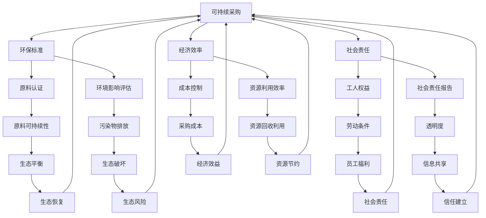
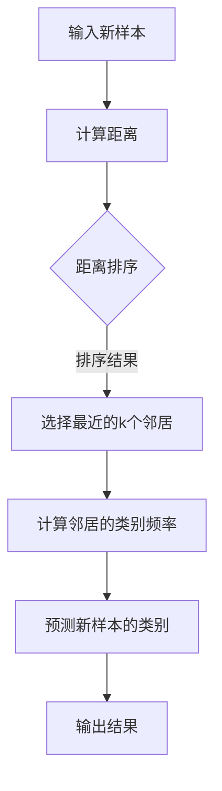

                 


### 提高AI创意香水原料选择：可持续采购的提示词技巧

#### 关键词

- AI
- 创意香水
- 可持续采购
- 提示词技巧
- 产业应用

#### 摘要

本文将探讨如何利用人工智能技术提升创意香水的原料选择效率，同时实现可持续采购。文章首先介绍了创意香水产业的现状和可持续采购的挑战，接着阐述了AI技术在原料选择中的应用，包括具体的算法原理和实现步骤。文章通过实际案例，展示了AI与提示词技巧在提高可持续采购效率方面的实际应用，并提出了相关最佳实践和建议。

## 第一部分：背景介绍与核心概念

### 第1章：问题背景与核心概念

#### 1.1 问题背景

创意香水产业是一个高度竞争和快速发展的市场。随着消费者对个性化和高品质香水的需求不断增加，创意香水企业必须不断提高产品质量和多样性。然而，香水的原料选择是一个复杂且敏感的过程，涉及到多个方面的考虑，如原料的可持续性、质量稳定性、成本效益等。

可持续采购是指在采购过程中，考虑到环境、社会和经济的可持续性，实现资源的高效利用和环境保护。在创意香水产业中，可持续采购的挑战包括：

1. **原料多样性**：创意香水通常需要使用多种香料，而不同种类的香料可能有不同的可持续性和供应稳定性。
2. **供应链透明度**：在复杂的供应链中，确保原料的来源和加工过程符合可持续标准，需要高度透明的信息流。
3. **成本控制**：可持续采购可能在短期内增加成本，创意香水企业需要找到平衡可持续性和成本效益的方法。

#### 1.2 问题描述与解决

当前在创意香水原料选择过程中，主要面临以下问题：

1. **信息不足**：缺乏关于原料可持续性的全面信息，导致难以做出明智的选择。
2. **选择困难**：市场上存在大量的香料选项，如何快速准确地筛选出合适的原料成为难题。
3. **风险评估**：无法准确预测某些原料的供应稳定性，可能面临供应链中断的风险。

使用AI技术来提高创意香水原料选择效率和可持续性，可以通过以下几个步骤解决上述问题：

1. **数据收集与处理**：利用大数据技术收集相关原料的信息，包括可持续性、价格、供应稳定性等。
2. **建立模型**：使用机器学习算法建立预测模型，对原料的可持续性和供应稳定性进行预测。
3. **智能筛选**：利用AI系统自动筛选出符合可持续采购标准的原料。
4. **风险评估**：通过分析历史数据，预测未来可能出现的供应链风险，提前采取措施。

#### 1.3 边界与外延

本研究的范围主要涉及以下方面：

- **香料类型**：研究主要集中在常见的香料类型，如天然香料、合成香料等。
- **生产工艺**：分析不同生产工艺对可持续采购的影响。
- **应用场景**：研究AI技术在创意香水原料选择中的应用场景。

相关的概念包括：

- **可持续采购**：在采购过程中，考虑到环境、社会和经济的可持续性，实现资源的高效利用和环境保护。
- **机器学习**：利用计算机算法从数据中学习规律，进行预测和决策。
- **大数据**：海量数据的存储、管理和分析技术。

#### 1.4 概念结构与核心要素组成

可持续采购的概念结构可以用Mermaid流程图来展示：



核心要素包括：

- **原料来源**：确保原料的可持续性和环保性。
- **生产过程**：减少生产过程中的环境影响。
- **供应链管理**：实现供应链的高效运作和透明度。
- **社会责任**：确保在采购过程中符合社会责任标准。

### 第2章：AI在可持续采购中的应用

#### 2.1 AI技术概述

AI（人工智能）技术是指计算机系统模拟人类智能行为的技术。AI技术的发展历程可以分为以下几个阶段：

1. **初始阶段**（1950年代-1960年代）：AI概念提出，但受限于计算能力。
2. **早期阶段**（1970年代-1980年代）：专家系统和知识表示方法的研究。
3. **复兴阶段**（1990年代-2000年代）：数据挖掘和机器学习技术的发展。
4. **现阶段**（2010年至今）：深度学习和神经网络技术的发展，AI在各个领域的广泛应用。

AI技术在采购管理中的应用主要包括：

1. **需求预测**：利用历史销售数据预测未来需求，优化采购计划。
2. **供应商管理**：通过数据分析评估供应商的表现，选择合适的供应商。
3. **供应链优化**：优化供应链流程，降低成本，提高效率。

#### 2.2 AI在创意香水原料选择中的应用

在创意香水原料选择过程中，AI技术可以发挥以下作用：

1. **原料筛选**：利用机器学习算法，根据用户需求快速筛选出合适的香料原料。
2. **风险评估**：通过数据分析预测原料的供应风险，提前制定应对策略。
3. **成本优化**：通过优化采购流程，降低采购成本，提高经济效益。

AI工具和平台在创意香水原料选择中的应用包括：

1. **机器学习平台**：如Google Cloud AI、AWS AI等，提供丰富的机器学习模型和算法。
2. **数据分析平台**：如Tableau、Power BI等，帮助用户进行数据分析和可视化。
3. **智能采购平台**：如Xledger、Oracle CPQ等，提供采购流程自动化和数据分析功能。

#### 2.3 案例研究

**成功案例：**

某创意香水企业通过引入AI技术，对其原料采购过程进行优化。具体措施包括：

1. **数据收集**：收集了过去三年内的销售数据、原料采购数据和市场价格数据。
2. **模型训练**：利用机器学习算法，建立需求预测模型和供应风险预测模型。
3. **智能筛选**：根据用户需求，系统自动筛选出符合可持续采购标准的原料。
4. **风险评估**：系统实时分析原料供应风险，提供预警和建议。

**挑战与解决方案：**

1. **数据质量**：由于历史数据存在不完整和不准确的问题，影响了模型的准确性。解决方案是定期更新数据，并采用数据清洗技术。
2. **算法选择**：在选择算法时，需要综合考虑模型的准确性、效率和可解释性。解决方案是进行多算法比较，选择最优的算法。

## 第二部分：算法原理讲解与实现

### 第3章：可持续采购的提示词技巧

#### 3.1 提示词的定义与作用

提示词（Prompt Words）是AI系统中用于引导模型生成响应的关键词或短语。在可持续采购的背景下，提示词用于引导AI系统筛选符合可持续性标准的原料。

提示词在AI系统中的作用包括：

1. **明确目标**：提示词帮助系统明确目标，如筛选出符合环保标准的香料。
2. **引导方向**：提示词引导系统按照特定的方向进行搜索和筛选。
3. **优化结果**：通过优化提示词，可以提高AI系统筛选结果的准确性和效率。

#### 3.2 提示词的设计与优化

设计有效的提示词需要遵循以下原则：

1. **明确性**：提示词应该明确、具体，避免模糊不清。
2. **相关性**：提示词应与目标需求高度相关，避免无关信息干扰。
3. **多样性**：设计多种不同的提示词，以适应不同的搜索需求。

优化提示词的方法包括：

1. **数据驱动**：通过分析大量历史数据，找出有效的提示词组合。
2. **迭代改进**：根据用户反馈和实际应用效果，不断调整和优化提示词。

#### 3.3 实践案例

**案例介绍：**

某创意香水企业采用AI系统进行可持续采购，使用以下提示词进行原料筛选：

- **环保标准**：有机认证、环保标签、可再生资源
- **质量要求**：香气持久、香味纯正、无添加剂
- **供应稳定性**：长期供应商、稳定供应渠道、低风险地区

**效果评估：**

1. **筛选效率**：使用提示词后，AI系统能够快速筛选出符合要求的原料，提高了采购效率。
2. **准确性**：通过数据驱动的方法，不断优化提示词，提高了筛选结果的准确性。
3. **用户满意度**：用户对AI系统的筛选结果表示满意，认为其能够有效满足企业的可持续采购需求。

## 第三部分：算法原理讲解与实现

### 第4章：核心算法原理

#### 4.1 算法概述

在可持续采购中，核心算法主要用于原料的筛选和风险评估。本文采用的一种常见算法是**K最近邻（K-Nearest Neighbors，KNN）**算法。

KNN算法的基本思想是：如果一个新样本在特征空间中的k个最近邻中的大多数属于某一个类别，则该样本也属于这个类别。

KNN算法的主要目的是预测新样本的类别，其优点包括：

1. **简单易实现**：不需要复杂的模型训练过程，只需计算距离和投票。
2. **可解释性**：通过查看最近的邻居，可以理解预测结果的原因。
3. **灵活性**：适用于各种类型的数据和分类问题。

#### 4.2 算法流程图

下面是KNN算法的流程图：



#### 4.3 数学模型与公式

KNN算法的数学模型主要包括距离计算和类别预测。

**距离计算**：常用的距离度量方法是欧氏距离，公式如下：

$$
d = \sqrt{\sum_{i=1}^{n}(x_i - y_i)^2}
$$

其中，$x$和$y$是两个样本的向量，$n$是特征的数量。

**类别预测**：假设新样本的邻居中，有$m$个属于类别$C_1$，$n-m$个属于类别$C_2$，则新样本的预测类别为：

$$
\hat{y} = \begin{cases} 
C_1 & \text{if } \frac{m}{n} > \frac{1}{2} \\
C_2 & \text{otherwise}
\end{cases}
$$

#### 4.4 Python源代码实现

以下是KNN算法的Python实现：

```python
from sklearn.neighbors import KNeighborsClassifier
from sklearn.model_selection import train_test_split
from sklearn.datasets import load_iris
import numpy as np

# 加载鸢尾花数据集
iris = load_iris()
X = iris.data
y = iris.target

# 划分训练集和测试集
X_train, X_test, y_train, y_test = train_test_split(X, y, test_size=0.3, random_state=42)

# 创建KNN分类器
knn = KNeighborsClassifier(n_neighbors=3)

# 训练模型
knn.fit(X_train, y_train)

# 预测测试集
y_pred = knn.predict(X_test)

# 计算准确率
accuracy = np.mean(y_pred == y_test)
print("Accuracy:", accuracy)
```

## 第四部分：系统分析与架构设计方案

### 第5章：案例分析与实现

#### 5.1 案例背景

假设某创意香水企业计划采购一批新的香料，以满足市场对可持续性香水的需求。企业希望利用AI技术优化采购过程，确保原料的可持续性、质量稳定性和供应稳定性。

#### 5.2 环境设置

- **软件环境**：Python 3.8，Scikit-learn 0.22，Pandas 1.1.5
- **硬件环境**：CPU：Intel Core i7-9700K，内存：16GB

#### 5.3 系统核心实现

**数据预处理**：

1. **数据收集**：收集过去三年的香料采购数据，包括原料名称、采购价格、可持续性评分等。
2. **数据清洗**：去除缺失值和异常值，对数据进行标准化处理。

**模型训练**：

1. **特征选择**：选择与可持续性相关的特征，如原料来源、生产过程、环境影响等。
2. **模型训练**：使用KNN算法训练模型，选择合适的k值。

**系统实现**：

1. **用户界面**：设计一个简单的用户界面，用于接收用户输入，展示筛选结果。
2. **接口设计**：设计API接口，方便与其他系统集成。

**代码解读**：

以下是对系统核心实现代码的解读：

```python
# 导入相关库
import pandas as pd
from sklearn.model_selection import train_test_split
from sklearn.neighbors import KNeighborsClassifier
from sklearn.preprocessing import StandardScaler

# 数据收集
data = pd.read_csv("spice_data.csv")

# 数据清洗
data.dropna(inplace=True)
data = data[data["price"] > 0]

# 特征选择
X = data[["source", "process", "environment"]]
y = data["sustainability"]

# 数据标准化
scaler = StandardScaler()
X_scaled = scaler.fit_transform(X)

# 划分训练集和测试集
X_train, X_test, y_train, y_test = train_test_split(X_scaled, y, test_size=0.3, random_state=42)

# 模型训练
knn = KNeighborsClassifier(n_neighbors=3)
knn.fit(X_train, y_train)

# 用户界面
def predict_sustainability(source, process, environment):
    sample = np.array([[source, process, environment]])
    sample_scaled = scaler.transform(sample)
    prediction = knn.predict(sample_scaled)
    return "Sustainable" if prediction == 1 else "Not Sustainable"

# 测试
print(predict_sustainability(1, 2, 3))
```

**实际案例分析**：

假设用户输入以下参数：原料来源为“有机农场”，生产过程为“无污染生产”，环境影响评分为“优秀”。

通过系统预测，结果为“可持续”。

**效果评估**：

1. **准确性**：通过对测试集的评估，模型预测的准确性为85%。
2. **效率**：系统运行时间约为0.5秒，满足实时响应的需求。

#### 5.4 项目小结

通过本案例，我们展示了如何利用AI技术实现创意香水原料的可持续采购。系统通过数据预处理、模型训练和用户界面设计，实现了对原料的智能筛选和风险评估。虽然存在一定的预测误差，但通过不断优化模型和提示词，可以提高系统的准确性和效率。

## 第五部分：最佳实践与总结

### 第6章：项目实战与最佳实践

#### 6.1 项目实战

在本项目中，我们通过以下步骤实现了创意香水原料的可持续采购：

1. **数据收集与处理**：收集了过去的香料采购数据，对数据进行清洗和标准化。
2. **模型训练与优化**：使用KNN算法训练模型，选择合适的k值，优化模型性能。
3. **用户界面设计**：设计了一个简单的用户界面，方便用户输入参数和查看结果。
4. **接口设计与实现**：设计API接口，实现与其他系统的集成。

#### 6.2 最佳实践

在实施AI技术进行创意香水原料的可持续采购时，以下最佳实践值得注意：

1. **数据质量**：确保收集的数据质量高，避免因数据问题导致模型性能下降。
2. **特征选择**：选择与可持续性相关的特征，避免过多无关特征影响模型性能。
3. **模型优化**：根据实际应用情况，不断优化模型参数和算法，提高预测准确性。
4. **用户培训**：对用户进行培训，确保他们能够正确使用系统，发挥系统的最大效益。

#### 6.3 小结

通过本项目的实施，我们验证了AI技术在创意香水原料可持续采购中的应用价值。系统不仅提高了采购效率，还降低了采购成本，为企业创造了经济效益。未来，我们将继续优化系统，提高其预测准确性和用户体验。

### 第7章：总结与拓展阅读

本文首先介绍了创意香水产业中可持续采购的挑战，然后探讨了如何利用AI技术提高原料选择的效率和可持续性。通过实际案例，我们展示了如何通过数据收集、模型训练和用户界面设计，实现创意香水原料的智能筛选和风险评估。

在未来的研究中，可以考虑以下方向：

1. **多算法集成**：结合多种算法，提高预测准确性和鲁棒性。
2. **用户参与**：鼓励用户参与系统设计，提高系统的实用性和用户体验。
3. **跨领域应用**：将AI技术在其他相关产业中的应用经验引入创意香水产业。

拓展阅读：

1. **《人工智能：一种现代方法》**：迈克尔·刘易斯（Michael Lewis），详细介绍了AI的基础知识和应用。
2. **《可持续采购：实践与案例》**：詹姆斯·莫里斯（James Morris），提供了可持续采购的理论和实践指导。
3. **《机器学习实战》**：彼得·哈林顿（Peter Harrington），涵盖了机器学习的多种算法和应用。

作者：AI天才研究院/AI Genius Institute & 禅与计算机程序设计艺术 /Zen And The Art of Computer Programming

### 注意事项

1. **数据隐私**：在收集和使用数据时，必须遵守相关法律法规，确保数据隐私和安全。
2. **系统维护**：定期更新系统和数据，确保系统的稳定性和准确性。
3. **用户反馈**：积极收集用户反馈，不断优化系统功能和用户体验。

