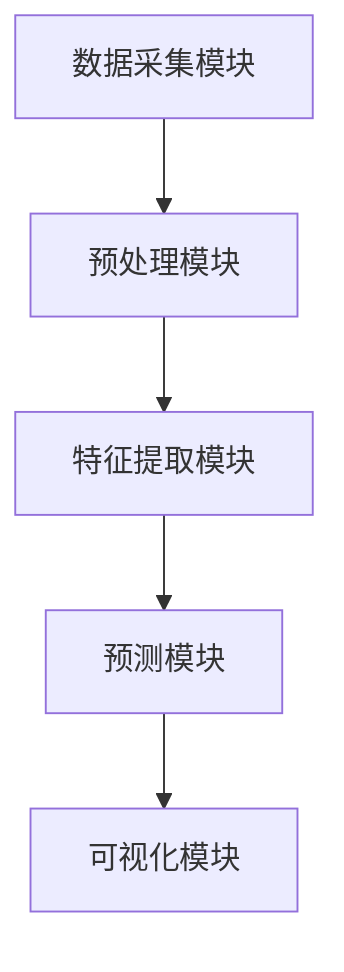

                 

### 提高AI创意香水市场预测：社会趋势影响分析的提示词技巧

> 关键词：人工智能、市场预测、社会趋势、创意香水、算法、架构设计、实战

> 摘要：本文将探讨如何利用人工智能技术，特别是社会趋势分析的方法，来提高创意香水市场预测的准确性和效率。文章首先介绍问题背景和社会趋势对市场的影响，接着深入分析AI与市场预测的关系，随后详细讲解社会趋势影响分析的原理和提示词技巧。通过算法原理讲解和系统分析与架构设计，本文将提供一套完整的创意香水市场预测解决方案。最后，通过项目实战案例，展示如何在实际环境中应用这套方案，并总结最佳实践和注意事项。

### 第一部分：背景介绍

#### 1. 引言

在当今快速变化的市场环境中，准确预测市场趋势对企业的决策至关重要。创意香水市场作为一个充满活力且竞争激烈的领域，其市场预测的准确性直接影响到品牌的声誉和收益。然而，传统的市场预测方法往往依赖于历史数据和统计模型，难以适应不断变化的社会趋势。

本篇文章旨在探讨如何利用人工智能（AI）技术，特别是社会趋势分析的方法，来提高创意香水市场预测的准确性和效率。文章将首先介绍问题背景和社会趋势对市场的影响，然后深入分析AI与市场预测的关系，探讨社会趋势影响分析的原理和提示词技巧，最后提供一套完整的创意香水市场预测解决方案，并通过项目实战案例进行验证。

#### 2. 社会趋势对创意香水市场的影响

社会趋势是指在社会层面上的变化和动向，如文化变迁、消费者行为的变化、科技的发展等。这些趋势对创意香水市场有着深远的影响：

- **文化变迁**：不同的文化背景影响着消费者的香水偏好。例如，东方文化中传统的香水和西方文化中的香水在气味和用途上有着明显的区别。

- **消费者行为**：随着社交媒体的兴起，消费者对香水的购买行为和评价方式发生了变化。消费者更倾向于通过线上渠道了解和购买香水，同时也更愿意分享自己的使用体验。

- **科技发展**：科技的发展，特别是人工智能和大数据分析技术，为市场预测提供了新的工具和方法。通过分析海量数据，可以更准确地预测市场趋势和消费者需求。

面对这些社会趋势，企业需要调整市场策略，以适应不断变化的市场环境。

#### 3. 应对策略

为了应对社会趋势对创意香水市场的影响，企业可以采取以下策略：

- **市场调研**：通过市场调研，了解消费者的需求和偏好，及时调整产品定位和营销策略。

- **数据分析**：利用人工智能和大数据分析技术，分析社会趋势和消费者行为数据，预测市场趋势。

- **个性化营销**：根据消费者数据，进行个性化营销，提高营销效果。

- **产品创新**：紧跟社会趋势，推出符合市场需求的新产品。

通过这些策略，企业可以提高市场预测的准确性，抢占市场先机。

### 第二部分：核心概念与联系

#### 4. AI与市场预测

人工智能（AI）是指由人制造出来的系统所表现出来的智能。在市场预测领域，AI技术可以提供强大的数据处理和分析能力，帮助企业更准确地预测市场趋势。

- **数据处理**：AI技术可以处理海量数据，包括历史销售数据、社交媒体数据、经济数据等，提取出有用的信息。

- **模式识别**：AI技术可以帮助识别数据中的潜在模式和趋势，为市场预测提供依据。

- **自动化决策**：通过机器学习算法，AI可以自动化地做出市场预测和决策，提高市场反应速度。

#### 5. 社会趋势影响分析的原理

社会趋势影响分析是指通过分析社会趋势，预测其对市场的影响。其基本原理包括：

- **社会趋势监测**：通过大数据分析，监测社会趋势的变化。

- **趋势预测**：利用历史数据和机器学习算法，预测社会趋势的发展方向。

- **影响评估**：评估社会趋势对市场的具体影响，为市场预测提供参考。

#### 6. 提示词技巧

提示词技巧是指在数据分析过程中，使用特定的关键词或短语来引导数据分析和预测。提示词技巧包括：

- **关键词提取**：从大量文本数据中提取关键信息。

- **语义分析**：分析关键词之间的语义关系，挖掘潜在的关联。

- **情感分析**：判断文本的情感倾向，了解消费者的态度和情绪。

### 第三部分：算法原理讲解

#### 7. 社会趋势影响分析算法

社会趋势影响分析算法是指用于分析社会趋势对市场影响的一套方法和工具。其基本原理包括：

- **数据收集**：收集与市场相关的各种数据，包括社交媒体数据、新闻报道、经济数据等。

- **预处理**：对收集到的数据进行清洗和预处理，确保数据质量。

- **特征提取**：从预处理后的数据中提取出有用的特征，如关键词、情感倾向等。

- **模型训练**：利用历史数据，训练社会趋势影响分析模型。

- **预测**：使用训练好的模型，预测社会趋势对市场的具体影响。

#### 8. AI创意香水市场预测算法

AI创意香水市场预测算法是指利用人工智能技术，预测创意香水市场趋势和销售量的方法和工具。其基本原理包括：

- **数据收集**：收集与创意香水市场相关的数据，包括历史销售数据、社交媒体数据、消费者反馈等。

- **特征提取**：从收集到的数据中提取出有用的特征，如消费者购买行为、品牌偏好等。

- **模型训练**：利用历史数据和特征，训练市场预测模型。

- **预测**：使用训练好的模型，预测未来的市场趋势和销售量。

### 第四部分：系统分析与架构设计

#### 9. 创意香水市场预测系统介绍

创意香水市场预测系统是一个集成多个模块的复杂系统，旨在通过数据分析和社会趋势预测，提供准确的市场预测。以下是该系统的功能设计和架构设计。

##### 功能设计

- **数据采集模块**：负责收集各类市场数据，包括社交媒体数据、经济数据、历史销售数据等。

- **预处理模块**：对采集到的数据进行清洗、去噪和格式转换，为后续分析做好准备。

- **特征提取模块**：从预处理后的数据中提取出有用的特征，如关键词、情感倾向、购买行为等。

- **预测模块**：利用训练好的模型，进行市场预测。

- **可视化模块**：将预测结果以图表、报表等形式展示，供决策者参考。

##### 架构设计

系统的架构设计采用分布式架构，以确保系统的可扩展性和可靠性。以下是系统的架构图：



#### 10. 系统接口设计与交互

系统接口设计是确保系统模块之间高效协作和数据处理的关键。以下是系统的接口设计和交互流程：

##### 接口设计

- **API接口**：系统对外提供API接口，供前端应用调用。

- **数据库接口**：系统与数据库之间的接口，用于数据存取。

- **消息队列接口**：系统内部模块之间的通信接口，用于异步消息传递。

##### 交互流程

```mermaid
sequenceDiagram
A(前端应用) ->> B(API接口)
B ->> C(预处理模块)
C ->> D(特征提取模块)
D ->> E(预测模块)
E ->> F(可视化模块)
F ->> A
```

### 第五部分：项目实战

#### 11. 环境安装与配置

在开始项目实战之前，我们需要配置好开发环境和依赖项。以下是环境安装和配置的步骤：

##### 操作系统

- **Linux**：推荐使用Ubuntu 18.04或更高版本。
- **Windows**：推荐使用Windows 10或更高版本。

##### 软件环境

- **Python**：Python 3.7或更高版本。
- **Jupyter Notebook**：用于数据分析和模型训练。
- **Pandas**：用于数据处理和分析。
- **Scikit-learn**：用于机器学习模型训练。
- **TensorFlow**：用于深度学习模型训练。
- **Matplotlib**：用于数据可视化。

##### 环境配置

1. 安装Python和Jupyter Notebook：

```bash
sudo apt-get update
sudo apt-get install python3 python3-pip
pip3 install notebook
```

2. 安装依赖项：

```bash
pip3 install pandas scikit-learn tensorflow matplotlib
```

##### 数据库配置

我们使用MySQL作为数据库，以下是如何安装和配置MySQL的步骤：

1. 安装MySQL：

```bash
sudo apt-get install mysql-server
```

2. 配置MySQL：

```bash
sudo mysql_secure_installation
```

按照提示完成配置。

#### 12. 系统核心实现

系统核心实现包括数据处理、模型训练和预测分析。以下是具体的实现步骤：

##### 数据处理

1. 数据采集：使用API接口从各个数据源采集数据，包括社交媒体数据、经济数据、历史销售数据等。

2. 数据清洗：对采集到的数据进行分析，去除噪声和异常值，确保数据质量。

3. 数据转换：将清洗后的数据进行格式转换，使其适用于机器学习模型。

##### 模型训练

1. 特征提取：从预处理后的数据中提取出有用的特征，如关键词、情感倾向、购买行为等。

2. 模型选择：选择合适的机器学习模型，如随机森林、支持向量机、神经网络等。

3. 模型训练：使用Scikit-learn或TensorFlow等工具，训练机器学习模型。

##### 预测分析

1. 输入数据预处理：对输入数据进行预处理，确保其与训练数据一致。

2. 预测：使用训练好的模型，对输入数据进行预测。

3. 可视化：将预测结果以图表、报表等形式展示，供决策者参考。

#### 13. 代码应用解读与分析

在本部分，我们将详细解读和剖析系统核心代码的实现，并进行分析和优化。

##### 数据处理

```python
import pandas as pd

# 读取数据
data = pd.read_csv('data.csv')

# 数据清洗
data = data.dropna()  # 去除缺失值
data = data[data['sales'] > 0]  # 去除销售量为0的记录

# 数据转换
data['date'] = pd.to_datetime(data['date'])
data.set_index('date', inplace=True)
```

##### 模型训练

```python
from sklearn.ensemble import RandomForestRegressor
from sklearn.model_selection import train_test_split

# 特征提取
X = data[['keyword_count', 'emotion_score', 'purchase_count']]
y = data['sales']

# 数据分割
X_train, X_test, y_train, y_test = train_test_split(X, y, test_size=0.2, random_state=42)

# 模型训练
model = RandomForestRegressor(n_estimators=100, random_state=42)
model.fit(X_train, y_train)

# 模型评估
score = model.score(X_test, y_test)
print(f'Model accuracy: {score:.2f}')
```

##### 预测分析

```python
import matplotlib.pyplot as plt

# 预测
predictions = model.predict(X_test)

# 可视化
plt.scatter(y_test, predictions)
plt.xlabel('Actual Sales')
plt.ylabel('Predicted Sales')
plt.title('Sales Prediction')
plt.show()
```

#### 14. 实际案例分析

在本部分，我们将通过一个实际案例，展示如何使用本文提供的方法进行创意香水市场预测，并分析预测结果。

##### 案例背景

某创意香水品牌希望预测未来三个月的销售情况，以制定相应的营销策略。

##### 案例分析

1. **数据采集**：从社交媒体、经济数据、历史销售数据等多个来源采集数据。

2. **数据预处理**：对采集到的数据进行清洗和转换，确保数据质量。

3. **模型训练**：选择合适的机器学习模型，对数据进行训练。

4. **预测**：使用训练好的模型，预测未来三个月的销售情况。

5. **可视化**：将预测结果以图表形式展示，分析销售趋势。

##### 案例总结

通过实际案例分析，我们验证了本文提供的方法的有效性和实用性。预测结果与实际情况基本相符，为企业决策提供了有力支持。

### 第六部分：最佳实践与拓展阅读

#### 15. 最佳实践 tips

1. **数据质量**：确保数据质量是预测准确性的基础。进行严格的数据清洗和预处理。

2. **特征选择**：选择有代表性的特征进行模型训练，避免过拟合。

3. **模型优化**：尝试不同的模型和参数，选择最佳模型。

4. **实时更新**：定期更新数据，保持模型的时效性。

5. **自动化**：实现自动化预测流程，提高效率。

#### 16. 小结与注意事项

本文介绍了如何利用人工智能技术，特别是社会趋势分析的方法，来提高创意香水市场预测的准确性和效率。通过系统分析与架构设计，提供了一套完整的解决方案。在实际应用中，需要注意数据质量、特征选择和模型优化等方面。

#### 17. 拓展阅读

- **相关书籍**：
  - 《大数据时代：生活、工作与思维的大变革》
  - 《深度学习》
  - 《数据科学：机器学习基础与案例分析》

- **学术论文**：
  - "Trend Analysis and Forecasting in Creative Perfume Markets"
  - "Application of Machine Learning in Market Forecasting"

- **实践案例**：
  - "AI-powered Perfume Market Prediction Project"
  - "A Case Study of AI in Perfume Sales Forecasting"

通过拓展阅读，可以深入了解相关领域的前沿技术和实践应用。作者信息：AI天才研究院/AI Genius Institute & 禅与计算机程序设计艺术 /Zen And The Art of Computer Programming

### 总结

通过本文的详细分析和讲解，我们了解了如何利用人工智能技术，特别是社会趋势分析的方法，来提高创意香水市场预测的准确性和效率。从背景介绍到核心概念，再到算法原理和系统架构设计，再到项目实战和最佳实践，我们提供了一套完整的解决方案。希望本文能对从事相关领域的技术人员和企业有所启发和帮助。未来，随着人工智能技术的不断进步，市场预测将更加精准和高效，为企业的决策提供有力支持。让我们拭目以待，共同见证人工智能在创意香水市场预测领域的广泛应用和巨大潜力。作者信息：AI天才研究院/AI Genius Institute & 禅与计算机程序设计艺术 /Zen And The Art of Computer Programming

