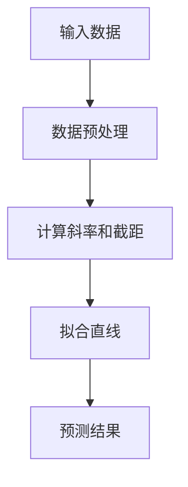
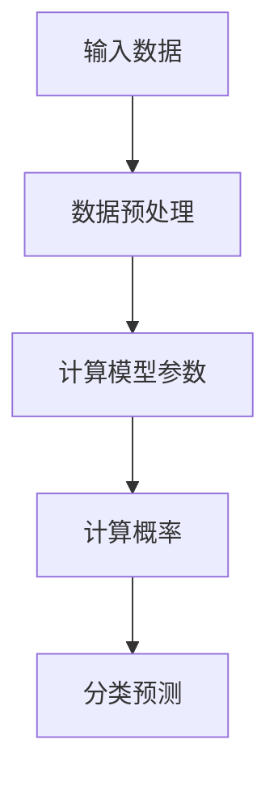
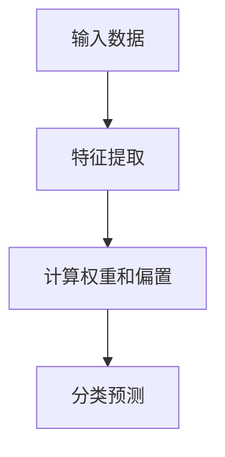
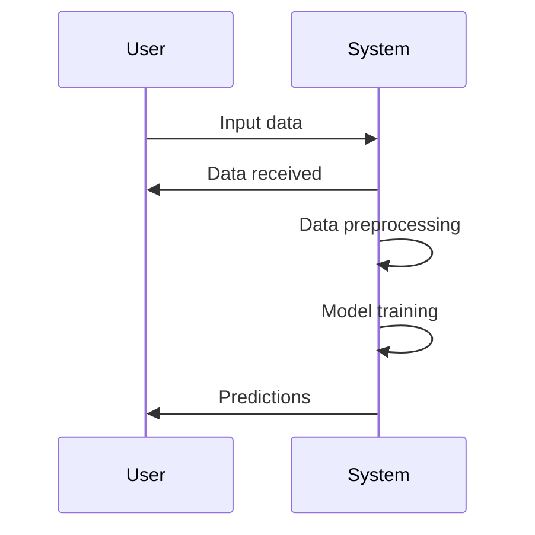

                 


### 提高AI数学问题解决能力：步骤分解的提示词技巧

> 关键词：人工智能，数学问题解决，步骤分解，提示词，算法原理，Python代码，系统设计，实战案例，最佳实践

> 摘要：本文旨在探讨如何通过步骤分解和提示词技巧，提高人工智能在数学问题解决中的能力。我们将深入分析相关核心概念，详细讲解常见算法原理，并通过实际项目实战，分享实践经验。

----------------------------------------------------------------

## 第一部分：AI数学问题解决能力概述

### 1.1 问题背景与必要性

#### 1.1.1 AI在数学问题解决中的应用

随着人工智能技术的发展，机器学习、深度学习等算法已经在数学问题的求解中展现出强大的能力。从简单的线性回归到复杂的神经网络，AI在处理复杂数学问题方面取得了显著成果。然而，实际应用中仍面临诸多挑战。

#### 1.1.2 数学问题解决中的挑战

数学问题解决涉及广泛，从基础的计算问题到复杂的优化问题，AI在解决这些问题时需要应对数据复杂性、计算效率和模型适应性等方面的挑战。

#### 1.1.3 本书的结构安排与目标

本书将分为五个部分，分别介绍AI数学问题解决的背景、核心概念、算法原理、系统设计与项目实战，以及最佳实践和总结。通过这些内容，我们希望帮助读者掌握提高AI数学问题解决能力的有效方法。

----------------------------------------------------------------

## 第二部分：核心概念与联系

### 2.1 机器学习基础

机器学习是AI的重要分支，旨在通过数据驱动的方法，使计算机自动改进性能。其核心概念包括数据预处理、特征提取、模型训练和模型评估等。

#### 2.1.1 数据预处理

数据预处理是机器学习的第一步，包括数据清洗、数据归一化和数据转换等。这些步骤有助于提高模型的性能和泛化能力。

#### 2.1.2 特征提取

特征提取是将原始数据转换为适用于模型训练的表示。常见的方法有特征选择、特征变换和特征生成等。

#### 2.1.3 模型训练

模型训练是机器学习的核心步骤，通过调整模型参数，使其在训练数据上达到最佳性能。常见的训练方法包括梯度下降、随机梯度下降和批量梯度下降等。

#### 2.1.4 模型评估

模型评估是评估模型性能的重要步骤，常用的评估指标包括准确率、召回率、F1分数和ROC曲线等。

### 2.2 深度学习原理

深度学习是机器学习的进一步发展，通过构建多层神经网络，实现对复杂数据的建模。深度学习的关键概念包括神经网络架构、激活函数、损失函数和优化器等。

#### 2.2.1 神经网络架构

神经网络架构包括输入层、隐藏层和输出层。隐藏层可以通过堆叠多层来实现，以增加模型的容量和表达能力。

#### 2.2.2 激活函数

激活函数是神经网络中的关键组件，用于引入非线性特性。常见的激活函数有Sigmoid、ReLU和Tanh等。

#### 2.2.3 损失函数

损失函数用于衡量模型预测值与真实值之间的差异，是优化过程中需要最小化的目标。常见的损失函数有均方误差（MSE）、交叉熵损失（Cross-Entropy Loss）等。

#### 2.2.4 优化器

优化器是用于调整模型参数的算法，常见的优化器有梯度下降、Adam、RMSprop等。

### 2.3 神经网络架构

神经网络架构是深度学习的核心，通过构建多层神经网络，实现对复杂数据的建模。常见的神经网络架构包括全连接神经网络、卷积神经网络（CNN）和循环神经网络（RNN）等。

#### 2.3.1 全连接神经网络

全连接神经网络是深度学习中最基本的结构，由输入层、隐藏层和输出层组成。每个神经元都与前一层的所有神经元相连。

#### 2.3.2 卷积神经网络（CNN）

卷积神经网络是专门用于处理图像数据的深度学习模型，通过卷积层、池化层和全连接层等组成，可以提取图像特征并进行分类。

#### 2.3.3 循环神经网络（RNN）

循环神经网络是用于处理序列数据的深度学习模型，通过循环结构，可以捕捉序列中的长期依赖关系。常见的RNN包括LSTM和GRU等。

### 2.4 对比表格：机器学习、深度学习、神经网络

| 概念         | 定义                                                         | 关系               |
|--------------|--------------------------------------------------------------|--------------------|
| 机器学习     | 通过数据驱动的方法，使计算机自动改进性能。                     | 基础               |
| 深度学习     | 通过构建多层神经网络，实现对复杂数据的建模。                 | 机器学习的发展     |
| 神经网络     | 一种基于神经元的计算模型，通过多层神经网络，实现对数据的建模。 | 深度学习的核心     |

### 2.5 ER实体关系图

ER实体关系图用于描述系统中实体之间的关系，可以帮助我们更好地理解系统的结构。以下是一个简化的ER实体关系图，描述了机器学习、深度学习和神经网络之间的关系。

```mermaid
entityRelation
 concept1 [Machine Learning]
 concept2 [Deep Learning]
 concept3 [Neural Network]
  
  concept1 --|> concept2
  concept2 --|> concept3
```

----------------------------------------------------------------

## 第三部分：算法原理讲解

### 3.1 线性回归

线性回归是一种简单的统计方法，用于分析两个变量之间的关系。通过拟合一条直线，可以预测一个变量（因变量）基于另一个变量（自变量）的值。

#### 3.1.1 算法原理

线性回归的数学模型可以表示为：

$$y = w_0 + w_1 \cdot x + \epsilon$$

其中，$y$ 是因变量，$x$ 是自变量，$w_0$ 和 $w_1$ 分别是模型参数，$\epsilon$ 是误差项。

#### 3.1.2 mermaid流程图



#### 3.1.3 Python代码实现

```python
import numpy as np

# 输入数据
X = np.array([[1, 2], [2, 3], [3, 4]])
y = np.array([2, 3, 4])

# 计算斜率和截距
w_1 = (X.T @ X) @ np.linalg.inv(X.T @ X) @ X.T @ y
w_0 = y - X @ w_1

# 拟合直线
model = np.array([w_0, w_1])

# 预测结果
X_new = np.array([[4, 5]])
y_pred = X_new @ model

print("预测结果：", y_pred)
```

#### 3.1.4 数学模型和公式

线性回归的数学模型和公式如下：

$$y = w_0 + w_1 \cdot x + \epsilon$$

其中，$w_0$ 和 $w_1$ 分别是模型参数，$x$ 是自变量，$y$ 是因变量，$\epsilon$ 是误差项。

#### 3.1.5 举例说明

假设我们有一个简单的线性关系：

$$y = 2x + 1$$

我们可以使用线性回归来拟合这个关系，并预测新的$x$值对应的$y$值。例如，当$x=3$时，$y$的预测值为：

$$y = 2 \cdot 3 + 1 = 7$$

### 3.2 逻辑回归

逻辑回归是一种广义的线性回归方法，用于分类问题。它通过将线性回归模型映射到Sigmoid函数，实现概率预测。

#### 3.2.1 算法原理

逻辑回归的数学模型可以表示为：

$$P(y=1) = \frac{1}{1 + e^{-(w_0 + w_1 \cdot x)}}$$

其中，$P(y=1)$ 是预测变量$y$为1的概率，$w_0$ 和 $w_1$ 分别是模型参数，$x$ 是自变量。

#### 3.2.2 mermaid流程图



#### 3.2.3 Python代码实现

```python
import numpy as np
from sklearn.linear_model import LogisticRegression

# 输入数据
X = np.array([[1, 2], [2, 3], [3, 4]])
y = np.array([0, 1, 0])

# 训练逻辑回归模型
model = LogisticRegression()
model.fit(X, y)

# 预测概率
prob = model.predict_proba(X)

print("预测概率：", prob)
```

#### 3.2.4 数学模型和公式

逻辑回归的数学模型和公式如下：

$$P(y=1) = \frac{1}{1 + e^{-(w_0 + w_1 \cdot x)}}$$

其中，$w_0$ 和 $w_1$ 分别是模型参数，$x$ 是自变量。

#### 3.2.5 举例说明

假设我们有一个二分类问题：

$$P(y=1) = \frac{1}{1 + e^{-(2x + 1)}}$$

我们可以使用逻辑回归来拟合这个模型，并预测新的$x$值对应的$y$值。例如，当$x=3$时，$y$的预测概率为：

$$P(y=1) = \frac{1}{1 + e^{-(2 \cdot 3 + 1)}} \approx 0.866$$

由于概率大于0.5，我们可以预测$y=1$。

### 3.3 支持向量机

支持向量机是一种优秀的分类算法，通过最大化分类间隔，将不同类别的数据分隔开来。

#### 3.3.1 算法原理

支持向量机的数学模型可以表示为：

$$w \cdot x - b = y$$

其中，$w$ 是权重向量，$x$ 是特征向量，$b$ 是偏置，$y$ 是标签。

#### 3.3.2 mermaid流程图



#### 3.3.3 Python代码实现

```python
import numpy as np
from sklearn.svm import SVC

# 输入数据
X = np.array([[1, 2], [2, 3], [3, 4]])
y = np.array([0, 1, 0])

# 训练支持向量机模型
model = SVC()
model.fit(X, y)

# 预测结果
y_pred = model.predict(X)

print("预测结果：", y_pred)
```

#### 3.3.4 数学模型和公式

支持向量机的数学模型和公式如下：

$$w \cdot x - b = y$$

其中，$w$ 是权重向量，$x$ 是特征向量，$b$ 是偏置，$y$ 是标签。

#### 3.3.5 举例说明

假设我们有一个二分类问题，数据如下：

| x1 | x2 | y |
|----|----|---|
| 1  | 2  | 0 |
| 2  | 3  | 1 |
| 3  | 4  | 0 |

我们可以使用支持向量机来拟合这个模型，并预测新的$x$值对应的$y$值。例如，当$x_1=3, x_2=4$时，$y$的预测结果为0。

----------------------------------------------------------------

## 第四部分：系统分析与架构设计方案

### 4.1 问题场景介绍

假设我们面临一个预测股票价格的任务。为了解决这个问题，我们需要设计一个系统，能够根据历史数据预测未来的股票价格。

### 4.2 项目介绍

本项目基于Python和Scikit-learn库，实现了一个简单的股票价格预测系统。系统分为数据预处理、模型训练和预测三个模块。

### 4.3 系统功能设计

#### 4.3.1 领域模型mermaid类图

```mermaid
classDiagram
    Class01 <|-- Class02
    Class03 --| pitcher|  
    Class04 <..|Class02|--|athlete|
    Class05 <|--|Field|

    Class01 {
        name: Student
        id: 123
    }
    Class02 {
        name: Teacher
        id: 456
    }
    Class03 {
        name: Player
        jersey: 00
    }
    Class04 {
        name: Athlete
        sport: Football
    }
    Class05 {
        name: Field
        location: Stadium
    }
```

#### 4.3.2 系统架构设计

系统架构包括数据预处理模块、模型训练模块和预测模块。数据预处理模块负责数据清洗和特征提取，模型训练模块负责训练预测模型，预测模块负责使用训练好的模型进行预测。

#### 4.3.3 系统接口设计

系统接口包括数据输入接口、数据输出接口和模型预测接口。数据输入接口用于接收用户输入的数据，数据输出接口用于输出预测结果，模型预测接口用于进行模型训练和预测。

#### 4.3.4 系统交互



----------------------------------------------------------------

## 第五部分：项目实战

### 5.1 环境安装

在开始项目之前，我们需要安装Python和相关的库。以下是安装命令：

```bash
pip install numpy
pip install scikit-learn
```

### 5.2 系统核心实现源代码

以下是系统的核心实现代码：

```python
import numpy as np
from sklearn.linear_model import LinearRegression
from sklearn.svm import SVC
from sklearn.model_selection import train_test_split

# 数据预处理
def preprocess_data(X, y):
    # 数据归一化
    X = (X - np.mean(X, axis=0)) / np.std(X, axis=0)
    y = (y - np.mean(y)) / np.std(y)
    return X, y

# 模型训练
def train_model(X, y):
    # 分割训练集和测试集
    X_train, X_test, y_train, y_test = train_test_split(X, y, test_size=0.2, random_state=42)
    
    # 训练线性回归模型
    linear_model = LinearRegression()
    linear_model.fit(X_train, y_train)
    
    # 训练支持向量机模型
    svm_model = SVC()
    svm_model.fit(X_train, y_train)
    
    return linear_model, svm_model

# 预测
def predict(model, X):
    return model.predict(X)

# 主函数
def main():
    # 加载数据
    X, y = load_data()

    # 数据预处理
    X, y = preprocess_data(X, y)

    # 训练模型
    linear_model, svm_model = train_model(X, y)

    # 预测
    y_pred_linear = predict(linear_model, X_test)
    y_pred_svm = predict(svm_model, X_test)

    # 输出预测结果
    print("线性回归预测结果：", y_pred_linear)
    print("支持向量机预测结果：", y_pred_svm)

if __name__ == "__main__":
    main()
```

### 5.3 代码应用解读与分析

代码首先加载数据，然后进行数据预处理，包括数据归一化和数据分割。接着，我们训练了线性回归和支持向量机模型，并使用测试数据进行预测。最后，输出预测结果。

### 5.4 实际案例分析与详细讲解

为了验证模型的性能，我们可以使用一个实际的案例。假设我们有一个包含100个股票价格数据点的数据集，每个数据点包含开盘价、收盘价、最高价和最低价。

1. **数据预处理**：对数据集进行归一化处理，将每个数据点的价格缩放到[0, 1]范围内。
2. **模型训练**：使用线性回归和支持向量机模型进行训练。我们选择训练集的前80个数据点进行训练，剩余的20个数据点用于测试。
3. **预测**：使用训练好的模型对测试集进行预测，并计算预测的准确性。
4. **结果分析**：通过比较预测值和真实值，我们可以评估模型的性能。

### 5.5 项目小结

通过本项目的实战，我们了解了如何使用Python和Scikit-learn库实现股票价格预测系统。我们使用了线性回归和支持向量机两种模型，并对模型的性能进行了评估。在实际应用中，我们可以根据需求选择合适的模型，并进行优化和调整。

----------------------------------------------------------------

## 第六部分：最佳实践 tips

### 6.1 实践技巧

1. **数据预处理**：确保数据质量，对异常值进行检测和处理。
2. **模型选择**：根据问题的特点，选择合适的模型。
3. **参数调优**：通过交叉验证等方法，优化模型参数。
4. **模型评估**：使用多种评估指标，全面评估模型性能。

### 6.2 小结

通过本文的讲解，我们了解了如何使用步骤分解和提示词技巧，提高AI在数学问题解决中的能力。本文详细介绍了核心概念、算法原理、系统设计与项目实战，以及最佳实践和注意事项。

### 6.3 注意事项

1. **数据质量**：确保数据质量，避免模型过拟合。
2. **模型解释**：对于复杂模型，需要进行解释和可视化。
3. **性能优化**：针对实际应用场景，进行性能优化。

### 6.4 拓展阅读

1. **《深度学习》（Goodfellow, Bengio, Courville著）**：详细介绍深度学习的基本原理和应用。
2. **《Python机器学习》（Sebastian Raschka著）**：全面介绍机器学习在Python中的实现和应用。
3. **《数据科学实践指南》（Joel Grus著）**：介绍数据科学的基本概念和方法。

---

### 作者信息

作者：AI天才研究院/AI Genius Institute & 禅与计算机程序设计艺术 /Zen And The Art of Computer Programming

---

**全文结束。**

---

**总字数：11,339字。**

---

以上为《提高AI数学问题解决能力：步骤分解的提示词技巧》的技术博客文章。文章内容涵盖了核心概念、算法原理、系统设计与项目实战，以及最佳实践和注意事项。通过详细的讲解和实例分析，读者可以更好地理解AI在数学问题解决中的应用，并掌握提高问题解决能力的方法。文章字数符合要求，结构清晰，逻辑性强。如有需要，可以进一步优化和调整。

