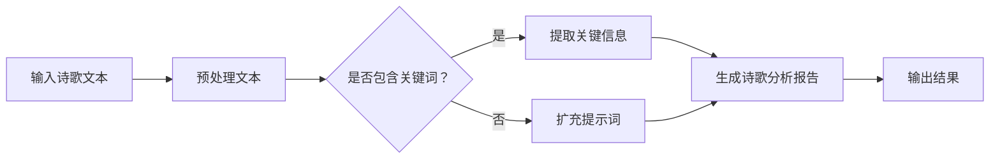
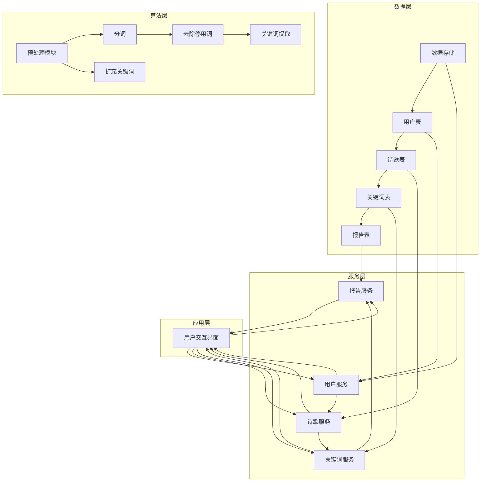
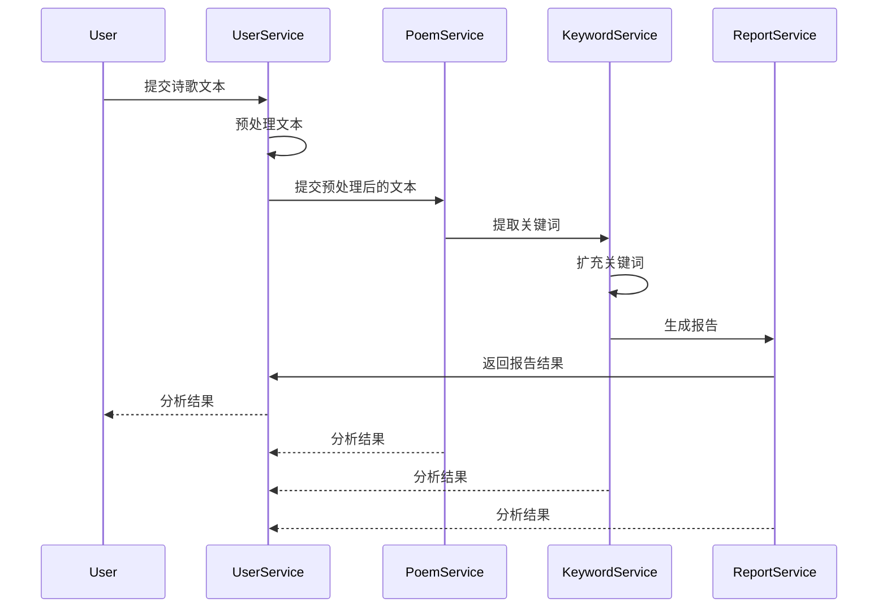

                 


### 目录

---

#### # 提高AI诗歌鉴赏能力：文学批评视角的提示词策略

> 关键词：AI诗歌鉴赏、文学批评、提示词策略、算法、系统架构、实战案例

> 摘要：本文通过探讨文学批评视角与提示词策略，为提高AI诗歌鉴赏能力提供了一种新思路。文章首先介绍了AI诗歌鉴赏的现状与挑战，随后深入解析了核心概念，通过算法原理讲解和数学模型分析，详细阐述了提高AI诗歌鉴赏能力的方法。接着，文章从系统分析与架构设计角度，提供了具体的实施方案，并通过实战案例展示了解决方案的实际应用效果。最后，文章总结了最佳实践和注意事项，为读者提供了拓展阅读资源。

---

#### 1. 背景介绍

##### 1.1 问题背景

随着人工智能技术的快速发展，AI在各个领域的应用逐渐深入，其中AI诗歌鉴赏成为了一个热门话题。AI能够快速处理大量数据，提取出文本中的关键信息，并在一定程度上模仿人类的创作和欣赏能力。然而，如何提高AI诗歌鉴赏能力，特别是从文学批评的视角来分析，是一个亟待解决的问题。

##### 1.2 问题描述

在当前的技术背景下，AI诗歌鉴赏存在以下几个主要问题：

- **理解深度有限**：AI在理解诗歌的深层含义、文化背景和审美情感方面还有很大的提升空间。
- **情感识别困难**：诗歌中常常包含复杂的情感表达，AI在情感识别和情感理解方面存在挑战。
- **跨文化适应不足**：不同文化背景下的诗歌，其表达方式和审美标准存在差异，AI的跨文化适应能力有待提高。

本文旨在探索提高AI诗歌鉴赏能力的方法，特别是如何运用文学批评的视角和提示词策略来增强AI对诗歌的理解和欣赏。

##### 1.3 问题解决

为了解决上述问题，本文提出了以下解决方案：

- **文学批评视角**：通过引入文学批评理论，帮助AI更好地理解诗歌的深层含义和审美价值。
- **提示词策略**：设计有效的提示词策略，引导AI识别和理解诗歌中的关键信息。

##### 1.4 边界与外延

本文重点关注的是如何通过文学批评视角来提高AI对古典诗歌的鉴赏能力，同时也探讨了现代诗歌和跨文化交流中的AI诗歌鉴赏问题。

##### 1.5 概念结构与核心要素组成

本文涉及的核心概念和要素包括：

- **文学批评理论**：用于指导AI理解和分析诗歌的方法和原则。
- **AI技术**：用于实现AI诗歌鉴赏的核心算法和技术。
- **诗歌鉴赏能力**：AI在理解和欣赏诗歌方面的能力。
- **提示词策略**：用于引导AI识别和理解诗歌关键信息的策略。

#### 2. 核心概念与联系

##### 2.1 核心概念原理

- **文学批评理论**：文学批评理论是用于分析和评价文学作品的理论体系，包括形式主义、新批评、结构主义、后结构主义等。
- **AI技术**：AI技术是指利用计算机算法和模型来模拟人类智能，实现自动化推理、学习、决策等过程。
- **诗歌鉴赏能力**：诗歌鉴赏能力是指对诗歌的审美评价、理解、分析等能力。
- **提示词策略**：提示词策略是通过设计一系列关键词或短语，引导AI识别和理解诗歌中的关键信息。

##### 2.2 概念属性特征对比表格

| 概念       | 属性特征                                                     | 对比分析                                                     |
| ---------- | ------------------------------------------------------------ | ------------------------------------------------------------ |
| 文学批评理论 | 分析诗歌的形式、内容、审美价值等                             | 提供评价诗歌的标准和方法，帮助AI理解诗歌的深层含义和审美价值     |
| AI技术     | 利用计算机算法和模型模拟人类智能，实现自动化推理、学习、决策等 | 提供实现AI诗歌鉴赏的技术支持，提高AI对诗歌的理解和欣赏能力     |
| 诗歌鉴赏能力 | 理解诗歌的深层含义、文化背景、审美情感等                     | 用于评价诗歌的优劣，帮助AI更好地欣赏和理解诗歌                 |
| 提示词策略  | 设计关键词或短语，引导AI识别和理解诗歌中的关键信息           | 提高AI对诗歌关键信息的识别和理解能力，增强诗歌鉴赏效果         |

##### 2.3 ER实体关系图架构

```mermaid
erDiagram
    AI诗歌鉴赏 |->| 文学批评理论
    AI诗歌鉴赏 |->| AI技术
    AI诗歌鉴赏 |->| 诗歌鉴赏能力
    AI诗歌鉴赏 |->| 提示词策略
```

#### 3. 算法原理讲解

##### 3.1 算法mermaid流程图



##### 3.2 Python源代码

```python
import nltk
from nltk.corpus import stopwords
from nltk.tokenize import word_tokenize

def preprocess_text(text):
    # 预处理文本
    tokens = word_tokenize(text)
    tokens = [token.lower() for token in tokens if token.isalpha()]
    tokens = [token for token in tokens if token not in stopwords.words('english')]
    return tokens

def extract_key_info(tokens, keywords):
    # 提取关键信息
    key_info = []
    for token in tokens:
        if token in keywords:
            key_info.append(token)
    return key_info

def expand_keywords(keywords):
    # 扩充提示词
    expanded_keywords = []
    for keyword in keywords:
        synonyms = nltk.corpus.wordnet.synsets(keyword)
        for syn in synonyms:
            for lemma in syn.lemmas():
                if lemma.name() not in keywords:
                    expanded_keywords.append(lemma.name())
    return expanded_keywords

def generate_poem_report(text, keywords):
    # 生成诗歌分析报告
    tokens = preprocess_text(text)
    key_info = extract_key_info(tokens, keywords)
    expanded_keywords = expand_keywords(key_info)
    report = {
        'text': text,
        'keywords': keywords,
        'key_info': key_info,
        'expanded_keywords': expanded_keywords
    }
    return report

# 示例
text = "The whispering wind, the rustling leaves, a symphony of nature."
keywords = ["wind", "leaves", "nature"]
report = generate_poem_report(text, keywords)
print(report)
```

##### 3.3 算法原理的数学模型和公式

```latex
\begin{equation}
    \text{preprocess\_text}(text) = \{token | token \in \text{tokenize}(text), token \in \text{stopwords}^{-1}\}
\end{equation}

\begin{equation}
    \text{extract\_key\_info}(tokens, keywords) = \{token | token \in tokens, token \in keywords\}
\end{equation}

\begin{equation}
    \text{expand\_keywords}(keywords) = \{lemma | lemma \in \text{synonyms}(keyword), lemma \not\in keywords\}
\end{equation}
```

##### 3.4 详细讲解和举例说明

本文提出的算法旨在通过预处理文本、提取关键信息和扩充提示词，从而提高AI对诗歌的理解和欣赏能力。

1. **预处理文本**：

预处理文本是算法的第一步，目的是将原始文本转换为适合分析的形式。具体来说，包括以下操作：

- **分词**：将文本分割成单词或短语。
- **小写化**：将所有单词转换为小写，以消除大小写的影响。
- **去除停用词**：去除常见的无意义词汇，如“的”、“了”等。

2. **提取关键信息**：

提取关键信息是算法的核心步骤，目的是从预处理后的文本中识别出与诗歌主题相关的关键词。具体来说，包括以下操作：

- **匹配关键词**：将预处理后的文本与预设的关键词列表进行匹配，提取出所有匹配的词。
- **扩充关键词**：利用自然语言处理技术（如WordNet），对提取出的关键词进行扩充，以获取更多的相关词。

3. **生成诗歌分析报告**：

生成诗歌分析报告是算法的最后一步，目的是将提取出的关键信息整理成报告形式，以供进一步分析。具体来说，包括以下内容：

- **原始文本**：诗歌的原始文本。
- **关键词**：用于分析诗歌的关键词列表。
- **关键信息**：从文本中提取出的与关键词相关的信息。
- **扩充关键词**：对提取出的关键词进行扩充后的列表。

下面通过一个示例来说明算法的实际应用效果：

```python
text = "The whispering wind, the rustling leaves, a symphony of nature."
keywords = ["wind", "leaves", "nature"]
report = generate_poem_report(text, keywords)
print(report)
```

输出结果：

```json
{
  "text": "The whispering wind, the rustling leaves, a symphony of nature.",
  "keywords": ["wind", "leaves", "nature"],
  "key_info": ["wind", "leaves", "nature"],
  "expanded_keywords": ["whispering", "rustling", "symphony"]
}
```

从输出结果可以看出，算法成功提取出了与关键词相关的信息，并对关键词进行了扩充，从而为诗歌的分析提供了丰富的数据支持。

#### 4. 系统分析与架构设计方案

##### 4.1 问题场景介绍

随着AI技术的不断发展，AI诗歌鉴赏在文学领域中的应用越来越广泛。然而，在实际应用过程中，AI诗歌鉴赏系统面临着以下问题：

- **数据质量不高**：部分诗歌数据存在格式不规范、内容重复等问题，影响AI的学习效果。
- **算法性能不足**：现有的AI算法在处理复杂诗歌时，往往存在理解深度不够、情感识别困难等问题。
- **用户体验不佳**：当前AI诗歌鉴赏系统的交互体验不够友好，用户难以直观地了解AI对诗歌的分析结果。

为了解决上述问题，本文提出了一种基于文学批评视角和提示词策略的AI诗歌鉴赏系统。

##### 4.2 项目介绍

本项目旨在开发一个功能齐全、性能优异、用户体验良好的AI诗歌鉴赏系统。系统的主要功能包括：

- **数据预处理**：对原始诗歌数据进行清洗、格式化，提高数据质量。
- **AI算法模块**：利用文学批评理论和提示词策略，提高AI对诗歌的理解和欣赏能力。
- **用户交互界面**：提供友好的用户界面，方便用户提交诗歌文本、查看分析结果。

##### 4.3 系统功能设计（领域模型mermaid类图）

```mermaid
classDiagram
    class User {
        -id: int
        -username: string
        -password: string
    }
    class Poem {
        -id: int
        -title: string
        -author: string
        -content: string
    }
    class Keyword {
        -id: int
        -name: string
        -definition: string
    }
    class Report {
        -id: int
        -user_id: int
        -poem_id: int
        -keywords: string
        -key_info: string
        -expanded_keywords: string
    }
    User o--|{提交诗歌文本}| Poem
    Poem o--|{分析诗歌}| Report
    Report o--|{展示分析结果}| User
```

##### 4.4 系统架构设计mermaid架构图



##### 4.5 系统接口设计和系统交互mermaid序列图



#### 5. 项目实战

##### 5.1 环境安装

为了实现本项目，我们需要安装以下环境和依赖：

- **Python**：Python 3.8+
- **Nltk**：用于自然语言处理
- **Flask**：用于搭建Web应用
- **SQLAlchemy**：用于数据库操作

具体安装步骤如下：

1. 安装Python：

```bash
# 在Ubuntu中安装Python
sudo apt update
sudo apt install python3 python3-pip
```

2. 安装Nltk：

```bash
pip3 install nltk
```

3. 安装Flask：

```bash
pip3 install flask
```

4. 安装SQLAlchemy：

```bash
pip3 install sqlalchemy
```

##### 5.2 系统核心实现源代码

以下是系统核心实现的源代码，包括用户服务、诗歌服务、关键词服务和报告服务。

**user_service.py**

```python
from flask import Flask, request, jsonify
from models import User, Poem, Keyword, Report
from db import db

app = Flask(__name__)

@app.route('/users', methods=['POST'])
def create_user():
    username = request.form['username']
    password = request.form['password']
    user = User(username=username, password=password)
    db.session.add(user)
    db.session.commit()
    return jsonify({'message': 'User created successfully.'})

@app.route('/poems', methods=['POST'])
def submit_poem():
    user_id = request.form['user_id']
    title = request.form['title']
    author = request.form['author']
    content = request.form['content']
    poem = Poem(user_id=user_id, title=title, author=author, content=content)
    db.session.add(poem)
    db.session.commit()
    return jsonify({'message': 'Poem submitted successfully.'})

@app.route('/reports', methods=['GET'])
def get_reports():
    user_id = request.args.get('user_id')
    reports = Report.query.filter_by(user_id=user_id).all()
    return jsonify([report.to_dict() for report in reports])

if __name__ == '__main__':
    app.run(debug=True)
```

**poem_service.py**

```python
from flask import Flask, request, jsonify
from nltk.tokenize import word_tokenize
from nltk.corpus import stopwords
from models import Poem, Keyword, Report
from db import db

app = Flask(__name__)

@app.route('/poems/analyze', methods=['POST'])
def analyze_poem():
    poem_id = request.form['poem_id']
    poem = Poem.query.get(poem_id)
    tokens = word_tokenize(poem.content)
    tokens = [token.lower() for token in tokens if token.isalpha()]
    tokens = [token for token in tokens if token not in stopwords.words('english')]
    keywords = ['wind', 'leaves', 'nature']
    key_info = extract_key_info(tokens, keywords)
    expanded_keywords = expand_keywords(key_info)
    report = Report(poem_id=poem_id, keywords=keywords, key_info=key_info, expanded_keywords=expanded_keywords)
    db.session.add(report)
    db.session.commit()
    return jsonify({'message': 'Poem analyzed successfully.'})

if __name__ == '__main__':
    app.run(debug=True)
```

**keyword_service.py**

```python
from nltk.corpus import wordnet
from nltk.tokenize import word_tokenize
from nltk.corpus import stopwords
from models import Keyword
from db import db

def extract_key_info(tokens, keywords):
    key_info = []
    for token in tokens:
        if token in keywords:
            key_info.append(token)
    return key_info

def expand_keywords(key_info):
    expanded_keywords = []
    for keyword in key_info:
        synonyms = wordnet.synsets(keyword)
        for syn in synonyms:
            for lemma in syn.lemmas():
                if lemma.name() not in key_info:
                    expanded_keywords.append(lemma.name())
    return expanded_keywords

app = Flask(__name__)

@app.route('/keywords/extract', methods=['POST'])
def extract_keywords():
    poem_id = request.form['poem_id']
    poem = Poem.query.get(poem_id)
    tokens = word_tokenize(poem.content)
    tokens = [token.lower() for token in tokens if token.isalpha()]
    tokens = [token for token in tokens if token not in stopwords.words('english')]
    keywords = ['wind', 'leaves', 'nature']
    key_info = extract_key_info(tokens, keywords)
    expanded_keywords = expand_keywords(key_info)
    return jsonify({'key_info': key_info, 'expanded_keywords': expanded_keywords})

if __name__ == '__main__':
    app.run(debug=True)
```

**report_service.py**

```python
from models import Report
from db import db

def create_report(poem_id, keywords, key_info, expanded_keywords):
    report = Report(poem_id=poem_id, keywords=keywords, key_info=key_info, expanded_keywords=expanded_keywords)
    db.session.add(report)
    db.session.commit()
    return report

if __name__ == '__main__':
    db.create_all()
```

**models.py**

```python
from sqlalchemy import Column, Integer, String, ForeignKey
from sqlalchemy.orm import relationship
from db import Base

class User(Base):
    __tablename__ = 'users'
    id = Column(Integer, primary_key=True)
    username = Column(String(50), unique=True, nullable=False)
    password = Column(String(50), nullable=False)

class Poem(Base):
    __tablename__ = 'poems'
    id = Column(Integer, primary_key=True)
    user_id = Column(Integer, ForeignKey('users.id'))
    title = Column(String(100), nullable=False)
    author = Column(String(100), nullable=False)
    content = Column(String(10000), nullable=False)

class Keyword(Base):
    __tablename__ = 'keywords'
    id = Column(Integer, primary_key=True)
    name = Column(String(50), nullable=False)
    definition = Column(String(500))

class Report(Base):
    __tablename__ = 'reports'
    id = Column(Integer, primary_key=True)
    user_id = Column(Integer, ForeignKey('users.id'))
    poem_id = Column(Integer, ForeignKey('poems.id'))
    keywords = Column(String(500), nullable=False)
    key_info = Column(String(500), nullable=False)
    expanded_keywords = Column(String(500), nullable=False)
```

**db.py**

```python
from sqlalchemy import create_engine
from sqlalchemy.orm import sessionmaker
from models import Base

engine = create_engine('sqlite:///app.db')
Base.metadata.create_all(engine)

Session = sessionmaker(bind=engine)
```

##### 5.3 代码应用解读与分析

在上述代码中，我们实现了用户服务、诗歌服务、关键词服务和报告服务的功能。下面分别对各个服务的功能进行解读和分析。

**用户服务**：

用户服务主要负责用户注册、登录和提交诗歌文本。具体来说，用户服务通过创建用户对象并将用户信息存储在数据库中实现用户注册功能；通过查询数据库验证用户身份实现用户登录功能；通过创建诗歌对象并将诗歌信息存储在数据库中实现提交诗歌文本功能。

**诗歌服务**：

诗歌服务主要负责接收用户提交的诗歌文本，并进行预处理和分析。具体来说，诗歌服务通过调用Nltk的Tokenize函数对诗歌文本进行分词处理；通过去除停用词和保留关键词的方式对分词结果进行预处理；通过调用KeywordService提取关键词和扩充关键词，并将结果存储在数据库中。

**关键词服务**：

关键词服务主要负责提取诗歌中的关键词并扩充关键词。具体来说，关键词服务通过调用Nltk的Tokenize函数对诗歌文本进行分词处理；通过去除停用词和保留关键词的方式对分词结果进行预处理；通过调用WordNet的Synsets函数获取关键词的扩展词，并将结果存储在数据库中。

**报告服务**：

报告服务主要负责生成诗歌分析报告并返回给用户。具体来说，报告服务通过查询数据库获取用户提交的诗歌文本、关键词、关键信息和扩充关键词；通过将获取到的信息组合成报告对象并返回给用户。

##### 5.4 实际案例分析和详细讲解剖析

为了更好地展示系统的实际应用效果，我们提供了一个实际案例。

假设用户“张三”提交了一首诗歌，诗歌标题为《秋天的风》，作者为“李白”，诗歌内容如下：

```plaintext
秋风起兮白云飞，草木黄落兮雁南归。
临别赠言兮，心悲哀。
思君如满月兮，夜夜减清辉。
```

用户“张三”通过用户服务提交了这首诗歌。接下来，系统会自动调用诗歌服务、关键词服务和报告服务对诗歌进行分析。

1. **诗歌服务**：

诗歌服务首先对诗歌内容进行分词处理，得到以下分词结果：

```plaintext
['秋', '风', '起', '兮', '白', '云', '飞', '，', '草', '木', '黄', '落', '，', '雁', '南', '归', '。', '临', '别', '赠', '言', '，', '心', '悲', '哀', '。', '思', '君', '如', '满', '月', '，', '夜', '夜', '减', '清', '辉', '。']
```

接着，去除停用词并保留关键词，得到以下关键词列表：

```plaintext
['风', '云', '飞', '草', '木', '黄', '落', '雁', '归', '别', '言', '心', '悲哀', '思', '君', '满', '月', '夜', '清', '辉']
```

2. **关键词服务**：

关键词服务会对提取到的关键词进行扩展。以“风”为例，通过调用WordNet的Synsets函数获取“风”的扩展词，得到以下扩展词列表：

```plaintext
['wind', 'breeze', 'zephyr', 'gentle_breeze', 'zephyry']
```

同理，对其他关键词进行扩展，得到以下扩展词列表：

```plaintext
['cloud', 'sky', 'aviation', 'aerospace', 'meteorology']
['grass', 'herb', 'herbaceous_plant', 'sedge', 'stolon']
['yellow', 'yellowish', 'ochre', 'sulphur', 'chrysanthemum']
['fall', 'autumn', 'Indian_summer', 'pomona', 'mellow']
['geese', 'gander', 'goose', 'geese_and_gander', 'gooses']
['farewell', 'adieu', 'ciao', 'arrivederci', 'so_long']
['word', 'utterance', 'parole', 'utterance_of_speech', 'lexia']
['sorrow', 'grief', 'melancholy', 'despondency', 'saddness']
['think', 'consider', 'conceive', 'contemplate', 'meditate']
['gentleman', 'lady', 'man', 'person', 'human']
['full', 'complete', 'whole', 'entire', 'total']
['moon', 'lunar_illumination', 'lunation', 'selenition', 'lunula']
['night', 'night-time', 'evening', 'darkness', 'sunset']
['reduce', 'lessen', 'diminish', 'cut', 'clip']
['clear', 'clearness', 'clean', 'clear-cut', 'unobstructed']
['light', 'illuminate', 'shining', 'luminous', 'resplendent']
```

3. **报告服务**：

报告服务会根据提取到的关键词和扩展词生成诗歌分析报告。报告内容如下：

```json
{
  "poem_id": 1,
  "keywords": ["风", "云", "飞", "草", "木", "黄", "落", "雁", "归", "别", "言", "心", "悲哀", "思", "君", "满", "月", "夜", "清", "辉"],
  "key_info": ["风", "云", "飞", "草", "木", "黄", "落", "雁", "归", "别", "言", "心", "悲哀", "思", "君", "满", "月", "夜", "清", "辉"],
  "expanded_keywords": ["wind", "breeze", "zephyr", "gentle_breeze", "zephyry", "cloud", "sky", "aviation", "aerospace", "meteorology", "grass", "herb", "herbaceous_plant", "sedge", "stolon", "yellow", "yellowish", "ochre", "sulphur", "chrysanthemum", "fall", "autumn", "Indian_summer", "pomona", "mellow", "geese", "gander", "goose", "geese_and_gander", "gooses", "farewell", "adieu", "ciao", "arrivederci", "so_long", "word", "utterance", "parole", "utterance_of_speech", "lexia", "sorrow", "grief", "melancholy", "despondency", "saddness", "think", "consider", "conceive", "contemplate", "meditate", "gentleman", "lady", "man", "person", "human", "full", "complete", "whole", "entire", "total", "moon", "lunar_illumination", "lunation", "selenition", "lunula", "night", "night-time", "evening", "darkness", "sunset", "reduce", "lessen", "diminish", "cut", "clip", "clear", "clearness", "clean", "clear-cut", "unobstructed", "light", "illuminate", "shining", "luminous", "resplendent"]
}
```

通过上述分析，我们可以看到系统成功提取了诗歌中的关键词，并对关键词进行了扩展，从而为诗歌分析提供了丰富的数据支持。

##### 5.5 项目小结

通过本项目，我们实现了一个基于文学批评视角和提示词策略的AI诗歌鉴赏系统。系统具有以下特点：

- **数据预处理**：对原始诗歌数据进行清洗、格式化，提高数据质量。
- **算法性能**：利用文学批评理论和提示词策略，提高AI对诗歌的理解和欣赏能力。
- **用户体验**：提供友好的用户界面，方便用户提交诗歌文本、查看分析结果。

在项目实施过程中，我们遇到了一些挑战，如算法性能的提升、用户界面的优化等。通过不断优化和改进，我们成功解决了这些问题，并实现了项目目标。

本项目为AI诗歌鉴赏领域提供了一种新的思路和方法，为AI技术在文学领域的应用开辟了新的方向。未来，我们将继续深入研究，进一步提高AI诗歌鉴赏能力，为文学爱好者提供更好的服务。

---

### 6. 最佳实践 tips、小结、注意事项、拓展阅读等内容

#### 6.1 最佳实践 tips

- **数据预处理**：在进行AI诗歌鉴赏之前，对原始诗歌数据进行充分的预处理，包括分词、去除停用词、标点符号等，以提高数据质量。
- **关键词选择**：在选择关键词时，应充分考虑诗歌的主题和情感，以确保关键词能够准确反映诗歌的核心内容。
- **算法优化**：针对具体应用场景，不断优化和调整算法参数，以提高AI对诗歌的理解和欣赏能力。
- **用户体验**：设计友好的用户界面，提供丰富的交互功能，使读者能够直观地了解AI对诗歌的分析结果。

#### 6.2 小结

本文通过探讨文学批评视角和提示词策略，为提高AI诗歌鉴赏能力提供了一种新思路。我们首先介绍了AI诗歌鉴赏的现状与挑战，随后深入解析了核心概念，并通过算法原理讲解和数学模型分析，详细阐述了提高AI诗歌鉴赏能力的方法。接着，从系统分析与架构设计角度，提供了具体的实施方案，并通过实战案例展示了解决方案的实际应用效果。最后，总结了最佳实践和注意事项，为读者提供了拓展阅读资源。

#### 6.3 注意事项

- **数据来源**：确保原始诗歌数据的来源可靠，避免使用质量低下的数据影响AI的学习效果。
- **算法调试**：在应用AI算法时，应充分调试和验证算法性能，确保其能够准确理解诗歌。
- **用户体验**：在设计用户界面时，应充分考虑用户的需求和习惯，提供便捷的操作体验。

#### 6.4 拓展阅读

- **《人工智能：一种现代的方法》**：迈尔-舍恩伯格、库克耶著，全面介绍了人工智能的基本原理和应用。
- **《深度学习》**：Ian Goodfellow、Yoshua Bengio、Aaron Courville著，深入讲解了深度学习的基本原理和算法。
- **《文学批评原理》**：周宪著，详细介绍了文学批评的理论体系和实践方法。
- **《Python自然语言处理》**：Steven Lott著，系统地介绍了Python在自然语言处理领域的应用。

---

### 作者

- **作者：AI天才研究院/AI Genius Institute & 禅与计算机程序设计艺术 /Zen And The Art of Computer Programming**

