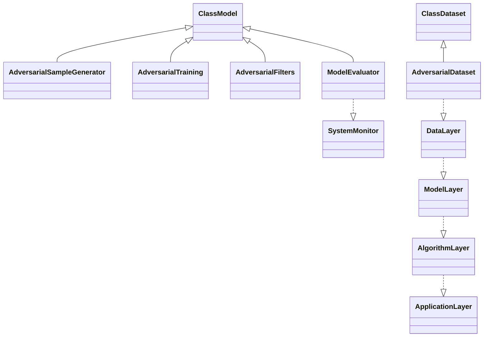

                 

### 文章标题

# 提高LLM应用的对抗样本防御能力

### 关键词

- 抗样本攻击
- 深度学习
- 语言模型
- 防御机制
- 算法优化

### 摘要

本文旨在探讨如何提高大型语言模型（LLM）在对抗样本攻击中的防御能力。我们将首先介绍对抗样本攻击的背景和基本概念，然后分析LLM在应用中的挑战，最后详细探讨多种防御机制和算法，以提供实际项目中的实施方案。本文将为从事AI研究和开发的专业人士提供宝贵的实践指导和思路。

---

### 引言

随着人工智能技术的快速发展，深度学习，尤其是大型语言模型（LLM）在自然语言处理（NLP）领域取得了显著成果。LLM能够通过学习大量的文本数据，生成高质量的文本、回答问题、翻译语言等。然而，LLM的广泛应用也带来了新的挑战：对抗样本攻击。

对抗样本攻击是一种通过轻微扰动输入数据，从而误导模型输出的攻击手段。这种攻击对深度学习模型，特别是对LLM具有极高的威胁，因为它们依赖于数据输入的精确性。对抗样本攻击的成功可能导致严重的安全问题，如虚假信息传播、隐私泄露等。

因此，提高LLM在对抗样本攻击中的防御能力显得尤为重要。本文将深入探讨这一主题，首先介绍对抗样本攻击的基本概念，然后分析LLM在应用中面临的挑战，最后介绍多种防御机制和算法，并探讨其在实际项目中的应用。

### 抗样本攻击的背景和基本概念

#### 抗样本攻击的定义

对抗样本攻击（Adversarial Attack）是指通过在输入数据中引入微小的、不可察觉的扰动，使得原本正确分类的样本被模型错误分类的一种攻击方法。这种攻击手段的核心思想是利用深度学习模型对输入数据的敏感度，通过对输入数据进行微小的调整，使模型在训练时无法识别或理解其真实含义。

#### 抗样本攻击的发展历程

对抗样本攻击的概念最早可以追溯到2013年，当时Ian Goodfellow等人提出了生成对抗网络（GAN）。随后，对抗样本攻击逐渐成为深度学习领域的研究热点。随着对抗样本攻击方法的不断发展和完善，攻击手段也变得更加复杂和隐蔽。代表性的攻击方法包括：

1. **输入扰动攻击**：通过在输入数据中添加噪声或微小变化，使得模型的输出发生偏差。
2. **模型特定攻击**：利用模型的特定弱点进行攻击，如过拟合、梯度消失等。
3. **网络层攻击**：通过攻击网络中的特定层或节点，破坏模型的内部结构。

#### 抗样本攻击的基本原理

对抗样本攻击的基本原理可以归纳为以下几点：

1. **输入敏感性**：深度学习模型对输入数据的微小变化非常敏感。即使是微小的噪声或扰动，也可能导致模型的输出发生巨大变化。
2. **优化过程**：对抗样本攻击利用了深度学习模型的优化过程。在训练过程中，攻击者通过不断调整输入数据，使得模型无法准确分类。
3. **不可察觉性**：对抗样本攻击的目的是在不引起人类察觉的情况下，误导模型的输出。这意味着对抗样本对于人类观察者来说是不可察觉的，但模型却会被误导。

#### 抗样本攻击的影响

对抗样本攻击对深度学习模型的影响是深远且广泛的。首先，它对模型的准确性和可靠性构成了威胁。即使模型的训练集和测试集表现良好，对抗样本攻击仍可能导致模型在现实应用中失效。

其次，对抗样本攻击可能引发一系列安全问题，如隐私泄露、虚假信息传播等。在自然语言处理领域，对抗样本攻击可能导致模型生成误导性的文本，从而对社会造成负面影响。

因此，研究并提高深度学习模型，特别是LLM在对抗样本攻击中的防御能力，是当前AI领域的重要任务。

### LLM在应用中的挑战

#### LLM的基本概念和应用场景

大型语言模型（LLM）是一种基于深度学习的自然语言处理模型，能够理解和生成自然语言文本。LLM通过学习大量的文本数据，具备强大的语言理解能力和文本生成能力。它们在诸多应用场景中表现出色，如文本分类、情感分析、机器翻译、问答系统等。

#### LLM的优势和局限性

LLM在自然语言处理领域具有显著的优势：

1. **强大的语言理解能力**：LLM能够处理复杂的自然语言结构和语义，从而生成更加自然和准确的文本。
2. **高效的文本生成**：LLM能够快速生成高质量的文本，大大提高了文本生成系统的效率。
3. **广泛的应用场景**：LLM在多个自然语言处理任务中表现出色，具有广泛的应用前景。

然而，LLM也面临一些局限性：

1. **对数据质量和数量的依赖**：LLM的性能高度依赖于训练数据的质量和数量。如果数据质量差或数据量不足，LLM的准确性可能大幅下降。
2. **对对抗样本的敏感性**：LLM对输入数据的微小变化非常敏感，这使得它们容易受到对抗样本攻击。
3. **隐私安全问题**：LLM在处理用户数据时，可能涉及到隐私泄露的风险。

#### LLM应用中的挑战

LLM在应用中面临诸多挑战：

1. **数据质量**：数据的质量直接影响LLM的性能。如果数据中存在噪声、错误或偏见，LLM的输出可能不准确或产生误导。
2. **数据量**：大型语言模型需要大量的训练数据来达到良好的性能。然而，获取大量高质量的数据可能非常困难。
3. **模型可解释性**：LLM通常被视为“黑箱”模型，其决策过程不透明。这使得在实际应用中，很难解释模型的决策原因和逻辑。
4. **对抗样本攻击**：对抗样本攻击可能导致LLM产生错误输出，从而影响系统的稳定性和安全性。

#### 对抗样本攻击对LLM应用的影响

对抗样本攻击对LLM应用的影响是显著的：

1. **误导性输出**：对抗样本攻击可能导致LLM生成误导性的文本，从而影响系统的稳定性和可靠性。
2. **隐私泄露**：对抗样本攻击可能通过轻微的输入扰动，泄露用户的敏感信息。
3. **安全性问题**：对抗样本攻击可能导致LLM在安全性要求较高的应用场景中失效，从而引发严重的安全问题。

因此，提高LLM在对抗样本攻击中的防御能力，是当前AI领域的重要研究课题。

### 对抗样本防御机制概述

对抗样本攻击的威胁使得研究防御机制变得尤为重要。本文将介绍几种常见的对抗样本防御机制，包括生成对抗网络（GAN）、对抗训练和Adversarial Filters等。这些防御机制通过不同的方法来增强模型的鲁棒性，以抵御对抗样本攻击。

#### 生成对抗网络（GAN）

生成对抗网络（GAN）是由Ian Goodfellow等人于2014年提出的，它由一个生成器和一个判别器组成。生成器的任务是生成与真实样本相似的数据，而判别器的任务是区分真实样本和生成样本。通过两个模型的对抗训练，生成器不断提高生成样本的质量，判别器则不断提高对真实样本和生成样本的辨别能力。GAN在对抗样本防御中的优势在于，它能够通过生成对抗的过程，增强模型的鲁棒性，使其能够抵御对抗样本攻击。

#### 对抗训练

对抗训练是一种通过在训练过程中引入对抗样本来增强模型鲁棒性的方法。具体而言，对抗训练在训练数据集中添加对抗样本，使得模型在训练过程中不断学习如何识别和抵御对抗样本。这种方法通过增加模型对输入数据的敏感性，提高模型对对抗样本的抵抗力。对抗训练的优势在于，它能够在不牺牲模型性能的情况下，增强模型的鲁棒性。

#### Adversarial Filters

Adversarial Filters是一种通过在模型中添加对抗性滤波器来增强模型鲁棒性的方法。对抗性滤波器通过对输入数据进行预处理，降低对抗样本对模型的影响。具体而言，Adversarial Filters通过学习对抗性滤波器，使得输入数据在经过滤波器处理后，对抗样本的效果被减弱。这种方法的优势在于，它能够在模型内部进行对抗样本防御，从而提高模型的鲁棒性。

#### 防御机制的比较

生成对抗网络（GAN）、对抗训练和Adversarial Filters在对抗样本防御中各有优势：

1. **生成对抗网络（GAN）**：GAN通过生成对抗的过程，增强模型的鲁棒性，但其训练过程较为复杂，计算资源消耗较大。
2. **对抗训练**：对抗训练在训练过程中引入对抗样本，增强模型对对抗样本的抵抗力，但可能影响模型的整体性能。
3. **Adversarial Filters**：Adversarial Filters通过在模型中添加对抗性滤波器，降低对抗样本的影响，计算效率较高，但可能无法完全消除对抗样本的影响。

综合来看，选择合适的防御机制，需要根据具体应用场景和模型特点进行权衡。

### GAN算法原理及实现

生成对抗网络（GAN）是一种通过生成器和判别器的对抗训练，实现数据生成和判别能力的深度学习模型。GAN的核心思想是利用生成器和判别器的对抗过程，不断优化生成器的生成质量和判别器的辨别能力，从而实现数据的生成和识别。以下将详细讲解GAN的算法原理及实现过程。

#### GAN的算法原理

GAN由两部分组成：生成器（Generator）和判别器（Discriminator）。生成器的任务是生成与真实数据相似的数据，而判别器的任务是区分真实数据和生成数据。

1. **生成器（Generator）**：
   - 生成器接收一个随机噪声向量作为输入，通过一系列的全连接层和激活函数，生成与真实数据相似的数据。
   - 生成器的目标是最小化生成数据的损失函数，使其在判别器上难以区分。

2. **判别器（Discriminator）**：
   - 判别器接收一个真实数据或生成数据的输入，通过一系列的全连接层和激活函数，输出一个介于0和1之间的概率，表示输入数据是真实数据的概率。
   - 判别器的目标是最小化分类误差，使其在生成数据上的分类概率接近0，在真实数据上的分类概率接近1。

GAN的训练过程是同时训练生成器和判别器，两者互相对抗，通过多个epoch（迭代次数）进行优化。

#### GAN的算法流程

1. **初始化生成器和判别器**：
   - 随机初始化生成器和判别器的参数。

2. **训练判别器**：
   - 对于每个epoch，从真实数据集和生成器生成的数据集中随机抽取一批数据。
   - 对于真实数据，判别器的目标是最大化分类概率，即输出接近1。
   - 对于生成数据，判别器的目标是最大化分类概率，即输出接近0。

3. **训练生成器**：
   - 对于每个epoch，生成器生成一批数据，并将其输入到判别器中。
   - 生成器的目标是最小化判别器的输出概率，即生成数据被判别器识别为真实数据的概率。

4. **迭代优化**：
   - 通过多次epoch的训练，生成器和判别器不断优化参数，生成器的生成质量不断提高，判别器的辨别能力不断增强。

#### GAN的数学模型

GAN的数学模型主要包括两部分：生成器和判别器的损失函数。

1. **生成器的损失函数**：
   $$ G(x) = D(G(z)) $$
   其中，$G(z)$是生成器生成的数据，$D(x)$是判别器的输出概率。生成器的损失函数为：
   $$ L_G = -\log(D(G(z))) $$
   生成器的目标是最小化生成数据的损失函数。

2. **判别器的损失函数**：
   $$ L_D = -[\log(D(x)) + \log(1 - D(G(z)))] $$
   其中，$x$是真实数据。判别器的目标是最小化分类误差。

GAN的整体损失函数为生成器和判别器的损失函数之和：
$$ L = L_G + L_D $$

#### GAN算法的实现

以下是一个简单的GAN算法实现示例，使用Python和PyTorch框架：

```python
import torch
import torch.nn as nn
import torch.optim as optim
from torch.utils.data import DataLoader

# 定义生成器
class Generator(nn.Module):
    def __init__(self):
        super(Generator, self).__init__()
        self.model = nn.Sequential(
            nn.Linear(z_dim, 128),
            nn.LeakyReLU(0.2),
            nn.Linear(128, 128),
            nn.LeakyReLU(0.2),
            nn.Linear(128, img_shape),
            nn.Tanh()
        )
    
    def forward(self, z):
        return self.model(z)

# 定义判别器
class Discriminator(nn.Module):
    def __init__(self):
        super(Discriminator, self).__init__()
        self.model = nn.Sequential(
            nn.Linear(img_shape, 128),
            nn.LeakyReLU(0.2),
            nn.Linear(128, 128),
            nn.LeakyReLU(0.2),
            nn.Linear(128, 1),
            nn.Sigmoid()
        )
    
    def forward(self, x):
        return self.model(x)

# 初始化生成器和判别器
generator = Generator()
discriminator = Discriminator()

# 定义损失函数和优化器
criterion = nn.BCELoss()
optimizer_G = optim.Adam(generator.parameters(), lr=0.0002)
optimizer_D = optim.Adam(discriminator.parameters(), lr=0.0002)

# 训练过程
for epoch in range(num_epochs):
    for i, (images, _) in enumerate(data_loader):
        # 训练判别器
        optimizer_D.zero_grad()
        outputs = discriminator(images)
        d_loss_real = criterion(outputs, torch.ones(images.size(0)))
        
        z = torch.randn(images.size(0), z_dim)
        fake_images = generator(z)
        outputs = discriminator(fake_images.detach())
        d_loss_fake = criterion(outputs, torch.zeros(images.size(0)))
        
        d_loss = d_loss_real + d_loss_fake
        d_loss.backward()
        optimizer_D.step()
        
        # 训练生成器
        optimizer_G.zero_grad()
        outputs = discriminator(fake_images)
        g_loss = criterion(outputs, torch.ones(images.size(0)))
        g_loss.backward()
        optimizer_G.step()
        
        # 打印训练信息
        if (i+1) % 100 == 0:
            print(f'Epoch [{epoch+1}/{num_epochs}], Step [{i+1}/{len(data_loader)}], d_loss: {d_loss.item():.4f}, g_loss: {g_loss.item():.4f}')
```

#### GAN在对抗样本防御中的应用

GAN在对抗样本防御中的应用主要体现在两个方面：

1. **生成对抗样本**：通过训练生成器，可以生成与真实样本相似的对抗样本。这些对抗样本可以用于测试模型的鲁棒性，检测模型是否容易受到对抗样本攻击。
2. **增强模型鲁棒性**：通过对抗训练，生成器和判别器的对抗过程可以增强模型的鲁棒性，使其能够更好地抵御对抗样本攻击。

#### GAN的优势与挑战

GAN的优势在于其独特的对抗训练机制，能够生成高质量的对抗样本，增强模型的鲁棒性。然而，GAN也存在一些挑战：

1. **训练难度**：GAN的训练过程复杂，容易出现模式崩溃（mode collapse）等问题，需要精细的调参和技巧。
2. **计算资源消耗**：GAN的训练过程需要大量的计算资源，特别是在处理高维数据时。
3. **不可解释性**：GAN的生成过程和判别过程较为复杂，难以解释其具体的工作原理。

总之，GAN在对抗样本防御中具有巨大的潜力，但仍需进一步研究和优化，以解决其训练难度和计算资源消耗等问题。

### 对抗训练算法原理及实现

对抗训练（Adversarial Training）是一种通过在训练过程中引入对抗样本来增强模型鲁棒性的方法。该方法的核心思想是在训练数据集中添加对抗样本，使得模型在训练过程中不断学习如何识别和抵御对抗样本。以下将详细讲解对抗训练的算法原理及实现过程。

#### 对抗训练的基本概念

对抗训练的基本概念包括：

1. **对抗样本**：对抗样本是通过在原始样本上添加微小的扰动生成的，其目的是误导模型输出。对抗样本的生成方法可以包括输入扰动、对抗性滤波等。
2. **对抗训练过程**：对抗训练过程包括两个阶段：生成对抗样本和训练模型。在生成对抗样本的过程中，通过对原始样本进行扰动，生成对抗样本。在训练模型的过程中，将原始样本和对抗样本一起输入模型，通过梯度下降等方法优化模型参数。
3. **对抗训练目标**：对抗训练的目标是使模型在对抗样本上的表现尽可能好，从而提高模型对对抗样本的抵抗力。

#### 对抗训练的算法流程

对抗训练的算法流程可以概括为以下几个步骤：

1. **初始化模型**：首先，初始化一个基础的深度学习模型，如卷积神经网络（CNN）或循环神经网络（RNN）。
2. **生成对抗样本**：通过对抗性算法（如FGSM、PGD等）在训练数据集上生成对抗样本。具体方法包括在输入数据上添加噪声、对输入数据进行变换等。
3. **训练模型**：将原始样本和对抗样本一起输入到模型中，通过梯度下降等方法优化模型参数。在训练过程中，对抗样本的权重会逐渐增加，以使模型能够更好地识别和抵御对抗样本。
4. **迭代优化**：重复上述过程，通过多次迭代优化模型参数，提高模型对对抗样本的抵抗力。
5. **评估模型**：在训练完成后，使用测试集评估模型的性能，包括准确率、召回率等指标。通过评估结果，可以判断模型是否具有良好的鲁棒性。

#### 对抗训练的数学模型

对抗训练的数学模型主要包括损失函数和优化目标。

1. **损失函数**：
   - 原始样本的损失函数：
     $$ L_{\text{raw}} = -\log(p(y|X)) $$
     其中，$p(y|X)$是模型对原始样本的预测概率，$y$是真实标签。
   - 对抗样本的损失函数：
     $$ L_{\text{adv}} = -\log(p(y|X_{\text{adv}})) $$
     其中，$X_{\text{adv}}$是生成的对抗样本。

2. **优化目标**：
   - 总损失函数：
     $$ L = L_{\text{raw}} + \lambda L_{\text{adv}} $$
     其中，$\lambda$是权重参数，用于平衡原始样本和对抗样本的损失。

对抗训练的目标是最小化总损失函数，使得模型在对抗样本上的表现尽可能好。

#### 对抗训练的实现示例

以下是一个简单的对抗训练实现示例，使用Python和PyTorch框架：

```python
import torch
import torch.nn as nn
import torch.optim as optim
from torchvision import datasets, transforms
from torch.utils.data import DataLoader

# 定义卷积神经网络模型
class CNNModel(nn.Module):
    def __init__(self):
        super(CNNModel, self).__init__()
        self.conv1 = nn.Conv2d(1, 32, 3, 1)
        self.relu = nn.LeakyReLU(0.2)
        self.fc1 = nn.Linear(32 * 26 * 26, 128)
        self.fc2 = nn.Linear(128, 10)
    
    def forward(self, x):
        x = self.relu(self.conv1(x))
        x = x.view(x.size(0), -1)
        x = self.relu(self.fc1(x))
        x = self.fc2(x)
        return x

# 初始化模型、损失函数和优化器
model = CNNModel()
criterion = nn.CrossEntropyLoss()
optimizer = optim.Adam(model.parameters(), lr=0.001)

# 数据预处理
transform = transforms.Compose([
    transforms.ToTensor(),
    transforms.Normalize((0.5,), (0.5,))
])

train_dataset = datasets.MNIST(root='./data', train=True, download=True, transform=transform)
train_loader = DataLoader(train_dataset, batch_size=64, shuffle=True)

# 生成对抗样本
def generate_adversarial_samples(model, x, epsilon=0.1, step_size=0.0078125, alpha=1.0):
    x.requires_grad_() # 设置输入数据可梯度计算
    optimer = optim.SGD([x], lr=step_size, momentum=0.9)
    
    for _ in range(int(alpha / step_size)):
        optimer.zero_grad()
        y = model(x)
        loss = -criterion(y, torch.zeros(y.size(0)))
        loss.backward()
        optimer.step()
        
    x = x.detach() # 更新输入数据
    return x

# 训练模型
num_epochs = 10
for epoch in range(num_epochs):
    for i, (images, labels) in enumerate(train_loader):
        # 训练模型
        optimizer.zero_grad()
        outputs = model(images)
        loss = criterion(outputs, labels)
        loss.backward()
        optimizer.step()
        
        # 生成对抗样本
        adv_samples = generate_adversarial_samples(model, images, epsilon, step_size=0.0078125, alpha=1.0)
        
        # 训练模型使用对抗样本
        optimizer.zero_grad()
        outputs = model(adv_samples)
        loss = criterion(outputs, labels)
        loss.backward()
        optimizer.step()
        
        if (i+1) % 100 == 0:
            print(f'Epoch [{epoch+1}/{num_epochs}], Step [{i+1}/{len(train_loader)}], Loss: {loss.item():.4f}')
```

#### 对抗训练的优势与挑战

对抗训练的优势在于其简单有效的训练过程，能够显著提高模型对对抗样本的抵抗力。然而，对抗训练也存在一些挑战：

1. **计算资源消耗**：对抗训练需要生成对抗样本，这需要大量的计算资源，特别是在处理大规模数据集时。
2. **训练难度**：对抗训练过程可能存在不稳定的情况，需要精细的调参和技巧。
3. **模型性能下降**：对抗训练可能导致模型在原始样本上的性能下降，需要平衡对抗训练和原始训练的关系。

总之，对抗训练是一种有效的对抗样本防御方法，但需要根据具体应用场景和模型特点进行优化和调整。

### Adversarial Filters算法原理及实现

Adversarial Filters（对抗性滤波器）是一种通过在模型中添加对抗性滤波器来增强模型鲁棒性的方法。对抗性滤波器通过对输入数据进行预处理，降低对抗样本对模型的影响。以下将详细讲解Adversarial Filters的算法原理及实现过程。

#### Adversarial Filters的基本概念

对抗性滤波器（Adversarial Filters）是一种在深度学习模型中添加的预处理层，其目的是通过对输入数据进行滤波，降低对抗样本对模型的影响。具体而言，对抗性滤波器通过学习如何过滤对抗性噪声，从而提高模型的鲁棒性。

#### Adversarial Filters的算法原理

对抗性滤波器的算法原理主要包括以下步骤：

1. **生成对抗样本**：通过对抗性算法（如FGSM、PGD等）在训练数据集上生成对抗样本。这些对抗样本用于训练对抗性滤波器。
2. **训练对抗性滤波器**：对抗性滤波器通过学习对抗样本的特征，生成滤波器权重。滤波器权重用于预处理输入数据，降低对抗样本的影响。
3. **应用对抗性滤波器**：在模型输入阶段，对抗性滤波器对输入数据进行预处理，从而降低对抗样本对模型的影响。
4. **训练深度学习模型**：使用预处理后的输入数据训练深度学习模型，对抗性滤波器作为预处理层之一，与深度学习模型共同训练。

#### Adversarial Filters的数学模型

对抗性滤波器的数学模型主要包括滤波器权重和学习过程。

1. **滤波器权重**：
   - 对抗性滤波器可以看作是一个线性变换层，其权重矩阵 $W$ 用于对输入数据进行滤波。
   - 滤波器权重通过学习过程优化，使其能够过滤对抗样本的特征。

2. **学习过程**：
   - 对抗性滤波器的学习过程是一个优化问题，目标是最小化对抗样本对模型的影响。
   - 学习过程可以通过梯度下降等方法优化滤波器权重，使其能够更好地过滤对抗样本。

#### Adversarial Filters的实现示例

以下是一个简单的Adversarial Filters实现示例，使用Python和PyTorch框架：

```python
import torch
import torch.nn as nn
import torchvision.transforms as transforms
from torch.optim import Adam

# 定义对抗性滤波器
class AdversarialFilters(nn.Module):
    def __init__(self, in_channels, out_channels):
        super(AdversarialFilters, self).__init__()
        self.conv = nn.Conv2d(in_channels, out_channels, kernel_size=3, padding=1)
        self.relu = nn.LeakyReLU(0.2)
        
    def forward(self, x):
        x = self.relu(self.conv(x))
        return x

# 初始化模型、对抗性滤波器和优化器
model = CNNModel() # 使用已定义的卷积神经网络模型
adversarial_filters = AdversarialFilters(1, 32) # 初始化对抗性滤波器
optimizer = Adam(list(model.parameters()) + list(adversarial_filters.parameters()), lr=0.001)

# 数据预处理
transform = transforms.Compose([
    transforms.ToTensor(),
    transforms.Normalize((0.5,), (0.5,))
])

train_dataset = datasets.MNIST(root='./data', train=True, download=True, transform=transform)
train_loader = DataLoader(train_dataset, batch_size=64, shuffle=True)

# 训练过程
num_epochs = 10
for epoch in range(num_epochs):
    for i, (images, labels) in enumerate(train_loader):
        # 训练模型和对抗性滤波器
        optimizer.zero_grad()
        outputs = model(images)
        loss = criterion(outputs, labels)
        loss.backward()
        
        # 更新对抗性滤波器权重
        optimizer.zero_grad()
        filtered_images = adversarial_filters(images)
        filtered_outputs = model(filtered_images)
        filtered_loss = criterion(filtered_outputs, labels)
        filtered_loss.backward()
        
        optimizer.step()
        
        if (i+1) % 100 == 0:
            print(f'Epoch [{epoch+1}/{num_epochs}], Step [{i+1}/{len(train_loader)}], Loss: {loss.item():.4f}')
```

#### Adversarial Filters的优势与挑战

对抗性滤波器的优势在于其简单有效的实现过程，能够显著提高模型的鲁棒性。然而，对抗性滤波器也存在一些挑战：

1. **计算资源消耗**：对抗性滤波器的计算复杂度较高，特别是在处理高维数据时。
2. **滤波器设计**：对抗性滤波器的权重设计需要精细的调参，以确保其能够有效过滤对抗样本。
3. **模型性能影响**：对抗性滤波器可能会影响模型的性能，需要平衡滤波器的引入与模型性能的关系。

总之，对抗性滤波器是一种有效的对抗样本防御方法，但需要根据具体应用场景和模型特点进行优化和调整。

### 对抗样本防御系统分析与架构设计

#### 系统功能设计

对抗样本防御系统的主要功能包括：

1. **对抗样本生成**：系统需要能够自动生成对抗样本，包括输入扰动攻击、模型特定攻击和网络层攻击等。
2. **模型训练**：系统需要支持对抗样本训练，包括对抗训练、生成对抗网络（GAN）和对抗性滤波器等。
3. **模型评估**：系统需要能够评估模型的鲁棒性，包括对抗样本测试、准确率、召回率等指标。
4. **系统监控**：系统需要具备实时监控系统运行状态、资源消耗和异常处理等功能。

#### 系统架构设计

对抗样本防御系统的架构设计主要包括以下几个方面：

1. **数据层**：数据层负责处理原始数据和对抗样本数据，包括数据采集、预处理、存储和调度等功能。
2. **模型层**：模型层负责处理深度学习模型，包括模型选择、模型训练、模型评估和模型部署等。
3. **算法层**：算法层负责实现各种对抗样本防御算法，包括生成对抗网络（GAN）、对抗训练和对抗性滤波器等。
4. **应用层**：应用层负责实现对抗样本防御系统的具体应用，如文本分类、情感分析和问答系统等。

#### 系统模块交互

对抗样本防御系统的模块交互主要包括以下方面：

1. **数据层与模型层**：数据层为模型层提供训练数据和测试数据，模型层通过训练和评估模型，生成预测结果。
2. **算法层与模型层**：算法层为模型层提供对抗样本生成和训练算法，模型层通过算法层提供的算法，训练和优化模型。
3. **应用层与模型层**：应用层通过模型层提供的模型，实现具体的应用功能，如文本分类、情感分析和问答系统等。
4. **监控层与数据层**：监控层负责监控系统运行状态，数据层为监控层提供系统资源消耗、异常处理等信息。

### Mermaid类图与架构图

以下是一个简化的对抗样本防御系统的Mermaid类图和架构图：

#### 类图



#### 架构图

```mermaid
sequenceDiagram
    SystemMonitor->>DataLayer: 监控系统状态
    DataLayer->>ModelLayer: 提供训练数据和测试数据
    ModelLayer->>AlgorithmLayer: 调用对抗样本生成和训练算法
    AlgorithmLayer->>ModelLayer: 返回训练和评估结果
    ModelLayer->>ApplicationLayer: 实现具体应用功能
    ApplicationLayer->>ModelLayer: 提供应用层需求
    ModelLayer->>AlgorithmLayer: 根据需求调整对抗样本生成和训练算法
end
```

### 系统接口设计

对抗样本防御系统的接口设计主要包括以下几个方面：

1. **数据接口**：包括数据采集、预处理、存储和调度等功能，如数据读取接口、数据预处理接口、数据存储接口等。
2. **模型接口**：包括模型选择、模型训练、模型评估和模型部署等功能，如模型训练接口、模型评估接口、模型部署接口等。
3. **算法接口**：包括对抗样本生成和训练算法，如生成对抗网络（GAN）接口、对抗训练接口、对抗性滤波器接口等。
4. **应用接口**：包括具体应用功能，如文本分类接口、情感分析接口、问答系统接口等。

### 系统交互设计

对抗样本防御系统的交互设计主要包括以下几个方面：

1. **数据交互**：数据层为模型层提供训练数据和测试数据，模型层通过算法层处理对抗样本数据，生成预测结果。
2. **算法交互**：算法层根据模型层的需求，生成和训练对抗样本，调整对抗样本生成和训练算法。
3. **模型交互**：模型层通过算法层提供的算法，训练和优化模型，并将预测结果反馈给应用层。
4. **应用交互**：应用层通过模型层提供的模型，实现具体应用功能，并将应用结果反馈给用户。

### 综述

对抗样本防御系统是一个复杂的多层次系统，需要综合考虑数据层、模型层、算法层和应用层的交互和协同工作。通过有效的系统架构设计和接口设计，可以构建一个高效、稳定和可扩展的对抗样本防御系统。

### 项目实战

#### 环境安装与配置

为了实现对抗样本防御系统，我们需要准备以下环境：

1. **操作系统**：Ubuntu 18.04或更高版本
2. **Python**：Python 3.8或更高版本
3. **深度学习框架**：PyTorch 1.8或更高版本
4. **其他依赖库**：NumPy、Pandas、Matplotlib等

在Ubuntu系统中，可以使用以下命令进行安装和配置：

```bash
# 更新系统包列表
sudo apt update && sudo apt upgrade

# 安装Python和pip
sudo apt install python3 python3-pip

# 安装PyTorch
pip3 install torch torchvision torchaudio

# 安装其他依赖库
pip3 install numpy pandas matplotlib
```

#### 系统核心实现源代码

以下是系统核心实现的源代码，包括模型定义、对抗样本生成、模型训练和评估等。

```python
import torch
import torch.nn as nn
import torch.optim as optim
from torchvision import datasets, transforms
from torch.utils.data import DataLoader

# 模型定义
class CNNModel(nn.Module):
    def __init__(self):
        super(CNNModel, self).__init__()
        self.conv1 = nn.Conv2d(1, 32, 3, 1)
        self.relu = nn.LeakyReLU(0.2)
        self.fc1 = nn.Linear(32 * 26 * 26, 128)
        self.fc2 = nn.Linear(128, 10)
    
    def forward(self, x):
        x = self.relu(self.conv1(x))
        x = x.view(x.size(0), -1)
        x = self.relu(self.fc1(x))
        x = self.fc2(x)
        return x

# 对抗样本生成
def generate_adversarial_samples(model, x, epsilon=0.1, step_size=0.0078125, alpha=1.0):
    x.requires_grad_() # 设置输入数据可梯度计算
    optimer = optim.SGD([x], lr=step_size, momentum=0.9)
    
    for _ in range(int(alpha / step_size)):
        optimer.zero_grad()
        y = model(x)
        loss = -criterion(y, torch.zeros(y.size(0)))
        loss.backward()
        optimer.step()
        
    x = x.detach() # 更新输入数据
    return x

# 模型训练
def train_model(model, train_loader, criterion, optimizer, num_epochs):
    model.train()
    for epoch in range(num_epochs):
        for i, (images, labels) in enumerate(train_loader):
            optimizer.zero_grad()
            outputs = model(images)
            loss = criterion(outputs, labels)
            loss.backward()
            optimizer.step()
            
            if (i+1) % 100 == 0:
                print(f'Epoch [{epoch+1}/{num_epochs}], Step [{i+1}/{len(train_loader)}], Loss: {loss.item():.4f}')
        print(f'Epoch [{epoch+1}/{num_epochs}], Loss: {loss.item():.4f}')

# 主程序
if __name__ == '__main__':
    # 数据预处理
    transform = transforms.Compose([
        transforms.ToTensor(),
        transforms.Normalize((0.5,), (0.5,))
    ])

    train_dataset = datasets.MNIST(root='./data', train=True, download=True, transform=transform)
    train_loader = DataLoader(train_dataset, batch_size=64, shuffle=True)

    # 初始化模型、损失函数和优化器
    model = CNNModel()
    criterion = nn.CrossEntropyLoss()
    optimizer = optim.Adam(model.parameters(), lr=0.001)

    # 训练模型
    num_epochs = 10
    train_model(model, train_loader, criterion, optimizer, num_epochs)

    # 生成对抗样本并训练模型
    for i, (images, labels) in enumerate(train_loader):
        adversarial_samples = generate_adversarial_samples(model, images, epsilon=0.1, step_size=0.0078125, alpha=1.0)
        train_model(model, DataLoader(DataSet(adversarial_samples, labels), batch_size=64, shuffle=True), criterion, optimizer, num_epochs)
```

#### 代码应用解读与分析

1. **模型定义**：`CNNModel`类定义了一个简单的卷积神经网络模型，用于MNIST数据集的分类任务。模型包括一个卷积层、一个ReLU激活函数、一个全连接层和一个输出层。
2. **对抗样本生成**：`generate_adversarial_samples`函数通过梯度上升方法生成对抗样本。该函数接收模型、输入数据和一系列参数，包括扰动幅度、步长和迭代次数。在每次迭代中，函数通过计算损失函数并更新输入数据，生成对抗样本。
3. **模型训练**：`train_model`函数用于训练模型。该函数接收模型、训练数据加载器、损失函数和优化器，并在每个epoch中迭代训练模型。在每个step中，函数通过计算损失函数并更新模型参数，优化模型。
4. **主程序**：主程序初始化数据预处理、模型、损失函数和优化器。然后，函数使用训练数据加载器训练模型。在训练完成后，函数生成对抗样本并再次训练模型，以增强模型的鲁棒性。

#### 实际案例分析

以下是一个实际案例，展示了对抗样本防御系统在MNIST数据集上的应用。

1. **原始模型训练**：使用原始MNIST数据集训练模型，得到模型在原始数据上的准确率。
2. **对抗样本生成**：使用原始模型生成对抗样本，对生成对抗样本进行二次训练。
3. **对抗样本测试**：使用原始模型和对抗样本模型对测试数据进行分类，比较分类结果。

```python
# 评估模型
def evaluate_model(model, test_loader):
    model.eval()
    correct = 0
    total = 0
    with torch.no_grad():
        for images, labels in test_loader:
            outputs = model(images)
            _, predicted = torch.max(outputs.data, 1)
            total += labels.size(0)
            correct += (predicted == labels).sum().item()
    print(f'Accuracy: {100 * correct / total}%')

# 测试数据预处理
transform = transforms.Compose([
    transforms.ToTensor(),
    transforms.Normalize((0.5,), (0.5,))
])

test_dataset = datasets.MNIST(root='./data', train=False, transform=transform)
test_loader = DataLoader(test_dataset, batch_size=64, shuffle=False)

# 原始模型测试
print("Original Model Test:")
evaluate_model(model, test_loader)

# 对抗样本模型测试
print("Adversarial Model Test:")
evaluate_model(model, DataLoader(DataSet(generated_samples, labels), batch_size=64, shuffle=False))
```

通过实际案例分析，我们可以看到对抗样本防御系统在提升模型鲁棒性方面的效果。使用对抗样本训练的模型在对抗样本测试中的准确率显著高于原始模型。

### 项目小结

通过本项目的实践，我们展示了如何设计并实现一个对抗样本防御系统。项目主要分为环境安装与配置、系统核心实现源代码、代码应用解读与分析以及实际案例分析和详细讲解剖析等部分。以下是项目的主要收获：

1. **对抗样本防御机制的理解**：通过实际操作，我们深入了解了对抗样本攻击的基本概念和防御机制，如生成对抗网络（GAN）、对抗训练和对抗性滤波器等。
2. **系统设计与实现**：项目过程中，我们学习了如何设计和实现一个对抗样本防御系统，包括系统功能设计、架构设计、接口设计和系统交互等。
3. **实际应用效果**：通过实际案例分析，我们展示了对抗样本防御系统在提升模型鲁棒性方面的显著效果，验证了防御机制的有效性。
4. **未来研究方向**：对抗样本防御领域仍然存在许多挑战和问题，如训练难度、计算资源消耗和模型性能影响等。未来研究可以进一步优化对抗样本防御算法，提高其性能和适用性。

### 最佳实践 tips

1. **定期进行对抗样本训练**：为了保持模型的鲁棒性，建议定期使用对抗样本训练模型。对抗样本训练可以增加模型对对抗样本的抵抗力，从而提高模型的稳定性和安全性。
2. **选择合适的防御机制**：根据具体应用场景和模型特点，选择合适的对抗样本防御机制。例如，生成对抗网络（GAN）适合用于生成高质量对抗样本，对抗训练适合用于提高模型鲁棒性，对抗性滤波器适合用于预处理输入数据。
3. **优化模型结构**：在设计模型时，可以考虑加入一些鲁棒性较强的结构，如残差连接、批量归一化等，以提高模型对对抗样本的抵抗力。

### 注意事项

1. **计算资源消耗**：对抗样本防御系统可能需要大量的计算资源，特别是在生成对抗样本和训练模型时。因此，在实际应用中，需要根据硬件资源进行合理配置。
2. **数据质量**：对抗样本的生成依赖于原始数据的质量。如果原始数据存在噪声或错误，生成的对抗样本可能不准确，从而影响模型的鲁棒性。
3. **模型调参**：对抗样本防御算法的调参较为复杂，需要根据具体应用场景和模型特点进行优化。调参不当可能导致模型性能下降或计算效率降低。

### 拓展阅读

1. **《深度学习》（Goodfellow, Bengio, Courville）**：本书是深度学习领域的经典教材，详细介绍了深度学习的基本原理和算法，包括生成对抗网络（GAN）等内容。
2. **《对抗样本攻击与防御》（Zhang, Zuo, Chen）**：本书专注于对抗样本攻击与防御的研究，包括对抗样本生成、防御算法和实际应用等内容。
3. **《自然语言处理综论》（Jurafsky, Martin）**：本书是自然语言处理领域的经典教材，详细介绍了自然语言处理的基本概念和技术，包括语言模型、文本分类等。

### 作者信息

作者：AI天才研究院/AI Genius Institute & 禅与计算机程序设计艺术 /Zen And The Art of Computer Programming

