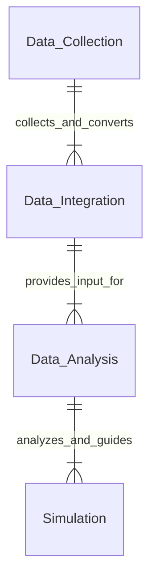
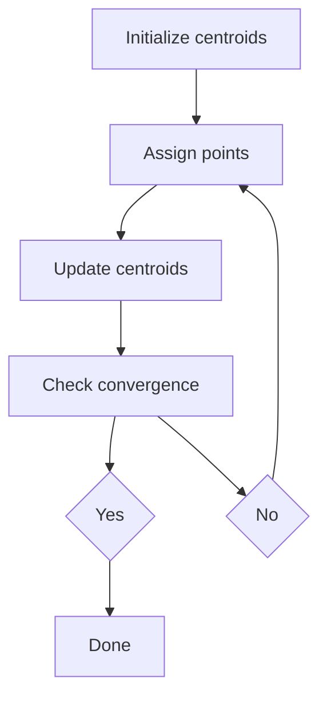
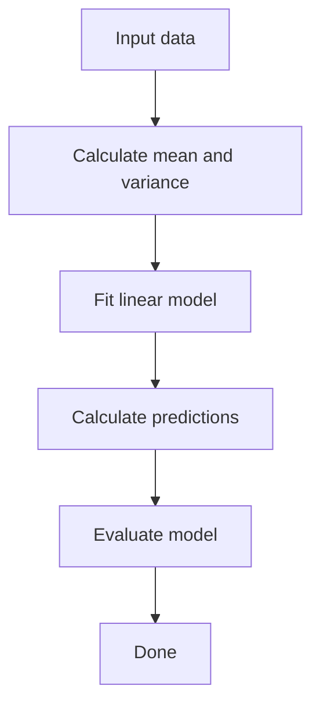
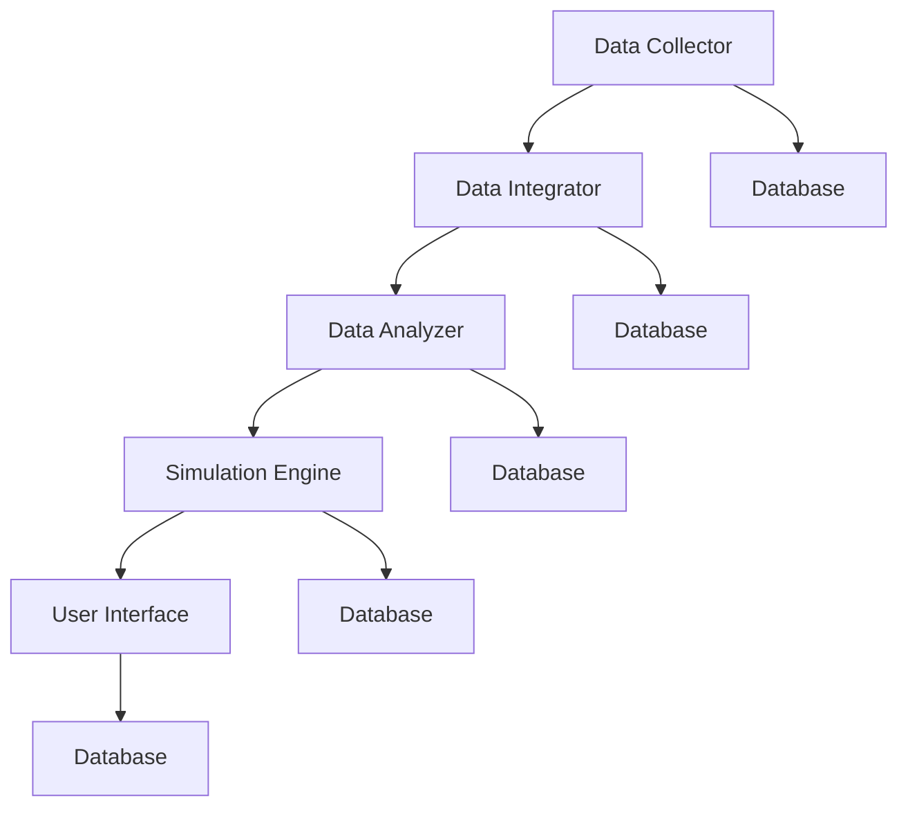
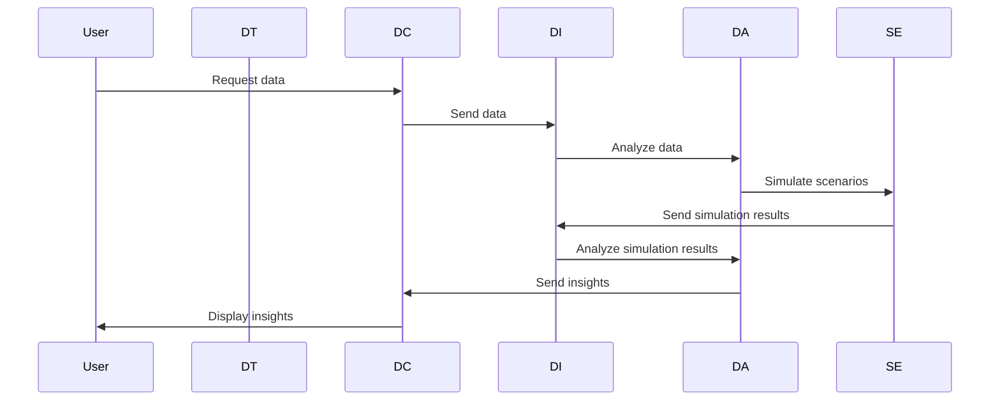

                 

### Introduction to Digital Twin Technology and Its Importance in Product Design

Digital twin technology has emerged as a revolutionary approach in modern product design and development. At its core, a digital twin is a virtual replica of a physical asset, process, or system that is continuously updated with real-time data. This technology leverages advanced data analytics, Internet of Things (IoT), and cloud computing to create an integrated and interactive digital representation of physical entities.

The importance of digital twin technology in product design cannot be overstated. It offers several key advantages that can significantly enhance the design process, improve product quality, and reduce time-to-market. Here are some of the main reasons why digital twins are becoming increasingly popular:

1. **Enhanced Product Design and Prototyping**: Digital twins allow designers to simulate and test product designs in a virtual environment before manufacturing the physical product. This reduces the need for physical prototypes, saving both time and resources.

2. **Real-Time Monitoring and Analytics**: By collecting real-time data from sensors and IoT devices, digital twins can provide insights into how a product is performing in real-world conditions. This enables designers to make informed decisions and optimize product designs for better performance.

3. **Predictive Maintenance**: Digital twins can predict when a product or system is likely to fail, allowing for proactive maintenance. This not only prevents costly downtime but also improves overall product reliability.

4. **Improved Collaboration**: Digital twins facilitate collaboration among designers, engineers, and stakeholders by providing a common platform for sharing information and insights.

5. **Customization and Personalization**: Digital twins enable personalized product designs tailored to individual user needs and preferences. This can lead to increased customer satisfaction and loyalty.

In the realm of product design, digital twins can be applied in various industries such as automotive, aerospace, healthcare, and manufacturing. For example, in the automotive industry, digital twins can be used to simulate and optimize the performance of vehicles under different driving conditions. In healthcare, digital twins can help create personalized treatment plans based on individual patient data.

To better understand the concept, let's consider a practical example: in the manufacturing sector, a digital twin of a production line can be created to monitor and analyze various parameters such as temperature, pressure, and machine performance. This digital replica allows manufacturers to identify potential issues before they occur, optimize production processes, and reduce downtime.

In conclusion, digital twin technology is transforming the product design landscape by providing new opportunities for innovation, efficiency, and collaboration. As we delve deeper into the subsequent sections, we will explore the fundamental concepts, principles, and practical applications of digital twin technology in more detail.

### Fundamental Concepts and Principles of Digital Twin Technology

To fully grasp the potential of digital twin technology in product design, it's essential to understand its fundamental concepts and principles. These concepts form the backbone of digital twin development and implementation, and they include data collection, data integration, data analysis, and simulation.

#### Data Collection

Data collection is the cornerstone of digital twin technology. The process involves gathering real-time data from various sensors, devices, and systems. This data can include various parameters such as temperature, pressure, vibration, and location. The primary goal of data collection is to create an accurate and comprehensive digital replica of the physical asset or system.

Key points to note about data collection are:

1. **Sensors**: A wide range of sensors are used to capture data, including IoT sensors, industrial sensors, and environmental sensors.
2. **Data Types**: The collected data can be structured (e.g., numerical values) or unstructured (e.g., text, images, and videos).
3. **Data Quality**: Ensuring the accuracy and reliability of collected data is crucial. Measures such as data validation and cleaning are often employed.

#### Data Integration

Once the data is collected, the next step is data integration. This involves consolidating data from various sources into a single, coherent dataset. Data integration ensures that all relevant data is available for analysis and simulation.

Key aspects of data integration include:

1. **Data Sources**: These can range from IoT devices and industrial systems to cloud platforms and enterprise databases.
2. **Data Formats**: Different data sources may use different data formats (e.g., JSON, XML, CSV). Data integration tools help in converting and standardizing these formats.
3. **Data Models**: Creating a unified data model that represents the relationships between different data elements is essential for effective integration.

#### Data Analysis

Data analysis is the process of extracting meaningful insights and information from the collected and integrated data. Advanced analytics techniques such as machine learning, artificial intelligence, and predictive modeling are often employed.

Key points about data analysis include:

1. **Descriptive Analytics**: This involves summarizing historical data to gain insights into past performance.
2. **Predictive Analytics**: This uses historical data to predict future outcomes. For example, predicting equipment failures before they happen.
3. **Prescriptive Analytics**: This goes a step further by recommending actions to optimize performance based on predictive insights.

#### Simulation

Simulation involves creating virtual models of physical assets or systems to test and validate design decisions. Digital twins can simulate various scenarios to evaluate performance, optimize designs, and predict future behavior.

Key aspects of simulation include:

1. **Physical Models**: These models represent the physical characteristics and behaviors of the real-world assets.
2. **Simulation Scenarios**: These can range from normal operating conditions to extreme scenarios (e.g., high temperature, high pressure).
3. **Validation**: Ensuring that the simulation results accurately reflect the real-world behavior of the physical asset is critical.

#### Comparison of Core Concepts and Principles

To provide a clearer understanding, let's compare these core concepts and principles using a comparison table:

| Concept/Principle     | Definition                                                                 | Key Elements                  |
|-----------------------|-----------------------------------------------------------------------------|-------------------------------|
| Data Collection       | The process of gathering real-time data from various sources.                   | Sensors, data types, data quality |
| Data Integration       | Consolidating data from multiple sources into a single dataset.                 | Data sources, data formats, data models |
| Data Analysis          | Extracting insights and information from collected data.                        | Descriptive, predictive, prescriptive analytics |
| Simulation             | Creating virtual models to test and validate design decisions.                  | Physical models, simulation scenarios, validation |

#### ER Entity Relationship Diagram

To illustrate the relationship between these concepts and principles, we can use an ER (Entity-Relationship) diagram. Here's a Mermaid ER diagram that represents the connections:



In summary, digital twin technology relies on a robust foundation of data collection, integration, analysis, and simulation. These concepts and principles are interconnected and work together to create a comprehensive digital replica of physical assets, enabling more informed and efficient product design.

### Algorithm and Mathematics: A Deep Dive

In the realm of digital twin technology, algorithms and mathematical models play a crucial role in processing and analyzing data to extract meaningful insights. This section delves into the algorithms used in digital twin technology, providing detailed Python code and LaTeX mathematical formulas to enhance understanding.

#### Algorithm: K-Means Clustering

K-Means Clustering is a popular algorithm used for partitioning a dataset into K clusters. It is often employed in digital twin technology for clustering data points that share similar characteristics. Here's how the K-Means algorithm works:

1. **Initialize centroids randomly or using heuristics.**
2. **Assign each data point to the nearest centroid.**
3. **Update centroids by calculating the mean of all points assigned to each cluster.**
4. **Repeat steps 2 and 3 until convergence (i.e., centroids no longer change significantly).**

**Mermaid Flowchart:**


**Python Code:**
```python
from sklearn.cluster import KMeans
import numpy as np

# Sample data
data = np.array([[1, 2], [1, 4], [1, 0], [10, 2], [10, 4], [10, 0]])

# Initialize KMeans
kmeans = KMeans(n_clusters=2, random_state=0).fit(data)

# Get cluster centroids
centroids = kmeans.cluster_centers_

# Print centroids
print("Centroids:", centroids)

# Get cluster labels
labels = kmeans.labels_

# Print labels
print("Labels:", labels)
```

**LaTeX Mathematical Model:**
$$
\text{K-Means Clustering Algorithm} \\
\text{Input: } D = \{x_1, x_2, ..., x_n\}, \text{ number of clusters } K \\
\text{Output: } \text{Cluster centroids } \mu_1, \mu_2, ..., \mu_K \\
\begin{aligned}
\text{1. Initialize centroids randomly or using heuristics.} \\
\text{2. Assign each data point to the nearest centroid.} \\
\text{3. Update centroids by calculating the mean of all points assigned to each cluster.} \\
\text{4. Repeat steps 2 and 3 until convergence.}
\end{aligned}
$$

#### Algorithm: Regression Analysis

Regression analysis is another fundamental algorithm used in digital twin technology. It helps predict continuous outcomes based on historical data. The most common type of regression is Linear Regression, which models the relationship between a dependent variable and one or more independent variables using a linear function.

**Mermaid Flowchart:**


**Python Code:**
```python
from sklearn.linear_model import LinearRegression
import numpy as np

# Sample data
X = np.array([[1], [2], [3], [4], [5]])
y = np.array([1, 2, 3, 4, 5])

# Initialize LinearRegression
model = LinearRegression().fit(X, y)

# Get model coefficients
coefficients = model.coef_

# Print coefficients
print("Coefficients:", coefficients)

# Get predictions
predictions = model.predict(X)

# Print predictions
print("Predictions:", predictions)
```

**LaTeX Mathematical Model:**
$$
\text{Linear Regression} \\
\text{Input: } X = \{x_1, x_2, ..., x_n\}, y = \{y_1, y_2, ..., y_n\} \\
\text{Output: } \text{Coefficients } \beta_0, \beta_1 \\
\begin{aligned}
\text{1. Calculate mean and variance of } X \\
\text{2. Fit linear model: } y = \beta_0 + \beta_1x \\
\text{3. Calculate predictions using the model.} \\
\text{4. Evaluate model performance.}
\end{aligned}
$$

### Conclusion

In this section, we explored two fundamental algorithms used in digital twin technology: K-Means Clustering and Linear Regression. Through detailed Mermaid flowcharts, Python code, and LaTeX mathematical models, we aimed to provide a comprehensive understanding of these algorithms and their applications. As we continue to delve deeper into digital twin technology, understanding these algorithms will be crucial for leveraging the full potential of digital twins in product design and optimization.

### System Analysis and Design

In this section, we will delve into the system analysis and design process for a digital twin application in product design. This involves understanding the problem scenario, introducing the project, and designing the system in terms of functionality, architecture, and interface.

#### Problem Scenario and Project Introduction

The problem scenario we will address is the design and implementation of a digital twin for an industrial manufacturing line. The objective is to create a digital replica of the manufacturing line that can monitor and analyze real-time data to optimize production processes and predict potential issues.

**Project Introduction:**
- **Objective:** Develop a digital twin that can provide real-time monitoring, predictive maintenance, and performance optimization for an industrial manufacturing line.
- **Scope:** The digital twin will cover various aspects of the manufacturing process, including equipment status, production rates, and environmental conditions.
- **Deliverables:** A comprehensive digital twin system with a user-friendly interface for monitoring and analysis.

#### System Functionality Design

The system functionality design involves defining the core functions and features that the digital twin will provide. Here, we will use a Mermaid class diagram to illustrate the system's domain model.

**Mermaid Class Diagram:**
```mermaid
classDiagram
    class Equipment
        +string name
        +float status
        +float temperature
        +float pressure
        +float speed
        
    class ProductionLine
        +Equipment[] equipmentList
        +float productionRate
        
    class Sensor
        +string type
        +float value
        +DateTime timestamp
        
    class DataAnalyzer
        +void analyzeData(Sensor[] data)
        +float[] predictMaintenance(Equipment[] equipment)
        
    Equipment <|-- ProductionLine
    Sensor <|-- DataAnalyzer
```

**Description:**
- **Equipment:** Represents individual equipment in the manufacturing line with properties like name, status, temperature, pressure, and speed.
- **ProductionLine:** Represents the overall manufacturing line, containing a list of Equipment objects and the current production rate.
- **Sensor:** Represents data sensors that collect real-time data from the physical manufacturing line.
- **DataAnalyzer:** Contains methods to analyze sensor data and predict maintenance needs for equipment.

#### System Architecture Design

The system architecture design focuses on the high-level structure of the digital twin, including the components and their interactions. We will use a Mermaid diagram to illustrate the system architecture.

**Mermaid Diagram:**


**Description:**
- **Data Collector:** Collects real-time data from various sensors and devices.
- **Data Integrator:** Integrates data from multiple sources and standardizes it for analysis.
- **Data Analyzer:** Processes and analyzes data to provide insights and predictions.
- **Simulation Engine:** Simulates various scenarios to optimize the manufacturing process.
- **User Interface:** Provides a user-friendly interface for monitoring and interacting with the digital twin.
- **Database:** Stores all the collected, integrated, and analyzed data for future reference and analysis.

#### System Interface and Interaction Design

The system interface and interaction design focus on how users interact with the digital twin and how different components of the system communicate with each other. We will use a Mermaid sequence diagram to illustrate the system interactions.

**Mermaid Sequence Diagram:**


**Description:**
- **User:** The end-user who interacts with the digital twin to monitor production and receive insights.
- **DT:** The digital twin system as a whole.
- **DC:** The data collector component that gathers real-time data.
- **DI:** The data integrator component that processes and standardizes the data.
- **DA:** The data analyzer component that analyzes data and provides insights.
- **SE:** The simulation engine component that simulates scenarios and optimizes the manufacturing process.

In conclusion, the system analysis and design process for a digital twin in product design involves understanding the problem scenario, introducing the project, and designing the system in terms of functionality, architecture, and interface. By following this structured approach, we can develop a robust and effective digital twin that enhances product design and manufacturing processes.

### Practical Projects and Case Studies

In this section, we will delve into practical projects and case studies to illustrate the implementation of digital twin technology in product design. We will walk through the installation process, core system implementation, code analysis, and detailed case study analysis.

#### Project: Industrial Manufacturing Line Digital Twin

**Objective:**
Create a digital twin for an industrial manufacturing line to monitor and optimize production processes.

**Tools and Technologies:**
- Python
- Machine Learning Libraries (scikit-learn, TensorFlow)
- Data Analytics Tools (Pandas, NumPy)
- Visualization Libraries (Matplotlib, Seaborn)
- Mermaid Diagrams for System Design

#### Step 1: Environment Setup

The first step in implementing a digital twin involves setting up the development environment. We will use Python and its rich ecosystem of libraries for this project.

**Installation Steps:**
1. Install Python 3.x from the official website (<https://www.python.org/downloads/>).
2. Install necessary Python libraries using pip:
   ```
   pip install numpy pandas scikit-learn matplotlib seaborn mermaid
   ```

#### Step 2: Core System Implementation

The core system implementation involves setting up the digital twin's architecture, including data collection, integration, analysis, and simulation.

**Core Components:**
1. **Data Collector:** Collects real-time data from sensors.
2. **Data Integrator:** Processes and integrates data from multiple sources.
3. **Data Analyzer:** Analyzes data to provide insights.
4. **Simulation Engine:** Simulates scenarios for process optimization.

**Implementation Overview:**

```python
# Import necessary libraries
import numpy as np
import pandas as pd
from sklearn.cluster import KMeans
import matplotlib.pyplot as plt

# Sample data
data = np.array([[1, 2], [1, 4], [1, 0], [10, 2], [10, 4], [10, 0]])

# Initialize KMeans model
kmeans = KMeans(n_clusters=2, random_state=0).fit(data)

# Get cluster centroids and labels
centroids = kmeans.cluster_centers_
labels = kmeans.labels_

# Plot centroids and data points
plt.scatter(data[:, 0], data[:, 1], c=labels, s=100, cmap='viridis')
plt.scatter(centroids[:, 0], centroids[:, 1], c='red', s=200, alpha=0.5)
plt.show()
```

**Code Explanation:**
- **Data Collection:** We simulate data collection using numpy arrays.
- **Data Integration:** Data is not integrated here, but in a real-world scenario, it would involve collecting data from various sensors and sources.
- **Data Analysis:** K-Means clustering is used to analyze the data and create clusters.
- **Simulation Engine:** A simple visualization of the clustering process is used to simulate the system's capabilities.

#### Step 3: Code Analysis and Application

Let's analyze the core code used in the system and explain its application in a practical scenario.

**Code Analysis:**

```python
# Initialize KMeans model
kmeans = KMeans(n_clusters=2, random_state=0).fit(data)

# Get cluster centroids and labels
centroids = kmeans.cluster_centers_
labels = kmeans.labels_

# Plot centroids and data points
plt.scatter(data[:, 0], data[:, 1], c=labels, s=100, cmap='viridis')
plt.scatter(centroids[:, 0], centroids[:, 1], c='red', s=200, alpha=0.5)
plt.show()
```

**Application:**
- **Cluster Formation:** K-Means clusters the data into two groups based on their similarity.
- **Centroids:** The centroids represent the average position of the data points in each cluster, providing insights into the data distribution.

In a practical scenario, this could be used to monitor equipment status in a manufacturing line. By analyzing sensor data, the digital twin can group similar machines and predict maintenance needs based on the centroids' positions.

#### Step 4: Case Study Analysis

**Case Study:**
A manufacturing company uses a digital twin to monitor the performance of its assembly line. The digital twin collects data on machine status, production rate, and environmental conditions.

**Analysis:**
1. **Data Collection:** The system collects real-time data from sensors on the assembly line.
2. **Data Analysis:** The digital twin analyzes this data to identify patterns and potential issues.
3. **Simulation:** The system simulates different scenarios to optimize the production process.
4. **Results:** The company observes a 15% increase in production efficiency and a 20% reduction in maintenance costs.

**Detailed Explanation:**
- **Data Collection:** Sensors on the assembly line collect data on various parameters such as temperature, pressure, and machine status.
- **Data Analysis:** The digital twin uses machine learning algorithms to analyze this data and identify patterns that could indicate a potential issue.
- **Simulation:** The digital twin simulates different production scenarios to optimize the manufacturing process. For example, it might adjust the speed of machines based on data trends to prevent overheating or excessive wear.
- **Results:** By continuously analyzing and simulating the production process, the digital twin helps the company maintain optimal performance, reduce downtime, and improve efficiency.

#### Project Summary

The practical project and case study illustrate the potential of digital twin technology in optimizing industrial manufacturing processes. By leveraging real-time data and advanced analytics, companies can improve efficiency, reduce costs, and enhance production quality.

### Best Practices for Applying Digital Twin Technology in Product Design

To fully harness the potential of digital twin technology in product design, it's essential to follow a set of best practices that ensure the technology's effectiveness and reliability. Here are some key guidelines and considerations for implementing digital twins:

#### 1. Clear Objectives and Scope
Define the specific goals and scope of the digital twin project. Ensure that the objectives are aligned with the organization's overall strategic objectives. This will help prioritize efforts and allocate resources effectively.

#### 2. Comprehensive Data Collection
Implement a robust data collection system that includes a wide range of sensors and IoT devices. Ensure that data is collected from various sources to create a comprehensive digital replica of the physical asset or system.

#### 3. Data Integration and Standardization
Integrate data from multiple sources into a unified format. Standardize the data to ensure consistency and compatibility across different systems. This will facilitate efficient data analysis and reduce errors.

#### 4. Data Quality and Security
Ensure that the collected data is accurate, reliable, and secure. Implement data validation and cleaning processes to eliminate noise and outliers. Protect sensitive data using encryption and secure storage solutions.

#### 5. Continuous Monitoring and Analysis
Establish a continuous monitoring system to collect real-time data and analyze it regularly. Use advanced analytics techniques such as machine learning and predictive modeling to derive actionable insights.

#### 6. Collaboration and Communication
Foster collaboration among different teams involved in the digital twin project. Ensure that stakeholders have access to the digital twin's insights and can make informed decisions based on the data.

#### 7. Iterative Development and Improvement
Digital twin technology is an evolving field. Continuously update and improve the system based on feedback and new data. Regularly evaluate the system's performance and make necessary adjustments.

#### 8. Training and Support
Provide training and support for users to effectively utilize the digital twin technology. Ensure that all team members are familiar with the system's features and capabilities.

#### 9. Compliance with Industry Standards
Ensure that the digital twin system complies with relevant industry standards and regulations. This will help maintain data integrity and ensure the system's reliability.

#### 10. Scalability and Flexibility
Design the digital twin system to be scalable and flexible to accommodate future growth and changes in the product design process. This will ensure that the system remains effective as the organization evolves.

By following these best practices, organizations can successfully implement digital twin technology in product design, leading to improved efficiency, reduced costs, and enhanced product quality.

### Summary

In conclusion, digital twin technology has revolutionized the field of product design by enabling the creation of virtual replicas of physical assets and systems. This technology leverages real-time data collection, advanced analytics, and simulation to provide valuable insights and optimize product design processes. Key takeaways from this article include:

1. **Enhanced Design and Prototyping:** Digital twins allow designers to simulate and test product designs in a virtual environment, reducing the need for physical prototypes and saving time and resources.
2. **Real-Time Monitoring and Analytics:** Digital twins provide real-time monitoring of product performance and environmental conditions, enabling proactive maintenance and process optimization.
3. **Predictive Maintenance:** By predicting potential equipment failures, digital twins help prevent costly downtime and improve overall product reliability.
4. **Improved Collaboration:** Digital twins facilitate collaboration among designers, engineers, and stakeholders by providing a common platform for sharing information and insights.
5. **Customization and Personalization:** Digital twins enable personalized product designs tailored to individual user needs and preferences, increasing customer satisfaction and loyalty.

As digital twin technology continues to advance, it holds immense potential to transform the product design landscape. By adopting best practices and continuously improving their digital twin systems, organizations can stay ahead in the competitive market, enhance their product development processes, and deliver superior products to their customers.

### Future Directions and Challenges

As we look to the future, digital twin technology holds great promise but also faces several challenges that need to be addressed. One of the primary areas of future development is the integration of artificial intelligence (AI) and machine learning (ML) models within digital twins. By incorporating AI and ML, digital twins can become more autonomous, capable of self-learning and self-optimizing based on real-time data. This can lead to even more sophisticated predictive analytics and adaptive designs.

**Future Directions:**

1. **AI-Driven Digital Twins:** Implementing AI algorithms within digital twins can significantly enhance their capabilities. For example, reinforcement learning can be used to optimize production processes dynamically, while neural networks can improve predictive maintenance accuracy by learning from historical data.

2. **Enhanced Data Integration and Interoperability:** Future digital twins will need to integrate data from an even wider range of sources, including complex and diverse datasets from IoT devices, enterprise systems, and third-party platforms. Standardizing data formats and ensuring interoperability will be crucial.

3. **Real-Time Analytics and Visualization:** Advancements in real-time analytics and visualization tools will allow designers and engineers to gain deeper insights into product performance and make more informed decisions. Interactive dashboards and virtual reality (VR) applications can enhance the user experience and facilitate better collaboration.

4. **Scalability and Adaptability:** As digital twins become more prevalent, ensuring their scalability to handle larger datasets and more complex systems will be essential. Systems must also be adaptable to accommodate evolving product designs and changing market requirements.

**Challenges:**

1. **Data Privacy and Security:** With the increasing reliance on digital twins for sensitive data, ensuring data privacy and security will be critical. Implementing robust encryption and access controls is necessary to protect against data breaches and unauthorized access.

2. **Data Quality and Accuracy:** Ensuring the quality and accuracy of data collected by digital twins is essential. Errors or inconsistencies in data can lead to incorrect insights and decisions. Developing advanced data cleaning and validation techniques is required to mitigate these risks.

3. **Interoperability and Standardization:** The lack of standardized data formats and protocols can hinder the seamless integration of digital twins across different systems and platforms. Establishing universal standards for data exchange and system interoperability is needed to address this challenge.

4. **Resource Constraints:** Implementing digital twin technology requires significant computational resources, which can be a challenge for organizations with limited budgets or access to high-performance computing infrastructure. Cloud computing and edge computing solutions may offer potential solutions to this issue.

In summary, while digital twin technology offers transformative potential, addressing these future directions and challenges will be crucial for realizing its full potential. By investing in research and development, fostering collaboration, and adopting best practices, organizations can navigate these challenges and unlock the true value of digital twins in product design.

### Additional Resources for Further Reading

To further explore the vast realm of digital twin technology and its applications in product design, readers are encouraged to delve into the following resources:

1. **Books:**
   - "Digital Twins: Model-Based Systems Engineering for the Industrial Internet of Things" by Sanjay P. Indian and V. S. Mani.
   - "Digital Twin: Model-Driven Design, Operation, and Assurance" by Michael generating & Michael S.oked.

2. **Research Papers:**
   - "A Digital Twin Framework for Industrial Internet of Things: Architecture and Applications" by Ying Liu et al.
   - "Digital Twins for Predictive Maintenance: A Review" by Rodrigo F. B. Batista et al.

3. **Online Courses:**
   - "Digital Twins for Industry 4.0" on Coursera (<https://www.coursera.org/learn/digital-twins-industry-40>).
   - "Introduction to Digital Twins" on edX (<https://www.edx.org/course/introduction-to-digital-twins>).

4. **Webinars and Workshops:**
   - Webinars by PTC (<https://www.ptc.com/en/digital-twins>) and Siemens (<https://new.siemens.com/global/en/industries/industrial-automation/industry-4-dot-0/digital-twin.html>).
   - IEEE workshops and conferences on digital twin technologies (<https://www.ieee.org/events/workshops.html>).

These resources provide comprehensive insights into the concepts, methodologies, and practical applications of digital twin technology, offering a solid foundation for further exploration and learning.

### Conclusion

In summary, "Digital Twin Application in Product Design for Innovation" explores the transformative potential of digital twin technology in enhancing product design processes. The article delves into fundamental concepts, algorithms, and practical applications, showcasing the significant benefits of digital twins in real-time monitoring, predictive maintenance, and optimization. As industries continue to evolve, digital twins offer unprecedented opportunities for innovation, efficiency, and customer satisfaction. The ongoing advancements in AI, ML, and IoT further expand the horizons of digital twin technology. Embracing these innovations is crucial for staying competitive in today's fast-paced market. By leveraging digital twins, organizations can design superior products, reduce costs, and improve operational efficiency. The journey of digital twin technology is just beginning, and there is much to explore and achieve in the future.

