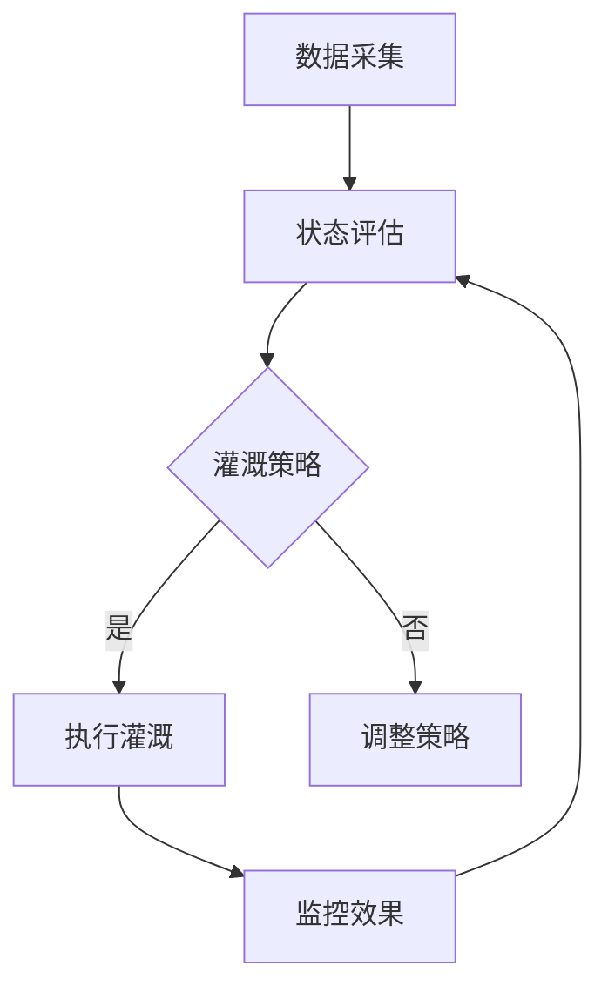
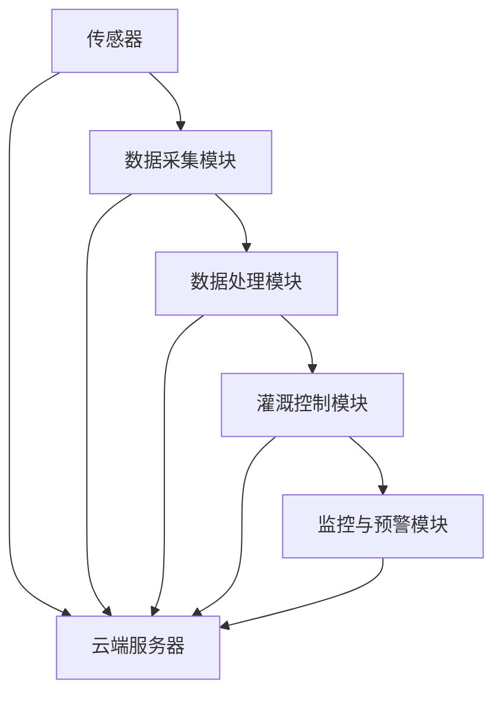
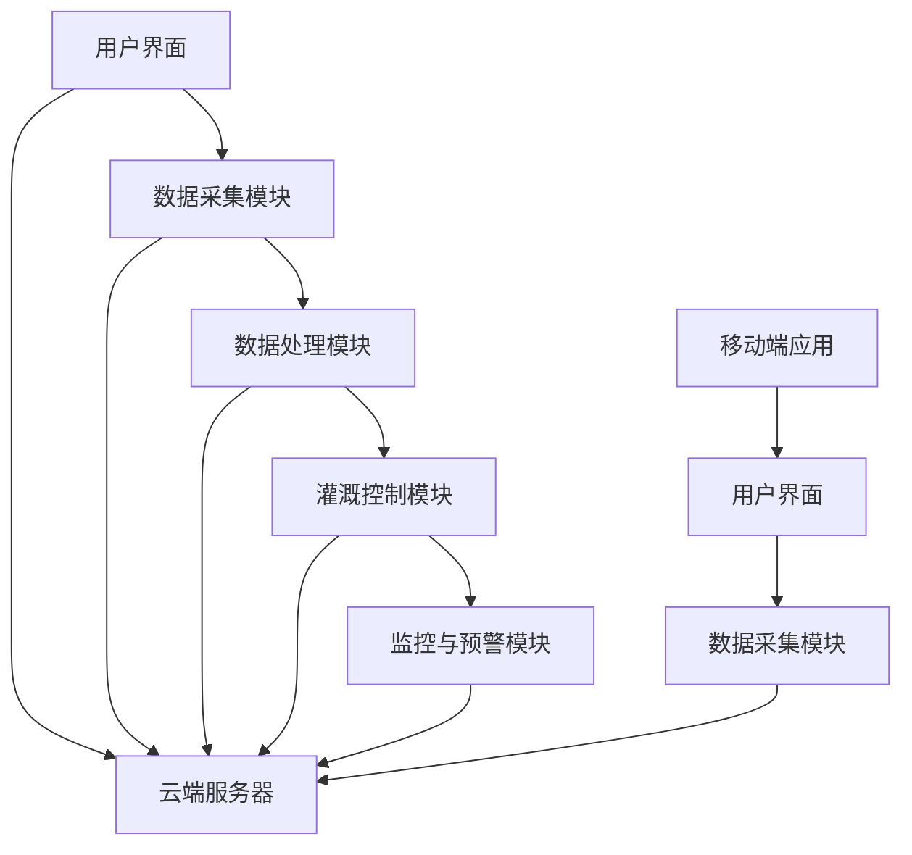

                 

### 文章标题

**数字孪生在智慧农业灌溉中的精准控制**

> **关键词：** 数字孪生、智慧农业、精准控制、灌溉、物联网

**摘要：** 本文将深入探讨数字孪生技术在智慧农业灌溉中的应用，特别是如何通过数字孪生实现灌溉的精准控制。文章首先介绍了数字孪生和智慧农业的基本概念及其重要性，然后详细分析了数字孪生在灌溉系统中如何发挥作用，包括核心算法原理的讲解和系统架构设计。通过实际项目案例分析，本文展示了数字孪生技术在智慧农业灌溉中的实战应用，并提出了最佳实践建议和未来展望。

### 第一部分：数字孪生与智慧农业概述

#### 第1章：数字孪生技术基础

数字孪生技术（Digital Twin）是一种新兴的数字技术与实体物理系统相结合的方法，旨在创建一个与实际系统相对应的虚拟模型。这种模型能够实时反映实际系统的状态、性能和行为，为监测、分析和优化提供了强大的工具。数字孪生技术的发展可以追溯到20世纪60年代，但其真正得到广泛应用则是在21世纪初。

##### **1.1 数字孪生定义与历史发展**

数字孪生通常被定义为“一个虚拟的数字化镜像，与实际的物理系统相对应，通过实时数据同步来保持一致性。”其历史发展经历了从早期的物理模拟到计算机仿真，再到现在的数据驱动和实时互动的演变。

- **早期物理模拟**：在20世纪60年代，数字孪生技术的概念首先在航天工业中提出，通过物理模型来模拟飞行器的设计和性能。
- **计算机仿真**：随着计算机技术的发展，数字孪生技术逐渐转向计算机仿真，能够更精确地模拟复杂的物理系统。
- **数据驱动实时互动**：21世纪初，物联网和大数据技术的兴起，使得数字孪生技术可以实时收集和分析物理系统的数据，实现更高效、更准确的模拟和优化。

##### **1.2 数字孪生关键特性与应用领域**

数字孪生的关键特性包括：

- **实时性**：数字孪生能够实时反映物理系统的状态，确保数据的实时性和准确性。
- **一致性**：通过实时数据同步，数字孪生与物理系统保持高度一致性。
- **可操作性**：用户可以在数字孪生环境中对物理系统进行远程操作和控制。

数字孪生技术广泛应用于多个领域，如工业制造、智能城市、医疗健康和智慧农业等。在智慧农业中，数字孪生技术可以用于监控土壤湿度、作物生长情况以及灌溉系统，从而实现精准农业管理。

##### **1.3 数字孪生技术框架**

数字孪生技术框架通常包括以下几个关键组件：

1. **数据采集与传感**：通过各种传感器收集物理系统的实时数据。
2. **数据处理与存储**：利用大数据分析和存储技术处理和存储数据。
3. **数字模型构建**：基于收集到的数据构建物理系统的虚拟模型。
4. **模拟与预测**：通过数字模型进行模拟和预测，为决策提供支持。
5. **操作与控制**：在数字孪生环境中进行远程操作和控制，影响物理系统。

#### 第2章：智慧农业概述

智慧农业是利用现代信息技术和智能设备来提高农业生产效率和质量的一种新型农业模式。随着全球人口的增长和农业资源日益紧张，智慧农业成为解决粮食安全和可持续农业发展的重要手段。

##### **2.1 智慧农业背景与挑战**

智慧农业的背景包括以下几个方面：

- **人口增长**：全球人口持续增长，对粮食需求不断增加，智慧农业有助于提高粮食产量。
- **气候变化**：气候变化对农业产生严重影响，智慧农业通过精准管理提高作物抗灾能力。
- **资源紧张**：土地、水资源等农业资源日益紧张，智慧农业有助于优化资源利用。

智慧农业面临的挑战主要包括：

- **技术局限**：现有技术尚无法全面解决农业中的复杂问题。
- **数据整合**：来自不同来源的大量数据需要有效整合和分析。
- **基础设施**：发展智慧农业需要完善的基础设施支持。

##### **2.2 智慧农业的核心技术**

智慧农业的核心技术包括：

- **物联网（IoT）**：通过传感器和设备连接实现农田和农作物的实时监测。
- **大数据分析**：利用大数据技术分析农田数据，优化农业生产和管理。
- **人工智能（AI）**：利用人工智能技术进行农作物识别、病虫害预测和精准施肥。
- **无人机与机器人**：用于农田监测、播种、施肥、收割等自动化操作。

##### **2.3 智慧农业的现状与未来**

智慧农业的现状如下：

- **技术成熟度**：物联网、大数据分析和人工智能技术在农业中已得到广泛应用。
- **应用范围**：智慧农业在发达国家已得到推广，但在发展中国家仍有巨大潜力。
- **经济效益**：智慧农业提高了农业生产效率和产品质量，带来了显著的经济效益。

智慧农业的未来发展趋势包括：

- **技术融合**：物联网、大数据、人工智能和区块链等技术将更紧密地融合，推动农业智能化发展。
- **全球普及**：随着技术的普及和成本的降低，智慧农业将在全球范围内得到更广泛的应用。
- **可持续性**：智慧农业将更加注重可持续性和环境友好性，推动农业的可持续发展。

### 第二部分：核心概念与联系

#### 第3章：数字孪生在智慧农业中的应用

数字孪生技术在智慧农业中扮演着重要角色，特别是在灌溉系统中的应用。通过创建数字孪生模型，可以实现灌溉的精准控制，提高水资源利用效率和农作物产量。

##### **3.1 数字孪生在智慧农业中的角色**

在智慧农业中，数字孪生技术的主要角色包括：

- **监控与预测**：通过数字孪生模型实时监控农田状态，预测作物生长和水资源需求。
- **决策支持**：为农民提供基于数据的灌溉决策支持，优化灌溉策略。
- **远程控制**：通过数字孪生模型进行远程操作，实现对灌溉系统的精准控制。

##### **3.2 数字孪生在灌溉系统中的应用**

数字孪生在灌溉系统中的应用主要包括以下几个方面：

- **灌溉计划制定**：基于数字孪生模型，制定个性化的灌溉计划，确保作物得到充分的水分。
- **水资源管理**：通过数字孪生技术实时监测水资源消耗，优化水资源分配。
- **环境监测**：数字孪生模型还可以监测农田的气象条件，如温度、湿度等，为灌溉提供环境数据支持。

##### **3.3 数字孪生与农业物联网的结合**

数字孪生与农业物联网（IoT）的结合是智慧农业的关键。物联网传感器实时收集农田数据，数字孪生模型对这些数据进行处理和分析，从而实现对灌溉系统的精准控制。

- **传感器数据采集**：物联网传感器采集土壤湿度、温度、光照等数据。
- **数据传输与处理**：数据通过无线网络传输到云端，数字孪生模型对数据进行分析和处理。
- **决策与控制**：基于分析结果，数字孪生模型为灌溉系统提供决策支持，实现对灌溉的远程控制。

### 第三部分：算法原理讲解

#### 第4章：数字孪生在灌溉精准控制中的算法原理

数字孪生技术在灌溉精准控制中的核心在于算法的应用。以下将详细讲解数字孪生在灌溉系统中使用的算法原理，包括流程图展示、Python源代码实现、数学模型和公式讲解，以及举例说明。

##### **4.1 精准控制算法概述**

精准控制算法的目标是确保作物在最佳生长状态下得到适量的水分，同时避免水资源浪费。关键步骤包括：

1. **数据采集**：收集农田的土壤湿度、温度、光照等数据。
2. **状态评估**：根据采集到的数据，评估作物的水分需求。
3. **灌溉策略制定**：根据评估结果，制定个性化的灌溉策略。
4. **执行与监控**：执行灌溉计划，并对灌溉效果进行实时监控和调整。

##### **4.2 算法mermaid流程图展示**

使用mermaid语言，可以绘制如下算法流程图：



##### **4.3 Python源代码实现**

以下是一个简单的Python源代码示例，用于实现灌溉精准控制算法：

```python
# 导入必要的库
import numpy as np

# 设定参数
soil_humidity_threshold = 20  # 土壤湿度阈值
irrigation_duration = 30  # 灌溉时长（分钟）

# 数据采集
current_soil_humidity = 15  # 当前土壤湿度

# 状态评估
if current_soil_humidity < soil_humidity_threshold:
    print("需要灌溉")
else:
    print("不需要灌溉")

# 灌溉策略制定
if current_soil_humidity < soil_humidity_threshold:
    # 执行灌溉
    print(f"执行灌溉，时长为{irrigation_duration}分钟")
else:
    # 调整策略
    print("调整灌溉策略")

# 监控效果
print("监控灌溉效果，并调整策略")
```

##### **4.4 数学模型和公式讲解**

在精准控制算法中，常用的数学模型和公式包括：

- **土壤湿度变化公式**：$$\Delta H = k \cdot t$$，其中$\Delta H$表示土壤湿度变化，$k$是土壤湿度变化率，$t$是时间。
- **灌溉量计算公式**：$$Q = C \cdot \frac{\Delta H}{H_0 - H_c}$$，其中$Q$是灌溉量，$C$是灌溉系数，$H_0$是目标土壤湿度，$H_c$是当前土壤湿度。

##### **4.5 举例说明**

假设当前土壤湿度为15%，目标土壤湿度为20%，灌溉系数为0.5。根据上述公式，灌溉量计算如下：

$$Q = 0.5 \cdot \frac{20\% - 15\%}{20\% - 15\%} = 0.5 \cdot 0.05 = 0.025$$

因此，需要灌溉的量为0.025个单位（例如立方米）。

### 第四部分：系统分析与架构设计方案

#### 第5章：智慧农业灌溉系统架构设计

智慧农业灌溉系统的架构设计需要综合考虑数据采集、处理、分析和控制等多个方面。以下将详细介绍系统架构设计，包括问题场景介绍、系统功能设计、系统架构设计和系统接口设计与交互。

##### **5.1 问题场景介绍**

在智慧农业灌溉系统中，常见的问题场景包括：

- **水资源浪费**：传统灌溉方式难以精确控制水量，导致水资源浪费。
- **作物生长不均**：土壤湿度分布不均，导致作物生长不均。
- **病虫害监测不足**：缺乏对病虫害的实时监测和预警。

##### **5.2 系统功能设计**

智慧农业灌溉系统的主要功能包括：

- **数据采集**：通过传感器实时采集土壤湿度、温度、光照等数据。
- **数据处理**：对采集到的数据进行分析和处理，提取有用信息。
- **灌溉控制**：根据处理结果制定灌溉计划，并执行灌溉操作。
- **监控与预警**：实时监控农田状态，对异常情况进行预警。

##### **5.3 系统架构设计**

智慧农业灌溉系统的架构设计如下：



在该架构中，传感器负责采集农田数据，数据采集模块将这些数据传输到云端服务器，数据处理模块对数据进行处理和分析，灌溉控制模块根据分析结果制定灌溉计划，监控与预警模块实时监控农田状态，并发出预警信号。

##### **5.4 系统接口设计与系统交互**

智慧农业灌溉系统的接口设计和交互设计如下：



在该交互设计中，用户界面（UI）提供用户操作接口，数据采集模块从传感器采集数据，数据处理模块对数据进行处理和分析，灌溉控制模块根据分析结果制定灌溉计划，监控与预警模块实时监控农田状态。移动端应用通过用户界面与系统进行交互，实现远程监控和控制。

### 第五部分：项目实战

#### 第6章：数字孪生在智慧农业灌溉中的项目实战

在实际项目中，数字孪生技术在智慧农业灌溉中的应用需要具体的实现步骤和实际案例。以下将详细介绍项目环境安装、系统核心实现、代码解读与分析、实际案例分析和详细讲解剖析，以及项目小结。

##### **6.1 项目环境安装**

在进行数字孪生智慧农业灌溉项目之前，需要安装以下环境：

- **传感器**：安装土壤湿度传感器、温度传感器和光照传感器。
- **物联网平台**：选择一个合适的物联网平台，如阿里云物联网平台或华为云物联网平台。
- **数据处理与分析工具**：安装Python环境，并安装必要的库，如NumPy、Pandas和Matplotlib等。
- **云端服务器**：选择一个云端服务器，如阿里云服务器或腾讯云服务器。

##### **6.2 系统核心实现**

系统核心实现包括以下几个步骤：

1. **数据采集**：通过传感器采集农田的土壤湿度、温度和光照数据。
2. **数据处理**：将采集到的数据上传到云端服务器，并进行处理和分析。
3. **灌溉控制**：根据数据处理结果，制定灌溉计划，并执行灌溉操作。
4. **监控与预警**：实时监控农田状态，对异常情况进行预警。

以下是一个简单的Python代码示例，用于实现灌溉控制功能：

```python
import requests

# 传感器数据
soil_humidity = 15
temperature = 25
light_intensity = 300

# 灌溉策略
if soil_humidity < 20:
    irrigation_duration = 30  # 灌溉时长（分钟）
else:
    irrigation_duration = 0  # 不需要灌溉

# 发送灌溉指令
url = "https://your-iot-platform.com/irrigation/execute"
data = {
    "soil_humidity": soil_humidity,
    "temperature": temperature,
    "light_intensity": light_intensity,
    "irrigation_duration": irrigation_duration
}
requests.post(url, data=data)
```

##### **6.3 代码解读与分析**

上述代码首先从传感器获取土壤湿度、温度和光照数据，然后根据这些数据制定灌溉策略。如果土壤湿度低于20%，则执行30分钟的灌溉操作。否则，不需要灌溉。最后，通过物联网平台发送灌溉指令。

代码中的关键部分包括：

- **数据采集**：使用requests库发送HTTP请求，从传感器获取数据。
- **数据处理**：根据土壤湿度等数据制定灌溉策略。
- **灌溉控制**：使用HTTP请求将灌溉指令发送到物联网平台，执行灌溉操作。

##### **6.4 实际案例分析和详细讲解剖析**

在实际项目中，数字孪生智慧农业灌溉系统可以通过以下实际案例进行分析和讲解：

1. **案例1：水稻种植区灌溉**

   水稻种植区需要进行定期灌溉，以保持土壤湿度和促进作物生长。通过数字孪生技术，可以实时监控土壤湿度，并根据实际情况调整灌溉计划。

   - **数据采集**：安装土壤湿度传感器，定期采集土壤湿度数据。
   - **数据处理**：分析土壤湿度数据，根据实际情况调整灌溉计划。
   - **灌溉控制**：在土壤湿度低于20%时，执行30分钟的灌溉操作。

2. **案例2：果园灌溉**

   果园灌溉需要根据不同果树的生长周期和水分需求进行个性化灌溉。通过数字孪生技术，可以实现精准灌溉，提高果树产量和果实品质。

   - **数据采集**：安装多种传感器，采集土壤湿度、温度、光照等数据。
   - **数据处理**：分析传感器数据，为不同果树制定个性化灌溉策略。
   - **灌溉控制**：根据果树的生长周期和水分需求，执行灌溉操作。

##### **6.5 项目小结**

通过实际案例，可以看到数字孪生技术在智慧农业灌溉中的应用具有显著优势。通过实时数据采集、分析和控制，可以实现精准灌溉，提高水资源利用效率和农作物产量。未来，随着数字孪生技术的不断发展和完善，智慧农业灌溉系统将在更多领域得到广泛应用。

### 第六部分：最佳实践与展望

#### 第7章：数字孪生在智慧农业灌溉中的最佳实践与展望

数字孪生技术在智慧农业灌溉中的应用已经取得了显著成效，但仍有许多潜在的应用空间和发展方向。以下将介绍数字孪生在智慧农业灌溉中的最佳实践、注意事项、未来展望以及相关拓展阅读。

##### **7.1 最佳实践 tips**

在数字孪生智慧农业灌溉中，以下是一些最佳实践建议：

- **数据质量**：确保传感器数据的高质量和实时性，对于数字孪生模型的准确性至关重要。
- **算法优化**：根据农田的具体情况，不断优化灌溉算法，提高灌溉的精准度和效率。
- **系统集成**：将数字孪生技术与现有的农业管理系统进行集成，实现数据共享和协同工作。
- **用户培训**：对农民进行数字孪生技术的培训，提高他们对新技术的理解和应用能力。

##### **7.2 小结与展望**

数字孪生技术在智慧农业灌溉中展现了巨大的潜力，通过实时数据采集、分析和控制，实现了精准灌溉，提高了水资源利用效率和农作物产量。未来，随着技术的不断发展和完善，数字孪生技术将在更多领域得到广泛应用，如智能灌溉、病虫害监测、农业机械设备控制等。

##### **7.3 注意事项**

在应用数字孪生技术时，需要注意以下几点：

- **数据安全**：保护传感器数据的安全性，防止数据泄露和篡改。
- **系统稳定性**：确保数字孪生系统的稳定性和可靠性，避免系统故障对农业生产的影响。
- **法规遵守**：遵守相关法律法规，确保数字孪生技术在农业中的应用合法合规。

##### **7.4 拓展阅读**

以下是一些与数字孪生技术、智慧农业和灌溉相关的拓展阅读资料：

- **《智慧农业物联网技术与应用》**：详细介绍了物联网技术在智慧农业中的应用，包括传感器、数据传输和处理等。
- **《数字孪生：从概念到实践》**：系统讲解了数字孪生的基本概念、架构设计、应用场景和实现方法。
- **《精准灌溉技术指南》**：提供了精准灌溉的基本原理、技术方法和应用案例。

通过上述最佳实践和拓展阅读，可以更深入地了解数字孪生技术在智慧农业灌溉中的应用，为实际项目提供有益的参考。

### 作者信息

**作者：** AI天才研究院/AI Genius Institute & 禅与计算机程序设计艺术 /Zen And The Art of Computer Programming

本文由AI天才研究院与禅与计算机程序设计艺术合作撰写，旨在深入探讨数字孪生技术在智慧农业灌溉中的应用。作者团队致力于推动人工智能和计算机科学领域的创新与发展，通过精湛的技术分析和实际应用案例，为智慧农业提供解决方案。同时，本文也体现了作者在计算机编程和人工智能领域的深厚造诣，以及对技术原理和本质剖析的独到见解。希望本文能为读者带来有价值的启示和指导。

