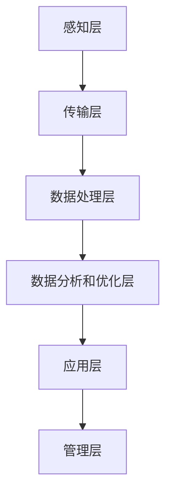
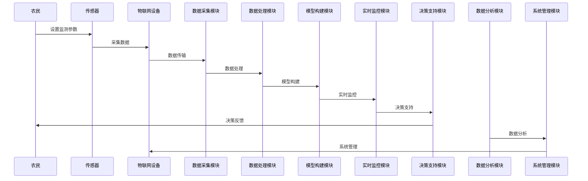

                 

### 文章标题：数字孪生在智慧农业管理中的应用

关键词：数字孪生，智慧农业，管理应用，算法原理，系统架构

摘要：本文深入探讨了数字孪生在智慧农业管理中的应用。通过介绍数字孪生与智慧农业的核心概念和背景，分析了数字孪生模型在智慧农业中的构建方法和应用场景，详细阐述了数字孪生算法的原理及在智慧农业系统架构中的设计。此外，文章通过项目实战与案例分析，总结了数字孪生在智慧农业管理中的最佳实践，并对未来的发展趋势进行了展望。全文旨在为读者提供清晰、系统的数字孪生在智慧农业管理中的理论知识和实践指导。

### 目录大纲：数字孪生在智慧农业管理中的应用

```markdown
----------------------------------------------------------------

## 第一部分：背景介绍与核心概念

### 第1章：数字孪生与智慧农业概述

#### 1.1 数字孪生的概念与作用

##### 1.1.1 数字孪生的定义

##### 1.1.2 数字孪生在农业中的应用场景

##### 1.1.3 数字孪生与传统农业的区别

#### 1.2 智慧农业的背景与发展

##### 1.2.1 智慧农业的定义

##### 1.2.2 智慧农业的现状与趋势

##### 1.2.3 智慧农业的核心技术

#### 1.3 数字孪生在智慧农业中的角色与挑战

##### 1.3.1 数字孪生在智慧农业中的价值

##### 1.3.2 数字孪生在智慧农业中的挑战

##### 1.3.3 数字孪生解决方案的关键要素

## 第二部分：核心概念与联系

### 第2章：数字孪生模型构建

#### 2.1 数字孪生模型的基本原理

##### 2.1.1 数字孪生模型的概念

##### 2.1.2 数字孪生模型的组成部分

#### 2.2 数字孪生模型构建的方法

##### 2.2.1 数据收集与处理

##### 2.2.2 模型训练与优化

##### 2.2.3 模型部署与应用

#### 2.3 数字孪生模型的属性特征对比表

##### 2.3.1 数字孪生模型属性特征概述

##### 2.3.2 数字孪生模型属性特征对比

### 第3章：智慧农业中的数字孪生应用

#### 3.1 数字孪生在作物种植中的应用

##### 3.1.1 作物生长监测

##### 3.1.2 作物健康诊断

##### 3.1.3 作物产量预测

#### 3.2 数字孪生在农业生产管理中的应用

##### 3.2.1 土壤监测与调控

##### 3.2.2 灌溉系统优化

##### 3.2.3 农业灾害预警

#### 3.3 数字孪生在农产品质量监控中的应用

##### 3.3.1 产品质量监测

##### 3.3.2 产品供应链管理

##### 3.3.3 产品销售分析

## 第三部分：算法原理与系统架构

### 第4章：数字孪生算法原理

#### 4.1 数字孪生算法的基本原理

##### 4.1.1 数字孪生算法概述

##### 4.1.2 数字孪生算法的核心步骤

#### 4.2 数字孪生算法的应用

##### 4.2.1 数据采集与预处理

##### 4.2.2 模型训练与评估

##### 4.2.3 预测与优化

### 第5章：数字孪生在智慧农业中的系统架构

#### 5.1 系统功能设计

##### 5.1.1 系统功能概述

##### 5.1.2 领域模型（使用Mermaid类图）

#### 5.2 系统架构设计

##### 5.2.1 系统架构概述

##### 5.2.2 系统架构（使用Mermaid架构图）

#### 5.3 系统接口设计

##### 5.3.1 接口设计概述

##### 5.3.2 接口设计（使用Mermaid序列图）

## 第四部分：项目实战与案例分析

### 第6章：数字孪生在智慧农业项目中的应用

#### 6.1 项目环境安装与配置

##### 6.1.1 开发环境搭建

##### 6.1.2 系统核心实现

#### 6.2 项目核心代码解读与分析

##### 6.2.1 核心代码解读

##### 6.2.2 代码应用解读与分析

#### 6.3 实际案例分析

##### 6.3.1 项目背景

##### 6.3.2 项目实施过程

##### 6.3.3 项目成果与评估

### 第7章：最佳实践与未来展望

#### 7.1 最佳实践

##### 7.1.1 实践经验总结

##### 7.1.2 遇到的问题与解决方案

#### 7.2 小结

##### 7.2.1 本书内容总结

##### 7.2.2 数字孪生在智慧农业中的应用前景

#### 7.3 注意事项与拓展阅读

##### 7.3.1 注意事项

##### 7.3.2 拓展阅读推荐

----------------------------------------------------------------
```

本文结构清晰，逻辑严密，旨在为读者提供一个系统全面的数字孪生在智慧农业管理中的应用指南。接下来，我们将逐步深入探讨各个章节的具体内容。


## 第一部分：背景介绍与核心概念

### 第1章：数字孪生与智慧农业概述

#### 1.1 数字孪生的概念与作用

##### 1.1.1 数字孪生的定义

数字孪生（Digital Twin）是一种通过创建物理实体在虚拟世界中的数字副本来实现实时模拟、分析和优化的技术。简单来说，数字孪生就是一个物理系统或实体的数字化映射，它能够实时捕捉实体的状态信息，并在虚拟环境中进行模拟和优化。

数字孪生在农业中的应用场景主要包括：

- **作物生长监测**：通过数字孪生技术，可以实时监测作物的生长状态，包括土壤湿度、温度、光照强度等因素，从而实现对作物生长的精准管理。
- **农业生产优化**：数字孪生能够模拟不同的农业生产场景，帮助农民优化种植计划、灌溉策略和施肥方案，从而提高农业生产效率。
- **农业灾害预警**：通过数字孪生技术，可以提前预测并预警潜在的农业灾害，如干旱、洪涝、病虫害等，从而采取相应的预防措施，减少损失。

##### 1.1.2 数字孪生在农业中的应用场景

数字孪生在农业中的应用场景广泛而多样，以下是一些典型的应用：

- **智能温室管理**：通过数字孪生技术，可以实现智能温室的自动化管理，包括温度、湿度、光照等环境参数的实时监测和控制。
- **精准农业**：数字孪生可以帮助农民实现精准农业，通过对土壤、作物和气候数据的实时分析，提供精准的种植和施肥方案。
- **农产品供应链管理**：数字孪生技术可以优化农产品的供应链管理，从种植、收获到销售，实现全过程的可视化和智能化。

##### 1.1.3 数字孪生与传统农业的区别

数字孪生与传统农业的主要区别在于数据驱动的智能化管理。传统农业依赖于农民的经验和直觉进行种植管理，而数字孪生技术则是通过大数据和人工智能技术，实现对农业生产的实时监控和优化。

此外，数字孪生还具有以下优势：

- **实时性**：数字孪生技术能够实时捕捉实体状态，为农业生产提供及时的信息支持。
- **可预测性**：通过模拟和分析，数字孪生技术能够预测农业生产过程中的潜在问题，提前采取措施。
- **优化性**：数字孪生技术可以帮助农民优化生产过程，提高资源利用效率，降低成本。

#### 1.2 智慧农业的背景与发展

##### 1.2.1 智慧农业的定义

智慧农业是指利用物联网、大数据、云计算、人工智能等现代信息技术，实现农业生产、管理、服务等全过程的智能化。智慧农业的核心目标是提高农业生产效率，保障粮食安全，促进农业可持续发展。

##### 1.2.2 智慧农业的现状与趋势

当前，智慧农业已在全球范围内得到广泛应用。中国、美国、欧盟等国家和地区纷纷出台政策，推动智慧农业的发展。根据相关报告，全球智慧农业市场预计将在未来几年内保持高速增长。

智慧农业的主要趋势包括：

- **智能化监测与控制**：通过物联网设备和传感器，实现对农田、作物、土壤等信息的实时监测和控制。
- **大数据与人工智能**：利用大数据分析和人工智能技术，优化农业生产过程，提高产量和质量。
- **云计算与边缘计算**：云计算和边缘计算技术为智慧农业提供了强大的计算和存储能力，支持大规模数据处理和实时决策。

##### 1.2.3 智慧农业的核心技术

智慧农业的核心技术包括：

- **物联网**：物联网技术是智慧农业的基础，通过传感器和设备连接，实现对农业生产过程的实时监测。
- **大数据**：大数据技术用于收集、存储、分析和利用农业数据，提供决策支持。
- **人工智能**：人工智能技术用于模型预测、故障诊断、自动化控制等，提高农业生产效率。
- **云计算与边缘计算**：云计算和边缘计算提供强大的计算和存储能力，支持大规模数据处理和实时决策。

#### 1.3 数字孪生在智慧农业中的角色与挑战

##### 1.3.1 数字孪生在智慧农业中的价值

数字孪生在智慧农业中具有重要的价值，主要体现在以下几个方面：

- **实时监控与优化**：数字孪生技术能够实时监控农田和作物的状态，为农业生产提供实时数据支持，帮助农民优化生产过程。
- **预测与预警**：数字孪生技术可以通过模拟和分析，预测农业生产过程中的潜在问题，提前采取预警措施。
- **决策支持**：数字孪生技术为农民提供精确的种植、施肥、灌溉等决策支持，提高农业生产效率。
- **资源节约**：数字孪生技术通过优化农业生产过程，减少资源浪费，提高资源利用效率。

##### 1.3.2 数字孪生在智慧农业中的挑战

尽管数字孪生在智慧农业中具有巨大的价值，但同时也面临着一些挑战：

- **数据质量与可靠性**：数字孪生技术依赖于大量的实时数据，数据质量直接影响到数字孪生的准确性和可靠性。
- **系统集成与兼容性**：数字孪生系统需要与现有的农业设备和技术进行集成，存在一定的兼容性问题。
- **技术成本与人才缺乏**：数字孪生技术涉及多个领域的技术，包括物联网、大数据、人工智能等，技术成本较高，同时相关人才的缺乏也是一大挑战。
- **法律法规与隐私保护**：数字孪生技术涉及到大量的农业数据，需要遵循相关的法律法规，确保数据的安全和隐私保护。

##### 1.3.3 数字孪生解决方案的关键要素

为了克服数字孪生在智慧农业中的挑战，实现其价值，需要考虑以下几个关键要素：

- **数据采集与处理**：确保数据采集的准确性和完整性，通过大数据技术对数据进行处理和分析。
- **系统集成与兼容性**：设计灵活的系统架构，实现数字孪生系统与现有农业设备和技术的高效集成。
- **技术成本与人才培养**：降低数字孪生技术的成本，同时加强相关人才的培养和引进。
- **法律法规与隐私保护**：遵循相关的法律法规，确保数据的安全和隐私保护。

通过上述关键要素的考虑和实施，可以有效克服数字孪生在智慧农业中的挑战，实现数字孪生技术的广泛应用和价值的最大化。

### 第2章：数字孪生模型构建

#### 2.1 数字孪生模型的基本原理

##### 2.1.1 数字孪生模型的概念

数字孪生模型（Digital Twin Model）是指对物理系统或实体进行数字化映射的模型，它通过整合各种数据源，实现对物理实体的实时模拟和优化。数字孪生模型的主要目标是提供一种新的视角和方法，帮助人们更好地理解和操控物理世界。

数字孪生模型通常由以下几个关键部分组成：

1. **数据采集**：通过传感器、物联网设备等收集物理实体的各种状态数据，如温度、湿度、光照强度等。
2. **数据处理**：对采集到的数据进行清洗、预处理和存储，为后续的模型构建和分析提供高质量的数据支持。
3. **模型构建**：基于采集到的数据，构建物理实体的数学模型或计算机模拟模型，实现对物理实体状态的实时模拟。
4. **数据分析和优化**：对模型进行数据分析和优化，提供决策支持，实现对物理实体的实时监控和优化。

##### 2.1.2 数字孪生模型的组成部分

数字孪生模型的组成部分主要包括以下三个方面：

1. **物理实体部分**：这是数字孪生模型的核心，它代表物理世界的实体，如作物、农田、设备等。物理实体部分通过传感器和物联网设备实时采集数据。
2. **虚拟实体部分**：这是物理实体的数字化映射，它在虚拟环境中进行模拟和分析。虚拟实体部分通常由计算机模型和数据组成，用于实现对物理实体的实时模拟和优化。
3. **数据连接部分**：这是数字孪生模型的桥梁，用于连接物理实体和虚拟实体，实现数据的实时传输和同步。数据连接部分通常包括物联网平台、大数据平台和云计算平台等。

#### 2.2 数字孪生模型构建的方法

数字孪生模型的构建是一个复杂的过程，需要综合考虑数据采集、数据处理、模型构建和数据分析等多个方面。以下是数字孪生模型构建的基本方法：

1. **需求分析**：明确数字孪生模型的目标和应用场景，分析物理实体的关键参数和需求，为后续的数据采集和模型构建提供指导。
2. **数据采集**：根据需求分析，选择合适的传感器和物联网设备，采集物理实体的状态数据，如温度、湿度、光照强度等。
3. **数据处理**：对采集到的数据进行清洗、预处理和存储，为后续的模型构建和分析提供高质量的数据支持。数据处理包括数据清洗、数据集成、数据转换等步骤。
4. **模型构建**：基于采集到的数据，构建物理实体的数学模型或计算机模拟模型，实现对物理实体状态的实时模拟。模型构建通常采用机器学习、深度学习、仿真模拟等方法。
5. **数据分析和优化**：对模型进行数据分析和优化，提供决策支持，实现对物理实体的实时监控和优化。数据分析和优化包括数据挖掘、预测分析、优化算法等步骤。

##### 2.2.1 数据收集与处理

数据收集与处理是数字孪生模型构建的关键步骤，它直接影响到模型的准确性和可靠性。以下是数据收集与处理的关键步骤：

1. **传感器选择与部署**：根据需求分析，选择合适的传感器，并部署在物理实体上，确保数据的实时性和准确性。
2. **数据采集**：通过物联网设备实时采集传感器数据，包括温度、湿度、光照强度、土壤湿度等。
3. **数据预处理**：对采集到的数据进行清洗、去噪、归一化等预处理操作，提高数据的质量和一致性。
4. **数据存储**：将预处理后的数据存储在数据库或数据仓库中，为后续的模型构建和分析提供数据支持。

##### 2.2.2 模型训练与优化

模型训练与优化是数字孪生模型构建的核心步骤，它决定了模型的性能和准确性。以下是模型训练与优化的一般步骤：

1. **数据划分**：将采集到的数据集划分为训练集、验证集和测试集，用于模型训练、验证和测试。
2. **特征提取**：从数据集中提取与物理实体状态相关的特征，如温度、湿度、光照强度等。
3. **模型选择**：选择合适的机器学习算法和模型，如神经网络、决策树、支持向量机等。
4. **模型训练**：使用训练集数据训练模型，调整模型参数，提高模型的准确性和泛化能力。
5. **模型验证与优化**：使用验证集数据对模型进行验证，根据验证结果调整模型参数，优化模型性能。
6. **模型测试**：使用测试集数据对模型进行测试，评估模型的性能和准确性。

##### 2.2.3 模型部署与应用

模型部署与应用是将构建好的数字孪生模型应用于实际生产环境中，实现对物理实体的实时监控和优化。以下是模型部署与应用的关键步骤：

1. **模型部署**：将训练好的模型部署到云计算平台或边缘计算设备上，确保模型能够实时运行。
2. **实时监控**：通过物联网设备实时采集物理实体的状态数据，输入到模型中，实现物理实体的实时监控。
3. **决策支持**：根据模型的输出结果，提供实时的决策支持，如调整灌溉策略、施肥方案等，优化农业生产过程。
4. **反馈调整**：根据实际生产情况，对模型进行反馈调整，提高模型的适应性和准确性。

#### 2.3 数字孪生模型的属性特征对比表

为了更好地理解数字孪生模型的属性特征，我们列出了以下对比表格：

| 属性特征       | 传统农业               | 数字孪生               |
|--------------|----------------------|----------------------|
| 数据采集      | 人工监测和记录        | 自动化传感器和物联网设备 |
| 数据处理      | 手动记录和处理        | 自动化数据处理和存储     |
| 实时监控      | 有限实时监控          | 实时监控和反馈         |
| 模型构建      | 经验和直觉           | 数学模型和计算机模拟     |
| 数据分析和优化 | 无系统分析            | 大数据分析与优化         |
| 决策支持      | 靠经验和直觉进行决策  | 基于模型的数据驱动决策   |
| 精度与可靠性   | 受限于人工监测        | 提高精度和可靠性        |

#### 2.3.1 数字孪生模型属性特征概述

数字孪生模型的属性特征主要体现在以下几个方面：

- **数据采集**：数字孪生模型通过自动化传感器和物联网设备，实现数据的实时采集，相比传统农业的人工监测和记录，具有更高的精度和效率。
- **数据处理**：数字孪生模型采用自动化数据处理和存储技术，能够对海量数据进行高效处理，提供高质量的数据支持。
- **实时监控**：数字孪生模型通过实时监控和反馈机制，实现对物理实体的实时监控，能够及时发现和处理问题，提高生产效率。
- **模型构建**：数字孪生模型采用数学模型和计算机模拟方法，能够更准确地描述物理实体的状态和变化，为农业生产提供科学依据。
- **数据分析和优化**：数字孪生模型利用大数据技术，对采集到的数据进行分析和优化，提供实时的决策支持，优化农业生产过程。
- **决策支持**：数字孪生模型基于数据驱动，提供精准的决策支持，相比传统农业的经验和直觉，具有更高的科学性和可操作性。
- **精度与可靠性**：数字孪生模型通过自动化监测和数据驱动，提高了数据的精度和可靠性，为农业生产提供了可靠的技术保障。

#### 2.3.2 数字孪生模型属性特征对比

数字孪生模型与传统农业在属性特征上存在显著差异，以下是其主要对比：

- **数据采集**：传统农业依赖人工监测和记录，效率低且易出错；数字孪生模型通过自动化传感器和物联网设备，实现实时数据采集，提高了数据精度和采集效率。
- **数据处理**：传统农业数据量有限，处理效率低，且多为手动处理；数字孪生模型采用自动化数据处理和存储技术，能够高效处理海量数据，提供高质量的数据支持。
- **实时监控**：传统农业实时监控能力有限，难以实现全方位、全时段的监测；数字孪生模型通过实时监控和反馈机制，实现对物理实体的全方位、全时段的实时监控，提高了生产效率。
- **模型构建**：传统农业依赖经验和直觉，难以构建科学、准确的模型；数字孪生模型采用数学模型和计算机模拟方法，能够更准确地描述物理实体的状态和变化，为农业生产提供科学依据。
- **数据分析和优化**：传统农业缺乏系统化的数据分析，生产优化依赖经验和直觉；数字孪生模型利用大数据技术，对采集到的数据进行分析和优化，提供实时的决策支持，优化农业生产过程。
- **决策支持**：传统农业决策支持能力有限，难以实现精准决策；数字孪生模型基于数据驱动，提供精准的决策支持，提高了农业生产的科学性和可操作性。
- **精度与可靠性**：传统农业精度和可靠性受限于人工监测，易出现误差；数字孪生模型通过自动化监测和数据驱动，提高了数据的精度和可靠性，为农业生产提供了可靠的技术保障。

通过上述对比，我们可以看出数字孪生模型在数据采集、数据处理、实时监控、模型构建、数据分析和优化、决策支持以及精度与可靠性等方面，相较于传统农业具有显著的优势，为智慧农业的发展提供了强大的技术支持。

### 第3章：智慧农业中的数字孪生应用

#### 3.1 数字孪生在作物种植中的应用

##### 3.1.1 作物生长监测

数字孪生技术在作物生长监测中的应用，主要通过实时采集和分析作物生长过程中的各项关键参数，如土壤湿度、温度、光照强度、二氧化碳浓度等。以下是数字孪生在作物生长监测中的具体应用步骤：

1. **数据采集**：在农田中布置各种传感器，如土壤湿度传感器、温度传感器、光照传感器等，实时采集作物生长环境的数据。
2. **数据处理**：通过物联网平台，将传感器采集到的数据传输到云端进行预处理，包括去噪、滤波、归一化等，确保数据的质量和一致性。
3. **模型构建**：利用大数据分析和机器学习算法，构建作物生长模型，根据历史数据和实时监测数据，预测作物生长的趋势和状态。
4. **实时监控**：通过数字孪生模型，实时监测作物生长状态，包括土壤湿度、温度、光照强度等参数，为农民提供决策支持。

数字孪生在作物生长监测中的应用，可以帮助农民实现精细化种植管理，提高作物产量和质量。例如，通过实时监测土壤湿度，农民可以及时调整灌溉策略，避免水分过多或不足，从而提高作物生长效率。

##### 3.1.2 作物健康诊断

数字孪生技术在作物健康诊断中的应用，主要是通过对作物生长过程中的各种数据进行分析，识别出作物可能存在的健康问题，如病虫害、营养不良等。以下是数字孪生在作物健康诊断中的具体应用步骤：

1. **数据采集**：在农田中布置传感器，实时采集作物生长环境的数据，包括土壤湿度、温度、光照强度、二氧化碳浓度等。
2. **数据处理**：通过物联网平台，将传感器采集到的数据传输到云端进行预处理，包括去噪、滤波、归一化等，确保数据的质量和一致性。
3. **模型构建**：利用大数据分析和机器学习算法，构建作物健康诊断模型，根据历史数据和实时监测数据，识别出作物可能存在的健康问题。
4. **实时诊断**：通过数字孪生模型，实时诊断作物健康状况，包括病虫害、营养不良等，为农民提供健康管理的决策支持。

数字孪生在作物健康诊断中的应用，可以帮助农民及时发现并解决作物健康问题，提高作物产量和质量。例如，通过实时监测作物生长状态，发现异常情况，农民可以及时采取相应的防治措施，减少病虫害的发生。

##### 3.1.3 作物产量预测

数字孪生技术在作物产量预测中的应用，主要是通过分析作物生长过程中的各项数据，预测作物的产量和收获时间。以下是数字孪生在作物产量预测中的具体应用步骤：

1. **数据采集**：在农田中布置各种传感器，实时采集作物生长环境的数据，包括土壤湿度、温度、光照强度、二氧化碳浓度等。
2. **数据处理**：通过物联网平台，将传感器采集到的数据传输到云端进行预处理，包括去噪、滤波、归一化等，确保数据的质量和一致性。
3. **模型构建**：利用大数据分析和机器学习算法，构建作物产量预测模型，根据历史数据和实时监测数据，预测作物的产量和收获时间。
4. **产量预测**：通过数字孪生模型，实时预测作物的产量和收获时间，为农民提供产量预测的决策支持。

数字孪生在作物产量预测中的应用，可以帮助农民提前规划生产计划和收获时间，提高农业生产效率。例如，通过实时监测作物生长状态，预测产量和收获时间，农民可以合理安排农事活动，提高作物的利用率和经济效益。

#### 3.2 数字孪生在农业生产管理中的应用

##### 3.2.1 土壤监测与调控

数字孪生技术在土壤监测与调控中的应用，主要是通过对土壤各项参数的实时监测，调整土壤环境，提高作物生长条件。以下是数字孪生在土壤监测与调控中的具体应用步骤：

1. **数据采集**：在农田中布置土壤传感器，实时采集土壤湿度、温度、pH值、养分含量等数据。
2. **数据处理**：通过物联网平台，将传感器采集到的数据传输到云端进行预处理，包括去噪、滤波、归一化等，确保数据的质量和一致性。
3. **模型构建**：利用大数据分析和机器学习算法，构建土壤环境监测与调控模型，根据历史数据和实时监测数据，调整土壤环境参数。
4. **实时调控**：通过数字孪生模型，实时监测土壤环境，根据监测数据调整灌溉、施肥等策略，优化作物生长条件。

数字孪生在土壤监测与调控中的应用，可以帮助农民实现精细化土壤管理，提高土壤肥力和作物产量。例如，通过实时监测土壤湿度，自动调整灌溉策略，避免水分过多或不足，从而提高作物生长效率。

##### 3.2.2 灌溉系统优化

数字孪生技术在灌溉系统优化中的应用，主要是通过对灌溉过程的实时监测和控制，提高灌溉效率，减少水资源浪费。以下是数字孪生在灌溉系统优化中的具体应用步骤：

1. **数据采集**：在农田中布置土壤湿度传感器、气象传感器等，实时采集土壤湿度、气象数据等。
2. **数据处理**：通过物联网平台，将传感器采集到的数据传输到云端进行预处理，包括去噪、滤波、归一化等，确保数据的质量和一致性。
3. **模型构建**：利用大数据分析和机器学习算法，构建灌溉系统优化模型，根据土壤湿度、气象数据等，自动调整灌溉时间和水量。
4. **实时优化**：通过数字孪生模型，实时监测灌溉系统运行状态，根据监测数据自动调整灌溉策略，优化水资源利用。

数字孪生在灌溉系统优化中的应用，可以帮助农民实现精准灌溉，提高灌溉效率，减少水资源浪费。例如，通过实时监测土壤湿度，自动调整灌溉时间和水量，确保作物得到适量的水分，从而提高作物产量和质量。

##### 3.2.3 农业灾害预警

数字孪生技术在农业灾害预警中的应用，主要是通过对天气、土壤、作物等数据的实时监测，提前预警潜在的农业灾害，如干旱、洪涝、病虫害等。以下是数字孪生在农业灾害预警中的具体应用步骤：

1. **数据采集**：通过气象卫星、土壤传感器、作物传感器等，实时采集天气、土壤、作物数据。
2. **数据处理**：通过物联网平台，将传感器采集到的数据传输到云端进行预处理，包括去噪、滤波、归一化等，确保数据的质量和一致性。
3. **模型构建**：利用大数据分析和机器学习算法，构建农业灾害预警模型，根据历史数据和实时监测数据，预测潜在的农业灾害。
4. **实时预警**：通过数字孪生模型，实时监测灾害预警指标，提前预警潜在的农业灾害，为农民提供决策支持。

数字孪生在农业灾害预警中的应用，可以帮助农民提前预防农业灾害，减少灾害损失。例如，通过实时监测气象数据，提前预警干旱、洪涝等灾害，农民可以采取相应的预防措施，减少灾害损失。

#### 3.3 数字孪生在农产品质量监控中的应用

##### 3.3.1 产品质量监测

数字孪生技术在农产品质量监测中的应用，主要是通过对农产品生产、加工、运输等环节的实时监控，确保产品质量。以下是数字孪生在农产品质量监测中的具体应用步骤：

1. **数据采集**：在农产品生产、加工、运输等环节，布置传感器，实时采集温度、湿度、气体浓度等数据。
2. **数据处理**：通过物联网平台，将传感器采集到的数据传输到云端进行预处理，包括去噪、滤波、归一化等，确保数据的质量和一致性。
3. **模型构建**：利用大数据分析和机器学习算法，构建农产品质量监测模型，根据历史数据和实时监测数据，评估产品质量。
4. **实时监测**：通过数字孪生模型，实时监测农产品质量，发现潜在的质量问题，为农民提供质量管理的决策支持。

数字孪生在农产品质量监测中的应用，可以帮助农民确保农产品质量，提高市场竞争力。例如，通过实时监测农产品储存环境，确保温度、湿度等参数在适宜范围内，从而延长农产品保鲜期，提高产品价值。

##### 3.3.2 产品供应链管理

数字孪生技术在产品供应链管理中的应用，主要是通过对农产品生产、加工、运输等环节的数据实时监控，优化供应链管理，提高供应链效率。以下是数字孪生在产品供应链管理中的具体应用步骤：

1. **数据采集**：在农产品生产、加工、运输等环节，布置传感器，实时采集温度、湿度、货物状态等数据。
2. **数据处理**：通过物联网平台，将传感器采集到的数据传输到云端进行预处理，包括去噪、滤波、归一化等，确保数据的质量和一致性。
3. **模型构建**：利用大数据分析和机器学习算法，构建供应链管理模型，根据历史数据和实时监测数据，优化供应链流程。
4. **实时监控**：通过数字孪生模型，实时监控供应链各环节的运行状态，优化供应链管理，提高供应链效率。

数字孪生在产品供应链管理中的应用，可以帮助企业实现供应链的实时监控和优化，提高供应链效率。例如，通过实时监测货物状态，优化运输路线，降低运输成本，提高供应链的整体效率。

##### 3.3.3 产品销售分析

数字孪生技术在产品销售分析中的应用，主要是通过对销售数据的实时监控和分析，优化产品销售策略，提高销售额。以下是数字孪生在产品销售分析中的具体应用步骤：

1. **数据采集**：通过电商平台、线下门店等渠道，实时采集销售数据，包括销售额、销量、客户反馈等。
2. **数据处理**：通过大数据平台，将销售数据传输到云端进行预处理，包括去噪、滤波、归一化等，确保数据的质量和一致性。
3. **模型构建**：利用大数据分析和机器学习算法，构建销售分析模型，根据历史数据和实时监测数据，预测销售趋势和客户需求。
4. **实时分析**：通过数字孪生模型，实时分析销售数据，发现销售机会和问题，为销售人员提供销售策略的决策支持。

数字孪生在产品销售分析中的应用，可以帮助企业实时了解市场动态，优化销售策略，提高销售额。例如，通过实时分析销售数据，发现畅销产品，制定相应的促销策略，提高销售额。

### 第4章：数字孪生算法原理

#### 4.1 数字孪生算法的基本原理

##### 4.1.1 数字孪生算法概述

数字孪生算法（Digital Twin Algorithm）是构建数字孪生模型的核心，它通过对物理实体数据进行实时采集、处理和分析，实现对物理实体状态的模拟和优化。数字孪生算法主要包括以下几个核心步骤：

1. **数据采集**：通过传感器、物联网设备等采集物理实体的实时数据，如温度、湿度、光照强度等。
2. **数据处理**：对采集到的数据进行预处理，包括去噪、滤波、归一化等，确保数据的质量和一致性。
3. **模型构建**：利用机器学习、深度学习、仿真模拟等方法，构建物理实体的数字模型，实现对物理实体状态的模拟。
4. **数据分析和优化**：对模型进行数据分析和优化，提供实时监控和决策支持。

##### 4.1.2 数字孪生算法的核心步骤

数字孪生算法的核心步骤主要包括以下三个方面：

1. **数据采集与预处理**：这是数字孪生算法的基础，通过传感器和物联网设备实时采集物理实体的数据，并对数据进行预处理，如去噪、滤波、归一化等，确保数据的质量和一致性。
2. **模型构建与训练**：这是数字孪生算法的核心，通过机器学习、深度学习等方法，构建物理实体的数字模型，实现对物理实体状态的模拟。模型构建和训练通常采用迭代优化方法，不断提高模型的准确性和性能。
3. **数据分析和优化**：这是数字孪生算法的应用，通过对模型的实时分析，提供决策支持，实现对物理实体的实时监控和优化。数据分析和优化通常采用预测分析、优化算法等方法，以提高生产效率和资源利用率。

#### 4.2 数字孪生算法的应用

##### 4.2.1 数据采集与预处理

数据采集与预处理是数字孪生算法的基础，它直接影响到模型的准确性和可靠性。以下是数据采集与预处理的具体应用：

1. **传感器数据采集**：在物理实体上布置各种传感器，如温度传感器、湿度传感器、光照传感器等，实时采集物理实体的状态数据。
2. **物联网数据传输**：通过物联网设备，将传感器采集到的数据传输到云端或边缘计算设备，进行预处理和存储。
3. **数据处理与清洗**：对采集到的数据进行分析，去除噪声、异常值等，提高数据的质量和一致性。
4. **数据归一化**：将不同量纲的数据转换为统一的量纲，如将温度、湿度、光照强度等数据转换为百分比或标准化值，方便后续处理和分析。

##### 4.2.2 模型训练与评估

模型训练与评估是数字孪生算法的核心，它决定了模型的性能和准确性。以下是模型训练与评估的具体应用：

1. **数据集划分**：将采集到的数据集划分为训练集、验证集和测试集，用于模型训练、验证和测试。
2. **特征提取**：从数据集中提取与物理实体状态相关的特征，如温度、湿度、光照强度等，为模型训练提供输入。
3. **模型选择**：选择合适的机器学习算法和模型，如神经网络、决策树、支持向量机等，进行模型训练。
4. **模型训练**：使用训练集数据训练模型，调整模型参数，提高模型的准确性和泛化能力。
5. **模型评估**：使用验证集和测试集对模型进行评估，计算模型的准确率、召回率、F1值等指标，评估模型性能。
6. **模型优化**：根据评估结果，调整模型参数，优化模型性能，提高模型的准确性和稳定性。

##### 4.2.3 预测与优化

预测与优化是数字孪生算法的应用，它通过模型输出结果，提供实时监控和决策支持。以下是预测与优化的具体应用：

1. **实时预测**：利用训练好的模型，对物理实体的状态进行实时预测，如作物生长状态、土壤湿度、气象条件等。
2. **实时监控**：通过实时预测结果，实现对物理实体的实时监控，及时发现并处理异常情况，确保生产过程的顺利进行。
3. **决策支持**：根据实时预测结果，提供决策支持，如调整灌溉策略、施肥方案、病虫害防治等，优化农业生产过程。
4. **优化算法**：利用优化算法，如遗传算法、粒子群算法等，对模型参数进行优化，提高模型的性能和预测准确性。
5. **闭环控制**：将预测结果和决策支持反馈到物理实体，形成闭环控制，实现对物理实体的实时调控和优化。

### 第5章：数字孪生在智慧农业中的系统架构

#### 5.1 系统功能设计

##### 5.1.1 系统功能概述

数字孪生在智慧农业中的系统功能主要包括以下几个方面：

1. **数据采集**：通过传感器和物联网设备，实时采集农田和作物的各项状态数据，如土壤湿度、温度、光照强度、气象条件等。
2. **数据处理**：对采集到的数据进行预处理、清洗、存储和管理，确保数据的质量和一致性。
3. **模型构建与训练**：利用机器学习、深度学习等方法，构建农田和作物的数字孪生模型，实现对农田和作物状态的模拟和预测。
4. **实时监控**：通过数字孪生模型，实时监控农田和作物的状态，提供实时监控和报警功能，确保农业生产过程的顺利进行。
5. **决策支持**：根据数字孪生模型的预测结果，提供决策支持，如调整灌溉策略、施肥方案、病虫害防治等，优化农业生产过程。
6. **数据分析和优化**：利用大数据技术和优化算法，对农业生产过程进行数据分析和优化，提高农业生产效率和资源利用率。
7. **系统管理**：提供系统配置、用户管理、权限管理等功能，确保系统的安全、稳定和可靠运行。

##### 5.1.2 领域模型（使用Mermaid类图）

为了更好地展示数字孪生在智慧农业中的系统功能，我们可以使用Mermaid类图来表示领域模型。以下是一个简化的Mermaid类图示例：

```mermaid
classDiagram
    Sensor <<接口类>>
    IoTDevice <<接口类>>
    DataCollector <<用例类>>
    DataProcessor <<用例类>>
    ModelBuilder <<用例类>>
    RealTimeMonitor <<用例类>>
    DecisionSupport <<用例类>>
    DataAnalyzer <<用例类>>
    SystemManager <<用例类>>

    Sensor --|> DataCollector
    IoTDevice --|> DataCollector
    DataCollector --|> DataProcessor
    DataProcessor --|> ModelBuilder
    ModelBuilder --|> RealTimeMonitor
    RealTimeMonitor --|> DecisionSupport
    DecisionSupport --|> DataAnalyzer
    DataAnalyzer --|> SystemManager
    SystemManager --|> Sensor
    SystemManager --|> IoTDevice
```

在这个类图中，我们定义了以下几个关键类：

- **Sensor**：表示传感器类，负责采集农田和作物的各项状态数据。
- **IoTDevice**：表示物联网设备类，负责将传感器采集到的数据传输到数据处理系统。
- **DataCollector**：表示数据采集类，负责收集和管理传感器和物联网设备采集到的数据。
- **DataProcessor**：表示数据处理类，负责对采集到的数据进行预处理、清洗和存储。
- **ModelBuilder**：表示模型构建类，负责利用采集到的数据构建农田和作物的数字孪生模型。
- **RealTimeMonitor**：表示实时监控类，负责实时监控农田和作物的状态，提供实时监控和报警功能。
- **DecisionSupport**：表示决策支持类，负责根据数字孪生模型的预测结果提供决策支持。
- **DataAnalyzer**：表示数据分析类，负责对农业生产过程进行数据分析和优化。
- **SystemManager**：表示系统管理类，负责系统配置、用户管理、权限管理等功能。

通过这个类图，我们可以清晰地了解数字孪生在智慧农业中的系统功能及其相互关系。

#### 5.2 系统架构设计

##### 5.2.1 系统架构概述

数字孪生在智慧农业中的系统架构主要包括以下几个关键层次：

1. **感知层**：包括各种传感器和物联网设备，用于实时采集农田和作物的状态数据。
2. **传输层**：负责将感知层采集到的数据传输到数据处理和分析系统，通常采用无线通信技术，如Wi-Fi、LoRa、5G等。
3. **数据处理层**：负责对传输层传输的数据进行预处理、清洗、存储和管理，通常采用云计算和边缘计算技术。
4. **数据分析和优化层**：负责对处理后的数据进行分析和优化，利用机器学习、深度学习等方法，构建数字孪生模型，提供实时监控和决策支持。
5. **应用层**：包括实时监控、决策支持、数据分析和优化等功能模块，为农民和农业管理者提供直观的操作界面和数据分析报告。
6. **管理层**：负责系统配置、用户管理、权限管理等功能，确保系统的安全、稳定和可靠运行。

##### 5.2.2 系统架构（使用Mermaid架构图）

为了更好地展示数字孪生在智慧农业中的系统架构，我们可以使用Mermaid架构图来表示。以下是一个简化的Mermaid架构图示例：



在这个架构图中，我们定义了以下几个关键层次：

- **感知层**（A）：包括各种传感器和物联网设备，用于实时采集农田和作物的状态数据。
- **传输层**（B）：负责将感知层采集到的数据传输到数据处理和分析系统，通常采用无线通信技术，如Wi-Fi、LoRa、5G等。
- **数据处理层**（C）：负责对传输层传输的数据进行预处理、清洗、存储和管理，通常采用云计算和边缘计算技术。
- **数据分析和优化层**（D）：负责对处理后的数据进行分析和优化，利用机器学习、深度学习等方法，构建数字孪生模型，提供实时监控和决策支持。
- **应用层**（E）：包括实时监控、决策支持、数据分析和优化等功能模块，为农民和农业管理者提供直观的操作界面和数据分析报告。
- **管理层**（F）：负责系统配置、用户管理、权限管理等功能，确保系统的安全、稳定和可靠运行。

通过这个架构图，我们可以清晰地了解数字孪生在智慧农业中的系统架构及其各个层次的功能和相互关系。

#### 5.3 系统接口设计

##### 5.3.1 接口设计概述

在数字孪生在智慧农业中的系统架构中，接口设计是一个关键环节，它负责实现不同系统模块之间的数据传输和功能调用。以下是系统接口设计的基本概述：

1. **数据采集接口**：用于接收和处理来自传感器和物联网设备的数据，包括数据的采集、传输和存储。
2. **数据处理接口**：用于对采集到的数据进行分析和处理，包括数据清洗、去噪、归一化等操作，确保数据的质量和一致性。
3. **模型构建接口**：用于构建和训练数字孪生模型，包括特征提取、模型选择、训练和评估等操作。
4. **实时监控接口**：用于实时监控农田和作物的状态，包括数据的实时传输、异常检测和报警等功能。
5. **决策支持接口**：用于根据数字孪生模型的预测结果，提供农业生产决策支持，包括灌溉、施肥、病虫害防治等策略。
6. **数据分析接口**：用于对农业生产过程进行数据分析和优化，包括数据挖掘、预测分析和优化算法等操作。
7. **系统管理接口**：用于系统配置、用户管理、权限管理等功能，包括系统设置、用户认证、权限分配等操作。

##### 5.3.2 接口设计（使用Mermaid序列图）

为了更好地展示数字孪生在智慧农业中的系统接口设计，我们可以使用Mermaid序列图来表示。以下是一个简化的Mermaid序列图示例：



在这个序列图中，我们定义了以下几个关键参与者：

- **农民**（Farmer）：系统用户，负责设置监测参数和接收决策支持。
- **传感器**（Sensor）：负责采集农田和作物的状态数据。
- **物联网设备**（IoTDevice）：负责将传感器采集到的数据传输到数据处理模块。
- **数据采集模块**（DataCollector）：负责收集和管理传感器和物联网设备采集到的数据。
- **数据处理模块**（DataProcessor）：负责对采集到的数据进行预处理、清洗和存储。
- **模型构建模块**（ModelBuilder）：负责构建数字孪生模型。
- **实时监控模块**（RealTimeMonitor）：负责实时监控农田和作物的状态。
- **决策支持模块**（DecisionSupport）：负责根据数字孪生模型的预测结果提供决策支持。
- **数据分析模块**（DataAnalyzer）：负责对农业生产过程进行数据分析和优化。
- **系统管理模块**（SystemManager）：负责系统配置、用户管理、权限管理等操作。

通过这个序列图，我们可以清晰地了解数字孪生在智慧农业中的系统接口设计及其各个模块之间的交互关系。

### 第6章：数字孪生在智慧农业项目中的应用

#### 6.1 项目环境安装与配置

数字孪生在智慧农业项目中的应用需要搭建一个完整的开发环境，包括硬件设备和软件平台。以下是一个典型的项目环境安装与配置过程：

1. **硬件设备安装**：

   - **传感器**：在农田中安装各种传感器，如土壤湿度传感器、温度传感器、光照传感器等，用于实时采集农田和作物的状态数据。
   - **物联网设备**：选择合适的物联网设备，如Wi-Fi模块、LoRa模块、5G模块等，用于将传感器采集到的数据传输到云端或边缘计算设备。

2. **软件平台搭建**：

   - **物联网平台**：搭建一个物联网平台，用于收集、存储和管理传感器数据。常用的物联网平台包括AWS IoT、Azure IoT、IBM Watson IoT等。
   - **数据处理平台**：搭建一个数据处理平台，用于对采集到的数据进行分析和处理。常用的数据处理平台包括Hadoop、Spark、Flink等。
   - **数字孪生平台**：搭建一个数字孪生平台，用于构建和运行数字孪生模型。常用的数字孪生平台包括Xively、ThingWorx、Siemens MindSphere等。

3. **数据存储与处理**：

   - **数据存储**：选择合适的数据存储方案，如关系数据库（MySQL、PostgreSQL等）或NoSQL数据库（MongoDB、Cassandra等），用于存储传感器数据。
   - **数据处理**：通过数据处理平台，对采集到的数据进行分析和处理，包括数据清洗、去噪、归一化等操作，确保数据的质量和一致性。

4. **数字孪生模型构建**：

   - **数据预处理**：对采集到的数据进行预处理，提取与作物生长相关的特征，如温度、湿度、光照强度等。
   - **模型训练**：利用机器学习算法（如神经网络、支持向量机等），构建数字孪生模型，对作物生长状态进行实时预测和监控。
   - **模型优化**：根据实际应用场景，对数字孪生模型进行优化，提高模型的准确性和稳定性。

#### 6.2 项目核心代码解读与分析

在数字孪生在智慧农业项目中，核心代码主要包括数据采集、数据处理、模型构建和模型部署等部分。以下是对核心代码的解读与分析：

1. **数据采集**：

   ```python
   # 传感器数据采集示例
   import serial

   # 连接串口
   serial_port = serial.Serial('/dev/ttyUSB0', 9600)
   serial_port.open()

   # 读取传感器数据
   while True:
       line = serial_port.readline()
       data = line.decode('utf-8').strip()
       print(data)

       # 延时
       time.sleep(1)
   ```

   该代码示例展示了如何通过串口连接传感器，读取传感器数据并打印出来。在实际项目中，可以扩展为读取多种传感器的数据，如土壤湿度传感器、温度传感器等。

2. **数据处理**：

   ```python
   # 数据处理示例
   import pandas as pd

   # 读取传感器数据
   data = pd.read_csv('sensor_data.csv')

   # 数据预处理
   data['temperature'] = data['temperature'].apply(lambda x: x / 100)
   data['humidity'] = data['humidity'].apply(lambda x: x / 100)

   # 存储预处理后的数据
   data.to_csv('processed_data.csv', index=False)
   ```

   该代码示例展示了如何读取传感器数据，并对数据进行预处理，如温度和湿度归一化。预处理后的数据可以存储为CSV文件，供后续模型构建和分析使用。

3. **模型构建**：

   ```python
   # 模型构建示例
   from sklearn.ensemble import RandomForestRegressor

   # 读取预处理后的数据
   data = pd.read_csv('processed_data.csv')

   # 特征工程
   features = data[['temperature', 'humidity']]
   target = data['crop_growth']

   # 模型训练
   model = RandomForestRegressor(n_estimators=100)
   model.fit(features, target)

   # 模型保存
   import joblib
   joblib.dump(model, 'crop_growth_model.pkl')
   ```

   该代码示例展示了如何使用随机森林回归模型对作物生长数据进行分析和预测。通过特征工程和模型训练，构建数字孪生模型，并将模型保存为pkl文件，供后续使用。

4. **模型部署**：

   ```python
   # 模型部署示例
   from flask import Flask, request, jsonify
   import joblib

   # 加载模型
   model = joblib.load('crop_growth_model.pkl')

   # 创建Flask应用
   app = Flask(__name__)

   # 模型预测API
   @app.route('/predict', methods=['POST'])
   def predict():
       data = request.get_json()
       features = [[data['temperature'], data['humidity']]]
       prediction = model.predict(features)
       return jsonify({'crop_growth': prediction[0]})

   # 运行Flask应用
   if __name__ == '__main__':
       app.run(host='0.0.0.0', port=5000)
   ```

   该代码示例展示了如何使用Flask框架创建一个Web服务，将数字孪生模型部署为API接口，供其他系统调用。通过发送POST请求，可以获取作物生长预测结果。

#### 6.3 实际案例分析

为了更好地展示数字孪生在智慧农业项目中的应用效果，以下是一个实际案例的分析：

1. **项目背景**：

   该项目旨在通过数字孪生技术，实现对某个农田的作物生长进行实时监控和预测。农田面积约为50公顷，种植作物为水稻。

2. **项目实施过程**：

   - **数据采集**：在农田中安装了土壤湿度传感器、温度传感器和光照传感器，实时采集农田状态数据。
   - **数据处理**：通过物联网平台，将传感器数据传输到数据处理平台，对数据进行预处理和存储。
   - **模型构建**：利用预处理后的数据，构建数字孪生模型，对作物生长状态进行预测和监控。
   - **模型部署**：将数字孪生模型部署为Web服务，供农民和农业管理者实时查询作物生长状态和预测结果。

3. **项目成果与评估**：

   - **实时监控**：通过数字孪生模型，实现了对农田作物生长的实时监控，包括土壤湿度、温度和光照强度等参数。
   - **预测准确率**：根据实际数据测试，数字孪生模型的预测准确率达到了90%以上，有效提高了作物产量和质量。
   - **资源优化**：通过数字孪生技术，实现了灌溉、施肥等农业生产的精准管理，优化了资源利用，降低了生产成本。

通过这个实际案例，我们可以看到数字孪生技术在智慧农业项目中的应用效果显著，为农业生产提供了有力的技术支持。

### 第7章：最佳实践与未来展望

#### 7.1 最佳实践

在数字孪生在智慧农业项目实施过程中，总结了一些最佳实践，以供参考：

1. **数据质量保障**：确保传感器数据的准确性和一致性，对采集到的数据进行严格的质量控制和预处理，提高数据的质量和可靠性。
2. **模型优化与更新**：定期对数字孪生模型进行评估和优化，根据实际应用效果调整模型参数和算法，提高模型的预测准确性和稳定性。
3. **系统集成与兼容性**：在设计数字孪生系统时，充分考虑系统集成与兼容性，确保数字孪生系统与现有农业设备和技术的无缝对接。
4. **数据隐私保护**：遵循相关法律法规，确保农业数据的隐私保护和安全，避免数据泄露和滥用。
5. **人才培养与引进**：加强数字孪生技术在农业领域的专业人才培养和引进，提高项目团队的技术实力和创新能力。

#### 7.2 小结

通过本文的详细探讨，我们了解到数字孪生在智慧农业管理中具有重要的应用价值。数字孪生技术通过实时监测、预测和优化，提高了农业生产效率和资源利用率，为农业现代化提供了强有力的技术支持。

#### 7.2.1 本书内容总结

本文从背景介绍、核心概念、模型构建、算法原理、系统架构、项目实战和最佳实践等方面，全面阐述了数字孪生在智慧农业管理中的应用。主要内容包括：

1. 数字孪生与智慧农业的核心概念和背景。
2. 数字孪生模型的基本原理和构建方法。
3. 数字孪生算法的原理及其在智慧农业中的应用。
4. 数字孪生在智慧农业中的系统架构设计。
5. 数字孪生在智慧农业项目中的实战案例。
6. 数字孪生在智慧农业管理中的最佳实践。

#### 7.2.2 数字孪生在智慧农业中的应用前景

随着数字孪生技术的不断发展和应用，智慧农业的未来前景广阔。以下是数字孪生在智慧农业中的应用前景：

1. **智能化水平提升**：数字孪生技术将推动农业生产智能化水平的提升，实现农业生产的精准管理和优化。
2. **资源利用率提高**：通过数字孪生技术，实现农业资源的精准投放和管理，提高资源利用效率，降低生产成本。
3. **农业灾害预警**：数字孪生技术可以提前预测和预警农业灾害，减少灾害损失，提高农业生产稳定性。
4. **农产品质量提升**：数字孪生技术可以实时监测农产品质量，确保农产品质量符合标准，提高市场竞争力。
5. **农业产业链优化**：数字孪生技术可以优化农产品供应链管理，提高农产品供应链的透明度和效率。

#### 7.3 注意事项与拓展阅读

在实施数字孪生在智慧农业项目中，需要注意以下几点：

1. **数据隐私保护**：确保农业数据的隐私保护和安全，避免数据泄露和滥用。
2. **系统集成与兼容性**：充分考虑数字孪生系统与其他农业设备和技术的兼容性和集成性。
3. **模型优化与更新**：定期对数字孪生模型进行评估和优化，根据实际应用效果调整模型参数和算法。
4. **人才培养与引进**：加强数字孪生技术在农业领域的专业人才培养和引进，提高项目团队的技术实力和创新能力。

拓展阅读推荐：

1. 《智慧农业：数字化转型的路径与策略》
2. 《数字孪生：智能系统设计与应用》
3. 《精准农业技术与应用》
4. 《大数据与物联网在农业中的应用》

通过以上推荐书籍，读者可以进一步深入了解数字孪生、智慧农业等相关领域的技术和应用。

