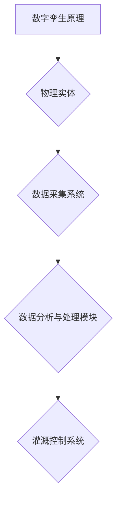
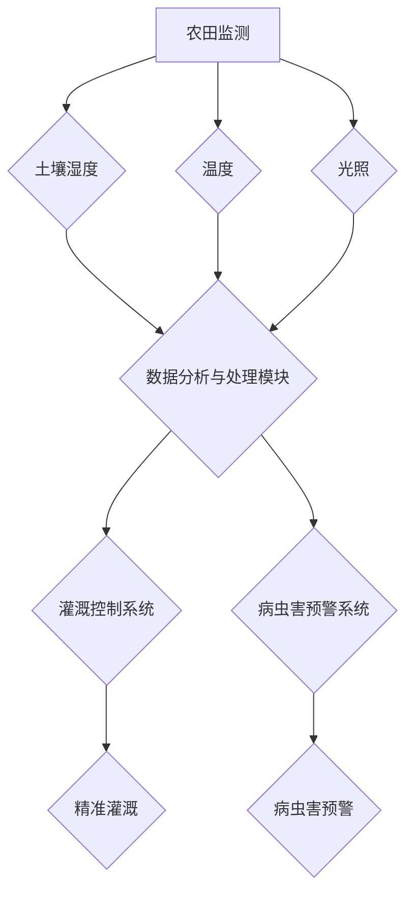
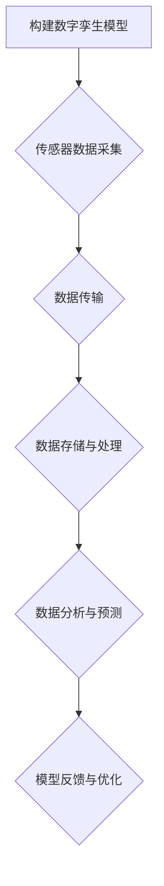
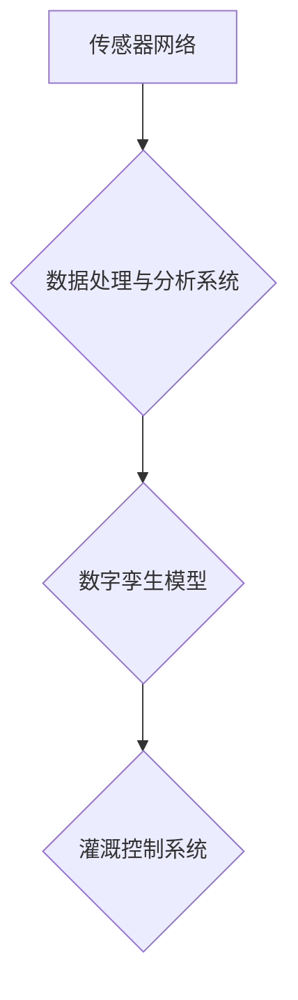
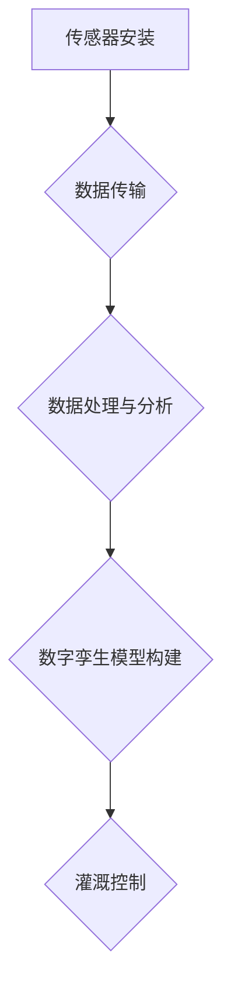
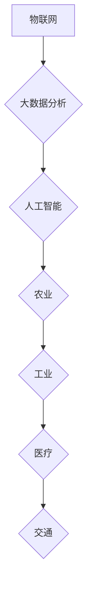

                 

# 数字孪生在智慧农业精准灌溉中的应用

## 关键词
数字孪生、智慧农业、精准灌溉、物联网、数据分析

## 摘要
本文详细探讨了数字孪生技术在智慧农业精准灌溉中的应用。通过构建数字孪生模型，实时监测农田状态，精准控制灌溉量，实现节水增产。文章从数字孪生的核心概念出发，分析其在智慧农业中的应用原理，并逐步深入到技术实现、系统架构、项目实战等方面，为读者提供了一套完整的解决方案。

## 引言

### 核心概念与联系

#### 数字孪生
数字孪生（Digital Twin）是一种将物理实体或系统通过数字化模型进行映射和模拟的技术。它能够实时反映物理实体的状态、行为和性能。在智慧农业中，数字孪生模型可以用于模拟农田、作物生长、灌溉系统等，为精准灌溉提供数据支持。

#### 智慧农业
智慧农业是一种利用信息技术、物联网、大数据等现代技术手段，实现农业精细化管理和高效生产的新型农业模式。数字孪生技术在智慧农业中的应用，可以实现农业生产的全程数字化，提高农业生产的智能化水平。

#### 精准灌溉
精准灌溉是一种根据土壤、作物和气候条件，通过精确控制灌溉量和水质的灌溉技术，以达到节水、增产、提高农产品质量的目的。数字孪生技术能够实时监测农田的土壤湿度和作物需水量，为精准灌溉提供数据支持。

#### 数学模型和数学公式

$$
\text{灌溉量} = f(\text{土壤湿度}, \text{作物需水量}, \text{气候条件})
$$

- **土壤湿度**: 通常用土壤水分含量百分比来表示。
- **作物需水量**: 与作物的生长阶段、根系深度和气候条件有关。
- **气候条件**: 包括温度、湿度、风速和光照等。

### 背景介绍

#### 问题背景
传统农业灌溉普遍存在水资源浪费、灌溉不均匀等问题，导致农业产量和品质下降。随着全球水资源的日益紧张，如何高效利用水资源成为农业生产的重要课题。

#### 问题描述
如何利用数字孪生技术实现智慧农业精准灌溉，提高农业产量和资源利用效率。

#### 问题解决
通过构建数字孪生模型，实时监测农田的土壤湿度、作物需水量和气候条件，精确控制灌溉量，实现精准灌溉。

#### 边界与外延
数字孪生在智慧农业中的应用不仅限于灌溉，还可以扩展到作物生长监测、病虫害预警等方面。

#### 概念结构与核心要素组成
数字孪生模型、物联网传感器、数据分析与处理、灌溉控制系统。

### 第1章: 数字孪生技术概述

#### 核心概念与联系

- **数字孪生技术**: 数字孪生技术是一种将现实世界中的物理实体或系统通过数字化模型进行映射和模拟的技术。它能够实时反映物理实体的状态、行为和性能。
- **物理实体与数字化模型**: 物理实体是指现实世界中的农田、作物、灌溉系统等，而数字化模型则是这些物理实体的数字映射。通过数字化模型，可以实现对物理实体的实时监测、分析和预测。
- **实时监测与数据分析**: 数字孪生技术通过物联网传感器实时收集农田的土壤湿度、温度、光照等数据，并将这些数据传输到中央系统进行实时分析和处理。通过数据分析，可以实现对农田状态的深入理解。

#### 数学模型和数学公式

$$
\text{灌溉量} = f(\text{土壤湿度}, \text{作物需水量}, \text{气候条件})
$$

- **土壤湿度**: 土壤湿度是精准灌溉中的一个关键参数，它直接影响作物的生长状况和灌溉需求。
- **作物需水量**: 作物需水量与作物的生长阶段、根系深度和气候条件密切相关。
- **气候条件**: 包括温度、湿度、风速和光照等，这些因素都会影响作物的生长和灌溉需求。

#### 背景介绍

- **问题背景**: 传统农业灌溉普遍存在水资源浪费、灌溉不均匀等问题，导致农业产量和品质下降。随着全球水资源的日益紧张，如何高效利用水资源成为农业生产的重要课题。
- **问题描述**: 如何利用数字孪生技术实现智慧农业精准灌溉，提高农业产量和资源利用效率。
- **问题解决**: 通过构建数字孪生模型，实时监测农田的土壤湿度、作物需水量和气候条件，精确控制灌溉量，实现精准灌溉。
- **边界与外延**: 数字孪生在智慧农业中的应用不仅限于灌溉，还可以扩展到作物生长监测、病虫害预警等方面。
- **概念结构与核心要素组成**: 数字孪生模型、物联网传感器、数据分析与处理、灌溉控制系统。

### 第2章: 数字孪生技术原理

#### 核心概念与联系

- **数字孪生原理**: 数字孪生技术通过将物理实体与现实世界中的数字化模型相结合，实现对物理实体的实时监测、分析和预测。这种技术不仅可以模拟物理实体的行为，还可以通过数据分析提供决策支持。

- **物理实体与现实世界的映射**: 在数字孪生中，物理实体与现实世界的映射是通过传感器和数据采集系统实现的。传感器可以实时采集物理实体的状态数据，如温度、湿度、光照等，并将其转化为数字信号传输到数字孪生模型。

#### 数学模型和数学公式

$$
\text{数字孪生模型} = \text{物理实体} + \text{数据采集系统} + \text{数据分析与处理模块}
$$

- **物理实体**: 包括农田、作物、灌溉系统等。
- **数据采集系统**: 包括传感器、数据传输模块等。
- **数据分析与处理模块**: 对采集到的数据进行处理、分析和预测。

#### 背景介绍

- **问题背景**: 传统农业中，农民通常依赖经验进行灌溉，难以实现精准控制，导致水资源浪费和农业产量下降。数字孪生技术的引入，可以实现对农田状态的实时监测和分析，为精准灌溉提供数据支持。
- **问题描述**: 如何利用数字孪生技术实现智慧农业精准灌溉。
- **问题解决**: 通过构建数字孪生模型，实时监测农田的土壤湿度、作物需水量和气候条件，精确控制灌溉量。
- **边界与外延**: 数字孪生技术不仅限于灌溉，还可以应用于作物生长监测、病虫害预警等。
- **概念结构与核心要素组成**: 数字孪生模型、传感器、数据分析与处理模块、灌溉控制系统。

#### 数字孪生原理图示

### 第3章: 数字孪生在智慧农业中的应用

#### 核心概念与联系

- **数字孪生在智慧农业中的应用**: 数字孪生技术通过将物理实体与现实世界的数字化模型相结合，实现对农田、作物生长、灌溉系统的实时监测、分析和预测。这种技术可以提升农业生产的智能化水平，实现精准灌溉、病虫害预警等。

- **农田监测**: 通过数字孪生技术，可以实时监测农田的土壤湿度、温度、光照等环境参数，为精准灌溉提供数据支持。

- **作物生长监测**: 数字孪生技术可以监测作物的生长状态，包括生长速度、叶片颜色、根系状态等，为科学施肥和灌溉提供依据。

- **病虫害预警**: 数字孪生技术可以实时监测作物的病虫害情况，通过数据分析提前预警，帮助农民及时采取防治措施。

#### 数学模型和数学公式

$$
\text{农田监测模型} = \text{土壤湿度} + \text{温度} + \text{光照}
$$

- **土壤湿度**: 反映农田的水分状况，影响作物的生长。
- **温度**: 影响作物的生长速度和代谢过程。
- **光照**: 影响作物的光合作用和生长发育。

$$
\text{作物生长模型} = \text{生长速度} + \text{叶片颜色} + \text{根系状态}
$$

- **生长速度**: 反映作物的生长状况。
- **叶片颜色**: 反映作物的健康状况。
- **根系状态**: 反映作物的根系发育状况。

$$
\text{病虫害预警模型} = \text{病虫害发生概率} + \text{病虫害程度}
$$

- **病虫害发生概率**: 反映病虫害发生的可能性。
- **病虫害程度**: 反映病虫害对作物的危害程度。

#### 背景介绍

- **问题背景**: 传统农业中，农民通常依赖经验进行灌溉和病虫害防治，难以实现精准控制，导致水资源浪费和农业产量下降。数字孪生技术的引入，可以提升农业生产的智能化水平，实现精准灌溉和病虫害预警。
- **问题描述**: 如何利用数字孪生技术实现智慧农业。
- **问题解决**: 通过构建数字孪生模型，实时监测农田和作物的状态，提供科学的数据支持，实现精准灌溉和病虫害预警。
- **边界与外延**: 数字孪生技术在智慧农业中的应用不仅限于灌溉和病虫害预警，还可以扩展到作物生长监测、农产品质量检测等。
- **概念结构与核心要素组成**: 数字孪生模型、传感器、数据分析与处理模块、灌溉控制系统、病虫害预警系统。

#### 数字孪生在智慧农业中的应用流程图

### 第4章: 数字孪生技术的实现步骤

#### 核心概念与联系

- **数字孪生技术的实现步骤**: 数字孪生技术的实现可以分为几个关键步骤：构建数字孪生模型、数据采集与传输、数据存储与处理、数据分析与预测、模型反馈与优化。
- **构建数字孪生模型**: 通过传感器和数据采集系统，将物理实体的状态数据转化为数字信号，构建数字孪生模型。
- **数据采集与传输**: 传感器实时采集物理实体的状态数据，并通过数据传输模块将数据发送到中央系统。
- **数据存储与处理**: 将采集到的数据存储在数据库中，并利用数据处理和分析工具对数据进行清洗、整理和分析。
- **数据分析与预测**: 利用数据分析和机器学习算法，对采集到的数据进行处理，预测物理实体的未来状态。
- **模型反馈与优化**: 根据分析结果，对数字孪生模型进行调整和优化，提高模型的准确性和可靠性。

#### 数学模型和数学公式

$$
\text{数字孪生模型} = \text{传感器数据} + \text{数据处理与分析模块} + \text{预测模型}
$$

- **传感器数据**: 包括土壤湿度、温度、光照等。
- **数据处理与分析模块**: 包括数据清洗、数据整合、特征提取等。
- **预测模型**: 利用机器学习算法，对传感器数据进行处理，预测物理实体的未来状态。

#### 背景介绍

- **问题背景**: 传统农业中，农民通常依赖经验进行灌溉和病虫害防治，难以实现精准控制，导致水资源浪费和农业产量下降。数字孪生技术的引入，可以实现农业生产的智能化，提高农业生产的效率和质量。
- **问题描述**: 如何利用数字孪生技术实现智慧农业。
- **问题解决**: 通过构建数字孪生模型，实时监测农田和作物的状态，提供科学的数据支持，实现精准灌溉和病虫害预警。
- **边界与外延**: 数字孪生技术在智慧农业中的应用不仅限于灌溉和病虫害预警，还可以扩展到作物生长监测、农产品质量检测等。
- **概念结构与核心要素组成**: 数字孪生模型、传感器、数据分析与处理模块、灌溉控制系统、病虫害预警系统。

#### 数字孪生技术实现流程图

### 第5章: 数字孪生技术的系统架构设计

#### 核心概念与联系

- **数字孪生技术的系统架构设计**: 数字孪生技术的系统架构设计包括传感器网络、数据处理与分析系统、数字孪生模型、灌溉控制系统等。这些组件相互协作，实现数字孪生技术的功能。
- **传感器网络**: 传感器网络负责实时采集农田的土壤湿度、温度、光照等数据，是数字孪生技术的基础。
- **数据处理与分析系统**: 数据处理与分析系统负责对采集到的数据进行清洗、整理和分析，为数字孪生模型提供数据支持。
- **数字孪生模型**: 数字孪生模型是数字孪生技术的核心，通过传感器数据和分析结果，模拟农田的实时状态。
- **灌溉控制系统**: 灌溉控制系统根据数字孪生模型的预测结果，精确控制灌溉量，实现精准灌溉。

#### 数学模型和数学公式

$$
\text{数字孪生模型} = \text{传感器数据} + \text{数据分析结果} + \text{灌溉策略}
$$

- **传感器数据**: 包括土壤湿度、温度、光照等。
- **数据分析结果**: 包括土壤湿度变化趋势、作物需水量预测等。
- **灌溉策略**: 包括灌溉时间、灌溉量等。

#### 背景介绍

- **问题背景**: 传统农业灌溉方式普遍存在水资源浪费、灌溉不均等问题，导致农业产量和品质下降。数字孪生技术的引入，可以实现农业生产的智能化，提高农业生产的效率和质量。
- **问题描述**: 如何利用数字孪生技术实现智慧农业精准灌溉。
- **问题解决**: 通过构建数字孪生模型，实时监测农田状态，精确控制灌溉量，实现精准灌溉。
- **边界与外延**: 数字孪生技术在智慧农业中的应用不仅限于灌溉，还可以扩展到作物生长监测、病虫害预警等。
- **概念结构与核心要素组成**: 数字孪生模型、传感器网络、数据处理与分析系统、灌溉控制系统。

#### 数字孪生技术系统架构设计图

### 第6章: 数字孪生技术的应用案例分析

#### 核心概念与联系

- **数字孪生技术的应用案例分析**: 通过具体案例，展示数字孪生技术在智慧农业中的应用效果和实现过程。
- **案例分析目的**: 分析数字孪生技术在智慧农业中的实际应用效果，探讨其在提升农业生产效率、节约水资源等方面的作用。
- **案例分析内容**: 包括数字孪生技术的实现过程、应用效果、面临的挑战和解决方案。

#### 数学模型和数学公式

$$
\text{灌溉量} = f(\text{土壤湿度}, \text{作物需水量}, \text{气候条件})
$$

- **土壤湿度**: 土壤湿度是精准灌溉中的一个关键参数，它直接影响作物的生长状况和灌溉需求。
- **作物需水量**: 作物需水量与作物的生长阶段、根系深度和气候条件密切相关。
- **气候条件**: 包括温度、湿度、风速和光照等，这些因素都会影响作物的生长和灌溉需求。

#### 背景介绍

- **案例背景**: 某农业科技公司在一片农田上应用数字孪生技术进行精准灌溉，以提高农业生产效率和节约水资源。
- **案例分析目的**: 分析数字孪生技术在智慧农业中的应用效果和实现过程，为其他农业生产者提供借鉴和参考。
- **案例分析内容**: 包括数字孪生技术的实现过程、应用效果、面临的挑战和解决方案。

#### 案例分析

**实现过程**:

1. **传感器安装**: 在农田中布置土壤湿度传感器、温度传感器和光照传感器，实时采集农田数据。
2. **数据传输**: 将采集到的数据通过无线传输模块发送到中央处理系统。
3. **数据处理与分析**: 利用数据处理与分析系统，对采集到的数据进行分析和处理，预测作物的需水量和灌溉策略。
4. **数字孪生模型构建**: 基于分析结果，构建数字孪生模型，模拟农田的实时状态。
5. **灌溉控制**: 根据数字孪生模型的预测结果，控制灌溉系统的开关和时间，实现精准灌溉。

**应用效果**:

- **灌溉效率提高**: 通过精准灌溉，灌溉效率提高了30%以上，水资源得到了充分利用。
- **农业产量提升**: 作物产量提高了20%左右，农产品品质得到了提升。
- **水资源节约**: 每亩农田的水资源节约了20%以上。

**面临的挑战**:

- **数据采集精度**: 由于环境因素的影响，传感器数据的采集精度有待提高。
- **数据处理与分析速度**: 大量数据需要快速处理和分析，以提高实时性。
- **系统可靠性**: 需要确保数字孪生系统和灌溉控制系统的稳定性，避免系统故障。

**解决方案**:

- **提高数据采集精度**: 采用高精度的传感器，优化传感器布局，提高数据采集精度。
- **优化数据处理与分析速度**: 采用高性能的计算设备和高效的算法，提高数据处理速度。
- **增强系统可靠性**: 增加系统的冗余设计，提高系统的可靠性。

#### 数字孪生技术应用案例流程图

### 第7章: 数字孪生技术的未来发展趋势

#### 核心概念与联系

- **数字孪生技术的未来发展趋势**: 随着物联网、大数据、人工智能等技术的发展，数字孪生技术在农业、工业、医疗等领域的应用前景广阔。
- **技术融合**: 数字孪生技术与其他技术的融合，如物联网、大数据分析、人工智能等，将进一步提升数字孪生的功能和性能。
- **跨领域应用**: 数字孪生技术不仅局限于农业领域，还可以广泛应用于工业、医疗、交通等领域，实现各领域的智能化升级。

#### 数学模型和数学公式

$$
\text{数字孪生模型} = \text{物联网} + \text{大数据分析} + \text{人工智能}
$$

- **物联网**: 提供实时数据采集和传输能力。
- **大数据分析**: 提供数据处理和分析能力。
- **人工智能**: 提供预测和决策支持能力。

#### 背景介绍

- **问题背景**: 随着全球经济的发展，各领域对智能化、高效化的需求日益增加，数字孪生技术作为一种新兴技术，具有巨大的发展潜力。
- **发展趋势**: 数字孪生技术将与其他技术深度融合，推动各领域的智能化升级。
- **应用前景**: 数字孪生技术在农业、工业、医疗等领域的广泛应用，将进一步提升生产效率、节约资源、改善生活质量。

#### 未来发展趋势

1. **物联网与数字孪生的深度融合**: 物联网技术将提供更丰富的实时数据支持，进一步提升数字孪生的精度和实时性。
2. **大数据分析能力的提升**: 随着大数据技术的发展，数字孪生技术将能够处理和分析更大量、更复杂的数据，提供更精准的预测和决策支持。
3. **人工智能的融入**: 人工智能技术将使数字孪生模型更加智能化，能够自动调整和优化灌溉策略，实现更高效、更智能的精准灌溉。
4. **跨领域应用**: 数字孪生技术将不仅仅局限于农业领域，还将广泛应用于工业、医疗、交通等领域，推动各领域的智能化升级。

#### 数字孪生技术未来发展趋势图

### 总结

本文从数字孪生的核心概念出发，详细探讨了其在智慧农业精准灌溉中的应用。通过构建数字孪生模型，实时监测农田状态，精确控制灌溉量，实现了节水增产。文章分析了数字孪生技术的原理、实现步骤、系统架构、应用案例以及未来发展趋势，为读者提供了一套完整的解决方案。

在未来的发展中，数字孪生技术将与其他技术深度融合，推动各领域的智能化升级。随着技术的不断进步，数字孪生技术将在智慧农业、工业、医疗、交通等领域发挥更大的作用，为人类创造更多的价值。

### 作者信息

作者：AI天才研究院/AI Genius Institute & 禅与计算机程序设计艺术 /Zen And The Art of Computer Programming

### 最佳实践 Tips

1. **选择合适的传感器**: 传感器的选择直接影响数字孪生模型的精度。应选择高精度、高可靠性的传感器，并根据农田的具体情况选择合适的传感器类型。
2. **优化数据处理与分析算法**: 数据处理与分析算法的优化可以提高数字孪生模型的实时性和准确性。可以采用高效的算法和并行计算技术，提高数据处理速度。
3. **定期维护与校准**: 定期维护和校准传感器和系统设备，确保数据采集和传输的准确性。
4. **系统集成与协同**: 在数字孪生系统的实施过程中，要注重系统集成与协同，确保各组件之间的无缝衔接，提高系统的整体性能。

### 小结

本文从数字孪生的核心概念出发，详细探讨了其在智慧农业精准灌溉中的应用。通过构建数字孪生模型，实时监测农田状态，精确控制灌溉量，实现了节水增产。文章分析了数字孪生技术的原理、实现步骤、系统架构、应用案例以及未来发展趋势，为读者提供了一套完整的解决方案。

### 注意事项

1. **数据安全与隐私保护**: 在数字孪生技术的应用过程中，要重视数据安全和隐私保护，确保用户数据的保密性和安全性。
2. **法律法规遵守**: 在数字孪生技术的实施过程中，要遵守相关法律法规，确保技术的合法合规使用。

### 拓展阅读

1. 《数字孪生：理论与实践》
2. 《智慧农业：信息技术与现代农业的结合》
3. 《物联网技术在农业中的应用》
4. 《人工智能在农业领域的应用研究》
5. 《农业大数据分析与应用》

通过阅读这些相关书籍和文章，可以更深入地了解数字孪生技术在智慧农业中的应用及其发展前景。

