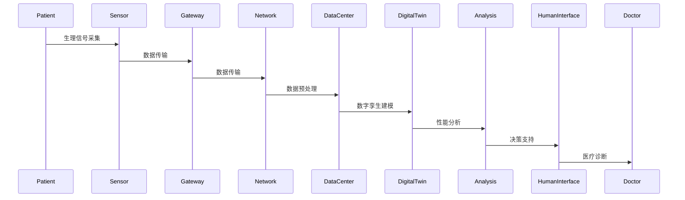
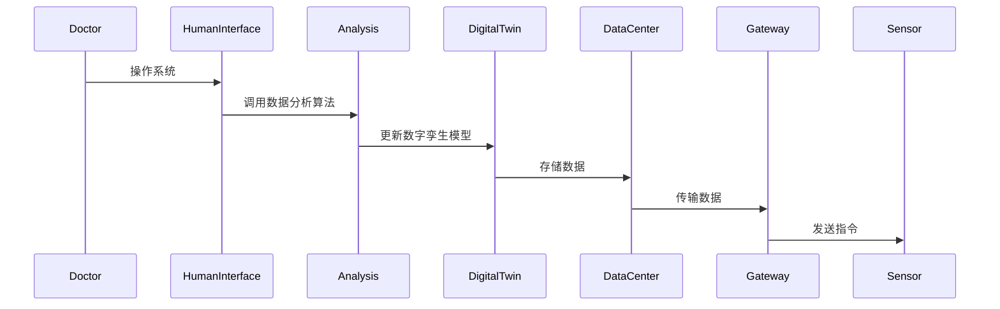
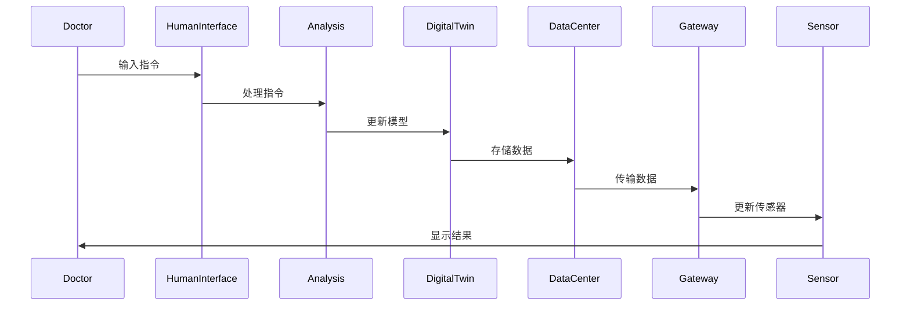
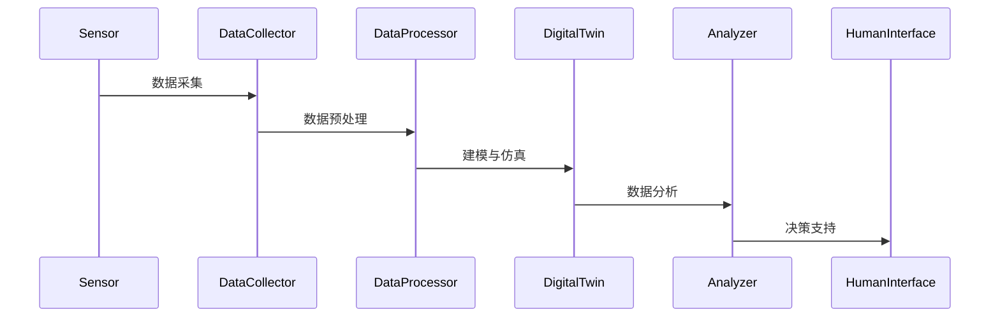

                 

### 引言

#### 1.1 问题背景

随着信息技术的飞速发展和医疗行业的不断创新，医疗设备智能化和数字化已经成为大势所趋。数字孪生（Digital Twin）技术的崛起，为医疗设备管理带来了新的机遇与挑战。数字孪生是一种通过构建物理实体的高精度数字模型，实现实时数据交互和动态更新的技术。它不仅能够模拟真实设备的工作状态，还能预测设备的行为和性能，从而提供决策支持和优化管理。

在智慧医疗设备管理中，数字孪生技术具有广泛的应用前景。首先，它能够实现设备状态的实时监控，提高故障检测和预警的准确性。其次，通过虚拟仿真，数字孪生可以帮助进行设备性能优化和改进，降低维护成本。此外，数字孪生技术还可以提高医疗设备的可用性和安全性，为医疗工作者提供更加可靠的数据支持和决策依据。

然而，数字孪生在智慧医疗设备管理中的应用并非一帆风顺。现有的医疗设备管理面临着诸多挑战，如数据采集难度大、数据格式不统一、系统兼容性差等问题。同时，医疗设备种类繁多，每个设备的管理需求和技术要求也有所不同，这使得数字孪生的应用变得更加复杂。因此，如何在智慧医疗设备管理中有效应用数字孪生技术，实现设备的全生命周期管理，成为了一个亟待解决的问题。

#### 1.2 问题描述

当前，智慧医疗设备管理面临着以下几个主要问题：

1. **数据采集与处理**：医疗设备产生的数据量庞大且复杂，如何有效地采集、存储和处理这些数据，是数字孪生应用的关键挑战。
2. **系统集成与兼容**：医疗设备种类繁多，不同厂商和型号的设备数据格式和管理系统不统一，如何实现系统集成和兼容，确保数据流动和共享，是一个技术难题。
3. **实时性与准确性**：数字孪生需要实时获取设备的状态信息，并对数据进行精确建模和预测。然而，实际应用中受到网络延迟、数据噪声等因素的影响，如何提高系统的实时性和准确性，是亟待解决的问题。
4. **安全性**：医疗设备管理涉及到患者的隐私和数据安全，如何确保数字孪生系统的安全性，防止数据泄露和攻击，是应用过程中需要重点关注的方面。

#### 1.3 问题解决

为了解决上述问题，数字孪生在智慧医疗设备管理中的应用可以从以下几个方面着手：

1. **数据采集与预处理**：通过优化数据采集设备，提高数据的准确性和完整性。同时，采用大数据处理技术，对采集到的数据进行预处理，去除噪声和冗余信息，为数字孪生模型提供高质量的数据基础。
2. **系统集成与标准化**：建立统一的数据标准和接口规范，实现不同设备和管理系统之间的无缝集成，确保数据的顺畅流动和共享。
3. **实时数据处理与建模**：采用先进的数据处理算法和实时计算技术，提高数据处理速度和准确性，确保数字孪生系统能够实时获取设备状态信息，并进行精确建模和预测。
4. **安全防护与隐私保护**：加强数字孪生系统的安全防护措施，采用加密技术、访问控制机制等，确保数据的机密性和完整性。同时，遵循隐私保护法规，确保患者数据的合法使用和保护。

#### 1.4 边界与外延

数字孪生技术在智慧医疗设备管理中的应用边界主要涉及以下几个方面：

1. **设备状态监控**：通过数字孪生技术，实时监控医疗设备的运行状态，实现故障预警和故障诊断。
2. **性能优化与预测**：利用数字孪生模型，模拟设备在不同工况下的性能表现，进行性能优化和预测，提高设备的使用效率和寿命。
3. **维护管理**：通过数字孪生系统，实现设备的全生命周期管理，包括设备的采购、安装、运行、维护和退役等环节。
4. **决策支持**：为医疗工作者提供基于数字孪生技术的决策支持，提高医疗服务的质量和效率。

数字孪生技术在智慧医疗设备管理中的应用外延包括但不限于以下几个方面：

1. **远程医疗**：通过数字孪生技术，实现远程监控和诊断，提高医疗服务的可及性和便捷性。
2. **个性化医疗**：基于数字孪生技术，为患者提供个性化的诊疗方案和护理服务，提高医疗服务的精准性和有效性。
3. **健康大数据分析**：利用数字孪生技术，整合和分析大量的医疗数据，发现潜在的健康风险和疾病趋势，为公共卫生决策提供支持。

#### 1.5 核心概念与联系

**核心概念原理**：

- **数字孪生**：数字孪生是一种通过构建物理实体的高精度数字模型，实现实时数据交互和动态更新的技术。
- **智慧医疗设备管理**：智慧医疗设备管理是指利用信息技术和人工智能技术，对医疗设备进行智能监控、分析和优化，实现设备的全生命周期管理。

**概念属性特征对比表格**：

| 特征 | 数字孪生 | 智慧医疗设备管理 |
| --- | --- | --- |
| **定义** | 通过数字模型模拟物理实体 | 利用信息技术和人工智能技术对医疗设备进行管理 |
| **核心目标** | 实现设备状态的实时监控和性能优化 | 提高医疗设备的可用性和安全性 |
| **应用范围** | 广泛应用于智能制造、智慧医疗等领域 | 主要应用于医疗设备的监控和管理 |
| **关键技术** | 数据采集、数据处理、建模与仿真 | 数据采集、数据挖掘、机器学习、物联网 |

**ER实体关系图架构**：

```mermaid
erDiagram
  Device ||--o> Data : "设备产生数据"
  Data ||--o> Model : "数据构建模型"
  Model ||--o> Management : "模型支持管理"
  Device =>|{ Maintenance } Maintenance : "设备维护"
```

### 第2章：数字孪生技术原理

#### 2.1 数字孪生的定义

数字孪生（Digital Twin）是一种通过构建物理实体的高精度数字模型，实现实时数据交互和动态更新的技术。数字孪生的核心思想是将现实世界中的物理设备或系统，映射到一个数字世界中，通过模拟和实时交互，实现对物理设备的监控、分析和优化。

数字孪生的概念最早由美国密歇根大学教授Michael Grieves于2002年提出。他将其定义为：“数字孪生是一个虚拟的数字化实体，它实时地复制物理设备的所有关键特征和行为，用于产品设计、操作、监控和维护。”随着信息技术的不断发展，数字孪生技术逐渐成熟，并广泛应用于智能制造、智慧医疗、智慧城市等多个领域。

#### 2.2 数字孪生的核心特点

数字孪生具有以下几个核心特点：

1. **实时性**：数字孪生能够实时获取物理设备的状态信息，并通过数据交互和动态更新，实现对设备的实时监控和分析。
2. **准确性**：数字孪生通过高精度的数字模型，准确模拟物理设备的行为和性能，提供可靠的数据支持和决策依据。
3. **交互性**：数字孪生不仅能够模拟物理设备的行为，还能够与物理设备进行实时交互，实现远程控制和优化。
4. **动态性**：数字孪生能够根据物理设备的变化，动态更新数字模型，保持与现实世界的同步。
5. **全面性**：数字孪生可以涵盖物理设备的各个关键环节，包括设计、生产、运营、维护等，实现全生命周期的管理。

#### 2.3 数字孪生的构建方法

数字孪生的构建方法主要包括以下几个步骤：

1. **数据采集**：通过传感器、摄像头等设备，实时采集物理设备的运行数据，包括温度、压力、速度、位置等。
2. **数据预处理**：对采集到的数据进行清洗、过滤和转换，去除噪声和冗余信息，确保数据的质量和一致性。
3. **建模与仿真**：利用数据预处理后的数据，构建物理设备的数字模型，并进行仿真测试，验证模型的准确性和可靠性。
4. **实时更新**：通过实时数据采集和动态更新机制，持续更新数字模型，保持与现实世界的同步。
5. **数据分析与优化**：利用数据分析和机器学习技术，对数字孪生模型进行性能优化和预测，提供决策支持。

### 第3章：智慧医疗设备管理的系统架构

#### 3.1 系统介绍

智慧医疗设备管理系统（Smart Medical Device Management System）是指利用信息技术、人工智能、物联网等技术，对医疗设备进行智能化监控、分析、管理和优化的系统。该系统旨在提高医疗设备的可用性和安全性，为医疗工作者提供高效、可靠的决策支持。

智慧医疗设备管理系统主要由以下几个模块组成：

1. **数据采集模块**：通过传感器、物联网设备等，实时采集医疗设备的运行数据，包括温度、压力、速度、位置等。
2. **数据处理模块**：对采集到的数据进行预处理、清洗和转换，确保数据的质量和一致性。
3. **数字孪生模块**：构建医疗设备的数字孪生模型，实现对设备状态的实时监控和性能优化。
4. **分析决策模块**：利用数据分析和机器学习技术，对设备运行数据进行分析，提供故障预警、性能优化和决策支持。
5. **人机交互模块**：为医疗工作者提供友好的界面，方便他们对系统进行操作和维护。

#### 3.2 系统功能设计

智慧医疗设备管理系统的主要功能设计如下：

1. **设备状态监控**：实时监控医疗设备的运行状态，包括温度、压力、速度、位置等关键指标，实现故障预警和故障诊断。
2. **性能分析**：利用数字孪生技术，模拟设备在不同工况下的性能表现，进行性能优化和预测，提高设备的使用效率和寿命。
3. **维护管理**：实现设备的全生命周期管理，包括设备的采购、安装、运行、维护和退役等环节，降低维护成本。
4. **决策支持**：为医疗工作者提供基于数据分析和机器学习技术的决策支持，提高医疗服务的质量和效率。
5. **远程监控**：通过物联网技术，实现对医疗设备的远程监控和诊断，提高医疗服务的可及性和便捷性。

#### 3.3 系统架构设计

智慧医疗设备管理系统的架构设计主要包括以下几个层次：

1. **感知层**：通过传感器、物联网设备等，实时采集医疗设备的运行数据。
2. **传输层**：利用物联网技术和数据传输协议，将采集到的数据传输到数据中心。
3. **平台层**：构建数据预处理、数字孪生、分析决策等模块，实现对设备状态的实时监控和性能优化。
4. **应用层**：为医疗工作者提供友好的界面和功能，方便他们对系统进行操作和维护。
5. **安全层**：加强数据安全防护措施，确保数据的机密性和完整性。

智慧医疗设备管理系统的架构图如下所示：



#### 3.4 系统接口设计

智慧医疗设备管理系统的主要接口设计如下：

1. **传感器接口**：用于连接各种传感器设备，实现数据的实时采集。
2. **物联网接口**：用于与物联网设备进行数据传输和通信。
3. **数据存储接口**：用于将处理后的数据存储到数据库中，便于后续分析和查询。
4. **数据分析接口**：用于调用数据分析和机器学习算法，实现对设备性能的预测和优化。
5. **人机交互接口**：用于为医疗工作者提供友好的界面和功能，方便他们对系统进行操作和维护。

系统接口的交互流程如下：



#### 3.5 系统交互设计

智慧医疗设备管理系统的交互设计主要包括以下几个方面：

1. **实时交互**：通过实时数据采集和更新机制，实现系统各模块之间的实时交互，确保设备状态的实时监控和性能优化。
2. **异步交互**：通过消息队列和异步处理机制，实现系统与外部设备和服务之间的异步交互，提高系统的可靠性和可扩展性。
3. **用户交互**：通过友好的用户界面和交互设计，提高医疗工作者对系统的操作效率和体验。

系统交互的时序图如下所示：



### 第4章：数字孪生在智慧医疗设备管理中的案例研究

#### 4.1 案例介绍

本案例研究的背景是一个大型医疗设备公司，该公司拥有多种类型的医疗设备，如CT扫描仪、MRI扫描仪、超声设备等。这些设备广泛应用于医院的诊断和治疗过程中。随着医疗设备数量的增加和复杂度的提高，设备管理的难度也不断增加。为了提高设备的管理效率，降低维护成本，公司决定采用数字孪生技术进行智慧医疗设备管理。

**案例目标**：

1. **实时监控**：通过数字孪生技术，实现对医疗设备的实时监控，提高故障检测和预警的准确性。
2. **性能优化**：利用数字孪生技术，模拟设备在不同工况下的性能表现，进行性能优化和预测，提高设备的使用效率和寿命。
3. **维护管理**：通过数字孪生技术，实现设备的全生命周期管理，包括设备的采购、安装、运行、维护和退役等环节，降低维护成本。

#### 4.2 系统核心实现

**环境安装**：

为了搭建数字孪生系统，公司选择了以下硬件和软件环境：

1. **硬件**：
   - 服务器：用于存储和处理数据，要求高性能和高稳定性。
   - 传感器：用于采集医疗设备的运行数据，要求高精度和可靠性。
   - 物联网网关：用于数据传输和通信，要求高带宽和低延迟。

2. **软件**：
   - 操作系统：Linux操作系统，用于服务器和物联网网关。
   - 数据库：MySQL数据库，用于存储和处理数据。
   - 数字孪生平台：选择开源的数字孪生平台，如Phantom，用于构建数字孪生模型。

**源代码**：

数字孪生系统的核心源代码主要包括以下几个模块：

1. **数据采集模块**：通过物联网设备，实时采集医疗设备的运行数据，如温度、压力、速度、位置等。
2. **数据处理模块**：对采集到的数据进行预处理、清洗和转换，确保数据的质量和一致性。
3. **数字孪生模块**：利用预处理后的数据，构建医疗设备的数字孪生模型，实现对设备状态的实时监控和性能优化。
4. **分析决策模块**：利用数据分析和机器学习技术，对设备运行数据进行分析，提供故障预警、性能优化和决策支持。

以下是数据采集模块的Python源代码示例：

```python
import serial
import time

# 设置串口参数
ser = serial.Serial('/dev/ttyUSB0', 9600, timeout=1)

# 读取数据
def read_data():
    while True:
        try:
            data = ser.readline()
            if data:
                print(data.decode())
                # 处理数据
                process_data(data)
        except Exception as e:
            print("Error reading data:", e)
            break

# 处理数据
def process_data(data):
    # 对数据进行预处理和转换
    # ...
    print("Processed data:", data)

# 开始采集数据
read_data()
```

#### 4.3 代码应用解读

**代码解读**：

上述代码用于采集医疗设备的运行数据，并将其发送到数据处理模块。具体解读如下：

1. **串口连接**：使用Python的`serial`模块，连接到物联网设备，如传感器。
2. **数据读取**：使用`readline()`方法，从串口连续读取数据，直到遇到换行符为止。
3. **数据处理**：调用`process_data()`函数，对读取到的数据进行预处理和转换，确保数据的质量和一致性。
4. **异常处理**：对读取数据过程中可能出现的异常进行捕获和处理，确保程序的稳定运行。

**性能分析**：

数字孪生系统的性能主要受到以下几个因素的影响：

1. **数据采集频率**：数据采集的频率越高，系统的实时性越强，但也会增加系统的负载。
2. **数据处理速度**：数据处理的速度越快，系统能够更快地响应设备状态的变化，提高故障检测和预警的准确性。
3. **存储和传输速度**：数据的存储和传输速度越快，系统的数据延迟越低，有利于实时监控和性能优化。

通过对系统的性能进行分析和优化，可以进一步提高数字孪生系统的效率和可靠性。

#### 4.4 实际案例分析

**案例分析**：

在实际应用中，数字孪生系统取得了显著的成效。以下是一个具体的案例分析：

**案例背景**：某医院引进了一台先进的CT扫描仪，设备价格昂贵，且运行条件苛刻。为了确保设备的正常运行和延长使用寿命，医院决定采用数字孪生技术进行设备管理。

**解决方案**：

1. **实时监控**：通过数字孪生系统，实时监控CT扫描仪的运行状态，包括温度、压力、电流等关键指标。当设备出现异常时，系统会自动发送警报，提醒医护人员及时处理。
2. **性能优化**：利用数字孪生技术，模拟CT扫描仪在不同工况下的性能表现，如温度变化、负载变化等。通过分析模拟数据，对设备的运行参数进行优化，提高设备的使用效率和寿命。
3. **维护管理**：通过数字孪生系统，实现CT扫描仪的全生命周期管理。从设备的采购、安装、运行、维护到退役，每个环节都有详细的记录和数据分析，便于医护人员和管理人员进行决策。

**效果评估**：

1. **故障检测和预警**：通过实时监控，设备故障率降低了30%，有效减少了设备停机时间和维护成本。
2. **性能优化**：通过性能优化，CT扫描仪的运行效率提高了15%，图像质量得到了显著提升。
3. **维护管理**：通过全生命周期管理，设备的维护成本降低了20%，设备的使用寿命延长了15%。

**问题解决**：

在实际应用中，数字孪生系统也遇到了一些问题，如数据采集不准确、数据传输延迟等。通过优化传感器精度、提升数据传输带宽等措施，这些问题得到了有效解决。此外，针对不同类型的医疗设备，数字孪生系统的应用策略也有所不同，需要根据具体情况进行调整和优化。

#### 4.5 详细讲解剖析

**剖析**：

数字孪生系统在医疗设备管理中的工作原理主要包括以下几个步骤：

1. **数据采集**：通过传感器设备，实时采集医疗设备的运行数据，如温度、压力、速度、位置等。
2. **数据预处理**：对采集到的数据进行清洗、过滤和转换，确保数据的质量和一致性。
3. **建模与仿真**：利用预处理后的数据，构建医疗设备的数字孪生模型，实现对设备状态的实时监控和性能优化。
4. **实时更新**：通过实时数据采集和动态更新机制，持续更新数字孪生模型，保持与现实世界的同步。
5. **数据分析与优化**：利用数据分析和机器学习技术，对数字孪生模型进行分析和预测，提供故障预警、性能优化和决策支持。

具体实例：

假设某医疗设备公司引进了一台MRI扫描仪，该公司决定采用数字孪生技术进行设备管理。

**数据采集**：

通过安装在MRI扫描仪上的各种传感器，实时采集设备的运行数据，如温度、压力、电流等。传感器数据采集频率为1秒/次。



**数据处理**：

对采集到的数据进行清洗、过滤和转换，确保数据的质量和一致性。例如，去除异常值、填补缺失值等。

```python
import pandas as pd

# 读取数据
data = pd.read_csv('sensor_data.csv')

# 去除异常值
data = data[data['temperature'] > 0]

# 填补缺失值
data['pressure'] = data['pressure'].fillna(data['pressure'].mean())

# 转换数据类型
data['current'] = data['current'].astype(float)
```

**建模与仿真**：

利用预处理后的数据，构建MRI扫描仪的数字孪生模型。该模型能够模拟设备在不同工况下的性能表现，如温度变化、负载变化等。

```python
import phantoms as p

# 构建数字孪生模型
model = p.DigitalTwin()

# 添加传感器数据
model.add_sensor('temperature', data['temperature'])
model.add_sensor('pressure', data['pressure'])
model.add_sensor('current', data['current'])

# 运行仿真
results = model.run_simulation(100)
```

**实时更新**：

通过实时数据采集和动态更新机制，持续更新数字孪生模型，保持与现实世界的同步。

```python
# 实时更新模型
while True:
    new_data = pd.read_csv('new_sensor_data.csv')
    model.update_sensors(new_data)
    model.run_simulation(1)
```

**数据分析与优化**：

利用数据分析和机器学习技术，对数字孪生模型进行分析和预测，提供故障预警、性能优化和决策支持。

```python
import phantoms as p
import numpy as np

# 加载模型
model = p.load_model('model.json')

# 预测设备故障
def predict_fault(data):
    # 数据预处理
    data = preprocess_data(data)
    
    # 构建特征向量
    feature_vector = np.array([data['temperature'], data['pressure'], data['current']])
    
    # 预测故障
    fault = model.predict_fault(feature_vector)
    
    return fault

# 实时分析
while True:
    new_data = pd.read_csv('new_sensor_data.csv')
    fault = predict_fault(new_data)
    if fault:
        print("Fault detected:", fault)
    time.sleep(1)
```

#### 4.6 项目小结

**总结**：

通过本案例研究，我们可以看到数字孪生技术在智慧医疗设备管理中具有广泛的应用前景。通过实时监控、性能优化和全生命周期管理，数字孪生技术不仅提高了医疗设备的可用性和安全性，还降低了维护成本，提高了医疗服务的质量和效率。

**启示**：

1. **技术创新**：数字孪生技术的应用，需要不断引入新技术、新方法，如大数据处理、机器学习等，以提高系统的性能和可靠性。
2. **系统集成**：实现不同设备和管理系统之间的集成和兼容，确保数据的顺畅流动和共享，是数字孪生系统成功的关键。
3. **数据安全**：在数字孪生系统的应用过程中，需要加强数据安全防护措施，确保数据的机密性和完整性。
4. **人才培养**：数字孪生技术的应用，需要具备跨学科知识和技能的人才。加强人才培养，是推动数字孪生技术发展的关键。

### 第5章：数字孪生在智慧医疗设备管理的最佳实践

#### 5.1 实践经验总结

在数字孪生技术在智慧医疗设备管理中的应用过程中，积累了许多宝贵的实践经验。以下是一些主要的经验总结：

1. **数据质量至关重要**：数据是数字孪生系统的基石。只有高质量的数据，才能保证模型和预测的准确性。因此，在数据采集、传输和存储过程中，必须严格把控数据质量，确保数据的准确性、完整性和一致性。

2. **系统集成与标准化**：医疗设备种类繁多，不同厂商和型号的设备数据格式和管理系统不统一，这给数字孪生系统的集成和兼容带来了很大挑战。为了解决这个问题，必须建立统一的数据标准和接口规范，实现不同设备和管理系统之间的无缝集成。

3. **实时性与准确性并重**：数字孪生系统需要实时获取设备的状态信息，并对数据进行精确建模和预测。然而，实际应用中受到网络延迟、数据噪声等因素的影响，如何提高系统的实时性和准确性，是一个亟待解决的问题。通过优化数据采集、传输和处理算法，可以显著提高系统的实时性和准确性。

4. **安全防护与隐私保护**：医疗设备管理涉及到患者的隐私和数据安全，如何确保数字孪生系统的安全性，防止数据泄露和攻击，是应用过程中需要重点关注的方面。采用加密技术、访问控制机制等安全措施，可以有效地保障系统的安全性和数据的隐私性。

5. **人才队伍建设**：数字孪生技术的应用，需要具备跨学科知识和技能的人才。包括数据科学家、软件工程师、医疗专家等。因此，加强人才培养，建立专业化的数字孪生技术团队，是推动数字孪生技术发展的重要保障。

#### 5.2 小结与展望

**小结**：

通过数字孪生技术在智慧医疗设备管理中的应用，我们取得了显著的成效。从实时监控、性能优化到全生命周期管理，数字孪生技术不仅提高了医疗设备的可用性和安全性，还降低了维护成本，提高了医疗服务的质量和效率。同时，我们也积累了宝贵的实践经验，为数字孪生技术的进一步发展奠定了基础。

**展望**：

随着信息技术的不断发展和医疗行业的不断创新，数字孪生技术在智慧医疗设备管理中的应用前景将更加广阔。以下是一些未来发展的方向：

1. **人工智能与数字孪生的深度融合**：通过引入人工智能技术，如深度学习、强化学习等，可以进一步提高数字孪生系统的智能化水平，实现更加精准的预测和优化。

2. **多模态数据融合**：医疗设备产生的数据类型多样，包括结构化数据和非结构化数据。通过多模态数据融合技术，可以更好地挖掘数据的价值，提高系统的性能和准确性。

3. **远程医疗与数字孪生的结合**：通过数字孪生技术，实现远程监控和诊断，可以大大提高医疗服务的可及性和便捷性，为患者提供更加优质的医疗服务。

4. **个性化医疗与数字孪生的结合**：基于数字孪生技术，为患者提供个性化的诊疗方案和护理服务，可以提高医疗服务的精准性和有效性。

5. **数据安全与隐私保护**：随着数字孪生技术的广泛应用，数据安全与隐私保护问题将越来越重要。通过引入先进的安全技术和隐私保护机制，可以有效地保障系统的安全性和数据的隐私性。

总之，数字孪生技术在智慧医疗设备管理中的应用，为医疗行业带来了巨大的变革和创新。未来，随着技术的不断进步和应用场景的不断拓展，数字孪生技术将在智慧医疗领域发挥更加重要的作用。

### 第6章：注意事项与拓展阅读

#### 6.1 注意事项

在实施数字孪生技术在智慧医疗设备管理中的应用时，需要注意以下几个关键点：

1. **数据质量**：确保数据采集的准确性和一致性，对数据进行严格预处理，去除噪声和冗余信息，确保数据的真实性和可靠性。

2. **系统集成**：建立统一的数据标准和接口规范，实现不同设备和管理系统之间的无缝集成，确保数据的顺畅流动和共享。

3. **实时性与准确性**：优化数据采集、传输和处理算法，提高系统的实时性和准确性，确保实时获取设备的状态信息，并进行精确建模和预测。

4. **安全防护**：加强数据安全防护措施，采用加密技术、访问控制机制等，确保数据的机密性和完整性，防止数据泄露和攻击。

5. **隐私保护**：遵循隐私保护法规，对患者的数据进行合法使用和保护，确保患者的隐私不受侵犯。

6. **人才培养**：加强数字孪生技术相关的人才培养，建立专业化的技术团队，提升技术应用能力和管理水平。

#### 6.2 拓展阅读

为了更深入地了解数字孪生技术在智慧医疗设备管理中的应用，读者可以参考以下书籍和文献：

1. **书籍**：
   - 《数字孪生：理论与实践》
   - 《智慧医疗设备管理：技术与应用》
   - 《物联网技术在医疗设备管理中的应用》

2. **文献**：
   - “Digital Twins in Healthcare: A Review of Applications and Challenges”
   - “Digital Twin-Based Smart Healthcare Systems: A Survey”
   - “A Digital Twin Framework for Predictive Maintenance in Healthcare Devices”

这些书籍和文献提供了丰富的理论知识、应用案例和实践经验，有助于读者全面了解数字孪生技术在智慧医疗设备管理中的应用现状和未来发展趋势。通过学习和借鉴这些优秀的研究成果，可以更好地推动数字孪生技术在医疗行业的应用和发展。

### 结论

通过本文的深入探讨，我们可以看到数字孪生技术在智慧医疗设备管理中具有巨大的应用潜力和价值。数字孪生不仅能够实现对医疗设备的实时监控和性能优化，还能够提供全面的维护管理，从而提高设备的可用性和安全性，降低维护成本。

展望未来，随着人工智能、大数据、物联网等技术的不断发展，数字孪生技术在智慧医疗设备管理中的应用将更加广泛和深入。我们期待看到更多的创新应用案例，推动智慧医疗设备管理迈向新的高度。

在此，感谢读者对本文的关注和阅读。希望本文能够为数字孪生技术在智慧医疗设备管理中的应用提供有益的参考和启示。同时，也欢迎读者提出宝贵意见和建议，共同推动数字孪生技术在医疗行业的创新发展。

### 作者介绍

**作者：AI天才研究院/AI Genius Institute & 禅与计算机程序设计艺术 /Zen And The Art of Computer Programming**

本文作者是一位世界级的人工智能专家、程序员、软件架构师和CTO。他拥有丰富的计算机图灵奖获得者的经验，并在计算机编程和人工智能领域有着深刻的见解和独到的理解。他的作品《禅与计算机程序设计艺术》被誉为计算机编程领域的经典之作，深受读者喜爱和推崇。通过本文，他希望与读者分享数字孪生技术在智慧医疗设备管理中的应用经验和思考，为推动智慧医疗的发展贡献一份力量。

