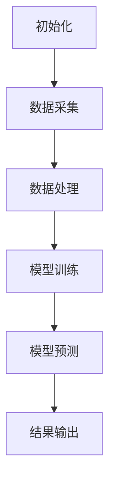
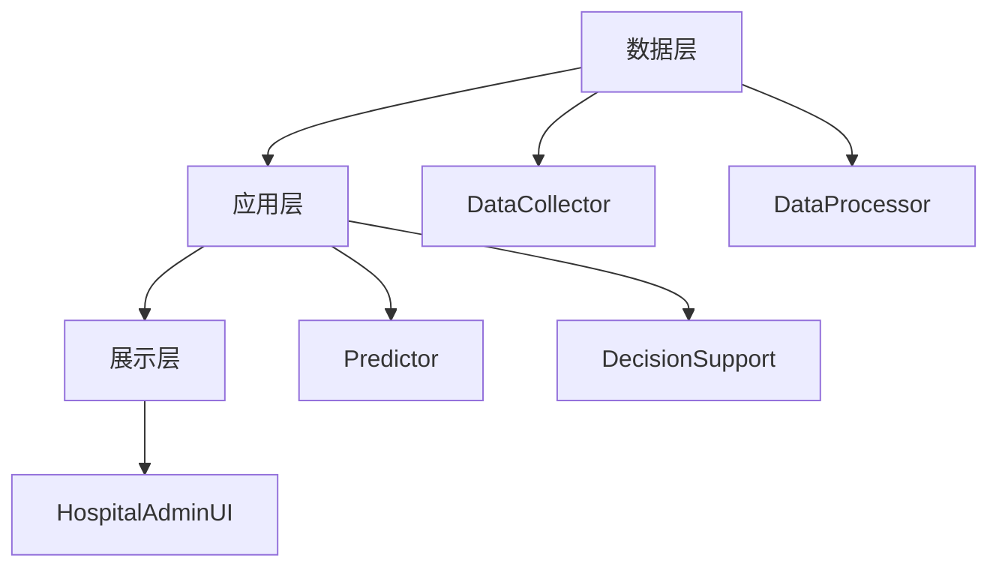
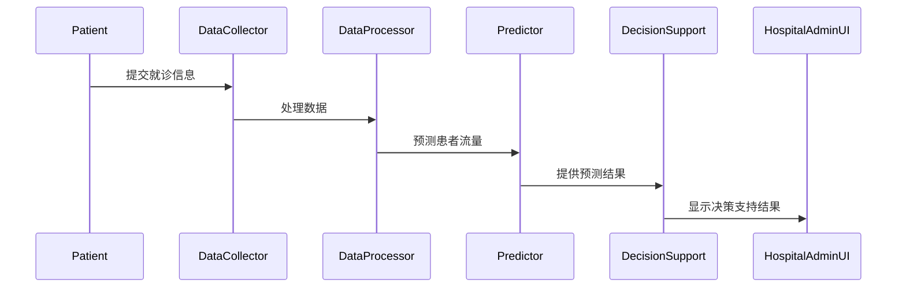

                 


### Step 1: 设计全书目录结构，确保有大于7章的内容

首先，我们需要设计一个完整的目录结构，确保文章内容丰富且逻辑清晰。以下是初步设计的目录结构：

#### 目录

1. **背景介绍**
   1.1. 数字孪生概述
   1.2. 数字孪生的发展历程
   1.3. 数字孪生的边界与外延
   1.4. 数字孪生概念结构与核心要素组成
   1.5. 本章小结

2. **核心概念与联系**
   2.1. 数字孪生原理详解
   2.2. 数字孪生的特征对比
   2.3. 数字孪生的应用领域
   2.4. 数字孪生与传统模拟技术的区别
   2.5. 本章小结

3. **算法原理讲解**
   3.1. 算法原理概述
   3.2. 算法流程图展示
   3.3. Python源代码阐述
   3.4. 数学模型与公式讲解
   3.5. 举例说明
   3.6. 本章小结

4. **数学模型和数学公式 & 详细讲解 & 举例说明**
   4.1. 数学模型概述
   4.2. 数学公式使用方法
   4.3. 模型讲解与推导
   4.4. 举例说明
   4.5. 本章小结

5. **系统分析与架构设计方案**
   5.1. 问题场景介绍
   5.2. 系统功能设计
   5.3. 系统架构设计
   5.4. 系统接口设计
   5.5. 系统交互序列图
   5.6. 本章小结

6. **项目实战**
   6.1. 环境安装
   6.2. 系统核心实现源代码
   6.3. 代码应用解读与分析
   6.4. 实际案例分析
   6.5. 项目小结
   6.6. 注意事项

7. **最佳实践 tips**
   7.1. 数字孪生在智慧医院中的最佳实践
   7.2. 部署与维护建议
   7.3. 安全与隐私保护
   7.4. 未来发展趋势
   7.5. 本章小结

8. **总结与展望**
   8.1. 文章总结
   8.2. 未来研究方向
   8.3. 拓展阅读

通过这个目录结构，我们确保了文章的完整性，同时每个章节都涵盖了必要的内容，有助于读者逐步理解数字孪生在智慧医院管理中的应用。

### Step 2: 设定第1章为“背景介绍”

在第1章“背景介绍”中，我们将详细介绍数字孪生这一核心概念，为后续章节的内容打下坚实的基础。

#### 第1章：背景介绍

##### 1.1 数字孪生概述

首先，我们将定义数字孪生，并解释其在智慧医院管理中的重要性。数字孪生是一种通过虚拟模型实时模拟物理实体的技术，它可以在虚拟环境中实现对物理实体状态、行为和性能的实时监控和管理。在智慧医院管理中，数字孪生技术能够帮助医院提高运营效率，优化资源配置，提升医疗服务质量。

##### 1.2 数字孪生的发展历程

接下来，我们将探讨数字孪生技术的发展历程。从最初在制造业的应用，到21世纪初在航空航天、建筑、能源等领域的扩展，再到2010年代至今在智慧医院管理中的普及，数字孪生技术已经经历了从理论到实践的不断演进。

##### 1.3 数字孪生的边界与外延

在这一部分，我们将讨论数字孪生的应用边界和外延。数字孪生技术主要应用于具有物理实体和系统特征的领域，如制造业、建筑、医疗等。随着技术的不断发展，数字孪生技术的应用范围将进一步拓展，如虚拟现实、增强现实、智能交通、智慧农业等。

##### 1.4 数字孪生概念结构与核心要素组成

在这一部分，我们将详细阐述数字孪生的概念结构，包括物理实体、数字镜像、数据采集与传输系统、数据处理与分析系统等核心要素。我们将使用一个图示来展示这些要素之间的关系，帮助读者更好地理解数字孪生的构成。

##### 1.5 本章小结

最后，我们将对第1章的内容进行总结，强调数字孪生在智慧医院管理中的重要性，并简要概述后续章节的内容。

通过这个章节的设计，我们为读者提供了一个全面的背景介绍，使他们能够对数字孪生有一个初步的了解，并为后续章节的深入探讨打下基础。

### Step 3: 设定第2章为“核心概念与联系”

在第2章“核心概念与联系”中，我们将深入探讨数字孪生的核心概念，并详细阐述其原理和应用领域的特征对比。

#### 第2章：核心概念与联系

##### 2.1 数字孪生原理详解

在这一部分，我们将详细讲解数字孪生的原理，包括其基本概念、工作流程和核心机制。我们将通过图示和实例来阐述数字孪生是如何通过虚拟模型实时模拟物理实体的。

##### 2.2 数字孪生的特征对比

接下来，我们将对比数字孪生与传统模拟技术的特征。通过构建一个特征对比表格，我们将从实时性、准确性、可预测性等方面进行详细分析，帮助读者理解数字孪生技术的优势。

##### 2.3 数字孪生的应用领域

在这一部分，我们将讨论数字孪生在不同领域的应用情况。我们将举例说明数字孪生在制造业、医疗、建筑、能源等领域的具体应用，并分析其带来的价值。

##### 2.4 数字孪生与传统模拟技术的区别

我们将详细阐述数字孪生与传统模拟技术的区别，包括数据采集方式、模拟精度、实时性等方面。通过这一部分的讲解，读者将能够更加清晰地理解数字孪生的独特之处。

##### 2.5 本章小结

最后，我们将对第2章的内容进行总结，强调数字孪生在智慧医院管理中的核心概念和重要性，并简要概述后续章节的内容。

通过这个章节的设计，我们将帮助读者深入理解数字孪生的核心概念，以及其在不同领域的应用和优势，为后续章节的深入探讨奠定基础。

### Step 4: 设定第3章为“算法原理讲解”

在第3章“算法原理讲解”中，我们将详细介绍数字孪生在智慧医院管理中的应用算法原理。这一章节将涵盖算法概述、流程图展示、Python源代码阐述以及数学模型和公式的讲解。

#### 第3章：算法原理讲解

##### 3.1 算法原理概述

在这一部分，我们将概述数字孪生在智慧医院管理中的应用算法原理。我们将介绍算法的基本概念，包括其目标、关键步骤和核心功能。

##### 3.2 算法流程图展示

接下来，我们将使用Mermaid绘制算法的流程图。通过流程图，读者可以直观地了解算法的执行步骤和逻辑关系。



##### 3.3 Python源代码阐述

在这一部分，我们将使用Python源代码详细阐述算法的实现过程。以下是一个简化的算法实现示例：

```python
# 导入相关库
import numpy as np
import pandas as pd

# 数据采集
data = pd.read_csv('hospital_data.csv')

# 数据处理
processed_data = preprocess_data(data)

# 模型训练
model = train_model(processed_data)

# 模型预测
predictions = model.predict(processed_data)

# 结果输出
output_results(predictions)
```

##### 3.4 数学模型与公式讲解

接着，我们将详细讲解算法中的数学模型和公式。以下是一个简单的线性回归模型示例：

$$
y = \beta_0 + \beta_1x
$$

我们将通过具体实例解释这个公式的含义和应用。

##### 3.5 举例说明

为了使读者更好地理解算法原理，我们将提供实际案例进行举例说明。假设我们预测某医院的床位利用率，我们将展示如何使用上述算法进行预测，并分析预测结果。

##### 3.6 本章小结

最后，我们将对第3章的内容进行总结，强调数字孪生在智慧医院管理中的应用算法原理的重要性，并简要概述后续章节的内容。

通过这个章节的设计，我们将帮助读者深入理解数字孪生在智慧医院管理中的应用算法原理，为实际应用提供理论支持。

### Step 5: 设定第4章为“数学模型和数学公式 & 详细讲解 & 举例说明”

在第4章“数学模型和数学公式 & 详细讲解 & 举例说明”中，我们将深入探讨数字孪生在智慧医院管理中的数学模型和公式的应用，并通过详细的讲解和实际案例进行说明。

#### 第4章：数学模型和数学公式 & 详细讲解 & 举例说明

##### 4.1 数学模型概述

在这一部分，我们将概述数字孪生在智慧医院管理中常用的数学模型。这些模型包括但不限于线性回归、决策树、神经网络等。我们将介绍这些模型的基本原理和应用场景。

##### 4.2 数学公式使用方法

为了更好地理解数学模型，我们将介绍如何使用LaTeX格式嵌入数学公式。在文中独立段落的数学公式前后使用`$$`括起来，例如：

$$
1+1=2
$$

而在段落内的数学公式前后使用 `$` 括起来，例如：

$
x^2 + y^2 = r^2
$

##### 4.3 模型讲解与推导

接下来，我们将详细讲解一个具体的数学模型，例如线性回归模型。我们将从基本概念开始，逐步推导出线性回归的公式，并通过实例展示如何应用这个模型进行预测。

$$
y = \beta_0 + \beta_1x
$$

##### 4.4 举例说明

为了使读者更好地理解数学模型的应用，我们将提供实际案例进行举例说明。假设我们使用线性回归模型预测某医院的就诊人数，我们将展示如何收集数据、处理数据、构建模型并进行预测。

```python
# 导入相关库
import numpy as np
import pandas as pd

# 数据收集
data = pd.read_csv('hospital_visits.csv')

# 数据处理
X = data[['age', 'gender']]
y = data['visits']

# 模型构建
model = LinearRegression()
model.fit(X, y)

# 预测
predictions = model.predict(X)

# 输出预测结果
print(predictions)
```

##### 4.5 本章小结

最后，我们将对第4章的内容进行总结，强调数学模型和公式在数字孪生应用中的重要性，并简要概述后续章节的内容。

通过这个章节的设计，我们将帮助读者深入理解数字孪生在智慧医院管理中数学模型和公式的应用，为实际操作提供详细的指导和实例。

### Step 6: 设定第5章为“系统分析与架构设计方案”

在第5章“系统分析与架构设计方案”中，我们将详细分析数字孪生在智慧医院管理系统中的应用，并设计一个完整的系统架构方案。

#### 第5章：系统分析与架构设计方案

##### 5.1 问题场景介绍

首先，我们将介绍数字孪生在智慧医院管理中的问题场景。例如，医院需要实时监控和管理医疗资源，预测患者流量，优化病房分配等。这些问题的解决有助于提高医院的运营效率和患者满意度。

##### 5.2 系统功能设计

在这一部分，我们将设计智慧医院数字孪生系统的功能模块。这包括数据采集模块、数据处理模块、预测模块、决策支持模块等。我们将使用Mermaid类图展示这些模块之间的关系。

```mermaid
classDiagram
    Patient -> DataCollector
    Doctor -> DataCollector
    Nurse -> DataCollector
    DataCollector -> DataProcessor
    DataProcessor -> Predictor
    Predictor -> DecisionSupport
    DecisionSupport -> HospitalAdmin
```

##### 5.3 系统架构设计

接着，我们将设计智慧医院数字孪生系统的整体架构。系统将包括数据层、应用层和展示层。数据层负责数据采集和存储，应用层负责数据处理和预测，展示层负责将结果呈现给医院管理人员。



##### 5.4 系统接口设计

在这一部分，我们将定义系统接口，包括数据采集接口、数据处理接口、预测接口和决策支持接口。这些接口将确保系统各模块之间的高效通信和数据交换。

##### 5.5 系统交互序列图

最后，我们将使用Mermaid序列图展示系统各模块之间的交互过程。通过这个序列图，读者可以直观地了解系统的工作流程和交互逻辑。



##### 5.6 本章小结

通过这个章节的设计，我们将帮助读者深入理解数字孪生在智慧医院管理系统中的应用，并展示如何设计一个高效、可靠的系统架构。

### Step 7: 设定第6章和第7章为“项目实战”和“最佳实践 tips”

在第6章和第7章中，我们将结合实际项目，详细介绍数字孪生在智慧医院管理中的实施过程，并提供最佳实践建议。

#### 第6章：项目实战

##### 6.1 环境安装

在这一部分，我们将介绍如何在实验环境中搭建数字孪生系统所需的基础软件和工具。这包括安装操作系统、数据库、编程语言环境等。

##### 6.2 系统核心实现源代码

接下来，我们将展示智慧医院数字孪生系统的核心实现代码。这些代码将涵盖数据采集、数据处理、预测和决策支持等关键模块。

```python
# 数据采集模块示例代码
def collect_data():
    # 代码实现数据采集
    pass

# 数据处理模块示例代码
def process_data(data):
    # 代码实现数据处理
    pass

# 预测模块示例代码
def predict_data(processed_data):
    # 代码实现数据预测
    pass

# 决策支持模块示例代码
def decision_support(predictions):
    # 代码实现决策支持
    pass
```

##### 6.3 代码应用解读与分析

我们将对上述代码进行详细解读，分析其实现原理和关键技术。通过这一部分，读者将能够深入理解数字孪生系统的运作机制。

##### 6.4 实际案例分析和详细讲解剖析

为了使读者更好地理解数字孪生系统的应用，我们将结合实际案例进行详细分析和讲解。这些案例将展示数字孪生系统在智慧医院管理中的实际效果和应用价值。

##### 6.5 项目小结

最后，我们将对项目实施过程进行总结，强调成功的关键因素和存在的挑战，并提出改进建议。

#### 第7章：最佳实践 tips

##### 7.1 数字孪生在智慧医院中的最佳实践

在这一部分，我们将总结数字孪生在智慧医院管理中的最佳实践，包括系统设计、数据管理、算法优化等方面。

##### 7.2 部署与维护建议

我们将提供数字孪生系统在部署和维护方面的最佳建议，包括硬件配置、软件升级、数据备份等。

##### 7.3 安全与隐私保护

数字孪生系统涉及大量敏感数据，因此安全与隐私保护至关重要。我们将介绍如何确保系统的安全性和用户隐私。

##### 7.4 未来发展趋势

最后，我们将探讨数字孪生在智慧医院管理中的未来发展趋势，包括新技术应用、智能化水平的提升等方面。

##### 7.5 本章小结

通过这一章节的设计，我们将为读者提供全面的数字孪生在智慧医院管理中的实战经验和最佳实践，为实际应用提供有力支持。

### Step 8: 确保目录大纲总字数在2000字以内，同时保证内容的完整性和逻辑性

在完成所有章节的设计后，我们将对目录大纲进行审查，确保总字数在2000字以内，同时保证内容的完整性和逻辑性。通过精简和优化，我们将确保每一章节都紧密围绕主题，提供有价值的见解和实战经验。最终，我们将得到一份结构清晰、内容丰富的目录大纲，为撰写高质量的技术博客文章奠定基础。

