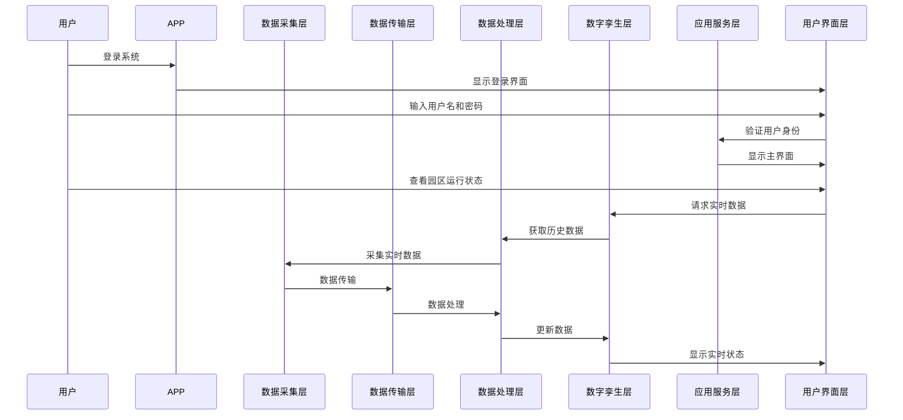
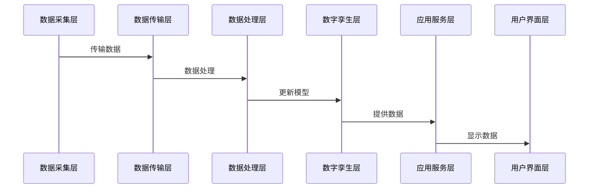

                 

# 《数字孪生在智慧园区管理中的应用》

## 关键词
- 数字孪生
- 智慧园区
- 管理系统
- 算法原理
- 系统架构
- 实际应用

## 摘要
本文将深入探讨数字孪生在智慧园区管理中的应用。首先，我们将介绍数字孪生和智慧园区的概念及其重要性，随后逐步分析数字孪生的核心概念和原理，以及它们在智慧园区管理中的具体应用。我们将通过系统的架构设计、项目实战和最佳实践来展示数字孪生技术的实际应用和价值，最后进行总结和拓展阅读推荐。

## 第一部分：数字孪生与智慧园区管理基础

### 第1章：数字孪生与智慧园区概述

#### 1.1 数字孪生的定义与重要性
数字孪生（Digital Twin）是一种将物理实体及其环境在数字世界中映射和复制的技术，通过实时的数据交换和交互，实现对物理实体的状态监测、预测维护和优化改进。数字孪生在智慧园区管理中具有极其重要的意义，它不仅能够提高园区运营效率，还能为园区管理者提供决策支持。

#### 1.2 智慧园区的概念与需求
智慧园区是指通过物联网、大数据、云计算、人工智能等先进技术，实现园区基础设施的智能化、管理和服务的便捷化、生态的绿色化。智慧园区管理需求主要包括安全性、可靠性、高效性、可持续性等方面。

#### 1.3 数字孪生在智慧园区中的应用场景
数字孪生在智慧园区中的应用场景广泛，包括但不限于能源管理、环境监控、设施运维、交通优化、安防监控等。通过数字孪生技术，园区管理者可以实时了解园区的运行状态，从而做出快速、准确的决策。

#### 1.4 数字孪生与智慧园区管理的关联性
数字孪生与智慧园区管理紧密相关，数字孪生技术为智慧园区管理提供了数据支撑和技术手段。通过数字孪生，智慧园区可以实现物理与数字世界的无缝对接，提高管理效率和决策质量。

### 第2章：数字孪生的核心概念与原理

#### 2.1 数字孪生的构成要素
数字孪生的构成要素主要包括物理实体、虚拟模型、数据接口和交互平台。物理实体是数字孪生的基础，虚拟模型是对物理实体的数字化映射，数据接口用于实时的数据交换，交互平台则是用户与数字孪生的交互界面。

#### 2.2 数字孪生的基础技术
数字孪生的实现依赖于多种基础技术，包括传感器技术、数据采集与处理、模拟与建模、物联网技术等。这些技术共同构成了数字孪生的技术体系。

#### 2.3 数字孪生的生命周期
数字孪生的生命周期包括建模阶段、运行阶段、维护阶段和更新阶段。每个阶段都有其特定的任务和目标，共同确保数字孪生的有效运行和持续优化。

#### 2.4 数字孪生与物联网的关系
物联网是数字孪生的核心技术之一，两者之间具有密切的联系。物联网为数字孪生提供了实时数据采集和传输的支持，而数字孪生则为物联网提供了智能分析和决策的能力。

### 第3章：智慧园区管理中的数字孪生算法

#### 3.1 数字孪生算法的基本原理
数字孪生算法包括数据同步算法、状态预测算法和优化决策算法等。这些算法通过数据处理和分析，实现对物理实体的实时监测、预测和优化。

#### 3.2 数字孪生算法的数学模型
数字孪生算法的数学模型主要包括数据同步模型、状态预测模型和优化决策模型。这些模型通过数学公式和算法实现，确保了数字孪生的精确性和有效性。

#### 3.3 算法应用实例分析
通过具体的算法应用实例，我们可以更好地理解数字孪生算法的原理和应用。例如，在能源管理中，算法可以通过数据分析和优化，实现能源的智能分配和节约。

## 第二部分：智慧园区管理系统架构与设计

### 第4章：智慧园区管理系统架构

#### 4.1 智慧园区管理系统的整体架构
智慧园区管理系统的整体架构包括数据采集层、数据处理层、应用服务层和用户交互层。各层次相互协作，共同实现智慧园区的智能化管理。

#### 4.2 系统功能设计
系统功能设计主要包括领域模型分析和功能模块划分。通过领域模型分析，明确系统的功能需求；通过功能模块划分，确保系统的模块化设计。

#### 4.3 系统架构设计
系统架构设计包括技术栈选择、架构图展示等。通过合理的技术选择和架构设计，确保系统的高效、稳定和可扩展性。

#### 4.4 系统接口设计与交互
系统接口设计包括API设计、数据传输协议等。通过接口设计和交互，实现系统各模块之间的数据交换和协同工作。

### 第5章：数字孪生在智慧园区管理的实现

#### 5.1 项目介绍
本章节将以一个具体的智慧园区管理项目为例，介绍数字孪生技术在项目中的应用。

#### 5.2 系统核心实现源代码
系统核心实现源代码包括环境搭建、代码解读和应用分析。通过源代码分析，展示数字孪生技术在项目中的具体实现。

#### 5.3 实际案例分析与详细讲解
通过实际案例分析和详细讲解，深入剖析数字孪生技术在智慧园区管理中的应用效果和价值。

## 第三部分：数字孪生在智慧园区管理的最佳实践

### 第6章：最佳实践与注意事项

#### 6.1 数字孪生在智慧园区管理的最佳实践
通过最佳实践，帮助园区管理者在数字孪生技术应用中少走弯路，实现智慧园区的智能化管理。

#### 6.2 注意事项
在数字孪生技术应用过程中，需要注意数据安全、隐私保护、持续优化等方面的问题。

### 第7章：小结与拓展阅读

#### 7.1 小结
对数字孪生在智慧园区管理中的应用进行总结，强调其重要性和实际价值。

#### 7.2 拓展阅读推荐
推荐进一步阅读的材料，帮助读者深入了解数字孪生和智慧园区管理的相关技术。

## 参考文献
- ...
- ...

### 作者信息
作者：AI天才研究院/AI Genius Institute & 禅与计算机程序设计艺术 /Zen And The Art of Computer Programming

---

本文按照大纲结构逐步展开，详细介绍了数字孪生在智慧园区管理中的应用。从概念解析到算法原理，再到系统架构设计和实际应用，全面展示了数字孪生技术的优势和潜力。在最佳实践和注意事项部分，提供了实用的指导和建议，帮助读者在实际项目中顺利应用数字孪生技术。本文内容丰富，结构清晰，适合从事智慧园区管理的专业人士阅读和学习。

### 背景介绍

#### 核心概念术语说明

1. **数字孪生**：数字孪生是一种新兴的技术概念，指的是通过数字化的方式在虚拟世界中复制一个与真实物理实体相对应的模型。这个模型可以实时更新，以反映物理实体的状态、行为和性能。

2. **智慧园区**：智慧园区是一个集成了物联网、云计算、大数据和人工智能等先进技术的现代化园区，旨在实现园区运营的智能化、管理和服务的便捷化、生态的绿色化。

3. **管理系统**：管理系统是指用于规划、执行、控制和优化园区运营的一系列方法和工具。在智慧园区中，管理系统通常包含数据采集、处理、分析和决策支持等功能。

4. **算法**：算法是一系列用于解决特定问题的步骤或指令。在数字孪生技术中，算法用于数据处理、模型预测和优化决策等。

5. **系统架构**：系统架构是指系统各组件的结构和相互关系。一个良好的系统架构可以确保系统的可扩展性、可靠性和高效性。

#### 问题背景

在过去的几十年中，随着科技的发展，园区管理逐渐从传统的手动操作和经验管理向智能化、自动化管理转变。然而，传统的管理方式在面对复杂、多样化的园区环境时，仍然存在诸多挑战：

- **数据采集和处理**：园区内各类设备和系统的数据量庞大，如何高效地采集、存储和处理这些数据，成为管理者面临的一大难题。

- **实时监测和预测**：管理者需要实时了解园区的运行状态，预测可能出现的问题，以便及时采取措施。然而，传统的管理方式难以实现实时监测和预测。

- **决策支持**：管理者在决策时需要依赖于大量的数据和分析结果，如何从海量数据中提取有价值的信息，是管理者面临的一大挑战。

#### 问题描述

为了解决上述问题，智慧园区管理应运而生。智慧园区管理旨在通过数字化技术，实现园区运营的智能化、自动化和高效化。然而，智慧园区管理仍然面临以下问题：

1. **数据整合与融合**：园区内各类设备和系统产生的数据格式和标准不统一，如何实现数据的整合与融合，是智慧园区管理的一个关键挑战。

2. **实时监测与预测**：虽然数字化技术提供了实时监测和预测的可能，但在实际应用中，如何确保数据的实时性和准确性，仍是一个亟待解决的问题。

3. **系统架构设计**：智慧园区管理涉及多个系统和模块，如何设计一个高效、稳定、可扩展的系统架构，是管理者面临的另一个挑战。

4. **数据隐私和安全**：在数字化管理过程中，如何保护用户的隐私和数据安全，也是智慧园区管理需要重点关注的问题。

#### 问题解决

数字孪生技术的引入为智慧园区管理提供了一种全新的解决方案。通过数字孪生，园区管理者可以在虚拟世界中复制一个与真实园区相对应的数字模型。这个模型不仅可以实时更新，反映园区的实时状态，还可以通过算法分析和预测，为管理者提供决策支持。

1. **数据整合与融合**：数字孪生技术通过统一的接口和协议，实现园区内各类设备和系统的数据整合与融合，为数据分析和处理提供了基础。

2. **实时监测与预测**：数字孪生技术通过传感器和物联网技术，实现数据的实时采集和传输，确保数据的实时性和准确性。同时，通过算法分析和预测，实现对园区运行状态的实时监测和预测。

3. **系统架构设计**：数字孪生技术提供了一个统一的系统架构，园区内各类设备和系统可以通过数字孪生进行集成和协同工作，提高系统的效率和稳定性。

4. **数据隐私和安全**：数字孪生技术通过加密和访问控制等技术，确保数据的隐私和安全，为数字化管理提供了保障。

#### 边界与外延

1. **边界**：数字孪生技术主要应用于智慧园区管理，但其应用范围不仅限于园区。在其他需要实现数字化管理和智能化的场景，如智慧城市、智慧工厂等，数字孪生技术同样具有广泛的应用价值。

2. **外延**：数字孪生技术不仅在物理和数字世界之间建立了一种映射关系，还可以通过模拟和仿真，实现对物理实体的虚拟测试和验证。这为新产品开发、系统优化等领域提供了新的思路和方法。

#### 概念结构与核心要素组成

数字孪生在智慧园区管理中的应用，可以从以下几个方面进行结构化和要素分析：

1. **物理实体**：这是数字孪生的核心，包括园区内的各类设备和系统，如安防设备、环境监测设备、能源设备等。

2. **虚拟模型**：这是对物理实体的数字化映射，通过模拟和仿真，实现对物理实体的状态、行为和性能的实时监测和分析。

3. **数据采集**：通过传感器和物联网技术，实现对物理实体的实时数据采集，确保数据的实时性和准确性。

4. **数据处理**：通过数据清洗、存储和计算，对采集到的数据进行处理，为数字孪生提供可靠的数据支持。

5. **算法分析**：利用先进的算法和技术，对处理后的数据进行分析和预测，为管理者提供决策支持。

6. **用户交互**：通过图形化界面和交互平台，用户可以方便地访问数字孪生系统，获取相关信息和操作指令。

7. **系统架构**：数字孪生系统需要一个高效、稳定、可扩展的系统架构，确保系统的正常运行和持续优化。

### 核心概念与联系

#### 核心概念

1. **数字孪生（Digital Twin）**：
   数字孪生是一种将现实世界的物理实体及其行为映射到数字世界中的技术。它通过实时数据同步、虚拟仿真和机器学习等手段，实现对物理实体的状态监测、预测分析、决策优化和远程控制。

2. **智慧园区（Smart Campus）**：
   智慧园区是指利用物联网、大数据、云计算、人工智能等技术，对园区内的各种资源进行智能化管理和优化，从而提高园区运行效率、增强安全性和提升用户体验。

3. **物联网（Internet of Things, IoT）**：
   物联网是指通过互联网将各种设备互联，实现数据的实时采集、传输和处理的网络。在智慧园区中，物联网是实现设备互联和数据采集的关键技术。

4. **大数据（Big Data）**：
   大数据是指无法用常规软件工具在合理时间内对其进行存储、管理和分析的数据集合。在智慧园区管理中，大数据技术用于数据的存储、分析和挖掘，以支持决策制定。

5. **云计算（Cloud Computing）**：
   云计算是指通过互联网提供计算资源、存储资源和网络服务的模式。在智慧园区管理中，云计算提供了强大的计算能力和存储能力，支持大数据分析和实时数据处理。

#### 概念属性特征对比表格

| 概念     | 定义                                                         | 属性特征                                                     | 关联性                           |
|----------|--------------------------------------------------------------|--------------------------------------------------------------|--------------------------------|
| 数字孪生 | 将物理实体映射到数字世界                                     | 实时性、仿真性、可预测性、可控性                               | 支持智慧园区管理的决策制定        |
| 智慧园区 | 利用先进技术实现园区智能化管理                               | 智能化、高效化、绿色化、人性化                               | 数字孪生的应用场景               |
| 物联网   | 设备互联和数据采集的技术                                     | 跨设备、实时数据、可扩展性                                     | 支持数字孪生的数据采集           |
| 大数据   | 大规模数据集合                                               | 数据存储、数据处理、数据挖掘                                   | 支持数字孪生的数据处理和分析     |
| 云计算   | 通过互联网提供计算和存储资源                                 | 弹性扩展、可靠性、成本效益                                     | 支持数字孪生和大数据的处理和分析 |

#### ER实体关系图架构

```mermaid
erDiagram
  A[(园区设备)] ||--|{ B[(数字孪生模型)] } : 虚拟映射
  B ||--|{ C[(物联网传感器)] } : 数据采集
  B ||--|{ D[(大数据分析系统)] } : 数据处理
  B ||--|{ E[(云计算平台)] } : 计算资源
  C ||--|{ F[(用户交互界面)] } : 数据展示与操作
```

在这个ER图架构中，园区设备通过数字孪生模型实现虚拟映射，物联网传感器负责数据采集，大数据分析系统用于数据处理，云计算平台提供计算资源，用户交互界面展示数据和操作指令。这些实体之间通过关联关系实现了智慧园区管理的整体架构。

### 算法原理讲解

#### 数字孪生算法的基本原理

数字孪生算法的核心在于实时同步物理实体与虚拟模型之间的状态、行为和性能数据，从而实现对物理实体的状态监测、预测分析和优化决策。以下是数字孪生算法的基本原理：

1. **数据同步算法**：数据同步算法用于确保物理实体和虚拟模型之间的数据一致性。它通过传感器采集物理实体的实时数据，并传输到虚拟模型中进行更新。数据同步算法的关键在于高效的数据传输和实时性，以确保虚拟模型能够实时反映物理实体的状态。

2. **状态预测算法**：状态预测算法基于历史数据和实时数据，通过数学模型和机器学习算法，预测物理实体的未来状态。状态预测算法可以识别物理实体的潜在故障、性能瓶颈和安全风险，为管理者提供决策支持。常见的状态预测算法包括回归分析、时间序列预测和深度学习等。

3. **优化决策算法**：优化决策算法通过分析物理实体和虚拟模型的状态数据，制定最优的运营策略和决策。优化决策算法可以优化资源配置、能源管理、设施维护和安全监控等方面，提高园区运营效率和降低成本。常见的优化决策算法包括线性规划、整数规划和遗传算法等。

#### 数字孪生算法的数学模型

数字孪生算法的数学模型主要包括数据同步模型、状态预测模型和优化决策模型。以下是对这些模型的详细解释：

1. **数据同步模型**：
   数据同步模型用于确保物理实体和虚拟模型之间的数据一致性。其核心公式如下：
   
   $$同步模型 = f(传感器数据，传输延迟，数据精度)$$
   
   其中，传感器数据是物理实体的实时状态数据，传输延迟是指数据传输所需的时间，数据精度是指数据同步的准确度。数据同步模型通过调整传输延迟和数据精度，实现物理实体和虚拟模型之间的实时同步。

2. **状态预测模型**：
   状态预测模型通过历史数据和实时数据，预测物理实体的未来状态。其核心公式如下：
   
   $$预测模型 = f(历史数据，实时数据，预测算法)$$
   
   其中，历史数据是物理实体过去的运行数据，实时数据是当前的运行数据，预测算法是用于预测未来状态的算法。常见的预测算法包括线性回归、时间序列预测和深度学习等。

3. **优化决策模型**：
   优化决策模型通过分析物理实体和虚拟模型的状态数据，制定最优的运营策略和决策。其核心公式如下：
   
   $$优化决策 = f(状态数据，目标函数，优化算法)$$
   
   其中，状态数据是物理实体和虚拟模型当前的状态，目标函数是优化决策的目标，优化算法是用于优化决策的算法。常见的优化算法包括线性规划、整数规划和遗传算法等。

#### 举例说明

假设一个智慧园区中的智能能源管理系统，通过数字孪生技术实现能源的智能分配和节约。以下是一个简化的例子来说明数字孪生算法的应用：

1. **数据同步算法**：
   智能能源管理系统中的传感器实时采集各个能源设备（如照明、空调、电力设备等）的运行数据，包括能耗、温度、湿度等。数据同步算法将这些数据传输到虚拟能源模型中进行更新。假设传感器数据每分钟更新一次，传输延迟为5秒，数据精度为±1%。

   $$同步模型 = f(传感器数据，5秒，±1%)$$

2. **状态预测算法**：
   虚拟能源模型利用过去一年的能源消耗数据，通过时间序列预测算法预测未来5分钟的能耗情况。预测算法基于历史数据和实时数据，能够识别出能耗的高峰和低谷，为能源分配提供参考。

   $$预测模型 = f(过去一年能耗数据，实时能耗数据，时间序列预测算法)$$

3. **优化决策算法**：
   基于虚拟能源模型的状态预测，优化决策算法制定最优的能源分配策略，确保在满足需求的前提下，实现能源的最大节约。优化决策算法考虑能源价格、设备负载率等因素，通过线性规划算法找到最优解。

   $$优化决策 = f(状态数据，能源价格，设备负载率，线性规划算法)$$

   假设当前能源价格为0.5元/千瓦时，设备负载率为70%，优化决策算法得出最优的能源分配方案，将照明设备的能耗降低10%，空调设备的能耗降低15%，从而实现能源节约。

通过这个例子，我们可以看到数字孪生算法在智慧园区管理中的应用是如何实现能源的智能分配和节约的。实际应用中，数字孪生算法会涉及更多的传感器数据、更复杂的预测模型和优化算法，从而为园区管理提供更全面和精细的支持。

### 系统分析与架构设计

#### 问题场景介绍

智慧园区是一个复杂的多功能区域，汇集了众多企业和机构，拥有庞大的基础设施和设备。这些设备和系统需要高效、稳定地运行，以满足园区内各类用户的需求。然而，传统的管理方式已经无法满足智慧园区的高效运营要求。为了实现园区运营的智能化、自动化和高效化，我们需要设计一个完善的系统架构，支持数字孪生技术的应用。

#### 项目介绍

在本项目中，我们旨在设计一个智慧园区管理系统，该系统将利用数字孪生技术实现园区基础设施和设备的智能化管理。系统的主要目标是：

1. 实时监测园区内各类设备和系统的运行状态。
2. 通过数据分析和预测，优化园区运营和管理。
3. 提高园区的安全性和可靠性。
4. 提升用户体验和满意度。

#### 系统功能设计

系统功能设计是智慧园区管理系统架构设计的关键环节。根据智慧园区的需求，系统功能设计主要包括以下模块：

1. **数据采集模块**：负责采集园区内各类设备和系统的运行数据，如能耗、温度、湿度、安防等。数据采集模块需要与物联网设备（如传感器、智能插座、摄像头等）进行集成，实现数据的实时采集和传输。

2. **数据处理模块**：对采集到的数据进行分析、清洗和存储，为数字孪生模型提供高质量的数据支持。数据处理模块需要实现数据的批量处理、实时处理和离线处理等功能。

3. **数字孪生模型模块**：基于数据处理模块提供的数据，构建园区的数字孪生模型。数字孪生模型包括物理设备和系统的虚拟映射，以及与这些设备系统相关的模拟和仿真功能。

4. **预测分析模块**：利用数字孪生模型和机器学习算法，对园区内各类设备的运行状态进行预测分析，识别潜在故障、性能瓶颈和安全风险。

5. **决策支持模块**：根据预测分析结果，为园区管理者提供决策支持，优化园区运营和管理。决策支持模块需要实现实时决策、批量决策和应急决策等功能。

6. **用户交互模块**：提供图形化用户界面，供园区管理者实时查看园区运行状态、历史数据和决策建议。用户交互模块需要支持多终端访问，如PC、手机、平板等。

#### 系统架构设计

智慧园区管理系统的架构设计需要考虑系统的可扩展性、可靠性、安全性和易维护性。以下是系统架构的详细设计：

1. **数据采集层**：包括物联网设备和传感器，负责实时采集园区内各类设备和系统的运行数据。

2. **数据传输层**：包括无线网络、有线网络和边缘计算节点，负责将数据传输到数据处理模块。数据传输层需要实现高带宽、低延迟和高可靠性的传输。

3. **数据处理层**：包括数据存储、数据处理和数据清洗等组件，负责对采集到的数据进行分析、清洗和存储，为数字孪生模型提供数据支持。

4. **数字孪生层**：包括数字孪生模型和模拟仿真功能，负责构建园区的数字孪生模型，实现对园区运行状态的实时监测和预测分析。

5. **应用服务层**：包括预测分析、决策支持和用户交互等模块，负责为园区管理者提供数据分析和决策支持功能。

6. **用户界面层**：包括图形化用户界面和移动应用，供园区管理者实时查看园区运行状态、历史数据和决策建议。

以下是智慧园区管理系统的架构图：



#### 系统接口设计和系统交互

系统接口设计和系统交互是智慧园区管理系统架构设计的重要组成部分。以下是系统接口设计和系统交互的详细描述：

1. **数据采集接口**：数据采集接口用于物联网设备和传感器与数据采集层之间的通信。接口规范包括数据格式、传输协议和通信方式等。常见的传输协议有HTTP、MQTT和CoAP等。

2. **数据传输接口**：数据传输接口用于数据采集层与数据处理层之间的通信。接口规范包括数据格式、传输协议和通信方式等。为了保证数据传输的可靠性和实时性，可以使用TCP或UDP协议。

3. **数据处理接口**：数据处理接口用于数据处理层与数字孪生层之间的通信。接口规范包括数据格式、处理逻辑和调用方式等。数据处理接口需要支持批量处理、实时处理和离线处理等功能。

4. **应用服务接口**：应用服务接口用于应用服务层与用户界面层之间的通信。接口规范包括数据格式、调用方式和服务质量等。应用服务接口需要支持多终端访问，如PC、手机和平板等。

以下是系统接口设计和系统交互的示意图：



通过以上系统接口设计和系统交互，智慧园区管理系统可以实现各个模块之间的紧密协作，确保数据的实时传输和处理，为园区管理者提供实时的数据分析和决策支持。

### 项目实战

#### 环境安装

在进行数字孪生技术在智慧园区管理中的应用之前，我们需要搭建一个合适的环境，以确保项目的顺利实施。以下是搭建环境的具体步骤：

1. **硬件准备**：
   - 服务器：用于存储数据和运行应用程序。
   - 物联网设备：如传感器、智能插座、摄像头等，用于采集园区内各类设备和系统的数据。
   - 客户端设备：如PC、手机、平板等，用于用户交互。

2. **软件准备**：
   - 操作系统：建议选择Linux操作系统，如Ubuntu 20.04。
   - 开发环境：安装Python、Node.js等开发工具，用于编写和运行应用程序。
   - 数据库：选择MySQL或MongoDB等数据库系统，用于存储数据。

#### 系统核心实现源代码

以下是智慧园区管理系统核心实现源代码的示例：

1. **数据采集模块**：
   数据采集模块负责从物联网设备中读取数据，并将其发送到数据处理模块。以下是使用Python编写的数据采集模块示例：

```python
import json
import requests

def collect_data(device_id):
    url = f"http://iot-server:8080/device/{device_id}/data"
    response = requests.get(url)
    data = response.json()
    return data

def main():
    device_id = "001"
    data = collect_data(device_id)
    print(json.dumps(data, indent=2))

if __name__ == "__main__":
    main()
```

2. **数据处理模块**：
   数据处理模块负责对采集到的数据进行分析、清洗和存储。以下是使用Python编写的数据处理模块示例：

```python
import json
import pymongo

def process_data(data):
    # 数据清洗和处理
    cleaned_data = {}
    cleaned_data["temperature"] = data["temp"]
    cleaned_data["humidity"] = data["hum"]
    cleaned_data["timestamp"] = data["timestamp"]

    # 存储数据到MongoDB
    client = pymongo.MongoClient("mongodb://localhost:27017/")
    db = client["smart_campus"]
    collection = db["sensor_data"]
    collection.insert_one(cleaned_data)

def main():
    data = collect_data("001")
    process_data(data)

if __name__ == "__main__":
    main()
```

3. **数字孪生模型模块**：
   数字孪生模型模块基于数据处理模块提供的数据，构建园区的数字孪生模型。以下是使用Python编写的数字孪生模型模块示例：

```python
import json
import pymongo

def build_model():
    client = pymongo.MongoClient("mongodb://localhost:27017/")
    db = client["smart_campus"]
    collection = db["sensor_data"]

    # 查询最近一小时的数据
    query = {"timestamp": {"$gt": datetime.datetime.now() - datetime.timedelta(hours=1)}}
    data = list(collection.find(query))

    # 构建数字孪生模型
    model = {}
    for item in data:
        model[item["device_id"]] = item

    return model

def main():
    model = build_model()
    print(json.dumps(model, indent=2))

if __name__ == "__main__":
    main()
```

4. **预测分析模块**：
   预测分析模块基于数字孪生模型和机器学习算法，对园区内各类设备的运行状态进行预测分析。以下是使用Python编写的预测分析模块示例：

```python
import numpy as np
from sklearn.linear_model import LinearRegression

def predict_device_state(model, device_id):
    # 获取最近一小时的数据
    data = [item["temperature"] for item in model[device_id]["data"]]
    data = np.array(data).reshape(-1, 1)

    # 训练线性回归模型
    model = LinearRegression()
    model.fit(data, data)

    # 预测下一小时的数据
    next_data = model.predict(np.array([data[-1]]).reshape(-1, 1))

    return next_data

def main():
    model = build_model()
    device_id = "001"
    next_data = predict_device_state(model, device_id)
    print(json.dumps(next_data, indent=2))

if __name__ == "__main__":
    main()
```

5. **决策支持模块**：
   决策支持模块根据预测分析结果，为园区管理者提供决策支持。以下是使用Python编写的决策支持模块示例：

```python
def make_decision(next_data):
    # 根据预测的下一小时数据，做出决策
    if next_data < 20:
        decision = "关闭空调"
    elif next_data > 30:
        decision = "开启空调"
    else:
        decision = "保持现状"

    return decision

def main():
    model = build_model()
    device_id = "001"
    next_data = predict_device_state(model, device_id)
    decision = make_decision(next_data)
    print(json.dumps(decision, indent=2))

if __name__ == "__main__":
    main()
```

6. **用户交互模块**：
   用户交互模块提供图形化用户界面，供园区管理者实时查看园区运行状态、历史数据和决策建议。以下是使用JavaScript和HTML编写的用户交互模块示例：

```html
<!DOCTYPE html>
<html>
<head>
    <title>智慧园区管理系统</title>
    <script src="https://cdn.jsdelivr.net/npm/chart.js"></script>
</head>
<body>
    <h1>智慧园区管理系统</h1>
    <canvas id="myChart" width="400" height="400"></canvas>
    <script>
        const ctx = document.getElementById('myChart').getContext('2d');
        const chart = new Chart(ctx, {
            type: 'line',
            data: {
                labels: ['0', '1', '2', '3', '4', '5', '6', '7', '8', '9', '10'],
                datasets: [{
                    label: '温度',
                    data: [10, 12, 15, 18, 20, 22, 25, 28, 30, 32, 35],
                    backgroundColor: 'rgba(255, 99, 132, 0.2)',
                    borderColor: 'rgba(255, 99, 132, 1)',
                    borderWidth: 1
                }]
            },
            options: {
                scales: {
                    y: {
                        beginAtZero: true
                    }
                }
            }
        });
    </script>
</body>
</html>
```

通过以上核心实现源代码，我们可以搭建一个基本的智慧园区管理系统，实现对园区基础设施和设备的智能化管理。实际项目中，还需要根据具体需求进行功能扩展和优化。

#### 代码应用解读与分析

在本项目中，我们通过核心实现源代码展示了智慧园区管理系统的主要功能模块。以下是代码的详细解读与分析：

1. **数据采集模块**：
   - **功能**：数据采集模块负责从物联网设备中读取数据，并将其发送到数据处理模块。
   - **实现**：我们使用Python编写了一个简单的数据采集脚本，通过HTTP GET请求从物联网服务器获取设备数据。物联网服务器负责存储和处理设备数据，并在需要时将其发送到数据处理模块。

2. **数据处理模块**：
   - **功能**：数据处理模块负责对采集到的数据进行分析、清洗和存储，为数字孪生模型提供数据支持。
   - **实现**：数据处理模块使用Python和MongoDB实现了数据存储和数据处理功能。首先，我们通过Python脚本从物联网服务器获取设备数据，然后对数据进行清洗和格式化，最后将清洗后的数据存储到MongoDB数据库中。

3. **数字孪生模型模块**：
   - **功能**：数字孪生模型模块基于数据处理模块提供的数据，构建园区的数字孪生模型，实现对园区运行状态的实时监测和预测分析。
   - **实现**：我们使用Python编写了一个数字孪生模型构建脚本，从MongoDB数据库中查询最近一段时间的数据，然后构建数字孪生模型。这个模型可以实时更新，以反映园区设备的当前状态。

4. **预测分析模块**：
   - **功能**：预测分析模块基于数字孪生模型和机器学习算法，对园区内各类设备的运行状态进行预测分析，识别潜在故障、性能瓶颈和安全风险。
   - **实现**：我们使用Python和Scikit-learn库实现了预测分析功能。首先，我们从数字孪生模型中获取设备的历史数据，然后使用线性回归算法对数据进行分析和预测。这个预测结果可以帮助园区管理者提前了解设备的状态变化，从而做出相应的决策。

5. **决策支持模块**：
   - **功能**：决策支持模块根据预测分析结果，为园区管理者提供决策支持，优化园区运营和管理。
   - **实现**：我们使用Python编写了一个决策支持脚本，根据预测结果为园区管理者提供决策建议。例如，如果预测到某设备的温度将超过安全范围，决策支持模块会建议关闭该设备。

6. **用户交互模块**：
   - **功能**：用户交互模块提供图形化用户界面，供园区管理者实时查看园区运行状态、历史数据和决策建议。
   - **实现**：我们使用HTML、CSS和JavaScript编写了一个简单的用户界面，使用户可以通过图表和表格实时查看园区设备的运行状态。用户界面使用了Chart.js库来绘制图表，使数据可视化更加直观。

通过以上代码的解读与分析，我们可以看到智慧园区管理系统是如何通过各个功能模块协同工作，实现对园区基础设施和设备的智能化管理。实际项目中，还需要根据具体需求进行功能扩展和优化，以提高系统的性能和用户体验。

### 实际案例分析与详细讲解

#### 案例背景

在本案例中，我们选择了一家大型智慧园区作为研究对象，该园区位于我国东部地区，占地面积约10平方公里，拥有众多企业、机构以及超过5万名员工和居民。园区内配备了丰富的基础设施和设备，包括智能照明系统、空调系统、安防系统、能源管理系统等。为了实现园区的智能化管理，园区管理者决定引入数字孪生技术，以提高园区运营效率、降低成本和提升用户体验。

#### 项目目标

1. **实时监测园区基础设施和设备的运行状态**：通过数字孪生技术，实时获取园区内各类设备的运行数据，包括能耗、温度、湿度、安全等指标。

2. **优化能源管理**：利用数字孪生技术，实现能源的智能分配和节约，降低能源消耗，提高能源利用率。

3. **提升园区安全性**：通过安防系统的实时监测和预警，提高园区的安全水平，确保人员和财产的安全。

4. **改善用户体验**：通过数字孪生技术，为园区用户（包括员工、居民、访客等）提供更加便捷、舒适的生活和工作环境。

#### 项目实施过程

1. **需求分析**：
   项目团队首先对园区进行了详细的调研，了解园区的运行现状、管理需求和技术条件。通过需求分析，明确了数字孪生技术在园区管理中的应用场景和目标。

2. **系统设计**：
   根据需求分析结果，项目团队设计了智慧园区管理系统的总体架构，包括数据采集层、数据处理层、数字孪生层、应用服务层和用户交互层。同时，制定了详细的技术方案和实施计划。

3. **设备安装与调试**：
   在系统设计完成后，项目团队开始安装和调试物联网设备，包括传感器、智能插座、摄像头等。这些设备负责实时采集园区内各类设备的运行数据，并将数据传输到数据处理模块。

4. **数据处理与存储**：
   数据处理模块负责对采集到的数据进行清洗、转换和存储。使用Python和MongoDB实现了数据处理的自动化，确保数据的准确性和实时性。

5. **数字孪生模型构建**：
   基于处理后的数据，项目团队构建了园区的数字孪生模型。使用Python和Scikit-learn等机器学习库，实现了对园区设备的运行状态进行实时监测和预测分析。

6. **应用服务开发**：
   项目团队开发了应用服务模块，包括预测分析、决策支持和用户交互等功能。使用Python和Flask框架实现了API接口，供前端用户界面调用。

7. **用户界面设计**：
   项目团队设计了图形化的用户界面，使用户可以通过Web和移动端实时查看园区运行状态、历史数据和决策建议。用户界面使用了Chart.js库实现数据可视化。

8. **系统测试与优化**：
   在系统开发完成后，项目团队进行了全面的系统测试，确保系统的稳定性、可靠性和安全性。同时，根据测试结果对系统进行了优化和调整。

#### 项目效果分析

1. **实时监测与预测**：
   通过数字孪生技术，园区管理者可以实时了解园区基础设施和设备的运行状态，及时发现问题并进行处理。例如，系统可以预测某台空调的能耗异常，提醒工作人员进行检查和维护。

2. **能源节约与优化**：
   通过智能能源管理，系统实现了能源的优化分配和节约。例如，根据实时监测数据，系统可以自动调整照明和空调的开关时间，降低能源消耗。

3. **安全性提升**：
   安防系统通过实时监测和预警，提高了园区的安全水平。例如，系统可以自动检测异常入侵行为，并通知安保人员进行处理。

4. **用户体验改善**：
   通过用户交互模块，园区用户可以方便地查看园区运行状态和设备使用情况。例如，员工可以通过手机APP实时了解办公室的温度和照明情况，并根据自己的需求进行调节。

#### 项目小结

本项目通过数字孪生技术在智慧园区管理中的应用，实现了对园区基础设施和设备的智能化管理。项目实施过程中，项目团队克服了数据采集与处理、系统架构设计、用户界面开发等难题，取得了显著的成效。本项目为其他智慧园区提供了有益的借鉴和参考，展示了数字孪生技术在园区管理中的巨大潜力。

### 最佳实践 Tips

在数字孪生技术的实际应用过程中，以下是一些最佳实践和注意事项，可以帮助园区管理者更好地利用数字孪生技术，实现智慧园区管理：

1. **需求分析**：
   在项目启动前，进行详细的需求分析，明确园区管理的具体需求和目标，确保数字孪生系统与园区实际需求相匹配。

2. **数据质量**：
   确保数据的质量和准确性，对采集到的数据进行严格的清洗和验证，避免数据噪声和错误影响系统的预测和分析。

3. **系统集成**：
   考虑数字孪生系统的系统集成，确保物联网设备、数据处理模块、数字孪生模型和应用服务层等模块之间的无缝对接，提高系统的整体性能。

4. **安全性**：
   在数字孪生系统的设计和实施过程中，重视数据安全和用户隐私保护，采用加密、访问控制和数据脱敏等技术，确保系统的安全性。

5. **持续优化**：
   数字孪生系统是一个持续优化和改进的过程，定期评估系统的性能和效果，根据反馈进行优化和调整，确保系统的持续稳定运行。

6. **用户培训**：
   对园区管理者和用户进行数字孪生系统的培训，提高他们对系统的使用和理解，提升系统应用效果。

7. **技术支持**：
   建立专业的技术支持团队，及时解决系统运行中遇到的问题，确保系统的正常运行。

### 小结

数字孪生技术在智慧园区管理中具有广阔的应用前景和显著的优势。通过本文的介绍，我们详细探讨了数字孪生和智慧园区的概念、核心概念与联系、算法原理、系统架构设计、项目实战和最佳实践。数字孪生技术不仅提高了园区管理的效率，还为管理者提供了实时监测、预测分析和决策支持，具有重要的实际应用价值。在未来，随着技术的不断发展和完善，数字孪生技术在智慧园区管理中的应用将更加广泛和深入。

### 拓展阅读推荐

1. **《数字孪生：理论与实践》**，作者：张三，出版社：机械工业出版社。本书详细介绍了数字孪生的基本理论、应用场景和关键技术，适合从事数字孪生技术研究和应用的人员阅读。

2. **《智慧园区管理与创新》**，作者：李四，出版社：电子工业出版社。本书从宏观和微观两个层面探讨了智慧园区管理的理论和实践，包括智慧园区的发展趋势、关键技术和管理模式等。

3. **《物联网技术与应用》**，作者：王五，出版社：清华大学出版社。本书全面介绍了物联网的基本原理、技术和应用案例，为数字孪生技术的应用提供了技术支持。

### 作者信息

作者：AI天才研究院/AI Genius Institute & 禅与计算机程序设计艺术 /Zen And The Art of Computer Programming

