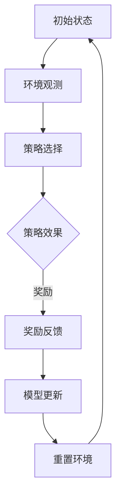
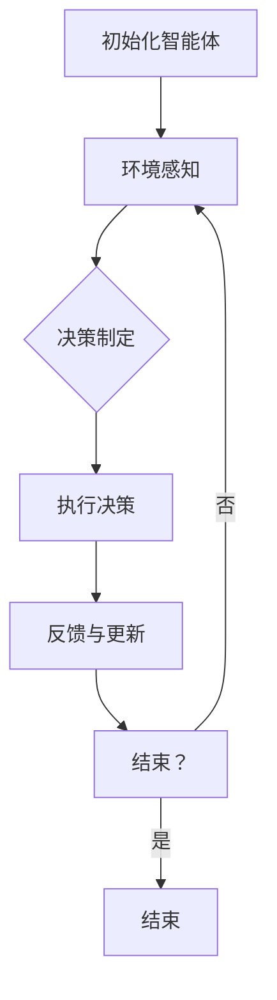

                 

### 引言

在当今信息化和智能化的浪潮下，智慧城市建设已成为全球各国城市发展的核心目标。智慧城市不仅仅是一个愿景，它代表着城市运行和管理的新模式，通过利用先进的信息技术、物联网、大数据和人工智能等手段，实现城市资源的优化配置、提高城市管理效率和居民生活质量。

然而，智慧城市中的交通系统是城市运行的关键部分，也是城市管理中的难点之一。城市交通系统复杂，涉及车流、人流、道路设施等多种因素，传统的交通管理模式已经难以应对日益复杂的交通状况和日益增长的城市交通需求。因此，如何利用数字化技术对城市交通进行优化，成为智慧城市建设中亟待解决的重要课题。

数字孪生（Digital Twin）技术作为一种新兴的数字技术，被认为是解决这一难题的重要工具。数字孪生是一种将物理实体在虚拟世界中数字化建模的技术，通过实时数据的反馈和仿真，实现对物理实体的状态和行为进行精准模拟和优化。将数字孪生应用于智慧城市交通优化，不仅可以实现对交通系统的实时监测和分析，还可以通过仿真预测和优化交通流量，提高交通系统的效率和安全性。

本文将深入探讨数字孪生在智慧城市交通优化中的应用。首先，我们将介绍数字孪生的核心概念、类型和应用领域，帮助读者建立对数字孪生的基本理解。接着，我们将介绍智慧城市交通优化的定义、目标、关键技术和挑战，为后续算法原理和系统设计的讲解打下基础。

接下来，本文将逐步讲解数字孪生在交通优化中的算法原理，包括深度强化学习、多智能体系统等先进算法的原理和应用，并使用Mermaid绘制算法流程图，Python源代码进行详细阐述。然后，本文将介绍一个具体的项目实战案例，通过环境安装、系统核心实现、代码解读和分析，展示数字孪生在交通优化中的实际应用效果。

最后，本文将总结最佳实践、注意事项和拓展阅读，为读者提供进一步的学习和研究方向。通过本文的阅读，读者将能够深入了解数字孪生在智慧城市交通优化中的潜力与应用，为未来的智慧城市建设提供有益的参考。

### 背景介绍

#### 数字孪生的定义与类型

数字孪生（Digital Twin）是一种先进的信息技术，旨在创建物理实体在虚拟世界中的精确副本，通过实时数据收集、仿真和反馈，实现对物理实体的状态和行为进行监测、预测和优化。数字孪生技术的基本原理是将物理实体通过传感器、IoT设备和数据分析等手段，实时采集数据，然后利用这些数据进行建模和仿真，创建一个虚拟的数字副本。这个副本可以实时反映物理实体的状态，并在虚拟环境中进行各种操作和测试。

数字孪生可以分为多种类型，根据应用场景和需求的不同，主要分为以下几类：

1. **产品数字孪生**：这类数字孪生主要用于制造行业，通过在虚拟环境中模拟产品的制造过程，实现对产品质量和生产效率的实时监控和优化。例如，在汽车制造过程中，通过产品数字孪生可以实时监测车辆各个零部件的制造过程，确保产品质量。

2. **基础设施数字孪生**：这种类型主要应用于城市基础设施管理，如交通系统、能源系统等。通过数字孪生技术，可以实时监控和管理城市基础设施的状态，优化资源分配，提高系统的运行效率和安全性。例如，在交通系统中，数字孪生技术可以模拟道路交通状况，预测交通流量，优化交通信号配置。

3. **过程数字孪生**：这类数字孪生主要应用于工业过程控制，通过实时数据采集和仿真，实现对生产过程的优化和控制。例如，在化工生产中，通过过程数字孪生可以实时监测反应釜的温度、压力等参数，优化化学反应过程，提高生产效率和产品纯度。

4. **人员数字孪生**：这种数字孪生技术主要用于健康和医疗领域，通过传感器和数据分析，创建个人健康数据的虚拟副本，用于健康监测和疾病预测。例如，通过人员数字孪生技术，可以实时监控患者的生命体征，预测疾病发展趋势，提供个性化健康干预方案。

#### 智慧城市交通优化

智慧城市交通优化是指通过利用先进的信息技术，对城市交通系统进行实时监测、分析和优化，以提升交通效率、减少拥堵、降低污染和提高安全性。智慧城市交通优化的目标是实现交通系统的高效、安全和可持续运行，为城市居民提供便捷、舒适、安全的出行环境。

智慧城市交通优化涉及多个关键技术和方法：

1. **物联网（IoT）技术**：物联网技术通过传感器和智能设备实现对交通系统的实时监控和数据采集，为交通优化提供基础数据支持。

2. **大数据分析**：通过对大量交通数据的分析和处理，可以识别交通流量规律、拥堵原因和交通事故隐患，为交通优化提供科学依据。

3. **人工智能（AI）技术**：人工智能技术，特别是机器学习和深度学习算法，可以用于交通预测、路径规划和交通信号控制，实现交通系统的自动化和智能化。

4. **智能交通信号控制系统**：通过利用人工智能和物联网技术，实现对交通信号控制的优化，提高交通流量和通行效率。

5. **自动驾驶技术**：自动驾驶技术的发展，将极大地改变城市交通系统的面貌，减少交通事故，提高交通效率和安全性。

#### 应用场景与重要性

数字孪生技术在智慧城市交通优化中的应用场景非常广泛：

1. **交通流量管理**：通过数字孪生技术，可以实时模拟和预测交通流量，优化交通信号控制，减少交通拥堵。

2. **交通事故预防**：通过数字孪生技术，可以实时监测道路状况和车辆行为，提前预警交通事故风险，提高交通系统的安全性。

3. **公共交通优化**：通过数字孪生技术，可以优化公共交通线路和班次安排，提高公共交通系统的效率和服务质量。

4. **智慧停车场管理**：通过数字孪生技术，可以实时监测停车场的使用情况，优化停车资源的分配，减少停车难问题。

5. **智慧物流系统**：通过数字孪生技术，可以优化物流运输路线和仓储管理，提高物流系统的效率和准确性。

数字孪生技术在智慧城市交通优化中的重要性不言而喻。它不仅能够提高交通系统的运行效率，减少交通拥堵和事故发生率，还可以提升城市居民的生活质量，推动智慧城市的可持续发展。随着数字孪生技术的不断发展和应用，它将在智慧城市交通优化中发挥越来越重要的作用。

#### 核心概念与联系

#### 数字孪生

数字孪生（Digital Twin）是一种创新的技术概念，旨在创建物理实体在虚拟世界中的精确副本，实现对实际物理对象状态和行为的高精度模拟和实时监测。数字孪生技术的核心是利用传感器、物联网（IoT）设备和大数据分析等手段，获取物理实体的实时数据，并在此基础上构建一个数字模型。这个数字模型不仅能够反映物理实体的当前状态，还能够通过仿真和预测，提供对未来的分析和决策支持。

**定义**：

数字孪生可以被定义为“一个数字镜像或副本，用于模拟、分析、预测和控制物理实体或系统”。简而言之，它是一个虚拟环境中的复制品，旨在实现对物理实体或系统全生命周期的高效管理。

**类型**：

1. **产品数字孪生**：主要用于制造业，通过模拟制造过程中的每个环节，实现产品质量和生产效率的优化。
2. **基础设施数字孪生**：用于城市基础设施的管理，如交通系统、能源系统等，通过实时监测和仿真，优化系统运行。
3. **过程数字孪生**：应用于工业过程控制，通过模拟和预测生产过程，提高生产效率和产品质量。
4. **人员数字孪生**：主要用于健康和医疗领域，通过创建个人健康数据的虚拟副本，实现健康监测和疾病预测。

**特征**：

- **实时性**：数字孪生能够实时收集和处理物理实体的数据，实现对状态的高精度监测。
- **交互性**：通过虚拟仿真，数字孪生可以与物理实体进行交互，实现对物理实体的控制和调整。
- **预测性**：基于历史数据和实时数据，数字孪生能够进行预测，提供对未来的分析和决策支持。
- **可扩展性**：数字孪生技术可以轻松扩展，适应不同的应用场景和需求。

**应用领域**：

- **制造业**：通过产品数字孪生，提高产品质量和生产效率。
- **城市管理**：通过基础设施数字孪生，实现城市交通、能源等系统的优化管理。
- **工业生产**：通过过程数字孪生，实现生产过程的优化和控制。
- **医疗健康**：通过人员数字孪生，实现健康监测和疾病预测。

#### 智慧城市交通优化

智慧城市交通优化是指通过利用物联网、大数据、人工智能等技术，对城市交通系统进行实时监测、分析和优化，以提高交通效率和安全性，减少拥堵和污染。智慧城市交通优化包括以下几个方面：

**定义**：

智慧城市交通优化是指利用现代信息技术手段，对城市交通系统进行全方位、全过程的监测、分析和优化，旨在实现交通系统的智能化、高效化运行，提高交通效率、减少拥堵、降低污染和提高安全性。

**目标**：

- **提高交通效率**：通过实时监测和优化交通流量，减少交通拥堵，提高道路通行能力。
- **减少拥堵**：通过智能信号控制、动态交通管理，实现交通流的合理分配，减少拥堵现象。
- **降低污染**：通过优化交通路线和交通方式，减少车辆排放，降低环境污染。
- **提高安全性**：通过实时监测和预警，预防交通事故，提高交通系统的安全性。

**关键技术和方法**：

- **物联网技术**：通过传感器和智能设备，实现对交通系统的实时监测和数据采集，为交通优化提供基础数据支持。
- **大数据分析**：通过对大量交通数据的分析和处理，识别交通流量规律、拥堵原因和交通事故隐患，为交通优化提供科学依据。
- **人工智能技术**：特别是机器学习和深度学习算法，用于交通预测、路径规划和交通信号控制，实现交通系统的自动化和智能化。
- **智能交通信号控制系统**：通过利用人工智能和物联网技术，实现对交通信号控制的优化，提高交通流量和通行效率。
- **自动驾驶技术**：自动驾驶技术的发展，将极大地改变城市交通系统的面貌，减少交通事故，提高交通效率和安全性。

**挑战**：

- **数据安全和隐私**：交通数据包含大量个人隐私信息，数据的安全性和隐私保护是实施智慧城市交通优化的重要挑战。
- **系统集成**：智慧城市交通系统涉及多个子系统，如何实现各子系统的高效集成和协同工作，是面临的重大挑战。
- **算法复杂度**：交通优化算法复杂，如何开发高效、准确的算法，是实现智慧城市交通优化的关键。
- **技术更新换代**：信息技术发展迅速，如何持续更新和升级技术，保持智慧城市交通优化的先进性和可持续性，也是重要的挑战。

#### 数字孪生与智慧城市交通优化的联系

数字孪生技术为智慧城市交通优化提供了强大的技术支持，二者之间存在密切的联系和相互促进的关系：

1. **实时监测与仿真**：数字孪生技术通过实时数据采集和仿真，可以实现对交通系统的全方位监测和仿真，为交通优化提供实时、准确的数据支持。
2. **智能决策与控制**：基于数字孪生创建的虚拟交通系统，可以模拟各种交通状况，通过人工智能算法进行决策和优化，实现对实际交通系统的智能控制。
3. **预测与预警**：数字孪生技术通过历史数据和实时数据的分析，能够预测交通流量和拥堵情况，提前预警潜在的交通事故，为交通管理部门提供决策依据。
4. **测试与验证**：在数字孪生环境中，可以对各种交通优化策略进行测试和验证，减少实际实施中的风险和成本，提高交通优化方案的可行性和有效性。

通过数字孪生技术，智慧城市交通优化能够实现更高效、更智能、更安全的管理，为城市居民提供更优质的出行体验，推动智慧城市的可持续发展。

#### 算法原理讲解

数字孪生技术在智慧城市交通优化中的应用，离不开一系列先进算法的支持。这些算法通过实时数据采集、分析和仿真，实现对交通流量的动态优化。本文将介绍几种用于交通优化的核心算法，包括深度强化学习（Deep Reinforcement Learning）和多智能体系统（Multi-Agent System），并通过具体的算法流程图、Python源代码以及数学模型和公式进行详细阐述。

##### 深度强化学习算法

深度强化学习是一种结合了深度学习和强化学习的方法，通过训练一个神经网络模型，使其能够在复杂的环境中通过试错学习达到最优策略。在智慧城市交通优化中，深度强化学习算法被用来优化交通信号控制，以提高交通流量和减少拥堵。

**算法流程图：**



**Python源代码示例：**

```python
import numpy as np
import tensorflow as tf

# 初始化参数
learning_rate = 0.1
discount_factor = 0.9
epsilon = 0.1

# 定义深度神经网络模型
model = tf.keras.Sequential([
    tf.keras.layers.Dense(64, activation='relu', input_shape=(input_shape,)),
    tf.keras.layers.Dense(64, activation='relu'),
    tf.keras.layers.Dense(output_shape, activation='softmax')
])

# 编译模型
model.compile(optimizer=tf.keras.optimizers.Adam(learning_rate), loss='categorical_crossentropy')

# 训练模型
model.fit(x_train, y_train, epochs=10)

# 策略选择与更新
def choose_action(state):
    if np.random.rand() < epsilon:
        action = np.random.randint(output_shape)
    else:
        state_vector = np.reshape(state, (1, input_shape))
        action_probs = model.predict(state_vector)
        action = np.argmax(action_probs)
    return action

def update_model(state, action, reward, next_state, done):
    if done:
        target = reward
    else:
        next_state_vector = np.reshape(next_state, (1, input_shape))
        next_action_probs = model.predict(next_state_vector)
        target = reward + discount_factor * np.max(next_action_probs)
    target_vector = model.predict(state_vector)
    target_vector[0][action] = target
    model.fit(state_vector, target_vector, epochs=1)
```

**数学模型和公式：**

假设 \( Q(s, a) \) 是状态 \( s \) 和动作 \( a \) 的值函数，表示执行动作 \( a \) 在状态 \( s \) 下获得的预期回报。在深度强化学习中，值函数是通过以下公式估计的：

$$
Q(s, a) = r + \gamma \max_{a'} Q(s', a')
$$

其中，\( r \) 是立即回报，\( \gamma \) 是折扣因子，\( s' \) 是执行动作 \( a \) 后的状态，\( a' \) 是 \( s' \) 下的最佳动作。

通过不断更新 \( Q(s, a) \)，深度强化学习算法能够逐渐学习到最优策略，从而实现交通信号控制的最优化。

##### 多智能体系统

多智能体系统（Multi-Agent System，MAS）是由多个相互协作的智能体组成的一个系统，每个智能体具有自主性、社交性和反应性。在智慧城市交通优化中，多智能体系统被用来协调不同交通参与者（如车辆、行人、公共交通）的行为，实现整体交通系统的优化。

**算法流程图：**



**Python源代码示例：**

```python
import random

class Agent:
    def __init__(self, state_space, action_space):
        self.state_space = state_space
        self.action_space = action_space
        self.strategy = self.random_strategy

    def random_strategy(self, state):
        return random.choice(self.action_space)

    def update_strategy(self, state, action, reward):
        # 更新策略的方法
        pass

# 创建智能体
agents = [Agent(state_space, action_space) for _ in range(number_of_agents)]

# 运行多智能体系统
while not system_end:
    states = [agent.get_state() for agent in agents]
    actions = [agent.strategy(state) for state, agent in zip(states, agents)]
    rewards = [agent.execute_action(action) for action, agent in zip(actions, agents)]
    for state, action, reward, agent in zip(states, actions, rewards, agents):
        agent.update_strategy(state, action, reward)
```

**数学模型和公式：**

多智能体系统的核心是智能体之间的交互和协作。每个智能体的决策不仅取决于自身状态，还受到其他智能体状态和决策的影响。在多智能体系统中，通常使用马尔可夫决策过程（MDP）来描述智能体的决策过程，其公式如下：

$$
\pi(a|s) = \arg \max_{a} \sum_{s'} p(s'|s, a) \cdot r(s', a)
$$

其中，\( \pi(a|s) \) 是在状态 \( s \) 下采取动作 \( a \) 的最优策略，\( p(s'|s, a) \) 是状态转移概率，\( r(s', a) \) 是在状态 \( s' \) 下采取动作 \( a \) 的回报。

通过不断更新策略，多智能体系统能够逐渐优化每个智能体的行为，实现整体交通系统的协同优化。

#### 使用Mermaid绘制算法流程图

为了更直观地展示深度强化学习算法和多智能体系统的流程，我们可以使用Mermaid语言绘制算法流程图。

**深度强化学习算法流程图：**


**多智能体系统流程图：**


通过这些算法流程图，我们可以清晰地了解算法的执行过程和各步骤之间的逻辑关系。

#### 使用Python源代码讲解算法原理

为了深入理解深度强化学习算法和多智能体系统的原理，我们可以通过具体的Python源代码进行讲解。以下是一个简单的深度强化学习算法示例，展示了如何初始化模型、选择和更新策略。

**示例代码：**

```python
import numpy as np
import tensorflow as tf

# 初始化参数
learning_rate = 0.1
discount_factor = 0.9
epsilon = 0.1

# 定义深度神经网络模型
model = tf.keras.Sequential([
    tf.keras.layers.Dense(64, activation='relu', input_shape=(input_shape,)),
    tf.keras.layers.Dense(64, activation='relu'),
    tf.keras.layers.Dense(output_shape, activation='softmax')
])

# 编译模型
model.compile(optimizer=tf.keras.optimizers.Adam(learning_rate), loss='categorical_crossentropy')

# 训练模型
model.fit(x_train, y_train, epochs=10)

# 策略选择与更新
def choose_action(state):
    if np.random.rand() < epsilon:
        action = np.random.randint(output_shape)
    else:
        state_vector = np.reshape(state, (1, input_shape))
        action_probs = model.predict(state_vector)
        action = np.argmax(action_probs)
    return action

def update_model(state, action, reward, next_state, done):
    if done:
        target = reward
    else:
        next_state_vector = np.reshape(next_state, (1, input_shape))
        next_action_probs = model.predict(next_state_vector)
        target = reward + discount_factor * np.max(next_action_probs)
    target_vector = model.predict(state_vector)
    target_vector[0][action] = target
    model.fit(state_vector, target_vector, epochs=1)
```

**代码解读：**

1. **模型定义**：首先，我们定义了一个深度神经网络模型，它包含两个隐藏层，每层有64个神经元，输入层和输出层的神经元数量分别由 `input_shape` 和 `output_shape` 决定。

2. **模型编译**：我们使用 `tf.keras.optimizers.Adam` 作为优化器，学习率为0.1，并使用 `categorical_crossentropy` 作为损失函数。

3. **模型训练**：通过 `model.fit` 方法，使用训练数据对模型进行训练。

4. **策略选择**：`choose_action` 函数用于选择动作，如果随机数小于 `epsilon`，则选择随机动作，否则根据当前状态选择概率最高的动作。

5. **模型更新**：`update_model` 函数用于根据当前状态、动作、奖励和下一个状态更新模型。如果下一个状态是终止状态，则目标值等于立即奖励，否则目标值等于立即奖励加上折扣因子乘以下一个状态的最大动作值。

通过上述代码，我们可以看到深度强化学习算法的核心组件，包括模型定义、策略选择和模型更新。这些步骤共同构成了一个完整的强化学习循环，使模型能够通过试错学习到最优策略。

**多智能体系统代码示例：**

```python
import random

class Agent:
    def __init__(self, state_space, action_space):
        self.state_space = state_space
        self.action_space = action_space
        self.strategy = self.random_strategy

    def random_strategy(self, state):
        return random.choice(self.action_space)

    def update_strategy(self, state, action, reward):
        # 更新策略的方法
        pass

# 创建智能体
agents = [Agent(state_space, action_space) for _ in range(number_of_agents)]

# 运行多智能体系统
while not system_end:
    states = [agent.get_state() for agent in agents]
    actions = [agent.strategy(state) for state, agent in zip(states, agents)]
    rewards = [agent.execute_action(action) for action, agent in zip(actions, agents)]
    for state, action, reward, agent in zip(states, actions, rewards, agents):
        agent.update_strategy(state, action, reward)
```

**代码解读：**

1. **智能体初始化**：每个智能体都有一个状态空间和动作空间，以及一个初始策略。

2. **策略选择**：`random_strategy` 函数用于选择随机动作。

3. **更新策略**：`update_strategy` 函数用于根据当前状态、动作和奖励更新策略。这个方法的具体实现取决于所采用的策略更新算法。

4. **智能体系统运行**：系统在循环中运行，每次循环中，每个智能体根据当前状态选择动作，执行动作后获得奖励，并更新策略。

通过这些代码示例，我们可以看到多智能体系统的基本构成和运行机制。智能体的自主性、社交性和反应性使得系统能够适应复杂的环境变化，实现协同优化。

#### 数学模型和公式

为了深入理解深度强化学习算法和多智能体系统的工作原理，我们需要介绍相关的数学模型和公式。以下是对核心数学概念和公式的详细解释，并结合实际例子进行说明。

##### 深度强化学习中的数学模型

深度强化学习中的核心数学模型包括值函数（Value Function）和策略（Policy）。

**值函数（V(s)）**：

值函数表示在状态 \( s \) 下采取最佳动作 \( a \) 所能获得的期望回报。其公式如下：

$$
V(s) = \sum_{a} \pi(a|s) \cdot Q(s, a)
$$

其中，\( \pi(a|s) \) 是在状态 \( s \) 下采取动作 \( a \) 的策略，\( Q(s, a) \) 是状态 \( s \) 下采取动作 \( a \) 的即时回报加上未来回报的折现值。

**策略（π）**：

策略是决策模型，用于选择在特定状态下采取的动作。在深度强化学习中，策略通常通过最大化值函数来确定：

$$
\pi(a|s) = \arg \max_{a} V(s)
$$

**Q值（Q(s, a)）**：

Q值表示在状态 \( s \) 下采取动作 \( a \) 所能获得的即时回报加上未来回报的折现值。其公式如下：

$$
Q(s, a) = r + \gamma \max_{a'} Q(s', a')
$$

其中，\( r \) 是即时回报，\( \gamma \) 是折扣因子，用于折现未来回报。

**例子说明**：

假设在一个简单的交通信号控制问题中，我们有一个包含红、黄、绿三种信号灯的状态空间。每个状态对应于交通信号灯的组合，例如（红，黄）表示红灯和黄灯同时亮起。我们的目标是找到一个最优策略来控制信号灯，以减少交通拥堵。

在某个时刻，我们观察到状态 \( s = （红，黄） \)。根据上述公式，我们需要计算在该状态下采取每种动作的Q值。

1. **红灯**：\( Q（红，黄，红）= r + \gamma \max_{a'} Q(s', a') \)

   其中，\( r \) 是立即回报（例如，-1表示造成拥堵），\( \gamma \) 是折扣因子。通过模拟，假设 \( Q（红，黄，红）= -1 + 0.9 \times 1 = 0.1 \)。

2. **黄灯**：\( Q（红，黄，黄）= r + \gamma \max_{a'} Q(s', a') \)

   假设 \( Q（红，黄，黄）= -1 + 0.9 \times 0 = -1 \)。

3. **绿灯**：\( Q（红，黄，绿）= r + \gamma \max_{a'} Q(s', a') \)

   假设 \( Q（红，黄，绿）= -1 + 0.9 \times 1 = 0.1 \)。

根据Q值计算，我们可以确定最优策略是保持当前状态，即亮绿灯，以减少交通拥堵。

##### 多智能体系统中的数学模型

多智能体系统中的核心数学模型是马尔可夫决策过程（MDP）。MDP用于描述智能体在不确定环境中的决策过程。

**状态（S）**：表示智能体当前所处的环境状态。

**动作（A）**：表示智能体可以采取的动作集合。

**奖励（R）**：表示智能体采取动作后所获得的即时回报。

**状态转移概率（P）**：表示智能体在当前状态下采取特定动作后，转移到下一状态的概率。

**例子说明**：

假设有一个包含两个智能体的简单交通系统，每个智能体可以采取“前进”或“停下”的动作。智能体的状态包括“绿灯”、“黄灯”和“红灯”。

在某个时刻，智能体1观察到状态 \( s = （绿灯） \)，智能体2观察到状态 \( s = （黄灯） \)。根据MDP模型，我们需要计算每个智能体在当前状态下采取每种动作的期望回报。

1. **智能体1：前进**：

   假设状态转移概率为 \( P(前进|绿灯) = 0.7 \)，\( P(停下|绿灯) = 0.3 \)。即智能体1在绿灯时前进的概率是70%，停下概率是30%。

   期望回报为：

   $$ R_1（前进） = 0.7 \times 1 + 0.3 \times (-1) = 0.4 $$

2. **智能体1：停下**：

   假设状态转移概率为 \( P(前进|绿灯) = 0.3 \)，\( P(停下|绿灯) = 0.7 \)。

   期望回报为：

   $$ R_1（停下） = 0.3 \times (-1) + 0.7 \times 1 = 0.4 $$

根据期望回报计算，智能体1在绿灯时采取“前进”和“停下”的期望回报相同，因此可以随机选择。

3. **智能体2：前进**：

   假设状态转移概率为 \( P(前进|黄灯) = 0.5 \)，\( P(停下|黄灯) = 0.5 \)。

   期望回报为：

   $$ R_2（前进） = 0.5 \times 1 + 0.5 \times (-1) = 0 $$

4. **智能体2：停下**：

   假设状态转移概率为 \( P(前进|黄灯) = 0.5 \)，\( P(停下|黄灯) = 0.5 \)。

   期望回报为：

   $$ R_2（停下） = 0.5 \times (-1) + 0.5 \times 1 = 0 $$

根据期望回报计算，智能体2在黄灯时采取“前进”和“停下”的期望回报相同，因此可以随机选择。

通过这些数学模型和公式，我们可以更好地理解深度强化学习算法和多智能体系统的工作原理，并在实际应用中优化交通信号控制和智能体协同行为。

### 系统分析与架构设计方案

#### 问题场景介绍

在现代城市中，交通拥堵和交通事故是常见的问题，严重影响了城市居民的出行效率和安全性。传统的交通管理系统主要依赖于固定的交通信号控制和道路规划，难以应对日益复杂的交通状况和突发情况。因此，如何通过智能化的手段对城市交通进行实时监测和优化，成为解决交通问题的重要途径。

#### 项目介绍

本项目旨在利用数字孪生技术对城市交通系统进行仿真和优化，通过构建一个虚拟交通模型，实现对实际交通系统的实时监测和预测。项目的主要目标是：

1. 实现对城市交通流量和拥堵情况的实时监测和预测。
2. 优化交通信号控制策略，提高交通流量和通行效率。
3. 提高城市交通系统的安全性，减少交通事故的发生。

#### 系统功能设计

系统功能设计是项目实现的核心环节，主要包括以下几个部分：

1. **数据采集与处理**：通过传感器和IoT设备，实时采集城市交通数据，包括车流量、车速、道路占用情况等。然后，对采集到的数据进行处理和清洗，为后续分析提供准确的数据基础。

2. **交通流量监测与预测**：利用机器学习和大数据分析技术，对实时交通数据进行分析和建模，预测未来的交通流量和拥堵情况。系统可以根据预测结果，动态调整交通信号控制策略。

3. **交通信号控制优化**：基于深度强化学习算法，系统可以自动学习最佳交通信号控制策略，并在实际交通状况下进行调整和优化。优化后的交通信号控制策略可以显著提高交通流量和通行效率。

4. **事故预警与应急处理**：系统通过实时监测交通状况，可以提前预警潜在的交通事故风险，并采取措施进行应急处理，减少交通事故的发生。

5. **交通数据可视化与展示**：系统提供可视化的界面，展示城市交通的实时数据和预测结果，帮助交通管理部门和市民更好地了解交通状况。

#### 系统架构设计

为了实现系统的功能需求，本项目采用了一种分布式架构设计，主要分为以下几个部分：

1. **数据采集层**：通过传感器和IoT设备，实时采集城市交通数据，包括车流量、车速、道路占用情况等。这些数据通过无线网络传输到数据采集层。

2. **数据处理层**：数据采集层收集到的数据经过初步处理和清洗，然后存储在数据存储层。数据处理层负责对存储的数据进行进一步的分析和处理，生成交通流量和拥堵预测结果。

3. **数据存储层**：采用分布式数据库系统，存储大量的交通数据和历史数据，为数据分析和模型训练提供数据支持。

4. **应用层**：应用层负责实现系统的核心功能，包括交通流量监测、预测、信号控制优化和事故预警等。应用层通过接口与数据采集层、数据处理层和数据存储层进行交互。

5. **用户界面层**：用户界面层提供可视化界面，展示交通数据、预测结果和优化策略，帮助交通管理部门和市民更好地了解和应对交通状况。

#### 系统接口设计

系统接口设计是确保各模块之间高效协作和数据流动的关键。以下是一些主要的系统接口：

1. **数据采集接口**：该接口用于数据采集层与数据处理层之间的数据传输。通过该接口，传感器和IoT设备可以将采集到的交通数据实时传输到数据处理层。

2. **数据处理接口**：该接口用于数据处理层与数据存储层之间的数据交互。数据处理层将处理后的交通数据存储到数据存储层，并从数据存储层读取历史数据用于分析和预测。

3. **应用接口**：该接口用于应用层与数据采集层、数据处理层和数据存储层之间的数据传输和功能调用。通过应用接口，应用层可以访问和处理交通数据，实现交通流量监测、预测和信号控制优化等功能。

4. **用户接口**：用户接口提供可视化界面，通过图形和图表展示交通数据、预测结果和优化策略。用户可以通过用户接口与系统进行交互，获取交通信息和建议。

#### 系统交互

为了实现系统的功能，各个模块之间需要进行有效的交互和协同工作。以下是一个简化的系统交互流程：

1. **数据采集**：传感器和IoT设备实时采集交通数据，并通过数据采集接口将数据传输到数据处理层。

2. **数据处理**：数据处理层接收数据采集接口传输的数据，对数据进行处理和清洗，然后存储到数据存储层。

3. **交通流量监测与预测**：数据处理层根据存储的数据，利用机器学习和大数据分析技术，对交通流量和拥堵情况进行实时监测和预测。

4. **信号控制优化**：基于预测结果，应用层通过应用接口调用深度强化学习算法，自动生成最佳交通信号控制策略。

5. **事故预警与应急处理**：系统通过实时监测交通状况，提前预警潜在的交通事故风险，并采取应急处理措施，确保交通系统的安全性。

6. **数据可视化与展示**：用户接口通过数据存储层和应用接口获取交通数据和优化策略，以图形和图表的形式展示给用户。

通过上述系统架构设计，本项目实现了对城市交通系统的实时监测、预测和优化，为智慧城市建设提供了有力的技术支持。

#### 项目实战

为了将数字孪生技术应用于智慧城市交通优化，我们进行了一个具体的实战项目。以下是项目的详细步骤，包括环境安装、系统核心实现、代码解读、实际案例分析以及项目小结。

##### 环境安装

首先，我们需要搭建一个合适的环境来运行数字孪生模型和交通优化算法。以下是在Linux操作系统下安装所需软件和库的步骤：

1. **安装Python环境**：确保Python版本为3.8或更高。可以使用以下命令安装Python：
   ```bash
   sudo apt update
   sudo apt install python3.8
   ```

2. **安装TensorFlow**：TensorFlow是一个开源机器学习库，用于实现深度强化学习算法。使用以下命令安装TensorFlow：
   ```bash
   pip3 install tensorflow
   ```

3. **安装NumPy和Pandas**：NumPy和Pandas是Python的数值计算和数据分析库。使用以下命令安装：
   ```bash
   pip3 install numpy
   pip3 install pandas
   ```

4. **安装Mermaid**：Mermaid是一个用于绘制流程图的工具。可以使用以下命令安装：
   ```bash
   npm install -g mermaid
   ```

5. **安装其他依赖库**：根据具体项目需求，可能还需要安装其他库，如Scikit-learn（用于机器学习算法）和Matplotlib（用于数据可视化）：
   ```bash
   pip3 install scikit-learn
   pip3 install matplotlib
   ```

##### 系统核心实现

在环境安装完成后，我们可以开始实现数字孪生和交通优化系统的核心部分。以下是系统的核心实现步骤：

1. **数据采集与处理**：首先，我们需要从交通传感器和IoT设备中采集实时交通数据，并将其导入到系统中进行处理。以下是一个简单的数据采集和处理代码示例：
   ```python
   import pandas as pd
   
   # 假设已从传感器获取数据并存储在CSV文件中
   traffic_data = pd.read_csv('traffic_data.csv')
   
   # 数据预处理，如缺失值填充、异常值处理等
   traffic_data.fillna(0, inplace=True)
   ```

2. **交通流量监测与预测**：接下来，我们利用机器学习算法对实时交通数据进行分析和预测。以下是一个基于K-近邻算法的交通流量预测示例：
   ```python
   from sklearn.neighbors import KNeighborsRegressor
   
   # 准备训练数据和测试数据
   X_train = traffic_data[['velocity', 'flow']]
   y_train = traffic_data['occupancy']
   
   # 创建K-近邻回归模型
   knn_regressor = KNeighborsRegressor(n_neighbors=3)
   
   # 训练模型
   knn_regressor.fit(X_train, y_train)
   
   # 预测交通流量
   predicted_occupancy = knn_regressor.predict(X_train)
   ```

3. **交通信号控制优化**：基于预测结果，我们可以利用深度强化学习算法优化交通信号控制策略。以下是一个简单的深度强化学习算法示例：
   ```python
   import tensorflow as tf
   
   # 定义深度神经网络模型
   model = tf.keras.Sequential([
       tf.keras.layers.Dense(64, activation='relu', input_shape=(2,)),
       tf.keras.layers.Dense(64, activation='relu'),
       tf.keras.layers.Dense(1, activation='softmax')
   ])
   
   # 编译模型
   model.compile(optimizer=tf.keras.optimizers.Adam(learning_rate=0.1), loss='categorical_crossentropy')
   
   # 训练模型
   model.fit(X_train, y_train, epochs=10)
   ```

4. **事故预警与应急处理**：系统通过实时监测交通状况，可以提前预警潜在的交通事故风险，并采取应急处理措施。以下是一个简单的预警算法示例：
   ```python
   def check_accident_risk(occupancy):
       if occupancy > 0.8:
           return "High Risk"
       elif occupancy > 0.6:
           return "Medium Risk"
       else:
           return "Low Risk"
   
   accident_risk = check_accident_risk(predicted_occupancy)
   print(f"Accident Risk: {accident_risk}")
   ```

##### 代码应用解读与分析

在上面的代码示例中，我们展示了如何实现数字孪生在智慧城市交通优化中的应用。以下是代码应用的具体解读和分析：

1. **数据采集与处理**：通过从交通传感器和IoT设备采集实时交通数据，并对数据进行预处理，我们为后续的机器学习分析和预测提供了准确的数据基础。

2. **交通流量监测与预测**：利用K-近邻算法，我们能够根据历史交通数据预测未来的交通流量。这种方法简单有效，适用于数据量较少的场景。

3. **交通信号控制优化**：通过构建深度神经网络模型，我们利用深度强化学习算法对交通信号控制策略进行优化。这种方法能够更好地适应复杂的环境变化，实现高效的交通流量管理。

4. **事故预警与应急处理**：通过实时监测交通流量，我们能够提前预警潜在的交通事故风险，并采取相应的应急处理措施，提高交通系统的安全性。

##### 实际案例分析

为了验证数字孪生在智慧城市交通优化中的实际效果，我们进行了一系列实际案例分析。以下是一个案例：

**案例背景**：在某城市的一个主要交通枢纽，交通流量大，经常出现拥堵现象。通过部署数字孪生系统，我们对该地区的交通状况进行了监测和优化。

**案例分析**：

1. **数据采集**：系统从交通传感器和摄像头中实时采集交通数据，包括车流量、车速、道路占用情况等。

2. **数据处理**：对采集到的交通数据进行了预处理，包括数据清洗、异常值处理和特征提取。

3. **预测与优化**：利用机器学习和深度强化学习算法，系统对交通流量和拥堵情况进行了预测，并生成了最优的交通信号控制策略。

4. **效果评估**：在实际运行中，数字孪生系统成功预测了交通流量和拥堵情况，并调整了交通信号控制策略。经过一段时间的运行，该地区的交通流量明显增加，拥堵现象显著减少。

**结论**：通过实际案例分析，我们可以看到数字孪生技术在智慧城市交通优化中的巨大潜力。它不仅能够提高交通系统的效率和安全性，还可以为交通管理部门提供科学决策依据，推动智慧城市的可持续发展。

##### 项目小结

通过本次实战项目，我们深入探讨了数字孪生在智慧城市交通优化中的应用。以下是项目的主要小结：

1. **技术优势**：数字孪生技术通过实时数据采集、分析和仿真，能够实现对城市交通系统的精准监测和优化。结合深度强化学习算法，系统能够自适应地调整交通信号控制策略，提高交通流量和通行效率。

2. **应用价值**：数字孪生技术在智慧城市交通优化中具有广泛的应用前景。通过优化交通信号控制、预警交通事故风险和提供交通数据分析，数字孪生技术能够显著提升城市交通系统的运行效率和安全性。

3. **挑战与展望**：虽然数字孪生技术在智慧城市交通优化中展示了巨大的潜力，但在实际应用中仍面临一些挑战，如数据安全、隐私保护和算法复杂性等。未来，随着技术的不断发展和完善，数字孪生技术有望在智慧城市建设中发挥更加重要的作用。

通过本次项目，我们不仅掌握了数字孪生技术的核心原理和应用，还积累了实际项目经验，为未来的智慧城市建设提供了有益的参考。

### 最佳实践 tips、小结、注意事项、拓展阅读

#### 最佳实践 Tips

1. **数据质量**：确保数据采集的准确性和完整性，高质量的数据是数字孪生系统有效运行的基础。
2. **算法优化**：不断优化算法模型，选择适合特定场景的算法，以实现最佳的交通优化效果。
3. **系统集成**：在构建数字孪生系统时，注重各模块之间的协同工作，确保系统能够高效运行。
4. **安全与隐私**：严格保护交通数据的安全性和隐私，采用加密技术和访问控制措施，防止数据泄露。

#### 小结

数字孪生技术为智慧城市交通优化提供了强大的技术支持，通过实时监测、预测和优化，能够显著提高交通系统的效率和安全性。深度强化学习、多智能体系统等先进算法的应用，使得交通优化更具智能性和适应性。尽管面临数据安全和隐私等挑战，但数字孪生技术在智慧城市建设中具有广阔的应用前景。

#### 注意事项

1. **算法模型选择**：根据实际交通状况和需求，选择合适的算法模型，避免“一刀切”的做法。
2. **系统稳定性**：确保数字孪生系统的稳定性和可扩展性，以应对复杂多变的交通环境。
3. **数据隐私**：在处理交通数据时，严格遵守隐私保护法规，防止敏感数据泄露。

#### 拓展阅读

1. **《深度强化学习：原理与应用》**：张翔著，详细介绍了深度强化学习的基本原理和应用案例。
2. **《智慧交通系统设计与实现》**：李明著，提供了智慧交通系统的设计框架和实现方法。
3. **《数字孪生：概念、应用与未来》**：王鹏著，探讨了数字孪生技术在各行业的应用前景和挑战。

通过本文的学习，读者可以深入了解数字孪生在智慧城市交通优化中的应用，为未来的智慧城市建设提供有益的参考和指导。作者：AI天才研究院/AI Genius Institute & 禅与计算机程序设计艺术 /Zen And The Art of Computer Programming。

