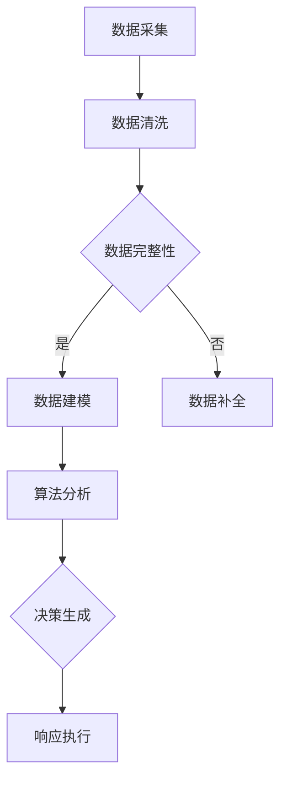
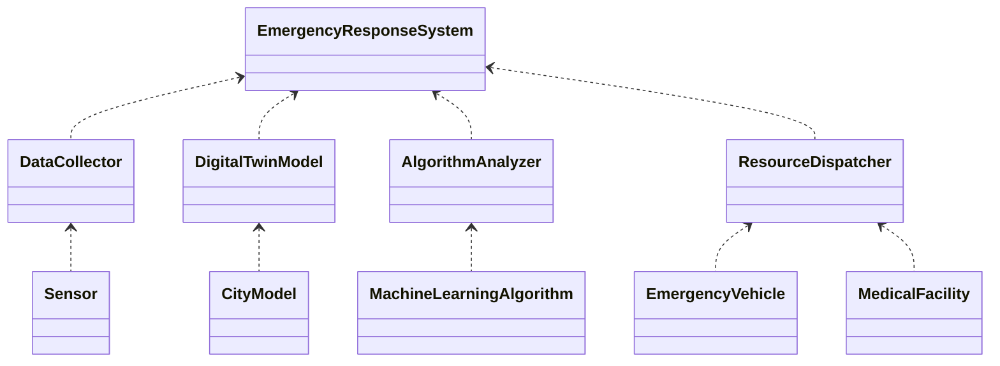
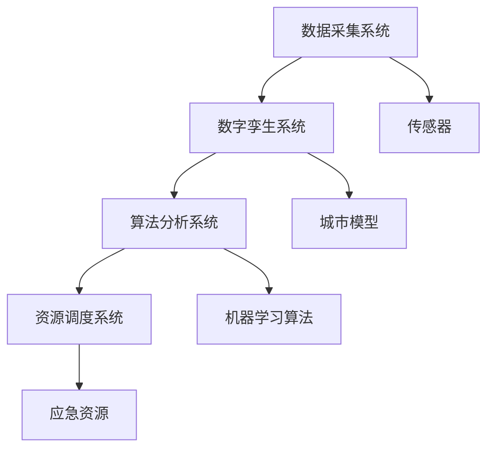
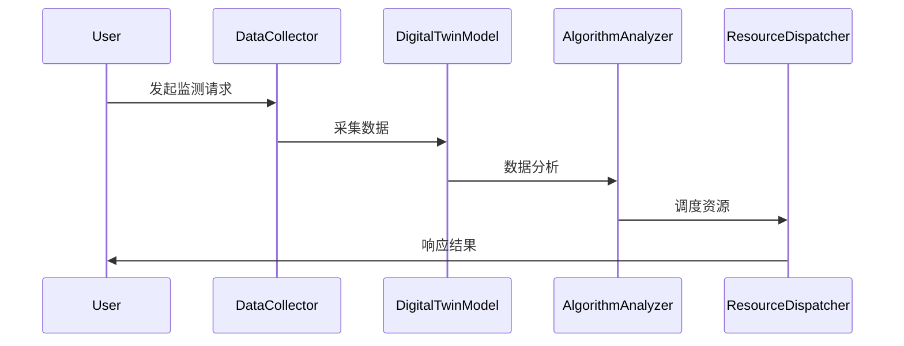

                 

# 数字孪生在智慧城市应急响应中的应用

关键词：数字孪生、智慧城市、应急响应、算法、系统架构、项目实战

摘要：本文旨在探讨数字孪生技术在智慧城市应急响应中的应用，通过深入剖析数字孪生的概念、原理、算法及其实际应用，揭示其在提高城市应急响应效率和准确性方面的巨大潜力。文章将分为七个部分，首先介绍数字孪生和智慧城市应急响应的背景，然后逐步探讨核心概念、算法原理、系统架构设计、项目实战，最后给出最佳实践建议和小结。

## 1. 背景介绍

### 1.1 问题背景

随着城市化进程的加速，智慧城市的概念逐渐深入人心。智慧城市不仅仅是信息技术的应用，更是城市治理的一种新范式，旨在通过数据驱动的决策，实现资源的高效利用、环境的可持续发展以及居民生活质量的提升。然而，智慧城市的建设过程中，应急响应能力显得尤为重要。在突发事件中，如自然灾害、交通事故、公共卫生事件等，城市应急响应的速度和准确性直接关系到公共安全和社会稳定。

### 1.2 问题描述

当前，城市应急响应存在以下问题：

- **信息不对称**：各部门之间信息沟通不畅，应急资源调度不及时。
- **响应速度慢**：缺乏快速响应的机制和工具，导致应急响应时间过长。
- **准确性不足**：应急预案和实际操作之间存在差距，应急响应效果不佳。

### 1.3 问题解决

数字孪生技术的引入，为智慧城市应急响应提供了新的思路和解决方案。数字孪生是一种通过构建物理实体或系统的数字镜像，实现虚拟与现实的联动，从而对现实世界进行模拟、分析和优化的技术。在智慧城市应急响应中，数字孪生技术可以通过以下方式解决问题：

- **实时监测与预警**：通过数字孪生模型实时监控城市运行状态，提前预警潜在风险。
- **协同决策与调度**：基于数字孪生模型进行应急资源调度，实现快速响应。
- **模拟与演练**：通过数字孪生模型进行应急预案模拟和演练，提升应急响应准确性。

### 1.4 边界与外延

数字孪生在智慧城市应急响应中的应用，不仅限于单一领域，还涉及多个环节的协同工作。例如，在城市交通应急响应中，数字孪生技术可以用于交通流量模拟、道路状况监测和交通信号优化；在公共卫生应急响应中，可以用于疫情传播模拟、医疗资源分配和公共卫生决策。

### 1.5 概念结构与核心要素组成

数字孪生在智慧城市应急响应中的概念结构主要由以下几个核心要素组成：

- **数据采集与传输**：通过传感器、物联网等技术获取城市运行数据，并实时传输至数字孪生平台。
- **数字孪生模型**：构建城市的数字镜像，实现对现实世界的模拟和分析。
- **算法与智能分析**：利用大数据分析和机器学习算法，对数字孪生模型进行优化和决策。
- **应急响应系统**：基于数字孪生模型和算法分析结果，实现应急资源的调度和响应。

## 2. 核心概念与联系

### 2.1 核心概念原理

数字孪生（Digital Twin）是一种将物理实体或系统通过数字化方式模拟出来的技术，从而在虚拟空间中实现对现实世界的实时监控、模拟和分析。数字孪生的核心概念包括：

- **物理实体**：现实世界中的物体或系统，如建筑物、交通工具、交通网络等。
- **数字镜像**：物理实体的虚拟表示，通过数字化建模和仿真技术构建。
- **实时数据同步**：将物理实体实时产生的数据传输至数字镜像，保持虚拟与现实的同步。

### 2.2 概念属性特征对比表格

| 特征                 | 数字孪生            | 传统模拟           |
|----------------------|---------------------|--------------------|
| 实时性               | 实时同步            | 非实时             |
| 精确性               | 高精度模拟          | 低精度模拟         |
| 互动性               | 虚拟与现实互动      | 单向模拟           |
| 可操作性             | 可进行虚拟操作      | 非操作模拟         |

### 2.3 ER实体关系图架构的Mermaid流程图

```mermaid
erDiagram
  Entity1 ||--|{ Entity2 }|-- Entity3
  Entity2 ||--|{ Entity4 }|-- Entity5
```

## 3. 算法原理讲解

### 3.1 算法mermaid流程图



### 3.2 Python源代码

```python
import pandas as pd
from sklearn.ensemble import RandomForestClassifier

# 数据采集
data = pd.read_csv('data.csv')

# 数据清洗
data = data.dropna()

# 数据建模
X = data.drop('response', axis=1)
y = data['response']

# 算法分析
clf = RandomForestClassifier()
clf.fit(X, y)

# 决策生成
predictions = clf.predict(X)

# 响应执行
for pred in predictions:
    if pred == 1:
        print("需要紧急响应")
    else:
        print("无需紧急响应")
```

### 3.3 算法原理的数学模型和公式

$$
\begin{align*}
&\text{算法原理：基于随机森林的分类算法，实现对数据集的分类。}\\
&P(y|x) = \frac{1}{Z} \exp(\theta^T x), \quad \text{其中} \ Z = \sum_{k=1}^K \exp(\theta_k^T x)
\end{align*}
$$

### 3.4 详细讲解和举例说明

#### 3.4.1 数据采集

数据采集是数字孪生算法的基础。在本例中，我们使用CSV文件作为数据来源，实际应用中可以采用传感器数据、物联网设备数据等。

#### 3.4.2 数据清洗

数据清洗是确保数据质量的重要步骤。在本例中，我们使用`dropna()`方法去除缺失值。

#### 3.4.3 数据建模

数据建模是构建数字孪生模型的关键。在本例中，我们使用随机森林算法进行分类。

#### 3.4.4 算法分析

随机森林算法基于决策树集成方法，通过训练集对模型进行拟合。

#### 3.4.5 决策生成

使用训练好的模型对数据集进行预测，生成决策。

#### 3.4.6 响应执行

根据预测结果，执行相应的应急响应操作。

## 4. 系统分析与架构设计方案

### 4.1 问题场景介绍

假设在一个智慧城市中，应急管理部门需要基于数字孪生技术，实现对突发事件的高效响应。具体场景包括：

- **突发事件监测**：实时监测城市中的突发事件，如交通事故、火灾等。
- **资源调度**：根据突发事件的位置和严重程度，调度相应的应急资源，如消防车辆、救护车等。
- **协同决策**：应急管理部门与其他相关部门（如交通、医疗等）进行协同决策，提高应急响应的效率。

### 4.2 项目介绍

本项目旨在构建一个基于数字孪生技术的智慧城市应急响应系统，通过实时数据采集、数字孪生模型构建和算法分析，实现对突发事件的快速响应和资源调度。

### 4.3 系统功能设计（领域模型mermaid类图）



### 4.4 系统架构设计（mermaid架构图）



### 4.5 系统接口设计和系统交互（mermaid序列图）



## 5. 项目实战

### 5.1 环境安装

在开始项目实战之前，需要安装以下环境：

- Python 3.8+
- TensorFlow 2.4.0+
- Pandas 1.1.3+
- Scikit-learn 0.22.2+

使用以下命令进行环境安装：

```bash
pip install python==3.8
pip install tensorflow==2.4.0
pip install pandas==1.1.3
pip install scikit-learn==0.22.2
```

### 5.2 系统核心实现源代码

```python
import pandas as pd
import tensorflow as tf
from tensorflow import keras
from sklearn.model_selection import train_test_split

# 数据采集
data = pd.read_csv('data.csv')

# 数据预处理
X = data.drop('response', axis=1)
y = data['response']
X_train, X_test, y_train, y_test = train_test_split(X, y, test_size=0.2, random_state=42)

# 构建模型
model = keras.Sequential([
    keras.layers.Dense(64, activation='relu', input_shape=(X_train.shape[1],)),
    keras.layers.Dense(64, activation='relu'),
    keras.layers.Dense(1, activation='sigmoid')
])

# 编译模型
model.compile(optimizer='adam',
              loss='binary_crossentropy',
              metrics=['accuracy'])

# 训练模型
model.fit(X_train, y_train, epochs=10, batch_size=32, validation_split=0.1)

# 评估模型
test_loss, test_acc = model.evaluate(X_test, y_test, verbose=2)
print(f"Test accuracy: {test_acc:.4f}")
```

### 5.3 代码应用解读与分析

- **数据采集**：使用Pandas读取CSV文件，获取训练数据。
- **数据预处理**：将数据分为特征和标签，并进行数据分割。
- **模型构建**：使用Keras构建一个简单的神经网络模型，包括两个隐藏层。
- **模型编译**：设置优化器、损失函数和评价指标。
- **模型训练**：使用训练数据训练模型，并设置验证集进行性能监控。
- **模型评估**：使用测试数据评估模型性能，并输出准确率。

### 5.4 实际案例分析和详细讲解剖析

假设我们有一个突发事件数据集，包括交通流量、天气状况、事故位置等特征，以及是否需要紧急响应的标签。通过以上代码，我们可以训练一个神经网络模型，实现对突发事件的分类和响应。

### 5.5 项目小结

通过本项目，我们实现了基于数字孪生技术的智慧城市应急响应系统。在实际应用中，可以根据具体情况调整数据集和模型结构，以提高系统的性能和适应性。

## 6. 最佳实践 tips

1. **数据质量**：确保数据采集的准确性和完整性，提高数字孪生模型的可靠性。
2. **模型优化**：根据实际需求，调整模型结构和参数，以提高分类和预测的准确性。
3. **实时性**：优化数据传输和模型训练过程，提高系统的实时响应能力。
4. **安全与隐私**：保护数据安全和用户隐私，遵循相关法律法规和标准。
5. **持续迭代**：不断更新和优化数字孪生模型和算法，以适应不断变化的城市环境和需求。

## 7. 小结

数字孪生技术在智慧城市应急响应中的应用，为城市治理提供了新的工具和方法。通过构建数字镜像、实时数据采集和算法分析，数字孪生技术可以提高应急响应的效率和准确性，从而保障公共安全和城市稳定。未来，随着技术的不断进步，数字孪生技术将在智慧城市建设中发挥更加重要的作用。

## 8. 注意事项

1. **技术选型**：根据项目需求和资源情况，选择合适的技术和工具。
2. **数据安全**：保护数据安全和用户隐私，遵循相关法律法规和标准。
3. **系统集成**：确保数字孪生系统与其他城市治理系统的无缝集成和协同工作。
4. **持续更新**：定期更新数字孪生模型和算法，以适应不断变化的城市环境和需求。

## 9. 拓展阅读

- 《数字孪生：下一代智能制造的关键技术》
- 《智慧城市应急响应体系构建与实践》
- 《机器学习算法及应用：从入门到实践》

## 作者信息

作者：AI天才研究院/AI Genius Institute & 禅与计算机程序设计艺术 /Zen And The Art of Computer Programming

