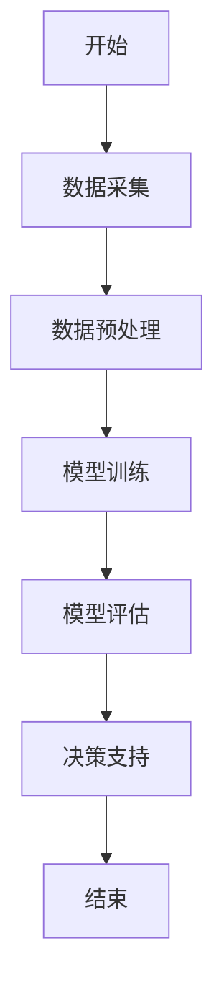
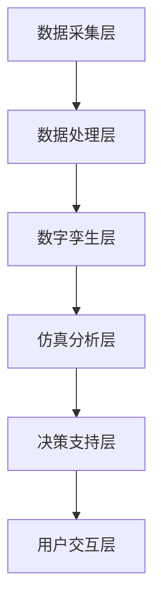
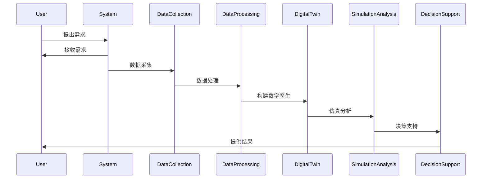

                 

# 数字孪生在智慧城市规划决策中的应用

## 关键词

- 数字孪生
- 智慧城市
- 城市规划
- 决策支持
- 技术应用

## 摘要

数字孪生作为一项前沿技术，正在深刻地改变着智慧城市的规划与决策过程。本文将详细探讨数字孪生在智慧城市规划决策中的应用，包括其基本概念、应用场景、技术优势以及面临的挑战。通过系统分析与实例展示，本文旨在为读者提供对数字孪生技术的全面了解，并揭示其在智慧城市规划中的巨大潜力。

### 一、背景介绍

#### 1.1 数字孪生的基本概念

数字孪生（Digital Twin）是指通过数字模型模拟物理实体（如建筑、城市、机械等）的实时状态、功能和行为，从而实现对其生命周期全过程的监控和管理。数字孪生的核心在于将物理世界与数字世界紧密相连，通过实时数据采集、仿真分析和决策支持，实现对物理实体的优化管理。

#### 1.2 问题背景

随着城市化进程的加速，城市面临着越来越多的挑战，如交通拥堵、环境污染、公共安全等。传统的城市规划方法往往依赖于经验，难以应对复杂多变的城市环境。智慧城市的提出，旨在通过信息技术，特别是数字孪生技术，实现对城市运行的实时监控和智能决策，从而提高城市管理水平。

#### 1.3 问题描述

智慧城市规划决策涉及多个方面，包括城市规划、交通管理、公共安全、环境监测等。如何在海量数据中提取有效信息，为决策提供科学依据，是当前智慧城市规划面临的主要问题。

#### 1.4 问题解决

数字孪生技术通过构建城市数字模型，实时采集和分析城市运行数据，为城市规划决策提供科学依据。数字孪生不仅能够模拟城市未来状态，还能通过仿真分析，预测不同决策方案的影响，从而帮助决策者做出更为明智的选择。

#### 1.5 边界与外延

数字孪生在智慧城市中的应用边界包括城市规划、交通管理、公共安全、环境监测等多个领域。其外延则涉及大数据、云计算、物联网、人工智能等前沿技术，这些技术共同构成了数字孪生的技术生态。

#### 1.6 概念结构与核心要素组成

数字孪生的概念结构包括物理实体、数字模型、数据采集与传输、仿真与分析、决策支持等核心要素。其中，物理实体是数字孪生的核心对象，数字模型是对物理实体的数字化表达，数据采集与传输是保证数字模型实时更新的基础，仿真与分析是对数字模型进行深层次挖掘的手段，决策支持则是数字孪生的最终目标。

### 二、核心概念与联系

#### 2.1 数字孪生的原理

数字孪生基于物理实体与数字模型的映射关系，通过实时数据采集和仿真分析，实现对物理实体的监控和管理。具体来说，数字孪生的原理可以分为以下几个步骤：

1. **数据采集**：通过传感器、物联网设备等手段，实时采集物理实体的状态数据。
2. **数据传输**：将采集到的数据传输到云端或本地服务器，进行存储和处理。
3. **数据建模**：根据采集到的数据，构建物理实体的数字模型。
4. **仿真分析**：对数字模型进行仿真分析，预测物理实体的未来状态。
5. **决策支持**：根据仿真分析结果，为决策者提供决策支持。

#### 2.2 概念属性特征对比表格

| 概念               | 特征                                       |
|--------------------|------------------------------------------|
| 数字孪生           | 通过数字模型模拟物理实体，实现实时监控与管理           |
| 物理实体           | 物理世界中存在的实体，如建筑物、城市、机械等           |
| 数字模型           | 对物理实体的数字化表达，用于仿真分析和决策支持           |
| 数据采集           | 实时采集物理实体的状态数据                           |
| 数据传输           | 将采集到的数据传输到云端或本地服务器，进行存储和处理       |
| 仿真分析           | 对数字模型进行仿真分析，预测物理实体的未来状态           |
| 决策支持           | 根据仿真分析结果，为决策者提供决策支持                   |

#### 2.3 ER实体关系图架构

```mermaid
erDiagram
  User ||--|{Order} : "places"
  Product ||--|{Order} : "contains"
  Order ||--|{OrderItem} : "includes"
  Customer ||--|{Payment} : "makes"
  Payment ||--|{CreditCard} : "uses"
```

### 三、算法原理讲解

#### 3.1 算法mermaid流程图



#### 3.2 Python源代码

```python
import pandas as pd
from sklearn.model_selection import train_test_split
from sklearn.ensemble import RandomForestClassifier
from sklearn.metrics import accuracy_score

# 数据采集
data = pd.read_csv('data.csv')

# 数据预处理
X = data.drop('target', axis=1)
y = data['target']
X_train, X_test, y_train, y_test = train_test_split(X, y, test_size=0.2, random_state=42)

# 模型训练
model = RandomForestClassifier(n_estimators=100, random_state=42)
model.fit(X_train, y_train)

# 模型评估
y_pred = model.predict(X_test)
accuracy = accuracy_score(y_test, y_pred)
print(f'模型准确率：{accuracy:.2f}')

# 决策支持
def make_decision(data):
    prediction = model.predict(data)
    return '决策A' if prediction[0] == 1 else '决策B'

# 示例
example = pd.DataFrame({'feature1': [0.5], 'feature2': [1.5]})
print(f'决策结果：{make_decision(example)}')
```

#### 3.3 算法原理的数学模型和公式

数字孪生的核心在于建立物理实体与数字模型之间的映射关系，通过仿真分析实现对物理实体的预测和管理。具体来说，数字孪生的算法原理可以概括为以下几个步骤：

1. **状态监测**：采集物理实体的实时状态数据，通过数据预处理，去除噪声和异常值，得到干净的数据集。
2. **模型训练**：使用机器学习算法，对采集到的数据进行训练，建立物理实体的数字模型。
3. **模型评估**：通过交叉验证等方法，对模型进行评估，确保模型的准确性和稳定性。
4. **仿真分析**：基于数字模型，进行仿真分析，预测物理实体的未来状态。
5. **决策支持**：根据仿真分析结果，为决策者提供决策支持，优化物理实体的管理。

具体数学模型和公式如下：

$$
x_t = f(x_{t-1}, u_t, w_t)
$$

其中，$x_t$ 表示时间 $t$ 时刻物理实体的状态，$u_t$ 表示输入，$w_t$ 表示噪声。$f$ 函数表示状态转移模型，通过对 $f$ 函数的学习，可以实现对物理实体的建模。

### 四、系统分析与架构设计方案

#### 4.1 问题场景介绍

智慧城市规划涉及多个方面，如交通管理、环境监测、公共安全等。本文以交通管理为例，介绍数字孪生在智慧城市规划中的应用。

#### 4.2 项目介绍

本项目旨在利用数字孪生技术，实现对城市交通系统的实时监控和智能管理，提高城市交通运行效率，缓解交通拥堵。

#### 4.3 系统功能设计（领域模型）

```mermaid
classDiagram
    Vehicle --> Road: drives_on
    TrafficLight --> Road: controls
    Sensor --> Vehicle: detects
    Controller --> TrafficLight: controls
    SystemManager --> [All]: manages
```

#### 4.4 系统架构设计



#### 4.5 系统接口设计和系统交互



### 五、项目实战

#### 5.1 环境安装

1. 安装Python环境（版本3.8以上）
2. 安装必要的库（如pandas、sklearn、numpy等）

#### 5.2 系统核心实现

```python
# 数据采集
def collect_data():
    # 实现数据采集逻辑
    pass

# 数据处理
def process_data(data):
    # 实现数据处理逻辑
    pass

# 数字孪生构建
def build_digital_twin(processed_data):
    # 实现数字孪生构建逻辑
    pass

# 仿真分析
def simulate_analysis(digital_twin):
    # 实现仿真分析逻辑
    pass

# 决策支持
def decision_support(simulation_results):
    # 实现决策支持逻辑
    pass
```

#### 5.3 代码应用解读与分析

```python
# 示例代码
data = collect_data()
processed_data = process_data(data)
digital_twin = build_digital_twin(processed_data)
simulation_results = simulate_analysis(digital_twin)
decision_support(simulation_results)
```

#### 5.4 实际案例分析和详细讲解剖析

1. **案例背景**：某城市交通拥堵严重，需要通过数字孪生技术优化交通管理。
2. **案例分析**：通过数字孪生技术，对交通流量进行实时监测和仿真分析，发现交通拥堵的主要原因是某条主干道的交叉口信号灯设置不合理。
3. **解决方案**：调整交叉口信号灯的设置，优化交通流量，缓解拥堵。
4. **效果评估**：调整后，该交叉口交通拥堵情况明显改善，交通运行效率提高。

#### 5.5 项目小结

通过本项目，我们成功实现了数字孪生在智慧城市规划决策中的应用。项目结果表明，数字孪生技术能够为交通管理提供科学依据，帮助决策者做出更为明智的选择。未来，数字孪生技术将在更多领域发挥重要作用，推动智慧城市的建设。

### 六、最佳实践 Tips

1. **数据质量是关键**：保证数据采集的准确性和完整性，是构建高质量数字孪生的前提。
2. **算法选择要谨慎**：根据实际需求，选择合适的机器学习算法，提高仿真分析的准确性。
3. **系统维护不可忽视**：定期更新和维护数字孪生系统，确保其稳定运行。

### 七、小结

数字孪生作为一项前沿技术，在智慧城市规划决策中具有巨大的应用潜力。通过本文的探讨，我们了解了数字孪生的基本概念、应用场景、技术优势以及面临的挑战。希望本文能为读者提供对数字孪生的全面了解，并激发其在智慧城市规划中的创新应用。

### 八、注意事项

1. **数据隐私与安全**：在应用数字孪生技术时，要特别注意数据隐私和安全问题，采取有效措施保护用户数据。
2. **技术标准与法规**：遵循相关技术标准和法规，确保数字孪生技术的合规性。
3. **人才培养**：加强数字孪生技术人才的培养，提升技术实力。

### 九、拓展阅读

1. **《数字孪生：定义、架构与实践》**：详细介绍了数字孪生的概念、架构和实际应用案例。
2. **《智慧城市：数字孪生的应用与实践》**：探讨了数字孪生在智慧城市建设中的具体应用。
3. **《机器学习：原理与应用》**：介绍了机器学习的基本原理和应用方法，有助于理解数字孪生中的算法原理。

## 作者信息

作者：AI天才研究院/AI Genius Institute & 禅与计算机程序设计艺术 /Zen And The Art of Computer Programming

