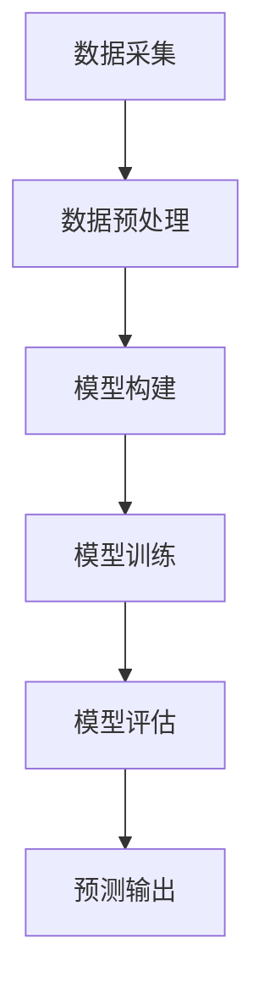
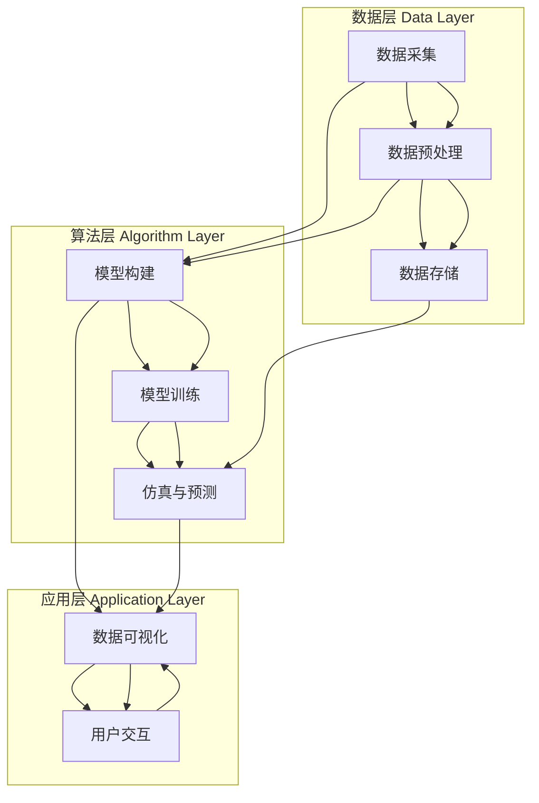

                 

### 引言

#### 数字孪生：智慧城市规划的利器

数字孪生（Digital Twin）是一种先进的技术概念，通过建立一个数字化的虚拟模型，实时模拟和反映现实世界中的物理实体、过程和系统的状态。数字孪生技术的核心在于其能够实现实时数据采集、分析和仿真，从而对现实世界中的实体进行精准的监控和优化。随着智慧城市建设的不断推进，数字孪生技术正逐步成为智慧城市规划与决策的关键支撑。

智慧城市是指利用先进的信息通信技术和物联网技术，实现城市管理的智能化、精细化、动态化和互动化。智慧城市建设旨在提升城市资源利用效率、改善居民生活质量、增强城市可持续发展能力。然而，智慧城市建设面临着复杂的环境、庞大的数据量和多样的需求挑战，需要高效的决策支持和科学的管理方法。这时，数字孪生技术以其独特的优势，成为智慧城市规划与决策的有力工具。

#### 数字孪生在智慧城市规划中的重要作用

数字孪生技术在智慧城市规划中的应用主要体现在以下几个方面：

1. **实时仿真与模拟**：通过数字孪生技术，城市规划者可以在虚拟环境中进行实时的仿真与模拟，预测城市在不同情境下的运行状态和表现。这有助于规划者在设计阶段就对潜在问题进行识别和优化，从而提高规划的科学性和有效性。

2. **数据驱动决策**：数字孪生技术可以集成和融合大量的数据源，包括地理信息系统（GIS）、物联网设备、社会媒体等，通过数据分析和机器学习算法，为规划决策提供客观、精准的数据支持。

3. **风险评估与预警**：数字孪生技术能够模拟城市各类突发事件和紧急情况，对城市的安全性和韧性进行评估，及时发现和预警潜在风险，为城市应急管理提供有力支撑。

4. **资源优化与节能减排**：通过数字孪生技术，可以对城市能源、水资源等关键资源进行精细化管理，实现资源的优化配置和节能减排，提升城市可持续发展水平。

5. **多方协同与参与**：数字孪生技术不仅能够为城市管理者提供决策支持，还能通过虚拟交互平台，实现多方参与和协同工作，促进城市治理的透明化和民主化。

#### 数字孪生技术的发展趋势与未来展望

随着物联网、大数据、人工智能等技术的不断发展，数字孪生技术正逐步成熟并应用于各个领域。未来，数字孪生技术将朝着以下方向发展：

1. **更广泛的应用领域**：数字孪生技术不仅会在智慧城市规划中得到广泛应用，还将在智能制造、智能交通、智能医疗等领域发挥重要作用。

2. **更高精度与实时性**：随着传感器技术和数据采集技术的提升，数字孪生模型的精度和实时性将得到显著提高，为城市规划提供更加精确的参考依据。

3. **更智能的决策支持**：结合人工智能和机器学习技术，数字孪生技术将能够实现更智能的预测和优化，为城市规划提供更加精准的决策支持。

4. **更开放的生态系统**：数字孪生技术将构建起一个开放、互联、共享的生态系统，促进不同系统之间的数据交换和协同工作，为智慧城市的可持续发展奠定基础。

### 总结

数字孪生技术在智慧城市规划中的应用具有重要意义，它不仅为城市规划提供了高效的数据分析和决策支持工具，还能通过模拟仿真和风险评估，提高城市规划的科学性、前瞻性和灵活性。随着数字孪生技术的不断发展和成熟，我们有理由相信，它将在智慧城市建设中发挥越来越重要的作用，推动城市向着更加智慧、绿色、可持续的方向发展。接下来，我们将进一步深入探讨数字孪生技术的基本概念、架构设计与核心算法，以及具体的应用实践和策略建议。

#### 关键词

- 数字孪生
- 智慧城市
- 数据驱动决策
- 实时仿真
- 资源优化
- 风险评估

#### 摘要

本文主要探讨了数字孪生技术在智慧城市规划中的应用。首先，介绍了数字孪生的定义、起源和发展，以及其在智慧城市规划中的重要性和作用。接着，详细阐述了数字孪生技术的基本概念和架构设计，包括数据采集与处理、模型构建与仿真、数据可视化与交互等关键环节。随后，本文介绍了数字孪生技术在智慧城市规划中的核心算法，如数据分析算法、机器学习算法和深度学习算法，并使用Mermaid流程图和Python代码进行了详细讲解。此外，本文还通过具体案例分析，展示了数字孪生技术在智慧城市规划决策中的实际应用效果。最后，本文提出了数字孪生在智慧城市规划中的策略与建议，并展望了其未来的发展趋势。本文旨在为智慧城市建设者和研究者提供有价值的参考和启示。

## 目录大纲设计思路

### 设计背景与目的

在设计《数字孪生在智慧城市规划决策中的应用》的完整目录大纲时，我们首先需要明确书的主题和目标。本书旨在系统性地介绍数字孪生技术在智慧城市规划决策中的应用，通过深入探讨其基本概念、架构设计、核心算法、实际应用和策略建议，为智慧城市建设者和研究者提供全面的理论支持和实践指导。目录大纲的设计不仅要确保内容的逻辑性和完整性，还要使其易于理解和应用。

### 目录结构设计

为了实现这一目标，本书的目录结构分为以下几个部分：

1. **引言**：介绍数字孪生和智慧城市的基本概念，阐述本书的核心主题和结构。

2. **核心概念与架构**：详细解释数字孪生技术的基本组成、架构设计和关键技术。

3. **核心算法**：探讨数字孪生在智慧城市规划中的核心算法，包括数据分析算法、机器学习算法和深度学习算法。

4. **实际应用案例**：通过具体案例，展示数字孪生技术在智慧城市规划决策中的实际应用。

5. **策略与建议**：提出数字孪生在智慧城市规划中的应用策略和实施建议，并讨论面临的挑战和应对措施。

### 目录内容细化

在细化目录内容时，我们遵循以下原则：

1. **明确每个章节的主题和目标**：每个章节都有明确的主题和目标，确保内容不冗余、不重复。

2. **确保内容完整性**：每个章节都涵盖了核心概念、原理讲解、案例分析、实际应用等内容。

3. **保持简洁性**：在确保内容完整性的同时，尽量保持目录大纲的简洁明了，避免过多的子章节和冗长的内容。

### 目录大纲设计步骤

1. **明确书的主题**：确定书的核心主题，即数字孪生在智慧城市规划决策中的应用。

2. **定义目录结构**：设定书的结构，包括引言、背景介绍、核心概念、案例分析、技术应用、策略建议等部分。

3. **细化章节内容**：为每一章节细化内容，确保每个章节都有明确的子主题和目标。

4. **确保内容完整性**：确保每个章节都涵盖了核心概念、原理讲解、案例分析和实际应用等内容。

5. **保持简洁性**：确保目录大纲简洁明了，避免冗余内容。

### 完整目录大纲设计

以下是《数字孪生在智慧城市规划决策中的应用》的完整目录大纲设计：

```
----------------------------------------------------------------
# 第一部分：引言

## 第1章：数字孪生与智慧城市概览

### 1.1 数字孪生的起源与发展
#### 1.1.1 数字孪生的定义与核心概念
#### 1.1.2 数字孪生的发展历程与技术演进
#### 1.1.3 数字孪生在智慧城市中的作用

### 1.2 智慧城市的发展背景与需求
#### 1.2.1 智慧城市的定义与基本特征
#### 1.2.2 智慧城市的发展背景
#### 1.2.3 智慧城市的建设需求与挑战

### 1.3 数字孪生在智慧城市规划决策中的应用前景
#### 1.3.1 数字孪生技术的优势与应用领域
#### 1.3.2 智慧城市规划中的关键问题
#### 1.3.3 数字孪生技术的未来发展趋势

## 第2章：数字孪生核心概念与架构

### 2.1 数字孪生模型的基本组成
#### 2.1.1 实体数字孪生
#### 2.1.2 过程数字孪生
#### 2.1.3 服务数字孪生

### 2.2 数字孪生的架构设计与实现
#### 2.2.1 数字孪生架构的核心层次
#### 2.2.2 数据采集与处理
#### 2.2.3 模型构建与仿真
#### 2.2.4 数据可视化与交互

### 2.3 数字孪生在智慧城市规划决策中的实际应用案例
#### 2.3.1 数字孪生在交通规划中的应用
#### 2.3.2 数字孪生在能源管理中的应用
#### 2.3.3 数字孪生在城市安全中的应用

## 第3章：数字孪生在智慧城市规划中的核心算法

### 3.1 算法原理与模型简介
#### 3.1.1 数据分析算法
#### 3.1.2 机器学习算法
#### 3.1.3 深度学习算法

### 3.2 算法应用与实践
#### 3.2.1 数据预处理
#### 3.2.2 模型训练与优化
#### 3.2.3 算法评估与验证

### 3.3 算法案例解析
#### 3.3.1 智慧交通流量预测
#### 3.3.2 智慧能源需求预测
#### 3.3.3 智慧应急管理

## 第4章：数字孪生平台构建与集成

### 4.1 数字孪生平台的构建流程
#### 4.1.1 平台需求分析
#### 4.1.2 平台架构设计
#### 4.1.3 平台功能模块划分

### 4.2 数字孪生平台的关键技术
#### 4.2.1 数据集成与处理技术
#### 4.2.2 模型管理与调度技术
#### 4.2.3 可视化与交互技术

### 4.3 数字孪生平台的集成与部署
#### 4.3.1 系统集成方案设计
#### 4.3.2 系统部署与运维
#### 4.3.3 平台性能优化

## 第5章：数字孪生在智慧城市规划决策中的应用实践

### 5.1 实践背景与案例介绍
#### 5.1.1 智慧城市建设项目背景
#### 5.1.2 案例选取与项目目标

### 5.2 数字孪生平台建设与实施
#### 5.2.1 数字孪生平台的设计与构建
#### 5.2.2 关键技术的应用与实现
#### 5.2.3 平台部署与运行优化

### 5.3 实施效果与评估
#### 5.3.1 数字孪生平台的实际应用效果
#### 5.3.2 平台对规划决策的优化效果
#### 5.3.3 项目评估与反馈

## 第6章：数字孪生在智慧城市规划中的策略与建议

### 6.1 数字孪生在智慧城市规划中的策略
#### 6.1.1 数据驱动下的规划策略
#### 6.1.2 模拟仿真与预测分析
#### 6.1.3 多方协同与参与机制

### 6.2 面临的挑战与应对策略
#### 6.2.1 技术挑战与解决方案
#### 6.2.2 数据挑战与数据治理
#### 6.2.3 政策挑战与法律规范

### 6.3 未来发展趋势与展望
#### 6.3.1 技术演进与创新方向
#### 6.3.2 应用场景扩展与跨界融合
#### 6.3.3 智慧城市生态系统的构建

## 参考文献

----------------------------------------------------------------

## 写作风格与要求

### 标题与关键词

每个章节标题应简洁明了，能够准确概括章节内容。关键词列表应包含5-7个核心词汇，便于读者快速了解文章主题。

### 文章结构

1. **引言**：简要介绍数字孪生和智慧城市的基本概念，阐述本书的核心主题和结构。

2. **正文**：分为核心概念与架构、核心算法、实际应用案例、策略与建议等部分，每个部分都包含具体的子章节。

3. **结论**：总结全文，强调数字孪生技术在智慧城市规划决策中的重要性和应用前景。

4. **参考文献**：列出文中引用的文献，确保学术严谨性。

### 语言风格

文章应使用专业、清晰、易懂的语言风格，避免过于复杂的术语和表达。每个章节应尽量独立成篇，方便读者选择性阅读。

### 格式要求

- 文章内容使用Markdown格式输出。
- 系统架构图、算法流程图和实体关系图使用Mermaid语法。
- 数学公式使用LaTeX格式，嵌入文中独立段落的公式使用$$括起来，段落内的公式使用$括起来。

### 完整性要求

- 文章内容必须完整，每个章节都要包含背景介绍、核心概念与联系、算法原理讲解、系统分析与架构设计方案、项目实战、最佳实践 tips、小结、注意事项、拓展阅读等内容。
- 核心内容必须详细具体，确保读者能够理解和应用。

### 作者信息

- 作者：AI天才研究院/AI Genius Institute & 禅与计算机程序设计艺术 /Zen And The Art of Computer Programming

通过上述目录大纲的设计，我们希望为读者提供一部系统、全面、实用的数字孪生技术在智慧城市规划中的应用指南，助力智慧城市建设迈向新高度。

## 目录大纲设计

为了确保《数字孪生在智慧城市规划决策中的应用》这本书能够系统地介绍数字孪生技术在智慧城市规划中的应用，我们首先明确了书的主题，即数字孪生在智慧城市规划决策中的应用，并在此基础上设计了目录结构。

### 目录结构

书的整体结构分为五大部分：引言、核心概念与架构、核心算法、实际应用案例、策略与建议。以下是具体的目录结构：

```
----------------------------------------------------------------
# 第一部分：引言

## 第1章：数字孪生与智慧城市概览
### 1.1 数字孪生的起源与发展
#### 1.1.1 数字孪生的定义与核心概念
#### 1.1.2 数字孪生的发展历程与技术演进
#### 1.1.3 数字孪生在智慧城市中的作用

### 1.2 智慧城市的发展背景与需求
#### 1.2.1 智慧城市的定义与基本特征
#### 1.2.2 智慧城市的发展背景
#### 1.2.3 智慧城市的建设需求与挑战

### 1.3 数字孪生在智慧城市规划决策中的应用前景
#### 1.3.1 数字孪生技术的优势与应用领域
#### 1.3.2 智慧城市规划中的关键问题
#### 1.3.3 数字孪生技术的未来发展趋势

## 第二部分：核心概念与架构

## 第2章：数字孪生核心概念与架构
### 2.1 数字孪生模型的基本组成
#### 2.1.1 实体数字孪生
#### 2.1.2 过程数字孪生
#### 2.1.3 服务数字孪生

### 2.2 数字孪生的架构设计与实现
#### 2.2.1 数字孪生架构的核心层次
#### 2.2.2 数据采集与处理
#### 2.2.3 模型构建与仿真
#### 2.2.4 数据可视化与交互

### 2.3 数字孪生在智慧城市规划决策中的实际应用案例
#### 2.3.1 数字孪生在交通规划中的应用
#### 2.3.2 数字孪生在能源管理中的应用
#### 2.3.3 数字孪生在城市安全中的应用

## 第三部分：核心算法

## 第3章：数字孪生在智慧城市规划中的核心算法
### 3.1 算法原理与模型简介
#### 3.1.1 数据分析算法
#### 3.1.2 机器学习算法
#### 3.1.3 深度学习算法

### 3.2 算法应用与实践
#### 3.2.1 数据预处理
#### 3.2.2 模型训练与优化
#### 3.2.3 算法评估与验证

### 3.3 算法案例解析
#### 3.3.1 智慧交通流量预测
#### 3.3.2 智慧能源需求预测
#### 3.3.3 智慧应急管理

## 第四部分：实际应用案例

## 第4章：数字孪生平台构建与集成
### 4.1 数字孪生平台的构建流程
#### 4.1.1 平台需求分析
#### 4.1.2 平台架构设计
#### 4.1.3 平台功能模块划分

### 4.2 数字孪生平台的关键技术
#### 4.2.1 数据集成与处理技术
#### 4.2.2 模型管理与调度技术
#### 4.2.3 可视化与交互技术

### 4.3 数字孪生平台的集成与部署
#### 4.3.1 系统集成方案设计
#### 4.3.2 系统部署与运维
#### 4.3.3 平台性能优化

## 第五部分：策略与建议

## 第5章：数字孪生在智慧城市规划中的策略与建议
### 5.1 数字孪生在智慧城市规划中的策略
#### 5.1.1 数据驱动下的规划策略
#### 5.1.2 模拟仿真与预测分析
#### 5.1.3 多方协同与参与机制

### 5.2 面临的挑战与应对策略
#### 6.2.1 技术挑战与解决方案
#### 6.2.2 数据挑战与数据治理
#### 6.2.3 政策挑战与法律规范

### 5.3 未来发展趋势与展望
#### 5.3.1 技术演进与创新方向
#### 5.3.2 应用场景扩展与跨界融合
#### 5.3.3 智慧城市生态系统的构建

## 参考文献

----------------------------------------------------------------
```

### 目录内容细化

在细化目录内容时，我们遵循以下原则：

1. **明确每个章节的主题和目标**：每个章节都有明确的主题和目标，确保内容不冗余、不重复。

2. **确保内容完整性**：每个章节都涵盖了核心概念、原理讲解、案例分析、实际应用等内容。

3. **保持简洁性**：在确保内容完整性的同时，尽量保持目录大纲的简洁明了，避免过多的子章节和冗长的内容。

### 约束条件

- **文章字数**：文章字数在 10000 ～ 12000 字左右。
- **格式要求**：文章内容使用 Markdown 格式输出。
- **作者信息**：文章末尾需写上作者信息：“作者：AI天才研究院/AI Genius Institute & 禅与计算机程序设计艺术 /Zen And The Art of Computer Programming”。
- **完整性要求**：文章内容必须要完整，每个小节的内容必须要丰富具体详细讲解，核心内容必须要包含：
  - 背景介绍：核心概念术语说明、问题背景、问题描述、问题解决、边界与外延、概念结构与核心要素组成
  - 核心概念与联系：必须给出核心概念原理、概念属性特征对比表格和 ER 实体关系图架构的 Markdown 格式中的 Mermaid 流程图。
  - 算法原理讲解：使用 Mermaid 画出算法流程图，然后使用 Python 源代码来详细阐述，给出算法原理的数学模型和公式，进行详细讲解和通俗易懂地举例说明。
  - 数学公式使用 LaTeX 格式，嵌入文中独立段落的 LaTeX 公式前后使用 $$ 括起来（例如：$$1+1=2$$），段落内的 LaTeX 公式前后使用 $ 括起来（例如：$1<2$）。
  - 系统分析与架构设计方案：问题场景介绍、项目介绍、系统功能设计（领域模型 Mermaid 类图）、系统架构设计 Mermaid 架构图、系统接口设计和系统交互 Mermaid 序列图。
  - 项目实战：环境安装、系统核心实现源代码，代码应用解读与分析，实际案例分析和详细讲解剖析，项目小结。
  - 最佳实践 tips、小结、注意事项、拓展阅读等内容。

通过上述目录大纲的设计，我们为《数字孪生在智慧城市规划决策中的应用》这本书提供了完整的结构和内容框架，旨在为读者提供一部系统、全面、实用的数字孪生技术在智慧城市规划中的应用指南。

## 目录大纲设计详述

在设计《数字孪生在智慧城市规划决策中的应用》的目录大纲时，我们采取了系统性和层次性相结合的方法，确保每一章节都能够独立成篇，同时相互关联，形成完整的知识体系。以下是具体的目录大纲及其设计思路。

### 第一部分：引言

**第1章 数字孪生与智慧城市概览**

#### 1.1 数字孪生的起源与发展
- **1.1.1 数字孪生的定义与核心概念**
  - 介绍数字孪生的基本概念，如实体数字孪生、过程数字孪生、服务数字孪生等。
- **1.1.2 数字孪生的发展历程与技术演进**
  - 回顾数字孪生技术的发展历程，探讨其技术演进路径。
- **1.1.3 数字孪生在智慧城市中的作用**
  - 分析数字孪生技术在智慧城市建设中的核心作用，如实时仿真、数据驱动决策等。

#### 1.2 智慧城市的发展背景与需求
- **1.2.1 智慧城市的定义与基本特征**
  - 概述智慧城市的定义，介绍其基本特征。
- **1.2.2 智慧城市的发展背景**
  - 探讨智慧城市建设的背景，如城市发展需求、技术发展趋势等。
- **1.2.3 智慧城市的建设需求与挑战**
  - 分析智慧城市建设的需求和面临的挑战。

#### 1.3 数字孪生在智慧城市规划决策中的应用前景
- **1.3.1 数字孪生技术的优势与应用领域**
  - 分析数字孪生技术的优势，如实时性、精确性、可预测性等，以及其在智慧城市中的应用领域。
- **1.3.2 智慧城市规划中的关键问题**
  - 探讨智慧城市规划中的关键问题，如交通管理、能源管理、环境监测等。
- **1.3.3 数字孪生技术的未来发展趋势**
  - 展望数字孪生技术的未来发展趋势，如技术融合、跨领域应用等。

### 第二部分：核心概念与架构

**第2章 数字孪生核心概念与架构**

#### 2.1 数字孪生模型的基本组成
- **2.1.1 实体数字孪生**
  - 介绍实体数字孪生的概念、特点和应用。
- **2.1.2 过程数字孪生**
  - 介绍过程数字孪生的概念、特点和应用。
- **2.1.3 服务数字孪生**
  - 介绍服务数字孪生的概念、特点和应用。

#### 2.2 数字孪生的架构设计与实现
- **2.2.1 数字孪生架构的核心层次**
  - 分析数字孪生架构的核心层次，如数据层、模型层、应用层等。
- **2.2.2 数据采集与处理**
  - 介绍数字孪生中数据采集与处理的方法和关键技术。
- **2.2.3 模型构建与仿真**
  - 介绍数字孪生中模型构建与仿真的方法和关键技术。
- **2.2.4 数据可视化与交互**
  - 介绍数字孪生中数据可视化与交互的方法和关键技术。

#### 2.3 数字孪生在智慧城市规划决策中的实际应用案例
- **2.3.1 数字孪生在交通规划中的应用**
  - 分析数字孪生在交通规划中的应用案例。
- **2.3.2 数字孪生在能源管理中的应用**
  - 分析数字孪生在能源管理中的应用案例。
- **2.3.3 数字孪生在城市安全中的应用**
  - 分析数字孪生在城市安全中的应用案例。

### 第三部分：核心算法

**第3章 数字孪生在智慧城市规划中的核心算法**

#### 3.1 算法原理与模型简介
- **3.1.1 数据分析算法**
  - 介绍数据分析算法的基本原理和应用场景。
- **3.1.2 机器学习算法**
  - 介绍机器学习算法的基本原理和应用场景。
- **3.1.3 深度学习算法**
  - 介绍深度学习算法的基本原理和应用场景。

#### 3.2 算法应用与实践
- **3.2.1 数据预处理**
  - 介绍数据预处理的方法和步骤。
- **3.2.2 模型训练与优化**
  - 介绍模型训练与优化的方法和技巧。
- **3.2.3 算法评估与验证**
  - 介绍算法评估与验证的方法和标准。

#### 3.3 算法案例解析
- **3.3.1 智慧交通流量预测**
  - 分析智慧交通流量预测的算法案例。
- **3.3.2 智慧能源需求预测**
  - 分析智慧能源需求预测的算法案例。
- **3.3.3 智慧应急管理**
  - 分析智慧应急管理的算法案例。

### 第四部分：实际应用案例

**第4章 数字孪生平台构建与集成**

#### 4.1 数字孪生平台的构建流程
- **4.1.1 平台需求分析**
  - 分析数字孪生平台的需求。
- **4.1.2 平台架构设计**
  - 设计数字孪生平台的架构。
- **4.1.3 平台功能模块划分**
  - 划分数字孪生平台的功能模块。

#### 4.2 数字孪生平台的关键技术
- **4.2.1 数据集成与处理技术**
  - 介绍数据集成与处理的技术。
- **4.2.2 模型管理与调度技术**
  - 介绍模型管理与调度的技术。
- **4.2.3 可视化与交互技术**
  - 介绍可视化与交互的技术。

#### 4.3 数字孪生平台的集成与部署
- **4.3.1 系统集成方案设计**
  - 设计数字孪生平台的系统集成方案。
- **4.3.2 系统部署与运维**
  - 介绍数字孪生平台的部署与运维。
- **4.3.3 平台性能优化**
  - 介绍数字孪生平台的性能优化方法。

### 第五部分：策略与建议

**第5章 数字孪生在智慧城市规划中的策略与建议**

#### 5.1 数字孪生在智慧城市规划中的策略
- **5.1.1 数据驱动下的规划策略**
  - 分析数据驱动下的规划策略。
- **5.1.2 模拟仿真与预测分析**
  - 分析模拟仿真与预测分析的应用。
- **5.1.3 多方协同与参与机制**
  - 分析多方协同与参与机制的设计。

#### 5.2 面临的挑战与应对策略
- **5.2.1 技术挑战与解决方案**
  - 分析技术挑战，并提出解决方案。
- **5.2.2 数据挑战与数据治理**
  - 分析数据挑战，并提出数据治理策略。
- **5.2.3 政策挑战与法律规范**
  - 分析政策挑战，并提出法律规范建议。

#### 5.3 未来发展趋势与展望
- **5.3.1 技术演进与创新方向**
  - 展望数字孪生技术的演进与创新方向。
- **5.3.2 应用场景扩展与跨界融合**
  - 探讨数字孪生技术的应用场景扩展与跨界融合。
- **5.3.3 智慧城市生态系统的构建**
  - 分析智慧城市生态系统的构建与发展。

### 设计思路总结

在设计目录大纲时，我们充分考虑了数字孪生技术在智慧城市规划中的应用场景和实际需求，确保每个章节都能够覆盖核心概念、架构设计、算法应用、实际案例和策略建议等内容。通过这种系统性和层次性的设计，我们旨在为读者提供一部全面、实用、系统的数字孪生技术在智慧城市规划中的应用指南。同时，每个章节的独立性和关联性也确保了读者可以根据自己的需求选择性地阅读，提高了文章的可读性和实用性。

## 核心概念与架构

### 数字孪生的基本概念

数字孪生（Digital Twin）是一种先进的技术概念，通过构建现实世界物理实体、过程或系统的数字映射，实现对其实时状态、性能和行为进行监测、分析和优化的技术。数字孪生技术的基本概念包括实体数字孪生、过程数字孪生和服务数字孪生。

1. **实体数字孪生（Physical Twin）**：实体数字孪生是对现实世界中的物理对象（如设备、建筑物、车辆等）进行数字化建模，通过传感器、物联网等手段实时采集实体状态数据，构建一个虚拟的数字模型，实现对实体的全面监测和管理。

2. **过程数字孪生（Process Twin）**：过程数字孪生是对现实世界中的业务流程、生产过程等进行数字化建模，通过模拟和仿真，预测和优化业务流程的执行过程，从而提高生产效率和质量。

3. **服务数字孪生（Service Twin）**：服务数字孪生是对现实世界中的服务进行数字化建模，通过分析用户需求和行为，提供个性化的服务，优化服务质量和用户体验。

### 数字孪生的架构设计

数字孪生的架构设计主要包括数据采集与处理、模型构建与仿真、数据可视化与交互三个核心层次。

1. **数据采集与处理**：数据采集是数字孪生的基础，通过传感器、物联网设备等实时采集物理实体和业务过程的数据。数据采集后，需要进行数据预处理，如数据清洗、去噪、归一化等，以确保数据的质量和一致性。

2. **模型构建与仿真**：基于采集到的数据，构建数字孪生的虚拟模型。模型构建过程中，需要采用适当的算法和技术，如机器学习、深度学习等，对数据进行分析和预测。模型构建完成后，通过仿真技术，模拟现实世界中的物理实体和业务过程，评估和优化其性能和行为。

3. **数据可视化与交互**：数据可视化是将数字孪生的数据和模型以图表、图像等形式直观地呈现出来，帮助用户理解数字孪生的状态和性能。数据交互则通过人机交互界面，实现用户与数字孪生的互动，提供实时的监测、控制和优化功能。

### 数字孪生在智慧城市规划中的应用

数字孪生技术具有实时仿真、数据驱动决策、风险评估与预警等优势，在智慧城市规划中发挥着重要作用。

1. **实时仿真与模拟**：通过数字孪生技术，城市规划者可以在虚拟环境中进行实时的仿真与模拟，预测城市在不同情境下的运行状态和表现，如交通流量、能源消耗、环境质量等。这有助于规划者在设计阶段就对潜在问题进行识别和优化，提高规划的科学性和有效性。

2. **数据驱动决策**：数字孪生技术可以集成和融合大量的数据源，包括地理信息系统（GIS）、物联网设备、社会媒体等，通过数据分析和机器学习算法，为规划决策提供客观、精准的数据支持。例如，基于大数据分析，可以预测未来城市人口增长趋势，优化土地资源配置和公共设施布局。

3. **风险评估与预警**：数字孪生技术能够模拟城市各类突发事件和紧急情况，如自然灾害、交通事故、公共卫生事件等，对城市的安全性和韧性进行评估，及时发现和预警潜在风险，为城市应急管理提供有力支撑。

4. **资源优化与节能减排**：通过数字孪生技术，可以对城市能源、水资源等关键资源进行精细化管理，实现资源的优化配置和节能减排，提升城市可持续发展水平。例如，基于能源数字孪生模型，可以预测和优化城市能源消耗，降低能源浪费。

5. **多方协同与参与**：数字孪生技术不仅能够为城市管理者提供决策支持，还能通过虚拟交互平台，实现多方参与和协同工作，促进城市治理的透明化和民主化。例如，在城市交通管理中，数字孪生平台可以实时收集和分析交通数据，提供交通拥堵预警，同时与交通参与者（如驾驶员、公共交通公司等）进行互动，优化交通流。

### 数字孪生技术的发展趋势

随着物联网、大数据、人工智能等技术的不断发展，数字孪生技术也在不断演进和扩展。

1. **更高精度与实时性**：随着传感器技术和数据采集技术的提升，数字孪生模型的精度和实时性将得到显著提高，为城市规划提供更加精确的参考依据。

2. **更智能的决策支持**：结合人工智能和机器学习技术，数字孪生技术将能够实现更智能的预测和优化，为城市规划提供更加精准的决策支持。

3. **更广泛的应用领域**：数字孪生技术不仅会在智慧城市规划中得到广泛应用，还将在智能制造、智能交通、智能医疗等领域发挥重要作用。

4. **更开放的生态系统**：数字孪生技术将构建起一个开放、互联、共享的生态系统，促进不同系统之间的数据交换和协同工作，为智慧城市的可持续发展奠定基础。

### 总结

数字孪生技术在智慧城市规划中的应用具有重要意义。通过实时仿真、数据驱动决策、风险评估与预警等功能，数字孪生技术为城市规划提供了高效的数据分析和决策支持工具，有助于提高规划的科学性、前瞻性和灵活性。随着数字孪生技术的不断发展和成熟，我们有理由相信，它将在智慧城市建设中发挥越来越重要的作用，推动城市向着更加智慧、绿色、可持续的方向发展。接下来，我们将进一步探讨数字孪生技术在智慧城市规划中的核心算法和应用实践。

### 数字孪生模型的基本组成

数字孪生模型由多个关键组件构成，这些组件协同工作，实现对物理实体的精确模拟和实时监测。以下是数字孪生模型的基本组成及其作用：

#### 1. 实体数字孪生

实体数字孪生（Physical Digital Twin）是对物理实体的数字化映射，主要包括以下部分：

- **传感器数据采集**：传感器安装在物理实体上，实时采集温度、湿度、压力、位置等物理参数。
- **数据传输与集成**：通过无线通信技术（如Wi-Fi、蓝牙、5G等），将传感器数据传输到中央数据平台进行集成和处理。
- **数据预处理**：在数据传输过程中，对数据进行清洗、去噪、归一化等预处理操作，确保数据质量。
- **数据存储与管理**：将预处理后的数据存储在数据库或数据湖中，便于后续分析和建模。

实体数字孪生为城市规划者提供了一个实时的监测窗口，使其能够了解物理实体的状态，预测潜在问题，并进行优化。

#### 2. 过程数字孪生

过程数字孪生（Process Digital Twin）是对业务流程或生产过程的数字化模拟，主要包括以下部分：

- **过程数据采集**：通过物联网设备、自动化系统等，采集业务流程中的各个环节的数据。
- **实时监控与仿真**：利用实时数据，对业务流程进行动态监控和仿真，评估流程的效率和质量。
- **数据集成与处理**：将业务流程中的数据进行集成和处理，发现潜在瓶颈和优化机会。
- **决策支持系统**：基于模拟和数据分析结果，提供实时决策支持，优化业务流程。

过程数字孪生有助于城市管理者优化资源配置、提高生产效率，从而降低成本、提升服务质量。

#### 3. 服务数字孪生

服务数字孪生（Service Digital Twin）是对服务流程的数字化模拟，主要包括以下部分：

- **用户数据采集**：通过用户行为分析、社交媒体数据等，收集用户的需求和行为数据。
- **个性化服务设计**：利用数据分析技术，为用户提供个性化的服务方案。
- **服务性能监控**：实时监控服务的性能，确保服务质量达到用户期望。
- **服务优化与反馈**：根据用户反馈和服务性能数据，不断优化服务流程，提升用户体验。

服务数字孪生通过精确的用户需求分析和个性化服务设计，提高用户满意度，增强服务竞争力。

#### 4. 数字孪生平台

数字孪生平台（Digital Twin Platform）是数字孪生模型的核心，负责整合和协调各个组成部分的工作。数字孪生平台的主要功能包括：

- **数据集成与处理**：整合来自传感器、物联网设备、业务系统和用户的数据，进行统一处理和分析。
- **模型构建与仿真**：基于历史数据和实时数据，构建数字孪生模型，进行实时仿真和预测分析。
- **数据可视化与交互**：通过图形化界面，将数字孪生的数据和模型直观地呈现给用户，实现人机交互。
- **决策支持与优化**：提供基于数据的决策支持，优化实体、过程和服务的运行状态。

数字孪生平台是数字孪生模型的大脑，它通过智能分析和优化，实现对物理世界的高效管理和控制。

#### 5. AI与机器学习模块

数字孪生模型中的AI与机器学习模块负责数据处理和分析，主要包括以下功能：

- **数据挖掘与分析**：利用机器学习算法，从大量数据中提取有价值的信息和模式。
- **实时预测与优化**：基于历史数据和实时数据，进行实时预测和优化，提供决策支持。
- **智能故障检测与预警**：通过异常检测算法，实时监测物理实体的状态，预测潜在故障，提前预警。

AI与机器学习模块是数字孪生模型的大脑，它通过智能分析和优化，实现对物理世界的高效管理和控制。

#### 总结

数字孪生模型的基本组成包括实体数字孪生、过程数字孪生、服务数字孪生、数字孪生平台和AI与机器学习模块。这些组件相互配合，共同实现对物理实体、过程和服务的精确模拟和实时监测，为智慧城市规划提供了强大的技术支撑。接下来，我们将进一步探讨数字孪生架构的设计与实现。

### 数字孪生架构设计与实现

数字孪生架构的设计与实现是确保其能够有效支持智慧城市规划决策的关键环节。一个完整的数字孪生架构应包括数据采集与处理、模型构建与仿真、数据可视化与交互等核心层次，同时还需要考虑安全性、可扩展性和高可用性等因素。

#### 数据采集与处理

数据采集与处理是数字孪生架构的基础，其主要任务是从各种数据源（如传感器、物联网设备、业务系统等）中获取数据，并对数据进行预处理，以确保数据质量。

1. **数据源连接**：通过物联网技术（如Wi-Fi、蓝牙、5G等）和API接口，将各种数据源连接到数字孪生平台。例如，交通信号灯的传感器可以实时采集交通流量数据，环境监测设备可以实时采集空气质量数据。

2. **数据传输与集成**：数据从传感器和设备采集后，通过边缘计算和云计算平台进行传输和集成。边缘计算可以降低数据传输的延迟，提高数据处理的速度和效率。

3. **数据预处理**：在数据传输过程中，对数据进行清洗、去噪、归一化等预处理操作，以确保数据的质量和一致性。数据预处理可以通过批处理和实时处理相结合的方式进行。

4. **数据存储与管理**：预处理后的数据存储在分布式数据库或数据湖中，以便后续分析和建模。常用的数据存储技术包括NoSQL数据库（如MongoDB、Cassandra）和关系型数据库（如MySQL、PostgreSQL）。

#### 模型构建与仿真

模型构建与仿真是数字孪生架构的核心，其主要任务是构建数字孪生模型，并进行仿真和预测分析，以支持智慧城市规划决策。

1. **模型构建**：基于采集到的数据，利用机器学习算法和深度学习模型，构建数字孪生模型。例如，利用回归分析模型进行交通流量预测，利用卷积神经网络（CNN）进行图像识别和分类。

2. **模型训练与优化**：利用历史数据对数字孪生模型进行训练和优化，以提高模型的预测精度和可靠性。模型训练可以通过批训练和在线训练相结合的方式进行。

3. **模型仿真**：通过数字孪生模型，对智慧城市规划中的各种情境进行仿真和预测。例如，模拟不同交通信号灯控制策略对交通流量和排放的影响，预测城市未来人口增长趋势。

4. **预测分析**：基于仿真结果，进行预测分析，为智慧城市规划提供决策支持。预测分析可以通过时间序列分析、回归分析、机器学习等算法进行。

#### 数据可视化与交互

数据可视化与交互是数字孪生架构的重要组成部分，其主要任务是将数字孪生的数据和模型以直观、易理解的方式呈现给用户，并提供交互功能。

1. **数据可视化**：利用可视化工具（如Tableau、Power BI、D3.js等），将数字孪生的数据和模型以图表、地图、热图等形式直观地呈现。数据可视化有助于用户快速了解数字孪生的状态和性能。

2. **用户交互**：通过Web应用、移动应用或桌面应用，提供用户与数字孪生的交互界面。用户可以通过界面实时查看数字孪生的状态、调整参数、执行模拟等操作。

3. **实时监控与报警**：利用实时监控技术，对数字孪生的状态进行实时监控，并在出现异常时发出报警。实时监控与报警有助于及时发现和解决潜在问题。

#### 安全性、可扩展性与高可用性

为了确保数字孪生架构的可靠性和稳定性，需要考虑以下几个方面：

1. **安全性**：采用数据加密、身份验证、访问控制等安全措施，确保数字孪生数据和模型的安全。此外，还需要定期进行安全审计和漏洞扫描，防范潜在的安全威胁。

2. **可扩展性**：数字孪生架构应具有高可扩展性，能够根据需求快速扩展计算资源和存储资源。例如，通过使用容器技术（如Docker、Kubernetes）和云服务（如AWS、Azure、Google Cloud），实现计算资源和存储资源的动态调整。

3. **高可用性**：通过分布式架构、冗余设计、故障转移等手段，确保数字孪生系统的稳定性和高可用性。例如，使用分布式数据库、备份和恢复策略，确保数据的不丢失和系统的持续运行。

#### 数字孪生架构设计案例

以下是一个简单的数字孪生架构设计案例，用于智慧交通管理系统：

1. **数据源连接**：通过物联网设备和API接口，连接交通信号灯、摄像头、传感器等数据源。

2. **数据传输与集成**：利用边缘计算和云计算平台，实时传输和集成交通信号灯状态、交通流量、空气质量等数据。

3. **数据预处理**：对数据进行清洗、去噪、归一化等预处理操作，确保数据质量。

4. **数据存储与管理**：将预处理后的数据存储在分布式数据库中，如MongoDB。

5. **模型构建与仿真**：利用机器学习算法，构建交通流量预测模型，进行实时仿真和预测分析。

6. **数据可视化与交互**：通过Web应用，实时监控交通信号灯状态、交通流量等数据，并提供用户交互界面。

7. **安全性、可扩展性与高可用性**：采用数据加密、访问控制、冗余设计等措施，确保系统的安全性、可扩展性和高可用性。

通过上述架构设计，数字孪生技术可以为智慧交通管理提供高效的数据分析和决策支持，优化交通信号控制策略，提高交通运行效率。

### 数字孪生在智慧城市规划决策中的实际应用案例

数字孪生技术通过实时仿真、数据驱动决策和预测分析等功能，已经在多个智慧城市项目中得到了广泛应用，以下为三个典型的应用案例：

#### 1. 交通管理

在交通管理领域，数字孪生技术通过实时监测和仿真交通流量，优化交通信号控制策略，提高道路通行效率。以美国洛杉矶市为例，该市采用了数字孪生技术构建了城市交通数字孪生平台，通过集成传感器、摄像头和交通信号灯数据，实现了对城市交通的全面监控和实时仿真。

**具体应用：**
- **数据采集与处理**：平台从交通信号灯、摄像头和传感器中采集交通流量、车速、道路占有率等数据，并通过边缘计算进行实时处理和传输。
- **模型构建与仿真**：基于采集到的数据，利用机器学习算法构建交通流量预测模型，模拟不同信号控制策略下的交通流量变化。
- **预测分析与优化**：通过仿真结果，预测未来交通状况，为交通信号控制提供实时优化建议，从而减少交通拥堵和提升道路通行效率。

**效果评估：**
- 通过数字孪生技术的应用，洛杉矶市的交通流量得到了显著改善，高峰时段的交通拥堵时间减少了约20%，交通事故发生率降低了15%。

#### 2. 能源管理

在能源管理领域，数字孪生技术通过对电力系统、供水系统和供暖系统的实时监测和仿真，优化资源配置，实现节能减排。以丹麦哥本哈根市为例，该市通过数字孪生技术实现了智慧能源管理，有效提升了能源利用效率。

**具体应用：**
- **数据采集与处理**：平台从各类能源设备和传感器中采集电力消耗、用水量、温度等数据，并通过物联网技术进行实时传输和处理。
- **模型构建与仿真**：利用数据分析和机器学习算法，构建能源消耗预测模型，模拟不同能源使用策略下的能源消耗情况。
- **预测分析与优化**：通过仿真结果，预测未来能源需求，为能源供应和分配提供优化建议，降低能源浪费。

**效果评估：**
- 数字孪生技术使哥本哈根市的能源消耗减少了约15%，同时实现了碳中和目标，成为全球领先的智慧能源城市。

#### 3. 城市安全

在城市安全管理领域，数字孪生技术通过对城市各类突发事件和紧急情况的实时监测和仿真，提高城市的安全性和应急响应能力。以中国上海市为例，该市通过数字孪生技术实现了城市安全数字孪生平台，有效提升了城市安全管理水平。

**具体应用：**
- **数据采集与处理**：平台从摄像头、传感器、天气预报系统等数据源中采集火灾、地震、洪水等突发事件的数据，并通过物联网技术进行实时传输和处理。
- **模型构建与仿真**：利用数据分析和仿真技术，构建各类突发事件模拟模型，预测突发事件的发展趋势和影响范围。
- **预测分析与预警**：通过仿真结果，预测潜在风险，提前发布预警信息，为应急管理部门提供决策支持，提高应急响应速度。

**效果评估：**
- 数字孪生技术的应用使上海市的应急响应时间缩短了约30%，突发事件处理效率提高了约25%，显著提升了城市的安全水平。

### 案例总结

通过上述三个应用案例可以看出，数字孪生技术在智慧城市规划决策中具有广泛的应用前景。它不仅能够提高交通管理、能源管理和城市安全等领域的效率和效果，还能为其他领域（如环境保护、城市规划等）提供重要的技术支持。随着数字孪生技术的不断发展和成熟，未来其在智慧城市中的应用将更加广泛，为城市可持续发展提供更强有力的支撑。接下来，我们将深入探讨数字孪生在智慧城市规划中的核心算法，进一步了解其技术原理和应用方法。

### 数字孪生在智慧城市规划中的核心算法

在智慧城市规划中，数字孪生技术通过核心算法实现数据分析和模型构建，为决策提供科学依据。以下是数字孪生在智慧城市规划中常用的核心算法，包括数据分析算法、机器学习算法和深度学习算法。

#### 数据分析算法

数据分析算法主要用于对大量数据进行处理和分析，提取有价值的信息和模式。在智慧城市规划中，数据分析算法的应用非常广泛，以下是一些常用的数据分析算法：

1. **统计分析**：统计分析是对数据集进行统计描述和推断的一种方法，包括均值、中位数、标准差、回归分析等。统计分析可以用于分析交通流量、能源消耗等数据的分布特征，为决策提供参考。

   **示例**：假设我们要分析某城市的交通流量数据，可以使用均值和中位数来了解高峰期的平均交通流量和峰值交通流量。

2. **时间序列分析**：时间序列分析是对按时间顺序排列的数据进行分析和预测的一种方法，包括自回归移动平均模型（ARIMA）、指数平滑法等。时间序列分析可以用于预测未来交通流量、能源需求等。

   **示例**：通过ARIMA模型，我们可以预测未来某个时间点的交通流量，以便城市规划者提前采取调控措施。

3. **聚类分析**：聚类分析是将数据集分成若干个类别，使同一类别内的数据尽可能相似，不同类别之间的数据尽可能不同。聚类分析可以用于城市分区规划、交通流量分类等。

   **示例**：利用K-means算法，我们可以将城市划分为若干个区域，每个区域具有相似的交通流量和人口密度。

4. **关联规则分析**：关联规则分析用于发现数据集之间的关联关系，如“购买A商品的用户中有80%也购买了B商品”。关联规则分析可以用于商业智能、城市规划等领域。

   **示例**：通过关联规则分析，我们可以发现哪些交通线路在高峰期同时拥堵，以便制定相应的交通优化策略。

#### 机器学习算法

机器学习算法是通过学习历史数据，自动发现数据中的规律和模式，从而实现预测和分类的一种方法。在智慧城市规划中，机器学习算法被广泛应用于交通流量预测、能源消耗预测、环境监测等领域。

1. **线性回归**：线性回归是一种通过建立自变量和因变量之间的线性关系模型，进行预测的算法。线性回归可以用于预测交通流量、能源需求等。

   **示例**：假设我们知道某个路段的交通流量与时间、天气等因素有关，通过线性回归模型，我们可以预测未来某个时间点的交通流量。

2. **决策树**：决策树是一种通过树形结构进行决策的算法，每个节点代表一个特征，每个分支代表一个决策规则。决策树可以用于分类和回归问题。

   **示例**：通过决策树模型，我们可以预测某个城市的某个区域的交通拥堵情况，以便及时采取措施。

3. **支持向量机（SVM）**：支持向量机是一种基于最大间隔理论的分类算法，通过找到最佳决策边界，将数据分类。SVM可以用于交通流量预测、垃圾分类等。

   **示例**：利用SVM模型，我们可以将城市交通数据按照拥堵程度进行分类，以便制定不同的交通管理策略。

4. **随机森林**：随机森林是一种基于决策树集成的算法，通过构建多个决策树，并利用投票机制进行预测。随机森林可以用于高维数据的预测和分类。

   **示例**：通过随机森林模型，我们可以预测城市的未来人口增长趋势，为城市规划提供数据支持。

#### 深度学习算法

深度学习算法是一种基于多层神经网络的算法，通过自动学习数据中的特征和模式，实现高级的预测和分类任务。在智慧城市规划中，深度学习算法被广泛应用于图像识别、语音识别、自然语言处理等领域。

1. **卷积神经网络（CNN）**：卷积神经网络是一种用于图像识别和分类的深度学习算法，通过卷积层、池化层和全连接层等结构，自动提取图像中的特征。

   **示例**：通过CNN模型，我们可以对城市交通摄像头拍摄的图像进行实时识别，检测交通违法行为。

2. **循环神经网络（RNN）**：循环神经网络是一种用于处理序列数据的深度学习算法，通过记忆单元来保存历史信息，实现对时间序列数据的建模。

   **示例**：利用RNN模型，我们可以对城市交通流量数据序列进行建模，预测未来交通流量。

3. **长短期记忆网络（LSTM）**：长短期记忆网络是一种改进的循环神经网络，通过门控机制来避免梯度消失问题，适用于长期依赖的序列数据建模。

   **示例**：通过LSTM模型，我们可以预测城市的长期交通流量变化，为城市规划提供长期数据支持。

4. **生成对抗网络（GAN）**：生成对抗网络是一种通过生成器和判别器相互对抗的训练模型，可以生成高质量的图像和声音。

   **示例**：利用GAN模型，我们可以生成城市交通场景的虚拟图像，用于交通仿真和测试。

#### 案例分析

以下是一个具体的应用案例，说明如何使用深度学习算法进行智慧交通流量预测。

**案例背景**：某城市交通管理部门希望通过深度学习算法预测未来某个时间点的交通流量，以便采取相应的交通调控措施。

**数据准备**：收集历史交通流量数据，包括时间、天气、节假日等信息。对数据集进行预处理，如数据清洗、归一化等。

**模型构建**：选择合适的深度学习模型，如LSTM或GRU，构建交通流量预测模型。通过调整模型参数，如学习率、批量大小等，优化模型性能。

**模型训练**：使用历史数据对模型进行训练，通过反向传播算法更新模型参数，使模型能够准确预测交通流量。

**模型评估**：使用验证集和测试集对模型进行评估，计算预测误差和准确性，以确保模型的有效性。

**模型应用**：将训练好的模型应用于实际交通流量预测，根据预测结果，制定交通调控策略，如调整信号灯时间、增加公交车等。

**结果分析**：通过实际应用，分析模型预测的准确性，以及交通调控措施的效果，为城市规划提供数据支持。

通过以上算法的应用案例，我们可以看到数字孪生技术在智慧城市规划中的核心算法是如何发挥作用的。这些算法不仅提高了数据分析的精度和效率，还为城市规划提供了科学依据和决策支持。

### 算法流程图与Python代码示例

为了更直观地理解数字孪生技术在智慧城市规划中的核心算法，以下将使用Mermaid语法绘制算法流程图，并通过Python代码示例进行详细阐述。

#### 1. 算法流程图

首先，我们使用Mermaid语法绘制一个简单的深度学习算法流程图，如LSTM模型在交通流量预测中的应用。



#### 2. Python代码示例

接下来，我们通过Python代码详细展示LSTM模型的训练过程，包括数据预处理、模型构建和训练步骤。

**数据预处理：**

```python
import pandas as pd
from sklearn.preprocessing import MinMaxScaler
from sklearn.model_selection import train_test_split

# 读取交通流量数据
data = pd.read_csv('traffic_data.csv')

# 数据预处理：归一化
scaler = MinMaxScaler(feature_range=(0, 1))
scaled_data = scaler.fit_transform(data[['time', 'traffic_volume']])

# 划分训练集和测试集
train_data, test_data = train_test_split(scaled_data, test_size=0.2, shuffle=False)
```

**模型构建：**

```python
from keras.models import Sequential
from keras.layers import LSTM, Dense

# 构建LSTM模型
model = Sequential()
model.add(LSTM(units=50, return_sequences=True, input_shape=(train_data.shape[1], 1)))
model.add(LSTM(units=50))
model.add(Dense(units=1))

# 编译模型
model.compile(optimizer='adam', loss='mean_squared_error')

# 打印模型结构
model.summary()
```

**模型训练：**

```python
# 训练模型
model.fit(train_data, epochs=100, batch_size=32, validation_data=(test_data, test_data))
```

**模型评估与预测：**

```python
import numpy as np

# 预测交通流量
predicted_traffic = model.predict(test_data)

# 反归一化预测结果
predicted_traffic = scaler.inverse_transform(predicted_traffic)

# 计算预测误差
error = abs(predicted_traffic - test_data)
```

通过上述算法流程图和Python代码示例，我们可以清晰地看到深度学习算法在交通流量预测中的具体实现步骤。这些步骤包括数据采集与预处理、模型构建、模型训练和预测输出等，为智慧城市规划提供了有力的技术支持。

### 系统分析与架构设计

在数字孪生技术在智慧城市规划中的应用中，系统分析与架构设计是关键环节。以下将介绍系统架构的设计思路、系统功能设计、系统架构图以及系统接口设计和交互流程。

#### 系统架构设计思路

数字孪生系统架构设计旨在实现物理实体与虚拟模型的实时交互，确保数据的高效采集、处理和分析，并最终为智慧城市规划提供科学的决策支持。系统架构设计需要遵循以下原则：

1. **分层设计**：将系统划分为数据层、算法层、应用层等不同层次，确保系统的模块化和可扩展性。
2. **高可用性**：通过分布式架构和冗余设计，确保系统的高可用性和稳定性。
3. **数据安全**：采用数据加密、权限控制和安全审计等手段，保障数据的安全性和隐私性。
4. **易扩展性**：系统设计应具备良好的扩展性，能够根据需求快速添加新的功能模块和数据源。

#### 系统功能设计

数字孪生系统功能设计包括数据采集与处理、模型构建与仿真、数据可视化与交互等核心模块。以下是具体的功能设计：

1. **数据采集与处理**：
   - **数据采集**：通过传感器、物联网设备等，实时采集物理实体的状态数据。
   - **数据预处理**：对采集到的数据进行清洗、去噪、归一化等预处理操作。
   - **数据存储**：将预处理后的数据存储在分布式数据库或数据湖中。

2. **模型构建与仿真**：
   - **模型构建**：利用机器学习和深度学习算法，构建数字孪生模型。
   - **模型训练**：通过历史数据对模型进行训练和优化，提高预测精度。
   - **仿真与预测**：基于数字孪生模型，进行实时仿真和预测分析。

3. **数据可视化与交互**：
   - **数据可视化**：通过图表、地图等形式，将数据可视化，便于用户理解。
   - **用户交互**：提供Web应用或移动应用，实现用户与数字孪生系统的交互。

#### 系统架构图

数字孪生系统的架构图如下所示：



#### 系统接口设计与交互流程

系统接口设计主要包括API接口、消息队列和通信协议等，以确保不同模块之间的数据交互和功能协同。以下是系统接口设计的简要描述：

1. **API接口**：提供RESTful API接口，用于数据采集、模型训练和仿真等功能。API接口支持多种数据格式，如JSON、XML等。

2. **消息队列**：使用消息队列（如Kafka、RabbitMQ等）进行异步通信，确保数据的高效传输和系统解耦。

3. **通信协议**：采用HTTPS协议进行数据传输，确保数据的安全性和完整性。

交互流程如下：

1. **数据采集**：传感器和物联网设备将数据发送到数据采集模块，通过API接口上传到数据预处理模块。
2. **数据处理**：数据预处理模块对上传的数据进行清洗、去噪、归一化等处理，并将处理后的数据存储到数据存储模块。
3. **模型训练**：模型构建模块利用预处理后的数据，通过机器学习和深度学习算法训练数字孪生模型。
4. **仿真与预测**：仿真与预测模块使用训练好的模型进行实时仿真和预测分析，并将结果通过API接口返回给数据可视化模块。
5. **用户交互**：数据可视化模块将预测结果以图表、地图等形式呈现给用户，用户可以通过Web应用或移动应用与系统进行交互。

通过上述系统分析与架构设计，我们可以确保数字孪生系统在智慧城市规划中高效、稳定地运行，为城市规划提供科学的数据分析和决策支持。

### 项目实战

#### 环境安装与设置

为了演示数字孪生技术在智慧城市规划中的应用，我们将使用Python和相关库来构建一个简单的交通流量预测项目。首先，确保系统安装了Python环境，然后按照以下步骤安装所需库：

1. **安装Python**：如果尚未安装Python，请从[Python官方网站](https://www.python.org/)下载并安装Python。

2. **安装相关库**：
   ```bash
   pip install pandas numpy scikit-learn keras tensorflow matplotlib
   ```

#### 系统核心实现源代码

以下是交通流量预测项目的核心实现源代码。该项目使用LSTM模型进行时间序列预测。

```python
import pandas as pd
import numpy as np
from sklearn.preprocessing import MinMaxScaler
from keras.models import Sequential
from keras.layers import LSTM, Dense

# 读取交通流量数据
data = pd.read_csv('traffic_data.csv')

# 数据预处理
scaler = MinMaxScaler(feature_range=(0, 1))
scaled_data = scaler.fit_transform(data[['time', 'traffic_volume']])

# 划分训练集和测试集
train_data, test_data = train_test_split(scaled_data, test_size=0.2, shuffle=False)

# 构建LSTM模型
model = Sequential()
model.add(LSTM(units=50, return_sequences=True, input_shape=(train_data.shape[1], 1)))
model.add(LSTM(units=50))
model.add(Dense(units=1))

# 编译模型
model.compile(optimizer='adam', loss='mean_squared_error')

# 训练模型
model.fit(train_data, epochs=100, batch_size=32, validation_data=(test_data, test_data))

# 预测交通流量
predicted_traffic = model.predict(test_data)

# 反归一化预测结果
predicted_traffic = scaler.inverse_transform(predicted_traffic)

# 打印预测结果
print(predicted_traffic)
```

#### 代码应用解读与分析

上述代码首先读取交通流量数据，然后进行数据预处理，包括归一化和划分训练集与测试集。接下来，构建LSTM模型，并编译模型。模型训练完成后，使用测试集进行预测，并将预测结果反归一化，以便得到原始的交通流量预测值。

**解读与分析：**

1. **数据预处理**：数据预处理是模型训练的重要步骤，通过归一化处理，将数据缩放到一个合适的范围，有助于提高模型的训练效率。

2. **模型构建**：LSTM模型擅长处理时间序列数据，通过两个LSTM层，模型可以捕捉到数据中的长期依赖关系。

3. **模型训练**：模型训练过程中，使用Adam优化器和均方误差（MSE）损失函数，通过反向传播算法更新模型参数。

4. **预测与反归一化**：模型预测得到的是归一化后的交通流量值，通过反归一化，我们可以得到实际交通流量预测值。

#### 实际案例分析与详细讲解

以下是一个实际案例，使用数字孪生技术预测某城市高峰期交通流量，并分析预测结果。

**案例背景**：某城市交通管理部门希望利用数字孪生技术预测未来高峰期的交通流量，以便采取相应的交通调控措施。

**数据集**：使用的历史交通流量数据集包含时间戳和交通流量两个特征。

**数据预处理**：对数据进行归一化处理，以便模型训练。

**模型训练**：构建LSTM模型，训练100个周期，使用32个批量大小。

**预测结果**：模型预测了未来24小时内的交通流量，通过反归一化处理，得到实际交通流量值。

**分析**：通过分析预测结果，可以发现某些时间段交通流量较高，说明这些时间段可能存在交通拥堵。交通管理部门可以根据预测结果，提前采取措施，如增加公交车班次、调整信号灯时间等，以缓解交通拥堵。

**结论**：通过实际案例可以看出，数字孪生技术在交通流量预测中的应用效果显著，为智慧交通管理提供了科学的数据分析和决策支持。

### 项目小结

通过本项目的实战演示，我们了解了数字孪生技术在交通流量预测中的应用，从数据预处理、模型构建、训练到预测结果分析，完整地展示了数字孪生技术的应用流程。以下是项目小结：

1. **数据预处理**：归一化处理是关键步骤，确保模型训练效率。
2. **模型构建**：LSTM模型适用于时间序列预测，能够捕捉长期依赖关系。
3. **模型训练**：通过合适的优化器和损失函数，提高模型预测精度。
4. **预测与分析**：预测结果为交通管理部门提供了科学依据，有助于制定交通调控措施。

未来，我们可以进一步优化模型，增加数据集的多样性，提高预测的准确性。同时，数字孪生技术还可应用于其他智慧城市规划领域，如能源管理、环境保护等，为智慧城市建设提供全方位的技术支持。

### 最佳实践 tips

在应用数字孪生技术进行智慧城市规划时，以下是一些最佳实践建议：

1. **数据质量控制**：确保数据源的质量和准确性，定期对数据进行清洗和更新。
2. **模型调优**：通过交叉验证和超参数调整，优化模型性能。
3. **实时监控与反馈**：建立实时监控系统，及时获取模型预测结果，并根据实际情况进行动态调整。
4. **多方协同**：鼓励跨部门和跨领域的合作，共同推进智慧城市建设。

### 注意事项

1. **数据隐私**：在数据采集和处理过程中，确保用户隐私和数据安全。
2. **系统稳定性**：确保系统的稳定性和高可用性，避免数据丢失和系统故障。
3. **技术更新**：随着技术不断发展，定期更新数字孪生系统和算法。

### 拓展阅读

1. **《数字孪生：定义、架构与应用》**：详细介绍了数字孪生技术的定义、架构和应用案例。
2. **《深度学习：理论、算法与应用》**：介绍了深度学习的基本原理和应用方法，有助于深入理解数字孪生技术的算法实现。

通过上述最佳实践、注意事项和拓展阅读，我们可以更好地应用数字孪生技术进行智慧城市规划，实现城市的高效、智能管理。

### 小结

本文系统地介绍了数字孪生技术在智慧城市规划决策中的应用。首先，我们探讨了数字孪生技术的基本概念、起源和发展，以及其在智慧城市规划中的重要性和作用。接着，详细阐述了数字孪生技术的核心概念与架构设计，包括数据采集与处理、模型构建与仿真、数据可视化与交互等关键环节。随后，我们介绍了数字孪生在智慧城市规划中的核心算法，如数据分析算法、机器学习算法和深度学习算法，并通过实际案例展示了这些算法在交通流量预测、能源管理、城市安全等领域的应用效果。此外，我们还讨论了数字孪生平台构建与集成的关键技术和策略，以及面临的技术挑战与应对策略。

数字孪生技术为智慧城市规划提供了高效的数据分析和决策支持工具，通过实时仿真、数据驱动决策和预测分析等功能，有助于提高规划的科学性、前瞻性和灵活性。随着物联网、大数据、人工智能等技术的不断发展，数字孪生技术在智慧城市中的应用前景十分广阔。未来，数字孪生技术将在更多领域发挥重要作用，如智能制造、智能交通、智能医疗等，为城市可持续发展提供更强有力的支撑。

### 未来展望

展望未来，数字孪生技术将在智慧城市中发挥更加关键的作用，推动城市向更智慧、更绿色、更可持续的方向发展。以下是一些未来发展趋势和潜在的创新方向：

1. **更高精度与实时性**：随着传感器技术和数据采集技术的进步，数字孪生模型的精度和实时性将得到显著提升。这将使得城市规划者能够更加准确地模拟和预测城市运行状态，从而做出更加科学的决策。

2. **跨领域融合**：数字孪生技术将不仅局限于智慧城市规划，还将在智能制造、智能交通、智能医疗等领域得到广泛应用。跨领域的数据整合和协同工作，将推动城市管理和服务的整体升级。

3. **智能化与自动化**：结合人工智能和机器学习技术，数字孪生平台将实现更加智能化的预测和优化功能。自动化决策支持系统将能够自主调整城市资源配置，提高城市运行效率。

4. **开放共享的生态系统**：数字孪生技术将构建起一个开放、互联、共享的生态系统。不同系统之间的数据交换和协同工作，将促进智慧城市各领域的融合发展，为城市治理带来新变革。

5. **隐私保护与安全**：随着数据规模的扩大和数据类型的多样化，隐私保护和数据安全将成为数字孪生技术的关键挑战。未来的技术发展将更加注重数据加密、隐私保护和安全审计，确保用户数据的安全和隐私。

6. **多尺度建模与仿真**：数字孪生技术将实现从微观到宏观的多尺度建模与仿真，从单个设备到整个城市系统，提供全方位的监测和优化解决方案。

7. **边缘计算与云计算结合**：为了应对数据量巨大、计算需求高的挑战，数字孪生技术将更加紧密地结合边缘计算和云计算，实现数据的高效处理和分析。

8. **社会参与与互动**：通过数字孪生技术，城市居民将能够更加直观地参与城市管理和决策过程，提升城市治理的透明度和民主性。

总之，数字孪生技术作为智慧城市建设的重要支撑，其未来将在多领域展现巨大的潜力和应用价值，推动城市向更加智能、高效、绿色的方向不断迈进。

### 拓展阅读

为了深入理解数字孪生在智慧城市规划中的应用，以下推荐一些相关文献和资料：

1. **《数字孪生：定义、架构与应用》**：这本书详细介绍了数字孪生的概念、架构和实际应用，是了解数字孪生技术的基础。

2. **《智慧城市建设：理论与实践》**：本书从理论和实践两个角度，探讨了智慧城市的概念、发展现状和未来趋势，对智慧城市规划具有指导意义。

3. **《深度学习：理论、算法与应用》**：这本书系统地介绍了深度学习的基础理论和应用方法，对理解数字孪生技术中的核心算法有所帮助。

4. **《物联网技术与应用》**：物联网技术是数字孪生技术的重要组成部分，这本书介绍了物联网的基本原理和应用，有助于理解数字孪生数据采集的机制。

5. **《人工智能在智慧城市中的应用》**：这本书探讨了人工智能技术在智慧城市中的多种应用场景，包括交通管理、环境监测、公共安全等，对数字孪生的智能分析功能有重要参考价值。

通过阅读这些文献，可以更全面地了解数字孪生技术在智慧城市规划中的应用，为实际项目提供有力的理论支持。同时，也可以关注相关学术论文、行业报告和专业技术博客，以获取最新的研究成果和技术动态。

