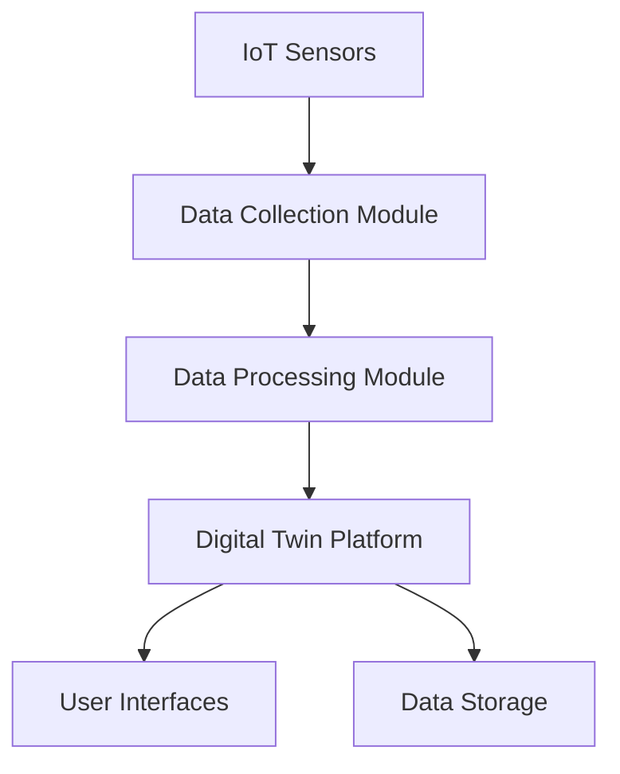

                 

### 1.1 Definition and Background

#### Definition of Digital Twins

A digital twin is an exact virtual replica of a physical entity or system. It is a powerful concept that leverages the Internet of Things (IoT), big data, and advanced analytics to create a mirror image of real-world objects, processes, or environments. These digital replicas are not mere copies; they are dynamic and continuously updated to reflect real-time changes in their physical counterparts.

Digital twins are constructed by integrating data from various sources, including sensors, simulations, and machine learning algorithms. This integrated data creates a rich, multi-faceted model that enables precise monitoring, analysis, and simulation of the physical world. The digital twin can then be used to predict future states, optimize processes, and enhance decision-making.

#### Definition of Smart Campus Management

A smart campus is a comprehensive digital ecosystem that integrates various technologies to enhance the learning, living, and working experiences on a college or university campus. Smart campus management involves the use of advanced technologies, such as Internet of Things (IoT), artificial intelligence (AI), and big data analytics, to optimize campus operations, improve resource utilization, and enhance the overall student experience.

Smart campus management aims to create a seamless, connected environment where students, faculty, and staff can access the resources they need anytime, anywhere. This includes smart classrooms, digital libraries, security systems, energy management systems, and more.

#### Importance of Digital Twins in Education

Digital twins have emerged as a transformative technology in the education sector, offering several key benefits:

1. **Enhanced Resource Management**: Digital twins enable precise monitoring and analysis of educational resources, such as classrooms, laboratories, and equipment. This leads to optimized resource allocation, reduced waste, and improved efficiency.

2. **Personalized Learning Experiences**: By creating a detailed digital replica of each student, digital twins can provide personalized learning experiences tailored to individual needs and preferences. This can lead to better academic outcomes and a more engaging learning environment.

3. **Real-Time Analytics and Predictive Insights**: Digital twins generate vast amounts of data that can be analyzed in real-time to identify trends, predict issues, and make informed decisions. This can help educators and administrators address challenges before they become critical.

4. **Facility Maintenance and Operations**: Digital twins can monitor the condition of campus facilities and predict maintenance needs. This leads to proactive maintenance, reduced downtime, and improved safety.

5. **Research and Development**: Digital twins can be used to simulate and test new educational concepts, curricula, and teaching methods. This can accelerate innovation and improve the effectiveness of educational practices.

#### Challenges in Traditional Campus Management

Despite the many benefits of digital twins, traditional campus management systems face several challenges:

1. **Inefficient Resource Allocation**: Traditional systems often lack the ability to monitor and analyze resource usage in real-time. This can lead to overutilization of some resources and underutilization of others.

2. **Limited Personalization**: Traditional campus management systems typically provide a one-size-fits-all approach to education, which may not meet the diverse needs and preferences of all students.

3. **Delayed Decision-Making**: In traditional systems, data collection, analysis, and reporting are often time-consuming processes. This can lead to delayed decision-making and missed opportunities for improvement.

4. **Limited Integration**: Traditional campus management systems are often fragmented, with separate systems for different functions (e.g., learning management systems, security systems, facility management systems). This lack of integration can lead to inefficiencies and missed opportunities for synergy.

5. **Security and Privacy Concerns**: The integration of IoT devices and other technologies in campus management systems can raise concerns about data security and privacy.

#### The Role of Digital Twins in Resource Optimization

Digital twins address many of the challenges faced by traditional campus management systems and offer several advantages in resource optimization:

1. **Real-Time Monitoring and Analysis**: Digital twins provide real-time data on resource usage and performance, enabling administrators to make informed decisions and take corrective actions as needed.

2. **Predictive Analytics**: By analyzing historical data and current trends, digital twins can predict future resource needs and help administrators plan for future growth and changes.

3. **Proactive Maintenance**: Digital twins can monitor the condition of campus facilities and predict maintenance needs, reducing downtime and extending the lifespan of assets.

4. **Improved Personalization**: Digital twins enable personalized resource allocation based on individual student needs and preferences, leading to a more engaging and effective learning environment.

5. **Enhanced Integration**: Digital twins can integrate with existing campus management systems, creating a seamless, interconnected environment that enables more efficient operations and better decision-making.

In conclusion, digital twins have the potential to revolutionize campus management by offering real-time insights, predictive analytics, personalized experiences, and enhanced integration. As educational institutions continue to adopt digital technologies, digital twins will play an increasingly important role in optimizing resource allocation and improving the overall student experience.

### 1.2 Core Concepts and Frameworks of Digital Twins

#### 1.2.1 Overview of Digital Twin Technologies

Digital twin technologies encompass a wide range of advanced tools and methodologies that enable the creation and maintenance of digital replicas of physical objects, systems, or environments. These technologies are primarily driven by the convergence of the Internet of Things (IoT), big data analytics, cloud computing, and machine learning.

**Key Components of Digital Twin Technologies:**

1. **IoT Sensors**: IoT sensors are essential for collecting real-time data from physical assets, such as equipment, buildings, and infrastructure. These sensors monitor various parameters like temperature, pressure, vibration, and location.

2. **Data Acquisition and Integration**: The collected data is then transmitted to a central system for processing and integration. This process involves data cleansing, normalization, and transformation to ensure consistency and accuracy.

3. **Simulation and Modeling**: Digital twins leverage sophisticated simulation and modeling tools to create dynamic and interactive replicas of physical systems. These models can be used to predict the behavior of the physical asset under different conditions.

4. **Data Analytics and Machine Learning**: Advanced analytics and machine learning algorithms are used to analyze the collected data, identify patterns, and generate insights. These insights can be used to optimize operations, predict maintenance needs, and improve decision-making.

5. **Visualization and Interaction**: Visualization tools enable users to interact with digital twins and gain a better understanding of their behavior and performance. These tools can display real-time data, simulations, and predictive insights in an intuitive and easy-to-understand format.

**Types of Digital Twins:**

1. **Product Digital Twins**: These are used to simulate and optimize the design, production, and maintenance of physical products. For example, in the automotive industry, digital twins can be used to simulate and optimize the manufacturing process of vehicles.

2. **Process Digital Twins**: These focus on simulating and optimizing the operational processes of industrial systems. They are commonly used in manufacturing, energy, and logistics industries to improve efficiency and reduce costs.

3. **Asset Digital Twins**: These are used to monitor and maintain physical assets, such as machinery, buildings, and infrastructure. Asset digital twins can predict maintenance needs, optimize operations, and extend the lifespan of assets.

4. **Person Digital Twins**: These are virtual replicas of individuals, often used in healthcare and personalized medicine to monitor and manage health conditions. Person digital twins can provide personalized recommendations and insights based on individual health data.

#### 1.2.2 Frameworks for Digital Twin Implementation

The implementation of digital twin technologies requires a well-defined framework that ensures seamless integration with existing systems, efficient data processing, and reliable performance. Several frameworks have been developed to facilitate the implementation of digital twins, each with its own unique features and advantages.

**1. OpenDTM (Open Digital Twin Model):**

OpenDTM is an open-source framework designed to create and manage digital twins. It provides a standardized approach to digital twin implementation, enabling interoperability between different systems and technologies. Key components of OpenDTM include:

- **Data Models**: OpenDTM provides a set of standardized data models for digital twins, including physical, functional, and operational models. These models ensure consistency and compatibility across different digital twin instances.

- **Data Integration**: OpenDTM offers tools for integrating data from various sources, such as IoT sensors, databases, and cloud services. This ensures that digital twins have access to comprehensive and up-to-date data.

- **Simulation and Analytics**: OpenDTM includes built-in simulation and analytics capabilities, allowing users to create and run simulations, analyze data, and generate insights.

- **APIs and Interfaces**: OpenDTM provides APIs and interfaces for integrating with other systems and applications, enabling seamless data exchange and interoperability.

**2. ThingWorx:**

ThingWorx is a commercial platform for creating digital twins and industrial IoT applications. It offers a comprehensive set of tools and features for digital twin development, including:

- **Modeling and Simulation**: ThingWorx provides powerful modeling and simulation tools that allow users to create accurate and dynamic digital twins of physical assets.

- **Data Analytics**: ThingWorx includes advanced analytics capabilities, enabling users to analyze data from digital twins and generate actionable insights.

- **Integration and Connectivity**: ThingWorx supports integration with a wide range of IoT devices, sensors, and cloud services, ensuring seamless data flow and interoperability.

- **User Interfaces**: ThingWorx offers intuitive user interfaces that enable users to interact with digital twins and visualize data in real-time.

**3. GE Digital:**

GE Digital offers the Predix platform, which is designed specifically for creating and managing industrial digital twins. Key features of Predix include:

- **Cloud-Native Architecture**: Predix is a cloud-native platform that enables the creation and management of digital twins on a scalable and secure infrastructure.

- **Data Analytics and Machine Learning**: Predix provides advanced analytics and machine learning capabilities for analyzing digital twin data and generating actionable insights.

- **Integration and Interoperability**: Predix supports integration with a wide range of industrial systems, sensors, and third-party applications, ensuring seamless interoperability.

- **Security and Compliance**: Predix is designed with security in mind, providing features such as encryption, access control, and compliance with industry standards.

In conclusion, digital twin technologies offer a powerful means of creating virtual replicas of physical objects, systems, and environments. These technologies are supported by a range of frameworks and platforms, each with its own unique features and advantages. As digital twin technologies continue to evolve, they will play an increasingly important role in optimizing operations, improving decision-making, and enhancing the overall efficiency of various industries.

#### 1.2.3 Data Collection and Integration

**1. Data Collection**

The foundation of any effective digital twin lies in the collection of accurate and comprehensive data from the physical world. This data is gathered through various IoT sensors, which are strategically placed on or within the physical assets being monitored. Sensors can collect a wide range of data, including temperature, pressure, vibration, humidity, and location. Each sensor is typically connected to a network, enabling it to transmit data in real-time to a central data hub.

**Types of Sensors:**

- **Environmental Sensors**: These sensors measure environmental conditions such as temperature, humidity, and air quality. They are commonly used in facilities management to ensure optimal conditions for both students and staff.

- **Physical Sensors**: These sensors monitor the physical state of assets, such as machinery, structural integrity, and wear and tear. They are essential for predicting maintenance needs and preventing unexpected failures.

- **Location Sensors**: These sensors track the movement of people and assets within the campus. They are often used for security purposes and for optimizing the allocation of resources.

- **Behavioral Sensors**: These sensors collect data on how assets are used, such as the frequency of equipment usage or the number of times a door is opened. This data can provide insights into usage patterns and help optimize resource allocation.

**2. Data Transmission and Storage**

Once collected, the data is transmitted to a central data hub or cloud-based server using various communication protocols such as MQTT, CoAP, or HTTP. This data transmission is typically secure, leveraging encryption and authentication mechanisms to protect sensitive information.

The collected data is then stored in databases or data lakes, where it can be accessed and analyzed by digital twin platforms. Common data storage solutions include relational databases (e.g., MySQL, PostgreSQL) and NoSQL databases (e.g., MongoDB, Cassandra). Cloud-based storage solutions such as Amazon S3, Google Cloud Storage, and Azure Data Lake are also popular due to their scalability and flexibility.

**3. Data Integration**

Data integration is a critical step in the digital twin process, as it involves combining data from various sources into a unified and coherent dataset. This ensures that the digital twin has a complete and accurate representation of the physical asset or environment it is modeling.

**Data Integration Methods:**

- **Data Ingestion**: Data ingestion involves bringing data from different sources into a central data hub. This process often involves data preprocessing, where raw data is cleaned, formatted, and transformed to ensure consistency and compatibility.

- **Data Mapping**: Data mapping is the process of identifying how data from different sources can be mapped to a common schema or data model. This is crucial for ensuring that the digital twin can integrate and process data from multiple sources.

- **Data Transformation**: Data transformation involves converting data from one format to another to ensure compatibility with the digital twin platform. This may involve data normalization, aggregation, and enrichment.

- **Data Warehousing**: Data warehousing involves storing integrated data in a central repository for further analysis and reporting. Data warehouses are designed to handle large volumes of data and provide fast query performance.

**Challenges and Solutions in Data Collection and Integration:**

- **Data Quality**: Ensuring the quality of collected data is critical for the accuracy of digital twins. Challenges include data noise, missing values, and inconsistencies. Solutions involve data cleaning, validation, and enrichment techniques.

- **Data Volume**: The volume of data generated by IoT sensors can be significant, posing challenges for storage and processing. Solutions include using cloud-based storage and analytics platforms that can scale with data volume.

- **Latency**: Real-time digital twins require low-latency data transmission and processing. Challenges include network latency and the processing power required for real-time analytics. Solutions involve using edge computing and optimized data processing algorithms.

In conclusion, data collection and integration are foundational to the creation and effectiveness of digital twins. By ensuring accurate and comprehensive data collection, and by integrating data from various sources into a coherent dataset, digital twins can provide valuable insights and support optimized decision-making in various domains, including smart campus management.

#### 1.2.4 Simulation and Modeling in Digital Twins

Simulation and modeling are critical components of digital twins, enabling the creation of virtual replicas that can mimic the behavior of real-world systems. These simulations are not static representations; they are dynamic, evolving in real-time to reflect changes in their physical counterparts.

**1. Types of Simulations and Models**

Digital twin simulations can be broadly categorized into the following types:

- **Physical Simulations**: These models simulate the physical properties and behaviors of objects, such as structural integrity, thermal dynamics, and fluid flow. For example, in a smart campus, a physical simulation could predict how a building's temperature will change over time based on weather conditions and internal heat sources.

- **Process Simulations**: These models focus on simulating operational processes and workflows. In a campus setting, process simulations can be used to optimize scheduling of classes, resource allocation, and maintenance tasks. For instance, a simulation can predict the optimal number of classrooms needed based on enrollment patterns and course availability.

- **Behavioral Simulations**: These models simulate the actions and interactions of individuals within a system. In the context of a smart campus, behavioral simulations can predict how students will navigate the campus, interact with facilities, and utilize resources. This can help optimize the layout of buildings and the design of services to improve user experience.

- **Financial Simulations**: These models evaluate the financial impact of different decisions and scenarios. In campus management, financial simulations can help administrators understand the costs and benefits of various investments, such as new construction projects or upgrades to technology infrastructure.

**2. Role of Simulation and Modeling in Digital Twins**

Simulation and modeling serve several important functions in the digital twin ecosystem:

- **Predictive Analytics**: By simulating various scenarios, digital twins can predict future outcomes and potential issues. For example, a campus administrator could use a simulation to predict how a new building addition would affect traffic flow and resource allocation, allowing for informed decision-making.

- **Optimization**: Simulations enable the optimization of processes and resource allocation. By testing different configurations and strategies, administrators can identify the most efficient ways to use resources, reduce waste, and improve service delivery.

- **Validation**: Digital twins can be used to validate the performance of new systems or changes to existing ones. For example, before installing new HVAC systems, a simulation can be used to ensure that the systems will operate as expected and meet performance standards.

- **Training and Education**: Simulations provide a safe and controlled environment for training staff and students. For instance, emergency response training can be conducted using a simulated campus environment to prepare for real-life scenarios.

**3. Tools and Technologies for Simulation and Modeling**

There are various tools and technologies available for creating and running simulations in digital twins:

- **Simulation Software**: Tools like ANSYS, Simulink, andAMESim are commonly used for physical simulations. These tools offer comprehensive capabilities for modeling complex systems and running high-fidelity simulations.

- **Simulation Platforms**: Platforms like SimScale and SimIO provide cloud-based simulation environments that allow users to create, run, and share simulations. These platforms are particularly useful for collaborative projects and rapid prototyping.

- **Simulation APIs**: APIs from major simulation software providers, such as the ANSYS APIs, enable the integration of simulation capabilities into custom applications. This allows for real-time simulation and analysis within digital twin platforms.

- **Machine Learning Models**: Machine learning models can be used to enhance simulations by predicting outcomes based on historical data. For example, a machine learning model could be trained to predict equipment failures based on sensor data, providing insights that can be used to optimize maintenance schedules.

**4. Challenges and Solutions in Simulation and Modeling**

Challenges in simulation and modeling include:

- **Accuracy**: Ensuring that simulations accurately reflect real-world behavior can be challenging due to the complexity of physical systems and the limitations of simulation models.

- **Computational Resources**: Running high-fidelity simulations requires significant computational resources, which can be a barrier for some organizations.

- **Integration**: Integrating simulation capabilities into digital twin platforms can be complex, especially when dealing with multiple types of simulations and diverse data sources.

Solutions to these challenges include:

- **Model Validation**: Regularly validating simulation models against real-world data helps ensure accuracy.

- **High-Performance Computing**: Utilizing high-performance computing (HPC) resources or cloud-based simulation platforms can provide the necessary computational power for complex simulations.

- **Data Integration Tools**: Using data integration tools and platforms can simplify the process of integrating simulations with other components of the digital twin ecosystem.

In conclusion, simulation and modeling play a crucial role in the digital twin ecosystem by providing predictive analytics, optimization capabilities, and validation. By leveraging advanced simulation tools and technologies, digital twins can offer valuable insights and support more informed decision-making in various domains, including smart campus management.

#### 1.2.5 Digital Twins and Big Data Analytics

Digital twins and big data analytics are two transformative technologies that, when combined, have the potential to revolutionize various industries, including smart campus management. The synergy between these two technologies enables the creation of intelligent systems that can predict, optimize, and adapt to changing conditions in real-time.

**1. Integration of Digital Twins and Big Data Analytics**

The integration of digital twins and big data analytics involves the following key steps:

1. **Data Collection**: Digital twins collect vast amounts of data from IoT sensors, which include information on the physical state, operational performance, and environmental conditions of assets. This data is continuously streamed to data storage systems, often leveraging cloud-based solutions for scalability and accessibility.

2. **Data Ingestion and Processing**: The collected data is ingested into data processing systems, where it is cleaned, normalized, and transformed. This preprocessing step ensures that the data is in a consistent format and ready for analysis.

3. **Data Storage**: The processed data is stored in data lakes or data warehouses, which provide a centralized repository for all relevant information. These storage systems enable efficient querying and retrieval of data for analysis.

4. **Data Analysis**: Big data analytics tools and techniques are applied to the stored data to identify patterns, correlations, and anomalies. This analysis can be performed using various methods, including statistical analysis, machine learning, and data mining.

5. **Insight Generation**: The insights derived from the data analysis are used to generate actionable information that can inform decision-making. These insights can help optimize operations, predict future trends, and identify potential issues before they become critical.

**2. Role of Big Data Analytics in Digital Twins**

Big data analytics plays a critical role in enhancing the capabilities of digital twins in several ways:

1. **Predictive Maintenance**: By analyzing data collected from sensors, big data analytics can predict when equipment is likely to fail. This allows for proactive maintenance, reducing downtime and extending the lifespan of assets.

2. **Resource Optimization**: Big data analytics can identify patterns in resource usage and consumption, enabling the optimization of resource allocation. For example, in a smart campus, analytics can help determine the optimal number of classrooms, laboratory spaces, and staff required based on enrollment data and usage patterns.

3. **Energy Management**: By analyzing energy consumption data, big data analytics can identify opportunities for energy savings. This can include optimizing HVAC systems, lighting, and other energy-consuming devices to reduce overall energy usage.

4. **Safety and Security**: Big data analytics can detect anomalies in security systems and environmental conditions, helping to ensure the safety and security of the campus community. For example, unusual activity patterns or environmental conditions can trigger alerts for immediate response.

5. **Enhanced Decision-Making**: Big data analytics provides administrators with actionable insights that can inform strategic decisions. This can include decisions on facility upgrades, new infrastructure investments, and resource allocation.

**3. Challenges and Solutions in Digital Twins and Big Data Analytics**

While the integration of digital twins and big data analytics offers significant benefits, there are also challenges that need to be addressed:

1. **Data Quality**: Ensuring the quality of the collected data is critical. Poor data quality can lead to inaccurate insights and decisions. Solutions include data validation techniques and the use of data cleansing tools.

2. **Data Privacy**: With the increasing use of IoT sensors and the collection of personal data, ensuring data privacy is essential. Solutions include implementing robust data privacy policies and using encryption techniques to protect sensitive information.

3. **Computational Resources**: Analyzing large volumes of data requires significant computational resources. Solutions include leveraging cloud-based analytics platforms and using high-performance computing (HPC) resources.

4. **Integration Complexity**: Integrating digital twins with existing IT infrastructure can be complex. Solutions include using standardized data formats and APIs, and leveraging middleware to facilitate data integration.

In conclusion, the integration of digital twins and big data analytics creates a powerful framework for optimizing operations, improving decision-making, and enhancing the overall efficiency of smart campus management. By addressing the challenges associated with these technologies, educational institutions can harness their full potential to create a smarter, more efficient, and more responsive learning environment.

#### 1.3 Application Scenarios of Digital Twins in Campus Management

Digital twins have a wide range of applications in campus management, offering innovative solutions to various challenges faced by educational institutions. By creating virtual replicas of physical assets, systems, and environments, digital twins enable real-time monitoring, predictive analytics, and optimized decision-making. Here are some key application scenarios of digital twins in campus management:

**1. Classroom Environment Monitoring**

One of the primary applications of digital twins in campus management is monitoring classroom environments. Digital twins can collect and analyze data from various IoT sensors, such as temperature, humidity, air quality, and lighting, to ensure optimal conditions for learning. For example, a digital twin of a classroom can adjust the HVAC system to maintain a comfortable temperature and humidity level, while also optimizing energy consumption.

- **Real-Time Monitoring**: Digital twins provide real-time data on classroom conditions, allowing administrators to make immediate adjustments as needed. For instance, if the temperature in a classroom rises above a certain threshold, the digital twin can automatically signal the HVAC system to cool the room.

- **Predictive Maintenance**: By continuously monitoring the performance of classroom equipment, such as projectors and lighting systems, digital twins can predict maintenance needs. This enables proactive maintenance, reducing the risk of unexpected breakdowns during class.

- **Personalized Learning Experiences**: Digital twins can also enhance the learning experience by providing personalized environmental settings. For example, students who prefer a cooler environment can adjust the classroom temperature settings through a mobile app.

**2. Resource Allocation and Scheduling**

Another key application of digital twins in campus management is optimizing resource allocation and scheduling. By leveraging real-time data and predictive analytics, digital twins can help administrators make informed decisions about the allocation of classrooms, laboratories, and other resources.

- **Optimized Class Scheduling**: Digital twins can analyze enrollment data, class times, and room availability to optimize class scheduling. This ensures that classrooms and other facilities are used efficiently, reducing wasted space and maximizing the utilization of resources.

- **Laboratory Resource Allocation**: In laboratories, digital twins can monitor the usage of equipment and materials, predicting when resources will be needed. This enables administrators to schedule experiments and allocate resources effectively, ensuring that students have access to the tools and materials they need when they need them.

- **Event and Activity Planning**: Digital twins can also be used to plan and schedule events, such as conferences and workshops. By analyzing space availability, capacity constraints, and equipment requirements, digital twins can help administrators create efficient and effective event schedules.

**3. Facility Management and Maintenance**

Digital twins are highly effective in managing and maintaining campus facilities, from buildings and infrastructure to IT systems and equipment.

- **Predictive Maintenance**: By continuously monitoring the condition of facilities and equipment, digital twins can predict maintenance needs and schedule maintenance activities proactively. This reduces the risk of unexpected failures and extends the lifespan of assets.

- **Optimized Facility Usage**: Digital twins can analyze data on facility usage, identifying patterns and trends. This helps administrators optimize the use of space and resources, ensuring that facilities are used efficiently and effectively.

- **Energy Management**: Digital twins can monitor energy consumption in real-time, identifying areas where energy savings can be achieved. By optimizing HVAC systems, lighting, and other energy-consuming devices, digital twins can significantly reduce energy costs.

- **Asset Tracking**: Digital twins can track the location and status of assets, such as furniture, equipment, and vehicles, ensuring that they are available when needed and reducing the risk of loss or misplacement.

**4. Safety and Security**

Digital twins play a critical role in ensuring the safety and security of the campus community. By monitoring and analyzing data from various sources, such as surveillance cameras, access control systems, and environmental sensors, digital twins can detect and respond to potential threats in real-time.

- **Intrusion Detection**: Digital twins can analyze video footage from surveillance cameras to detect unusual activity patterns, triggering alerts for immediate response. This can help prevent security breaches and ensure the safety of students, faculty, and staff.

- **Emergency Response Planning**: Digital twins can simulate emergency scenarios, providing insights into the most effective evacuation routes and response strategies. This enables campus administrators to plan and train for emergency situations, ensuring a swift and coordinated response.

- **Environmental Monitoring**: Digital twins can monitor environmental conditions, such as air quality and hazardous materials levels, ensuring that the campus environment is safe and healthy. This is particularly important in facilities where experiments involving hazardous materials are conducted.

In conclusion, digital twins offer a wide range of applications in campus management, from monitoring classroom environments and optimizing resource allocation to managing facilities and ensuring safety and security. By leveraging the power of digital twin technology, educational institutions can create smarter, more efficient, and safer campuses that enhance the learning and living experiences of students, faculty, and staff.

#### 1.4 Optimization of Classroom Environment with Digital Twins

Optimizing classroom environments is a critical aspect of smart campus management, as it directly impacts the learning experience and overall well-being of students and faculty. Digital twins offer a powerful tool for achieving this goal by providing real-time data, predictive analytics, and automated control systems. Here's a detailed look at how digital twins can be used to optimize classroom environments:

**1. Real-Time Data Collection and Analysis**

Digital twins collect data from a variety of IoT sensors, including temperature, humidity, air quality, lighting, and occupancy sensors. This data is continuously transmitted to a central data hub, where it is processed and analyzed in real-time. By leveraging machine learning algorithms and data analytics, digital twins can identify patterns and anomalies in the collected data, providing valuable insights into the classroom environment.

- **Temperature and Humidity Control**: Digital twins can monitor the temperature and humidity levels in a classroom and adjust the HVAC system accordingly. For instance, if the temperature rises above a certain threshold, the digital twin can signal the HVAC system to cool the room, ensuring a comfortable learning environment.

- **Air Quality Monitoring**: By analyzing data from air quality sensors, digital twins can detect pollutants and other contaminants in the air. This enables the system to trigger air purifiers or open windows to improve air quality.

- **Lighting Optimization**: Digital twins can adjust the lighting in classrooms based on the time of day and occupancy levels. During the day, natural light can be utilized, while in the evenings or on cloudy days, automated systems can adjust the artificial lighting to ensure adequate illumination without causing eye strain.

**2. Predictive Analytics and Maintenance**

One of the key advantages of digital twins is their ability to predict future trends and potential issues based on historical data and current conditions. This predictive capability is particularly valuable in optimizing classroom environments:

- **Predictive Maintenance**: By continuously monitoring equipment such as HVAC systems, projectors, and lighting, digital twins can predict when maintenance will be required. This allows for proactive maintenance, reducing the risk of unexpected breakdowns and minimizing disruptions to teaching and learning.

- **Energy Efficiency**: Digital twins can analyze energy consumption patterns in classrooms, identifying areas where energy savings can be achieved. For example, they can identify times when HVAC systems can be turned off or dimmed without affecting the comfort of students and faculty.

**3. Automated Control Systems**

Digital twins enable the implementation of automated control systems that can optimize classroom environments without the need for manual intervention:

- **Occupancy Detection**: Digital twins can use occupancy sensors to detect the number of people in a classroom. This information can be used to adjust the HVAC system, lighting, and other environmental controls to ensure optimal conditions.

- **Smart Scheduling**: By integrating with classroom scheduling systems, digital twins can automatically adjust environmental settings based on scheduled activities. For example, if a physics lab is scheduled for the next class, the digital twin can adjust the lighting and air quality to meet the specific needs of the lab session.

- **Remote Monitoring and Control**: Digital twins allow administrators to monitor and control classroom environments remotely. This is particularly useful in situations where manual adjustments are not feasible, such as during holidays or maintenance activities.

**4. Enhanced Learning Experience**

The optimization of classroom environments through digital twins has a direct impact on the learning experience:

- **Comfort and Focus**: By maintaining optimal temperature, humidity, and air quality, digital twins create a comfortable and focused learning environment. This can lead to improved concentration and academic performance.

- **Personalization**: Digital twins can be personalized to meet the individual preferences of students and faculty. For example, students who prefer a cooler environment can adjust the classroom temperature through a mobile app, while faculty can set up their preferred lighting and seating arrangements.

**5. Implementation Challenges and Solutions**

While the implementation of digital twins in classroom environments offers significant benefits, there are also challenges that need to be addressed:

- **Integration**: Integrating digital twin technology with existing classroom systems, such as HVAC and lighting controls, can be complex. Solutions include using standardized protocols and integrating with smart building platforms.

- **Data Privacy**: Ensuring the privacy of data collected by digital twins is essential. Solutions include implementing robust data privacy measures and anonymizing data where possible.

- **Cost**: The initial cost of implementing digital twin technology can be high. Solutions include leveraging cloud-based services and gradually expanding the deployment to manage costs.

In conclusion, digital twins offer a comprehensive solution for optimizing classroom environments, enhancing the learning experience, and improving overall operational efficiency. By leveraging real-time data, predictive analytics, and automated control systems, digital twins enable educational institutions to create smarter, more efficient, and more comfortable learning spaces that support student success and well-being.

### Chapter 4: Optimizing Resource Allocation with Digital Twins

#### 4.1 Defining Key Performance Indicators (KPIs)

In order to effectively optimize resource allocation with digital twins, it is essential to establish clear and measurable Key Performance Indicators (KPIs). These KPIs serve as benchmarks for evaluating the efficiency and effectiveness of resource utilization within a smart campus environment. The following are some critical KPIs that can be used in this context:

1. **Resource Utilization Rate**: This KPI measures the percentage of time that resources such as classrooms, laboratories, and equipment are being used. A high utilization rate indicates that resources are being effectively utilized, while a low rate may suggest underutilization or inefficiency.

2. **Throughput**: Throughput measures the amount of work completed or the number of transactions processed within a given period. For example, in a classroom setting, throughput could be measured by the number of classes conducted or the number of students enrolled.

3. **Average Wait Time**: This KPI quantifies the average time students or faculty members have to wait for resources such as classrooms, lecture halls, or equipment. Reducing average wait times can significantly improve the overall user experience and operational efficiency.

4. **Energy Efficiency**: Energy efficiency metrics, such as energy consumption per square foot or per student, provide insights into the sustainability and cost-effectiveness of resource allocation and usage.

5. **Maintenance Costs**: This KPI tracks the cost of maintaining and repairing resources over time. By minimizing maintenance costs, campuses can allocate resources more effectively and extend the lifespan of assets.

6. **Student and Faculty Satisfaction**: Surveys and feedback from students and faculty can provide qualitative insights into their satisfaction with resource allocation and usage. High satisfaction levels often correlate with improved academic performance and overall campus experience.

#### 4.2 Decision-Making Processes in Resource Allocation

Optimizing resource allocation in a smart campus involves a series of complex decision-making processes. Digital twins play a pivotal role in facilitating these decisions by providing real-time data and predictive insights. The following steps outline the typical decision-making process for resource allocation:

1. **Data Collection**: Digital twins continuously collect data from various sources, including IoT sensors, student enrollment systems, scheduling software, and maintenance logs. This data is used to create a comprehensive and up-to-date picture of resource usage and demand.

2. **Data Analysis**: The collected data is analyzed using advanced analytics tools and algorithms to identify trends, patterns, and potential issues. This analysis helps identify underutilized resources, peak usage times, and areas where improvements can be made.

3. **Scenario Modeling**: Based on the analysis, various scenarios are modeled to predict the impact of different resource allocation strategies. These scenarios consider factors such as enrollment fluctuations, facility maintenance schedules, and special events.

4. **Optimization Algorithms**: Optimization algorithms, such as linear programming, genetic algorithms, and simulated annealing, are applied to the modeled scenarios to identify the most efficient resource allocation strategies. These algorithms aim to maximize resource utilization and minimize costs.

5. **Decision-Making**: The results of the optimization algorithms are used to inform decision-makers about the best course of action. This may involve adjusting schedules, reallocating resources, or implementing new policies to improve efficiency.

6. **Implementation and Monitoring**: Once decisions are made, they are implemented and monitored in real-time. Digital twins continue to collect data and provide feedback, enabling ongoing adjustments to ensure that resource allocation remains optimized.

#### 4.3 Simulation and Optimization Techniques

Simulation and optimization techniques are fundamental to the effective use of digital twins in resource allocation. These techniques involve creating detailed models of the campus environment and using them to test and refine resource allocation strategies. Here are some key simulation and optimization techniques:

1. **Simulation Models**: Simulation models replicate the behavior of the campus environment, including the usage patterns of resources, student enrollment trends, and maintenance schedules. These models are essential for understanding how different strategies will impact the system.

2. **Scenario Analysis**: Scenario analysis involves running multiple simulations with different input parameters to understand the potential outcomes of various strategies. This helps identify the most effective approaches for optimizing resource allocation.

3. **Optimization Algorithms**: As mentioned earlier, optimization algorithms are used to identify the best resource allocation strategies based on the simulation models. These algorithms consider various constraints and objectives, such as maximizing resource utilization and minimizing costs.

4. **Agent-Based Modeling**: Agent-Based Modeling (ABM) simulates the behavior of individual entities within the campus environment, such as students, faculty, and staff. ABM can provide insights into how different agents interact and how their actions impact resource allocation.

5. **Data-Driven Optimization**: Data-driven optimization involves using machine learning algorithms to analyze historical data and predict future resource needs. This allows for dynamic adjustments to resource allocation based on real-time data and changing conditions.

6. **Real-Time Feedback**: Real-time feedback mechanisms are critical for ensuring that resource allocation strategies remain effective over time. Digital twins continuously collect data and provide real-time feedback, enabling campuses to make ongoing adjustments to maintain optimal resource utilization.

#### 4.4 Real-Time Monitoring and Adaptive Management

Real-time monitoring and adaptive management are essential components of resource optimization with digital twins. These capabilities allow campuses to respond quickly to changing conditions and make proactive adjustments to maintain optimal resource allocation. Here are some key aspects of real-time monitoring and adaptive management:

1. **Real-Time Data Collection**: Digital twins continuously collect real-time data from IoT sensors, student information systems, and other sources. This data is used to monitor the status and usage of resources in real-time.

2. **Real-Time Analytics**: Real-time analytics tools process and analyze the collected data to provide immediate insights into resource usage and performance. This enables campuses to identify issues and opportunities for improvement as they arise.

3. **Adaptive Control Systems**: Adaptive control systems use real-time data and analytics to automatically adjust resource allocation in response to changes in demand or conditions. For example, if a classroom becomes overcrowded, the system can automatically schedule an additional class or allocate an alternative space.

4. **Predictive Maintenance**: Digital twins can predict maintenance needs based on real-time data and historical trends. This allows for proactive maintenance, reducing the risk of unexpected downtime and ensuring the availability of resources.

5. **User Feedback**: Digital twins can also collect user feedback through surveys and other mechanisms. This feedback is used to identify areas for improvement and adjust resource allocation strategies to better meet user needs.

6. **Ongoing Optimization**: Real-time monitoring and adaptive management enable campuses to continuously optimize resource allocation. By analyzing real-time data and making ongoing adjustments, campuses can ensure that resources are always allocated in the most efficient and effective manner.

In conclusion, optimizing resource allocation with digital twins involves defining Key Performance Indicators (KPIs), implementing effective decision-making processes, utilizing simulation and optimization techniques, and leveraging real-time monitoring and adaptive management. By embracing these strategies, campuses can create smarter, more efficient, and more responsive environments that enhance the learning and working experiences of students, faculty, and staff.

### 4.5 The Role of Artificial Intelligence and Machine Learning in Digital Twin Applications

Artificial Intelligence (AI) and Machine Learning (ML) are transformative technologies that significantly enhance the capabilities of digital twins in smart campus management. By harnessing the power of AI and ML, digital twins can achieve higher levels of efficiency, accuracy, and adaptability, leading to more informed decision-making and optimized resource allocation.

**1. Predictive Analytics and Maintenance**

One of the most significant applications of AI and ML in digital twins is predictive analytics and maintenance. By analyzing historical data and real-time sensor inputs, AI algorithms can predict equipment failures before they occur. This proactive approach allows for scheduled maintenance rather than emergency repairs, reducing downtime and extending the lifespan of assets. For example, ML models can be trained on data from temperature sensors, pressure gauges, and other IoT devices to detect early signs of equipment wear and predict the optimal time for maintenance.

- **Algorithm:**
  - **Step 1:** Collect data from various sensors monitoring equipment.
  - **Step 2:** Preprocess the data to remove noise and missing values.
  - **Step 3:** Train a regression model (e.g., linear regression, decision tree, or neural network) using historical failure data and operational metrics.
  - **Step 4:** Use the trained model to predict the probability of failure for each piece of equipment.
  - **Step 5:** Schedule maintenance based on the predicted failure probabilities.

- **Example:**
  - In a smart campus, a predictive maintenance system can identify that a particular air conditioning unit is likely to fail within the next month based on its operating temperature patterns and usage history. This allows for a scheduled maintenance visit rather than an unexpected breakdown.

**2. Personalized Learning Environments**

AI and ML can be used to create personalized learning environments that adapt to the needs and preferences of individual students. By analyzing student performance data, learning styles, and behavioral patterns, AI algorithms can tailor educational content, teaching methods, and classroom settings to enhance learning outcomes.

- **Algorithm:**
  - **Step 1:** Collect data on student performance, learning preferences, and behavior.
  - **Step 2:** Analyze the data to identify patterns and correlations between various factors and academic success.
  - **Step 3:** Develop a recommendation engine that suggests personalized learning resources, study schedules, and teaching methods.
  - **Step 4:** Implement adaptive learning systems that adjust educational content in real-time based on student responses and progress.

- **Example:**
  - In a smart classroom, an AI-powered system can adjust the lighting, temperature, and seating arrangement to create an environment that best suits the learning style of each student. For a visual learner, the system might increase the use of interactive visual aids and reduce verbal instruction.

**3. Energy Management**

AI and ML are instrumental in optimizing energy consumption in smart campuses. By analyzing real-time data from energy meters and IoT devices, AI algorithms can predict energy usage patterns and optimize energy distribution to reduce costs and environmental impact.

- **Algorithm:**
  - **Step 1:** Collect data on energy consumption from various sources, such as lighting, HVAC systems, and electrical appliances.
  - **Step 2:** Apply time-series analysis and machine learning techniques to forecast energy demand based on historical data and seasonal patterns.
  - **Step 3:** Implement demand response strategies that adjust energy usage in response to real-time energy prices or supply constraints.
  - **Step 4:** Continuously refine the energy management system based on feedback and new data.

- **Example:**
  - In a smart campus, an AI-powered energy management system can automatically adjust lighting levels based on occupancy and natural light conditions, reducing unnecessary energy consumption. During peak demand periods, the system can shift some non-essential loads to off-peak hours to avoid surcharges.

**4. Facility Operations Optimization**

AI and ML can optimize facility operations by automating tasks, improving safety, and enhancing the overall efficiency of campus infrastructure. For instance, AI algorithms can analyze data from security cameras, access control systems, and environmental sensors to improve campus safety and security.

- **Algorithm:**
  - **Step 1:** Collect data from various IoT devices related to facility operations.
  - **Step 2:** Use image recognition and natural language processing (NLP) techniques to analyze video feeds for potential security threats or maintenance issues.
  - **Step 3:** Implement automated workflows that trigger alarms, send notifications, or dispatch maintenance crews based on detected anomalies.
  - **Step 4:** Use reinforcement learning to continually improve the system's response to new threats or changes in the environment.

- **Example:**
  - In a smart campus, an AI system can detect unauthorized access attempts and automatically lock doors or alert security personnel. If a fire alarm is triggered, the system can direct evacuation routes and notify first responders.

In conclusion, AI and ML significantly enhance the capabilities of digital twins in smart campus management. By leveraging predictive analytics, personalized learning environments, energy management, and facility optimization, campuses can create smarter, more efficient, and safer learning environments that meet the evolving needs of students, faculty, and staff. These advanced technologies are integral to the future of smart campus management, driving innovation and transforming the way educational institutions operate.

### Chapter 5: Implementing Digital Twins in Campus Management Systems

#### 5.1 System Architecture and Design

The architecture and design of a digital twin-based campus management system are crucial for ensuring scalability, reliability, and security. A well-designed system architecture should integrate various components, including IoT sensors, data collection and processing modules, digital twin platforms, and user interfaces. Here is a detailed overview of the key components and their interactions:

1. **IoT Sensors**: The foundation of a digital twin system is the IoT sensor network, which collects real-time data from various sources across the campus. These sensors can include temperature, humidity, light, motion, and sound sensors, as well as those monitoring the status of infrastructure and equipment. The data collected by these sensors is transmitted to the central system for further processing.

2. **Data Collection and Processing Modules**: These modules are responsible for receiving and processing data from the IoT sensors. They perform tasks such as data filtering, aggregation, and normalization to ensure that the data is in a consistent and usable format. Data processing modules may also include data storage solutions like databases or data lakes to store the collected data securely and efficiently.

3. **Digital Twin Platforms**: The core of the system is the digital twin platform, which creates and maintains virtual replicas of the physical campus. These platforms use advanced analytics and machine learning algorithms to analyze the collected data and generate insights that can be used to optimize resource allocation, predict maintenance needs, and enhance decision-making.

4. **User Interfaces**: User interfaces are designed to provide real-time access to digital twin insights and enable users to interact with the system. These interfaces can include dashboards, mobile apps, and web-based platforms that display data and insights in an intuitive and user-friendly manner.

**System Architecture Diagram:**

#### 5.2 Data Management and Security

Effective data management and security are critical to the success of a digital twin-based campus management system. The system must ensure the confidentiality, integrity, and availability of data while preventing unauthorized access and potential breaches.

1. **Data Encryption**: All data transmitted between IoT sensors and the central system should be encrypted using robust encryption protocols such as SSL/TLS. This protects data in transit from interception and tampering.

2. **Access Control**: Implement strong access control mechanisms to ensure that only authorized users and systems can access sensitive data. This includes user authentication, role-based access controls (RBAC), and multi-factor authentication (MFA).

3. **Data Anonymization**: To protect user privacy, personally identifiable information (PII) should be anonymized before it is collected and stored. This can involve techniques such as data masking, data sharding, and differential privacy.

4. **Data Backup and Recovery**: Regularly backup data to prevent data loss in the event of hardware failures, cyber-attacks, or other unforeseen incidents. Implement robust data recovery strategies to ensure that data can be restored quickly and efficiently.

5. **Security Monitoring and Incident Response**: Deploy security monitoring tools to detect and respond to potential threats in real-time. This includes implementing intrusion detection systems (IDS), firewalls, and security information and event management (SIEM) systems. Establish incident response plans to quickly address and mitigate security incidents.

#### 5.3 Integration with Existing Systems

Integrating a digital twin-based campus management system with existing IT infrastructure can be complex but is essential for maximizing the system's impact. This integration involves connecting the digital twin platform to various existing systems, such as learning management systems (LMS), student information systems (SIS), facility management systems, and security systems.

1. **APIs and Data Interchange Standards**: Use Application Programming Interfaces (APIs) and data interchange standards (e.g., REST, SOAP, JSON) to facilitate seamless communication between the digital twin platform and other systems. This ensures that data can be shared and synchronized across different platforms and applications.

2. **Middleware and Orchestration Tools**: Middleware and orchestration tools can be used to manage and coordinate the integration process. These tools help in managing data flows, handling errors, and ensuring that integration processes are efficient and reliable.

3. **Data Mapping and Transformation**: Implement data mapping and transformation processes to ensure that data from different systems is consistent and compatible. This may involve converting data formats, resolving data discrepancies, and standardizing data definitions.

4. **Legacy System Compatibility**: Ensure that the digital twin platform is compatible with legacy systems that may still be in use. This may involve using legacy data access methods, such as ODBC or JDBC, or implementing adapters to bridge the gap between the digital twin platform and legacy systems.

#### 5.4 Challenges and Solutions in Implementation

Implementing a digital twin-based campus management system involves several challenges that need to be addressed to ensure successful deployment and operation. Here are some common challenges and potential solutions:

1. **Data Quality and Accuracy**: Ensuring the quality and accuracy of collected data is critical for the effectiveness of digital twins. Solutions include implementing data validation and cleansing processes, using high-quality sensors, and conducting regular data audits.

2. **Scalability**: As the number of sensors and data sources grows, the system must be able to scale to handle increasing data volumes. Solutions include using cloud-based data storage and processing solutions, implementing distributed data processing frameworks, and optimizing data flow and storage architectures.

3. **Integration Complexity**: Integrating the digital twin platform with existing systems can be complex, particularly when dealing with legacy systems and diverse data formats. Solutions include using standardized APIs, middleware, and orchestration tools, and adopting a modular approach to system design.

4. **User Adoption and Training**: Ensuring that users are comfortable and proficient with the new system is crucial for successful implementation. Solutions include providing comprehensive training programs, offering user support, and involving key stakeholders in the design and implementation process.

5. **Cost and Resource Constraints**: Implementing a digital twin-based system can be expensive and resource-intensive. Solutions include leveraging cloud services, adopting a phased implementation approach, and seeking funding or partnerships to offset costs.

In conclusion, implementing a digital twin-based campus management system requires careful planning, robust data management practices, and effective integration strategies. By addressing the challenges and leveraging the full potential of digital twin technology, educational institutions can create smarter, more efficient, and more responsive campuses that enhance the learning and working experiences of students, faculty, and staff.

#### 5.5 Best Practices for Successful Integration

The successful integration of digital twin technology into campus management systems requires a strategic approach and adherence to best practices. Here are key recommendations for ensuring a seamless and effective integration:

1. **Define Clear Objectives**: Before initiating the integration process, clearly define the goals and objectives of implementing digital twins. These objectives should align with the overall strategic vision of the campus, focusing on areas such as resource optimization, operational efficiency, and enhanced student experience.

2. **Conduct Comprehensive Planning**: Develop a detailed integration plan that includes a timeline, resource allocation, and risk assessment. This plan should also outline the specific components of the digital twin system, including sensors, data collection and processing modules, and user interfaces.

3. **Assess Existing Systems**: Conduct a thorough assessment of existing IT infrastructure and systems to identify potential integration points and compatibility issues. This assessment should include an evaluation of data formats, communication protocols, and system architectures.

4. **Choose the Right Tools and Technologies**: Select digital twin platforms and tools that are compatible with your existing systems and meet your specific requirements. Consider factors such as scalability, flexibility, and security when choosing tools and technologies.

5. **Develop a Data Management Strategy**: Establish a robust data management strategy that includes data collection, storage, processing, and security measures. This strategy should address data quality, data integration, and data privacy concerns.

6. **Leverage APIs and Interoperability Standards**: Utilize Application Programming Interfaces (APIs) and interoperability standards to facilitate seamless data exchange and integration between the digital twin system and existing systems. This includes adopting industry-standard protocols such as REST, SOAP, and JSON.

7. **Engage Stakeholders Early**: Involve key stakeholders, including faculty, staff, students, and IT professionals, in the integration process from the outset. This ensures that the digital twin system meets the needs and expectations of all users and stakeholders.

8. **Provide Training and Support**: Offer comprehensive training programs and ongoing support to ensure that users are proficient in using the digital twin system. This includes training on data interpretation, system navigation, and troubleshooting common issues.

9. **Monitor and Optimize Performance**: Continuously monitor the performance of the integrated system, collecting feedback from users and stakeholders. Use this feedback to identify areas for improvement and optimize the system's functionality and usability.

10. **Seek Feedback and Continuous Improvement**: Encourage regular feedback from users and stakeholders to identify opportunities for enhancement and optimization. Implement a process for continuous improvement that includes regular system updates and enhancements based on user feedback and emerging technologies.

By following these best practices, educational institutions can successfully integrate digital twin technology into campus management systems, creating smarter, more efficient, and more responsive environments that enhance the learning and working experiences of students, faculty, and staff.

