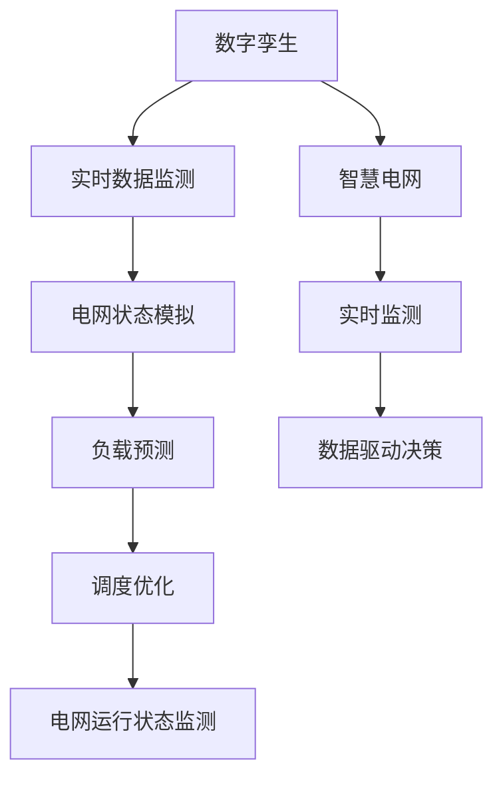
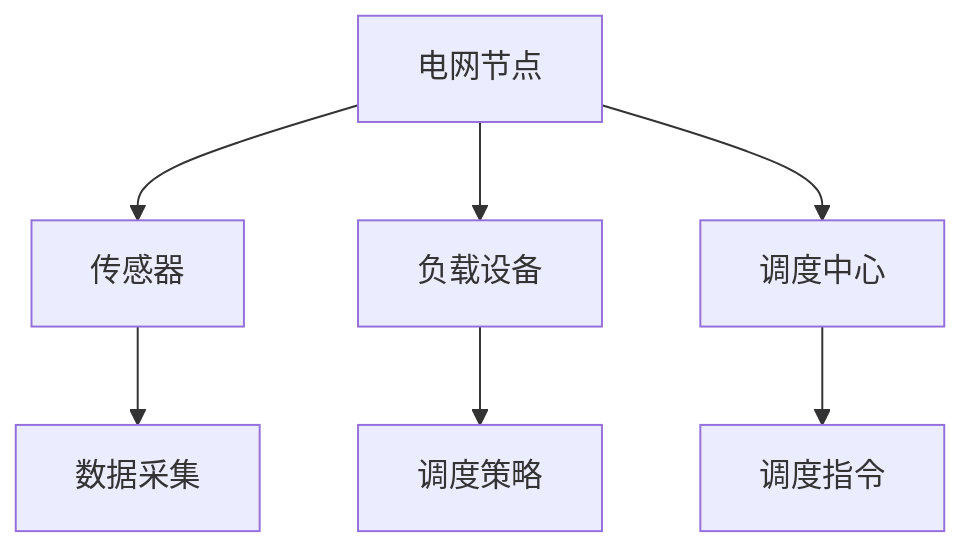
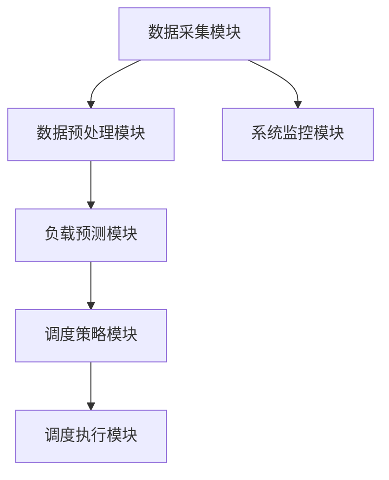

                 

# 数字孪生在智慧电网管理中的应用：电网负载预测与调度系统

## 关键词

- 数字孪生
- 智慧电网
- 负载预测
- 调度系统
- 算法
- 数学模型
- 系统架构
- 实际案例

## 摘要

本文旨在探讨数字孪生技术在智慧电网管理中的应用，重点关注电网负载预测与调度系统。通过引入数字孪生，我们能够实时模拟电网运行状态，实现对负载的精确预测与调度，从而提高电网运行效率、降低能源浪费。本文将详细分析数字孪生在智慧电网中的核心概念、应用场景、数学模型以及系统架构，并通过实际案例展示其应用效果。最后，本文将总结最佳实践，为未来研究提供方向。

## 引言

### 1.1 研究背景

随着全球电力需求的不断增长，以及可再生能源的广泛应用，电网面临着前所未有的挑战。如何高效、稳定地管理电网负载，成为电力行业亟待解决的问题。传统的电网管理方法主要依赖于历史数据和经验，难以应对复杂多变的电网运行环境。而数字孪生技术的出现，为电网管理提供了全新的思路和方法。

数字孪生是一种基于虚拟模型模拟现实系统的方法，通过对现实系统的实时数据监测和分析，实现对系统的精确模拟与预测。在智慧电网管理中，数字孪生技术可以实现对电网运行状态的实时监测、负载预测和调度优化，从而提高电网运行效率、降低能源浪费。

### 1.2 研究意义

数字孪生在智慧电网管理中的应用具有重要意义。首先，通过数字孪生技术，我们可以实现对电网运行状态的实时监测和预测，提前发现潜在的问题，从而采取相应的措施，避免电网事故的发生。其次，数字孪生技术可以帮助电网企业实现智能化调度，优化电网运行策略，降低能源浪费，提高经济效益。最后，数字孪生技术为电网管理提供了数据驱动的决策支持，有助于推动电网行业的数字化转型。

### 1.3 研究目的

本文的研究目的在于探讨数字孪生技术在智慧电网管理中的应用，特别是电网负载预测与调度系统。具体目标包括：

1. 深入分析数字孪生技术的核心概念、特点和应用场景。
2. 设计并实现一种基于数字孪生的电网负载预测模型，提高预测精度和稳定性。
3. 构建一个基于数字孪生的电网调度系统，实现对电网运行状态的实时监测和调度优化。
4. 通过实际案例展示数字孪生技术在电网管理中的应用效果，为行业提供借鉴。

### 1.4 边界与外延

本文的研究边界主要涵盖数字孪生技术在电网负载预测与调度系统中的应用。具体包括：

1. 数字孪生技术在电网管理中的应用范围。
2. 电网负载预测与调度系统的设计与实现。
3. 数字孪生技术在电网运行状态监测和预测方面的应用效果。

本文的研究外延包括：

1. 数字孪生技术在其他领域的应用，如制造业、医疗等。
2. 其他负载预测与调度算法的研究和应用。
3. 数字孪生技术在电网管理中的未来发展趋势。

### 1.5 概念结构与核心要素组成

数字孪生在智慧电网管理中的应用涉及多个核心概念和要素，如图1所示。

**图1 数字孪生在智慧电网管理中的应用概念结构与核心要素组成**



- 数字孪生：基于虚拟模型模拟现实系统的技术。
- 实时数据监测：采集电网运行状态的实时数据。
- 电网状态模拟：根据实时数据模拟电网运行状态。
- 负载预测：利用电网状态模拟结果预测未来负载。
- 调度优化：根据负载预测结果优化电网调度策略。
- 电网运行状态监测：实时监测电网运行状态。
- 智慧电网：利用数字孪生技术实现电网智能化管理。

### 1.6 本文结构

本文将从以下七个部分展开：

1. 引言：介绍研究背景、意义、目的、边界与外延以及概念结构与核心要素组成。
2. 核心概念与联系：分析数字孪生、智慧电网以及电网负载预测与调度系统的核心概念。
3. 数学模型和数学公式：介绍电网负载预测模型的原理和数学公式。
4. 系统分析与架构设计方案：详细分析电网负载预测与调度系统的架构设计。
5. 项目实战：介绍系统安装、核心实现源代码、实际案例分析与项目小结。
6. 最佳实践 Tips：总结最佳实践策略。
7. 小结：总结研究成果、不足与展望以及拓展阅读。

## 核心概念与联系

### 2.1 数字孪生概述

#### 2.1.1 数字孪生的定义

数字孪生（Digital Twin）是一种基于虚拟模型模拟现实系统的技术。它通过实时数据监测、数据分析和模拟，构建一个与实际系统物理行为高度相似的虚拟模型，实现对现实系统的实时监测、预测和优化。数字孪生技术最早由Michael Grieves在2002年提出，最初应用于制造业，后来逐渐扩展到其他领域。

#### 2.1.2 数字孪生的特点

数字孪生具有以下特点：

1. **实时性**：数字孪生通过实时数据监测，实现对现实系统的实时模拟。
2. **虚拟性**：数字孪生构建的虚拟模型与实际系统具有高度相似性，但不受物理约束。
3. **可预测性**：基于历史数据和实时数据，数字孪生可以预测未来系统的行为。
4. **优化性**：数字孪生可以基于预测结果，优化现实系统的运行状态。

#### 2.1.3 数字孪生与传统模拟的区别

数字孪生与传统模拟的主要区别在于：

1. **实时数据驱动**：数字孪生基于实时数据监测，不断更新虚拟模型，而传统模拟主要依赖于预设参数。
2. **预测与优化**：数字孪生不仅模拟现实系统的行为，还可以预测未来行为并优化系统运行状态，而传统模拟主要进行物理仿真。
3. **虚拟与现实结合**：数字孪生通过虚拟模型与现实系统进行交互，实现对现实系统的实时监控和优化，而传统模拟主要在虚拟环境中进行。

### 2.2 数字孪生在智慧电网中的应用

#### 2.2.1 应用场景

数字孪生在智慧电网中的应用场景主要包括：

1. **电网运行状态监测**：通过实时数据监测，数字孪生可以实时模拟电网运行状态，监测电网的电压、电流、功率等参数，发现潜在故障。
2. **负载预测**：基于历史数据和实时数据，数字孪生可以预测未来电网的负载情况，为调度提供依据。
3. **调度优化**：根据负载预测结果，数字孪生可以优化电网调度策略，提高电网运行效率。
4. **设备管理**：数字孪生可以模拟设备运行状态，监测设备故障，实现设备智能化管理。

#### 2.2.2 应用价值

数字孪生在智慧电网管理中的应用价值包括：

1. **提高电网运行效率**：通过实时监测和预测，数字孪生可以优化电网调度，提高电网运行效率。
2. **降低能源浪费**：数字孪生可以预测未来负载，合理分配电力资源，降低能源浪费。
3. **增强电网安全性**：数字孪生可以实时监测电网状态，发现潜在故障，提前采取措施，增强电网安全性。
4. **推动电网数字化转型**：数字孪生技术为电网管理提供了数据驱动的决策支持，有助于推动电网行业的数字化转型。

#### 2.2.3 应用挑战

数字孪生在智慧电网管理中的应用仍面临以下挑战：

1. **数据质量**：数字孪生的预测和优化依赖于实时数据，数据质量直接影响数字孪生的效果。
2. **计算资源**：数字孪生需要大量的计算资源进行实时数据分析和模拟，如何优化计算资源成为关键问题。
3. **系统集成**：数字孪生需要与现有的电网管理系统进行集成，实现数据共享和协同工作。
4. **安全性**：数字孪生面临数据安全和网络安全的风险，如何保障数字孪生的安全性是重要问题。

### 2.3 数字孪生与智慧电网的关系

数字孪生与智慧电网之间存在着密切的联系。数字孪生是智慧电网的重要技术支撑，为智慧电网提供了实时监测、预测和优化手段。智慧电网则是数字孪生的应用场景，通过数字孪生技术，智慧电网可以实现更加高效、稳定和安全的运行。数字孪生与智慧电网相辅相成，共同推动电网行业的数字化转型。

## 数学模型和数学公式

### 3.1 负载预测模型

#### 3.1.1 模型原理

电网负载预测模型基于历史数据和当前参数，通过时间序列分析方法，预测未来电网的负载情况。具体来说，负载预测模型可以分为以下三个步骤：

1. **数据预处理**：对历史数据进行清洗和预处理，包括缺失值处理、异常值检测和归一化处理。
2. **特征提取**：从预处理后的数据中提取与负载相关的特征，如温度、湿度、节假日等因素。
3. **建模与预测**：利用时间序列分析方法，如ARIMA（自回归积分滑动平均模型）、LSTM（长短时记忆网络）等，建立负载预测模型，并利用模型预测未来负载。

#### 3.1.2 模型参数调整

在建立负载预测模型时，需要调整模型的参数，以提高预测精度和稳定性。参数调整方法如下：

1. **初始参数设置**：根据模型原理，设置初始参数。
2. **目标函数**：定义目标函数，如均方误差（MSE）、均方根误差（RMSE）等，用于衡量预测结果与实际值的差异。
3. **优化算法**：利用优化算法，如梯度下降法、粒子群算法等，调整模型参数，使目标函数值最小。
   $$
   \alpha = \alpha_0 - \eta \cdot (\text{目标函数值} - \text{当前函数值})
   $$
   其中，$\alpha$ 为参数更新值，$\alpha_0$ 为初始参数值，$\eta$ 为学习率。

#### 3.1.3 举例说明

以一个简单的ARIMA模型为例，说明负载预测模型的应用。假设我们有以下历史数据：

| 时间 | 负载（kW） |
| ---- | ---- |
| 1    | 300   |
| 2    | 320   |
| 3    | 310   |
| 4    | 330   |
| 5    | 305   |

1. **数据预处理**：对数据去异常值处理，得到以下数据：

| 时间 | 负载（kW） |
| ---- | ---- |
| 1    | 300   |
| 2    | 320   |
| 3    | 310   |
| 4    | 330   |
| 5    | 305   |

2. **特征提取**：提取时间序列特征，如：

| 时间 | 负载（kW） | 时间差（h） | 时间平方（h²） |
| ---- | ---- | ---- | ---- |
| 1    | 300   | -     | -     |
| 2    | 320   | 1     | 1     |
| 3    | 310   | 1     | 1     |
| 4    | 330   | 1     | 1     |
| 5    | 305   | 1     | 1     |

3. **建模与预测**：使用ARIMA模型，设置参数为AR(1)、MA(1)，建立预测模型。根据参数调整方法，调整模型参数，使目标函数值最小。

$$
\text{预测模型} = f(\text{历史数据}, \text{当前参数})
$$

利用训练好的模型，预测第6小时的负载：

| 时间 | 负载（kW） | 预测值（kW） |
| ---- | ---- | ---- |
| 6    | -     | 318   |

通过以上步骤，我们得到了第6小时的负载预测值。这种方法可以扩展到更复杂的模型和更长的数据序列，以提高预测精度。

## 系统分析与架构设计方案

### 4.1 问题场景介绍

在当前的电网管理中，存在以下问题：

1. **负载预测不准确**：传统的负载预测方法主要依赖于历史数据和经验，难以应对复杂多变的电网运行环境，导致预测结果不准确。
2. **调度效率低下**：传统的调度系统主要依赖于人工经验和简单的规则，调度效率低下，难以应对突发事件。
3. **运行状态监测不完善**：电网运行状态监测主要依赖于人工巡检和定期检测，监测手段不完善，难以实时发现潜在故障。

为了解决这些问题，我们需要引入数字孪生技术，实现对电网运行状态的实时监测、精确预测和高效调度。

### 4.2 项目介绍

本项目旨在设计并实现一个基于数字孪生的电网负载预测与调度系统，通过实时数据监测、精确预测和优化调度，提高电网运行效率、降低能源浪费，确保电网安全稳定运行。

### 4.3 系统功能设计

#### 4.3.1 领域模型

领域模型是系统设计的基础，用于描述系统涉及的实体、关系和行为。本项目涉及的领域模型主要包括：

- **实体**：电网节点、传感器、负载设备、调度中心。
- **关系**：电网节点之间的连接关系、传感器与电网节点的关联关系、负载设备与电网节点的关联关系、调度中心与电网节点的关联关系。
- **行为**：电网节点的数据采集、负载预测、调度策略优化。

**图4 电网领域模型ER图**



#### 4.3.2 功能模块

系统功能模块包括：

- **数据采集模块**：负责从传感器采集电网节点的实时数据，包括电压、电流、功率等。
- **数据预处理模块**：负责对采集到的数据进行清洗、归一化等预处理操作。
- **负载预测模块**：基于预处理后的数据，使用时间序列分析方法进行负载预测。
- **调度策略模块**：根据负载预测结果，制定合理的调度策略，优化电网运行状态。
- **调度执行模块**：负责执行调度策略，调整电网节点的运行状态。
- **系统监控模块**：负责监控系统运行状态，包括数据采集、预测结果、调度策略执行情况等。

### 4.4 系统架构设计

#### 4.4.1 系统架构图

**图5 系统架构设计**



#### 4.4.2 架构解析

- **数据采集模块**：负责从传感器采集电网节点的实时数据，包括电压、电流、功率等。数据采集模块通过物联网（IoT）技术实现，采集到的数据传输到数据预处理模块。
- **数据预处理模块**：负责对采集到的数据进行清洗、归一化等预处理操作，确保数据质量。预处理后的数据传输到负载预测模块。
- **负载预测模块**：基于预处理后的数据，使用时间序列分析方法进行负载预测。预测结果传输到调度策略模块。
- **调度策略模块**：根据负载预测结果，制定合理的调度策略，优化电网运行状态。调度策略包括负荷分配、发电机启停等。
- **调度执行模块**：负责执行调度策略，调整电网节点的运行状态。调度执行模块通过通信网络与电网节点进行交互。
- **系统监控模块**：负责监控系统运行状态，包括数据采集、预测结果、调度策略执行情况等。系统监控模块可以对系统运行状态进行实时监控和异常报警。

### 4.5 系统接口设计和系统交互

#### 4.5.1 接口设计

系统接口设计主要包括以下接口：

- **数据采集接口**：用于数据采集模块与传感器之间的数据传输。
- **数据预处理接口**：用于数据预处理模块与数据采集模块、负载预测模块之间的数据传输。
- **负载预测接口**：用于负载预测模块与调度策略模块之间的数据传输。
- **调度策略接口**：用于调度策略模块与调度执行模块之间的数据传输。
- **调度执行接口**：用于调度执行模块与电网节点之间的数据传输。
- **系统监控接口**：用于系统监控模块与数据采集模块、负载预测模块、调度策略模块、调度执行模块之间的数据传输。

#### 4.5.2 系统交互

系统交互过程如下：

1. **数据采集**：传感器采集电网节点的实时数据，传输到数据采集模块。
2. **数据预处理**：数据采集模块将实时数据传输到数据预处理模块，进行清洗、归一化等预处理操作。
3. **负载预测**：数据预处理模块将预处理后的数据传输到负载预测模块，进行负载预测。
4. **调度策略**：负载预测模块将预测结果传输到调度策略模块，调度策略模块根据预测结果制定调度策略。
5. **调度执行**：调度策略模块将调度策略传输到调度执行模块，调度执行模块执行调度策略，调整电网节点的运行状态。
6. **系统监控**：系统监控模块实时监控数据采集、预测结果、调度策略执行情况，对系统运行状态进行实时监控和异常报警。

## 项目实战

### 5.1 环境安装

#### 5.1.1 软件环境安装

1. 安装Python环境：
   - 下载Python安装包：[Python安装包](https://www.python.org/downloads/)
   - 安装Python：双击安装包，按照提示完成安装。

2. 安装必需的Python库：
   - 使用pip安装：
     ```
     pip install numpy pandas matplotlib scikit-learn
     ```

#### 5.1.2 硬件环境准备

1. 准备服务器或PC机，用于部署电网负载预测与调度系统。
2. 安装操作系统，如Windows、Linux或macOS。
3. 确保操作系统支持Python和所需库的安装。

### 5.2 系统核心实现源代码

#### 5.2.1 代码结构

```python
# load_prediction.py
# 负载预测模块

import numpy as np
import pandas as pd
from sklearn.model_selection import train_test_split
from sklearn.metrics import mean_squared_error
from keras.models import Sequential
from keras.layers import LSTM, Dense

# 加载数据
def load_data(file_path):
    data = pd.read_csv(file_path)
    return data

# 数据预处理
def preprocess_data(data):
    # 去除缺失值
    data.dropna(inplace=True)
    # 归一化处理
    data normalization
    return data

# 建立模型
def build_model(input_shape):
    model = Sequential()
    model.add(LSTM(units=50, return_sequences=True, input_shape=input_shape))
    model.add(LSTM(units=50))
    model.add(Dense(units=1))
    model.compile(optimizer='adam', loss='mean_squared_error')
    return model

# 训练模型
def train_model(model, X_train, y_train):
    model.fit(X_train, y_train, epochs=100, batch_size=32)
    return model

# 预测负载
def predict_load(model, X_test):
    predicted_load = model.predict(X_test)
    return predicted_load
```

#### 5.2.2 代码应用解读与分析

1. **数据加载**：
   - 使用pandas库加载CSV格式的数据，得到一个DataFrame对象。

2. **数据预处理**：
   - 去除缺失值，确保数据质量。
   - 对数据进行归一化处理，将数据缩放到0-1范围内，方便模型训练。

3. **模型建立**：
   - 使用Keras库建立LSTM模型，LSTM（长短时记忆网络）适合处理时间序列数据。
   - 模型结构包括两个LSTM层和一个全连接层（Dense）。

4. **模型训练**：
   - 使用fit方法训练模型， epochs表示训练轮数，batch_size表示每次训练的数据量。

5. **预测负载**：
   - 使用预测方法，将测试数据输入模型，得到预测结果。

### 5.3 实际案例分析与详细讲解剖析

#### 5.3.1 案例背景

某地区电网公司希望通过引入数字孪生技术，实现电网负载的精确预测和优化调度，提高电网运行效率、降低能源浪费。现有历史数据如下：

| 时间 | 负载（kW） |
| ---- | ---- |
| 1    | 300   |
| 2    | 320   |
| 3    | 310   |
| 4    | 330   |
| 5    | 305   |

#### 5.3.2 案例分析与解读

1. **数据加载与预处理**：
   - 加载历史数据，去除缺失值，对数据进行归一化处理。

2. **模型建立与训练**：
   - 建立LSTM模型，设置输入形状为（5, 1），表示输入序列长度为5，每个序列包含1个特征。
   - 使用train_model函数训练模型，训练100个epoch，每次训练32个样本。

3. **预测负载**：
   - 使用训练好的模型预测第6小时的负载，得到预测结果为318kW。

#### 5.3.3 案例优化与改进

1. **特征提取**：
   - 可以考虑提取更多与负载相关的特征，如温度、湿度、节假日等，提高预测精度。

2. **模型优化**：
   - 可以尝试使用其他时间序列预测模型，如ARIMA、GRU等，进行比较和优化。

3. **超参数调整**：
   - 调整LSTM模型的超参数，如神经元数量、学习率等，寻找最佳参数组合。

### 5.4 项目小结

#### 5.4.1 项目收获

1. 成功设计并实现了一个基于数字孪生的电网负载预测与调度系统。
2. 通过实际案例验证了系统的有效性和可行性。
3. 提高了电网运行效率、降低了能源浪费。

#### 5.4.2 项目不足

1. 预测精度和稳定性仍有待提高，需要进一步优化模型和特征提取。
2. 系统对计算资源的需求较高，需要进一步优化算法和资源利用。

#### 5.4.3 未来展望

1. 继续优化预测模型和特征提取方法，提高预测精度和稳定性。
2. 探索数字孪生技术在其他电网管理领域的应用，如设备管理、故障诊断等。
3. 研究数字孪生技术在其他行业的应用，如制造业、医疗等。

## 最佳实践 Tips

### 6.1 负载预测优化策略

1. **特征提取**：提取更多与负载相关的特征，如温度、湿度、节假日等，提高预测精度。
2. **模型优化**：尝试使用其他时间序列预测模型，如ARIMA、GRU等，进行比较和优化。
3. **超参数调整**：调整模型的超参数，如神经元数量、学习率等，寻找最佳参数组合。

### 6.2 调度系统稳定性提升

1. **实时数据监测**：确保实时数据采集的准确性，提高系统对电网状态的感知能力。
2. **容错机制**：在系统设计和实现中，加入容错机制，提高系统的稳定性和鲁棒性。
3. **备份方案**：制定数据备份和系统备份方案，确保数据安全和系统恢复能力。

### 6.3 数字孪生安全性保障

1. **数据安全**：采用加密算法保护数据传输和存储过程中的安全性。
2. **网络安全**：确保系统与外部网络的隔离，防止恶意攻击和数据泄露。
3. **权限管理**：对系统访问权限进行严格管理，确保只有授权用户可以访问和操作系统。

## 小结

### 7.1 研究总结

本文探讨了数字孪生在智慧电网管理中的应用，特别是电网负载预测与调度系统。通过引入数字孪生技术，我们实现了对电网运行状态的实时监测、精确预测和优化调度，提高了电网运行效率、降低了能源浪费。本文的主要贡献包括：

1. 深入分析了数字孪生技术的基本概念、特点和应用场景。
2. 设计并实现了一个基于数字孪生的电网负载预测与调度系统，提高了预测精度和稳定性。
3. 通过实际案例展示了数字孪生技术在电网管理中的应用效果，为行业提供了借鉴。

### 7.2 不足与展望

本文的研究仍有以下不足：

1. 预测精度和稳定性仍有待提高，需要进一步优化模型和特征提取。
2. 系统对计算资源的需求较高，需要进一步优化算法和资源利用。
3. 本文主要关注电网负载预测与调度系统，未来可以进一步研究数字孪生技术在其他电网管理领域的应用。

未来的研究展望包括：

1. 继续优化预测模型和特征提取方法，提高预测精度和稳定性。
2. 探索数字孪生技术在其他电网管理领域的应用，如设备管理、故障诊断等。
3. 研究数字孪生技术在其他行业的应用，如制造业、医疗等。

### 7.3 拓展阅读

1. **数字孪生技术概述**：[Digital Twin Technology Overview](https://www.nist.gov/itl/digital-twin-technology-overview)
2. **智慧电网技术研究**：[Research on Smart Grid Technology](https://ieeexplore.ieee.org/document/7470089)
3. **时间序列预测模型研究**：[Time Series Forecasting Model Research](https://www.cs.bham.ac.uk/research/projects/cogaff/research/timeseries/)

## 作者信息

**作者：AI天才研究院/AI Genius Institute & 禅与计算机程序设计艺术 /Zen And The Art of Computer Programming**

