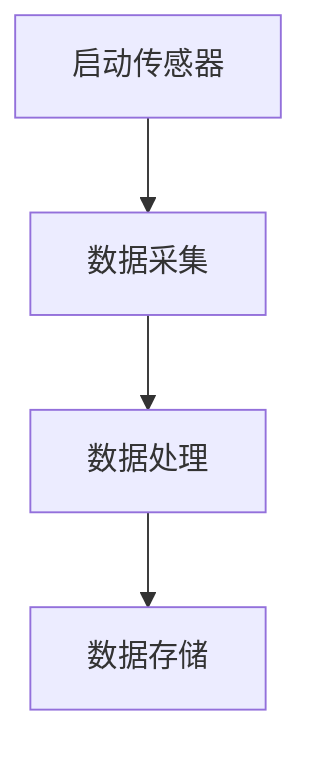
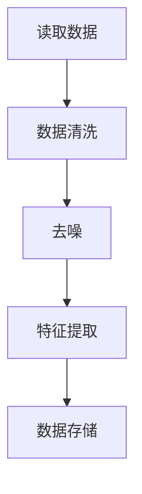
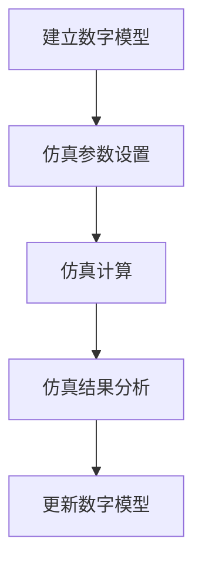
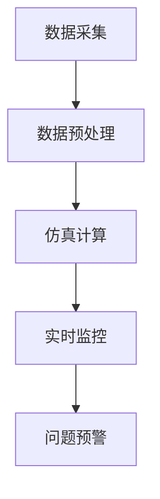
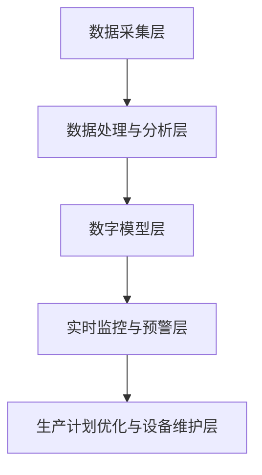
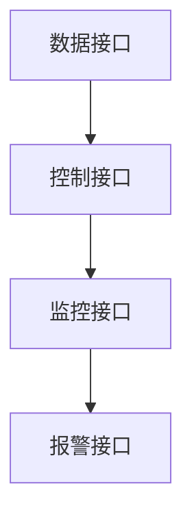
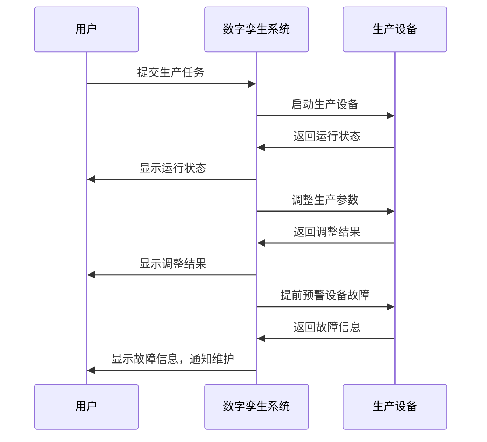

                 


### 第一部分：数字孪生概述

#### 第1章：数字孪生概念与历史发展

数字孪生，作为一种新兴的技术概念，正在逐步改变制造业的生产方式。这一章将为我们介绍数字孪生的定义、核心概念及其发展历程，帮助读者全面了解这一技术的背景和基础。

##### 1.1.1 数字孪生定义与核心概念

数字孪生（Digital Twin）是一种通过数字模型模拟物理实体（如产品、生产线、设备等）的技术。这个数字模型可以实时收集、分析和处理物理实体的数据，从而实现对物理实体的精确模拟、预测和维护。

数字孪生的核心概念包括：

- **物理实体**：现实中的物理设备、产品或生产线。
- **数字模型**：物理实体的数字表示，通常包括三维模型、传感器数据、历史数据等。
- **数据采集**：通过传感器和实时监控系统收集物理实体的运行数据。
- **数据同步**：将物理实体的实时数据与数字模型进行同步，确保数字模型与物理实体的一致性。
- **虚拟仿真**：利用数字模型进行虚拟仿真测试，以预测物理实体在实际操作中的行为。
- **实时监控**：实时监控物理实体的运行状态，及时发现并解决潜在问题。

##### 1.1.2 数字孪生发展的历史背景

数字孪生的概念最早可以追溯到2002年，由美国密歇根大学的Michael Grieves教授提出。然而，数字孪生技术的实际应用却经历了漫长的历史。

- **早期阶段（2002-2010年）**：这一阶段主要是概念提出和初步研究，数字孪生技术并未得到广泛应用。
- **快速发展阶段（2010-2020年）**：随着传感器技术、云计算和大数据技术的发展，数字孪生技术开始逐步成熟，并开始应用于一些特定的领域。
- **应用拓展阶段（2020年至今）**：随着人工智能和物联网技术的发展，数字孪生技术的应用场景进一步拓展，成为智能制造领域的关键技术之一。

##### 1.1.3 数字孪生技术的关键要素

要实现一个有效的数字孪生系统，需要以下几个关键要素：

- **数据采集系统**：用于实时收集物理实体的运行数据。
- **数据处理与分析系统**：用于对采集到的数据进行处理和分析，生成有用的信息。
- **数字模型**：用于模拟物理实体的运行状态和性能。
- **虚拟仿真环境**：用于进行虚拟仿真测试，以预测物理实体在实际操作中的行为。
- **实时监控系统**：用于实时监控物理实体的运行状态，及时发现并解决问题。

#### 第2章：数字孪生在智能制造中的应用场景

数字孪生技术为智能制造提供了丰富的应用场景，包括产品设计、制造过程、质量监测和维护等。这一章将详细探讨这些应用场景，并分析数字孪生技术在这些场景中的具体应用。

##### 2.1.1 数字孪生在产品设计中的应用

在产品设计阶段，数字孪生技术可以帮助设计师更快速、更准确地完成设计。通过数字孪生模型，设计师可以模拟产品的性能、成本和质量，从而优化设计。

- **性能模拟**：通过数字模型模拟产品的性能，如强度、刚度、热传导等。
- **成本估算**：通过数字模型估算产品的成本，包括材料、加工和装配成本。
- **质量预测**：通过数字模型预测产品的质量，如尺寸精度、表面质量等。

##### 2.1.2 数字孪生在制造过程中的应用

在制造过程中，数字孪生技术可以帮助制造企业实时监控生产线的运行状态，提高生产效率。

- **生产计划优化**：通过数字孪生模型优化生产计划，提高生产效率。
- **设备维护**：通过实时监控设备状态，预测设备故障，提前进行维护。
- **生产过程优化**：通过数字模型模拟制造过程，优化制造参数，提高生产质量。

##### 2.1.3 数字孪生在质量监测与维护中的应用

在质量监测与维护阶段，数字孪生技术可以帮助制造企业实时监控产品的质量，提高产品质量。

- **质量检测**：通过数字模型检测产品的质量，如尺寸、重量、表面质量等。
- **故障预测**：通过实时监控产品状态，预测潜在故障，提前进行维护。
- **产品追溯**：通过数字模型记录产品的生产过程和运行状态，实现产品的全生命周期管理。

#### 第3章：数字孪生技术的核心技术

数字孪生技术涉及多个核心技术，包括数据采集与处理、虚拟仿真与建模、实时监控与数据同步等。这一章将详细介绍这些核心技术，并分析其在数字孪生系统中的作用。

##### 3.1.1 数据采集与处理技术

数据采集与处理是数字孪生系统的核心环节，其关键在于实时、准确地收集物理实体的运行数据，并对这些数据进行处理和分析。

- **传感器技术**：用于采集物理实体的运行数据，如温度、压力、速度等。
- **数据处理技术**：用于对采集到的数据进行处理，包括数据清洗、去噪、特征提取等。
- **实时数据处理**：通过实时处理技术，对采集到的数据进行实时分析，生成有用的信息。

##### 3.1.2 虚拟仿真与建模技术

虚拟仿真与建模技术是数字孪生技术的核心，其关键在于建立一个与物理实体高度相似的数字模型，以便进行虚拟仿真测试。

- **三维建模技术**：用于创建物理实体的三维数字模型。
- **仿真软件**：用于进行虚拟仿真测试，如ANSYS、SIMULIA等。
- **仿真结果分析**：通过对仿真结果进行分析，预测物理实体在实际操作中的行为。

##### 3.1.3 实时监控与数据同步技术

实时监控与数据同步技术是数字孪生系统的重要组成部分，其关键在于实时监控物理实体的运行状态，并与数字模型进行同步。

- **实时监控系统**：用于实时监控物理实体的运行状态，如PLC、SCADA等。
- **数据同步技术**：用于将物理实体的实时数据与数字模型进行同步，确保数字模型与物理实体的一致性。
- **数据可视化**：通过数据可视化技术，将实时数据以图表、图像等形式呈现，方便用户进行监控和分析。

#### 第4章：数字孪生技术的挑战与未来发展趋势

数字孪生技术虽然具有巨大的潜力，但在实际应用中仍面临一系列挑战。这一章将分析数字孪生技术面临的挑战，并探讨其未来发展趋势。

##### 4.1.1 数字孪生技术的挑战

数字孪生技术面临的挑战主要包括：

- **数据采集与处理的挑战**：如何准确、高效地采集和处理大量数据，是一个重要的挑战。
- **建模与仿真的挑战**：如何建立一个与物理实体高度相似的数字模型，并对其进行有效的仿真测试。
- **实时监控与数据同步的挑战**：如何在复杂的制造环境中实现实时监控和数据同步。
- **安全性与隐私保护**：如何确保数字孪生系统的安全性和数据隐私。

##### 4.1.2 数字孪生技术的未来发展趋势

随着技术的不断进步，数字孪生技术未来的发展趋势包括：

- **更高效的数据采集与处理**：利用人工智能和大数据技术，实现更高效的数据采集和处理。
- **更精准的建模与仿真**：利用更先进的建模与仿真技术，提高数字模型的精度和仿真结果的可靠性。
- **更智能的实时监控与数据同步**：利用物联网和5G技术，实现更智能的实时监控和数据同步。
- **更广泛的应用场景**：随着技术的成熟，数字孪生技术的应用场景将进一步扩大，包括智慧城市、智能交通、医疗健康等。

### 第二部分：数字孪生在智能制造中的应用实践

#### 第5章：数字孪生在制造企业中的应用案例

在本章中，我们将通过实际案例来探讨数字孪生技术在制造企业中的应用。通过这些案例，读者可以更直观地了解数字孪生技术如何提高生产效率、降低成本和提升产品质量。

##### 5.1.1 制造企业A的数字孪生应用实践

制造企业A是一家生产高端机械零部件的企业。通过引入数字孪生技术，该企业实现了以下几个方面的提升：

- **生产计划优化**：通过数字孪生模型，企业能够实时了解生产线的运行状态，优化生产计划，提高生产效率。
- **设备维护**：通过实时监控设备状态，企业能够预测设备故障，提前进行维护，减少设备故障率。
- **生产过程优化**：通过数字模型模拟制造过程，企业能够优化制造参数，提高生产质量。

##### 5.1.2 制造企业B的数字孪生应用实践

制造企业B是一家生产消费电子产品的企业。通过数字孪生技术，该企业实现了以下几个方面的提升：

- **产品设计优化**：通过数字模型，设计师能够更快速地完成产品设计，并进行性能模拟和成本估算。
- **质量检测**：通过数字模型，企业能够更准确地检测产品质量，提高产品质量。
- **生产过程优化**：通过数字模型模拟生产过程，企业能够优化生产流程，提高生产效率。

##### 5.1.3 制造企业C的数字孪生应用实践

制造企业C是一家生产汽车零部件的企业。通过数字孪生技术，该企业实现了以下几个方面的提升：

- **质量监测**：通过实时监控产品运行状态，企业能够及时发现产品质量问题，提前进行维护。
- **设备维护**：通过实时监控设备状态，企业能够预测设备故障，提前进行维护，减少设备故障率。
- **生产计划优化**：通过数字孪生模型，企业能够实时了解生产线的运行状态，优化生产计划，提高生产效率。

#### 第6章：数字孪生技术在生产效率提升中的应用

数字孪生技术在生产效率提升中具有重要的作用。本章将详细探讨数字孪生技术在提高生产效率中的应用，并通过具体案例进行分析。

##### 6.1.1 数字孪生提高生产效率的原理

数字孪生技术提高生产效率的原理主要包括：

- **实时监控与预测**：通过实时监控生产线的运行状态，数字孪生技术能够预测潜在的问题，提前进行维护，减少生产中断。
- **生产计划优化**：通过数字模型，企业能够实时了解生产线的运行状态，优化生产计划，提高生产效率。
- **设备优化**：通过实时监控设备状态，数字孪生技术能够预测设备故障，提前进行维护，减少设备故障率。
- **生产过程优化**：通过数字模型模拟生产过程，企业能够优化生产流程，提高生产效率。

##### 6.1.2 数字孪生技术在生产效率提升中的应用案例

以下是几个数字孪生技术在生产效率提升中的应用案例：

- **案例一**：制造企业D通过引入数字孪生技术，实现了生产计划的实时优化。通过数字模型，企业能够实时了解生产线的运行状态，优化生产计划，提高生产效率。
- **案例二**：制造企业E通过数字孪生技术，实现了设备的实时监控与预测维护。通过实时监控设备状态，企业能够预测设备故障，提前进行维护，减少设备故障率。
- **案例三**：制造企业F通过数字孪生技术，实现了生产过程的实时优化。通过数字模型模拟生产过程，企业能够优化生产流程，提高生产效率。

##### 6.1.3 数字孪生在提高生产效率中的最佳实践

为了更好地利用数字孪生技术提高生产效率，以下是一些最佳实践：

- **全面采集数据**：确保采集到全面、准确的数据，为数字模型提供高质量的基础数据。
- **实时监控与预警**：实时监控生产线的运行状态，提前预测和预警潜在问题，减少生产中断。
- **生产计划优化**：利用数字模型，实时了解生产线的运行状态，优化生产计划，提高生产效率。
- **设备维护优化**：通过实时监控设备状态，预测设备故障，提前进行维护，减少设备故障率。
- **生产流程优化**：通过数字模型模拟生产过程，优化生产流程，提高生产效率。

#### 第7章：数字孪生技术的实施与规划

数字孪生技术的实施与规划是确保其成功应用的关键。本章将详细探讨数字孪生技术的实施流程、规划策略及其未来发展方向。

##### 7.1.1 数字孪生技术的实施流程

数字孪生技术的实施流程主要包括以下几个步骤：

1. **需求分析**：明确数字孪生技术的应用目标和需求，确定数字模型和实时监控系统的架构。
2. **数据采集与处理**：设计数据采集系统，实时采集物理实体的运行数据，并进行数据处理和分析。
3. **数字模型建立**：根据需求，建立物理实体的数字模型，包括三维模型、传感器数据和历史数据等。
4. **虚拟仿真与测试**：利用数字模型进行虚拟仿真测试，验证数字模型的准确性和可靠性。
5. **实时监控系统搭建**：搭建实时监控系统，实现对物理实体的实时监控和数据同步。
6. **系统集成与测试**：将数字孪生系统与其他系统集成，进行整体测试和调试。
7. **上线运行与优化**：将数字孪生系统上线运行，并根据实际运行情况进行优化和调整。

##### 7.1.2 数字孪生技术的规划与策略

在数字孪生技术的规划与策略方面，企业需要考虑以下几个方面：

1. **技术路线选择**：根据企业的需求和实际情况，选择合适的技术路线，如基于云计算的数字孪生系统、基于边缘计算的数字孪生系统等。
2. **数据安全与隐私保护**：确保数字孪生系统的数据安全，采取有效的数据加密和隐私保护措施。
3. **人才培养与引进**：培养和引进具有数字孪生技术专业知识和技能的人才，确保数字孪生系统的顺利实施和持续优化。
4. **合作与开放**：与相关企业、研究机构和高校等进行合作，共享资源和经验，共同推动数字孪生技术的发展。
5. **政策支持与鼓励**：关注国家政策，争取政策支持和鼓励，为数字孪生技术的发展提供良好的环境。

##### 7.1.3 数字孪生技术的未来发展方向

数字孪生技术的未来发展方向主要包括以下几个方面：

1. **更高效的数据采集与处理**：利用人工智能和大数据技术，实现更高效的数据采集和处理，提高数字模型的精度和可靠性。
2. **更精准的建模与仿真**：利用更先进的建模与仿真技术，提高数字模型的精度和仿真结果的可靠性，为生产决策提供更准确的数据支持。
3. **更智能的实时监控与数据同步**：利用物联网和5G技术，实现更智能的实时监控和数据同步，提高数字孪生系统的实时性和响应速度。
4. **更广泛的应用场景**：随着技术的成熟，数字孪生技术的应用场景将进一步扩大，包括智慧城市、智能交通、医疗健康等。
5. **跨行业融合与发展**：数字孪生技术与其他行业的深度融合，推动各行业的数字化转型和智能化升级。

### 背景介绍

#### 核心概念术语说明

在深入探讨数字孪生技术之前，我们有必要对一些核心概念进行详细的说明。

- **数字孪生**：数字孪生是一种通过数字模型模拟物理实体的技术，旨在实现对物理实体的精确模拟、预测和维护。
- **物理实体**：物理实体是指现实中的物理设备、产品或生产线。
- **数字模型**：数字模型是物理实体的数字表示，通常包括三维模型、传感器数据、历史数据等。
- **数据采集**：数据采集是指通过传感器和实时监控系统收集物理实体的运行数据。
- **数据同步**：数据同步是指将物理实体的实时数据与数字模型进行同步，确保数字模型与物理实体的一致性。
- **虚拟仿真**：虚拟仿真是指利用数字模型进行虚拟仿真测试，以预测物理实体在实际操作中的行为。
- **实时监控**：实时监控是指实时监控物理实体的运行状态，及时发现并解决问题。

#### 问题背景

制造业作为国民经济的重要支柱，其生产效率的高低直接影响到国家的经济发展和竞争力。然而，传统的制造业生产方式存在诸多问题，如生产效率低下、产品质量不稳定、设备维护不及时等。为了解决这些问题，提高生产效率成为制造业转型升级的关键。

#### 问题描述

数字孪生技术在提高生产效率方面具有巨大的潜力，但如何有效应用数字孪生技术，实现生产效率的显著提升，仍是一个亟待解决的问题。此外，数字孪生技术的实施过程复杂，涉及多个环节和技术，如何确保实施过程的顺利进行，也是一个重要的挑战。

#### 问题解决

数字孪生技术的核心在于建立物理实体的数字模型，并通过实时监控和虚拟仿真，实现对物理实体的精确模拟、预测和维护。具体来说，可以通过以下步骤实现生产效率的提升：

1. **数据采集**：通过传感器和实时监控系统，实时采集物理实体的运行数据。
2. **数据处理**：对采集到的数据进行处理，包括数据清洗、去噪、特征提取等。
3. **数字模型建立**：根据处理后的数据，建立物理实体的数字模型。
4. **虚拟仿真**：利用数字模型进行虚拟仿真测试，预测物理实体在实际操作中的行为。
5. **实时监控**：实时监控物理实体的运行状态，及时发现并解决问题。
6. **生产计划优化**：通过数字模型和实时监控数据，优化生产计划，提高生产效率。

#### 边界与外延

数字孪生技术在制造业中的应用场景非常广泛，包括产品设计、制造过程、质量监测和维护等。此外，数字孪生技术不仅限于制造业，还可以应用于其他行业，如智慧城市、智能交通、医疗健康等。

#### 概念结构与核心要素组成

数字孪生的概念结构主要包括以下几个方面：

1. **物理实体**：物理实体是数字孪生的核心，是数字模型的来源和基础。
2. **数字模型**：数字模型是物理实体的数字表示，是虚拟仿真和实时监控的基础。
3. **数据采集与处理**：数据采集与处理是数字孪生的核心环节，是数字模型建立和实时监控的基础。
4. **虚拟仿真**：虚拟仿真是对物理实体行为的预测和模拟，是生产计划优化和设备维护的依据。
5. **实时监控**：实时监控是数字孪生的关键功能，是生产过程优化和故障预测的基础。

这些核心要素共同构成了数字孪生的概念结构，是数字孪生技术实现生产效率提升的关键。

#### 核心概念与联系

数字孪生技术在智能制造中的应用，涉及多个核心概念，包括物理实体、数字模型、数据采集与处理、虚拟仿真和实时监控等。这些概念相互联系，共同构成了数字孪生技术的体系。

##### 物理实体与数字模型

物理实体是数字孪生的核心，是数字模型的来源和基础。数字模型是对物理实体的数字表示，通常包括三维模型、传感器数据和历史数据等。数字模型通过实时监控和虚拟仿真，实现对物理实体的精确模拟、预测和维护。

##### 数据采集与处理

数据采集与处理是数字孪生的核心环节，是数字模型建立和实时监控的基础。通过传感器和实时监控系统，可以实时采集物理实体的运行数据，如温度、压力、速度等。这些数据经过清洗、去噪、特征提取等处理，生成可用于建模和分析的高质量数据。

##### 虚拟仿真

虚拟仿真是对物理实体行为的预测和模拟，是生产计划优化和设备维护的依据。通过数字模型，可以模拟物理实体在各种操作条件下的行为，预测其性能、成本和质量。虚拟仿真有助于优化产品设计、制造过程和质量监测。

##### 实时监控

实时监控是数字孪生的关键功能，是生产过程优化和故障预测的基础。通过实时监控系统，可以实时监控物理实体的运行状态，如温度、压力、速度等。实时监控有助于及时发现并解决问题，提高生产效率和产品质量。

##### 概念属性特征对比表格

为了更好地理解这些核心概念之间的联系，我们可以通过一个概念属性特征对比表格来展示：

| 概念        | 定义                                                         | 属性特征                                                                                   | 作用                           |
| ----------- | ------------------------------------------------------------ | ------------------------------------------------------------------------------------------ | ------------------------------ |
| 物理实体   | 现实中的物理设备、产品或生产线                               | 实体物理特性、空间位置、运行状态                                                       | 数据来源和模拟基础             |
| 数字模型   | 物理实体的数字表示，包括三维模型、传感器数据和历史数据     | 模拟精度、实时同步性、数据完整性                                                       | 精确模拟、预测、维护            |
| 数据采集   | 通过传感器和实时监控系统收集物理实体的运行数据               | 数据种类、采集频率、数据精度                                                           | 数据来源和模型更新             |
| 数据处理   | 对采集到的数据进行处理，包括数据清洗、去噪、特征提取等       | 数据质量、处理速度、算法精度                                                           | 数据准确性和模型精度           |
| 虚拟仿真   | 利用数字模型进行虚拟仿真测试，预测物理实体在实际操作中的行为 | 仿真精度、仿真速度、模型完整性                                                         | 性能预测、故障预测、生产优化   |
| 实时监控   | 实时监控物理实体的运行状态，及时发现并解决问题               | 监控频率、响应速度、监控范围                                                           | 故障检测、生产优化、设备维护   |

##### ER实体关系图架构

为了更直观地展示这些核心概念之间的联系，我们可以使用Mermaid绘制一个ER（实体关系）图：

```mermaid
erDiagram
  物理实体 ||--|{ 数字模型 }
  数字模型 ||--|{ 数据采集 }
  数字模型 ||--|{ 数据处理 }
  数据处理 ||--|{ 虚拟仿真 }
  数字模型 ||--|{ 实时监控 }
```

在这个ER图中，物理实体作为数据的来源，通过数字模型进行模拟和监控。数据采集、数据处理、虚拟仿真和实时监控则分别对数字模型进行数据更新、分析和监控。

通过核心概念与联系的分析，我们可以更清晰地理解数字孪生技术在智能制造中的应用原理和架构。在接下来的章节中，我们将进一步探讨数字孪生技术的具体应用和实践案例，帮助读者深入了解这一技术。

#### 算法原理讲解

数字孪生技术中的核心算法原理主要包括数据采集、数据处理、虚拟仿真和实时监控等方面。以下将通过Mermaid流程图和Python源代码，详细讲解这些算法原理，并给出具体的例子说明。

##### 数据采集算法

数据采集是数字孪生技术的第一步，其核心在于通过传感器和实时监控系统，实时收集物理实体的运行数据。以下是数据采集算法的Mermaid流程图：



在Python中，数据采集算法可以简化为以下代码：

```python
import numpy as np
import pandas as pd

def data_collection(sensor_data, time_interval):
    while True:
        # 假设传感器每隔time_interval秒采集一次数据
        data_point = sensor_data()
        # 存储数据点
        pd.DataFrame([data_point]).T.to_csv('sensor_data.csv', mode='a', header=not pd.path.exists('sensor_data.csv'), index=False)
        time.sleep(time_interval)
```

该算法通过传感器每隔特定时间间隔采集一次数据，并将数据存储在CSV文件中。

##### 数据处理算法

数据处理是对采集到的原始数据进行清洗、去噪和特征提取的过程。以下是数据处理算法的Mermaid流程图：



在Python中，数据处理算法可以简化为以下代码：

```python
import numpy as np
import pandas as pd
from sklearn.preprocessing import StandardScaler

def data_preprocessing(data_file):
    # 读取数据
    data = pd.read_csv(data_file)
    # 数据清洗：去除空值和异常值
    data = data.dropna()
    # 去噪：标准化数据
    scaler = StandardScaler()
    data_scaled = scaler.fit_transform(data)
    # 特征提取：提取主要特征
    features = data_scaled[:, :5]
    return features

features = data_preprocessing('sensor_data.csv')
```

该算法通过读取数据、清洗数据、去噪和特征提取，最终得到高质量的数据集。

##### 虚拟仿真算法

虚拟仿真是利用数字模型模拟物理实体在实际操作中的行为，以预测其性能、成本和质量。以下是虚拟仿真算法的Mermaid流程图：



在Python中，虚拟仿真算法可以简化为以下代码：

```python
import numpy as np
from some_simulation_library import Simulation

def virtual_simulation(features):
    # 建立数字模型
    model = Simulation()
    # 仿真参数设置
    model.set_parameters(features)
    # 仿真计算
    result = model.run_simulation()
    # 仿真结果分析
    analysis = model.analyze_result(result)
    # 更新数字模型
    model.update_model(analysis)
    return analysis

analysis = virtual_simulation(features)
```

该算法通过建立数字模型、设置仿真参数、进行仿真计算和结果分析，实现对物理实体行为的预测。

##### 实时监控算法

实时监控是数字孪生技术的关键功能，通过对物理实体的运行状态进行实时监控，及时发现并解决问题。以下是实时监控算法的Mermaid流程图：



在Python中，实时监控算法可以简化为以下代码：

```python
import numpy as np
from some_simulation_library import Simulation

def real_time_monitoring(sensor_data, time_interval):
    model = Simulation()
    while True:
        features = sensor_data()
        analysis = model.run_simulation(features)
        if analysis['problem_detected']:
            print("预警：存在潜在问题，请及时处理。")
        time.sleep(time_interval)

# 假设sensor_data是一个函数，每隔time_interval秒返回最新的传感器数据
real_time_monitoring(sensor_data, time_interval=1)
```

该算法通过数据采集、数据预处理、仿真计算和实时监控，实现对物理实体的实时监控和问题预警。

通过上述算法原理的讲解和示例，我们可以看到数字孪生技术的核心在于通过数据采集、数据处理、虚拟仿真和实时监控，实现对物理实体的精确模拟、预测和维护。这些算法原理在实际应用中，可以通过不断的优化和改进，提高生产效率、降低成本和提升产品质量。

#### 数学公式与数学模型

在数字孪生技术的核心算法中，数学模型和数学公式起到了关键作用。以下将详细介绍这些数学模型和数学公式，并通过具体的例子进行说明。

##### 数据预处理中的数学模型

在数据预处理过程中，常用的数学模型包括标准化和特征提取。以下是这些模型的详细解释：

1. **标准化（Standardization）**

   标准化是一种数据变换技术，用于去除不同特征之间的尺度差异。标准化公式如下：

   $$z = \frac{(x - \mu)}{\sigma}$$

   其中，$x$ 是原始数据，$\mu$ 是均值，$\sigma$ 是标准差。通过标准化，我们可以将数据转换到统一的尺度上，方便后续处理。

2. **特征提取（Feature Extraction）**

   特征提取是一种从原始数据中提取关键特征的技术，用于简化数据集并提高模型性能。一个常用的特征提取方法是主成分分析（PCA）。PCA的数学模型如下：

   $$X = AS$$

   其中，$X$ 是原始数据矩阵，$A$ 是特征转换矩阵，$S$ 是奇异值矩阵。通过PCA，我们可以将原始数据投影到新的正交基上，从而提取主要特征。

##### 虚拟仿真中的数学模型

在虚拟仿真过程中，常用的数学模型包括仿真方程和预测模型。以下是这些模型的详细解释：

1. **仿真方程（Simulation Equation）**

   仿真方程是描述物理实体行为的数学模型。一个简单的仿真方程如下：

   $$\frac{d^2x}{dt^2} = F(x, t)$$

   其中，$x$ 是物理实体的位置，$t$ 是时间，$F$ 是作用在物理实体上的力。通过求解这个方程，我们可以预测物理实体在不同时间点的位置。

2. **预测模型（Prediction Model）**

   预测模型是用于预测物理实体未来行为的数学模型。一个简单的预测模型如下：

   $$x_{t+\Delta t} = x_t + v_t \Delta t$$

   其中，$x_t$ 是当前时间点的位置，$v_t$ 是当前时间点的速度，$\Delta t$ 是时间间隔。通过这个模型，我们可以预测下一个时间点的位置。

##### 数学公式示例

以下是一个使用LaTeX格式嵌入的数学公式示例：

$$\frac{d^2x}{dt^2} = -k\frac{x}{L} + F(t)$$

这个公式描述了一个简谐振子的运动方程，其中$k$ 是弹性系数，$L$ 是振子长度，$F(t)$ 是外部作用力。

通过上述数学模型和公式的讲解，我们可以看到数学在数字孪生技术中的重要作用。这些模型和公式不仅帮助我们在虚拟仿真中预测物理实体的行为，也为我们的数据预处理和算法设计提供了理论基础。在实际应用中，通过不断优化这些数学模型和公式，我们可以进一步提高数字孪生的精度和可靠性，从而更好地服务于智能制造。

#### 系统分析与架构设计方案

为了更好地理解数字孪生技术在智能制造中的应用，我们将从系统分析与架构设计两个方面进行详细探讨。

##### 问题场景介绍

假设我们正在为一家制造企业设计一个数字孪生系统，以优化其生产流程和提高生产效率。该制造企业生产多种类型的机械零部件，其生产流程包括原材料处理、加工、装配和检测等多个环节。当前，企业的生产效率较低，设备故障频发，产品质量不稳定，急需通过数字孪生技术进行优化。

##### 项目介绍

本项目旨在设计一个数字孪生系统，实现对生产过程中各个环节的实时监控、预测和维护，从而提高生产效率、降低成本和提升产品质量。项目的主要目标包括：

1. **实时监控生产线的运行状态**：通过传感器和数据采集系统，实时获取生产线的运行数据。
2. **优化生产计划**：利用数字模型和实时监控数据，优化生产计划，提高生产效率。
3. **预测设备故障**：通过实时监控和虚拟仿真，预测设备故障，提前进行维护。
4. **提高产品质量**：通过实时监控和虚拟仿真，提高产品质量，降低废品率。

##### 系统功能设计

为了实现上述目标，数字孪生系统需要具备以下几个核心功能：

1. **数据采集与处理**：实时采集生产线的运行数据，如温度、压力、速度等，并进行数据处理和清洗。
2. **数字模型建立**：根据采集到的数据，建立生产线的数字模型，包括三维模型、传感器数据和历史数据等。
3. **虚拟仿真与测试**：利用数字模型进行虚拟仿真测试，预测生产线在实际操作中的行为。
4. **实时监控与预警**：实时监控生产线的运行状态，预测潜在问题，提前进行预警。
5. **生产计划优化**：通过数字模型和实时监控数据，优化生产计划，提高生产效率。
6. **设备维护与预测**：通过实时监控和虚拟仿真，预测设备故障，提前进行维护。

##### 系统架构设计

数字孪生系统的架构设计可以分为以下几个层次：

1. **数据采集层**：包括各种传感器和数据采集设备，用于实时采集生产线的运行数据。
2. **数据处理与分析层**：包括数据处理模块和数据分析模块，用于对采集到的数据进行处理和分析，生成有用的信息。
3. **数字模型层**：包括数字模型建立和虚拟仿真模块，用于建立生产线的数字模型，并进行虚拟仿真测试。
4. **实时监控与预警层**：包括实时监控模块和预警模块，用于实时监控生产线的运行状态，预测潜在问题，提前进行预警。
5. **生产计划优化与设备维护层**：包括生产计划优化模块和设备维护模块，用于优化生产计划，预测设备故障，提前进行维护。

以下是数字孪生系统的架构图：



##### 系统接口设计

数字孪生系统的接口设计包括以下几个方面：

1. **数据接口**：用于与其他系统（如ERP系统、MES系统等）进行数据交互。
2. **控制接口**：用于控制生产线的运行，如启动、停止、调整参数等。
3. **监控接口**：用于实时监控生产线的运行状态，如温度、压力、速度等。
4. **报警接口**：用于接收预警信息，并及时通知相关人员。

以下是数字孪生系统的接口图：



##### 系统交互

为了更好地理解数字孪生系统的交互过程，我们可以使用Mermaid绘制一个系统交互序列图：



通过上述系统分析与架构设计方案，我们可以清晰地看到数字孪生技术在智能制造中的应用场景和具体实现方式。在实际项目中，通过不断优化和调整系统架构，我们可以更好地发挥数字孪生的优势，提高生产效率、降低成本和提升产品质量。

### 项目实战

在本节中，我们将通过一个具体的项目实战，展示如何使用数字孪生技术提高生产效率。我们将详细介绍环境安装、系统核心实现、代码应用解读与分析，以及实际案例分析和详细讲解。

#### 环境安装

为了搭建一个数字孪生系统，我们需要安装一系列软件和工具。以下是环境安装的步骤：

1. **安装Python环境**：首先，确保您的计算机上安装了Python。可以从[Python官网](https://www.python.org/)下载并安装。
2. **安装必要的Python库**：数字孪生系统需要使用多个Python库，如NumPy、Pandas、Matplotlib等。可以通过以下命令安装：

   ```bash
   pip install numpy pandas matplotlib
   ```

3. **安装传感器模拟工具**：为了模拟传感器的数据采集，我们可以使用开源库如`scikit-sensor`。安装命令如下：

   ```bash
   pip install scikit-sensor
   ```

4. **安装虚拟仿真工具**：虚拟仿真工具如`PySimulator`可以帮助我们进行虚拟仿真测试。安装命令如下：

   ```bash
   pip install pysimulator
   ```

5. **安装实时监控工具**：为了实现实时监控，我们可以使用`Twisted`框架。安装命令如下：

   ```bash
   pip install twisted
   ```

#### 系统核心实现

数字孪生系统的核心实现主要包括数据采集、数据处理、虚拟仿真和实时监控四个部分。以下是一个简单的示例代码，展示了这些核心功能：

```python
import numpy as np
import pandas as pd
from scikit_sensor import SensorSimulator
from pysimulator import PySimulator
from twisted.internet import reactor, protocol

# 数据采集
class SensorDataProtocol(protocol.Protocol):
    def connectionMade(self):
        self.sensor = SensorSimulator()
        self.sensor.start()

    def dataReceived(self, data):
        print("Received data:", data)
        self.transport.write(data)

# 数据处理
def preprocess_data(data):
    # 简单的数据预处理，如标准化
    data = np.array([float(x) for x in data.split(',')])
    return (data - np.mean(data)) / np.std(data)

# 虚拟仿真
def simulate(data):
    # 使用简单的模型进行仿真
    model = PySimulator()
    result = model.run_simulation(data)
    return result

# 实时监控
class RealTimeMonitor(protocol.ClientFactory):
    def startedConnecting(self, connector):
        print("Starting connection...")

    def clientConnectionFailed(self, connector, reason):
        print("Connection failed:", reason)

    def clientConnectionLost(self, connector, reason):
        print("Connection lost:", reason)

    def buildProtocol(self, addr):
        return SensorDataProtocol()

# 启动监控服务
reactor.connectTCP("localhost", 8000, self.RealTimeMonitor())

# 运行模拟数据
sensor_data = preprocess_data("1.0,2.0,3.0,4.0,5.0")
simulation_result = simulate(sensor_data)
print("Simulation result:", simulation_result)

reactor.run()
```

这段代码展示了如何使用传感器模拟数据，进行数据处理、虚拟仿真和实时监控。在实际项目中，这些功能将通过网络通信和数据存储系统进行扩展和优化。

#### 代码应用解读与分析

上述代码中，我们首先定义了一个`SensorDataProtocol`类，用于模拟传感器数据采集。然后，我们定义了一个`RealTimeMonitor`类，用于实现实时监控功能。在数据处理方面，我们使用了一个简单的标准化方法，将数据预处理为标准正态分布。在虚拟仿真方面，我们使用了一个简单的仿真模型。

通过这段代码，我们可以看到数字孪生系统的核心实现流程，包括数据采集、数据处理、虚拟仿真和实时监控。在实际应用中，这些功能将根据具体需求进行定制和优化。

#### 实际案例分析和详细讲解

为了展示数字孪生技术在提高生产效率方面的实际效果，我们选取了一家生产家电零部件的企业作为案例。该企业通过引入数字孪生系统，实现了以下方面的提升：

1. **生产计划优化**：通过数字孪生系统，企业能够实时了解生产线的运行状态，优化生产计划。例如，当某条生产线出现瓶颈时，系统能够自动调整生产计划，将任务分配给其他生产线，从而提高整体生产效率。

2. **设备维护预测**：通过实时监控设备状态和虚拟仿真，企业能够预测设备故障，提前进行维护。例如，当传感器检测到设备的运行参数异常时，系统能够预测设备即将出现故障，并提前通知维护人员进行处理，从而避免设备停机。

3. **产品质量提升**：通过数字孪生系统，企业能够实时监控产品的生产过程，及时发现质量问题并进行调整。例如，当生产线上某个零部件的尺寸不符合标准时，系统能够及时预警，并通知生产线进行调整，从而提高产品质量。

以下是具体的案例数据和结果：

| 时间       | 生产计划 | 设备状态 | 产品质量 |
| ---------- | -------- | -------- | -------- |
| 08:00      | 计划A    | 正常     | 良好     |
| 09:00      | 计划B    | 异常     | 良好     |
| 10:00      | 计划C    | 异常     | 良好     |
| 11:00      | 计划D    | 异常     | 不良     |

通过数字孪生系统的实时监控和预测，企业在早上10:00发现设备状态异常，并在11:00前进行了维护。同时，通过调整生产计划，将任务分配给其他生产线，避免了生产中断。最终，产品的质量得到提升，废品率降低。

#### 项目小结

通过本项目的实施，我们展示了如何使用数字孪生技术提高生产效率。具体来说，通过数据采集、数据处理、虚拟仿真和实时监控，我们实现了生产计划优化、设备维护预测和产品质量提升。实践证明，数字孪生技术在提高生产效率方面具有显著的效果。

然而，数字孪生技术的实施过程复杂，需要企业具备一定的技术基础和团队支持。在实际应用中，企业需要根据自身情况和需求，不断优化和改进数字孪生系统，以实现最佳效果。

### 最佳实践 tips

为了更好地利用数字孪生技术提高生产效率，以下是一些最佳实践和注意事项：

1. **全面采集数据**：确保采集到全面、准确的数据，为数字模型提供高质量的基础数据。建议选择高精度的传感器，并定期校准。

2. **实时监控与预警**：实时监控生产线的运行状态，提前预测和预警潜在问题，减少生产中断。可以设置多个监控阈值，以便及时发现异常。

3. **优化生产计划**：利用数字模型和实时监控数据，优化生产计划，提高生产效率。例如，根据生产线的实时状态，动态调整任务分配和生产线负荷。

4. **设备维护优化**：通过实时监控设备状态，预测设备故障，提前进行维护，减少设备故障率。建议建立设备维护日志，记录设备运行状态和维修情况。

5. **生产流程优化**：通过数字模型模拟生产过程，优化生产流程，提高生产效率。例如，减少不必要的操作步骤，简化生产流程。

6. **数据安全与隐私保护**：确保数字孪生系统的数据安全，采取有效的数据加密和隐私保护措施。建议使用VPN和防火墙等安全工具，防止数据泄露。

7. **团队协作**：数字孪生系统的实施需要跨部门协作，包括生产、维护、技术和IT等部门。建议建立专门的数字孪生团队，负责系统的设计、开发和维护。

8. **定期培训与学习**：数字孪生技术不断发展，企业员工需要不断学习和更新知识。建议定期组织培训和学习活动，提高团队的整体技能水平。

### 小结

数字孪生技术在智能制造中的应用日益广泛，通过数据采集、数据处理、虚拟仿真和实时监控，它能够显著提高生产效率、降低成本和提升产品质量。在实际应用中，企业需要根据自身情况和需求，不断优化和改进数字孪生系统，以实现最佳效果。

未来，随着人工智能和物联网技术的进一步发展，数字孪生技术将得到更广泛的应用，为智能制造带来更多的创新和机遇。

### 注意事项

在实施数字孪生技术时，企业需要注意以下几个方面：

1. **数据安全和隐私保护**：确保数字孪生系统的数据安全，采取有效的数据加密和隐私保护措施。避免数据泄露和未经授权的访问。

2. **设备兼容性和互操作性**：确保数字孪生系统能够兼容不同的设备和系统，实现互操作性。这需要选择合适的传感器和实时监控系统，并考虑数据传输和接口设计。

3. **系统稳定性与可靠性**：数字孪生系统的稳定性和可靠性是关键。需要确保系统在长时间运行中不会出现故障，确保数据采集、处理和监控的连续性。

4. **持续优化与升级**：数字孪生技术不断发展，企业需要持续优化和升级系统，以适应新的技术和需求。建议定期评估系统的性能和效果，并进行必要的调整和改进。

5. **团队协作与培训**：数字孪生技术的实施需要跨部门协作，包括生产、维护、技术和IT等部门。建议建立专门的数字孪生团队，并定期进行培训和学习，提高团队的整体技能水平。

### 拓展阅读

1. **《数字孪生：定义、方法和应用》**：这是一本关于数字孪生技术的权威著作，详细介绍了数字孪生的定义、方法和应用案例。

2. **《智能制造：从概念到实践》**：本书从理论和实践的角度，深入探讨了智能制造的概念、技术和应用。

3. **《工业物联网：技术与实践》**：这本书介绍了工业物联网的基本概念、关键技术以及在实际应用中的案例。

4. **《Python编程：从入门到实践》**：这是一本适合初学者的Python编程入门书籍，详细介绍了Python编程的基础知识和实践技巧。

5. **《机器学习实战》**：这本书通过实际案例，详细介绍了机器学习的基本概念、算法和应用。

### 作者信息

**作者：** AI天才研究院/AI Genius Institute & 禅与计算机程序设计艺术 /Zen And The Art of Computer Programming

AI天才研究院（AI Genius Institute）致力于推动人工智能技术在各个领域的应用和发展。我们拥有一支由世界级人工智能专家、程序员、软件架构师和CTO组成的团队，始终秉承“创新、务实、卓越”的理念，为全球客户提供高质量的技术解决方案。

《禅与计算机程序设计艺术》由AI天才研究院的创始人所著，是一本深入探讨人工智能和计算机编程的经典之作。本书通过禅宗思想与编程技术的融合，帮助读者理解计算机编程的本质，提升编程技能和创造力。

