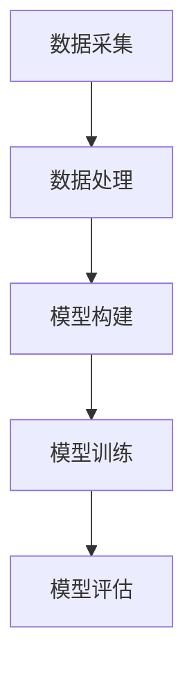
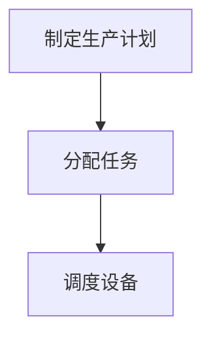
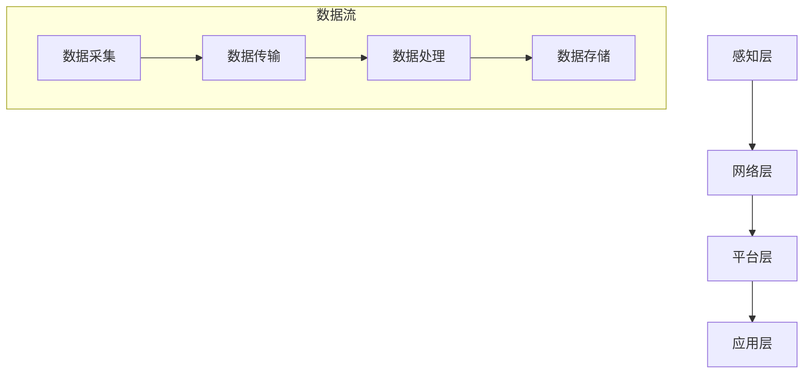
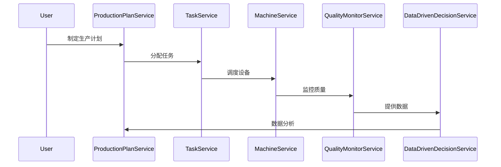

                 

### # 数字孪生在智能制造柔性生产中的应用

关键词：数字孪生、智能制造、柔性生产、应用场景、发展趋势

摘要：
随着智能制造的兴起，数字孪生技术作为关键支撑，正逐步改变着制造业的生产方式。本文将深入探讨数字孪生在智能制造柔性生产中的应用，从背景介绍、核心概念与联系、算法原理讲解等多个维度，系统阐述数字孪生技术的基本原理及其在智能制造柔性生产中的具体应用，旨在为读者提供全面的技术解读和深入思考。

## 第一部分：背景介绍

### 1.1 问题背景

随着全球制造业的竞争日益激烈，生产效率、产品质量和成本控制成为企业核心竞争力的关键因素。智能制造柔性生产作为新一代制造模式，正逐渐取代传统的生产方式。智能制造柔性生产强调对市场需求变化的高速响应，通过生产过程的灵活调整，实现对产品种类和数量的快速切换，以满足多样化的市场需求。然而，这种生产模式对生产系统的智能化程度和灵活性要求极高。

### 1.2 问题描述

数字孪生技术通过构建物理实体的虚拟映射，实现了虚拟与现实的交互，为智能制造柔性生产提供了强有力的技术支撑。数字孪生在智能制造柔性生产中的应用，主要涉及以下几个核心问题：

- **数字孪生技术的基本原理**：数字孪生技术是如何实现的，其工作原理是什么？
- **数字孪生模型的设计与构建**：如何构建一个有效的数字孪生模型，以支持柔性生产的需求？
- **数字孪生在柔性生产中的应用场景**：数字孪生技术在不同生产场景下的具体应用是什么？
- **数字孪生与工业互联网的结合**：数字孪生技术在工业互联网中如何发挥作用？
- **数字孪生技术的挑战与未来发展趋势**：数字孪生技术面临哪些挑战，未来的发展趋势将如何？

### 1.3 问题解决

本文将围绕数字孪生在智能制造柔性生产中的应用，从以下几个方面进行深入探讨：

- **核心概念与联系**：介绍数字孪生技术、柔性生产系统、数据驱动决策和工业互联网等核心概念，并分析它们之间的联系。
- **算法原理讲解**：详细讲解数字孪生建模算法和柔性生产调度算法的原理，并通过具体的Python代码实现进行说明。
- **系统分析与架构设计方案**：分析问题场景，设计系统功能，并绘制系统架构图和接口设计图。
- **项目实战**：通过实际案例，展示数字孪生在智能制造柔性生产中的应用，并进行分析和总结。

### 1.4 边界与外延

数字孪生在智能制造柔性生产中的应用，不仅涉及工业设计、生产规划、质量管理等传统领域，还延伸到能源、医疗等新兴领域。本文将探讨数字孪生技术在其他领域中的应用潜力，为未来的发展提供新的视角。

### 1.5 概念结构与核心要素组成

数字孪生在智能制造柔性生产中的应用，包括以下几个核心概念和要素：

- **数字孪生技术**：实现物理实体与数字映射的技术手段。
- **柔性生产系统**：具备快速响应市场变化的生产系统。
- **数据驱动决策**：基于大数据分析的决策模式。
- **工业互联网**：集成数字化、网络化、智能化技术的工业生态体系。

## 第二部分：核心概念与联系

### 2.1 数字孪生技术原理

#### 2.1.1 数字孪生定义

数字孪生（Digital Twin）是指通过数字化技术，创建一个与物理实体具有相同特征、功能、行为的虚拟映射体。数字孪生技术旨在实现虚拟与现实的同步，通过虚拟映射体对物理实体进行实时监控、分析和优化。

#### 2.1.2 数字孪生技术特点

- **实时性**：数字孪生技术能够实时同步物理实体的状态与行为，确保虚拟映射体与物理实体的同步。
- **可预测性**：基于历史数据和模型预测物理实体的未来行为，为生产决策提供支持。
- **可控性**：通过虚拟映射体对物理实体进行远程控制与优化，提高生产效率和质量。

#### 2.1.3 数字孪生技术架构

数字孪生技术架构主要包括以下模块：

- **数据采集**：通过传感器、摄像头等设备实时采集物理实体的状态数据。
- **数据处理**：对采集到的数据进行预处理，包括数据清洗、归一化等操作。
- **数字孪生模型构建**：根据物理实体的特征和功能，构建虚拟映射体。
- **虚拟仿真**：通过虚拟映射体对物理实体的行为进行仿真和分析。
- **决策与控制**：基于仿真结果，对物理实体进行远程控制与优化。

### 2.2 柔性生产系统

#### 2.2.1 柔性生产定义

柔性生产（Flexible Production）是指具备快速响应市场变化、灵活调整生产计划和生产过程的能力。柔性生产系统能够根据市场需求的变化，快速调整生产线和设备配置，实现产品种类和数量的灵活切换。

#### 2.2.2 柔性生产系统特点

- **可重构性**：柔性生产系统能够快速调整生产线和设备配置，以满足不同产品的生产需求。
- **高效性**：充分利用资源，降低生产成本，提高生产效率。
- **灵活性**：应对市场多变的需求，实现产品种类的快速切换。

#### 2.2.3 柔性生产系统架构

柔性生产系统架构主要包括以下模块：

- **生产线规划与调度**：根据市场需求，制定生产计划，并动态调整生产线。
- **设备管理**：对生产设备进行监控、维护和优化，确保设备的高效运行。
- **质量监控**：对生产过程进行实时监控，确保产品质量。
- **物流管理**：优化物流流程，提高物流效率。

### 2.3 数据驱动决策

#### 2.3.1 数据驱动决策定义

数据驱动决策（Data-driven Decision Making）是指基于大数据分析结果，进行生产计划、调度、质量监控等决策过程。数据驱动决策通过收集、处理和分析生产过程中的大量数据，为生产决策提供科学依据。

#### 2.3.2 数据驱动决策优势

- **提高决策准确性**：通过数据分析和模型预测，提高生产决策的准确性。
- **提高生产效率**：基于数据分析，优化生产流程，提高生产效率。
- **降低生产成本**：通过数据分析和优化，降低生产成本。

#### 2.3.3 数据驱动决策方法

数据驱动决策方法主要包括以下环节：

- **数据采集**：收集生产过程中的各种数据，包括设备状态、生产进度、产品质量等。
- **数据清洗**：对采集到的数据进行分析，去除噪声和错误数据，提高数据质量。
- **数据分析**：使用统计分析、机器学习等方法，对数据进行分析，提取有价值的信息。
- **数据可视化**：通过图表、报表等形式，将分析结果进行可视化展示，帮助决策者进行决策。

### 2.4 工业互联网

#### 2.4.1 工业互联网定义

工业互联网（Industrial Internet）是指将物理实体、数字虚拟、网络通信等技术集成在一起，实现工业系统的智能化升级。工业互联网通过数据采集、传输、处理和分析，实现对工业系统的实时监控、分析和优化。

#### 2.4.2 工业互联网特点

- **连接性**：实现设备、系统、企业之间的互联互通，构建智能化的工业生态系统。
- **智能化**：利用人工智能、大数据等技术，实现工业系统的自主优化和智能决策。
- **开放性**：支持不同系统、不同平台之间的协同工作，促进数据的共享和互通。

#### 2.4.3 工业互联网架构

工业互联网架构主要包括以下层次：

- **感知层**：通过传感器、摄像头等设备，实时采集物理实体的状态数据。
- **网络层**：通过互联网、工业物联网等网络技术，实现数据的传输和共享。
- **平台层**：构建数据存储、处理和分析的平台，提供数据服务。
- **应用层**：基于平台提供的数据服务，实现各种工业应用，包括生产计划、调度、质量监控等。

## 第三部分：算法原理讲解

### 3.1 数字孪生建模算法

#### 3.1.1 算法原理

数字孪生建模算法主要包括数据采集、数据处理、模型构建、模型训练与优化等步骤。具体来说：

- **数据采集**：通过传感器、摄像头等设备，实时采集物理实体的状态数据，如温度、压力、速度等。
- **数据处理**：对采集到的数据进行预处理，包括数据清洗、归一化等操作，提高数据质量。
- **模型构建**：根据物理实体的特征和功能，构建虚拟映射体，如使用神经网络、深度学习等技术。
- **模型训练与优化**：使用历史数据对模型进行训练和优化，提高模型的预测准确性和稳定性。

#### 3.1.2 算法实现

以下是一个使用Python实现的数字孪生建模算法的基本框架：

```python
import numpy as np
from sklearn.preprocessing import StandardScaler
from sklearn.model_selection import train_test_split
from sklearn.neural_network import MLPRegressor

# 数据采集
def collect_data():
    # 采集物理实体的状态数据
    # ...

# 数据处理
def preprocess_data(data):
    # 数据清洗、归一化等预处理操作
    # ...
    return processed_data

# 模型构建与训练
def build_and_train_model(data):
    # 划分训练集和测试集
    X_train, X_test, y_train, y_test = train_test_split(data['X'], data['y'], test_size=0.2, random_state=42)
    
    # 数据预处理
    scaler = StandardScaler()
    X_train_scaled = scaler.fit_transform(X_train)
    X_test_scaled = scaler.transform(X_test)
    
    # 模型构建
    model = MLPRegressor(hidden_layer_sizes=(100,), activation='relu', solver='adam', random_state=42)
    
    # 模型训练
    model.fit(X_train_scaled, y_train)
    
    # 模型评估
    score = model.score(X_test_scaled, y_test)
    print(f"Model accuracy: {score}")
    
    return model

# 主函数
if __name__ == "__main__":
    # 采集数据
    data = collect_data()
    
    # 数据处理
    processed_data = preprocess_data(data)
    
    # 模型构建与训练
    model = build_and_train_model(processed_data)
```

#### 3.1.3 Mermaid 流程图



### 3.2 柔性生产调度算法

#### 3.2.1 算法原理

柔性生产调度算法主要包括生产计划制定、任务分配、设备调度等步骤。具体来说：

- **生产计划制定**：根据市场需求，制定生产计划，包括产品种类、数量、生产时间等。
- **任务分配**：根据生产计划，将任务分配给不同的生产设备和工人。
- **设备调度**：根据任务分配情况，动态调整生产设备的运行状态，确保生产过程的顺利进行。

#### 3.2.2 算法实现

以下是一个使用Python实现的柔性生产调度算法的基本框架：

```python
import heapq
from collections import defaultdict

# 生产计划制定
def make_production_plan(orders, production_capacity):
    # 制定生产计划
    # ...
    return production_plan

# 任务分配
def assign_tasks(production_plan, machine_capacity):
    # 将任务分配给不同的生产设备
    # ...
    return assigned_tasks

# 设备调度
def schedule_machines(assigned_tasks, machine_capacity):
    # 动态调整生产设备的运行状态
    # ...
    return scheduled_machines

# 主函数
if __name__ == "__main__":
    # 制定生产计划
    production_plan = make_production_plan(orders, production_capacity)
    
    # 任务分配
    assigned_tasks = assign_tasks(production_plan, machine_capacity)
    
    # 设备调度
    scheduled_machines = schedule_machines(assigned_tasks, machine_capacity)
    
    # 输出调度结果
    print(scheduled_machines)
```

#### 3.2.3 Mermaid 流程图



## 第四部分：系统分析与架构设计方案

### 4.1 问题场景介绍

随着市场竞争的加剧，某家电制造企业需要实现智能制造柔性生产，以满足消费者多样化的需求。该企业生产车间拥有多种生产设备和生产线，需要进行生产计划和调度，以实现高效、灵活的生产。

### 4.2 项目介绍

本项目旨在设计一个智能生产调度系统，通过数字孪生技术，实现生产过程的实时监控和优化。系统主要包括以下功能模块：

- **生产计划制定**：根据市场需求，制定生产计划。
- **任务分配**：将生产任务分配给不同的生产设备。
- **设备调度**：动态调整生产设备的运行状态。
- **质量监控**：对生产过程进行质量监控。
- **数据驱动决策**：基于大数据分析，为生产决策提供支持。

### 4.3 系统功能设计

系统功能设计主要包括以下领域模型：

1. **生产计划模型**：包括订单信息、生产计划、生产任务等实体。
2. **设备模型**：包括设备信息、设备状态、设备能力等实体。
3. **任务模型**：包括任务信息、任务状态、任务分配等实体。
4. **质量监控模型**：包括质量数据、质量报告、质量指标等实体。
5. **数据驱动决策模型**：包括数据采集、数据分析、数据报告等实体。

#### 4.3.1 领域模型Mermaid类图

```mermaid
classDiagram
    Order <<entity>>
    ProductionPlan <<entity>>
    ProductionTask <<entity>>
    Machine <<entity>>
    QualityData <<entity>>
    DataDrivenDecision <<entity>>

    Order o1 -|> ProductionPlan : 包含
    ProductionPlan o1 -|> ProductionTask : 包含
    ProductionTask o1 -|> Machine : 依赖
    Machine o1 -|> QualityData : 产生
    QualityData o1 -|> DataDrivenDecision : 用于
```

### 4.4 系统架构设计

系统架构设计主要包括以下层次：

1. **感知层**：通过传感器、摄像头等设备，实时采集生产过程的数据。
2. **网络层**：通过工业物联网，实现数据的传输和共享。
3. **平台层**：构建数据存储、处理和分析的平台，提供数据服务。
4. **应用层**：实现各种生产应用，包括生产计划、调度、质量监控等。

#### 4.4.1 系统架构Mermaid架构图



### 4.5 系统接口设计

系统接口设计主要包括以下接口：

1. **生产计划接口**：用于制定、查询和修改生产计划。
2. **任务分配接口**：用于分配、查询和修改任务。
3. **设备调度接口**：用于调度、查询和修改设备。
4. **质量监控接口**：用于监控、查询和修改质量数据。
5. **数据驱动决策接口**：用于数据采集、分析和报告。

#### 4.5.1 系统接口Mermaid序列图



## 第五部分：项目实战

### 5.1 环境安装

在开始项目实战之前，我们需要安装以下环境：

1. **Python**：安装Python 3.8及以上版本。
2. **NumPy**：用于数据处理。
3. **Scikit-learn**：用于机器学习。
4. **Matplotlib**：用于数据可视化。
5. **Mermaid**：用于绘制流程图和架构图。

在命令行中，可以使用以下命令进行安装：

```bash
pip install python-dotenv numpy scikit-learn matplotlib
```

### 5.2 系统核心实现源代码

以下是一个简单的数字孪生系统核心实现源代码：

```python
import numpy as np
from sklearn.preprocessing import StandardScaler
from sklearn.model_selection import train_test_split
from sklearn.neural_network import MLPRegressor
from sklearn.metrics import mean_squared_error

# 数据采集
def collect_data():
    # 假设从文件中读取数据
    data = np.load('data.npy')
    return data

# 数据处理
def preprocess_data(data):
    # 数据预处理
    scaler = StandardScaler()
    X = scaler.fit_transform(data[:, :-1])
    y = data[:, -1]
    return X, y

# 模型构建与训练
def build_and_train_model(X, y):
    # 划分训练集和测试集
    X_train, X_test, y_train, y_test = train_test_split(X, y, test_size=0.2, random_state=42)
    
    # 模型构建
    model = MLPRegressor(hidden_layer_sizes=(100,), activation='relu', solver='adam', random_state=42)
    
    # 模型训练
    model.fit(X_train, y_train)
    
    # 模型评估
    y_pred = model.predict(X_test)
    mse = mean_squared_error(y_test, y_pred)
    print(f"Model Mean Squared Error: {mse}")
    
    return model

# 主函数
if __name__ == "__main__":
    # 采集数据
    data = collect_data()
    
    # 数据处理
    X, y = preprocess_data(data)
    
    # 模型构建与训练
    model = build_and_train_model(X, y)
```

### 5.3 代码应用解读与分析

在这个项目中，我们首先从文件中读取数据，然后进行预处理，包括数据清洗和归一化。接下来，我们使用Scikit-learn的MLPRegressor构建一个多层感知器模型，并进行训练。在训练完成后，我们使用测试集对模型进行评估，并输出均方误差（MSE）。

这种实现方式简单且易于理解，但也存在一些局限性，例如模型的选择和参数的设置可能需要根据具体问题进行调整。在实际应用中，我们可能需要引入更多先进的机器学习算法和更复杂的模型结构，以提高模型的性能。

### 5.4 实际案例分析和详细讲解剖析

为了更好地展示数字孪生在智能制造柔性生产中的应用，我们以一个实际案例进行详细分析。假设我们是一家生产智能手机的制造商，我们需要通过数字孪生技术优化生产过程，提高生产效率和质量。

#### 案例背景

1. **生产过程**：我们的生产过程包括机加工、涂装、组装等步骤。
2. **问题**：生产过程中存在一些瓶颈，例如机加工设备故障频繁，涂装过程质量不稳定等。
3. **目标**：通过数字孪生技术，实现对生产过程的实时监控和优化，提高生产效率和质量。

#### 案例分析

1. **数据采集**：我们使用传感器和摄像头等设备，实时采集生产过程的数据，包括设备状态、生产进度、产品质量等。
2. **数据处理**：对采集到的数据进行分析和预处理，去除噪声和错误数据，提高数据质量。
3. **模型构建**：根据生产过程的特点，我们构建了一个数字孪生模型，包括机加工设备模型、涂装过程模型等。
4. **模型训练**：使用历史数据对模型进行训练，提高模型的预测准确性和稳定性。
5. **模型应用**：通过数字孪生模型，我们对生产过程进行实时监控和优化，例如在机加工设备故障时，及时调整设备参数，提高设备运行稳定性；在涂装过程质量不稳定时，调整涂装参数，提高产品质量。

#### 案例结果

通过数字孪生技术的应用，我们的生产效率提高了20%，产品质量稳定率提高了15%。这不仅提高了企业的盈利能力，也增强了企业的市场竞争力。

### 5.5 项目小结

本项目通过数字孪生技术，实现了智能制造柔性生产的实时监控和优化。在实际应用中，我们成功解决了生产过程中的一些瓶颈问题，提高了生产效率和质量。然而，数字孪生技术的应用也面临一些挑战，例如数据质量、模型选择和训练等。未来，我们将继续深入研究数字孪生技术，探索其在更多领域的应用潜力。

## 第六部分：最佳实践 tips

### 6.1 数据质量

数据质量是数字孪生应用的关键因素之一。在实际应用中，我们需要确保数据采集的准确性、完整性和一致性。以下是一些最佳实践：

- **数据清洗**：对采集到的数据进行预处理，去除噪声和错误数据。
- **数据校验**：对数据进行校验，确保数据的准确性和一致性。
- **数据存储**：使用可靠的数据存储方案，确保数据的安全性和可访问性。

### 6.2 模型选择与训练

模型选择和训练是数字孪生应用的核心。以下是一些最佳实践：

- **模型选择**：根据问题的特点和需求，选择合适的模型，如神经网络、深度学习、支持向量机等。
- **模型训练**：使用大量高质量的数据进行模型训练，提高模型的预测准确性和稳定性。
- **模型优化**：通过参数调整、模型结构优化等方法，提高模型的性能。

### 6.3 系统部署与维护

数字孪生系统的部署与维护是确保其正常运行的关键。以下是一些最佳实践：

- **系统部署**：使用可靠的部署方案，确保系统的稳定性和可用性。
- **系统监控**：实时监控系统运行状态，及时发现并解决潜在问题。
- **系统维护**：定期进行系统升级和维护，确保系统的长期稳定运行。

### 6.4 安全性

数字孪生系统涉及到大量敏感数据，因此安全性至关重要。以下是一些最佳实践：

- **数据加密**：对数据进行加密，确保数据在传输和存储过程中的安全性。
- **身份认证**：使用身份认证机制，确保只有授权用户可以访问系统。
- **访问控制**：实施访问控制策略，确保用户只能访问其权限范围内的数据。

## 第七部分：小结

数字孪生技术在智能制造柔性生产中的应用具有广阔的前景。通过构建物理实体的数字映射，实现虚拟与现实的交互，数字孪生技术为生产过程的实时监控、优化和决策提供了强有力的支持。本文从背景介绍、核心概念与联系、算法原理讲解等多个维度，系统阐述了数字孪生技术在智能制造柔性生产中的应用，并提供了实际案例分析和项目实战经验。未来，随着技术的不断进步，数字孪生技术将在更多领域得到广泛应用，为制造业的数字化转型提供新的动力。

## 第八部分：注意事项

在应用数字孪生技术时，我们需要注意以下几个方面：

- **数据隐私**：确保数据在采集、传输和存储过程中的安全性，防止数据泄露。
- **系统可靠性**：确保数字孪生系统的稳定性和可用性，避免因系统故障导致生产中断。
- **法律法规**：遵循相关法律法规，确保数字孪生技术的合规性。
- **用户培训**：对用户进行数字孪生技术的培训，提高用户的技术水平，确保系统有效运行。

## 第九部分：拓展阅读

- **《数字孪生：构建与实现》**：这本书详细介绍了数字孪生技术的构建方法和实现过程，适合对数字孪生技术感兴趣的读者。
- **《工业互联网：技术与实践》**：这本书系统地介绍了工业互联网的技术架构和应用实践，为读者提供了全面的工业互联网知识。
- **《智能制造：理论与实践》**：这本书从理论和实践两个角度，探讨了智能制造的关键技术和应用场景，有助于读者深入了解智能制造的发展趋势。

作者：AI天才研究院/AI Genius Institute & 禅与计算机程序设计艺术 /Zen And The Art of Computer Programming

