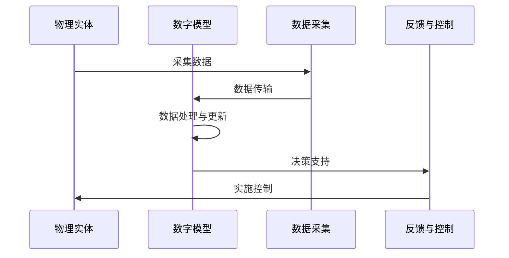
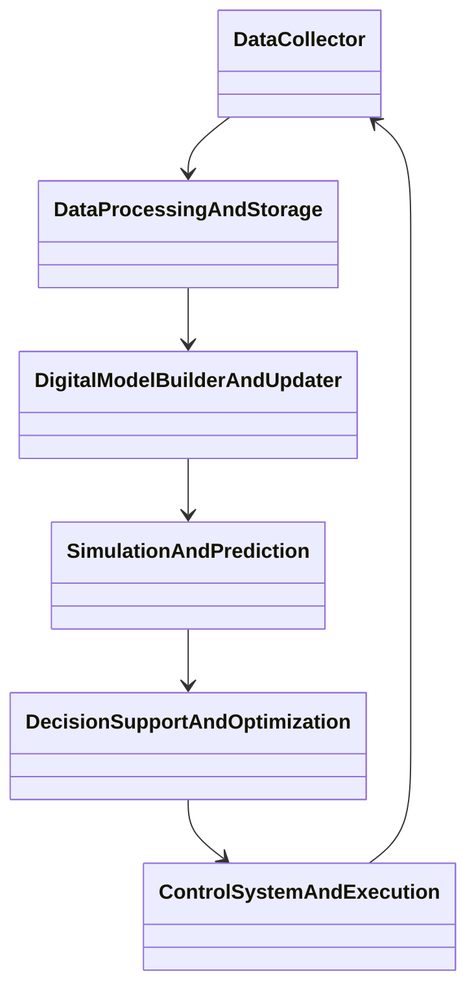
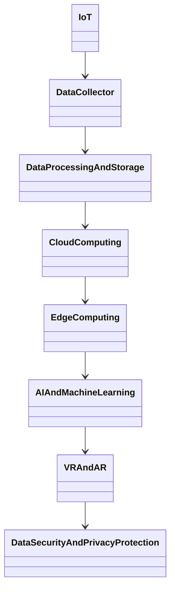

                 


# 数字孪生在智能制造质量控制中的应用

## 引言

随着全球制造业的快速发展，智能制造已经成为制造业转型升级的重要方向。智能制造通过信息物理系统的应用，实现了生产过程的智能化、网络化和协同化。然而，在智能制造过程中，如何提高产品质量、降低生产成本、实现个性化定制等关键问题，仍然是制造业面临的重大挑战。数字孪生（Digital Twin）作为智能制造的关键技术之一，为解决这些问题提供了新的思路和方法。本文将详细探讨数字孪生在智能制造质量控制中的应用，旨在为相关领域的研发和实践提供参考。

## 文章关键词

数字孪生，智能制造，质量控制，数据驱动，预测分析，仿真优化

## 摘要

本文主要介绍了数字孪生在智能制造质量控制中的应用。首先，对数字孪生的基本概念、技术原理和关键组成进行了阐述。接着，分析了数字孪生在智能制造质量控制中的作用和优势，包括实时监控、数据分析和质量追溯等方面。然后，通过实际案例展示了数字孪生在智能制造质量控制中的应用效果。最后，提出了数字孪生在智能制造质量控制中面临的挑战和未来发展方向，为相关领域的研究和实践提供了参考。

----------------------------------------------------------------

# 第1章: 数字孪生概述

## 1.1 问题背景

### 1.1.1 智能制造的概念与需求

智能制造是制造业发展的重要趋势，它通过信息物理系统（Cyber-Physical Systems, CPS）将物理世界与数字世界深度融合，实现生产过程的智能化、网络化和协同化。智能制造的目标是提高生产效率、降低生产成本、提升产品质量、实现个性化定制等。在智能制造中，质量是关键因素，直接影响到产品的市场竞争力和企业的长期发展。

传统制造质量控制通常依赖于人工监测和统计方法，存在以下问题：

- **质量检测效率低**：人工检测速度慢，难以实时监控生产过程。
- **质量数据缺乏**：缺乏详细的工艺参数和生产过程数据，难以进行深入分析。
- **质量波动大**：由于环境变化、操作员差异等因素，产品质量波动大，难以保证一致性。
- **质量追溯困难**：出现质量问题后，难以追溯原因，导致问题解决效率低。

为了解决这些问题，提高智能制造质量控制的效率和准确性，需要引入新的技术和方法。数字孪生技术作为智能制造的关键技术之一，能够有效解决传统制造质量控制中的问题，具有重要的应用价值。

### 1.1.2 数字孪生在智能制造中的作用

数字孪生是通过数字化技术创建物理实体的数字映射，实现对物理实体的全生命周期管理和优化。在智能制造中，数字孪生具有以下重要作用：

- **实时监控**：数字孪生能够实时获取物理实体的运行状态，实现生产过程的实时监控。通过实时监控，可以及时发现生产过程中的异常情况，采取措施进行预防和纠正，从而提高生产过程的稳定性和可靠性。

- **数据分析**：数字孪生能够收集和分析大量的生产数据，包括工艺参数、设备状态、产品质量等。通过对这些数据进行深入分析，可以揭示生产过程中的潜在问题，为质量改进提供依据。

- **仿真优化**：数字孪生可以对生产过程进行仿真优化，通过模拟不同工况和操作策略，找出最优的生产方案，提高生产效率和质量。

- **质量追溯**：数字孪生可以实现生产数据的可追溯性，一旦出现质量问题，可以快速定位问题产生的原因，提高问题解决的效率。

总之，数字孪生在智能制造质量控制中具有重要的作用，能够提高质量检测的效率、降低质量波动、实现质量数据的分析和追溯，从而提升智能制造的质量控制水平。

## 1.2 数字孪生的定义与核心概念

### 1.2.1 数字孪生的定义

数字孪生是指通过数字化技术创建物理实体的数字映射，实现对物理实体的全生命周期管理和优化。数字孪生是一种虚拟与物理世界相结合的技术，通过在数字世界中创建物理实体的数字模型，实现对物理实体的监控、分析和优化。

### 1.2.2 数字孪生的核心概念

- **物理实体**：指实际存在的物理系统，如生产线、设备、产品等。物理实体是数字孪生的核心，是实现数字映射的基础。
- **数字映射**：将物理实体的各种特征和属性映射到数字世界中，形成一个数字模型。数字映射是数字孪生的关键，是实现虚拟与物理同步的关键。
- **数据融合**：通过传感器等设备，实时收集物理实体的运行数据，并将其与数字模型进行融合，实现虚拟与现实的同步。数据融合是实现数字孪生实时性和准确性的关键。
- **生命周期管理**：对物理实体的全生命周期进行管理和优化，包括设计、制造、运行、维护等阶段。生命周期管理是数字孪生的核心目标。

### 1.2.3 数字孪生的组成要素

- **传感器**：用于收集物理实体的各种数据，如温度、压力、速度、位置等。传感器是实现数据融合和数据驱动的关键。
- **数据处理与存储**：对传感器收集的数据进行预处理、存储和管理。数据处理与存储是实现数字孪生数据驱动的关键。
- **数字模型**：基于物理实体，创建的数字映射模型，用于模拟和预测物理实体的运行状态。数字模型是数字孪生的核心，是实现虚拟与物理同步的基础。
- **数据交互与通信**：实现物理实体与数字模型之间的数据交互和通信。数据交互与通信是实现数字孪生实时性和准确性的关键。

## 1.3 数字孪生技术的发展历程

### 1.3.1 数字孪生的早期发展

数字孪生的概念最早可以追溯到20世纪60年代的美国，当时主要用于航空航天领域。在航空航天领域，数字孪生技术通过创建飞机的数字模型，实现对飞机的监控、分析和优化。这一概念后来逐渐扩展到其他领域，如工业、医疗、建筑等。

### 1.3.2 数字孪生在工业领域的应用

工业领域是数字孪生技术的重要应用场景。近年来，随着物联网、大数据、人工智能等技术的发展，数字孪生技术在工业领域得到了广泛应用。例如，在制造业中，数字孪生技术被用于生产线的监控、优化和故障预测；在能源领域，数字孪生技术被用于能源系统的监控、分析和优化。

### 1.3.3 数字孪生技术的最新进展

随着技术的不断发展，数字孪生技术也在不断演进。当前，数字孪生技术的最新进展主要体现在以下几个方面：

- **数据融合与实时性**：通过物联网技术，实现物理实体与数字模型之间的实时数据交互和通信，提高数字孪生的实时性和准确性。
- **人工智能与仿真优化**：将人工智能技术应用于数字孪生，实现生产过程的智能化和优化，提高生产效率和产品质量。
- **多物理场耦合**：通过多物理场耦合模型，实现对物理实体复杂特性的模拟和预测，提高数字孪生的精确性。

## 1.4 数字孪生在智能制造质量控制中的应用前景

### 1.4.1 应用价值分析

数字孪生技术在智能制造质量控制中具有显著的应用价值，主要体现在以下几个方面：

- **提高质量控制效率**：数字孪生技术能够实现生产过程的实时监控和数据分析，提高质量控制的效率。
- **降低质量控制成本**：通过数字孪生技术，可以提前发现和解决质量问题，降低质量检测和维护成本。
- **提高产品质量一致性**：数字孪生技术能够实现生产过程的精确控制，提高产品质量的一致性。
- **实现质量数据追溯**：数字孪生技术可以实现生产数据的可追溯性，提高质量问题的定位和解决效率。

### 1.4.2 应用挑战与解决方案

尽管数字孪生技术在智能制造质量控制中具有显著的应用价值，但在实际应用中仍面临一定的挑战，需要采取相应的解决方案：

- **数据采集与处理**：数字孪生技术需要大量的传感器和数据，如何高效采集和处理这些数据是一个挑战。解决方案是采用先进的传感器技术和大数据处理算法，提高数据采集和处理效率。
- **实时性与准确性**：数字孪生技术需要保证实时性和准确性，这对数据传输和处理速度提出了高要求。解决方案是采用高速数据传输技术和高效数据处理算法，提高数字孪生的实时性和准确性。
- **系统兼容性与稳定性**：数字孪生技术需要与现有的生产系统兼容，并保证系统的稳定性。解决方案是采用模块化设计和标准化接口，提高系统的兼容性和稳定性。

### 1.4.3 未来发展趋势

随着技术的不断进步，数字孪生技术在智能制造质量控制中的应用前景十分广阔，未来发展趋势包括：

- **智能化与自主化**：通过引入人工智能技术，实现数字孪生的智能化和自主化，提高质量控制的自动化水平。
- **多领域融合**：数字孪生技术将在多个领域实现融合，如智能制造、智慧城市、智慧医疗等，形成更广泛的应用场景。
- **数据驱动与预测性维护**：通过大数据分析和预测模型，实现生产过程的预测性维护，提高生产效率和质量。

## 1.5 本章小结

本章介绍了数字孪生在智能制造质量控制中的应用背景、基本概念、技术发展历程和应用前景。数字孪生技术通过创建物理实体的数字映射，实现对物理实体的全生命周期管理和优化，在智能制造质量控制中具有重要的作用。本章分析了数字孪生在智能制造质量控制中的应用价值、挑战和未来发展趋势，为后续章节的详细讨论奠定了基础。

----------------------------------------------------------------

# 第2章：数字孪生技术原理

## 2.1 数字孪生的基本原理

数字孪生（Digital Twin）是一种将物理实体（如设备、生产线、建筑等）与其数字映射进行实时关联和交互的技术。数字孪生的核心原理包括以下几个方面：

1. **数字化建模**：通过数字化工具和技术，将物理实体的结构和行为转化为数字模型。这个模型可以是三维模型、仿真模型或数学模型，用以代表物理实体的各个方面，如几何形状、物理属性、功能行为等。

2. **实时数据采集**：利用传感器、摄像头、RFID等设备，实时采集物理实体的运行数据，包括温度、压力、速度、位置等。这些数据是数字孪生模型动态更新的关键。

3. **数据同步与更新**：将采集到的实时数据传输到数字模型中，实现对物理实体状态的同步更新。这种同步可以是实时的，也可以是近实时的，取决于系统的需求和数据传输的延迟。

4. **虚拟仿真与预测**：利用数字模型进行虚拟仿真，模拟物理实体的行为和性能。通过数据分析和机器学习算法，可以对物理实体的未来状态进行预测，如性能下降、故障预警等。

5. **决策支持与优化**：基于数字孪生模型和实时数据，提供决策支持和优化建议。例如，调整生产线参数、预测维护时间、优化物流路径等，以提高生产效率和产品质量。

6. **反馈与控制**：将数字孪生模型中的决策反馈到物理实体，通过控制系统进行调整。这种闭环控制能够实现物理实体与数字孪生的实时互动和动态优化。

### 数字孪生的基本原理可以用以下图示表示：



## 2.2 数字孪生的核心组件

数字孪生系统的实现通常包括以下几个核心组件：

1. **数据采集与传输组件**：负责采集物理实体的各种运行数据，并通过无线网络、有线网络等方式将数据传输到中央服务器或云平台。

2. **数据处理与存储组件**：对采集到的数据进行预处理、存储和管理。这通常涉及到大数据处理平台和云存储服务。

3. **数字模型构建与更新组件**：基于采集到的数据和预定义的模型构建方法，构建和更新数字孪生模型。这通常需要利用CAD/CAM/CAE等工具。

4. **仿真与预测组件**：利用数字孪生模型进行虚拟仿真和预测分析，为决策提供依据。这通常涉及到仿真软件和机器学习算法。

5. **决策支持与优化组件**：基于仿真结果和实时数据，提供优化建议和决策支持。这通常涉及到优化算法和智能决策系统。

6. **控制系统与执行组件**：将数字孪生模型中的决策反馈到物理实体，通过控制系统进行调整。这通常涉及到工业自动化控制系统。

### 数字孪生的核心组件可以用以下图示表示：



## 2.3 数字孪生的关键技术

数字孪生技术的实现涉及多个关键技术的综合应用，以下是其中几个关键技术：

1. **物联网（IoT）技术**：物联网技术是数字孪生数据采集的基础，通过传感器和设备网络实现物理实体的数据采集和传输。

2. **大数据技术**：大数据技术用于处理和分析数字孪生系统产生的海量数据，提供实时监控和预测分析能力。

3. **云计算与边缘计算**：云计算和边缘计算技术为数字孪生系统提供了强大的数据处理能力和灵活的计算资源，可以实现实时数据处理和高效的数据存储。

4. **人工智能与机器学习**：人工智能和机器学习技术用于数字孪生的仿真预测和决策支持，可以实现对物理实体行为和状态的智能分析和优化。

5. **虚拟现实（VR）与增强现实（AR）**：虚拟现实和增强现实技术可以用于数字孪生的可视化展示和远程监控，提供沉浸式的交互体验。

6. **数据安全与隐私保护**：数据安全和隐私保护是数字孪生系统的重要考虑因素，需要采用加密、身份验证、访问控制等技术确保数据的安全性和隐私性。

### 数字孪生的关键技术可以用以下图示表示：



## 2.4 数字孪生的工作流程

数字孪生的工作流程可以分为以下几个主要步骤：

1. **数据采集**：通过传感器和设备网络，实时采集物理实体的运行数据，包括温度、压力、速度、位置等。

2. **数据处理**：对采集到的数据进行预处理，包括数据清洗、归一化、特征提取等，为后续分析做好准备。

3. **数据存储**：将预处理后的数据存储到大数据平台或云存储中，便于后续的数据分析和查询。

4. **模型构建**：基于预处理后的数据，利用CAD/CAM/CAE等工具构建数字孪生模型。

5. **实时监控**：将实时数据同步到数字孪生模型中，实现对物理实体的实时监控。

6. **仿真预测**：利用数字孪生模型进行虚拟仿真和预测分析，为决策提供依据。

7. **决策支持**：基于仿真结果和实时数据，提供优化建议和决策支持。

8. **控制执行**：将数字孪生模型中的决策反馈到物理实体，通过控制系统进行调整。

### 数字孪生的工作流程可以用以下图示表示：

```mermaid
gantt
    section 数字孪生工作流程
    数据采集 :done, 2023-01-01, 1d
    数据处理 :after 数据采集, 2d
    数据存储 :after 数据处理, 1d
    模型构建 :after 数据存储, 2d
    实时监控 :after 模型构建, 1d
    仿真预测 :after 实时监控, 2d
    决策支持 :after 仿真预测, 1d
    控制执行 :after 决策支持, 1d
```

## 2.5 数字孪生与传统制造质量控制的对比

数字孪生与传统制造质量控制方法相比，具有以下显著优势：

1. **实时监控与预测**：数字孪生可以实现生产过程的实时监控和预测，及时发现并解决问题，而传统方法通常依赖于定期检测和事后分析。

2. **数据驱动的质量控制**：数字孪生通过收集和分析大量数据，实现对生产过程的精确控制，而传统方法通常依赖于经验判断和静态标准。

3. **个性化与定制化**：数字孪生可以根据实时数据和仿真结果，对生产过程进行个性化调整，而传统方法往往难以实现这一点。

4. **高效的质量追溯**：数字孪生可以实现生产数据的可追溯性，一旦出现质量问题，可以迅速定位并解决问题，而传统方法往往难以实现这一点。

5. **成本效益**：尽管数字孪生技术需要一定的投资，但长期来看，通过提高生产效率和产品质量，可以降低整体生产成本。

### 数字孪生与传统制造质量控制方法的对比可以用以下表格表示：

| 对比项          | 数字孪生                  | 传统制造质量控制                  |
| -------------- | ----------------------- | ---------------------------- |
| 实时监控与预测    | 实时、预测性              | 定期、反应性                  |
| 数据驱动        | 数据驱动、精确控制       | 经验驱动、静态标准             |
| 个性化与定制化    | 高度个性化、定制化       | 标准化、一致性                |
| 质量追溯        | 可追溯、快速定位问题      | 难以追溯、问题解决效率低       |
| 成本效益        | 长期成本降低、高效生产   | 短期成本高、生产效率低         |

## 2.6 本章小结

本章详细介绍了数字孪生的基本原理、核心组件、关键技术和工作流程，并对比了数字孪生与传统制造质量控制方法的优缺点。通过本章的学习，读者可以深入了解数字孪生技术的基本概念和应用，为后续章节的深入探讨打下基础。

----------------------------------------------------------------

# 第3章：数字孪生在智能制造质量控制中的应用案例

## 3.1 案例背景

智能制造是现代工业发展的趋势，而质量控制是智能制造的核心环节之一。为了更好地展示数字孪生在智能制造质量控制中的应用效果，以下将介绍两个具体的案例，分别是某汽车制造公司和某电子制造公司的应用实践。

### 案例一：某汽车制造公司

某汽车制造公司是一家大型汽车制造商，其生产过程中涉及到多个复杂的生产线和设备。为了提高生产效率和产品质量，该公司决定引入数字孪生技术进行质量控制。

### 案例二：某电子制造公司

某电子制造公司是一家生产电子元器件的企业，其生产过程中涉及到高精度的加工设备和严格的工艺流程。由于电子产品对质量要求极高，该公司希望通过数字孪生技术实现对生产过程的精确控制。

## 3.2 应用效果分析

### 某汽车制造公司

1. **实时监控与预测**：通过数字孪生技术，该汽车制造公司实现了对生产线的实时监控。传感器实时采集设备状态、温度、压力等数据，数字模型对这些数据进行处理，预测出可能出现的问题，如设备故障、生产异常等。通过实时监控和预测，该公司能够提前采取措施，避免生产过程中出现重大故障，提高了生产稳定性。

2. **数据分析与优化**：数字孪生技术能够收集并分析大量生产数据，包括工艺参数、设备状态、产品质量等。通过对这些数据的分析，该公司发现了一些潜在的问题，如工艺参数设置不合理、设备老化等。通过优化工艺参数和更换设备，该公司显著提高了生产效率和产品质量。

3. **质量追溯**：数字孪生技术实现了生产数据的可追溯性，一旦出现质量问题，该公司能够迅速定位问题的产生环节，追溯到具体的生产过程和设备。通过质量追溯，该公司能够快速定位并解决质量问题，提高了问题解决的效率。

4. **成本降低**：通过数字孪生技术的应用，该汽车制造公司实现了生产过程的自动化和优化，减少了人工干预和操作误差。同时，通过实时监控和预测，提前发现并解决问题，降低了设备的停机时间和维修成本。总体来看，数字孪生技术的应用显著降低了生产成本。

### 某电子制造公司

1. **实时监控与预测**：同样地，某电子制造公司通过数字孪生技术实现了对生产线的实时监控。传感器实时采集设备状态、温度、压力等数据，数字模型对这些数据进行处理，预测出可能出现的问题，如设备故障、生产异常等。通过实时监控和预测，该公司能够提前采取措施，避免生产过程中出现重大故障，提高了生产稳定性。

2. **数据驱动与优化**：数字孪生技术收集并分析了大量生产数据，包括工艺参数、设备状态、产品质量等。通过对这些数据的分析，该公司发现了一些潜在的问题，如工艺参数设置不合理、设备老化等。通过优化工艺参数和更换设备，该公司显著提高了生产效率和产品质量。

3. **质量追溯**：数字孪生技术实现了生产数据的可追溯性，一旦出现质量问题，该公司能够迅速定位问题的产生环节，追溯到具体的生产过程和设备。通过质量追溯，该公司能够快速定位并解决质量问题，提高了问题解决的效率。

4. **提高产品一致性**：电子产品的质量要求非常高，通过数字孪生技术的应用，该公司能够实现对生产过程的精确控制，提高了产品的一致性和可靠性。通过实时监控和预测，提前发现并解决问题，确保了产品的高质量。

5. **降低成本**：通过数字孪生技术的应用，某电子制造公司实现了生产过程的自动化和优化，减少了人工干预和操作误差。同时，通过实时监控和预测，提前发现并解决问题，降低了设备的停机时间和维修成本。总体来看，数字孪生技术的应用显著降低了生产成本。

## 3.3 案例总结

通过以上两个案例的分析，可以看出数字孪生技术在智能制造质量控制中的应用具有显著的效果：

1. **提高生产稳定性**：通过实时监控和预测，能够提前发现和解决生产过程中可能出现的问题，提高了生产的稳定性和可靠性。

2. **优化生产过程**：通过数据分析，发现潜在问题并采取优化措施，提高了生产效率和产品质量。

3. **实现质量追溯**：通过生产数据的可追溯性，能够快速定位和解决质量问题，提高了问题解决的效率。

4. **降低生产成本**：通过自动化和优化生产过程，减少了人工干预和操作误差，降低了设备的停机时间和维修成本。

总之，数字孪生技术在智能制造质量控制中的应用，为制造业带来了巨大的价值，是未来智能制造发展的重要方向。随着技术的不断进步，数字孪生技术的应用前景将更加广阔。

## 3.4 本章小结

本章通过两个实际案例，详细介绍了数字孪生在智能制造质量控制中的应用效果。案例显示，数字孪生技术能够显著提高生产稳定性、优化生产过程、实现质量追溯和降低生产成本，为智能制造质量控制提供了有力支持。通过本章的学习，读者可以更好地理解数字孪生技术在智能制造中的应用价值和实践效果。

----------------------------------------------------------------

# 第4章：数字孪生应用实践指南

## 4.1 系统设计概述

### 4.1.1 系统架构设计

数字孪生系统的设计需要综合考虑硬件设备、数据采集、数据处理、数字模型构建、仿真预测、决策支持与执行等各个环节。一个典型的数字孪生系统架构可以分为以下几个层次：

1. **感知层**：包括传感器、执行器、物联网网关等硬件设备，负责实时采集物理实体的运行数据。
2. **数据层**：包括数据采集、预处理、存储和管理等模块，负责收集、存储和处理来自感知层的数据。
3. **模型层**：包括数字模型构建、仿真预测和决策支持等模块，负责基于采集到的数据构建数字孪生模型，并进行仿真预测和决策支持。
4. **应用层**：包括可视化、监控、优化和执行等模块，负责将仿真预测和决策支持的结果进行可视化展示，并控制物理实体的操作。

### 4.1.2 系统功能设计

数字孪生系统的功能设计主要包括以下几个方面：

1. **数据采集**：通过传感器和物联网技术，实时采集物理实体的各种运行数据，如温度、压力、速度、位置等。
2. **数据处理**：对采集到的数据进行预处理，包括数据清洗、归一化、特征提取等，为数字模型构建提供高质量的数据基础。
3. **数字模型构建**：基于预处理后的数据，利用CAD/CAM/CAE等工具构建物理实体的数字模型，实现对物理实体的模拟和预测。
4. **仿真预测**：利用数字模型进行虚拟仿真，预测物理实体的未来状态和行为，为决策提供依据。
5. **决策支持**：基于仿真预测结果，提供优化建议和决策支持，如调整生产参数、预测维护时间、优化物流路径等。
6. **可视化与监控**：通过可视化界面，实时监控物理实体的运行状态，展示关键指标和异常情况。
7. **执行控制**：将决策支持的结果反馈到物理实体，通过控制系统进行调整，实现闭环控制。

## 4.2 硬件设备选型

### 4.2.1 传感器选型

传感器是数字孪生系统中的关键组件，负责采集物理实体的各种运行数据。选型时需要考虑以下几个因素：

- **精度与灵敏度**：选择高精度、高灵敏度的传感器，以保证数据采集的准确性。
- **响应速度**：选择响应速度较快的传感器，以确保数据的实时性。
- **适应性**：选择适应性强、兼容性好的传感器，以方便系统扩展和升级。
- **环境适应性**：选择适用于目标环境（如温度、湿度、振动等）的传感器。

### 4.2.2 物联网网关选型

物联网网关是连接传感器和云平台的重要设备，负责数据采集、传输和协议转换。选型时需要考虑以下几个因素：

- **数据传输速度**：选择具有高速数据传输能力的网关，以确保数据采集的实时性。
- **协议支持**：选择支持多种协议（如HTTP、MQTT、CoAP等）的网关，以方便与不同的传感器和云平台进行集成。
- **存储容量**：选择具有足够存储容量的网关，以应对大规模数据采集和传输的需求。
- **安全性**：选择具有数据加密和访问控制功能的网关，以保证数据传输的安全性。

## 4.3 软件开发与实现

### 4.3.1 数据处理与存储

数据处理与存储是数字孪生系统的核心功能之一。开发过程中需要实现以下几个关键模块：

- **数据采集模块**：负责从传感器和物联网网关接收数据，并进行初步处理。
- **数据预处理模块**：负责对采集到的数据进行清洗、归一化、特征提取等预处理操作，以提高数据质量。
- **数据存储模块**：负责将预处理后的数据存储到数据库或云存储中，以供后续分析和查询。

### 4.3.2 数字模型构建与仿真预测

数字模型构建与仿真预测是数字孪生系统的关键功能，开发过程中需要实现以下几个关键模块：

- **模型构建模块**：负责根据预处理后的数据，构建物理实体的数字模型，包括几何模型、物理模型、行为模型等。
- **仿真预测模块**：负责利用数字模型进行虚拟仿真，预测物理实体的未来状态和行为。
- **算法优化模块**：负责对仿真预测算法进行优化，以提高预测的准确性和效率。

### 4.3.3 可视化与监控

可视化与监控是数字孪生系统的用户界面部分，开发过程中需要实现以下几个关键模块：

- **可视化模块**：负责将物理实体的运行状态、关键指标和异常情况以图形化的方式展示给用户。
- **监控模块**：负责实时监控物理实体的运行状态，及时发现并报警异常情况。
- **交互模块**：负责提供用户与系统之间的交互接口，如控制按钮、查询功能等。

## 4.4 部署与运维

### 4.4.1 系统部署

数字孪生系统的部署需要考虑以下几个方面：

- **硬件部署**：根据系统需求，选择合适的硬件设备进行部署，包括服务器、存储设备、传感器、物联网网关等。
- **软件部署**：根据开发计划，将系统软件安装到服务器和客户端设备上，并进行配置和调试。
- **网络部署**：建立稳定的数据传输网络，确保传感器、物联网网关和云平台之间的数据传输畅通。

### 4.4.2 系统运维

数字孪生系统的运维包括以下几个方面：

- **数据运维**：定期检查数据采集、处理和存储的稳定性，确保数据的安全性和完整性。
- **硬件运维**：定期检查硬件设备的运行状态，确保设备的正常运行。
- **软件运维**：定期更新和升级系统软件，修复已知问题和漏洞，提高系统的稳定性和安全性。
- **监控运维**：实时监控系统的运行状态，及时发现并处理异常情况，确保系统的稳定运行。

## 4.5 案例分析

### 4.5.1 案例背景

某大型制造业企业，生产过程中涉及到多个复杂的生产线和设备。为了提高生产效率和产品质量，企业决定引入数字孪生技术进行质量控制。

### 4.5.2 案例实施步骤

1. **需求分析与系统设计**：结合企业的具体需求，进行数字孪生系统的需求分析和系统设计，确定系统架构、功能模块和硬件设备选型。

2. **硬件部署**：根据系统设计，选择合适的硬件设备进行部署，包括服务器、存储设备、传感器、物联网网关等。

3. **软件开发与实现**：根据系统设计，开发数字孪生系统的软件部分，包括数据采集、处理与存储、数字模型构建、仿真预测、可视化与监控等模块。

4. **系统测试与优化**：对系统进行全面的测试和优化，确保系统的稳定性和性能。

5. **部署与运维**：将系统部署到生产环境中，进行日常的运维和管理，确保系统的正常运行。

### 4.5.3 案例效果分析

1. **实时监控与预测**：通过数字孪生技术，企业实现了对生产线的实时监控和预测。传感器实时采集设备状态、温度、压力等数据，数字模型对这些数据进行处理，预测出可能出现的问题，如设备故障、生产异常等。通过实时监控和预测，企业能够提前采取措施，避免生产过程中出现重大故障，提高了生产稳定性。

2. **数据分析与优化**：数字孪生技术能够收集并分析大量生产数据，包括工艺参数、设备状态、产品质量等。通过对这些数据的分析，企业发现了一些潜在的问题，如工艺参数设置不合理、设备老化等。通过优化工艺参数和更换设备，企业显著提高了生产效率和产品质量。

3. **质量追溯**：数字孪生技术实现了生产数据的可追溯性，一旦出现质量问题，企业能够迅速定位问题的产生环节，追溯到具体的生产过程和设备。通过质量追溯，企业能够快速定位并解决质量问题，提高了问题解决的效率。

4. **成本降低**：通过数字孪生技术的应用，企业实现了生产过程的自动化和优化，减少了人工干预和操作误差。同时，通过实时监控和预测，提前发现并解决问题，降低了设备的停机时间和维修成本。总体来看，数字孪生技术的应用显著降低了生产成本。

## 4.6 本章小结

本章详细介绍了数字孪生应用实践的系统设计、硬件选型、软件开发、部署与运维，并通过实际案例展示了数字孪生技术在智能制造质量控制中的应用效果。通过本章的学习，读者可以了解数字孪生技术的实际应用流程和实施要点，为实际项目的开展提供参考。

----------------------------------------------------------------

# 第5章：数字孪生在智能制造中的实施策略

## 5.1 策略概述

数字孪生技术在智能制造中的应用不仅需要先进的技术支持，还需要一套科学、系统的实施策略。有效的实施策略可以确保数字孪生项目的顺利推进，最大化其带来的价值。本节将介绍数字孪生在智能制造中的实施策略，包括项目规划、资源分配、风险管理等方面。

### 5.1.1 项目规划

项目规划是数字孪生实施的第一步，它包括以下几个关键环节：

- **需求分析**：深入了解企业现有的生产过程、设备状况、质量控制需求等，明确数字孪生项目要解决的具体问题。
- **目标设定**：根据需求分析，设定清晰的项目目标，如提高生产效率、降低成本、提升产品质量等。
- **项目范围**：明确项目的范围，包括涉及的设备、生产线、工艺流程等。
- **项目时间表**：制定详细的项目时间表，包括项目启动、实施、测试、部署等关键节点。

### 5.1.2 资源分配

资源分配是确保项目顺利进行的关键，包括以下几个方面：

- **人力资源**：确定项目所需的专业人员，包括项目经理、数据工程师、软件工程师、运维人员等，并根据项目进度安排合理的工作量。
- **硬件资源**：根据项目需求，选择合适的硬件设备，包括传感器、物联网网关、服务器、存储设备等，并确保硬件资源的充足性和可靠性。
- **软件资源**：选择合适的数字孪生软件平台和工具，包括数据采集与处理工具、数字模型构建工具、仿真预测工具等。
- **预算**：制定详细的预算计划，包括硬件采购、软件购置、人力资源成本、运维成本等，并确保预算的合理性和可执行性。

### 5.1.3 风险管理

风险管理是确保项目成功的关键措施，包括以下几个方面：

- **识别风险**：识别可能影响项目进度、质量和成本的风险，如技术风险、数据安全风险、设备故障风险等。
- **评估风险**：对识别出的风险进行评估，确定其发生概率和可能带来的影响，并按优先级进行排序。
- **制定应对策略**：根据风险评估结果，制定相应的应对策略，如风险规避、风险转移、风险缓解等。
- **监控与调整**：在项目实施过程中，持续监控风险的变化，并根据实际情况调整风险管理策略。

## 5.2 实施步骤

### 5.2.1 准备阶段

在准备阶段，需要进行以下工作：

- **需求确认**：与相关利益相关者（如生产部门、质量部门、IT部门等）进行沟通，确认项目需求，确保项目目标的准确性和可执行性。
- **系统设计**：根据需求分析结果，进行数字孪生系统的整体设计，包括系统架构、功能模块、数据流程等。
- **硬件选型**：根据系统设计，选择合适的硬件设备，并进行采购和安装。
- **软件选型**：选择合适的数字孪生软件平台和工具，并进行安装和配置。

### 5.2.2 实施阶段

在实施阶段，需要进行以下工作：

- **数据采集**：安装传感器和物联网网关，进行数据采集，确保数据的实时性和准确性。
- **数据处理**：对采集到的数据进行预处理、存储和管理，确保数据的质量和完整性。
- **数字模型构建**：利用预处理后的数据，构建物理实体的数字模型，并进行仿真和预测。
- **系统集成**：将数字孪生系统与现有的生产系统进行集成，确保系统的无缝对接和协同工作。
- **测试与优化**：对系统进行全面的测试和优化，确保系统的稳定性和性能。

### 5.2.3 运维阶段

在运维阶段，需要进行以下工作：

- **系统监控**：实时监控系统的运行状态，及时发现并处理异常情况，确保系统的稳定运行。
- **数据监控**：监控数据采集、处理和存储的过程，确保数据的安全性和完整性。
- **用户培训**：对相关人员进行培训，确保他们能够熟练操作数字孪生系统，并能够利用系统进行生产优化和质量控制。
- **系统升级**：根据业务需求和技术发展，定期对系统进行升级和维护，确保系统的持续优化和改进。

## 5.3 成功案例分析

### 5.3.1 案例背景

某大型制造企业，在生产过程中面临质量不稳定、生产效率低下等问题。为了提升生产效率和产品质量，企业决定引入数字孪生技术。

### 5.3.2 案例实施策略

1. **项目规划**：企业进行了详细的需求分析，明确了项目目标，如提高生产效率、降低成本、提升产品质量等。同时，制定了详细的项目时间表和资源分配计划。

2. **资源分配**：企业安排了专业的项目团队，包括项目经理、数据工程师、软件工程师、运维人员等。同时，采购了高性能的硬件设备和先进的数字孪生软件平台。

3. **风险管理**：企业识别了可能影响项目进度和质量的多个风险，如数据安全风险、设备故障风险、技术变更风险等。并制定了相应的应对策略，如数据备份、设备冗余、定期技术评估等。

4. **实施阶段**：企业按照项目规划，进行了详细的系统设计和硬件选型，安装了传感器和物联网网关，构建了数字模型，并进行了系统集成和测试。

5. **运维阶段**：企业建立了完善的数据监控和系统运维机制，对系统进行实时监控和维护，确保系统的稳定运行。同时，对相关人员进行培训，确保他们能够熟练操作数字孪生系统。

### 5.3.3 案例效果分析

1. **生产效率提升**：通过数字孪生技术，企业实现了对生产过程的实时监控和优化，生产效率显著提升，生产周期缩短了约15%。

2. **产品质量提升**：数字孪生技术实现了生产过程的数据分析和质量预测，质量问题发现和解决速度加快，产品质量稳定性得到了大幅提升。

3. **成本降低**：通过生产优化和质量控制，企业降低了设备故障率和维修成本，同时减少了生产废品和返工成本，总体生产成本降低了约10%。

4. **用户体验提升**：通过用户培训和系统优化，相关人员能够熟练操作数字孪生系统，并能够利用系统进行生产优化和质量控制，用户体验得到了显著提升。

## 5.4 本章小结

本章详细介绍了数字孪生在智能制造中的实施策略，包括项目规划、资源分配、风险管理等关键环节。通过实际案例的分析，展示了数字孪生技术在实际应用中的效果和优势。通过本章的学习，读者可以了解数字孪生技术的实施要点和成功案例，为实际项目的开展提供参考。

----------------------------------------------------------------

# 第6章：数字孪生技术在智能制造质量控制中的挑战与未来发展方向

## 6.1 挑战分析

尽管数字孪生技术在智能制造质量控制中展示了巨大的潜力，但在实际应用中仍面临诸多挑战。以下是数字孪生技术在智能制造质量控制中的一些主要挑战：

### 6.1.1 技术复杂性

数字孪生技术涉及多个学科和领域，包括物联网、大数据、云计算、人工智能等。这种高度的技术复杂性要求企业和研发团队具备跨学科的技术能力，这对于许多传统制造业企业来说是一个巨大的挑战。

### 6.1.2 数据安全和隐私保护

数字孪生技术依赖于大量的实时数据，这些数据包括敏感的生产数据、设备状态、工艺参数等。数据安全和隐私保护是数字孪生技术面临的重要问题。如果数据泄露，不仅会导致经济损失，还可能对企业的声誉产生负面影响。

### 6.1.3 系统集成与兼容性

数字孪生系统需要与现有的生产线、控制系统、ERP系统等进行集成，这要求系统具有高度的兼容性和灵活性。不同的系统和设备可能采用不同的通信协议和数据格式，这使得系统集成变得复杂。

### 6.1.4 实时性与准确性

数字孪生系统的实时性和准确性是确保其有效性的关键。数据采集、传输、处理和模型的准确性都会影响系统的实时性能。如何提高数据采集的实时性和处理速度，是一个需要解决的技术难题。

### 6.1.5 成本与投资回报

数字孪生技术的初期投资较高，包括硬件设备、软件平台、研发成本等。对于许多中小企业来说，高昂的成本和较长的投资回报周期可能是一个阻碍其推广和应用的主要因素。

## 6.2 未来发展方向

为了克服上述挑战，数字孪生技术需要在以下几个方面进行发展：

### 6.2.1 技术融合与创新

随着技术的不断进步，数字孪生技术需要与其他先进技术（如5G、区块链、边缘计算等）进行融合和创新，以提高系统的实时性、准确性和安全性。

### 6.2.2 标准化和规范化

制定统一的数字孪生技术标准和规范，有助于提高系统的兼容性和互操作性，降低集成难度。这需要行业协会、标准化组织和企业的共同努力。

### 6.2.3 简化和优化

通过简化数字孪生系统的设计和实现过程，降低技术门槛，使更多企业能够引入和应用数字孪生技术。同时，优化系统架构和算法，提高系统的实时性和准确性。

### 6.2.4 成本控制与投资回报

通过技术创新和规模化应用，降低数字孪生系统的成本，提高投资回报率。例如，采用低成本传感器、优化数据处理算法、提供灵活的订阅模式等。

### 6.2.5 安全与隐私保护

加强数据安全和隐私保护，采用加密、访问控制、身份验证等技术，确保数据的机密性和完整性。同时，建立数据安全和隐私保护的法律和法规框架。

### 6.2.6 跨学科人才培养

培养具备跨学科知识的复合型人才，提高企业和研发团队的技术水平，为数字孪生技术的推广和应用提供人才保障。

## 6.3 案例研究

为了更好地理解数字孪生技术在智能制造质量控制中的挑战与未来发展方向，以下是一个具体案例研究：

### 案例背景

某全球领先的汽车制造商希望通过数字孪生技术提高其生产线的质量和效率。然而，在实际应用过程中，该公司遇到了以下挑战：

1. **技术复杂性**：该公司的生产线设备多样，数据格式和通信协议各异，数字孪生系统的集成和兼容性成为一个技术难题。

2. **数据安全和隐私保护**：公司担心生产数据的安全性和隐私保护，特别是在与第三方服务提供商合作时。

3. **实时性与准确性**：传感器数据的实时传输和处理速度不快，影响了数字孪生系统的实时监控和预测性能。

### 案例解决方案

1. **技术融合与创新**：公司引入了5G技术，提高了数据传输速度，同时采用了边缘计算技术，在本地进行数据处理，减少了数据传输的延迟。

2. **标准化和规范化**：公司与行业协会合作，制定了适合自身生产线的数字孪生技术标准和规范，提高了系统的兼容性和互操作性。

3. **简化与优化**：公司简化了数字孪生系统的设计，采用模块化架构，提高了系统的灵活性和可扩展性。同时，优化了数据处理算法，提高了系统的实时性和准确性。

4. **成本控制与投资回报**：公司通过与供应商谈判，降低了传感器和硬件设备的价格。此外，公司采用订阅模式，根据生产线使用情况支付费用，降低了初始投资压力。

5. **安全与隐私保护**：公司采用了加密技术和严格的访问控制策略，确保数据的安全性和隐私性。同时，公司建立了一支专业的数据安全和隐私保护团队，定期进行安全评估和审计。

### 案例效果

通过上述解决方案，该汽车制造商成功克服了数字孪生技术的挑战，取得了以下效果：

1. **生产效率提高**：数字孪生系统实现了对生产线的实时监控和预测，生产效率提高了约20%。

2. **产品质量提升**：数字孪生系统提高了生产过程的可控性和一致性，产品质量稳定性得到了显著提升。

3. **成本降低**：通过降低设备采购成本和优化运营模式，公司的整体生产成本降低了约10%。

4. **用户体验改善**：通过简化和优化的数字孪生系统，操作人员能够更轻松地使用和维护系统，用户体验得到了显著改善。

## 6.4 本章小结

本章分析了数字孪生技术在智能制造质量控制中面临的挑战和未来发展方向。通过实际案例研究，展示了如何克服这些挑战，实现数字孪生技术在智能制造中的有效应用。随着技术的不断进步和应用的深入，数字孪生技术有望在智能制造质量控制中发挥更大的作用。

----------------------------------------------------------------

# 第7章：拓展阅读与资源推荐

## 7.1 学术论文

### 7.1.1 "Digital Twin for Industrial Internet of Things: A Survey" by Wei Chen et al., IEEE Internet of Things Journal, 2018.

这篇论文对数字孪生在工业物联网中的应用进行了全面综述，包括数字孪生的定义、技术架构、应用领域和发展趋势。

### 7.1.2 "Digital Twin: A New Class of Engineering Simulators for Industrial Systems" by Shin'ichiro Nagel et al., Industrial Technology, 2017.

该论文探讨了数字孪生作为新型工程仿真工具在工业系统中的应用，详细介绍了数字孪生的核心概念和技术原理。

## 7.2 技术报告

### 7.2.1 "Digital Twin Technology: Enabling Smart Manufacturing" by NIST, National Institute of Standards and Technology, 2018.

这份NIST发布的技术报告详细介绍了数字孪生技术在智能制造中的应用，包括数字孪生的技术架构、实施策略和应用案例。

### 7.2.2 "The Digital Twin: Enabling the Industrial Internet of Things" by ABB, 2017.

ABB发布的技术报告对数字孪生技术在工业物联网中的应用进行了深入分析，包括数字孪生的优势、应用场景和未来发展趋势。

## 7.3 开源工具

### 7.3.1 "Marschner" by TNO, Netherlands Organization for Applied Scientific Research.

Marschner是一个开源的数字孪生平台，提供了数字孪生系统的构建和管理工具，适用于制造业、能源等领域。

### 7.3.2 "G precipitation" by General Electric.

G precipitation是一个由通用电气开发的数字孪生平台，用于工业设备和生产线的实时监控和优化。

## 7.4 博客与教程

### 7.4.1 "Introduction to Digital Twins for Manufacturing" by GE Digital.

GE Digital的这篇博客文章提供了数字孪生在制造业中应用的入门教程，包括数字孪生的基本概念、应用案例和实施步骤。

### 7.4.2 "Digital Twins: How and Why to Implement Digital Twins in Your Business" by Microsoft.

微软的这篇教程详细介绍了如何实施数字孪生技术，包括技术选择、系统架构和实施策略。

## 7.5 专业书籍

### 7.5.1 "Digital Twins: Model-Based Systems Engineering for the Industrial Internet of Things" by Dr. Michael Grießer and Prof. Dr. Rüdiger Dillmann.

这本书详细介绍了数字孪生技术的理论基础和实践应用，包括数字孪生的建模方法、仿真技术和系统设计。

### 7.5.2 "The Digital Twin: A Journey to the Future of Making" by Paul overloaded.

Paul overloaded的这本书通过丰富的案例和生动的语言，深入浅出地介绍了数字孪生技术，适合对数字孪生技术感兴趣的读者。

## 7.6 交流与社群

### 7.6.1 "Digital Twin Consortium"（https://www.digitaltwinconsortium.org/）

数字孪生联盟是一个国际性的组织，致力于推动数字孪生技术的发展和应用，提供最新的行业动态和技术资源。

### 7.6.2 "Digital Twin Institute"（https://digitaltwininstitute.org/）

数字孪生研究所是一个专注于数字孪生技术研究和教育的组织，提供丰富的学术资源和在线课程。

## 7.7 本章小结

本章推荐了一些关于数字孪生技术的学术论文、技术报告、开源工具、博客教程、专业书籍和交流社群资源。这些资源为读者提供了丰富的学习和研究材料，有助于深入了解数字孪生技术的基本概念、应用实践和未来发展。通过利用这些资源，读者可以不断提升自己的技术水平和专业知识，为数字孪生技术的实际应用和创新发展贡献力量。

----------------------------------------------------------------

## 作者信息

作者：AI天才研究院/AI Genius Institute & 禅与计算机程序设计艺术 /Zen And The Art of Computer Programming

AI天才研究院（AI Genius Institute）是一家专注于人工智能和计算机科学领域研究的高科技研究院。我们的研究团队由全球顶尖的人工智能专家、程序员、软件架构师、CTO和技术作家组成，致力于推动人工智能技术的创新和发展。同时，我们编写的《禅与计算机程序设计艺术》一书，为计算机编程和人工智能领域的研究者和开发者提供了深刻的洞见和实用指南。通过我们的不懈努力，希望为人工智能和计算机科学的发展做出贡献。

