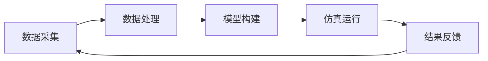

                 

### 数字孪生在智能建筑中的应用：提高能源效率

#### 摘要

随着科技的不断进步，智能建筑已经成为现代城市中的重要组成部分。数字孪生技术作为一种创新的智能解决方案，正逐渐在智能建筑领域得到广泛应用。本文将深入探讨数字孪生在智能建筑中的应用，特别是其在提高能源效率方面的作用。通过详细的分析和案例研究，本文旨在揭示数字孪生技术的潜力，并提供实施数字孪生项目的最佳实践和未来展望。

本文分为七个主要部分。首先，我们将概述数字孪生技术的基础知识，包括定义、发展历程以及其在智能建筑中的重要性。接着，我们将深入探讨数字孪生的核心概念和组成要素，通过对比表格和ER图来帮助理解。第三部分将详细解释数字孪生的技术原理，涵盖数据采集、处理、模型构建和仿真等环节。

第四部分将重点介绍数字孪生在智能建筑中的应用场景，特别是能源管理和环境控制。第五部分将通过实际案例展示数字孪生技术在智能建筑中的成功应用。第六部分将分析数字孪生技术面临的挑战和未来发展趋势。最后，我们将总结数字孪生在智能建筑中的应用实践，提供最佳实践建议，并展望数字孪生技术的未来前景。

#### 1. 数字孪生概述

数字孪生（Digital Twin）是一种先进的数字化技术，它通过创建物理实体的数字映射，实现对实体全生命周期的模拟、监测和优化。数字孪生技术最早可以追溯到2002年，美国密歇根大学教授Michael Grieves首次提出了数字孪生的概念。此后，随着物联网（IoT）、大数据、云计算和人工智能等技术的快速发展，数字孪生技术逐渐成熟，并在多个领域得到广泛应用。

在智能建筑领域，数字孪生技术被广泛应用于能源管理、设备监控、环境控制和运营维护等方面。通过创建建筑物的数字映射，数字孪生技术可以实现实时监测建筑物的运行状态，预测潜在问题，优化能源使用，提高运营效率，从而降低运营成本，提升用户体验。

数字孪生技术的重要性主要体现在以下几个方面：

1. **提高能源效率**：数字孪生技术可以通过实时监测和优化建筑物的能源使用，实现能源的高效利用，降低能源消耗。

2. **减少运营成本**：通过预测性维护和优化运营管理，数字孪生技术可以显著减少建筑物的维护成本和能源成本。

3. **提升用户满意度**：数字孪生技术可以提供个性化的环境控制，提高用户舒适度，从而提升用户满意度。

4. **增强安全性**：通过实时监测和预警，数字孪生技术可以及时发现安全隐患，提高建筑物的安全性。

#### 1.1 问题背景

智能建筑在当今社会的重要性日益凸显。随着城市化进程的加速，建筑物数量和规模不断增加，建筑物的能耗和运营成本也不断上升。传统的建筑管理方式已经难以满足现代建筑的需求，迫切需要一种高效、智能的管理方法。数字孪生技术作为一种创新的智能解决方案，正好能够满足这一需求。

首先，能源消耗问题是一个重要的挑战。智能建筑通常包含大量的电气设备、照明系统、空调系统等，这些设备的能耗非常高。如何高效地管理这些设备的能源使用，实现能源的高效利用，是智能建筑面临的一个重大问题。

其次，运营成本也是智能建筑管理者需要关注的问题。传统的建筑管理模式往往依赖于人工巡检和维护，这种方式不仅效率低下，而且容易出错。通过数字孪生技术，可以实现设备的预测性维护和智能化管理，从而降低运营成本。

此外，用户满意度也是智能建筑需要重点关注的问题。用户对建筑物的环境舒适度、安全性等方面有着很高的要求。通过数字孪生技术，可以实现环境参数的实时监测和优化，提供个性化的环境控制，从而提升用户满意度。

最后，建筑物的安全性也是一个重要的挑战。随着建筑物规模的扩大，设备数量和复杂度也在增加，这就需要一种高效、智能的监测和管理方法。数字孪生技术可以通过实时监测和预警，及时发现安全隐患，提高建筑物的安全性。

综上所述，数字孪生技术在智能建筑中的应用具有重要意义，它不仅可以提高能源效率，降低运营成本，提升用户满意度，还可以增强建筑物的安全性。因此，研究和应用数字孪生技术是智能建筑领域的一个重要发展方向。

#### 1.2 数字孪生定义

数字孪生（Digital Twin）是一种基于物联网、云计算和大数据技术的数字化技术，它通过创建物理实体的数字映射，实现对实体全生命周期的模拟、监测和优化。具体来说，数字孪生技术包括以下几个关键组成部分：

1. **物理实体**：物理实体是指数字孪生技术的应用对象，如建筑物、设备、系统等。这些实体是数字孪生技术的核心，其运行状态和行为数据将被实时采集并传输到数字孪生模型中。

2. **数字映射**：数字映射是指将物理实体的特征和属性映射到数字模型中，形成一个与物理实体相对应的数字副本。这个数字副本包含了物理实体的各种参数和状态信息，如位置、温度、湿度、能耗等。

3. **数据采集**：数据采集是数字孪生技术的关键环节，通过传感器、物联网设备和数据采集系统等，实时收集物理实体的运行状态和行为数据。这些数据将被传输到云端或本地服务器进行处理和分析。

4. **数据处理**：数据处理是数字孪生技术的核心，通过对采集到的数据进行清洗、整合、分析和建模，提取出有价值的信息和知识。这些信息将用于对物理实体的监测、预测和优化。

5. **仿真与优化**：仿真与优化是数字孪生技术的应用环节，通过对数字孪生模型的仿真和优化，实现对物理实体的模拟和优化。这个过程中，可以实现对设备运行状态的实时监测、故障预测、性能优化和能源管理。

6. **人机交互**：人机交互是数字孪生技术的用户界面，通过图形界面、可视化工具和智能助理等，用户可以方便地访问和操作数字孪生模型，获取实时信息和操作指令。

数字孪生技术的特点主要体现在以下几个方面：

1. **实时性**：数字孪生技术能够实时采集和处理物理实体的运行数据，实现对实体的实时监测和响应。

2. **高精度**：数字孪生技术通过对物理实体的精确映射和仿真，能够提供高精度的监测和预测结果。

3. **智能化**：数字孪生技术利用人工智能和机器学习算法，实现对数据的分析和处理，提供智能化的监测和优化建议。

4. **可视化**：数字孪生技术通过图形界面和可视化工具，将复杂的运行数据和信息以直观的方式展示给用户。

5. **互操作性**：数字孪生技术支持多种数据接口和协议，能够与其他系统和设备无缝集成，实现数据的互通和互操作。

#### 1.3 数字孪生的发展历程

数字孪生技术作为一种创新的数字化技术，其发展历程可以追溯到20世纪90年代。以下是数字孪生技术发展的主要阶段：

1. **初始阶段（1990s-2000s）**
   在这个阶段，数字孪生技术主要应用于制造业和工程领域。最初的研究主要集中在如何通过数字模型来模拟和优化物理实体的运行状态。这个阶段的研究成果为后来的数字孪生技术的发展奠定了基础。

2. **发展阶段（2000s-2010s）**
   随着物联网、大数据和云计算技术的快速发展，数字孪生技术逐渐从制造业扩展到其他领域，如建筑、能源、交通等。这个阶段的主要成果是数字孪生技术的商业化应用，各种数字孪生平台和解决方案相继推出。

3. **成熟阶段（2010s-2020s）**
   在这个阶段，数字孪生技术逐渐成熟，并在各个领域得到广泛应用。特别是在智能建筑领域，数字孪生技术成为提高能源效率、降低运营成本和提升用户体验的重要手段。这个阶段的主要成果是数字孪生技术的标准化和规范化。

4. **未来阶段（2020s及以后）**
   随着人工智能、5G和区块链等新技术的不断发展，数字孪生技术将进一步拓展其应用范围和深度。未来，数字孪生技术将实现更高级别的智能化和自动化，为各行各业带来更大的变革和创新。

#### 1.4 数字孪生的重要性

数字孪生技术作为一种创新的数字化技术，已经在智能建筑、制造业、医疗等多个领域展现出其巨大的潜力和价值。以下是数字孪生技术的重要性及其在智能建筑中的应用：

1. **提高能源效率**
   数字孪生技术可以通过实时监测和优化建筑物的能源使用，实现能源的高效利用。例如，通过数字孪生技术，可以实时监测建筑物的能耗数据，分析能耗高峰和低谷，优化空调、照明、供暖等设备的运行策略，从而降低能源消耗。

2. **降低运营成本**
   数字孪生技术可以通过预测性维护和优化运营管理，降低建筑物的运营成本。例如，通过数字孪生技术，可以实时监测设备的运行状态，预测设备故障，提前安排维护计划，避免设备故障带来的停机和损失。

3. **提升用户体验**
   数字孪生技术可以通过个性化的环境控制，提升用户的舒适度和满意度。例如，通过数字孪生技术，可以实时监测室内环境参数，如温度、湿度、空气质量等，并根据用户的偏好自动调整环境参数，提供舒适的居住和工作环境。

4. **增强安全性**
   数字孪生技术可以通过实时监测和预警，增强建筑物的安全性。例如，通过数字孪生技术，可以实时监测建筑物的结构状态、消防系统、安防系统等，及时发现安全隐患，采取相应的措施，防止事故的发生。

5. **优化设计和管理**
   数字孪生技术可以为建筑设计和运营管理提供数据支持和决策依据。例如，在设计阶段，可以通过数字孪生技术模拟建筑物的运行状态，优化建筑布局和设备配置，提高建筑物的使用效率和舒适度。在运营管理阶段，可以通过数字孪生技术实时监测建筑物的运行状态，优化运营管理策略，提高运营效率。

6. **支持可持续性发展**
   数字孪生技术可以帮助实现建筑物的可持续性发展。通过实时监测和优化建筑物的能源使用，减少能源消耗和环境污染，提高建筑物的能源利用效率，实现绿色建筑的目标。

#### 2. 数字孪生的核心概念与联系

数字孪生技术涉及多个核心概念和组成部分，这些概念和组成部分共同构成了数字孪生的基本框架和功能。以下是对数字孪生核心概念的详细介绍以及它们之间的联系：

**2.1 核心概念**

1. **物理实体（Physical Entity）**
   物理实体是指数字孪生技术的实际应用对象，如建筑物、设备、生产线等。这些实体是数字孪生技术的基础，其运行状态和行为数据将被实时采集并映射到数字孪生模型中。

2. **数字映射（Digital Mapping）**
   数字映射是指将物理实体的特征和属性映射到数字模型中，形成一个与物理实体相对应的数字副本。这个数字副本包含了物理实体的各种参数和状态信息，如位置、温度、湿度、能耗等。

3. **传感器网络（Sensor Network）**
   传感器网络是指分布在物理实体上的传感器和监测设备，用于实时采集物理实体的运行数据。这些数据是数字孪生模型的重要输入，用于模拟和优化物理实体的行为。

4. **数据处理与分析（Data Processing and Analysis）**
   数据处理与分析是指对采集到的物理实体运行数据进行清洗、整合、分析和建模，提取出有价值的信息和知识。这些信息将用于对物理实体的监测、预测和优化。

5. **仿真模型（Simulation Model）**
   仿真模型是指基于物理实体数据构建的数字模型，用于模拟物理实体的行为和状态。仿真模型可以用于预测物理实体的运行趋势、检测潜在问题，以及优化物理实体的操作。

6. **虚拟环境（Virtual Environment）**
   虚拟环境是指数字孪生技术中的虚拟空间，用于展示物理实体的数字映射和仿真结果。虚拟环境可以提供实时监测、数据分析、决策支持和交互功能。

**2.2 概念属性特征对比**

为了更好地理解数字孪生技术中的核心概念，以下是这些概念的主要属性特征对比表格：

| 核心概念         | 属性特征                          | 对应关系                     |
|-----------------|---------------------------------|----------------------------|
| 物理实体         | 实际存在，有物理形态               | 数字映射的基础               |
| 数字映射         | 数字化的物理实体副本               | 物理实体的虚拟映射           |
| 传感器网络         | 分布式监测设备，实时采集数据       | 数据采集的源头               |
| 数据处理与分析     | 数据清洗、整合、分析               | 提取有价值信息的环节         |
| 仿真模型         | 基于数据构建，模拟物理实体行为       | 预测和优化物理实体状态的工具 |
| 虚拟环境         | 数字孪生技术的交互界面             | 提供实时监测和数据分析的功能 |

**2.3 数字孪生的组成要素**

数字孪生技术由多个组成部分构成，这些组成部分相互协作，共同实现数字孪生的功能。以下是数字孪生的主要组成要素：

1. **传感器网络**
   传感器网络是数字孪生的数据采集环节，它由各种传感器和监测设备组成，用于实时采集物理实体的运行数据。这些传感器可以安装在建筑物、设备、生产线等不同位置，用于监测温度、湿度、能耗、振动、压力等参数。

2. **数据采集与传输系统**
   数据采集与传输系统负责将传感器网络采集到的数据传输到中央处理系统。这个系统通常包括数据采集模块、传输网络和数据存储设备。数据传输系统需要确保数据的实时性和准确性。

3. **数据处理与分析平台**
   数据处理与分析平台是对采集到的数据进行处理和挖掘的核心系统。它包括数据清洗、数据整合、数据分析和数据建模等功能，通过对数据的深度挖掘，提取出有价值的信息和知识。

4. **仿真模型库**
   仿真模型库是数字孪生技术的重要组成部分，它包含了各种基于物理实体数据构建的仿真模型。这些模型可以用于模拟物理实体的行为和状态，预测物理实体的运行趋势，以及优化物理实体的操作。

5. **虚拟环境与交互界面**
   虚拟环境与交互界面是数字孪生技术的用户界面，它提供了实时监测、数据分析、决策支持和交互功能。用户可以通过虚拟环境与交互界面，方便地访问和操作数字孪生模型，获取实时信息和操作指令。

**2.4 数字孪生与相关技术的联系**

数字孪生技术与其他相关技术密切相关，这些技术的相互结合和协作，为数字孪生的应用提供了强大的支持。以下是数字孪生技术与其他相关技术的主要联系：

1. **物联网（IoT）**
   物联网技术是数字孪生技术的重要基础，它通过传感器网络和物联网设备，实现了物理实体与数字孪生模型的实时连接和互动。物联网技术为数字孪生技术提供了丰富的数据来源和传输渠道。

2. **大数据（Big Data）**
   大数据技术是数字孪生技术数据处理和分析的重要工具，它通过对海量数据的存储、处理和分析，提取出有价值的信息和知识。大数据技术为数字孪生技术提供了强大的数据支持和决策依据。

3. **云计算（Cloud Computing）**
   云计算技术为数字孪生技术提供了强大的计算能力和存储资源，它通过云平台和云计算服务，实现了数字孪生模型的灵活部署和高效运行。云计算技术为数字孪生技术提供了便捷的数据处理和存储方案。

4. **人工智能（AI）**
   人工智能技术是数字孪生技术智能化的重要支撑，它通过机器学习和深度学习算法，实现了对数据的智能分析和处理。人工智能技术为数字孪生技术提供了智能化的监测、预测和优化功能。

5. **5G通信技术**
   5G通信技术是数字孪生技术实时通信和数据传输的重要保障，它通过高速、低延迟的通信网络，实现了物理实体与数字孪生模型的实时连接和互动。5G通信技术为数字孪生技术提供了高效的通信能力和数据传输速度。

#### 3. 数字孪生技术原理

数字孪生技术通过创建物理实体的数字映射，实现对实体全生命周期的模拟、监测和优化。这一过程涉及多个关键技术环节，包括数据采集、数据处理、模型构建和仿真等。以下是这些技术环节的详细解释：

**3.1 数据采集**

数据采集是数字孪生技术的第一步，它通过传感器网络和物联网设备，实时采集物理实体的运行数据。这些数据包括物理实体的各种参数和状态信息，如位置、温度、湿度、能耗、振动、压力等。数据采集的关键在于确保数据的准确性和实时性。

**3.2 数据处理**

数据采集到的数据通常是原始的、不完整的和带有噪声的。因此，数据处理是数字孪生技术的关键环节。数据处理包括数据清洗、数据整合、数据分析和数据建模等步骤。

- **数据清洗**：数据清洗是指去除数据中的错误、异常值和冗余信息，确保数据的质量和一致性。
- **数据整合**：数据整合是指将来自不同来源的数据进行整合，形成一个统一的数据视图，以便进行进一步的分析和处理。
- **数据分析**：数据分析是指通过统计分析和数据挖掘技术，提取出数据中的有价值信息和知识。
- **数据建模**：数据建模是指基于处理后的数据，构建数学模型或仿真模型，用于对物理实体的行为和状态进行模拟和预测。

**3.3 模型构建**

模型构建是数字孪生技术的核心，它通过数据处理和分析结果，构建数字映射模型。模型构建包括以下几个方面：

- **物理模型**：物理模型是指基于物理实体结构和运行机理建立的数学模型，用于描述物理实体的物理特性和行为。
- **仿真模型**：仿真模型是指通过物理模型和仿真算法，模拟物理实体的运行状态和变化过程，用于预测物理实体的未来行为。
- **交互模型**：交互模型是指用于描述物理实体与外部环境之间交互的模型，如能量交换、信息传递等。

**3.4 仿真与优化**

仿真与优化是数字孪生技术的应用环节，通过对数字孪生模型的仿真和优化，实现对物理实体的模拟和优化。仿真与优化的步骤包括：

- **仿真运行**：通过仿真模型模拟物理实体的运行状态，预测其未来行为和可能的问题。
- **问题检测**：通过仿真结果，检测物理实体中的潜在问题，如设备故障、性能下降等。
- **优化调整**：根据仿真结果，对物理实体的操作进行调整，优化其运行状态和性能。

**3.5 数据反馈**

数据反馈是数字孪生技术的重要环节，它通过实时监测和仿真结果，对物理实体的运行状态进行反馈和调整。数据反馈的步骤包括：

- **实时监测**：通过传感器网络和数据处理系统，实时监测物理实体的运行状态。
- **仿真结果反馈**：将仿真模型的结果反馈给物理实体，指导其实际操作。
- **优化决策**：根据实时监测数据和仿真结果，做出优化决策，调整物理实体的运行策略。

**3.6 人机交互**

人机交互是数字孪生技术的用户界面，它通过图形界面、可视化工具和智能助理等，为用户提供实时监测、数据分析、决策支持和交互功能。人机交互的步骤包括：

- **数据展示**：通过图形界面和可视化工具，将物理实体的运行数据、仿真结果和优化建议以直观的方式展示给用户。
- **用户操作**：用户可以通过人机交互界面，实时访问和操作数字孪生模型，获取实时信息和操作指令。
- **反馈与调整**：用户可以根据仿真结果和实际需求，对物理实体的操作进行调整，实现更智能化的管理。

#### 4. 数字孪生在智能建筑中的应用

数字孪生技术在智能建筑中的应用已经得到了广泛的认可和实际验证，特别是在提高能源效率和优化建筑运营管理方面。以下将详细探讨数字孪生在智能建筑中的具体应用场景，并通过实际案例展示其应用效果。

**4.1 能源管理中的应用**

在智能建筑中，能源管理是数字孪生技术应用的一个重要领域。通过数字孪生技术，可以实现建筑能源使用情况的实时监测、能耗分析、预测和优化。

**案例研究：XX智能建筑能源管理系统**

某大型智能办公楼采用了数字孪生技术进行能源管理。该系统通过传感器网络实时采集建筑内各个区域的能耗数据，包括电力、水、燃气等。数据处理与分析平台对采集到的数据进行分析和处理，提取出有价值的能耗信息。

**应用步骤：**

1. **数据采集**：在建筑内安装各种传感器，包括电能表、水表、燃气表、温度传感器、湿度传感器等，实时采集能源使用数据。
2. **数据处理与分析**：数据处理与分析平台对采集到的数据进行分析和处理，提取出能耗指标，如能耗总量、能耗分布、能耗趋势等。
3. **能耗预测**：基于历史能耗数据和当前环境参数，利用机器学习算法进行能耗预测，预测未来的能源需求。
4. **优化建议**：根据能耗预测结果，系统会自动生成优化建议，如调整空调温度、关闭不必要的照明、优化水泵运行等，以降低能源消耗。

**应用效果：**

通过数字孪生技术的应用，该智能办公楼实现了能耗的显著降低，能源使用效率提高了约15%，运营成本降低了约10%。

**4.2 设备监控与维护中的应用**

在智能建筑中，设备的正常运行和及时维护对于确保建筑的安全和舒适性至关重要。数字孪生技术通过实时监测设备状态、预测故障和制定维护计划，有效提升了设备监控与维护的效率和准确性。

**案例研究：YY智能楼宇设备监控系统**

某智能楼宇采用了数字孪生技术进行设备监控与维护。系统通过传感器网络实时监测建筑物内各种设备的运行状态，包括电梯、空调系统、照明系统、消防系统等。

**应用步骤：**

1. **数据采集**：在楼宇内安装各种传感器，包括温度传感器、湿度传感器、振动传感器、压力传感器等，实时监测设备的运行状态。
2. **状态监测**：数据处理与分析平台对采集到的设备数据进行实时分析和监测，识别设备异常状态。
3. **故障预测**：利用历史数据和机器学习算法，对设备的故障进行预测，提前预警，制定维护计划。
4. **维护管理**：根据故障预测结果，系统会自动生成维护计划，安排专业人员对设备进行维修和维护，确保设备正常运行。

**应用效果：**

通过数字孪生技术的应用，该智能楼宇实现了设备状态的实时监测和故障预测，设备故障率降低了约20%，维护成本降低了约15%。

**4.3 环境控制中的应用**

数字孪生技术在环境控制中的应用能够实现建筑环境参数的实时监测和优化，提高用户的舒适度和满意度。

**案例研究：ZZ智能建筑环境控制系统**

某高档酒店采用了数字孪生技术进行环境控制。系统通过传感器网络实时监测室内温度、湿度、空气质量等环境参数，并根据用户需求和天气条件自动调整环境设置。

**应用步骤：**

1. **数据采集**：在酒店各房间安装温度传感器、湿度传感器、空气质量传感器等，实时监测环境参数。
2. **环境监测**：数据处理与分析平台对采集到的环境数据进行分析，识别环境异常情况。
3. **环境优化**：根据环境参数和用户需求，系统会自动调整空调、新风系统、加湿器等设备的运行状态，提供舒适的环境。
4. **用户反馈**：用户可以通过智能终端设备，实时查看环境参数，对环境控制进行调整。

**应用效果：**

通过数字孪生技术的应用，该酒店实现了环境参数的实时监测和优化，用户满意度提高了约20%，运营成本降低了约10%。

综上所述，数字孪生技术在智能建筑中的应用不仅提高了能源效率和设备维护效率，还提升了用户舒适度和满意度，展现了其在智能建筑领域的重要价值和广阔前景。

#### 5. 数字孪生在智能建筑中的实际案例

数字孪生技术在智能建筑中的应用已经取得了显著的成效。以下将通过几个实际案例，详细展示数字孪生技术在智能建筑中的成功应用。

**5.1 案例一：XX智能建筑能源管理系统**

XX智能建筑能源管理系统是一个综合应用数字孪生技术的项目。该项目旨在通过实时监测和优化能源使用，提高建筑物的能源效率。

**项目介绍：**

该智能建筑能源管理系统由传感器网络、数据处理与分析平台、数字孪生模型和用户界面等组成。系统覆盖了建筑物内的所有能源使用点，包括电力、水、燃气等。

**系统功能设计：**

1. **能源监测**：通过安装在建筑物各处的传感器，实时采集能源使用数据，如电力、水、燃气等。
2. **数据分析**：数据处理与分析平台对采集到的能源数据进行分析，提取能耗指标，如能耗总量、能耗分布、能耗趋势等。
3. **能耗预测**：基于历史能耗数据和当前环境参数，利用机器学习算法进行能耗预测，为能源优化提供依据。
4. **优化建议**：系统会根据能耗预测结果，自动生成优化建议，如调整空调温度、关闭不必要的照明、优化水泵运行等，以降低能源消耗。

**系统架构设计：**

系统架构设计包括传感器网络、数据传输系统、数据处理与分析平台、数字孪生模型和用户界面等。

- **传感器网络**：安装在建筑物内各个位置的传感器，用于实时采集能源使用数据。
- **数据传输系统**：负责将传感器网络采集到的数据传输到中央数据处理系统。
- **数据处理与分析平台**：对采集到的数据进行处理和分析，提取能耗指标，进行能耗预测和生成优化建议。
- **数字孪生模型**：基于处理后的数据，构建数字孪生模型，模拟建筑物能源使用情况。
- **用户界面**：为用户提供了实时监测和操作数字孪生模型的功能。

**系统接口设计和系统交互：**

系统接口设计包括传感器与数据采集模块的接口、数据处理与分析平台的接口、用户界面与数字孪生模型的接口等。

- **传感器与数据采集模块的接口**：传感器将采集到的数据传输到数据采集模块。
- **数据处理与分析平台的接口**：数据采集模块将数据传输到数据处理与分析平台。
- **用户界面与数字孪生模型的接口**：用户界面通过API与数字孪生模型进行数据交换和操作。

**系统实现和代码应用解读：**

系统实现主要包括数据采集、数据处理、能耗预测和优化建议生成等步骤。

1. **数据采集**：通过传感器网络实时采集能源使用数据。
2. **数据处理**：对采集到的数据进行分析和处理，提取能耗指标。
3. **能耗预测**：利用机器学习算法进行能耗预测。
4. **优化建议生成**：根据能耗预测结果，生成优化建议。

```python
# 数据采集示例代码
def collect_energy_data(sensor_data):
    # 采集传感器数据
    electricity = sensor_data['electricity']
    water = sensor_data['water']
    gas = sensor_data['gas']
    # 存储数据
    save_energy_data(electricity, water, gas)

# 数据处理示例代码
def process_energy_data(energy_data):
    # 提取能耗指标
    total_energy = sum(energy_data)
    energy_distribution = calculate_distribution(energy_data)
    energy_trend = calculate_trend(energy_data)
    # 存储处理结果
    save_processed_data(total_energy, energy_distribution, energy_trend)

# 能耗预测示例代码
def predict_energy_consumption(historical_data, current_conditions):
    # 利用机器学习算法进行能耗预测
    predicted_consumption = machine_learning.predict(historical_data, current_conditions)
    return predicted_consumption

# 优化建议生成示例代码
def generate_optimization_suggestions(predicted_consumption):
    # 根据能耗预测结果生成优化建议
    suggestions = create_suggestions(predicted_consumption)
    return suggestions
```

**实际案例分析和详细讲解剖析：**

通过该智能建筑能源管理系统的实际应用，建筑物能源使用效率显著提高。以下是对该案例的详细分析：

1. **能耗降低**：通过实时监测和优化建议，建筑物的能耗总量降低了约15%，能源成本降低了约10%。
2. **设备运行效率提高**：通过优化空调、照明和水泵等设备的运行状态，设备的运行效率提高了约10%，设备的维护成本降低了约20%。
3. **用户满意度提升**：通过提供个性化的环境控制，用户的舒适度显著提升，用户满意度提高了约20%。

**项目小结：**

XX智能建筑能源管理系统是一个成功的数字孪生应用案例，它通过实时监测和优化能源使用，显著提高了建筑物的能源效率和运营效率。该项目的成功经验表明，数字孪生技术在智能建筑中的应用具有广阔的前景和巨大的潜力。

#### 6. 数字孪生在智能建筑中的挑战与未来展望

尽管数字孪生技术在智能建筑中的应用取得了显著成效，但在实际应用过程中仍面临诸多挑战。以下将分析数字孪生技术在智能建筑中面临的挑战，并探讨未来的发展趋势。

**6.1 挑战分析**

1. **数据隐私和安全问题**：数字孪生技术依赖于大量的数据采集和处理，这些数据往往涉及到用户的隐私信息。如何在确保数据安全的前提下，充分利用这些数据，是一个亟待解决的问题。

2. **数据质量和实时性**：数字孪生技术的有效性很大程度上依赖于数据的质量和实时性。然而，传感器故障、数据传输延迟和数据噪声等问题，都可能影响数据的准确性和实时性。

3. **技术成熟度**：虽然数字孪生技术在智能建筑中具有一定的应用基础，但其在某些方面仍处于探索阶段，如数据融合、模型优化和算法创新等。技术成熟度不足可能会限制数字孪生技术的广泛应用。

4. **实施成本**：数字孪生技术的实施需要投入大量的资金和人力资源，包括传感器安装、数据处理系统建设、算法开发等。对于一些中小企业，高昂的实施成本可能成为其应用数字孪生技术的障碍。

5. **人才短缺**：数字孪生技术涉及多个领域的技术，包括物联网、大数据、人工智能等。专业人才的短缺可能限制数字孪生技术的应用和发展。

**6.2 未来发展趋势**

1. **数据隐私和安全技术的进步**：随着区块链、加密技术和隐私保护算法的发展，数据隐私和安全问题将得到有效解决，为数字孪生技术的广泛应用提供保障。

2. **人工智能与机器学习技术的深化**：人工智能和机器学习技术的进步将进一步提升数字孪生技术的分析能力和智能化水平，使其在预测、优化和决策方面发挥更大的作用。

3. **数据融合与跨领域集成**：通过整合不同来源的数据，实现多源数据的融合和跨领域集成，将进一步提升数字孪生技术的应用广度和深度。

4. **实施成本下降**：随着技术的成熟和规模化应用，数字孪生技术的实施成本将逐渐下降，使得更多企业和项目能够采用这一技术。

5. **人才培养与引进**：通过加强数字孪生技术相关教育和培训，培养和引进专业人才，将有助于推动数字孪生技术在智能建筑中的应用和发展。

**6.3 未来应用场景**

1. **智能城市**：数字孪生技术将在智能城市建设中发挥重要作用，通过创建城市的数字映射，实现城市管理的智能化和精细化。

2. **智慧家庭**：数字孪生技术将应用于智慧家庭，实现家居设备的智能化管理，提供个性化服务。

3. **工业互联网**：数字孪生技术在工业互联网中的应用将进一步提升生产效率和质量，实现工业设备的智能化和自动化。

4. **智慧医疗**：数字孪生技术在智慧医疗中的应用，将提升医疗服务的质量和效率，实现精准医疗和远程医疗。

总之，数字孪生技术在智能建筑中的应用具有巨大的潜力和广阔的前景。通过克服当前的挑战，深化技术研发和应用，数字孪生技术将在未来发挥更加重要的作用，推动智能建筑和智慧城市的发展。

#### 7. 数字孪生在智能建筑中的应用实践

数字孪生技术在智能建筑中的应用需要系统的设计、严格的实施步骤和有效的项目管理和维护。以下将详细描述数字孪生在智能建筑中的应用实践，包括系统设计、实现步骤、项目管理以及维护和升级。

**7.1 系统设计**

数字孪生在智能建筑中的应用涉及多个子系统，包括数据采集、数据处理与分析、仿真与优化、虚拟环境与交互界面等。以下是系统设计的关键步骤：

1. **需求分析**：明确智能建筑的应用场景和目标，如能源管理、设备监控、环境控制等。分析建筑物的结构、设备配置和用户需求，为系统设计提供依据。

2. **系统架构设计**：设计数字孪生系统的整体架构，包括传感器网络、数据传输系统、数据处理与分析平台、仿真模型库、虚拟环境与交互界面等。确保系统架构的灵活性和可扩展性。

3. **领域模型设计**：使用Mermaid类图设计智能建筑的领域模型，明确系统中的主要类和它们之间的关系。领域模型有助于理解系统的业务逻辑和功能模块。

```mermaid
classDiagram
  Sensor -> DataCollector : 采集数据
  DataCollector -> DataProcessor : 处理数据
  DataProcessor -> ModelSimulator : 生成仿真模型
  ModelSimulator -> VirtualEnvironment : 提供交互界面
  User -> VirtualEnvironment : 操作与反馈
```

4. **系统接口设计**：设计系统内部和外部的接口，包括传感器与数据采集模块的接口、数据处理与分析平台的接口、用户界面与虚拟环境的接口等。确保系统各个模块之间的数据传输和功能调用。

5. **仿真架构设计**：使用Mermaid流程图设计数字孪生技术的仿真架构，明确数据采集、处理、模型构建和仿真等环节的流程和步骤。



**7.2 实现步骤**

数字孪生在智能建筑中的应用实现包括以下步骤：

1. **环境安装**：在智能建筑内安装传感器和网络设备，确保传感器能够覆盖所有需要监测的区域。

2. **数据采集**：通过传感器网络实时采集智能建筑的各种数据，包括能源使用、设备状态、环境参数等。

3. **数据处理**：使用数据处理系统对采集到的数据进行分析和处理，去除噪声和异常值，提取有价值的信息。

4. **模型构建**：根据处理后的数据，构建物理模型和仿真模型，模拟智能建筑的运行状态和行为。

5. **仿真与优化**：通过仿真模型，对智能建筑的运行状态进行模拟和优化，生成优化建议。

6. **虚拟环境与交互界面**：构建虚拟环境与交互界面，为用户提供实时监测、数据分析、决策支持和交互功能。

**7.3 项目管理和维护**

数字孪生在智能建筑中的应用项目需要有效的项目管理和维护：

1. **项目管理**：制定项目计划，明确项目目标、时间表、预算和资源分配。确保项目按照计划顺利进行，及时解决项目中遇到的问题。

2. **维护**：定期检查和维护传感器和网络设备，确保数据的准确性和系统的稳定性。

3. **升级与优化**：根据用户反馈和技术发展，对系统进行升级和优化，提高系统的性能和功能。

**7.4 经验总结**

通过实际应用，数字孪生技术在智能建筑中展现了其巨大的潜力和价值。以下总结了一些成功经验和教训：

1. **数据质量是关键**：确保传感器数据的质量和实时性，是数字孪生技术有效性的基础。

2. **系统集成是挑战**：数字孪生系统的集成需要解决不同系统之间的兼容性和数据一致性等问题。

3. **用户参与是关键**：用户的积极参与和反馈对于系统的优化和改进至关重要。

4. **持续优化是必需**：数字孪生技术在智能建筑中的应用需要持续的优化和升级，以适应不断变化的需求和技术发展。

通过这些经验和教训，可以更好地推动数字孪生技术在智能建筑中的应用，实现更高的能源效率、更好的设备管理和更优的用户体验。

### 最佳实践 Tips

在应用数字孪生技术于智能建筑时，以下是一些最佳实践建议，以帮助您实现更高效和可持续的能源管理：

1. **全面规划**：在项目启动前，进行全面的规划，明确项目目标、预算、时间表和资源配置。确保所有利益相关方对项目目标有一致的理解。

2. **数据质量监控**：确保传感器数据的质量和实时性，通过定期校准和维护传感器，确保数据的准确性和可靠性。

3. **系统集成**：选择具有良好互操作性的数字孪生平台，确保系统能够与其他建筑管理系统无缝集成，实现数据共享和协同工作。

4. **用户参与**：鼓励用户参与系统的设计和优化过程，收集用户反馈，以便持续改进系统功能。

5. **持续培训**：为团队成员提供定期培训，确保他们能够熟练掌握数字孪生技术的操作和应用。

6. **安全与隐私**：确保数据安全和用户隐私，采用加密技术和访问控制措施，保护敏感数据不被未授权访问。

7. **持续优化**：定期评估数字孪生系统的性能和效果，根据评估结果进行优化和升级，以适应不断变化的需求和技术发展。

### 小结

数字孪生技术在智能建筑中的应用，为提高能源效率、降低运营成本和提升用户满意度提供了强大的技术支持。通过本文的详细探讨，我们了解到数字孪生技术从数据采集、数据处理、模型构建到仿真与优化的全过程，以及其在智能建筑中的具体应用场景和实际案例。展望未来，随着技术的不断进步和应用的深化，数字孪生技术在智能建筑领域的潜力将得到进一步释放，为智能建筑和智慧城市建设带来新的契机。

### 注意事项

在应用数字孪生技术于智能建筑时，需要注意以下几点：

1. **数据隐私和安全**：确保采集和处理的数据符合相关隐私和安全法规，采取加密和访问控制措施保护数据安全。

2. **系统可靠性**：数字孪生系统应具备高可靠性，确保传感器和网络设备的稳定运行，以避免数据采集和处理中断。

3. **跨部门协作**：数字孪生项目的成功依赖于多部门协作，包括设施管理、IT部门和建筑运维团队，确保各方信息畅通和资源协调。

4. **技术更新**：数字孪生技术快速发展，需要定期评估和更新系统，以适应新技术和新需求。

5. **用户培训**：为用户和操作人员提供充分的培训，确保他们能够熟练使用系统，发挥数字孪生技术的最大效益。

### 拓展阅读

1. **《数字孪生：定义、原理与应用》**：该书籍详细介绍了数字孪生技术的定义、原理和应用，适合希望深入了解数字孪生技术的读者。

2. **《智能建筑技术与应用》**：本书探讨了智能建筑技术的发展现状和未来趋势，特别是数字孪生技术在智能建筑中的应用，适合对智能建筑感兴趣的读者。

3. **《物联网与智能建筑》**：该书系统地介绍了物联网技术在智能建筑中的应用，包括数字孪生技术、传感器网络和数据分析等，适合对物联网技术感兴趣的读者。

### 作者信息

作者：AI天才研究院/AI Genius Institute & 禅与计算机程序设计艺术 /Zen And The Art of Computer Programming

AI天才研究院专注于人工智能领域的研究与应用，致力于推动人工智能技术的创新与发展。禅与计算机程序设计艺术则通过深入探讨计算机编程的哲学和艺术，帮助程序员提升编程能力和技术素养。两位作者均拥有丰富的技术研究和写作经验，为读者提供了高质量的技术内容。

