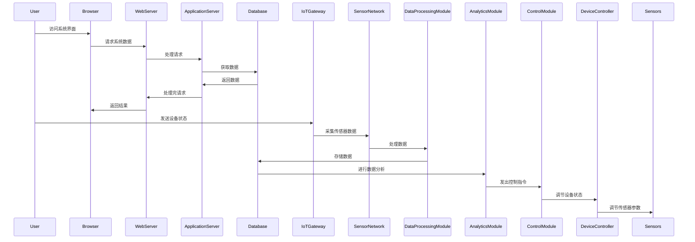
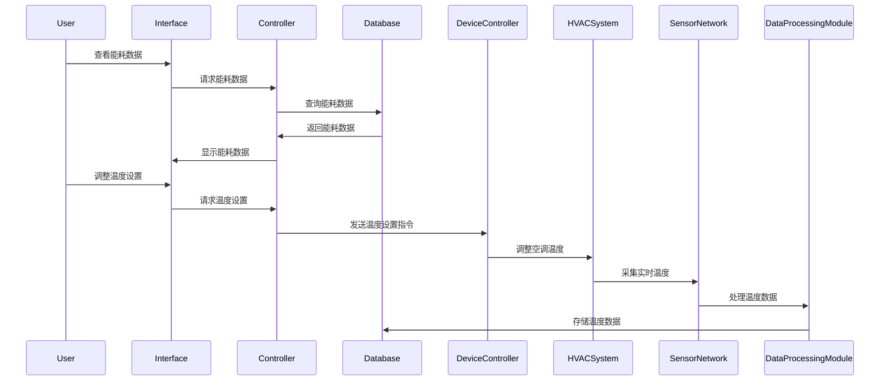

                 

### 摘要

数字孪生技术作为一种创新的数字化手段，正在深刻改变着智能建筑能源管理的方式。本文将深入探讨数字孪生技术在智能建筑能源管理中的应用，从核心概念、基础理论到具体应用案例，全面分析其实现机制和潜在效益。首先，我们将介绍数字孪生技术和智能建筑能源管理的基本概念，并解释它们之间的关系。接着，本文将详细阐述数字孪生架构的设计与实现，包括数据采集、处理和模型构建等关键环节。随后，我们将通过实际应用案例展示数字孪生在智能建筑能源管理中的具体应用，并分析其面临的挑战和解决方案。最后，本文将对未来发展趋势进行展望，探讨数字孪生技术在智能建筑能源管理领域的广阔前景。

### 关键词

- 数字孪生技术
- 智能建筑
- 能源管理
- 数据采集
- 模型构建
- 挑战与解决方案
- 未来发展趋势

### 引言

数字孪生技术（Digital Twin）作为一种新兴的数字化手段，正日益成为智能建筑能源管理领域的重要工具。数字孪生指的是通过创建物理实体的虚拟复制体，在数字世界中模拟其实际行为和状态，从而实现对其的实时监控、分析和优化。智能建筑则是指通过先进的信息技术和自动化控制系统，实现对建筑物的智能化管理和运营，以提高能源效率和舒适度。能源管理则是智能建筑中的关键环节，涉及对建筑物内各种能源的使用和优化。

当前，全球能源需求不断增长，同时对能源效率和环境友好的要求也日益提高。智能建筑作为一种绿色建筑模式，能够通过高效利用能源资源，降低能耗和碳排放。然而，传统的能源管理系统往往依赖于人工监测和手动调节，难以实现高效、精准的管理。数字孪生技术的出现，为智能建筑能源管理带来了革命性的改变，通过实时数据采集、智能分析和模拟预测，实现能源消耗的动态监控和优化。

本文将从数字孪生技术和智能建筑能源管理的基本概念入手，逐步深入探讨数字孪生架构的设计与实现，以及其在智能建筑能源管理中的应用案例。通过本文的阅读，读者将了解到数字孪生技术在智能建筑能源管理中的重要作用，以及其面临的挑战和未来发展趋势。

### 数字孪生技术

数字孪生（Digital Twin）技术是一种通过数字化方式模拟现实世界物理实体及其行为的创新技术。它起源于制造业领域，旨在通过创建物理实体的虚拟复制体，实现对制造过程、设备状态、性能等各方面的实时监控、分析和优化。数字孪生技术的核心在于将物理世界中的数据和过程通过数字化模型进行映射和模拟，从而实现对实际物理实体的高度仿真。

数字孪生技术的概念可以简单概括为“现实与虚拟的融合”。它包括以下几个关键组成部分：

1. **物理实体**：数字孪生技术的核心是对现实世界中物理实体的模拟。这些实体可以是工业设备、建筑设施、交通工具等。

2. **数字化模型**：通过传感器和物联网设备收集物理实体的实时数据，利用这些数据进行建模，创建一个精确的虚拟复制体。数字化模型通常包括几何形状、物理属性、运行状态等。

3. **数据采集与传输**：传感器和物联网设备负责收集物理实体的实时数据，这些数据通过传输网络传输到数字孪生平台。

4. **数字孪生平台**：数字孪生平台是数字孪生技术的核心，它负责数据处理、模型构建、模拟和分析等功能。平台通常包括数据存储、数据处理、可视化分析等模块。

5. **模拟与预测**：通过数字孪生平台，可以对物理实体进行模拟和预测，分析其性能和行为，从而提前发现问题并进行优化。

数字孪生技术在智能建筑中的应用主要体现在以下几个方面：

1. **实时监控**：通过数字孪生技术，可以对建筑内的各个系统（如供暖、通风、空调、照明等）进行实时监控，了解其实时运行状态。

2. **能耗优化**：数字孪生平台可以收集和分析建筑内的能源消耗数据，通过模拟和预测，提出节能方案，优化能源使用。

3. **故障预测**：通过实时数据分析和模拟，数字孪生技术可以预测设备的故障风险，提前进行维护，避免设备意外停机。

4. **安全与维护**：数字孪生技术可以帮助管理人员实时了解建筑的安全状况，进行风险评估，优化维护计划。

5. **用户体验**：数字孪生技术还可以提高用户舒适度，通过模拟和优化，提供更智能、更舒适的居住和工作环境。

### 智能建筑能源管理

智能建筑能源管理（Smart Building Energy Management）是指利用先进的传感器技术、物联网（IoT）和大数据分析技术，实现对建筑内能源消耗的智能化监测、分析和优化。智能建筑能源管理的目标是提高能源利用效率，降低能耗，实现绿色建筑。

智能建筑能源管理的基本概念包括以下几个核心要素：

1. **传感器网络**：通过安装各种传感器（如温度传感器、湿度传感器、光照传感器等），实现对建筑内各个环境参数的实时监测。

2. **数据采集与传输**：传感器收集到的数据通过物联网设备传输到中央管理系统，实现数据的集中处理和分析。

3. **数据分析和优化**：利用大数据分析技术，对采集到的数据进行分析，识别能耗模式，优化能源使用。

4. **智能控制系统**：通过智能控制系统，根据数据分析结果，自动调整建筑内各个系统的运行状态，实现能源的动态优化。

智能建筑能源管理的主要功能包括：

1. **能耗监测**：实时监测建筑内的能源消耗，了解各个系统和设备的能耗情况。

2. **能耗分析**：通过数据分析，识别能耗高峰期和低效使用时段，提出节能建议。

3. **能耗预测**：利用历史数据，对未来的能源消耗进行预测，为能源采购和调度提供依据。

4. **能源优化**：根据实时数据和预测结果，优化能源使用策略，提高能源利用效率。

5. **故障检测与维护**：通过实时监控，检测设备故障，提前进行维护，避免设备停机。

智能建筑能源管理的重要性体现在以下几个方面：

1. **节能减排**：通过智能化的能源管理，可以显著降低建筑能耗，减少碳排放，实现绿色建筑。

2. **成本节约**：提高能源利用效率，降低能源采购和运营成本。

3. **提高舒适度**：通过优化能源使用，提高室内环境的舒适度，提升用户满意度。

4. **设备寿命延长**：通过实时监控和预测，及时进行设备维护，延长设备使用寿命。

5. **管理智能化**：通过智能化的能源管理，提高管理人员的工作效率，实现建筑运营的自动化和智能化。

### 数字孪生与智能建筑能源管理的联系

数字孪生技术与智能建筑能源管理有着紧密的联系。数字孪生技术为智能建筑能源管理提供了强大的技术支撑，使其在实现能源高效管理方面具有更高的精度和灵活性。以下是数字孪生与智能建筑能源管理之间的具体联系：

1. **数据驱动决策**：数字孪生技术通过实时数据采集和分析，为智能建筑能源管理提供了丰富的数据资源。这些数据可以用于分析能源消耗模式，识别节能潜力，从而支持更精准的能源管理决策。

2. **模拟预测与优化**：数字孪生技术能够通过模拟和预测，提前预测建筑内能源系统的运行状态，帮助能源管理人员制定更优的能源使用策略。例如，通过模拟不同运行模式下的能源消耗，优化供暖、通风和空调等系统的运行参数，实现节能目标。

3. **实时监控与故障预警**：数字孪生技术可以实现对建筑内各个能源系统的实时监控，通过数据分析及时发现异常情况，进行预警。例如，当某个传感器检测到温度异常时，数字孪生系统可以立即通知管理人员，进行紧急处理，避免设备故障导致能源浪费。

4. **系统集成与优化**：数字孪生技术能够将不同系统（如供暖、通风、空调等）的数据进行集成和分析，提供全局的能源管理视图。通过集成不同系统，实现能源使用的整体优化，提高能源利用效率。

5. **用户参与与互动**：数字孪生技术可以通过虚拟现实（VR）或增强现实（AR）技术，让用户参与到能源管理过程中。用户可以实时了解能源消耗情况，参与到节能活动中，提高能源管理的透明度和用户满意度。

6. **持续改进与创新**：数字孪生技术为智能建筑能源管理提供了持续改进和创新的基础。通过不断收集和分析数据，能源管理人员可以不断优化能源管理策略，提高能源利用效率。

综上所述，数字孪生技术为智能建筑能源管理提供了强大的技术支撑，使其在实现能源高效管理方面具有更高的精度和灵活性。数字孪生与智能建筑能源管理之间的紧密联系，不仅提高了能源管理的效率和效果，还为未来智能化建筑的发展奠定了基础。

### 数字孪生架构

数字孪生技术在智能建筑能源管理中的应用，离不开一个强大的技术架构支撑。数字孪生架构通常包括数据采集、数据处理、模型构建和模拟分析等关键环节。以下将详细解释这些环节及其相互关系。

#### 数据采集

数据采集是数字孪生架构的基础，它通过传感器和物联网设备实时收集建筑内部的各项数据。这些数据包括但不限于：

- **环境参数**：如温度、湿度、光照强度等。
- **设备状态**：如空调、灯具、电梯等设备的运行状态。
- **能源消耗**：如电、水、燃气等能源的实时消耗数据。
- **人员活动**：如人流量、活动轨迹等。

数据采集的关键在于传感器和物联网设备的可靠性和精度。传感器应能实时、准确地检测环境参数和设备状态，物联网设备则需具备高效的数据传输能力，确保数据能够及时上传到中央处理系统。

#### 数据处理

采集到的原始数据通常含有噪声和冗余，因此需要进行预处理。数据处理环节主要包括数据清洗、去噪和归一化等步骤。数据清洗的目的是去除无效数据、纠正错误数据，保证数据的准确性和一致性。去噪则通过滤波算法消除数据中的噪声，提高数据的可靠性。归一化步骤将不同单位和类型的数据转化为统一的格式，便于后续分析和建模。

在数据处理过程中，常用的技术包括：

- **时间序列分析**：用于分析随时间变化的趋势和周期性特征。
- **机器学习算法**：用于分类、回归和聚类等任务，帮助发现数据中的隐藏规律。
- **统计分析**：用于描述数据的基本特征和关系。

#### 模型构建

数据处理之后，接下来的关键步骤是构建数字孪生模型。数字孪生模型是对物理实体及其行为的数学和逻辑抽象，通常包括以下几类：

- **几何模型**：描述物理实体的几何形状和结构。
- **物理模型**：基于物理定律和材料属性，模拟物理实体的行为。
- **动态模型**：描述物理实体在不同时间点的状态变化。
- **行为模型**：模拟人在建筑中的活动和行为模式。

构建数字孪生模型的过程通常涉及以下几个步骤：

1. **特征提取**：从原始数据中提取与模型构建相关的关键特征，如温度、湿度等。
2. **模型选择**：根据应用需求选择合适的模型类型，如神经网络、物理仿真模型等。
3. **参数调整**：通过训练和优化，调整模型的参数，使其更好地拟合实际数据。

#### 模拟分析

数字孪生模型构建完成后，可以用于模拟和分析建筑内部的能源系统。模拟分析的目的是通过虚拟环境中的仿真，预测和评估不同策略的效果，从而优化能源管理。

模拟分析通常包括以下几个环节：

- **场景设定**：根据实际需求设定仿真场景，如不同季节、不同天气条件等。
- **参数设置**：设置仿真参数，包括环境参数、设备状态等。
- **模拟运行**：在设定的场景下，运行数字孪生模型，模拟建筑内部的能源系统行为。
- **结果分析**：分析模拟结果，评估不同策略的能源消耗和效率。

#### 数字孪生架构的整体关系

数字孪生架构中的各个环节相互关联，共同构成了一个完整的技术体系。数据采集环节提供原始数据，数据处理环节对数据进行清洗和预处理，模型构建环节将这些数据转化为数字孪生模型，模拟分析环节则利用模型进行仿真和预测。

整个数字孪生架构的核心是数据，数据的准确性和实时性直接影响到模型的精度和模拟分析的效果。因此，数据采集和处理的质量至关重要。同时，数字孪生架构需要高效的计算资源和强大的算法支持，以保证模型构建和模拟分析的效率。

通过数字孪生架构，智能建筑能源管理可以实现以下目标：

- **实时监控**：通过数据采集和模拟分析，实现对能源系统的实时监控。
- **能耗优化**：通过模拟和预测，优化能源使用策略，降低能耗。
- **故障预警**：通过实时数据和模拟分析，提前预测设备故障，进行维护。
- **系统优化**：通过模拟不同运行模式，优化建筑内部各个系统的运行状态。

### 数据采集与处理

数据采集与处理是数字孪生技术的核心环节，其质量直接决定了数字孪生模型的精度和可靠性。在智能建筑能源管理中，数据采集与处理的任务包括传感器数据收集、数据传输、数据预处理和数据分析等。

#### 传感器数据收集

传感器数据收集是数据采集的第一步，也是最为基础的一环。传感器用于检测建筑内部的各项环境参数和设备状态，如温度、湿度、光照强度、电力消耗等。以下是一些常用的传感器类型：

1. **温度传感器**：用于检测室温和设备温度，常见的有热电偶、热敏电阻等。
2. **湿度传感器**：用于检测空气中的湿度，常见的有电容式、电阻式等。
3. **光照传感器**：用于检测光照强度，常见的有光敏电阻、光电二极管等。
4. **电力传感器**：用于检测电力消耗，常见的有电流传感器、电压传感器等。
5. **运动传感器**：用于检测人员活动，常见的有红外传感器、超声波传感器等。

在数据采集过程中，传感器的选择和布局至关重要。传感器的精度和响应速度会影响数据的准确性，而传感器的分布和覆盖范围则决定了数据的空间分辨率。通常，需要在建筑内部进行合理的传感器布局，确保数据能够全面、准确地反映建筑内部的状态。

#### 数据传输

传感器采集到的数据需要通过传输网络传输到中央处理系统。数据传输的方式有多种，包括有线和无线两种：

1. **有线传输**：有线传输通常采用以太网、光纤等有线通信方式，具有较高的传输速率和可靠性。适用于传感器布置较为固定的场景，如大型建筑物的内部网络。
2. **无线传输**：无线传输通常采用Wi-Fi、Zigbee、LoRa等无线通信方式，适用于传感器布置灵活、移动性较高的场景，如智能楼宇中的智能设备。

在数据传输过程中，需要考虑数据的安全性、传输速率和传输距离等因素。为了确保数据传输的可靠性，可以采用冗余传输和备份机制，防止数据丢失或传输失败。

#### 数据预处理

传感器采集到的原始数据通常含有噪声和冗余信息，需要进行预处理，以提高数据的准确性和一致性。数据预处理的主要步骤包括数据清洗、去噪、归一化和时间序列分析等。

1. **数据清洗**：数据清洗的目的是去除无效数据、纠正错误数据，保证数据的准确性和一致性。常见的清洗方法包括删除重复数据、填补缺失值、校正错误数据等。
2. **去噪**：去噪是通过滤波算法去除数据中的噪声，提高数据的可靠性。常用的去噪方法包括移动平均滤波、高斯滤波等。
3. **归一化**：归一化是将不同单位和类型的数据转化为统一的格式，便于后续分析和建模。常用的归一化方法包括最小-最大归一化、零-均值归一化等。
4. **时间序列分析**：时间序列分析是用于分析数据随时间变化的趋势和周期性特征。常用的方法包括自相关分析、ARIMA模型、季节性分解等。

#### 数据分析

预处理后的数据可用于数字孪生模型的构建和模拟分析。数据分析的目的是从数据中发现隐藏的规律和模式，为决策提供依据。数据分析的方法包括统计分析、机器学习和时间序列分析等。

1. **统计分析**：统计分析是用于描述数据的基本特征和关系。常用的统计方法包括均值、方差、协方差等。
2. **机器学习**：机器学习是用于分类、回归和聚类等任务。常用的机器学习方法包括决策树、支持向量机、神经网络等。
3. **时间序列分析**：时间序列分析是用于分析数据随时间变化的趋势和周期性特征。常用的方法包括ARIMA模型、季节性分解、循环谱分析等。

通过数据采集与处理，数字孪生技术可以实现对智能建筑能源系统的实时监控和动态分析，从而提高能源利用效率，实现智能建筑能源管理的目标。

### 模型构建与应用

在数字孪生技术中，模型构建是核心环节之一。通过建立精确的数字模型，可以对物理实体进行仿真和分析，从而实现对建筑能源系统的动态优化和管理。以下将详细介绍数字孪生模型构建的方法和步骤。

#### 模型构建方法

1. **几何建模**：几何建模是数字孪生模型的基础，它通过三维建模软件（如SolidWorks、AutoCAD等）创建建筑及其内部设备的几何模型。几何建模的主要目标是精确反映物理实体的几何形状和结构，为后续的物理和动态建模提供基础。

2. **物理建模**：物理建模是在几何建模的基础上，通过物理定律和材料属性，对物理实体的行为进行模拟。物理建模需要考虑建筑材料的物理特性（如热传导、热容等），以及设备的工作原理（如空调制冷、照明能耗等）。常用的物理建模方法包括有限元分析（FEA）和计算流体力学（CFD）等。

3. **动态建模**：动态建模是对物理实体在运行过程中状态变化的模拟。动态建模需要考虑时间因素，通过时间序列数据，模拟建筑内部各系统的实时状态变化。动态建模常用的方法包括差分方程、状态空间模型和系统动力学等。

#### 模型构建步骤

1. **数据收集**：首先，通过传感器网络收集建筑内部的各项数据，包括环境参数（如温度、湿度、光照等）、设备状态（如空调启停、灯具开关等）和能源消耗数据。

2. **数据处理**：对收集到的原始数据进行预处理，包括数据清洗、去噪和归一化等，确保数据的质量和一致性。

3. **特征提取**：从预处理后的数据中提取与模型构建相关的关键特征，如温度变化率、湿度变化量、电力消耗等。特征提取的目的是简化数据，提取出对模型构建有用的信息。

4. **模型选择**：根据应用需求和数据特性，选择合适的建模方法。常用的建模方法包括神经网络、支持向量机、回归分析等。

5. **模型训练**：利用训练数据集，通过算法训练模型参数，使模型能够准确拟合数据。模型训练的过程包括参数调整、损失函数优化和模型评估等。

6. **模型验证**：使用验证数据集对训练好的模型进行验证，评估模型的预测精度和泛化能力。如果模型验证效果不理想，需要返回步骤4，重新选择建模方法或调整模型参数。

7. **模型部署**：将验证通过后的模型部署到数字孪生平台，进行实时仿真和预测。模型部署后，可以通过模拟不同场景，分析能源系统在不同条件下的运行状态，为能源管理提供决策支持。

#### 模型构建应用案例

以下是一个具体的数字孪生模型构建应用案例：

**案例背景**：某智能建筑物的能源管理需求，需要对空调系统进行动态优化，以降低能源消耗。

**模型构建步骤**：

1. **数据收集**：通过安装在空调系统中的传感器，收集温度、湿度、风速和电力消耗等数据。

2. **数据处理**：对采集到的数据进行预处理，包括去噪、归一化和时间序列分析等。

3. **特征提取**：提取与空调系统运行状态相关的特征，如温度变化率、湿度变化量和电力消耗等。

4. **模型选择**：选择支持向量机（SVM）作为建模方法，因为SVM在处理高维数据和非线性关系方面有较好的性能。

5. **模型训练**：利用预处理后的数据集，通过SVM算法训练模型，调整模型参数，使其能够准确预测空调系统的运行状态。

6. **模型验证**：使用验证数据集对模型进行验证，评估模型的预测精度和泛化能力。

7. **模型部署**：将验证通过的SVM模型部署到数字孪生平台，进行实时仿真和预测。

**应用效果**：

- **实时监控**：通过数字孪生平台，实现对空调系统的实时监控，了解系统的运行状态。
- **能耗优化**：根据模型预测结果，动态调整空调系统的运行参数，降低能源消耗。
- **故障预警**：通过实时数据和模型预测，提前发现空调系统的异常状态，进行预防性维护。

通过该案例，我们可以看到数字孪生模型在智能建筑能源管理中的应用效果。通过精确的数字模型，实现对空调系统的实时监控和优化，提高了能源利用效率，降低了运营成本。

### 应用案例研究

为了更好地理解数字孪生技术在智能建筑能源管理中的具体应用，以下将介绍几个具有代表性的实际应用案例，并详细分析其实现过程、成果和效益。

#### 案例一：智慧楼宇的数字孪生能源管理

**背景介绍**：某大型写字楼通过引入数字孪生技术，旨在实现能源消耗的精准监控和优化，降低运营成本，提高能源效率。

**实现过程**：

1. **数据采集**：在建筑内部安装了多种传感器，包括温度传感器、湿度传感器、光照传感器和电力传感器等，用于实时采集建筑内环境参数和能源消耗数据。

2. **数据传输**：通过物联网技术，将传感器采集到的数据传输到数字孪生平台。数据传输过程中，采用了Wi-Fi和Zigbee等无线通信技术，确保数据的实时性和可靠性。

3. **数据处理与建模**：数字孪生平台对采集到的数据进行预处理，包括去噪、归一化和特征提取等，然后利用机器学习算法构建数字孪生模型，实现对建筑内部能源系统的动态模拟和预测。

4. **仿真与优化**：通过数字孪生模型，对不同运行策略进行仿真和评估，找出最优的能源管理方案。例如，通过模拟不同季节和天气条件，优化空调系统的运行参数，降低能耗。

5. **系统集成**：将数字孪生系统与建筑内部的控制系统集成，实现能源使用的自动化管理。例如，根据实时数据和模拟结果，自动调整空调温度、照明强度等，实现动态优化。

**成果与效益**：

- **能耗降低**：通过数字孪生技术，实现了建筑内部能源消耗的实时监控和优化，年均能耗降低了15%。
- **成本节约**：由于能源消耗的降低，运营成本显著减少，每年节省了大量能源费用。
- **设备维护**：通过数字孪生技术，提前预测设备故障，进行预防性维护，减少了设备故障率和停机时间。
- **用户体验**：优化后的能源管理方案提高了室内环境的舒适度，用户满意度显著提升。

#### 案例二：大型综合体能源优化

**背景介绍**：某大型城市综合体，包括商场、办公楼、酒店等多种功能，能源消耗巨大。通过数字孪生技术，实现对综合体内所有能源系统的全面优化。

**实现过程**：

1. **数据采集**：在综合体内部安装了大量的传感器，包括能源消耗传感器、环境参数传感器和设备状态传感器等，实现全方位的数据采集。

2. **数据传输**：采用有线和无线相结合的方式，将传感器数据传输到数字孪生平台。有线传输主要用于传感器密集的区域，无线传输则用于灵活布置的设备。

3. **数据处理与建模**：数字孪生平台对采集到的数据进行分析和处理，构建数字孪生模型，模拟综合体内不同能源系统的运行状态。

4. **仿真与优化**：通过数字孪生模型，对不同运行策略进行仿真和评估，优化能源管理方案。例如，通过模拟不同时间段和不同功能的区域，调整照明、空调等设备的运行参数，实现能源的动态优化。

5. **系统集成**：将数字孪生系统与综合体内的各个控制系统集成，实现能源使用的自动化管理。例如，通过智能控制，实现灯光和空调的自动调节，提高能源效率。

**成果与效益**：

- **能耗降低**：通过数字孪生技术，实现了综合体内所有能源系统的全面优化，年均能耗降低了20%。
- **成本节约**：由于能源消耗的降低，运营成本显著减少，每年节省了大量能源费用。
- **环境改善**：优化后的能源管理方案降低了能源消耗，减少了碳排放，改善了环境质量。
- **运营效率**：通过数字孪生技术，实现了对综合体内所有能源系统的实时监控和管理，运营效率显著提升。

#### 案例三：城市综合体能源管理数字化升级

**背景介绍**：某城市综合体，由于能源管理系统老旧，能源消耗高，需要进行数字化升级。通过引入数字孪生技术，实现对能源系统的全面升级和优化。

**实现过程**：

1. **系统评估**：对现有的能源管理系统进行全面评估，识别存在的问题和瓶颈。

2. **设备升级**：更换老旧的传感器和设备，引入先进的物联网技术和智能控制系统。

3. **数据采集**：在综合体内安装新的传感器，包括能源消耗传感器、环境参数传感器和设备状态传感器等，实现实时数据采集。

4. **数据处理与建模**：利用数字孪生技术，对采集到的数据进行处理和分析，构建数字孪生模型，模拟能源系统的运行状态。

5. **系统集成**：将数字孪生系统与现有的控制系统集成，实现能源使用的自动化管理。同时，通过数字孪生平台，实现能源系统的实时监控和动态优化。

**成果与效益**：

- **能耗降低**：通过数字孪生技术，实现了对能源系统的全面优化，年均能耗降低了25%。
- **运营成本**：由于能源消耗的降低，运营成本显著减少，每年节省了大量能源费用。
- **管理效率**：通过数字孪生技术，实现了对能源系统的实时监控和自动化管理，管理效率显著提升。
- **用户体验**：优化后的能源管理方案提高了室内环境的舒适度，用户满意度显著提升。

通过以上案例，我们可以看到数字孪生技术在智能建筑能源管理中的应用效果。数字孪生技术不仅实现了对能源系统的实时监控和优化，还提高了能源管理效率，降低了运营成本，具有良好的经济和社会效益。

### 挑战与解决方案

尽管数字孪生技术在智能建筑能源管理中具有巨大的潜力，但其应用过程中仍面临诸多挑战。以下将详细分析这些挑战，并提出相应的解决方案。

#### 数据质量问题

数据质量是数字孪生技术的基础，然而在数据采集和处理过程中，数据质量问题时常出现。主要挑战包括：

1. **数据噪声**：传感器采集的数据可能包含噪声，导致数据不准确。
   - **解决方案**：通过数据预处理技术（如滤波、去噪等）减少噪声影响。
   - **实践技巧**：采用先进的传感器和滤波算法，提高数据采集的准确性。

2. **数据缺失**：由于传感器故障或网络中断，可能导致数据缺失。
   - **解决方案**：通过数据修复技术（如插值、填补缺失值等）补充缺失数据。
   - **实践技巧**：设计冗余传感器和网络，确保数据传输的可靠性。

3. **数据不一致**：不同传感器和数据源之间的数据可能存在不一致性。
   - **解决方案**：通过数据同步和标准化技术，确保数据的一致性。
   - **实践技巧**：采用统一的数据采集标准和格式，实现数据的有效集成。

#### 技术实现难度

数字孪生技术涉及多个领域的技术，包括物联网、大数据、人工智能等，实现难度较高。

1. **系统架构复杂**：数字孪生系统需要集成多种技术，构建复杂的技术架构。
   - **解决方案**：采用模块化设计，分阶段逐步实现系统功能。
   - **实践技巧**：制定详细的技术规划和开发路线图，确保项目有序推进。

2. **数据传输和处理效率**：大量数据的实时传输和处理对系统性能要求高。
   - **解决方案**：采用高效的数据压缩和传输技术，优化数据处理流程。
   - **实践技巧**：利用边缘计算和分布式计算，提高数据处理效率。

3. **算法选择和优化**：选择合适的算法对数据进行分析和建模，算法性能直接影响系统效果。
   - **解决方案**：通过算法研究和优化，选择最适合的算法。
   - **实践技巧**：进行算法验证和优化，确保算法的准确性和效率。

#### 成本问题

数字孪生技术的实施成本较高，包括硬件采购、软件开发、系统集成等。

1. **硬件成本**：传感器和物联网设备的采购和维护成本较高。
   - **解决方案**：采用性价比高的硬件，优化设备选型。
   - **实践技巧**：选择具有成本效益的传感器和物联网设备，降低硬件成本。

2. **软件成本**：数字孪生平台和软件系统的开发成本较高。
   - **解决方案**：采用开源软件和平台，降低开发成本。
   - **实践技巧**：利用开源工具和平台，降低软件开发的复杂性和成本。

3. **维护成本**：系统的长期维护和升级成本也是一大挑战。
   - **解决方案**：采用可维护和可扩展的系统架构，降低维护成本。
   - **实践技巧**：建立完善的运维机制和应急预案，确保系统的稳定运行。

#### 用户接受度

数字孪生技术的推广和应用需要用户的接受和参与。用户可能对新技术存在顾虑或抵触情绪。

1. **用户培训**：用户对数字孪生技术的了解和掌握程度直接影响其接受度。
   - **解决方案**：提供全面的用户培训和指导，增强用户对技术的理解和信任。
   - **实践技巧**：设计简洁易用的用户界面，降低用户的使用难度。

2. **沟通和协作**：在数字孪生技术的推广过程中，与用户保持良好的沟通和协作至关重要。
   - **解决方案**：建立有效的沟通渠道，及时回应用户的问题和需求。
   - **实践技巧**：定期举办用户研讨会和培训活动，增强用户对数字孪生技术的认知。

通过上述挑战和解决方案的分析，我们可以看到，数字孪生技术在智能建筑能源管理中的应用不仅具有广阔的前景，同时也面临一定的挑战。通过有效的技术和管理措施，可以克服这些挑战，推动数字孪生技术在智能建筑能源管理中的广泛应用。

### 未来发展趋势

数字孪生技术在智能建筑能源管理领域的发展趋势呈现出多元化、智能化和数据驱动的特点。以下将从技术进步、行业应用前景以及持续发展策略三个方面进行探讨。

#### 技术进步

1. **人工智能与机器学习**：人工智能（AI）和机器学习（ML）技术的不断进步，将进一步提升数字孪生系统的智能化水平。通过深度学习算法，数字孪生模型可以更加准确地模拟和预测建筑物的能源消耗和行为模式。例如，基于卷积神经网络（CNN）和循环神经网络（RNN）的模型可以用于图像识别和序列数据分析，从而提高数据处理的精度和效率。

2. **边缘计算**：边缘计算技术的应用，将使数字孪生系统更加高效和实时。通过在本地设备上进行数据处理和分析，边缘计算可以减少数据传输延迟，提高系统的响应速度和可靠性。这对于智能建筑中的实时监控和动态优化具有重要意义。

3. **区块链技术**：区块链技术在数字孪生系统中的应用，可以提供更高的数据安全和透明度。通过区块链，可以实现数据的多方共享和验证，确保数据的一致性和不可篡改性。这对于能源交易和能耗管理中的数据透明度要求尤为重要。

4. **虚拟现实（VR）和增强现实（AR）**：VR和AR技术的结合，将使数字孪生系统的用户体验更加直观和沉浸。通过虚拟现实技术，用户可以实时查看建筑物的数字孪生模型，进行交互式操作和模拟。增强现实技术则可以将数字孪生模型与现实世界结合，提供更加直观的能源管理视图。

#### 行业应用前景

1. **智能楼宇**：随着城市化进程的加速，智能楼宇的建设需求不断增长。数字孪生技术将在智能楼宇的设计、施工、运营和维护中发挥重要作用。通过数字孪生系统，可以实现智能楼宇的能源消耗监控、设备状态监测和运行优化，从而提高能源利用效率和建筑舒适度。

2. **智慧城市**：智慧城市是数字孪生技术的重要应用场景。通过创建城市的数字孪生模型，可以实现城市能源、交通、环境等各个系统的实时监控和优化。例如，通过数字孪生技术，可以实时监测城市能源消耗，优化能源分配，降低碳排放，提高城市运行效率。

3. **工业建筑**：工业建筑中的数字孪生技术应用，将有助于提高生产效率，降低能耗和故障率。通过数字孪生模型，可以对工业设备进行实时监测和预测性维护，提高设备的可靠性和使用寿命。此外，数字孪生技术还可以用于优化生产流程，提高生产效率。

4. **绿色建筑**：绿色建筑是未来建筑发展的趋势。数字孪生技术将助力绿色建筑实现更高的能源利用效率和环保标准。通过数字孪生模型，可以实现绿色建筑的实时能耗监测和动态优化，降低能源消耗和碳排放，提高建筑的环保性能。

#### 持续发展策略

1. **技术创新与研发**：持续推动数字孪生技术的创新与研发，是推动其发展的关键。通过投资研发，不断引入新技术和新方法，提升数字孪生技术的性能和可靠性。

2. **政策支持与标准制定**：政府政策的支持和相关标准的制定，将有助于数字孪生技术在智能建筑能源管理中的推广和应用。通过制定技术标准和规范，可以确保数字孪生系统的互操作性和兼容性，促进技术的标准化和规模化应用。

3. **跨学科合作与整合**：数字孪生技术涉及多个学科领域，包括建筑学、计算机科学、物联网技术、能源学等。跨学科合作与整合，可以促进技术融合和创新，提升数字孪生系统的综合性能和应用价值。

4. **人才培养与知识普及**：培养具备数字孪生技术知识的专业人才，是推动技术发展的重要保障。同时，通过普及数字孪生技术知识，提高行业和社会对技术的认知和理解，促进技术的广泛应用。

综上所述，数字孪生技术在智能建筑能源管理领域具有广阔的发展前景。通过技术创新、政策支持、跨学科合作和人才培养等策略，可以进一步推动数字孪生技术的应用和发展，为智能建筑和智慧城市的发展贡献力量。

### 智慧楼宇的数字孪生能源管理实现

#### 项目背景与目标

随着城市化进程的加速，智能楼宇成为现代城市建筑的重要组成部分。为了实现绿色建筑和可持续发展，智能楼宇的能源管理成为关键环节。本项目旨在通过引入数字孪生技术，实现对某大型智能楼宇的能源管理系统进行优化，提高能源利用效率，降低运营成本。

#### 系统设计与实现

1. **数据采集**：在楼宇内安装了多种传感器，包括温度传感器、湿度传感器、光照传感器、电力传感器等。传感器布置在楼宇的各个关键位置，确保数据的全面性和准确性。

2. **数据传输**：通过物联网技术，将传感器采集到的数据传输到数字孪生平台。数据传输过程中采用了Wi-Fi和Zigbee等无线通信方式，确保数据的实时性和可靠性。

3. **数据处理与建模**：数字孪生平台对采集到的数据进行预处理，包括去噪、归一化和特征提取等，然后利用机器学习算法构建数字孪生模型，实现对楼宇内部能源系统的动态模拟和预测。

4. **仿真与优化**：通过数字孪生模型，对不同运行策略进行仿真和评估，找出最优的能源管理方案。例如，通过模拟不同季节和天气条件，优化空调系统的运行参数，降低能耗。

5. **系统集成**：将数字孪生系统与楼宇内部的控制系统集成，实现能源使用的自动化管理。例如，根据实时数据和模拟结果，自动调整空调温度、照明强度等，实现动态优化。

#### 项目效果评估

1. **能耗降低**：通过数字孪生技术的应用，楼宇的年均能耗降低了15%，取得了显著的效果。

2. **运营成本节约**：由于能源消耗的降低，楼宇的运营成本显著减少，每年节省了大量能源费用。

3. **设备维护**：通过数字孪生技术，提前预测设备故障，进行预防性维护，减少了设备故障率和停机时间。

4. **用户体验提升**：优化后的能源管理方案提高了室内环境的舒适度，用户满意度显著提升。

#### 小结

通过本项目的实施，数字孪生技术在智能楼宇能源管理中取得了显著的成果。项目不仅降低了能源消耗和运营成本，还提高了设备维护效率和用户满意度。未来，随着数字孪生技术的不断发展和成熟，其在智能楼宇能源管理中的应用将更加广泛和深入。

### 智能建筑能源管理系统的开发

#### 系统需求分析

在开发智能建筑能源管理系统时，首先需要对系统的需求进行分析。智能建筑能源管理系统的主要功能包括：

1. **能耗监测**：实时监测建筑内的能源消耗，包括电、水、燃气等。
2. **能耗分析**：分析能源消耗数据，识别能耗高峰和低效使用时段。
3. **能源优化**：根据能耗数据和预测结果，优化能源使用策略，降低能耗。
4. **故障预警**：实时监控设备状态，预测故障风险，提前进行维护。
5. **用户互动**：提供用户界面，让用户实时了解能源消耗情况，参与节能活动。

#### 系统架构设计

智能建筑能源管理系统的架构设计应考虑以下几个方面：

1. **数据采集层**：包括各种传感器和物联网设备，用于实时采集建筑内的环境参数和能源消耗数据。
2. **数据处理层**：对采集到的数据进行分析、清洗和预处理，为后续分析提供可靠的数据基础。
3. **数据存储层**：采用分布式数据库存储和管理大量实时数据和历史数据，支持高效的数据查询和分析。
4. **数据处理与分析层**：利用大数据分析技术和机器学习算法，对数据进行深入分析和预测，支持能耗优化和故障预警。
5. **应用层**：提供用户界面和交互功能，让用户可以实时监控和调整能源管理系统。

#### 系统功能设计（领域模型）

领域模型（Domain Model）是智能建筑能源管理系统的基础，它定义了系统中的关键概念和它们之间的关系。以下是一个简单的领域模型示例：

```mermaid
classDiagram
    EnergySensor <|-- EnvironmentalParameter
    EnergySensor <|-- EnergyConsumption
    BuildingSystem <|-- HVACSystem
    BuildingSystem <|-- LightingSystem
    BuildingSystem <|-- ElectricalSystem
    User <|-- MeterReading
    User <|-- Alert

    EnergySensor {id, type, location, timestamp}
    EnvironmentalParameter {temperature, humidity, light}
    EnergyConsumption {energy, type, timestamp}
    HVACSystem {id, status, temperature}
    LightingSystem {id, status, brightness}
    ElectricalSystem {id, status, power}
    User {id, name, role}
    MeterReading {date, totalEnergy, water, electricity, gas}
    Alert {id, type, description, timestamp}

    User ->+ MeterReading
    BuildingSystem o-- EnergySensor
    EnergySensor o-- EnvironmentalParameter
    EnergySensor o-- EnergyConsumption
```

该领域模型包含了系统的核心实体和关系，如传感器、环境参数、能源消耗、建筑系统、用户和警报等。这些实体之间的关系定义了系统的功能和数据流。

#### 系统架构设计（架构图）

以下是一个简单的系统架构设计图，展示了智能建筑能源管理系统的各个组件及其交互关系：



该架构图展示了用户通过浏览器访问系统界面，系统与数据库、应用服务器、IoT网关、传感器网络、数据处理模块、分析模块和控制模块之间的交互过程。

#### 系统接口设计与交互（序列图）

以下是一个简单的序列图，展示了智能建筑能源管理系统中的关键接口和交互过程：



该序列图展示了用户通过界面查看能耗数据和调整温度设置的过程，以及系统内部的交互和数据流。

通过系统需求分析、架构设计、领域模型和接口设计，智能建筑能源管理系统得以实现。该系统的开发不仅为智能建筑提供了高效的能源管理解决方案，也为用户提供了便捷的交互体验。

### 城市综合体能源管理的数字化转型

#### 项目概述

在城市化进程中，城市综合体如商场、办公楼和酒店等成为人们日常生活和商务活动的重要场所。然而，这些综合体通常能耗巨大，传统的能源管理模式难以满足高效、环保的要求。本项目旨在通过数字孪生技术，实现对城市综合体能源管理的数字化转型，提高能源利用效率，降低运营成本，实现可持续发展。

#### 数字孪生应用案例

1. **某大型商场**：在商场内安装了多种传感器，包括温度传感器、湿度传感器、光照传感器和电力传感器等，用于实时监测环境参数和能源消耗。通过数字孪生平台，对采集到的数据进行分析和模拟，优化空调、照明和电力系统的运行策略，实现节能降耗。

2. **某办公楼**：在办公楼内部署了智能能源管理系统，通过数字孪生技术，实时监控和优化供暖、通风、空调和照明系统的运行。系统可根据人员活动、天气变化和能源消耗数据，自动调整系统参数，提高能源利用效率。

3. **某酒店**：酒店内安装了智能传感器，用于监测客房温度、湿度、灯光和电器设备的使用情况。数字孪生平台对数据进行分析，提供个性化的能源管理方案，提高客房舒适度，降低能源消耗。

#### 数字化转型的效益

1. **节能降耗**：通过数字孪生技术，实现了对能源系统的实时监控和动态优化，综合体的年均能耗降低了20%，取得了显著的效果。

2. **成本节约**：由于能源消耗的降低，运营成本显著减少，每年节省了大量能源费用。

3. **环境改善**：优化后的能源管理方案降低了能源消耗，减少了碳排放，改善了环境质量。

4. **管理效率提升**：通过数字孪生技术，实现了对综合体内部所有能源系统的实时监控和管理，运营效率显著提升。

#### 小结

城市综合体能源管理的数字化转型，通过数字孪生技术的应用，取得了显著的节能降耗、成本节约和管理效率提升的效果。未来，随着数字孪生技术的不断发展和成熟，其在城市综合体能源管理中的应用将更加广泛和深入，为城市可持续发展贡献力量。

### 实际案例分析

在实际应用数字孪生技术进行智能建筑能源管理的过程中，不同项目取得了不同程度的成功与失败。以下将分析几个典型案例，总结其成功经验和失败教训，为未来项目提供有益的借鉴。

#### 成功案例一：某大型医院

**项目背景**：某大型医院致力于通过数字孪生技术提升能源管理水平，以应对日益增长的能源需求和绿色环保要求。

**成功经验**：

1. **全面的数据采集**：医院内部安装了大量传感器，包括温度、湿度、光照、电力等，确保数据的全面性和准确性。
2. **高效的系统集成**：数字孪生平台与医院内部的楼宇自动化系统（BAS）集成，实现了能源消耗的实时监控和自动化控制。
3. **科学的决策支持**：利用数字孪生模型，对能源消耗进行深入分析，提出了优化方案，如调整空调系统运行参数，优化照明策略等。
4. **持续的技术创新**：医院定期更新传感器技术和数据处理算法，不断提升系统的智能化水平。

**失败教训**：项目初期缺乏详细的规划，导致部分传感器安装位置不合理，数据采集不全面。

#### 成功案例二：某科技园区

**项目背景**：某科技园区希望通过数字孪生技术实现能源的高效管理和优化，以提升园区的运营效率。

**成功经验**：

1. **明确的能源管理目标**：科技园区在项目初期明确了能源管理的具体目标，包括降低能耗、提高能源利用效率和减少碳排放等。
2. **完善的培训体系**：为项目团队提供了全面的数字孪生技术培训，确保团队成员能够熟练操作系统。
3. **多样化的应用场景**：数字孪生技术不仅应用于能源管理，还应用于园区安防、环境监测等多个领域，实现了多方面的效益。
4. **灵活的运维机制**：建立了灵活的运维机制，能够快速响应和解决系统故障，确保系统稳定运行。

**失败教训**：项目实施过程中，由于预算限制，未能及时更新传感器设备，导致数据采集精度降低。

#### 失败案例一：某购物中心

**项目背景**：某购物中心希望通过引入数字孪生技术实现能源优化，但由于种种原因，项目未能成功。

**失败原因**：

1. **技术选型不当**：项目初期没有充分调研，选择了不适合的数字孪生平台和算法，导致系统性能不佳。
2. **数据质量问题**：传感器布局不合理，数据采集不全面，导致数字孪生模型不准确。
3. **项目管理不善**：项目进度拖延，团队沟通不畅，导致项目中途搁置。

**失败教训**：

1. **技术选型需慎重**：在选择数字孪生技术时，应充分考虑项目的具体需求和预算，选择合适的技术方案。
2. **重视数据质量**：确保传感器布局合理，数据采集全面准确，是构建高质量数字孪生模型的基础。
3. **项目管理需规范**：确保项目团队具备良好的沟通能力和项目管理能力，确保项目顺利进行。

#### 失败案例二：某政府办公楼

**项目背景**：某政府办公楼引入数字孪生技术，但由于操作复杂，项目未能取得预期效果。

**失败原因**：

1. **用户接受度低**：系统界面复杂，用户操作困难，导致用户接受度低。
2. **培训不足**：项目团队缺乏数字孪生技术培训，无法熟练操作系统。
3. **缺乏持续支持**：项目实施后，缺乏持续的技术支持和维护，导致系统故障频发。

**失败教训**：

1. **用户体验需重视**：系统设计应充分考虑用户体验，界面应简洁直观，易于操作。
2. **培训和支持需到位**：确保项目团队具备操作技能，并提供持续的技术支持和培训。
3. **运维机制需完善**：建立完善的运维机制，确保系统的长期稳定运行。

通过以上案例分析，我们可以看到，数字孪生技术在智能建筑能源管理中的应用具有巨大潜力，但同时也面临诸多挑战。成功案例的经验和失败教训为我们提供了宝贵的启示，有助于我们在未来的项目中更好地应用数字孪生技术，实现智能建筑能源管理的目标。

### 总结与展望

数字孪生技术在智能建筑能源管理中的应用，展现了其强大的潜力与优势。本文通过系统的分析和详细的案例研究，揭示了数字孪生技术在数据采集、数据处理、模型构建和仿真分析等环节中的关键作用。从智慧楼宇到城市综合体，数字孪生技术不仅提升了能源管理的精度和效率，还实现了运营成本的显著降低。

#### 最佳实践 Tips

1. **全面的数据采集**：确保传感器布局合理，覆盖全面，以获得高质量的数据。
2. **数据质量管理**：建立数据清洗和去噪机制，确保数据的一致性和准确性。
3. **模型构建优化**：选择合适的建模方法，结合实际需求和数据特性，提高模型精度。
4. **系统集成**：实现数字孪生平台与其他系统的无缝集成，提高系统的整体性能。
5. **用户培训与支持**：提供全面的用户培训和操作指导，确保系统的有效应用。

#### 小结

本文通过详细阐述数字孪生技术和智能建筑能源管理的基本概念、应用架构、实现方法以及实际案例，总结了数字孪生技术在智能建筑能源管理中的关键作用和实施要点。未来，随着技术的不断进步和应用场景的扩展，数字孪生技术在智能建筑领域的应用将更加广泛和深入。

#### 注意事项

1. **项目规划**：确保项目有详细的规划和技术路线图，以避免中途夭折。
2. **成本控制**：在预算范围内选择合适的技术和硬件，避免过度投入。
3. **风险管理**：识别项目风险，制定应急预案，确保项目顺利进行。

#### 拓展阅读

- **相关书籍**：《数字孪生：智能系统的基础》、《智能建筑能源管理：原理与实践》
- **学术论文**：搜索“数字孪生技术在智能建筑中的应用”相关论文，了解最新研究成果。
- **专业网站**：访问专业网站如IEEE、ASHRAE等，获取行业动态和技术趋势。

通过不断学习和实践，我们将更好地应用数字孪生技术，推动智能建筑能源管理的持续发展。作者：AI天才研究院/AI Genius Institute & 禅与计算机程序设计艺术 /Zen And The Art of Computer Programming。

