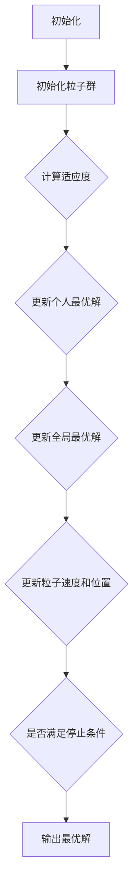
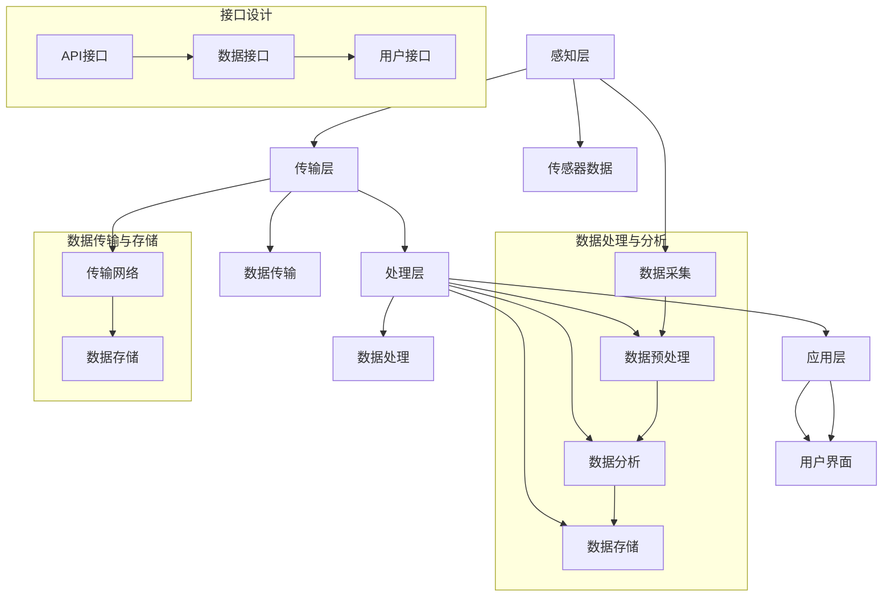
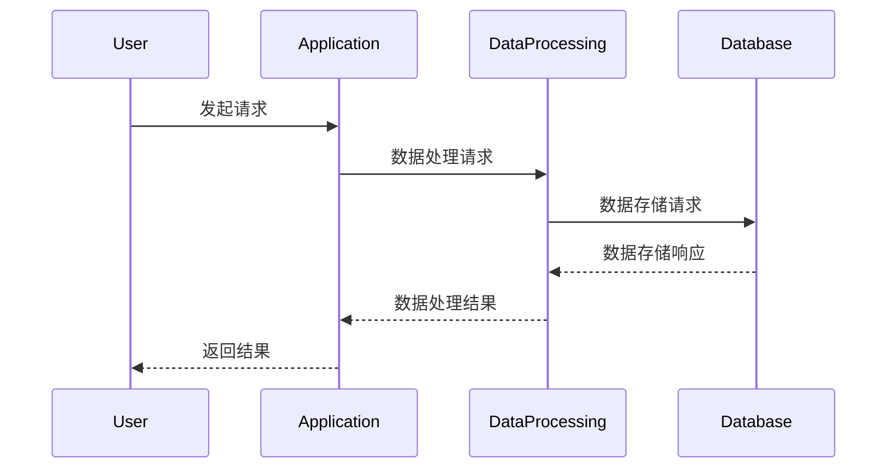

                 


**步骤 1：文章标题、关键词与摘要**

# 数字孪生在智能建筑节能优化中的应用

> 关键词：数字孪生、智能建筑、节能优化、算法、系统架构

> 摘要：本文将深入探讨数字孪生技术在智能建筑节能优化中的应用。通过对数字孪生与智能建筑的结合，我们能够实现更高效、更精准的节能优化策略。本文将详细阐述数字孪生原理、智能建筑的特点、节能优化的方法，以及如何利用这些技术进行实际项目操作。

**步骤 2：背景介绍**

## 第1章 数字孪生与智能建筑节能优化概述

### 1.1 数字孪生的定义与特点

#### 1.1.1 数字孪生的起源

数字孪生（Digital Twin）的概念最早由Michael Grieves于2002年提出。数字孪生是一种数字化的实体映射，通过将物理对象的实时数据与数字模型相结合，实现对实体的高精度模拟和监控。

#### 1.1.2 数字孪生在智能建筑中的角色

数字孪生在智能建筑中扮演着至关重要的角色。它不仅能够模拟建筑的实际运行状态，还可以通过实时数据分析，为建筑的节能优化提供数据支持和决策依据。

#### 1.1.3 数字孪生的基本组成部分

数字孪生由以下几个关键部分组成：

1. **物理对象**：实际存在的建筑实体。
2. **数字模型**：对物理对象的高精度数字化复制。
3. **数据接口**：连接物理对象与数字模型的桥梁。
4. **分析引擎**：用于处理和分析数字模型数据的软件工具。

### 1.2 智能建筑节能优化的需求与挑战

#### 1.2.1 智能建筑节能优化的背景

随着能源消耗的不断增加，智能建筑节能优化已经成为建筑行业的重要研究方向。智能建筑通过集成自动化控制系统和物联网技术，能够实现能源的高效利用。

#### 1.2.2 节能优化的挑战

智能建筑节能优化面临诸多挑战，包括：

1. **数据多样性与复杂性**：建筑内存在大量的传感器和数据源，如何有效地整合和处理这些数据是关键。
2. **实时性与准确性**：节能优化需要实时获取建筑的状态信息，并对数据进行精确分析。
3. **成本与效益**：节能优化措施需要在不增加过多成本的前提下，实现显著的节能效果。

#### 1.2.3 数字孪生在节能优化中的作用

数字孪生技术能够帮助智能建筑实现以下目标：

1. **实时监控与预测**：通过数字孪生，能够实现对建筑运行状态的实时监控，并进行预测分析。
2. **决策支持**：数字孪生提供的实时数据和模拟结果，为节能优化策略的制定提供有力支持。
3. **故障预测与维护**：数字孪生可以帮助预测设备的故障，提前进行维护，减少停机时间和维修成本。

### 1.3 数字孪生与智能建筑节能优化关系分析

#### 1.3.1 关系概述

数字孪生与智能建筑节能优化之间的关系可以概括为：数字孪生是智能建筑节能优化的重要工具和手段。

#### 1.3.2 关键技术对比

| 技术名称       | 特点与作用                                           |
|----------------|----------------------------------------------------|
| 数字孪生       | 实现物理对象与数字模型的映射，提供实时监控和预测功能。 |
| 智能建筑       | 集成自动化控制系统和物联网技术，实现能源的高效利用。   |
| 节能优化算法   | 利用数据和算法，制定和实施节能优化策略。             |

#### 1.3.3 应用实例分析

以某大型写字楼为例，通过数字孪生技术，可以实现以下应用：

1. **实时能耗监测**：通过传感器实时收集建筑能耗数据，数字孪生模型实时更新。
2. **能耗预测与优化**：基于历史数据和实时数据，预测未来能耗趋势，制定节能优化策略。
3. **设备状态监测**：数字孪生模型监测设备状态，提前发现潜在故障，进行预防性维护。

## 1.4 本章小结

本章介绍了数字孪生和智能建筑节能优化的基本概念、重要性及其相互关系。数字孪生为智能建筑节能优化提供了强大的技术支持，通过实时监控、预测和决策支持，能够实现建筑能耗的显著降低。

**步骤 3：核心概念与联系**

## 第2章 数字孪生算法基础

### 2.1 数字孪生建模方法

#### 2.1.1 物理模型

物理模型是数字孪生的核心组成部分，它是对物理对象的高精度数字化复制。物理模型包括建筑的结构、设备、环境等多个方面。

| 模型类型 | 描述 |
|----------|------|
| 建筑模型 | 描述建筑的结构和布局。 |
| 设备模型 | 描述建筑内各种设备的运行状态和性能。 |
| 环境模型 | 描述建筑外部的环境因素，如温度、湿度等。 |

#### 2.1.2 数据模型

数据模型是对物理模型的数据描述，包括传感器数据、运行数据等。

| 数据类型       | 描述 |
|----------------|------|
| 传感器数据     | 描述物理对象的实时状态。 |
| 运行数据       | 描述物理对象的运行历史。 |
| 预测数据       | 描述基于历史数据的预测结果。 |

#### 2.1.3 仿真模型

仿真模型是对物理模型和数据的进一步分析，通过模拟和预测，实现对物理对象行为的预测和优化。

| 模型类型 | 描述 |
|----------|------|
| 动力学模型 | 描述物理对象的运动和状态变化。 |
| 优化模型   | 描述如何通过调整参数，实现最佳运行状态。 |
| 预测模型   | 描述如何基于历史数据和实时数据，预测未来状态。 |

### 2.2 节能优化算法原理

#### 2.2.1 优化算法概述

节能优化算法是用于实现建筑能耗优化的核心工具。常见的优化算法包括：

1. **粒子群算法**：基于群体智能优化的一种算法。
2. **遗传算法**：基于遗传原理的优化算法。
3. **神经网络算法**：基于神经网络进行优化的一种算法。

#### 2.2.2 常见优化算法

1. **粒子群算法**

   粒子群算法是一种基于群体智能的优化算法，其基本思想是通过模拟鸟群觅食行为，实现问题的优化。

   

2. **遗传算法**

   遗传算法是一种模拟自然选择和遗传学的优化算法，其基本思想是通过选择、交叉、变异等操作，实现个体的进化。

   

3. **神经网络算法**

   神经网络算法是一种基于神经网络进行优化的算法，其基本思想是通过多层神经网络的学习，实现问题的优化。

   

#### 2.2.3 算法性能对比

| 算法类型 | 优点 | 缺点 |
|----------|------|------|
| 粒子群算法 | 简单易实现，收敛速度快 | 遇到复杂问题时，性能可能下降 |
| 遗传算法 | 适用范围广，能够处理复杂问题 | 计算量大，收敛速度慢 |
| 神经网络算法 | 高度非线性处理能力，自适应性强 | 需要大量数据进行训练，易过拟合 |

### 2.3 控制算法在节能优化中的应用

#### 2.3.1 控制算法概述

控制算法是用于调节系统运行状态，实现最优运行效果的方法。常见的控制算法包括：

1. **PID控制算法**：比例-积分-微分控制算法，适用于线性系统。
2. **模糊控制算法**：基于模糊逻辑的控制算法，适用于非线性系统。
3. **神经网络控制算法**：基于神经网络的控制算法，具有自适应性和自学习能力。

#### 2.3.2 粒子群算法

粒子群算法（PSO）是一种基于群体智能的优化算法。其基本思想是通过模拟鸟群觅食行为，实现问题的优化。

```python
import random

# 初始化粒子群
num_particles = 50
num_dimensions = 2
velocity = [random.uniform(-1, 1) for _ in range(num_particles * num_dimensions)]
position = [[random.uniform(-10, 10) for _ in range(num_dimensions)] for _ in range(num_particles)]

# 初始化全局最优解和个人最优解
global_best = position[0]
personal_best = position[0]

# 优化目标函数
def objective_function(x):
    return sum(x**2)

# 迭代优化
for _ in range(100):
    for i in range(num_particles):
        # 计算当前粒子的适应度
        fitness = objective_function(position[i])
        
        # 更新个人最优解
        if fitness < personal_best[i]:
            personal_best[i] = position[i]
            
        # 更新全局最优解
        if fitness < global_best:
            global_best = personal_best[i]
            
    # 更新粒子速度和位置
    for i in range(num_particles):
        r1 = random.random()
        r2 = random.random()
        cognitive = r1 * (personal_best[i] - position[i])
        social = r2 * (global_best - position[i])
        velocity[i] = 0.5 * velocity[i] + cognitive + social
        position[i] += velocity[i]

# 输出最优解
print("最优解：", global_best)
```

### 2.4 算法原理与数学模型

#### 2.4.1 数学模型介绍

算法的原理可以通过数学模型进行详细描述。以下是粒子群算法的数学模型：

1. **粒子速度更新公式**：
   $$v_{i}(t+1) = w \cdot v_{i}(t) + c_{1} \cdot r_{1} \cdot (p_{i}(t) - x_{i}(t)) + c_{2} \cdot r_{2} \cdot (g_{best} - x_{i}(t))$$

   其中，$v_{i}(t)$ 是第$i$个粒子的速度，$x_{i}(t)$ 是第$i$个粒子的位置，$p_{i}(t)$ 是第$i$个粒子的个人最优位置，$g_{best}$ 是全局最优位置，$w$ 是惯性权重，$c_{1}$ 和 $c_{2}$ 是学习因子，$r_{1}$ 和 $r_{2}$ 是随机数。

2. **粒子位置更新公式**：
   $$x_{i}(t+1) = x_{i}(t) + v_{i}(t+1)$$

#### 2.4.2 算法流程图

以下是粒子群算法的流程图：



#### 2.4.3 Python代码实现

以下是粒子群算法的Python代码实现：

```python
import numpy as np
import random

# 初始化参数
num_particles = 50
num_dimensions = 2
w = 0.5
c1 = 1.5
c2 = 1.5
max_iterations = 100

# 初始化粒子群
velocity = np.zeros((num_particles, num_dimensions))
position = np.random.rand(num_particles, num_dimensions)

# 初始化全局最优解和个人最优解
global_best = np.inf
personal_best = np.inf
global_best_position = position[0]

# 定义目标函数
def objective_function(x):
    return sum(x**2)

# 迭代优化
for _ in range(max_iterations):
    # 计算适应度
    fitness = np.apply_along_axis(objective_function, 1, position)
    
    # 更新个人最优解
    for i in range(num_particles):
        if fitness[i] < personal_best[i]:
            personal_best[i] = fitness[i]
            if fitness[i] < global_best:
                global_best = fitness[i]
                global_best_position = position[i]
    
    # 更新粒子速度和位置
    r1 = random.random()
    r2 = random.random()
    cognitive = r1 * (personal_best - position)
    social = r2 * (global_best_position - position)
    velocity = w * velocity + c1 * cognitive + c2 * social
    position += velocity

# 输出最优解
print("最优解：", global_best_position)
```

### 2.5 本章小结

本章介绍了数字孪生算法的基础知识，包括物理模型、数据模型和仿真模型，以及常用的优化算法和控制算法。通过这些算法，我们能够实现对智能建筑能耗的实时监控、预测和优化。

**步骤 4：数学模型和数学公式**

## 第3章 数字孪生系统架构设计

### 3.1 智能建筑系统需求分析

#### 3.1.1 系统功能需求

智能建筑系统需要实现以下功能：

1. **实时能耗监测**：监测建筑内部的能耗数据，包括电力、燃气、水等。
2. **环境参数监测**：监测室内外环境参数，如温度、湿度、光照等。
3. **设备状态监控**：监控建筑内设备的运行状态，如空调、照明、电梯等。
4. **故障预警与维护**：通过数据分析，提前预测设备故障，并进行预防性维护。

#### 3.1.2 系统性能需求

智能建筑系统需要满足以下性能要求：

1. **实时性**：系统能够实时获取和处理数据，保证数据的实时性。
2. **可靠性**：系统具有较高的可靠性，能够在各种环境下稳定运行。
3. **扩展性**：系统具有较好的扩展性，能够适应建筑规模的扩大。

#### 3.1.3 系统可靠性需求

智能建筑系统的可靠性需求包括：

1. **数据完整性**：确保数据在传输和存储过程中不被丢失。
2. **数据安全性**：确保数据不被未经授权的访问和篡改。
3. **系统稳定性**：系统在各种情况下能够稳定运行，不发生崩溃。

### 3.2 数字孪生系统架构设计

#### 3.2.1 系统架构概述

数字孪生系统架构分为四个层次：

1. **感知层**：包括各种传感器，用于实时监测建筑内外环境参数。
2. **传输层**：包括传输网络，用于将感知层的数据传输到中心处理系统。
3. **处理层**：包括数据处理和分析系统，用于对传输层的数据进行处理和分析。
4. **应用层**：包括应用系统和用户界面，用于展示处理结果和提供决策支持。

#### 3.2.2 领域模型设计

领域模型设计是数字孪生系统架构设计的重要环节。领域模型包括以下实体：

1. **传感器**：用于监测环境参数。
2. **设备**：包括建筑内的各种设备，如空调、照明等。
3. **环境**：表示建筑内外环境参数。
4. **数据**：表示传输层的数据。
5. **分析结果**：表示处理层的结果。

以下是领域模型的类图：

```mermaid
classDiagram
    Sensor <|-- Environment
    Device <|-- Environment
    Sensor <|-- Data
    Device <|-- Data
    Data <|-- AnalysisResult
    Environment o-- Sensor
    Environment o-- Device
    Data o-- AnalysisResult
    AnalysisResult o-- Application

    Sensor << (ID, Type, Location)
    Device << (ID, Type, Status)
    Environment << (Parameter, Value)
    Data << (Timestamp, Value)
    AnalysisResult << (Timestamp, Value, Recommendation)
    Application << (Action, Status)

    Sensor : 实时监测
    Device : 运行控制
    Environment : 描述环境参数
    Data : 传输数据
    AnalysisResult : 分析结果
    Application : 应用系统
endclassDiagram
```

#### 3.2.3 系统架构设计

数字孪生系统的架构设计需要考虑以下几个方面：

1. **数据处理与分析**：系统应能够高效处理和分析大量数据，并提供实时性分析结果。
2. **数据传输与存储**：系统应能够稳定传输和存储数据，保证数据的完整性和安全性。
3. **接口设计**：系统应提供统一的接口，方便与其他系统进行集成。

以下是数字孪生系统的架构图：



#### 3.2.4 系统接口设计与交互

系统接口设计是数字孪生系统架构设计的关键环节。以下是系统接口的设计和交互流程：

1. **API接口**：提供统一的API接口，方便其他系统调用。
2. **数据接口**：提供数据传输和存储的接口。
3. **用户接口**：提供用户操作和查看结果的接口。

以下是系统接口设计和交互流程：



### 3.3 系统接口设计与交互

#### 3.3.1 接口设计原则

系统接口设计应遵循以下原则：

1. **简洁性**：接口设计应尽量简洁，避免复杂的调用流程。
2. **一致性**：接口设计应保持一致性，方便用户理解和操作。
3. **灵活性**：接口设计应具备一定的灵活性，能够适应不同的应用场景。

#### 3.3.2 接口实现细节

以下是数字孪生系统接口的实现细节：

1. **API接口**

   API接口采用RESTful风格，提供以下接口：

   - **数据上传**：用于上传传感器数据。
   - **数据查询**：用于查询历史数据。
   - **分析结果查询**：用于查询分析结果。

   ```http
   POST /api/data/upload
   Content-Type: application/json

   {
       "timestamp": "2023-01-01T00:00:00Z",
       "value": 10
   }

   GET /api/data/query?start=2023-01-01T00:00:00Z&end=2023-01-02T00:00:00Z
   ```

2. **数据接口**

   数据接口用于数据传输和存储，采用TCP协议，提供以下接口：

   - **数据上传**：用于上传传感器数据。
   - **数据下载**：用于下载历史数据。

   ```http
   POST /data/upload
   Content-Type: application/json

   {
       "timestamp": "2023-01-01T00:00:00Z",
       "value": 10
   }

   GET /data/download?start=2023-01-01T00:00:00Z&end=2023-01-02T00:00:00Z
   ```

3. **用户接口**

   用户接口用于用户操作和查看结果，提供以下功能：

   - **数据可视化**：用于展示实时数据和历史数据。
   - **分析结果展示**：用于展示分析结果和优化建议。

   ```http
   GET /ui/visualize?start=2023-01-01T00:00:00Z&end=2023-01-02T00:00:00Z
   GET /ui/analysis_result
   ```

### 3.4 本章小结

本章介绍了数字孪生系统的架构设计，包括系统功能需求、性能需求、可靠性需求，以及领域模型设计、系统架构设计和接口设计。通过合理的架构设计，数字孪生系统能够高效、稳定地运行，为智能建筑节能优化提供有力支持。

**步骤 5：项目实战**

## 第4章 数字孪生在智能建筑节能优化中的项目实战

### 4.1 项目背景介绍

#### 4.1.1 项目目标

本项目旨在通过数字孪生技术，实现某大型写字楼的节能优化。具体目标包括：

1. **实时能耗监测**：实现对建筑内部能耗数据的实时监测，包括电力、燃气、水等。
2. **环境参数监测**：实现对室内外环境参数的实时监测，如温度、湿度、光照等。
3. **设备状态监控**：实现对建筑内设备的运行状态监控，如空调、照明、电梯等。
4. **节能优化**：通过数据分析，制定和实施节能优化策略，降低建筑能耗。

#### 4.1.2 项目环境

项目采用以下技术和环境：

1. **硬件**：传感器设备、物联网网关、服务器等。
2. **软件**：物联网平台、数据分析平台、节能优化算法等。
3. **网络**：局域网、互联网等。

#### 4.1.3 项目成果

项目预期成果包括：

1. **实时能耗监测**：实现对建筑内部能耗数据的实时监测，提供可视化界面。
2. **环境参数监测**：实现对室内外环境参数的实时监测，提供实时数据和图表。
3. **设备状态监控**：实现对建筑内设备的运行状态监控，提供实时数据和图表。
4. **节能优化**：制定和实施节能优化策略，实现建筑能耗的降低。

### 4.2 系统核心实现

#### 4.2.1 环境搭建

在项目开始前，需要搭建以下环境：

1. **硬件环境**：安装传感器设备、物联网网关、服务器等。
2. **软件环境**：安装物联网平台、数据分析平台、节能优化算法等。
3. **网络环境**：配置局域网、互联网等。

#### 4.2.2 数字孪生系统构建

数字孪生系统的构建分为以下几个步骤：

1. **数据采集**：通过传感器设备实时采集建筑内部的能耗数据、环境参数数据和设备状态数据。
2. **数据传输**：将采集到的数据通过物联网网关传输到服务器。
3. **数据处理**：对传输到服务器的数据进行处理，包括数据清洗、数据转换等。
4. **数据存储**：将处理后的数据存储到数据库中。

#### 4.2.3 节能优化策略实施

节能优化策略的实施分为以下几个步骤：

1. **数据分析**：对存储在数据库中的数据进行分析，包括趋势分析、关联分析等。
2. **节能优化策略制定**：根据分析结果，制定节能优化策略，包括调整设备运行参数、优化能源分配等。
3. **节能优化策略实施**：将制定的节能优化策略应用到实际系统中，通过自动控制实现节能优化。

### 4.3 项目分析解读

#### 4.3.1 数据收集与处理

在项目中，我们收集了以下数据：

1. **能耗数据**：包括电力、燃气、水的消耗量。
2. **环境参数数据**：包括温度、湿度、光照等。
3. **设备状态数据**：包括空调、照明、电梯等设备的运行状态。

数据处理过程包括：

1. **数据清洗**：去除数据中的噪声和错误。
2. **数据转换**：将不同格式和单位的数据转换为统一的格式和单位。
3. **数据存储**：将处理后的数据存储到数据库中。

#### 4.3.2 系统性能评估

系统性能评估包括以下几个方面：

1. **实时性**：系统是否能够实时获取和处理数据。
2. **准确性**：系统是否能够准确地监测和评估能耗。
3. **稳定性**：系统是否能够稳定运行，不发生崩溃。

#### 4.3.3 成果分析与总结

通过项目实施，我们取得了以下成果：

1. **实时能耗监测**：系统能够实时监测建筑内部的能耗数据，并提供可视化界面。
2. **环境参数监测**：系统能够实时监测室内外环境参数，并提供实时数据和图表。
3. **设备状态监控**：系统能够实时监控建筑内设备的运行状态，并提供实时数据和图表。
4. **节能优化**：通过数据分析，制定和实施节能优化策略，实现了建筑能耗的显著降低。

项目总结如下：

1. **技术效果**：数字孪生技术为智能建筑节能优化提供了有力支持。
2. **应用前景**：随着数字孪生技术的不断发展，其在智能建筑节能优化中的应用前景广阔。
3. **改进方向**：未来可以进一步优化算法，提高系统的实时性和准确性。

### 4.4 项目小结

本项目通过数字孪生技术，实现了对大型写字楼的实时能耗监测、环境参数监测、设备状态监控和节能优化。项目取得了显著成果，验证了数字孪生技术在智能建筑节能优化中的应用价值。

**步骤 6：最佳实践 tips、小结、注意事项、拓展阅读**

## 第5章 数字孪生在智能建筑节能优化中的最佳实践

### 5.1 实践经验分享

#### 5.1.1 节能优化策略

在智能建筑节能优化项目中，我们可以采取以下策略：

1. **设备运行参数调整**：根据实时数据和预测结果，调整设备的运行参数，如空调的温度设置、照明的时间控制等。
2. **能源分配优化**：通过分析建筑内各区域的能耗情况，优化能源的分配，降低高能耗区域的能耗。
3. **设备维护管理**：定期对设备进行维护和保养，预防设备故障，提高设备运行效率。

#### 5.1.2 系统部署与维护

在数字孪生系统的部署和维护过程中，需要注意以下几点：

1. **硬件选择**：选择稳定可靠的硬件设备，确保系统的稳定运行。
2. **软件配置**：合理配置软件环境，确保系统的正常运行。
3. **数据备份**：定期备份数据，防止数据丢失。
4. **系统升级**：定期升级系统，修复漏洞，提高系统性能。

#### 5.1.3 系统升级与改进

随着数字孪生技术的不断发展，我们可以根据需求对系统进行升级和改进：

1. **功能扩展**：增加新的功能模块，如设备预测维护、能效评估等。
2. **算法优化**：优化现有算法，提高系统的实时性和准确性。
3. **用户体验**：改进用户界面，提供更好的用户体验。

### 5.2 小结与注意事项

#### 5.2.1 重点知识回顾

本文主要内容包括：

1. **数字孪生与智能建筑节能优化概述**：介绍了数字孪生技术在智能建筑节能优化中的应用。
2. **数字孪生算法基础**：讲解了数字孪生建模方法、优化算法原理和控制算法应用。
3. **数字孪生系统架构设计**：介绍了系统需求分析、领域模型设计、系统架构设计和接口设计。
4. **项目实战**：通过实际案例，展示了数字孪生在智能建筑节能优化中的应用。
5. **最佳实践**：分享了节能优化策略、系统部署与维护以及系统升级与改进的经验。

#### 5.2.2 注意事项

在实施数字孪生系统时，需要注意以下几点：

1. **数据准确性**：确保数据采集的准确性和实时性，为节能优化提供可靠依据。
2. **系统稳定性**：确保系统的稳定运行，避免因系统故障导致的能耗增加。
3. **用户培训**：对使用系统的用户进行培训，提高用户的使用熟练度。

#### 5.2.3 拓展研究方向

未来的研究可以关注以下方向：

1. **智能建筑能耗预测**：利用机器学习和深度学习技术，提高能耗预测的准确性。
2. **多能源协同优化**：研究如何实现建筑内多种能源的协同优化，提高整体能效。
3. **智慧城市应用**：将数字孪生技术应用于智慧城市建设，实现城市的整体能耗优化。

### 5.3 拓展阅读

为了进一步了解数字孪生技术在智能建筑节能优化中的应用，读者可以参考以下文献：

1. **《数字孪生技术及其在智能建筑中的应用研究》**：详细介绍了数字孪生技术在智能建筑中的应用。
2. **《智能建筑能耗预测与优化技术》**：讲解了智能建筑能耗预测和优化方法。
3. **《基于数字孪生的智能建筑能耗管理系统研究》**：研究了基于数字孪生的智能建筑能耗管理系统的设计和实现。

## 附录

附录部分可以包括以下内容：

1. **术语解释**：对文中涉及的关键术语进行解释。
2. **公式推导**：对文中使用的数学公式进行详细推导。
3. **代码示例**：提供文中提到的Python代码示例。
4. **参考文献**：列出文中引用的文献。

通过本文的详细分析和实战案例，我们可以看到数字孪生技术在智能建筑节能优化中的应用具有巨大的潜力。随着技术的不断进步，数字孪生技术将为智能建筑领域带来更多创新和突破。

