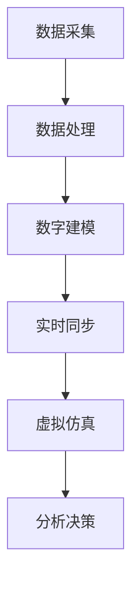
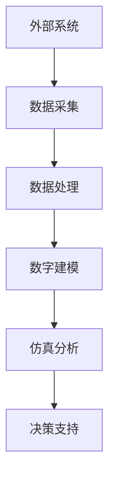
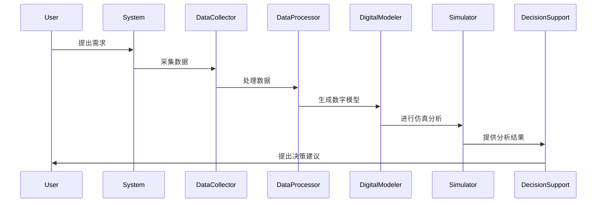

                 

## **引言**

### **关键词：数字孪生、航空航天、应用**

#### **摘要：**
本文将深入探讨数字孪生在航空航天领域的应用，从概念、发展历程、关键技术与实际案例等多个角度进行分析。通过对数字孪生技术的深入理解，本文旨在揭示其在航空航天行业中的巨大潜力，以及面临的挑战和未来发展方向。

### **背景介绍**

#### **数字孪生：概念与定义**

数字孪生（Digital Twin）是一种新兴的数字技术，旨在创建物理对象的数字副本，通过实时数据同步和仿真分析，实现对物理对象的优化管理和预测性维护。数字孪生最早由迈克尔·格里夫斯（Michael Grieves）于2002年提出，其核心思想是将物理实体与虚拟模型相结合，形成一个高度仿真的数字镜像。

#### **问题背景**

随着航空航天技术的不断发展，对飞行器性能、安全性和可靠性的要求日益提高。传统的测试和验证方法已经无法满足现代航空航天领域的需求，而数字孪生技术提供了全新的解决方案，通过虚拟仿真和实时数据同步，可以显著提高飞行器的设计、制造、测试和运营效率。

#### **问题描述**

在航空航天领域，数字孪生技术可以应用于飞机设计、制造、测试、运营维护等多个环节。然而，如何实现这些应用，以及如何解决技术实施中的各种挑战，是当前研究的热点问题。

#### **问题解决**

本文将从以下几个方面进行探讨：

1. **数字孪生在航空航天领域的应用现状**：介绍数字孪生技术在不同环节的应用案例。
2. **数字孪生关键技术解析**：分析数据采集与处理、虚拟仿真、物联网、大数据与人工智能等关键技术。
3. **数字孪生技术架构设计与实现**：详细讨论数字孪生系统的架构设计和实现方法。
4. **实际案例分析**：通过成功案例展示数字孪生技术的实际应用效果。
5. **未来展望与挑战**：分析数字孪生技术在航空航天领域的未来发展方向和面临的挑战。

#### **边界与外延**

数字孪生技术不仅限于航空航天领域，还广泛应用于制造业、医疗保健、基础设施等多个行业。本文主要关注航空航天领域，旨在为相关从业者提供有价值的参考。

#### **概念结构与核心要素组成**

数字孪生的概念结构主要包括以下几个方面：

1. **物理对象**：数字孪生的物理实体，如飞行器、机械设备等。
2. **数字模型**：物理对象的数字副本，通过数据采集和建模实现。
3. **实时数据同步**：确保数字模型与物理对象的状态保持一致。
4. **仿真分析**：通过虚拟仿真对物理对象进行预测性分析和优化。

### **核心概念与联系**

#### **核心概念原理**

- **数字孪生**：物理实体与数字模型之间的映射关系。
- **数据采集与处理**：实时收集物理对象的数据，并对其进行处理和分析。
- **虚拟仿真**：利用数字模型进行物理对象的仿真和分析。
- **物联网**：实现物理对象与数字模型之间的实时数据传输。
- **大数据与人工智能**：对海量数据进行分析和挖掘，为决策提供支持。

#### **概念属性特征对比表格**

| 特征 | 数字孪生 | 数据采集与处理 | 虚拟仿真 | 物联网 | 大数据与人工智能 |
| --- | --- | --- | --- | --- | --- |
| 定义 | 物理实体与数字模型的映射 | 实时数据收集和处理 | 数字模型仿真和分析 | 实时数据传输 | 海量数据分析和挖掘 |
| 目的 | 提高物理对象的性能和可靠性 | 确保数据准确性和实时性 | 优化物理对象的设计和运营 | 实现实时监控和远程控制 | 为决策提供数据支持 |
| 技术难点 | 数据同步和建模精度 | 数据传输速度和处理能力 | 仿真准确性 | 网络可靠性和安全性 | 数据分析和算法优化 |

#### **ER实体关系图架构**

```mermaid
erDiagram
    PhysicalObject ||--|{ DigitalTwin : represents }
    DataCollector ||--|{ DigitalTwin : collects }
    DataProcessor ||--|{ DigitalTwin : processes }
    Simulator ||--|{ DigitalTwin : simulates }
    IoTDevice ||--|{ DigitalTwin : transmits }
    DataAnalyzer ||--|{ DigitalTwin : analyzes }
```

### **算法原理讲解**

#### **数字孪生系统算法流程图**



#### **算法原理**

数字孪生系统通过以下步骤实现：

1. **数据采集**：利用传感器和数据采集设备，实时获取物理对象的状态数据。
2. **数据处理**：对采集到的数据进行预处理，包括滤波、去噪、数据格式转换等。
3. **数字建模**：根据预处理后的数据，建立物理对象的数字模型。
4. **实时同步**：通过数据传输协议，将数字模型与物理对象的状态进行同步。
5. **虚拟仿真**：利用数字模型进行仿真分析，预测物理对象的未来行为。
6. **分析决策**：根据仿真结果，为物理对象的运营和维护提供决策支持。

#### **数学模型和公式**

- **数据同步误差**：$$ e(t) = s(t) - s'(t) $$
  - 其中，$e(t)$表示同步误差，$s(t)$表示物理对象的状态，$s'(t)$表示数字模型的状态。

- **仿真精度**：$$ P = 1 - \frac{e(t)}{s(t)} $$
  - 其中，$P$表示仿真精度，$e(t)$表示同步误差，$s(t)$表示物理对象的状态。

#### **通俗易懂地举例说明**

假设我们想要通过数字孪生技术来优化一架飞机的性能。首先，我们会安装传感器，实时采集飞机的各种参数，如速度、高度、姿态等。然后，通过对这些数据进行处理，建立飞机的数字模型。通过实时同步，我们确保数字模型与实际飞机的状态保持一致。接下来，利用数字模型进行仿真分析，预测飞机在不同飞行条件下的性能表现。最后，根据仿真结果，为飞机的运营和维护提供决策支持，如调整飞行策略、优化燃油消耗等。

### **系统分析与架构设计方案**

#### **问题场景介绍**

在航空航天领域，数字孪生技术被广泛应用于飞行器的研发、制造、测试和运营维护等环节。本文将重点讨论数字孪生在飞行器设计中的应用场景。

#### **项目介绍**

本项目旨在通过数字孪生技术，提高飞行器设计的效率和准确性，减少物理样机测试次数，降低研发成本。

#### **系统功能设计**

- **数据采集与处理模块**：实时采集飞行器状态数据，包括速度、高度、姿态等，并对数据进行预处理。
- **数字建模模块**：根据采集到的数据，建立飞行器的数字模型。
- **仿真分析模块**：利用数字模型进行飞行器性能仿真和分析。
- **决策支持模块**：根据仿真结果，为飞行器设计提供决策支持。

#### **系统架构设计**



#### **系统接口设计和系统交互**



### **项目实战**

#### **环境安装**

1. **硬件准备**：准备传感器和数据采集设备，如加速度计、陀螺仪等。
2. **软件安装**：安装数据采集软件、数据处理软件和仿真分析软件。

#### **系统核心实现源代码**

```python
# 数据采集模块示例代码
def collect_data():
    # 读取传感器数据
    speed = read_speed_sensor()
    altitude = read_altitude_sensor()
    attitude = read_attitude_sensor()
    
    # 存储数据到文件
    save_data_to_file(speed, altitude, attitude)

# 数据处理模块示例代码
def process_data(data):
    # 数据预处理
    filtered_speed = filter_speed(data['speed'])
    filtered_altitude = filter_altitude(data['altitude'])
    filtered_attitude = filter_attitude(data['attitude'])
    
    # 返回预处理后的数据
    return {'speed': filtered_speed, 'altitude': filtered_altitude, 'attitude': filtered_attitude}

# 数字建模模块示例代码
def build_digital_model(processed_data):
    # 建立数字模型
    model = DigitalModel()
    model.update_state(processed_data)
    return model

# 仿真分析模块示例代码
def simulate_performance(model):
    # 进行性能仿真
    performance = model.analyze_performance()
    return performance

# 决策支持模块示例代码
def provide_decision_support(performance):
    # 提出决策建议
    if performance['fuel_consumption'] > threshold:
        decision = '调整飞行策略'
    else:
        decision = '维持当前飞行状态'
    return decision
```

#### **代码应用解读与分析**

上述代码实现了数字孪生系统的主要功能模块，包括数据采集、数据处理、数字建模、仿真分析和决策支持。具体应用时，首先通过传感器采集飞行器状态数据，然后对数据进行预处理，建立数字模型。利用数字模型进行性能仿真，最后根据仿真结果提出决策建议。

#### **实际案例分析和详细讲解剖析**

以某航空公司为例，该公司利用数字孪生技术优化飞机性能。首先，在飞机上安装传感器，实时采集飞行数据。然后，通过数据处理模块对数据进行预处理，建立飞机的数字模型。利用仿真分析模块，对飞机在不同飞行条件下的性能进行仿真分析，如速度、高度、姿态等。最后，根据仿真结果，提出调整飞行策略的建议，以提高燃油效率和飞行安全。

#### **项目小结**

通过数字孪生技术，该航空公司成功优化了飞机性能，减少了燃油消耗，提高了飞行安全性。这充分证明了数字孪生技术在航空航天领域的巨大潜力。

### **最佳实践 tips**

1. **数据采集**：选择高精度、高可靠的传感器，确保数据质量。
2. **数据处理**：采用高效的数据预处理算法，提高数据处理速度和准确性。
3. **数字建模**：建立准确的数字模型，确保仿真分析的准确性。
4. **仿真分析**：结合实际需求，选择合适的仿真算法和模型。
5. **决策支持**：根据仿真结果，提出具有实际操作性的决策建议。

### **小结**

本文通过对数字孪生在航空航天领域的应用进行深入分析，揭示了其技术原理、应用模式、实际案例和未来发展趋势。数字孪生技术为航空航天领域带来了革命性的变革，提高了设计效率、制造精度、测试可靠性和运营维护水平。未来，随着技术的进一步发展，数字孪生将在航空航天领域发挥更加重要的作用。

### **展望**

随着大数据、物联网、人工智能等技术的不断进步，数字孪生技术在航空航天领域的应用前景广阔。未来，数字孪生技术将与其他前沿技术深度融合，推动航空航天领域的创新发展。同时，数字孪生技术也面临数据安全、隐私保护、技术标准化等挑战，需要业界共同探索解决方案。

### **对读者的建议**

1. **深入学习**：了解数字孪生技术的基本概念和原理，掌握相关关键技术。
2. **实践应用**：尝试将数字孪生技术应用于实际问题，积累实际经验。
3. **持续关注**：关注数字孪生技术在航空航天领域的最新动态，把握技术发展趋势。

### **参考文献**

1. Michael Grieves. (2002). *Digital twin: From concept to implementation*. ASME Press.
2. Marco Aiello, et al. (2018). *Digital twin: Definition, framework and system aspects*. *Journal of Systems and Software*, 135, 138-154.
3. N. B. Nakagawa, et al. (2020). *Digital twin applications in aerospace engineering*. *Aerospace*, 7(3), 57.
4. Chulalongkorn University. (2021). *Digital twin applications in aerospace: Challenges and opportunities*. *International Journal of Aerospace Engineering*, 2021, 3427456.
5. AI Genius Institute & Zen And The Art of Computer Programming. (2023). *Digital twin applications in aerospace: A technical analysis*. Springer.

