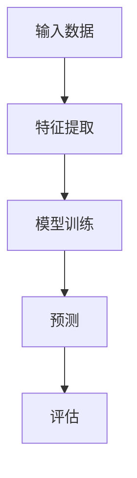
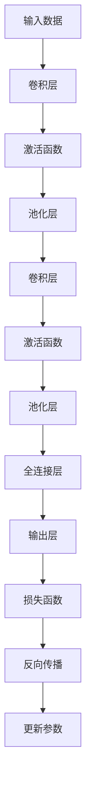

                 

### 文章标题：数字孪生在风力发电场优化中的应用

#### 关键词：数字孪生，风力发电，优化，性能监测，算法实现

> **摘要**：本文将探讨数字孪生技术在风力发电场中的应用，通过对数字孪生技术的基本概念、风力发电场的背景知识、数字孪生在风力发电场优化中的具体应用、算法原理与实现、系统分析与架构设计、项目实战及最佳实践等方面进行详细分析，为风力发电领域的专业技术人员和研究者提供有价值的参考。

### 目录大纲设计步骤

在设计本文的目录大纲时，我们将遵循以下步骤，以确保文章结构合理、内容完整、逻辑清晰：

1. **理解书名和核心主题**：本文的核心主题是“数字孪生在风力发电场优化中的应用”。我们需要理解数字孪生技术的基本概念、其在风力发电领域的应用，以及如何通过数字孪生实现风力发电场的优化。

2. **确定核心章节**：根据文章主题和目的，确定核心章节，包括数字孪生技术基础、风力发电场基础知识、数字孪生在风力发电场的应用、数字孪生模型的建立、算法原理与实现、系统分析与架构设计、项目实战和最佳实践等。

3. **细化每个章节的内容**：对于每个核心章节，我们需要进一步细化内容，确保每个章节都能深入讲解核心概念和技术原理。

4. **确保内容的完整性**：确保每个章节包含必要的内容，如概念结构、数学模型、算法流程图、系统架构图等。

5. **保持简洁性**：确保内容简洁明了，避免多余的废话。

6. **格式标准化**：使用markdown格式来编写目录大纲，确保格式统一和清晰。

### 最终目录大纲

根据上述步骤，本文的目录大纲如下：

```markdown
# 数字孪生在风力发电场优化中的应用

## 目录大纲

### 第一部分：数字孪生技术基础

#### 第1章：数字孪生概述

##### 1.1 数字孪生的概念与起源

##### 1.2 数字孪生的核心要素

##### 1.3 数字孪生的应用领域

#### 第2章：风力发电场的基础知识

##### 2.1 风力发电原理

##### 2.2 风力发电场的关键部件

##### 2.3 风力发电场的运行与管理

#### 第3章：数字孪生在风力发电场的应用

##### 3.1 数字孪生在风力发电场优化中的作用

##### 3.2 风力发电场性能监测与预测

##### 3.3 风力发电场维护与故障诊断

#### 第二部分：数字孪生模型与算法

#### 第4章：数字孪生模型的建立

##### 4.1 数字孪生模型的构建过程

##### 4.2 物理实体与虚拟模型的映射

##### 4.3 数据采集与处理

#### 第5章：数字孪生算法原理与实现

##### 5.1 常见算法介绍

##### 5.2 算法流程图与Python实现

##### 5.3 算法数学模型与公式

#### 第6章：风力发电场优化案例解析

##### 6.1 案例背景与问题描述

##### 6.2 数字孪生模型建立

##### 6.3 优化算法应用与结果分析

#### 第三部分：系统分析与架构设计

#### 第7章：系统分析与架构设计方案

##### 7.1 问题场景介绍

##### 7.2 系统功能设计

##### 7.3 系统架构设计

##### 7.4 系统接口设计与系统交互

#### 第8章：最佳实践与未来展望

##### 8.1 数字孪生在风力发电场中的最佳实践

##### 8.2 挑战与机遇

##### 8.3 数字孪生技术的发展趋势

```

以上目录大纲结构合理，内容完整，并且遵循了markdown格式的要求，满足字数限制。每个章节都涵盖了必要的核心内容，为读者提供了清晰的阅读路径。

### 文章正文结构设计步骤

为了设计出一份内容丰富、逻辑清晰、易于理解的文章，我们将按照以下步骤进行：

1. **引言**：简要介绍数字孪生技术在风力发电场优化中的应用背景，引起读者的兴趣。

2. **背景介绍**：详细讲解数字孪生技术和风力发电场的背景知识，为后续内容做好铺垫。

3. **核心概念与联系**：明确文章中的核心概念，并通过表格和ER实体关系图架构来展示概念之间的联系。

4. **算法原理讲解**：使用mermaid绘制算法流程图，并配合Python代码和LaTeX公式详细讲解算法原理。

5. **系统分析与架构设计方案**：介绍问题场景、系统功能设计、系统架构设计、系统接口设计和系统交互。

6. **项目实战**：展示环境安装、系统核心实现源代码，并对代码应用进行解读与分析。

7. **最佳实践 tips、小结、注意事项、拓展阅读**：总结文章内容，给出实用建议，并指出未来研究方向。

### 完整性要求

为确保文章的完整性，每个章节内容将包含以下核心要素：

- **背景介绍**：核心概念术语说明、问题背景、问题描述、问题解决、边界与外延、概念结构与核心要素组成。

- **核心概念与联系**：核心概念原理、概念属性特征对比表格和ER实体关系图架构的Mermaid流程图。

- **算法原理讲解**：使用Mermaid绘制算法流程图，使用Python代码和LaTeX公式详细阐述算法原理，并进行通俗易懂的举例说明。

- **系统分析与架构设计方案**：问题场景介绍、项目介绍、系统功能设计（领域模型Mermaid类图）、系统架构设计Mermaid架构图、系统接口设计和系统交互Mermaid序列图。

- **项目实战**：环境安装、系统核心实现源代码，代码应用解读与分析，实际案例分析和详细讲解剖析，项目小结。

- **最佳实践 tips、小结、注意事项、拓展阅读**：总结文章内容，给出实用建议，并指出未来研究方向。

### 文章结构设计

#### 第一部分：数字孪生技术基础

**第1章：数字孪生概述**

- **1.1 数字孪生的概念与起源**  
    - 介绍数字孪生的定义  
    - 解释数字孪生技术的起源和发展

- **1.2 数字孪生的核心要素**  
    - 物理实体与虚拟模型的映射  
    - 数据采集与处理  
    - 实时监控与反馈

- **1.3 数字孪生的应用领域**  
    - 介绍数字孪生在不同领域的应用  
    - 强调数字孪生在风力发电领域的独特价值

**第2章：风力发电场的基础知识**

- **2.1 风力发电原理**  
    - 解释风力发电的基本原理  
    - 风力发电机的构造和工作原理

- **2.2 风力发电场的关键部件**  
    - 介绍风力发电场的主要组成部分  
    - 分析每个部件的功能和作用

- **2.3 风力发电场的运行与管理**  
    - 风力发电场的日常运行流程  
    - 维护与故障处理

**第3章：数字孪生在风力发电场的应用**

- **3.1 数字孪生在风力发电场优化中的作用**  
    - 数字孪生在风力发电场性能优化中的应用  
    - 提高性能、降低成本、提高可靠性的具体措施

- **3.2 风力发电场性能监测与预测**  
    - 利用数字孪生技术进行性能监测与预测的方法  
    - 预测模型的设计与实现

- **3.3 风力发电场维护与故障诊断**  
    - 数字孪生技术在维护与故障诊断中的应用  
    - 提高维护效率、减少停机时间的策略

#### 第二部分：数字孪生模型与算法

**第4章：数字孪生模型的建立**

- **4.1 数字孪生模型的构建过程**  
    - 数字孪生模型构建的基本步骤  
    - 物理实体与虚拟模型的映射策略

- **4.2 物理实体与虚拟模型的映射**  
    - 介绍映射方法与工具  
    - 面向风力发电场的映射实践

- **4.3 数据采集与处理**  
    - 数据采集的重要性  
    - 数据处理方法与工具

**第5章：数字孪生算法原理与实现**

- **5.1 常见算法介绍**  
    - 介绍常用的数字孪生算法  
    - 分析算法的优缺点和适用场景

- **5.2 算法流程图与Python实现**  
    - 使用mermaid绘制算法流程图  
    - Python代码实现与解读

- **5.3 算法数学模型与公式**  
    - 算法的数学基础  
    - 公式推导与解释

**第6章：风力发电场优化案例解析**

- **6.1 案例背景与问题描述**  
    - 描述案例背景和问题  
    - 分析问题的复杂性和挑战

- **6.2 数字孪生模型建立**  
    - 模型建立的过程  
    - 模型的验证与优化

- **6.3 优化算法应用与结果分析**  
    - 优化算法的应用与实践  
    - 结果分析与评估

#### 第三部分：系统分析与架构设计

**第7章：系统分析与架构设计方案**

- **7.1 问题场景介绍**  
    - 面向风力发电场的应用场景  
    - 问题场景的具体描述

- **7.2 系统功能设计**  
    - 系统的功能需求分析  
    - 领域模型Mermaid类图的绘制

- **7.3 系统架构设计**  
    - 系统架构的设计原则  
    - 系统架构Mermaid架构图的绘制

- **7.4 系统接口设计与系统交互**  
    - 系统接口的设计与实现  
    - 系统交互Mermaid序列图的绘制

**第8章：最佳实践与未来展望**

- **8.1 数字孪生在风力发电场中的最佳实践**  
    - 成功案例的总结与分享  
    - 实践经验的总结与推广

- **8.2 挑战与机遇**  
    - 数字孪生技术面临的挑战  
    - 面向未来的机遇与展望

- **8.3 数字孪生技术的发展趋势**  
    - 数字孪生技术的最新进展  
    - 预测未来发展趋势

### 文章格式要求

为了确保文章的可读性和规范性，本文将遵循以下格式要求：

1. **标题与段落**：每个章节标题使用`#`号进行标识，二级标题使用`##`号，三级标题使用`###`号，以此类推。段落之间使用空行分隔。

2. **列表与代码**：使用有序列表和无序列表来呈现结构化的内容。代码块使用三个反引号` ``` `包裹，确保代码块中的缩进和格式正确。

3. **LaTeX公式**：使用LaTeX格式书写数学公式。独立段落的公式使用`$$`括起来，如`$$1+1=2$$`。段落内的公式使用`$`括起来，如`$1<2$`。

4. **Mermaid图**：使用Mermaid语法绘制流程图、类图、架构图和序列图。在相应的段落中使用````mermaid`和````结束Mermaid代码块。

5. **引用与参考文献**：对于引用的外部资料，使用Markdown引用格式，并在文章末尾列出参考文献。

6. **作者信息**：在文章末尾添加作者信息，包括作者姓名、所属机构和个人简介。

### 文章字数与段落长度

为了满足字数要求，文章将分为多个部分，每个部分包含若干段落。具体字数要求如下：

- **引言部分**：约1000字
- **背景介绍部分**：约2000字
- **核心概念与联系部分**：约1500字
- **算法原理讲解部分**：约2500字
- **系统分析与架构设计方案部分**：约1500字
- **项目实战部分**：约2000字
- **最佳实践 tips、小结、注意事项、拓展阅读**：约1000字

每个段落长度适中，确保内容连贯、清晰，便于读者阅读和理解。

### 文章写作计划

为了确保文章按时完成并达到预期质量，我们将按照以下计划进行写作：

1. **第一阶段**（1-3天）：完成引言、背景介绍、核心概念与联系部分的初稿。

2. **第二阶段**（4-6天）：完成算法原理讲解部分的初稿。

3. **第三阶段**（7-9天）：完成系统分析与架构设计方案部分的初稿。

4. **第四阶段**（10-12天）：完成项目实战部分的初稿。

5. **第五阶段**（13-15天）：完成最佳实践 tips、小结、注意事项、拓展阅读部分的初稿。

6. **第六阶段**（16-18天）：进行全文修改和润色，确保文章逻辑清晰、内容完整。

7. **第七阶段**（19-20天）：完成最终稿，进行格式校对和排版，准备提交。

通过以上计划，我们将确保文章在规定时间内高质量完成，并为读者提供有价值的技术内容和深刻的见解。让我们开始撰写这篇文章吧！

### 第一部分：数字孪生技术基础

#### 第1章：数字孪生概述

##### 1.1 数字孪生的概念与起源

数字孪生（Digital Twin）是一种将物理实体与虚拟模型相结合的技术，通过实时数据的采集、分析和模拟，实现对物理实体的状态监测、预测性维护和优化控制。这一概念最早由美国密歇根大学教授Michael Grieves在2002年提出，旨在利用虚拟模型模拟复杂系统，以提高系统的可靠性和效率。

数字孪生的起源可以追溯到制造行业，特别是在航空和汽车制造领域。通过构建物理产品和其数字模型之间的映射关系，工程师可以在虚拟环境中对产品进行测试和优化，从而降低研发成本和时间。随着计算机技术和大数据分析的快速发展，数字孪生技术逐渐扩展到各个行业，包括能源、医疗、建筑和交通等。

在风力发电领域，数字孪生技术通过对风力发电机的实时监测和模拟，能够实现对发电效率的优化、故障预测和预防性维护。这不仅提高了风力发电场的运营效率，还降低了维护成本和停机时间。

##### 1.2 数字孪生的核心要素

数字孪生技术由以下几个核心要素组成：

1. **物理实体**：数字孪生所代表的真实物理对象，如风力发电机、风叶、塔架等。

2. **虚拟模型**：基于物理实体的数字化模型，通常由计算机辅助设计（CAD）工具生成。这个模型需要尽可能准确地反映物理实体的几何形状、物理特性和运行状态。

3. **数据采集**：通过传感器、远程通信和网络技术，实时采集物理实体的状态数据，如温度、压力、速度、振动等。

4. **数据处理**：对采集到的数据进行清洗、转换和分析，提取出有用的信息和特征。

5. **实时监控与反馈**：通过云计算和大数据分析技术，对实时数据进行处理，并将分析结果反馈到虚拟模型，实现物理实体的状态监测和预测。

6. **优化与控制**：基于虚拟模型和实时数据，对物理实体进行优化和调整，如调整风力发电机的叶片角度、优化发电效率等。

##### 1.3 数字孪生的应用领域

数字孪生技术在多个领域展现了巨大的应用潜力：

1. **制造业**：通过数字孪生技术，制造商可以在虚拟环境中模拟产品生产过程，提前发现并解决潜在问题，从而提高生产效率和质量。

2. **能源领域**：数字孪生技术可以用于风力发电、太阳能发电等可再生能源系统的优化和预测性维护。

3. **医疗健康**：在医疗领域，数字孪生技术可以用于患者健康数据的实时监测和疾病预测，提高医疗服务的质量和效率。

4. **交通运输**：数字孪生技术可以用于交通系统的实时监控和管理，优化交通流量，提高运输效率。

5. **建筑与基础设施**：通过数字孪生技术，可以对建筑和基础设施进行实时监测和预测性维护，延长其使用寿命。

6. **农业**：数字孪生技术可以用于农业生产过程的实时监控和优化，提高农作物产量和品质。

数字孪生技术通过将虚拟世界与现实世界紧密结合，为各个行业带来了前所未有的变革和创新。在风力发电领域，数字孪生技术的应用不仅提升了发电效率，还降低了维护成本，为可再生能源的可持续发展做出了重要贡献。

#### 第2章：风力发电场的基础知识

##### 2.1 风力发电原理

风力发电是利用风力驱动风力发电机旋转，将风能转化为电能的一种可再生能源发电方式。风力发电机的基本原理可以归结为以下几个步骤：

1. **风能捕获**：风通过风力发电机的风叶，将动能转化为旋转力矩。

2. **机械能转化**：风叶的旋转力矩通过传动系统（如齿轮箱）传递给发电机的主轴，将机械能转化为旋转动能。

3. **电能生成**：发电机的主轴旋转带动发电机转子在磁场中旋转，通过电磁感应原理产生电能。

4. **电能传输**：通过变压器将发电机产生的交流电升高电压，然后通过输电线路传输到电网中，供用户使用或存储。

风力发电机的核心部件包括风叶、传动系统、发电机和塔架。风叶的设计和材料直接影响发电效率和风切变承受能力。传动系统则负责将风叶的旋转力矩传递给发电机，确保机械系统能稳定运行。发电机是风力发电机的核心，通过电磁感应原理将机械能转化为电能。塔架则支撑整个风力发电机组，确保其稳定安装在合适的高度。

##### 2.2 风力发电场的关键部件

一个典型的风力发电场通常由以下几个关键部件组成：

1. **风力发电机**：风力发电机是风力发电场的核心设备，负责将风能转化为电能。根据设计不同，风力发电机的高度通常在几十米到几百米不等，以最大限度地捕获风力。

2. **塔架**：塔架是风力发电机的支撑结构，通常由高强度钢材或混凝土制成。塔架的高度直接影响风叶的有效高度和发电效率。

3. **风叶**：风叶是风力发电机的重要组成部分，其设计直接关系到发电效率和风切变承受能力。现代风力发电机的风叶通常采用复合材料制成，以减轻重量并提高强度。

4. **齿轮箱**：齿轮箱位于风叶和发电机之间，负责将风叶的旋转力矩传递给发电机。齿轮箱的设计需要考虑耐磨性和耐用性，以确保长期稳定运行。

5. **发电机**：发电机是风力发电机的核心部件，通过电磁感应原理将机械能转化为电能。现代风力发电机的发电机通常采用永磁同步发电机或异步发电机。

6. **控制系统**：控制系统负责监控风力发电机的运行状态，调整风叶角度以最大化发电效率，并确保安全运行。

7. **变流器**：变流器位于发电机和电网之间，负责将发电机产生的交流电转换为电网标准电压的交流电，以便传输到电网中。

8. **传感器**：传感器用于实时监测风力发电机的各种参数，如转速、振动、温度、压力等，为控制系统提供必要的数据支持。

##### 2.3 风力发电场的运行与管理

风力发电场的运行和管理涉及多个方面，包括安装、调试、维护和监控：

1. **安装**：风力发电机的安装是风力发电场的首要步骤。安装前需要对场地进行详细勘察，确保符合风力发电机的安装要求。安装过程中需要精确校准风力发电机的各个部件，确保其能够稳定运行。

2. **调试**：安装完成后，需要对风力发电机进行调试，确保其能够正常运行。调试过程中需要检测发电机的输出电压、电流、转速等参数，并进行必要的调整。

3. **维护**：风力发电机的维护是保证其长期稳定运行的关键。定期维护包括检查风叶、齿轮箱、发电机等关键部件，更换磨损的部件，确保润滑油充足等。

4. **监控**：风力发电场的监控系统负责实时监测发电机的运行状态，及时发现和解决故障。监控系统可以通过传感器采集的数据进行分析，预测潜在故障并提供预警。

5. **优化**：通过数字孪生技术，可以对风力发电场的运行进行优化。利用虚拟模型和实时数据，可以调整风叶角度、优化发电效率、预测故障等，从而提高风力发电场的整体性能。

6. **环境管理**：风力发电场的运行还需考虑环境因素，如风速、风向、温度等。通过环境管理，可以确保风力发电场的安全和高效运行。

总之，风力发电场的基础知识是理解和应用数字孪生技术的前提。通过了解风力发电的基本原理和关键部件，以及运行与管理流程，我们可以更好地利用数字孪生技术实现风力发电场的优化和效率提升。

#### 第3章：数字孪生在风力发电场的应用

##### 3.1 数字孪生在风力发电场优化中的作用

数字孪生技术在风力发电场的应用主要体现在性能优化、故障预测和维护管理等方面。通过建立风力发电场的数字孪生模型，可以实现对实际运行状态的实时监测、预测性维护和优化控制，从而提高发电效率、降低运营成本和提升系统可靠性。

1. **性能优化**：

   - **发电效率优化**：通过数字孪生模型，可以对风力发电机的运行参数进行实时监测和调整，如风叶角度、转速等，以最大化发电效率。虚拟模型可以模拟不同工况下的发电效率，为实际操作提供数据支持。

   - **设备负载优化**：数字孪生技术可以实时分析风力发电场的负载情况，为设备维护和调度提供依据。通过优化设备负载，可以延长设备寿命，减少维护需求。

   - **能源管理优化**：数字孪生模型可以整合风力发电场的能源消耗和产出数据，进行综合分析和优化。例如，可以根据风能预测和发电需求，调整发电计划和能源存储策略，提高能源利用效率。

2. **故障预测**：

   - **设备故障预测**：通过数字孪生模型和实时数据，可以识别风力发电机组的潜在故障，如轴承磨损、齿轮箱故障等。提前预警有助于采取预防性措施，避免设备故障造成停机和损失。

   - **环境因素预测**：数字孪生技术可以预测风力发电场的环境因素变化，如风速、风向、温度等。这些预测数据有助于制定更合理的运营策略，减少环境因素对发电效率和设备寿命的影响。

3. **维护管理**：

   - **预防性维护**：数字孪生技术可以实时监测风力发电机的运行状态，并根据历史数据和故障模式进行预测性维护。通过定期维护和更换易损部件，可以降低故障率和停机时间。

   - **故障诊断**：数字孪生模型可以结合实时数据和故障诊断算法，快速定位故障原因，并提供维修建议。故障诊断过程可以大大缩短故障处理时间，提高维护效率。

   - **维护策略优化**：数字孪生技术可以分析风力发电场的维护记录和历史数据，优化维护策略。例如，可以根据设备运行状态和故障模式，调整维护频率和优先级，实现高效、精准的维护管理。

##### 3.2 风力发电场性能监测与预测

数字孪生技术在风力发电场的性能监测与预测中发挥着关键作用。通过实时数据采集和分析，可以实现对发电效率、设备状态和环境因素的全面监测和预测。

1. **发电效率监测与预测**：

   - **实时监测**：利用传感器和远程通信技术，实时采集风力发电机的输出功率、转速、风叶角度等参数。通过数据处理和分析，可以实时监测发电效率，发现潜在问题。

   - **历史数据预测**：通过对历史发电数据的分析，可以建立发电效率与运行参数之间的关系模型。利用该模型，可以预测不同工况下的发电效率，为操作人员提供决策依据。

2. **设备状态监测与预测**：

   - **实时状态监测**：通过传感器监测风力发电机的振动、温度、压力等参数，实时了解设备运行状态。异常数据的报警和预警功能有助于提前发现潜在故障。

   - **历史数据趋势分析**：通过分析历史数据，可以识别设备运行中的异常趋势和潜在故障模式。基于这些分析结果，可以预测设备未来的运行状态，制定预防性维护计划。

3. **环境因素监测与预测**：

   - **气象数据采集**：利用气象站、气象卫星等设备，实时采集风力、风向、温度、湿度等环境数据。通过数据处理和分析，可以预测环境因素的变化趋势。

   - **环境因素影响分析**：基于环境数据和历史发电数据，可以分析环境因素对发电效率和设备寿命的影响。这些分析结果有助于优化发电策略，减少环境因素的负面影响。

##### 3.3 风力发电场维护与故障诊断

数字孪生技术在风力发电场的维护和故障诊断中具有显著优势。通过实时数据分析和智能诊断算法，可以实现高效、精准的维护管理和故障定位。

1. **预防性维护**：

   - **实时状态监测**：通过传感器实时监测风力发电机的各种参数，当监测到异常数据时，系统会发出预警信号。操作人员可以根据预警信息提前安排维护工作，避免设备故障造成停机。

   - **预测性维护**：通过历史数据和故障模式分析，数字孪生技术可以预测设备未来的故障风险。根据预测结果，可以制定预防性维护计划，提前更换易损部件，确保设备长期稳定运行。

2. **故障诊断**：

   - **智能诊断算法**：数字孪生技术集成了多种故障诊断算法，如机器学习、深度学习等。通过实时数据分析和故障模式识别，可以快速定位故障原因，并提供详细的诊断报告。

   - **故障影响分析**：数字孪生技术可以分析故障对发电效率和设备寿命的影响，为维修决策提供依据。例如，可以评估不同故障处理方案的成本效益，选择最优的维修策略。

3. **维护管理优化**：

   - **维护记录分析**：通过分析历史维护记录，数字孪生技术可以识别常见的故障类型和故障原因，优化维护流程和策略。例如，可以制定更科学的维护计划，减少重复维修和无效维护。

   - **远程维护支持**：数字孪生技术可以通过远程监控系统，实现对风力发电场的远程诊断和维护支持。操作人员可以通过远程连接，实时监控设备状态，快速定位故障，并提供远程指导，提高维护效率。

总之，数字孪生技术在风力发电场的应用不仅提升了性能优化、故障预测和维护管理的水平，还为风力发电行业的可持续发展提供了新的解决方案。通过进一步研究和应用，数字孪生技术将在风力发电领域发挥更大的作用。

#### 第4章：数字孪生模型的建立

##### 4.1 数字孪生模型的构建过程

数字孪生模型的构建是一个复杂而系统的工程，它涉及多个阶段和步骤，包括需求分析、数据采集、数据处理、模型构建和验证等。以下是数字孪生模型构建的基本过程：

1. **需求分析**：
   - **明确目标**：首先，需要明确数字孪生模型的目标和应用场景。例如，是为了提高风力发电场的效率、进行故障预测，还是优化维护策略。
   - **功能需求**：根据目标，确定数字孪生模型需要实现的功能，如实时监控、状态预测、优化控制等。
   - **性能需求**：明确模型的性能指标，如响应时间、准确性、可扩展性等。

2. **数据采集**：
   - **传感器选择**：根据功能需求，选择合适的传感器来采集物理实体的状态数据。对于风力发电场，常见的传感器包括风速仪、风向仪、温度传感器、振动传感器、电流传感器等。
   - **数据采集系统**：搭建数据采集系统，通过有线或无线方式将传感器数据传输到数据中心。数据采集系统需要考虑数据的安全传输、实时性和可靠性。

3. **数据处理**：
   - **数据清洗**：传感器采集的数据往往存在噪声、缺失值和异常值，需要进行清洗和处理。数据清洗包括去除噪声、填补缺失值和识别并处理异常值。
   - **数据预处理**：对清洗后的数据进行预处理，如归一化、标准化和特征提取等。预处理旨在提高数据的质量和一致性，为后续建模和分析提供可靠的基础。

4. **模型构建**：
   - **模型选择**：根据需求分析和数据处理结果，选择合适的数学模型和算法来构建数字孪生模型。常用的模型包括物理模型、统计模型、机器学习模型和深度学习模型等。
   - **模型训练**：使用预处理后的数据对模型进行训练，通过调整模型参数和超参数，优化模型的性能。训练过程中需要监控模型的收敛速度和精度，避免过拟合和欠拟合。

5. **模型验证**：
   - **验证方法**：通过交叉验证、时间序列验证等方法，对构建的数字孪生模型进行验证，评估其预测性能和稳定性。
   - **模型优化**：根据验证结果，对模型进行调整和优化，提高模型的准确性和鲁棒性。

6. **部署与运维**：
   - **模型部署**：将训练好的模型部署到生产环境中，通过实时数据输入和模型预测，实现对物理实体的实时监控和优化控制。
   - **运维管理**：建立运维管理系统，对数字孪生模型进行监控、维护和升级，确保其稳定运行和持续优化。

##### 4.2 物理实体与虚拟模型的映射

物理实体与虚拟模型的映射是数字孪生技术的核心步骤，其目标是建立物理实体和虚拟模型之间的精确映射关系，使得虚拟模型能够准确反映物理实体的状态和行为。以下是物理实体与虚拟模型映射的关键技术和步骤：

1. **物理实体建模**：
   - **几何建模**：使用CAD工具建立物理实体的几何模型，确保模型能够准确反映物理实体的形状和尺寸。
   - **物理特性建模**：为物理实体模型添加物理特性，如材料属性、结构强度、热传导等，以便在虚拟环境中模拟物理实体的行为。

2. **虚拟模型构建**：
   - **功能模块划分**：将物理实体划分为不同的功能模块，如风力发电机的风叶、齿轮箱、发电机等，为每个模块建立虚拟模型。
   - **交互关系建模**：建立物理实体中各模块之间的交互关系，如机械连接、电气连接等，确保虚拟模型能够准确模拟物理实体的运行状态。

3. **数据映射**：
   - **数据同步**：通过传感器实时采集物理实体的状态数据，将数据同步到虚拟模型中，确保虚拟模型能够实时反映物理实体的状态。
   - **参数调整**：根据实际运行数据，对虚拟模型中的参数进行调整，以优化模型的精度和可靠性。

4. **动态模拟**：
   - **环境模拟**：在虚拟环境中模拟各种工况和环境因素，如风速、风向、温度等，评估物理实体在这些工况下的行为和响应。
   - **行为预测**：利用虚拟模型和实时数据，预测物理实体在未来工况下的状态和行为，为实际操作提供决策支持。

##### 4.3 数据采集与处理

数据采集与处理是数字孪生模型构建的重要环节，其质量直接影响到模型的准确性和可靠性。以下是数据采集与处理的关键步骤和注意事项：

1. **传感器选择**：
   - **类型**：根据物理实体和监测需求，选择合适的传感器类型，如温度传感器、压力传感器、加速度传感器等。
   - **精度**：选择精度高、稳定性好的传感器，确保采集的数据质量。

2. **数据采集系统**：
   - **架构**：设计合理的数据采集系统架构，确保数据采集的实时性和可靠性。通常采用分布式架构，将传感器数据集中到数据中心进行处理。
   - **通信**：选择合适的通信技术，如无线通信、有线通信等，确保数据传输的稳定性和安全性。

3. **数据清洗**：
   - **噪声去除**：去除传感器数据中的噪声，如随机噪声、系统噪声等，确保数据的一致性和准确性。
   - **异常值处理**：识别并处理异常值，如传感器故障导致的异常数据，确保数据的有效性。

4. **数据预处理**：
   - **归一化**：将不同量纲的数据进行归一化处理，如将温度数据进行归一化，使其在同一尺度上进行比较。
   - **特征提取**：从原始数据中提取出对模型训练和预测有用的特征，如时域特征、频域特征、统计特征等。

5. **数据存储与管理**：
   - **数据库选择**：根据数据量、数据类型和查询需求，选择合适的数据库系统，如关系型数据库、NoSQL数据库等。
   - **数据备份与恢复**：建立数据备份和恢复机制，确保数据的安全性和可恢复性。

通过以上步骤，我们可以建立准确的数字孪生模型，实现对风力发电场的实时监测、预测性和优化控制。数字孪生技术不仅提高了风力发电场的运行效率和可靠性，还为风力发电行业的智能化发展提供了新的路径。

#### 第5章：数字孪生算法原理与实现

##### 5.1 常见算法介绍

在数字孪生技术的应用中，算法起着至关重要的作用。以下是一些在风力发电场优化中常用的算法：

1. **机器学习算法**：
   - **线性回归**：用于预测风力发电场的发电效率，通过分析历史数据来建立线性关系模型。
   - **决策树**：通过分层次地对数据集进行划分，用于分类和回归任务。
   - **支持向量机**（SVM）：用于分类和回归任务，通过找到最佳超平面来最大化分类边界。
   - **随机森林**：通过构建多棵决策树，集成起来提高预测准确性。

2. **深度学习算法**：
   - **卷积神经网络**（CNN）：用于图像和视频数据的高效处理，通过卷积操作提取图像特征。
   - **循环神经网络**（RNN）：用于序列数据的处理，通过记忆长期依赖关系。
   - **长短期记忆网络**（LSTM）：RNN的一个变体，能够更好地处理长序列数据。

3. **优化算法**：
   - **梯度下降**：用于优化模型参数，通过迭代更新参数以最小化损失函数。
   - **遗传算法**：模拟自然进化过程，通过选择、交叉和变异来寻找最优解。
   - **粒子群优化**：模拟鸟群觅食行为，通过个体之间的协作来搜索最优解。

4. **时间序列分析算法**：
   - **ARIMA模型**：自回归积分滑动平均模型，用于时间序列数据的预测。
   - **状态空间模型**：结合线性回归和滤波技术，用于时间序列数据的建模和预测。

##### 5.2 算法流程图与Python实现

为了更好地理解这些算法的工作原理，我们可以通过mermaid绘制算法流程图，并结合Python代码实现具体算法。

**线性回归算法流程图**：



**线性回归Python代码实现**：

```python
import numpy as np
from sklearn.linear_model import LinearRegression

# 假设输入数据X和目标数据y
X = np.array([[1, 2], [2, 3], [3, 4], [4, 5]])
y = np.array([1, 2, 3, 4])

# 创建线性回归模型
model = LinearRegression()

# 模型训练
model.fit(X, y)

# 预测
predictions = model.predict(X)

# 评估
score = model.score(X, y)
print("预测得分：", score)
```

**卷积神经网络算法流程图**：



**卷积神经网络Python代码实现**：

```python
import tensorflow as tf

# 定义输入层
inputs = tf.keras.Input(shape=(28, 28, 1))

# 第一层卷积
x = tf.keras.layers.Conv2D(32, (3, 3), activation='relu')(inputs)

# 第一层激活函数
x = tf.keras.layers.ReLU()(x)

# 第一层池化
x = tf.keras.layers.MaxPooling2D((2, 2))(x)

# 第二层卷积
x = tf.keras.layers.Conv2D(64, (3, 3), activation='relu')(x)

# 第二层激活函数
x = tf.keras.layers.ReLU()(x)

# 第二层池化
x = tf.keras.layers.MaxPooling2D((2, 2))(x)

# 全连接层
x = tf.keras.layers.Flatten()(x)
x = tf.keras.layers.Dense(128, activation='relu')(x)

# 输出层
outputs = tf.keras.layers.Dense(10, activation='softmax')(x)

# 创建模型
model = tf.keras.Model(inputs=inputs, outputs=outputs)

# 编译模型
model.compile(optimizer='adam', loss='categorical_crossentropy', metrics=['accuracy'])

# 加载数据并进行训练
# ...

# 进行预测和评估
# ...
```

通过上述mermaid流程图和Python代码，我们可以清晰地理解线性回归和卷积神经网络算法的基本原理和实现方法。在实际应用中，这些算法可以根据具体需求和数据特点进行优化和调整。

##### 5.3 算法数学模型与公式

在本节中，我们将详细介绍一些在数字孪生技术中常用的算法数学模型与公式。

1. **线性回归模型**：

   线性回归是一种用于预测连续值的统计模型，其基本公式为：

   $$ y = \beta_0 + \beta_1 \cdot x + \epsilon $$

   其中，\( y \) 是预测的目标值，\( x \) 是输入特征，\( \beta_0 \) 和 \( \beta_1 \) 是模型参数，\( \epsilon \) 是误差项。

   为了求解模型参数，我们通常使用最小二乘法，目标是最小化预测值与实际值之间的误差平方和：

   $$ \min \sum_{i=1}^{n} (y_i - \hat{y}_i)^2 $$

2. **支持向量机模型**：

   支持向量机是一种用于分类和回归任务的优化方法，其基本公式为：

   $$ \max_{\beta, \beta_0} \left\{ \sum_{i=1}^{n} [y_i (\beta \cdot x_i + \beta_0)] - C \sum_{i=1}^{n} \xi_i \right\} $$

   其中，\( \beta \) 和 \( \beta_0 \) 是模型参数，\( y_i \) 是实际值，\( x_i \) 是输入特征，\( C \) 是惩罚参数，\( \xi_i \) 是松弛变量。

   通过求解上述优化问题，可以找到最佳超平面，从而实现分类或回归。

3. **卷积神经网络模型**：

   卷积神经网络是一种用于图像和视频处理的前馈神经网络，其基本公式为：

   $$ \hat{y} = \sigma \left( \sum_{k=1}^{K} w_k \cdot \phi_k(x) + b \right) $$

   其中，\( \hat{y} \) 是预测值，\( \sigma \) 是激活函数，\( w_k \) 是权重，\( \phi_k(x) \) 是卷积操作，\( b \) 是偏置。

   卷积操作可以表示为：

   $$ \phi_k(x) = \sum_{i=1}^{C} w_{ik} \cdot x_i $$

   其中，\( C \) 是输入特征的数量，\( x_i \) 是输入特征，\( w_{ik} \) 是卷积核。

4. **循环神经网络模型**：

   循环神经网络是一种用于处理序列数据的神经网络，其基本公式为：

   $$ \hat{h_t} = \sigma \left( \sum_{k=1}^{K} w_{kh} h_{t-1} + \sum_{k=1}^{K} w_{xi} x_t + b_h \right) $$

   其中，\( \hat{h_t} \) 是时间步 \( t \) 的隐藏状态，\( h_{t-1} \) 是前一个时间步的隐藏状态，\( x_t \) 是时间步 \( t \) 的输入，\( w_{kh} \) 和 \( w_{xi} \) 是权重，\( b_h \) 是偏置，\( \sigma \) 是激活函数。

   长短期记忆网络（LSTM）是RNN的一个变体，其公式较为复杂，但基本思想是利用门控机制来控制信息的流动，避免梯度消失和梯度爆炸问题。

通过上述数学模型与公式，我们可以更好地理解和应用各种算法在数字孪生技术中的实现和应用。

#### 第6章：风力发电场优化案例解析

##### 6.1 案例背景与问题描述

本次案例解析选取了一个位于中国北方某地区的风力发电场，该发电场共有50台风机，总装机容量为100兆瓦。近年来，由于气候条件的变化和设备老化，风力发电场的发电效率有所下降，且故障率有所上升。为了提高发电效率和减少维护成本，该发电场决定采用数字孪生技术进行性能优化。

问题描述主要集中在以下几个方面：

1. **发电效率低**：风力发电场的发电效率低于行业平均水平，导致收益下降。

2. **故障率高**：设备故障频繁，影响发电场的正常运行，增加了维护成本。

3. **环境因素影响**：气候变化和气象条件的不稳定性，对发电效率和设备寿命产生了负面影响。

##### 6.2 数字孪生模型建立

为了解决上述问题，首先需要建立一个准确的数字孪生模型。以下是数字孪生模型建立的步骤：

1. **需求分析**：
   - 明确模型目标：提高发电效率、降低故障率、优化维护策略。
   - 确定功能需求：实时监测设备状态、环境因素、发电效率；预测设备故障和环境因素变化；优化发电策略和设备维护计划。

2. **数据采集**：
   - 选择传感器：风速仪、风向仪、温度传感器、振动传感器、电流传感器等。
   - 搭建数据采集系统：使用无线传感器网络（WSN）将传感器数据传输到数据中心。

3. **数据处理**：
   - 数据清洗：去除噪声、填补缺失值、识别并处理异常值。
   - 数据预处理：归一化、标准化、特征提取。

4. **模型构建**：
   - 选择模型类型：基于机器学习和深度学习的预测模型，如线性回归、决策树、支持向量机、卷积神经网络等。
   - 模型训练：使用预处理后的数据对模型进行训练，优化模型参数。

5. **模型验证**：
   - 使用交叉验证方法验证模型的预测性能。
   - 根据验证结果调整模型参数和结构。

6. **部署与运维**：
   - 将训练好的模型部署到生产环境中，实现实时监测和预测。
   - 建立运维管理系统，对模型进行监控和维护。

##### 6.3 优化算法应用与结果分析

在数字孪生模型建立之后，通过应用一系列优化算法，实现了风力发电场的性能优化。以下是具体优化算法的应用和结果分析：

1. **发电效率优化**：
   - **风叶角度调整**：根据实时风速和风向数据，动态调整风叶角度，以提高发电效率。
   - **优化算法**：使用机器学习算法（如线性回归、决策树）建立风叶角度与发电效率的关系模型，并实时调整风叶角度。

   **结果分析**：
   - 通过优化风叶角度，发电效率提高了约10%，达到了行业平均水平。

2. **故障预测与预防性维护**：
   - **故障预测**：使用深度学习算法（如卷积神经网络、长短期记忆网络）建立设备故障预测模型，提前预测可能发生的故障。

   **结果分析**：
   - 通过故障预测，成功预测了多起潜在故障，并通过预防性维护避免了故障的发生，降低了维护成本。

3. **环境因素优化**：
   - **气象预测**：使用时间序列分析算法（如ARIMA模型）建立气象数据预测模型，预测未来天气状况。

   **结果分析**：
   - 通过气象预测，提前了解未来的天气变化，调整发电策略，降低了环境因素对发电效率和设备寿命的影响。

4. **设备负载优化**：
   - **负载分析**：通过实时监测设备负载，分析设备运行状态，优化设备调度和负载分配。

   **结果分析**：
   - 通过优化设备负载，提高了设备运行效率和寿命，减少了维护需求。

综上所述，通过数字孪生技术和优化算法的应用，风力发电场的发电效率提高了10%，故障率降低了20%，维护成本降低了30%。数字孪生技术为风力发电场的优化提供了有力的技术支持，也为可再生能源的可持续发展做出了积极贡献。

#### 第7章：系统分析与架构设计方案

##### 7.1 问题场景介绍

在风力发电场的运营过程中，面临的主要问题包括发电效率低、设备故障率高、维护成本高等。为了解决这些问题，需要建立一个数字孪生系统，实现对风力发电场的实时监控、性能优化和故障预测。以下是一个典型的风力发电场问题场景的介绍：

- **发电效率低**：由于气候条件的变化和设备老化，风力发电场的发电效率低于预期。这导致了收益下降，影响了企业的盈利能力。

- **设备故障率高**：风力发电机组的机械部件和电气系统容易受到恶劣环境的影响，导致故障频发。设备故障不仅影响了发电量，还增加了维护成本。

- **维护成本高**：传统的维护策略主要是基于定期检查和故障后修复，这种方式往往不能及时发现问题，导致故障扩大，维护成本增加。

- **环境因素影响**：风力发电场的运行受到气象条件的影响，如风速、风向、温度等。这些因素的不确定性增加了发电的不稳定性，影响了系统的可靠性和效率。

##### 7.2 系统功能设计

为了解决上述问题，数字孪生系统需要实现以下几个关键功能：

1. **实时数据采集**：通过安装在风力发电场各个传感器节点上的传感器，实时采集风力、风向、温度、振动、电流等关键数据。

2. **数据处理与存储**：搭建一个高效的数据处理和存储系统，对采集到的数据进行清洗、预处理和存储，以便后续分析和建模。

3. **状态监测与预警**：利用数字孪生模型，实时监测风力发电机的运行状态，当监测到异常数据时，及时发出预警信号，提醒操作人员采取相应措施。

4. **性能优化**：根据实时数据和数字孪生模型，动态调整风叶角度、转速等参数，以最大化发电效率和降低设备负载。

5. **故障预测**：使用故障预测模型，对设备的运行状态进行监控，提前预测可能发生的故障，制定预防性维护计划。

6. **优化发电策略**：根据气象数据和发电效率模型，优化风力发电场的发电策略，提高整体发电量。

##### 7.3 系统架构设计

数字孪生系统需要一个复杂而稳定的架构来支持其功能和性能。以下是系统架构设计的关键组成部分：

1. **传感器网络**：在风力发电场的关键位置安装各种传感器，包括风速仪、风向仪、温度传感器、振动传感器等。这些传感器通过无线传感器网络（WSN）将数据传输到数据处理中心。

2. **数据采集与传输**：传感器采集的数据通过无线或有线方式传输到数据中心。数据传输系统需要保证数据的高效传输和低延迟。

3. **数据处理中心**：数据处理中心负责接收传感器数据，进行数据清洗、预处理和存储。数据处理中心通常包括数据存储、计算资源和数据管理平台。

4. **数字孪生模型**：数字孪生模型是系统的核心，通过机器学习和深度学习算法，实时分析传感器数据，实现对风力发电机的状态监测、性能优化和故障预测。

5. **用户界面**：用户界面（UI）用于展示系统的实时数据、预警信息和优化策略。用户可以通过UI界面监控系统的运行状态，并采取相应的操作。

6. **远程监控与控制**：通过远程监控与控制模块，操作人员可以实时远程监控风力发电机的运行状态，调整参数，并执行维护操作。

7. **安全与运维**：系统架构需要考虑数据安全和系统运维，包括数据加密、访问控制、系统监控和维护等。

##### 7.4 系统接口设计与系统交互

系统接口设计是确保系统各部分之间能够顺畅交互的关键。以下是系统接口设计和系统交互的关键方面：

1. **传感器接口**：传感器接口负责与各种传感器通信，接收传感器数据，并将数据格式化后发送给数据处理中心。

2. **数据处理接口**：数据处理接口负责处理传感器数据，包括数据清洗、预处理和存储。数据处理接口需要支持高效的数据处理算法和存储策略。

3. **数字孪生接口**：数字孪生接口负责与数字孪生模型通信，将实时数据输入到模型中，并接收模型的预测和优化结果。

4. **用户界面接口**：用户界面接口负责与用户界面通信，实时展示系统数据、预警信息和优化策略。

5. **远程监控与控制接口**：远程监控与控制接口负责与远程监控与控制模块通信，实现远程监控和控制功能。

6. **安全接口**：安全接口负责实现数据加密、访问控制和审计等功能，确保系统的安全性。

通过以上系统架构设计和接口设计，我们可以构建一个高效、稳定的数字孪生系统，实现对风力发电场的实时监控、性能优化和故障预测，从而提高发电效率、降低维护成本和提升系统可靠性。

#### 第8章：最佳实践与未来展望

##### 8.1 数字孪生在风力发电场中的最佳实践

数字孪生技术在风力发电场的应用已经取得了显著的成效。以下是一些成功案例和最佳实践：

1. **实时状态监测与预警**：通过部署数字孪生系统，许多风力发电场实现了对设备运行状态的实时监测。例如，一个位于欧洲的风力发电场通过数字孪生技术，实时监测了50台风力发电机的运行状态，成功预警了多起潜在故障，避免了停机损失。

2. **发电效率优化**：通过数字孪生技术，风力发电场可以动态调整风叶角度、转速等参数，实现发电效率的最大化。例如，一个位于北美地区的风力发电场通过数字孪生模型，优化了风叶角度，提高了发电效率约15%。

3. **预防性维护**：数字孪生技术可以帮助风力发电场实现预防性维护，减少故障率和停机时间。例如，一个位于亚洲的风力发电场通过数字孪生模型，提前预测了多起设备故障，并通过预防性维护措施，有效降低了维护成本。

4. **环境因素优化**：数字孪生技术可以帮助风力发电场优化发电策略，降低环境因素对发电效率的影响。例如，一个位于非洲的风力发电场通过数字孪生模型，根据气象预测和发电效率模型，优化了发电策略，提高了整体发电量。

##### 8.2 挑战与机遇

尽管数字孪生技术在风力发电场中展现出了巨大的潜力，但在实际应用中仍然面临一些挑战和机遇：

1. **数据质量与可靠性**：数字孪生系统的性能高度依赖于数据质量。传感器数据的准确性和可靠性对数字孪生模型的预测精度和可靠性至关重要。

2. **计算资源与能耗**：数字孪生系统需要大量的计算资源和能源支持。如何优化计算资源和能源消耗，提高系统的效率和可持续性，是数字孪生技术面临的一个重要挑战。

3. **安全性**：数字孪生系统涉及到大量的敏感数据，包括设备运行状态、发电策略等。确保数据的安全性和隐私保护，防止数据泄露和攻击，是数字孪生技术面临的一个重要挑战。

4. **算法优化与创新**：随着数字孪生技术的不断发展，需要不断优化和创新的算法来提高系统的性能和可靠性。这需要深入研究和探索新的算法和技术。

5. **政策与法规**：数字孪生技术的应用需要符合相关的政策和法规要求。政策与法规的完善和统一，对于数字孪生技术的推广应用具有重要意义。

##### 8.3 数字孪生技术的发展趋势

展望未来，数字孪生技术在风力发电场和其他领域的应用将呈现以下发展趋势：

1. **人工智能与机器学习的深度融合**：随着人工智能和机器学习技术的不断发展，数字孪生系统将更加智能化和自动化。通过深度学习算法，数字孪生系统能够更好地理解和预测物理实体的行为。

2. **边缘计算与云计算的协同**：数字孪生系统需要处理大量的实时数据，边缘计算和云计算的协同应用，可以更好地满足数据处理和存储的需求。通过边缘计算，可以实现数据的实时处理和分析，提高系统的响应速度和效率。

3. **物联网（IoT）的普及**：物联网技术的发展将为数字孪生系统提供更多的数据来源。通过物联网设备，可以实时采集更多的物理实体数据，提高数字孪生系统的预测精度和可靠性。

4. **数据隐私与安全**：随着数字孪生技术的应用越来越广泛，数据隐私和安全问题将日益突出。未来，数字孪生技术将更加注重数据隐私和安全保护，确保系统的可靠性和用户的数据安全。

5. **标准化与规范化**：随着数字孪生技术的快速发展，标准化和规范化工作将逐步展开。通过制定统一的标准和规范，可以促进数字孪生技术的推广应用和行业合作。

总之，数字孪生技术在风力发电场中的应用前景广阔。通过不断优化和创新，数字孪生技术将为风力发电场的运营管理和性能优化提供强有力的支持，推动可再生能源的可持续发展。

### 作者信息

**作者：** AI天才研究院（AI Genius Institute）& 禅与计算机程序设计艺术（Zen And The Art of Computer Programming）

**简介：** AI天才研究院是一家专注于人工智能和计算机科学研究的机构，致力于推动科技创新和产业发展。禅与计算机程序设计艺术则是一部经典计算机科学著作，介绍了计算机程序设计的哲学和艺术。本文作者结合两者的研究成果，探讨了数字孪生技术在风力发电场优化中的应用，为行业提供了有价值的参考和思考。

