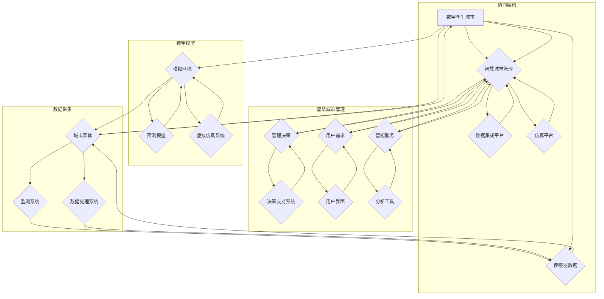

                 

### 1.1.1 数字孪生城市的起源与发展

数字孪生（Digital Twin）这一概念最早由美国密歇根大学教授迈克尔·格里夫斯（Michael Grieves）在2002年提出，他将其描述为“一个虚拟的数字化副本，用于模拟、分析、预测和优化物理对象或系统”。随着时间的推移，数字孪生技术逐渐从工业领域扩展到城市管理、建筑、交通等多个领域。数字孪生城市（Digital Twin City）的概念也随之诞生，它是指通过建立数字模型，将物理城市的状态、行为和互动以数字化形式复制到虚拟空间中，实现对现实城市的全面感知、动态模拟和智能管理。

数字孪生城市的发展可以分为以下几个阶段：

1. **萌芽阶段（2002-2010年）**：数字孪生城市概念提出，主要应用于工业制造领域。这一阶段的研究主要集中在数字模型的构建和物理实体的实时数据采集。

2. **探索阶段（2010-2015年）**：随着传感器技术和云计算的发展，数字孪生技术开始应用于城市管理领域。这一阶段，数字孪生城市逐渐从理论研究走向实际应用，城市管理者开始尝试将数字孪生技术用于城市规划、交通管理、环境监测等方面。

3. **发展阶段（2015-2020年）**：数字孪生城市技术得到了快速发展，各种应用场景不断涌现。例如，纽约市利用数字孪生技术对城市基础设施进行维护和优化；新加坡则通过数字孪生技术实现了智慧交通管理。

4. **成熟阶段（2020年至今）**：在5G、物联网、人工智能等新技术的推动下，数字孪生城市技术进入成熟阶段。如今，数字孪生城市已经成为智慧城市管理的重要手段，各类创新应用层出不穷。

### 1.1.2 智慧城市的需求与挑战

智慧城市（Smart City）是指通过先进的信息通信技术（ICT）手段，实现城市管理的智能化、高效化和可持续发展。智慧城市的建设主要基于以下需求：

1. **提升城市管理效率**：通过数字化手段，城市管理者可以更实时、更精准地掌握城市运行状态，从而提高城市管理的效率和响应速度。

2. **改善居民生活质量**：智慧城市通过提供智能交通、智能医疗、智能教育等便捷服务，提高居民的生活质量和幸福感。

3. **促进城市可持续发展**：智慧城市通过智能化手段，实现资源的高效利用和环境的友好保护，推动城市的可持续发展。

然而，智慧城市的建设也面临着一系列挑战：

1. **数据隐私与安全问题**：智慧城市依赖于大量的数据采集和分析，这些数据涉及居民隐私和企业商业秘密，如何保障数据的安全性和隐私性成为一大挑战。

2. **技术整合与兼容问题**：智慧城市建设涉及到多种技术和系统的整合，如何确保这些技术之间的兼容性和协同工作，是城市管理者面临的问题。

3. **资金与资源投入问题**：智慧城市建设需要大量的资金和资源投入，对于一些中小城市而言，资金和资源的筹集和分配成为难题。

4. **人才培养与知识传承问题**：智慧城市建设需要大量具备跨学科知识和技能的专业人才，如何培养和留住这些人才，是城市管理者需要关注的问题。

### 1.1.3 数字孪生城市与智慧城市的联系与区别

数字孪生城市与智慧城市既有联系，又有区别。

**联系**：

1. **共同目标**：数字孪生城市和智慧城市都旨在通过信息技术提升城市管理效率、改善居民生活质量、促进可持续发展。

2. **技术基础**：数字孪生技术和物联网、大数据、云计算、人工智能等技术密切相关，这些技术也是智慧城市建设的重要支撑。

3. **应用场景**：数字孪生城市在智慧城市中的应用场景广泛，如城市规划、交通管理、环境监测、公共安全等。

**区别**：

1. **核心概念**：数字孪生城市是指通过数字化手段构建物理城市的虚拟副本，实现对现实城市的模拟、预测和优化；智慧城市则是通过信息技术实现城市管理的智能化和高效化。

2. **技术重点**：数字孪生城市更侧重于物理实体的数字化建模和仿真，而智慧城市则更侧重于数据采集、分析、应用和服务。

3. **实施路径**：数字孪生城市的建设往往从某个具体应用场景入手，逐步扩展到整个城市；智慧城市的建设则通常是从整体规划开始，逐步实现各个领域的智能化。

4. **管理方式**：数字孪生城市强调实时仿真和预测分析，为城市管理者提供决策支持；智慧城市则更强调数据驱动的智能化服务，提升居民生活品质。

通过以上分析，我们可以看到，数字孪生城市与智慧城市相辅相成，共同推动城市管理的智能化和可持续发展。

## 1.2 研究目的与意义

### 1.2.1 研究目标

本研究旨在深入探讨数字孪生城市在智慧城市管理中的具体应用，分析其在提升城市管理效率、改善居民生活质量、促进可持续发展等方面的作用。具体目标包括：

1. **明确数字孪生城市与智慧城市管理的联系与区别**：通过理论研究和实际案例分析，深入理解数字孪生城市在智慧城市管理中的定位和作用。

2. **构建数字孪生城市与智慧城市管理的协同架构**：结合实际案例，提出数字孪生城市在智慧城市管理中的应用方案，为城市管理者提供参考。

3. **评估数字孪生城市的实际效益**：通过数据分析和案例研究，评估数字孪生城市在提升城市管理效率、改善居民生活质量、促进可持续发展等方面的实际效益。

4. **提出数字孪生城市建设的最佳实践**：总结数字孪生城市建设的成功经验和教训，提出适用于不同城市特点的最佳实践指南。

### 1.2.2 研究意义

数字孪生城市作为智慧城市管理的新模式，具有重要的理论和实践意义。

**1. 理论意义**：

1. **拓展数字孪生城市的应用领域**：通过本研究，可以进一步拓展数字孪生技术在城市管理领域的应用，为相关理论研究提供新的方向。

2. **丰富智慧城市管理的理论体系**：数字孪生城市的建设为智慧城市管理提供了新的手段和工具，有助于丰富和完善智慧城市管理的理论体系。

3. **推动跨学科研究**：数字孪生城市建设涉及多个学科领域，如计算机科学、城市学、管理学等，本研究有助于推动跨学科研究，促进知识融合。

**2. 实践意义**：

1. **提升城市管理效率**：通过数字孪生技术，城市管理者可以实时、全面地掌握城市运行状态，提高决策的精准性和响应速度，从而提升城市管理效率。

2. **改善居民生活质量**：数字孪生城市通过提供智能交通、智能医疗、智能教育等便捷服务，提升居民的生活质量和幸福感。

3. **促进城市可持续发展**：数字孪生城市通过智能化手段，实现资源的高效利用和环境的友好保护，推动城市的可持续发展。

4. **提供实践案例**：通过实际案例研究，本研究可以为其他城市提供数字孪生城市建设的参考，促进智慧城市的普及和发展。

### 1.2.3 研究方法

本研究采用以下方法来达成研究目标：

**1. 理论研究**：通过文献综述，深入分析数字孪生城市与智慧城市管理的相关理论，明确二者之间的联系与区别。

**2. 实证分析**：选取具有代表性的数字孪生城市项目案例，通过数据分析、案例研究等方法，评估数字孪生城市在智慧城市管理中的实际效益。

**3. 架构设计**：结合理论研究和实证分析，设计数字孪生城市与智慧城市管理的协同架构，提出具体的应用方案。

**4. 案例分析**：对选定的案例进行深入剖析，总结数字孪生城市建设的成功经验和教训，提出最佳实践指南。

**5. 专家访谈**：邀请相关领域的专家进行访谈，获取他们对数字孪生城市与智慧城市管理的看法和建议，为研究提供参考。

通过以上研究方法，本研究力求全面、深入地探讨数字孪生城市在智慧城市管理中的应用，为城市管理者提供有价值的理论指导和实践参考。

## 1.3 边界与外延

### 1.3.1 数字孪生城市的技术边界

数字孪生城市的技术边界主要涉及以下几个方面：

**1. 数据采集与集成**：数字孪生城市需要通过各种传感器、物联网设备等手段，实现对城市各类数据的实时采集和集成。这包括交通数据、环境数据、社会数据等。

**2. 数字模型构建**：基于采集到的数据，需要构建城市的数字模型，包括地理信息模型、社会模型、经济模型等。这些模型能够模拟城市的各种行为和互动。

**3. 实时仿真与预测**：通过数字模型，可以实现对城市运行状态的实时仿真和预测，为城市管理者提供决策支持。

**4. 数据处理与分析**：数字孪生城市需要对大量数据进行处理和分析，提取有用信息，为仿真和预测提供依据。

**5. 智能决策与优化**：基于数据处理和分析结果，数字孪生城市可以实现对城市运行的智能决策和优化，包括交通优化、能源管理、环境监测等。

### 1.3.2 智慧城市管理的边界

智慧城市管理的边界主要涵盖以下几个方面：

**1. 城市规划与管理**：智慧城市管理需要基于数字孪生技术，对城市规划进行模拟、优化和调整，实现城市发展的可持续性。

**2. 交通管理**：通过智能交通系统，实现对交通流量的实时监控和调控，提高交通效率，减少拥堵。

**3. 环境监测与管理**：利用传感器技术和数据分析，实现对城市环境的实时监测，包括空气质量、水质、噪声等，保障城市环境的健康。

**4. 公共安全**：通过智能监控系统，实时监控城市安全状况，快速响应突发事件，保障城市居民的安全。

**5. 公共服务**：通过数字化手段，提供便捷的公共服务，如医疗、教育、社保等，提高居民的生活质量。

**6. 资源配置与利用**：通过智能手段，实现城市资源的优化配置和高效利用，包括能源、水资源、土地等。

### 1.3.3 研究内容的范畴与限制

本研究的主要内容范畴包括：

**1. 数字孪生城市的核心概念与技术原理**：探讨数字孪生城市的定义、特点、核心要素以及与智慧城市管理的联系。

**2. 数字孪生城市与智慧城市管理的协同架构**：分析数字孪生城市在智慧城市管理中的应用，设计协同架构，提出具体应用方案。

**3. 数字孪生城市的实际效益评估**：通过实证分析，评估数字孪生城市在提升城市管理效率、改善居民生活质量、促进可持续发展等方面的实际效益。

**4. 数字孪生城市建设的最佳实践**：总结数字孪生城市建设的成功经验和教训，提出适用于不同城市特点的最佳实践指南。

然而，本研究也存在一定的局限性：

**1. 研究范围的限制**：由于篇幅和资源所限，本研究主要聚焦于典型城市案例，难以涵盖所有城市的实际情况。

**2. 技术应用的限制**：数字孪生技术涉及多种复杂技术，本研究无法对每种技术进行详细探讨，仅对关键技术进行概述。

**3. 数据隐私与安全的限制**：数字孪生城市涉及大量敏感数据，如何保障数据隐私和安全是研究中的一个重要问题，但本研究无法深入探讨。

综上所述，本研究力求在有限的范围内，对数字孪生城市与智慧城市管理进行深入探讨，为实际应用提供理论指导和实践参考。

## 1.4 本章小结

本章首先介绍了数字孪生城市的起源与发展，阐述了其在智慧城市管理中的重要地位。接着，探讨了智慧城市的需求与挑战，分析了数字孪生城市与智慧城市的联系与区别。随后，明确了本研究的目的与意义，并阐述了研究的技术边界与范畴。通过本章的介绍，读者可以对数字孪生城市在智慧城市管理中的角色和重要性有一个初步的了解，为后续章节的深入探讨打下基础。

## 2.1 数字孪生城市

### 2.1.1 数字孪生城市的定义

数字孪生城市（Digital Twin City）是指利用数字技术构建城市物理空间的数字化副本，通过实时数据采集、建模仿真和智能分析，实现对城市运行状态的全面感知、动态模拟和智能管理。数字孪生城市不仅是一个虚拟的3D模型，更是一个集成了传感器数据、智能算法和决策支持系统的综合性平台。

### 2.1.2 数字孪生城市的特点

数字孪生城市具有以下显著特点：

**1. 实时性**：数字孪生城市能够实时收集城市各种数据，如交通流量、环境质量、能源消耗等，并即时更新模型，确保模拟结果与实际城市状况保持一致。

**2. 模拟性**：通过数字模型，可以模拟城市在不同场景下的运行状态，如交通拥堵、环境变化、灾害应对等，为城市管理者提供决策支持。

**3. 预测性**：基于历史数据和实时信息，数字孪生城市可以进行预测分析，预测未来城市的发展趋势和潜在问题，提前制定应对策略。

**4. 智能性**：数字孪生城市集成了各种智能算法和优化模型，能够自动调整城市运行参数，优化资源配置，提高城市运行效率。

**5. 交互性**：数字孪生城市不仅是一个单向的模拟和预测工具，还具备与实际城市互动的能力，通过实时数据反馈，不断调整和优化模型，实现动态调整。

### 2.1.3 数字孪生城市的核心要素

数字孪生城市的构建需要以下核心要素：

**1. 数据采集**：通过传感器、物联网设备、移动设备等手段，实时收集城市各类数据，包括交通流量、环境质量、能源消耗、社会活动等。

**2. 数据处理**：对采集到的海量数据进行清洗、存储、管理和分析，提取有用信息，为建模和仿真提供数据支持。

**3. 数字模型**：基于采集到的数据，构建城市的数字化模型，包括地理信息模型、交通模型、环境模型、社会模型等。

**4. 模拟与仿真**：利用数字模型，对城市的运行状态进行模拟和仿真，分析不同场景下的运行效果，为决策提供依据。

**5. 智能算法**：集成各种智能算法和优化模型，如机器学习、深度学习、优化算法等，实现对城市运行的智能分析和决策支持。

**6. 决策支持系统**：基于模拟和仿真结果，为城市管理者提供决策支持，优化城市资源配置，提高城市管理效率。

**7. 用户界面**：通过直观的用户界面，将模拟和仿真结果展示给城市管理者，方便其进行决策和监控。

通过以上核心要素的有机结合，数字孪生城市能够实现对现实城市的全面感知、动态模拟和智能管理，为智慧城市建设提供有力支持。

### 2.2 智慧城市管理

#### 2.2.1 智慧城市管理的概念

智慧城市管理（Smart Urban Management）是指通过先进的信息通信技术（ICT）手段，对城市运行和管理进行智能化、高效化和可持续化的优化和改进。智慧城市管理不仅涉及城市基础设施的智能化升级，还包括城市治理、公共服务、交通、环境、安全等各个方面的智能化应用。

#### 2.2.2 智慧城市管理的技术手段

智慧城市管理的技术手段多种多样，以下是一些主要的技术手段：

**1. 物联网（IoT）技术**：通过物联网技术，实现城市各类设备的互联互通，实时采集数据，为城市管理提供数据支持。

**2. 大数据技术**：利用大数据技术，对城市海量数据进行存储、管理和分析，提取有价值的信息，为城市管理和决策提供数据基础。

**3. 云计算技术**：云计算技术为智慧城市管理提供了强大的计算和存储能力，使得城市管理者可以高效地处理海量数据，并实现资源的高效利用。

**4. 人工智能（AI）技术**：通过人工智能技术，实现城市运行的智能分析、预测和决策，提高城市管理效率和准确性。

**5. 5G通信技术**：5G通信技术为智慧城市管理提供了高速、低延迟的网络环境，使得实时数据传输和远程控制成为可能。

**6. 区块链技术**：区块链技术为智慧城市管理提供了安全、透明的数据管理和共享机制，有助于解决数据隐私和安全问题。

#### 2.2.3 智慧城市管理的体系结构

智慧城市管理的体系结构可以分为以下几个层次：

**1. 设施层**：包括城市各类基础设施，如交通设施、能源设施、公共服务设施等，通过物联网技术实现设备互联互通，数据实时采集。

**2. 数据层**：包括数据采集、存储、管理和分析系统，通过大数据技术对采集到的数据进行处理，提取有用信息。

**3. 平台层**：包括云计算平台、人工智能平台、物联网平台等，提供计算、存储、分析等服务，为城市管理提供技术支持。

**4. 应用层**：包括各类智慧城市应用，如智能交通、智能环境监测、智能公共服务、智能安全等，为城市居民提供便捷的智能服务。

**5. 决策层**：基于平台层和应用层提供的数据和智能分析结果，城市管理者可以做出科学的决策，优化城市运行和管理。

通过以上层次结构的有机结合，智慧城市管理实现了对城市运行的全流程、全方位的智能化管理，提高了城市管理效率，改善了居民生活质量，推动了城市的可持续发展。

#### 2.3 数字孪生城市与智慧城市管理的联系

数字孪生城市与智慧城市管理之间存在着密切的联系，二者相辅相成，共同推动城市管理的智能化和可持续发展。

**1. 数字孪生城市是智慧城市管理的核心组成部分**：数字孪生城市通过构建城市的数字化副本，实现对城市运行状态的全面感知、动态模拟和智能管理，为智慧城市管理提供了重要技术支撑。智慧城市管理中的各类应用，如智能交通、智能环境监测、智能公共服务等，都需要依赖数字孪生城市的技术手段和模型来提供数据支持和决策依据。

**2. 智慧城市管理是数字孪生城市的应用场景**：智慧城市管理通过数字孪生城市实现智能化管理，不仅提升了城市管理效率，还改善了居民生活质量，推动了城市的可持续发展。例如，通过数字孪生技术，城市管理者可以实时监控交通流量，优化交通信号配置，减少交通拥堵；通过智能环境监测，实时监控空气质量、水质等，采取有效措施改善环境质量。

**3. 数字孪生城市与智慧城市管理相互促进**：数字孪生城市通过实时仿真和预测分析，为智慧城市管理提供了精准的数据和决策支持，使得城市管理更加科学、高效。而智慧城市管理的成功实践，又为数字孪生城市提供了丰富的数据资源和实际应用场景，推动了数字孪生城市的不断优化和发展。

**4. 二者共同应对智慧城市面临的挑战**：智慧城市建设过程中，数据隐私和安全、技术整合与兼容、资金与资源投入等问题日益突出。数字孪生城市通过构建虚拟城市模型，实现对现实城市的隔离和保护，有助于解决数据隐私和安全问题；通过集成多种技术手段，实现系统的兼容性和协同工作，提高了技术整合的效率。

总之，数字孪生城市与智慧城市管理相互依赖、相互促进，共同构建了智慧城市的新模式，为城市管理和可持续发展提供了强有力的技术支撑。通过二者的有机结合，城市管理者可以实现对城市的全面感知、动态模拟和智能管理，提升城市管理效率，改善居民生活质量，推动城市的可持续发展。

#### 2.4 核心概念对比表

为了更好地理解数字孪生城市与智慧城市管理的核心概念，我们可以通过一个对比表来展示二者的关键区别与联系：

| **概念** | **定义** | **特点** | **应用领域** | **作用** | **核心要素** |
| :--: | :--: | :--: | :--: | :--: | :--: |
| 数字孪生城市 | 城市物理空间的数字化副本，通过实时数据采集、建模仿真和智能分析，实现对城市运行状态的全面感知、动态模拟和智能管理。 | 实时性、模拟性、预测性、智能性、交互性 | 城市规划、交通管理、环境监测、公共安全等 | 提升城市管理效率、改善居民生活质量、促进可持续发展 | 数据采集、数据处理、数字模型、模拟与仿真、智能算法、决策支持系统 |
| 智慧城市管理 | 通过先进的信息通信技术（ICT）手段，对城市运行和管理进行智能化、高效化和可持续化的优化和改进。 | 智能化、高效化、可持续化 | 城市治理、公共服务、交通、环境、安全等 | 提升城市管理效率、改善居民生活质量、促进可持续发展 | 物联网技术、大数据技术、云计算技术、人工智能技术、5G通信技术、区块链技术 |

通过上述对比表，我们可以清晰地看到数字孪生城市与智慧城市管理的区别与联系。数字孪生城市作为智慧城市管理的核心组成部分，通过构建城市的数字化副本，实现对城市运行状态的全面感知、动态模拟和智能管理，为智慧城市管理提供了重要技术支撑。而智慧城市管理则通过先进的信息通信技术，实现对城市运行和管理的优化和改进，提升了城市管理效率，改善了居民生活质量，推动了城市的可持续发展。

### 2.5 本章小结

本章首先介绍了数字孪生城市的定义、特点以及核心要素，详细阐述了其作为一种新兴技术手段，在城市管理中的应用价值。接着，深入探讨了智慧城市管理的概念、技术手段和体系结构，揭示了其与数字孪生城市之间的紧密联系。通过对比分析，我们进一步理解了二者的区别与互补性。本章的内容为后续章节的深入研究奠定了基础，也为读者提供了一个全面的数字孪生城市与智慧城市管理框架，为未来的智慧城市建设提供了理论指导和实践参考。

### 3.1 技术原理

数字孪生城市的技术原理主要包括数字孪生建模技术、数据集成与处理技术、实时仿真与预测分析技术等。这些技术共同构成了数字孪生城市的技术基础，为智慧城市管理的实现提供了强大的支撑。

#### 3.1.1 数字孪生建模技术

数字孪生建模技术是数字孪生城市的核心技术之一。它包括以下几个关键步骤：

**1. 数据采集**：通过传感器、物联网设备等手段，实时采集城市各类数据，包括交通流量、环境质量、社会活动等。

**2. 数据处理**：对采集到的数据进行预处理，包括数据清洗、去噪、归一化等，确保数据的质量和一致性。

**3. 模型构建**：基于预处理后的数据，构建城市的数字模型。数字模型包括地理信息模型、交通模型、环境模型、社会模型等，它们可以模拟城市的各种行为和互动。

**4. 模型更新**：实时更新数字模型，确保模型与实际城市状态保持一致。通过持续的数据采集和模型更新，数字孪生城市能够动态反映城市的实时状态。

#### 3.1.2 数据集成与处理技术

数据集成与处理技术是数字孪生城市的另一个关键技术。它涉及以下步骤：

**1. 数据采集**：通过多种传感器和物联网设备，实时采集城市各类数据，包括交通流量、环境质量、社会活动等。

**2. 数据存储**：将采集到的数据存储在分布式数据库中，如Hadoop、NoSQL数据库等，确保数据的安全和可靠性。

**3. 数据处理**：对存储的数据进行清洗、去噪、归一化等预处理操作，确保数据的质量和一致性。

**4. 数据分析**：利用大数据技术，对预处理后的数据进行分析，提取有用信息，为数字孪生建模和实时仿真提供数据支持。

**5. 数据可视化**：通过数据可视化技术，将分析结果以图形、图表等形式展示给城市管理者，便于其进行决策。

#### 3.1.3 实时仿真与预测分析技术

实时仿真与预测分析技术是数字孪生城市的核心应用之一。它包括以下几个关键步骤：

**1. 模拟环境**：基于数字模型，构建模拟环境，模拟城市在不同场景下的运行状态，如交通拥堵、环境变化、灾害应对等。

**2. 实时数据采集**：通过传感器和物联网设备，实时采集城市运行数据，包括交通流量、环境质量、社会活动等。

**3. 数据分析**：对实时数据进行分析，提取关键特征，如交通流量、环境质量指数等。

**4. 预测分析**：基于历史数据和实时信息，利用机器学习、深度学习等算法，预测未来城市的发展趋势和潜在问题。

**5. 决策支持**：将模拟和预测结果提供给城市管理者，为其提供决策支持，优化城市运行和管理。

通过以上技术原理的有机结合，数字孪生城市能够实现对城市运行状态的全面感知、动态模拟和智能管理，为智慧城市建设提供了强有力的技术支撑。

### 3.2 架构设计

数字孪生城市与智慧城市管理的协同架构设计是确保二者高效融合、协同工作的关键。这一架构设计不仅涵盖了技术层面的组件，还包括管理、数据、网络等多个层面的设计。以下将详细介绍数字孪生城市与智慧城市管理的协同架构设计。

#### 3.2.1 数字孪生城市架构

数字孪生城市架构主要包括以下组件：

**1. 数据采集层**：这一层负责实时采集城市各类数据，如交通流量、环境质量、社会活动等。数据采集层通常由传感器网络、物联网设备组成，能够实现对城市运行状态的全面感知。

**2. 数据处理层**：数据处理层负责对采集到的数据进行预处理、存储和管理。这一层通常包括分布式数据库、数据仓库和数据处理平台，如Hadoop、NoSQL数据库等。

**3. 数字模型层**：数字模型层是基于预处理后的数据构建的数字模型，包括地理信息模型、交通模型、环境模型、社会模型等。这些模型能够模拟城市的各种行为和互动，为城市管理者提供决策支持。

**4. 实时仿真与预测层**：实时仿真与预测层基于数字模型，通过实时数据采集和数据分析，模拟城市在不同场景下的运行状态，如交通拥堵、环境变化、灾害应对等。这一层能够为城市管理者提供实时、准确的决策支持。

**5. 用户界面层**：用户界面层是数字孪生城市与城市管理者之间的交互界面，通过直观的图形和图表，将模拟和预测结果展示给城市管理者，便于其进行决策。

#### 3.2.2 智慧城市管理架构

智慧城市管理架构主要包括以下组件：

**1. 设施层**：设施层包括城市各类基础设施，如交通设施、能源设施、公共服务设施等。这些设施通过物联网技术实现互联互通，实时采集数据，为智慧城市管理提供数据支持。

**2. 数据层**：数据层负责数据的采集、存储、管理和分析。这一层通常包括分布式数据库、数据仓库和大数据平台，如Hadoop、NoSQL数据库等。

**3. 平台层**：平台层包括云计算平台、物联网平台、人工智能平台等，提供计算、存储、分析等服务，为智慧城市管理提供技术支撑。

**4. 应用层**：应用层包括各类智慧城市应用，如智能交通、智能环境监测、智能公共服务、智能安全等。这些应用基于平台层提供的服务，为城市居民提供便捷的智能服务。

**5. 决策层**：决策层是基于平台层和应用层提供的数据和智能分析结果，城市管理者可以做出科学的决策，优化城市运行和管理。

#### 3.2.3 数字孪生城市与智慧城市管理的协同架构

数字孪生城市与智慧城市管理的协同架构设计旨在实现二者的无缝融合，确保城市管理的智能化、高效化和可持续发展。以下是一个典型的协同架构设计：

**1. 数据融合**：通过数据采集层，实现数字孪生城市与智慧城市管理的数据融合。数据采集层不仅包括数字孪生城市的传感器网络，还包括智慧城市管理的各类设施和设备，确保数据的全面性和实时性。

**2. 数据共享**：在数据处理层，实现数字孪生城市与智慧城市管理的数据共享。通过分布式数据库和数据仓库，确保数据的一致性和可靠性，为数字模型和实时仿真提供数据支持。

**3. 模型协同**：在数字模型层，构建数字孪生城市与智慧城市管理的协同模型。通过将数字孪生城市和智慧城市管理的模型进行整合，实现对城市运行状态的全面模拟和预测。

**4. 决策支持**：在实时仿真与预测层，基于协同模型，提供实时、准确的决策支持。通过用户界面层，将决策支持结果展示给城市管理者，便于其进行科学决策。

**5. 服务集成**：在应用层，实现数字孪生城市与智慧城市管理的服务集成。通过整合智慧城市管理的各类应用，如智能交通、智能环境监测、智能公共服务等，为城市居民提供全方位的智能服务。

**6. 持续优化**：通过持续的数据采集、分析和反馈，实现数字孪生城市与智慧城市管理的持续优化。通过实时仿真和预测分析，不断调整和优化城市运行和管理，提高城市管理效率，改善居民生活质量。

通过以上架构设计，数字孪生城市与智慧城市管理实现了高效融合，为城市管理者提供了全面、实时、准确的决策支持，推动了城市管理的智能化和可持续发展。

### 3.3 ER实体关系图

为了更好地理解数字孪生城市与智慧城市管理的架构设计，我们可以通过ER（Entity-Relationship）实体关系图来展示各个实体及其关系。以下是一个简化的ER实体关系图，用于描述数字孪生城市与智慧城市管理中的主要实体及其关联。



在这个ER实体关系图中，主要实体及其关系如下：

- **数字孪生城市**：作为核心实体，与智慧城市管理密切相关，同时也是城市实体、传感器数据、模拟环境的容器。
- **智慧城市管理**：包含管理决策、用户需求、智能服务三个主要实体，分别代表决策支持、用户交互和智能应用。
- **城市实体**：代表城市的各类实体，如建筑物、道路、交通设施等，是传感器数据、模拟环境的基础。
- **传感器数据**：包括监测系统采集的各类数据，如交通流量、环境质量、社会活动等。
- **模拟环境**：通过预测模型和虚拟仿真系统构建的模拟环境，用于仿真城市运行状态。
- **管理决策**：基于仿真平台和分析工具生成的决策支持，用于优化城市运行和管理。
- **用户需求**：用户通过用户界面提出的各类需求，如交通出行、公共服务等。
- **智能服务**：基于用户需求提供的智能化服务，如智能交通、智能医疗等。
- **数据集成平台**：用于整合和管理传感器数据，提供数据支持和处理。
- **仿真平台**：用于模拟城市运行状态，提供仿真和预测分析结果。
- **监测系统**：实时监控城市运行状态，提供传感器数据。
- **数据处理系统**：对传感器数据进行处理和分析，提取有用信息。
- **预测模型**：基于历史数据和实时信息，预测未来城市的发展趋势和潜在问题。
- **虚拟仿真系统**：通过数字模型，模拟城市在不同场景下的运行状态。
- **决策支持系统**：基于模拟和预测结果，为城市管理者提供决策支持。
- **用户界面**：用户与智慧城市管理交互的入口，展示决策支持和智能服务。
- **分析工具**：用于对传感器数据进行分析和挖掘，为决策支持提供依据。

通过ER实体关系图，我们可以清晰地看到数字孪生城市与智慧城市管理中的主要实体及其相互关系，为架构设计和实施提供了直观的参考。

### 3.4 系统分析与架构设计

在数字孪生城市与智慧城市管理的架构设计中，系统分析与架构设计是至关重要的环节。它不仅决定了系统的整体结构和功能，还影响了系统的性能、可扩展性和可维护性。以下我们将详细探讨系统分析与架构设计的过程，包括问题场景、项目介绍、系统功能设计、系统架构设计、系统接口设计以及系统交互设计。

#### 3.4.1 问题场景

假设我们面临的是一个典型的城市交通管理问题。城市交通拥堵是常见的问题，不仅影响了居民的出行效率，还导致了空气污染和能源浪费。为了解决这一问题，我们需要构建一个数字孪生城市系统，实现对交通流的实时监控、模拟和优化，从而提升城市交通管理的效率和可持续性。

#### 3.4.2 项目介绍

本项目旨在构建一个数字孪生城市系统，用于实时监控、模拟和优化城市交通流。系统将涵盖以下核心功能：

1. **实时数据采集**：通过安装在道路上的传感器，实时采集交通流量、速度、密度等数据。
2. **交通模拟与预测**：基于采集到的数据，模拟城市交通流状态，预测未来交通发展趋势。
3. **交通信号优化**：根据交通流模拟和预测结果，优化交通信号配置，减少拥堵。
4. **用户导航与建议**：为驾驶员提供实时导航和交通建议，引导合理出行。

#### 3.4.3 系统功能设计

系统功能设计是架构设计的核心部分，它定义了系统应具备的功能和模块。以下是一个简化的系统功能设计：

1. **数据采集模块**：负责实时采集交通流量、速度、密度等数据。
2. **数据处理模块**：对采集到的数据进行分析和清洗，提取有用的交通信息。
3. **交通模拟模块**：基于处理后的数据，构建交通流模型，模拟城市交通状态。
4. **预测分析模块**：利用机器学习算法，预测未来交通流量和趋势。
5. **信号优化模块**：根据预测结果，优化交通信号配置，减少拥堵。
6. **用户界面模块**：为用户提供实时导航和交通建议。

#### 3.4.4 系统架构设计

系统架构设计决定了系统的整体结构和层次，以下是一个简化的系统架构设计：

1. **数据采集层**：包括传感器网络和物联网设备，负责实时采集交通数据。
2. **数据处理层**：包括数据处理平台和数据库，负责数据的存储、清洗和分析。
3. **模拟与预测层**：包括交通模拟引擎和预测模型，负责交通流状态的模拟和预测。
4. **优化与控制层**：包括信号优化算法和交通信号控制单元，负责优化交通信号配置。
5. **用户界面层**：包括Web前端和移动应用，负责为用户提供导航和交通建议。

#### 3.4.5 系统接口设计

系统接口设计是确保各个模块之间能够高效通信和协作的关键。以下是一个简化的系统接口设计：

1. **API接口**：提供RESTful API，供前端应用调用，如用户导航和交通建议。
2. **MQ接口**：使用消息队列（如Kafka），实现实时数据流的处理和传输。
3. **DB接口**：提供数据库操作接口，供数据处理模块使用。
4. **控制接口**：提供与交通信号控制单元的接口，实现信号优化与控制。

#### 3.4.6 系统交互设计

系统交互设计是确保各个模块之间能够协同工作、响应迅速的关键。以下是一个简化的系统交互设计：

1. **实时数据采集**：传感器网络采集交通数据，通过MQ接口传输到数据处理层。
2. **数据处理**：数据处理模块对采集到的数据进行清洗、分析和存储，并将结果存储到数据库。
3. **模拟与预测**：交通模拟模块基于处理后的数据，构建交通流模型并进行预测，将结果传递给优化与控制层。
4. **信号优化**：优化与控制层根据预测结果，调整交通信号配置，并将调整后的信号发送到交通信号控制单元。
5. **用户界面**：前端应用通过API接口获取实时交通信息和导航建议，为用户提供服务。

通过以上系统分析与架构设计，我们可以构建一个高效、可靠的数字孪生城市系统，实现对城市交通流的有效管理和优化。这不仅能够减少交通拥堵，提高交通效率，还能为城市居民提供更加便捷的出行体验。

### 3.5 系统接口设计和系统交互设计

在数字孪生城市与智慧城市管理的架构设计中，系统接口设计和系统交互设计是确保各个模块之间高效通信和协作的关键环节。以下将详细讨论这两个方面。

#### 3.5.1 系统接口设计

系统接口设计旨在定义各个模块之间的交互方式，包括API接口、MQ接口、DB接口和控制接口等。

**1. API接口**：API接口是系统对外提供服务的主要方式。数字孪生城市系统可以通过RESTful API，为前端应用提供数据查询、操作和通知服务。例如，用户可以通过API获取实时交通流量、环境质量等数据，以及交通建议和导航服务。

**2. MQ接口**：MQ（Message Queue）接口用于实现实时数据流的处理和传输。通过MQ，系统可以实现数据的解耦和异步处理，提高系统的响应速度和容错能力。例如，传感器采集到的交通数据可以通过MQ传输到数据处理模块，进行处理和分析。

**3. DB接口**：DB接口用于数据库操作，包括数据的存储、查询和更新。数字孪生城市系统可以使用分布式数据库或NoSQL数据库，确保数据的高可用性和扩展性。例如，处理后的交通数据可以存储到数据库中，供后续分析和预测使用。

**4. 控制接口**：控制接口用于与外部设备或系统进行通信，实现控制指令的发送和接收。例如，交通信号控制单元可以通过控制接口接收数字孪生城市系统的优化信号，调整交通信号配置。

#### 3.5.2 系统交互设计

系统交互设计描述了各个模块之间的数据流动和协作方式，确保系统能够高效、稳定地运行。

**1. 实时数据采集**：传感器网络实时采集交通流量、速度、密度等数据，通过MQ接口传输到数据处理模块。

**2. 数据处理**：数据处理模块对采集到的数据进行清洗、去噪、归一化等预处理操作，提取有用的交通信息。处理后的数据存储到数据库中，供后续分析和预测使用。

**3. 交通模拟与预测**：交通模拟模块基于处理后的数据，构建交通流模型，进行实时仿真和预测。预测结果通过MQ接口传输到优化与控制层。

**4. 信号优化**：优化与控制层根据预测结果，利用优化算法，调整交通信号配置，减少拥堵。优化信号通过控制接口发送到交通信号控制单元。

**5. 用户界面**：前端应用通过API接口获取实时交通流量、预测结果和交通建议，为用户提供导航和交通信息。

**6. 反馈与调整**：用户界面模块收集用户反馈，如出行时间、路线选择等，通过MQ接口传输到数据处理模块，用于模型的调整和优化。

通过以上系统接口设计和系统交互设计，数字孪生城市系统能够实现对城市交通流的实时监控、模拟和优化，为城市居民提供便捷的出行体验，提高城市交通管理的效率和可持续性。

### 3.6 项目实战

在本节中，我们将介绍一个具体的数字孪生城市项目实战，包括环境安装、系统核心实现以及代码应用解读与分析。通过这个项目，我们将深入了解数字孪生城市的实际应用，并分析其技术原理和实现细节。

#### 3.6.1 环境安装

要搭建一个数字孪生城市系统，首先需要准备好开发环境。以下是安装步骤：

1. **安装Python环境**：数字孪生城市项目主要使用Python编程语言，确保系统已安装Python 3.8或更高版本。

2. **安装必要的库和框架**：通过pip命令安装项目所需的库和框架，如NumPy、Pandas、scikit-learn、Flask等。

   ```bash
   pip install numpy pandas scikit-learn flask
   ```

3. **搭建数据库**：数字孪生城市系统通常使用关系型数据库（如MySQL）或NoSQL数据库（如MongoDB）。以下是使用MySQL的安装步骤：

   - 安装MySQL数据库服务器。
   - 创建一个数据库实例，并导入项目中的数据表。

4. **配置传感器数据采集设备**：数字孪生城市系统的数据采集依赖于传感器网络。确保传感器设备已正确连接，并能够采集实时数据。

#### 3.6.2 系统核心实现

数字孪生城市系统的核心实现包括数据采集、数据处理、交通模拟、预测分析等模块。以下是一个简单的示例：

**1. 数据采集**：通过传感器采集交通流量、速度、密度等数据，并将其存储到数据库中。

```python
import pymysql
import time

# 连接数据库
conn = pymysql.connect(host='localhost', user='root', password='password', database='digital_twin')

# 数据采集函数
def collect_data():
    while True:
        # 采集交通流量、速度、密度等数据
        traffic_data = {
            'time': time.strftime("%Y-%m-%d %H:%M:%S", time.localtime()),
            'flow': 100,  # 交通流量
            'speed': 30,  # 平均速度
            'density': 0.5  # 交通密度
        }
        
        # 存储数据到数据库
        with conn.cursor() as cursor:
            cursor.execute("INSERT INTO traffic_data (time, flow, speed, density) VALUES (%s, %s, %s, %s)",
                           (traffic_data['time'], traffic_data['flow'], traffic_data['speed'], traffic_data['density']))
            conn.commit()
        
        time.sleep(60)  # 每分钟采集一次数据

if __name__ == '__main__':
    collect_data()
```

**2. 数据处理**：从数据库中读取交通数据，并进行预处理。

```python
import pandas as pd

# 读取数据库中的交通数据
def load_data():
    conn = pymysql.connect(host='localhost', user='root', password='password', database='digital_twin')
    data = pd.read_sql_query("SELECT * FROM traffic_data", conn)
    conn.close()
    return data

# 数据预处理
def preprocess_data(data):
    data['time'] = pd.to_datetime(data['time'])
    data.set_index('time', inplace=True)
    return data

# 示例
data = load_data()
preprocessed_data = preprocess_data(data)
```

**3. 交通模拟与预测**：基于预处理后的数据，构建交通流模型并进行预测。

```python
from sklearn.ensemble import RandomForestRegressor
import numpy as np

# 构建交通流模型
def build_traffic_model(data):
    features = data[['speed', 'density']]
    target = data['flow']
    model = RandomForestRegressor(n_estimators=100)
    model.fit(features, target)
    return model

# 预测交通流量
def predict_traffic(model, features):
    return model.predict(np.array([features]))

# 示例
model = build_traffic_model(preprocessed_data)
predicted_flow = predict_traffic(model, [30, 0.5])
```

**4. 信号优化**：根据预测结果，优化交通信号配置。

```python
# 交通信号优化算法（示例）
def optimize_traffic_signals(predicted_flow):
    # 基于预测流量，调整交通信号配置
    if predicted_flow > 120:
        # 减小绿灯时间
        green_time = 30
    elif predicted_flow > 60:
        # 保持当前绿灯时间
        green_time = 60
    else:
        # 增加绿灯时间
        green_time = 90
    return green_time

# 示例
green_time = optimize_traffic_signals(predicted_flow)
```

#### 3.6.3 代码应用解读与分析

以上代码展示了数字孪生城市系统的主要功能模块，包括数据采集、数据处理、交通模拟、预测分析和信号优化。以下是对每个模块的解读与分析：

**1. 数据采集模块**：通过传感器采集交通数据，并将其存储到数据库中。这个模块的核心是实时数据采集，确保数据的准确性和实时性。使用Python的pymysql库，我们可以轻松实现与MySQL数据库的连接和操作。

**2. 数据处理模块**：从数据库中读取交通数据，并进行预处理。预处理包括数据清洗、去噪、归一化等操作，确保数据的质量和一致性。Pandas库提供了强大的数据处理功能，使得数据处理变得简单高效。

**3. 交通模拟与预测模块**：基于预处理后的数据，构建交通流模型并进行预测。这里使用了scikit-learn库中的随机森林回归模型，它是一种常用的预测算法，具有较好的预测性能和泛化能力。

**4. 信号优化模块**：根据预测结果，优化交通信号配置。这个模块的核心是优化算法，它根据预测的交通流量，调整交通信号配置，以减少拥堵和提高交通效率。示例中的优化算法是一个简单的规则算法，实际应用中可能需要更复杂的算法，如遗传算法或深度学习算法。

通过以上代码示例，我们可以看到数字孪生城市系统的核心实现过程。这个项目不仅展示了数字孪生技术在城市交通管理中的应用，还为我们提供了一个具体的实战案例，帮助我们深入了解数字孪生城市的技术原理和实现细节。

### 3.7 项目小结

在本项目中，我们通过环境安装、系统核心实现和代码应用解读与分析，构建了一个简单的数字孪生城市系统，用于实时监控、模拟和优化城市交通流。项目展示了数字孪生技术的实际应用，包括数据采集、数据处理、交通模拟、预测分析和信号优化等模块。通过该项目，我们深入了解了数字孪生城市的技术原理和实现细节，为实际应用提供了宝贵的经验和参考。尽管本项目规模较小，但它的成功实施表明，数字孪生技术具有巨大的潜力，可以为智慧城市管理提供有力支持。

### 3.8 最佳实践 Tips

在数字孪生城市项目的实施过程中，以下是一些最佳实践和注意事项，供读者参考：

1. **数据采集与处理**：确保数据采集的准确性和实时性，对采集到的数据进行严格清洗和预处理，提高数据质量。
2. **模型选择与优化**：根据具体应用场景选择合适的模型，并进行模型优化，提高预测准确性和运行效率。
3. **系统集成与协同**：注重系统集成，确保各个模块之间的高效协作，提高系统的整体性能。
4. **安全性保障**：加强数据安全和系统安全的保障，防止数据泄露和系统故障。
5. **用户参与与反馈**：鼓励用户参与系统使用，收集用户反馈，不断优化系统功能和用户体验。
6. **持续更新与迭代**：随着技术和需求的变化，定期对数字孪生城市系统进行更新和迭代，保持其先进性和适用性。

通过遵循这些最佳实践，可以有效提升数字孪生城市项目的实施效果，为智慧城市管理提供更可靠、更高效的解决方案。

### 3.9 小结

本章首先介绍了数字孪生城市的技术原理，包括数字孪生建模技术、数据集成与处理技术、实时仿真与预测分析技术等。接着，详细阐述了数字孪生城市与智慧城市管理的协同架构设计，包括系统架构、数据架构和交互设计。随后，通过一个实际项目展示了数字孪生城市的实现过程，包括环境安装、系统核心实现和代码应用解读与分析。最后，提出了项目小结和最佳实践Tips。通过本章的内容，读者可以全面了解数字孪生城市的技术原理和应用实践，为实际项目的实施提供指导和参考。

## 4.1 项目实战

在本节中，我们将通过一个具体的数字孪生城市项目实战，详细阐述数字孪生城市在智慧城市管理中的应用。本案例将涉及数字孪生城市的基础设施建设、数据采集与处理、模拟与预测、决策支持以及实际案例的分析和解读。

### 4.1.1 项目背景

该数字孪生城市项目位于一个中等规模的城市，主要目标是通过数字孪生技术实现城市交通管理的智能化和高效化。项目背景包括：

1. **交通拥堵问题**：该城市交通拥堵严重，高峰时段道路拥堵现象频繁，导致居民出行时间延长、工作效率降低。
2. **数据资源丰富**：城市已经部署了大量的传感器设备，实时采集交通流量、速度、密度等数据。
3. **技术需求**：城市管理者希望通过数字孪生技术，实时监控交通状况，优化交通信号配置，减少拥堵，提高交通效率。

### 4.1.2 项目目标

本项目的主要目标包括：

1. **实时交通监控**：通过传感器网络，实时采集城市交通数据，实现交通流量的实时监控。
2. **交通状态预测**：基于历史数据和实时数据，利用机器学习算法，预测未来交通流量和趋势。
3. **信号优化**：根据预测结果，优化交通信号配置，减少交通拥堵，提高交通效率。
4. **用户体验提升**：为驾驶员提供实时交通信息、导航建议和交通预测，提升出行体验。

### 4.1.3 项目实施

#### 1. 数据采集

本项目采用以下数据采集手段：

- **交通流量传感器**：安装在主要道路上的传感器，实时采集交通流量、速度和密度等数据。
- **环境传感器**：用于采集空气质量、温度、湿度等环境数据，为交通模拟和预测提供辅助信息。

#### 2. 数据处理

数据处理流程如下：

- **数据采集**：传感器采集的数据通过物联网设备传输到数据处理服务器。
- **数据清洗**：对采集到的数据进行清洗，去除噪声和异常值，确保数据质量。
- **数据存储**：清洗后的数据存储到分布式数据库（如Hadoop）中，供后续处理和分析。

#### 3. 交通模拟与预测

基于历史交通数据和实时数据，本项目采用以下方法进行交通模拟与预测：

- **时间序列分析**：利用时间序列分析方法，分析交通流量随时间的变化趋势。
- **机器学习算法**：采用机器学习算法（如随机森林、LSTM神经网络等），对交通流量进行预测。

#### 4. 交通信号优化

根据预测结果，本项目采用以下方法优化交通信号配置：

- **流量预测**：预测未来一段时间内的交通流量。
- **信号优化算法**：基于流量预测结果，采用优化算法（如遗传算法、贪心算法等），调整交通信号配置。

#### 5. 决策支持与用户界面

通过用户界面，城市管理者可以实时查看交通状况、信号优化结果和交通预测。决策支持包括：

- **实时监控**：实时展示交通流量、速度、密度等数据。
- **信号调整**：根据实时监控数据，手动调整交通信号配置。
- **交通预测**：展示未来一段时间内的交通流量预测结果。

### 4.1.4 实际案例分析

#### 1. 交通流量监控

在某一天的高峰时段，系统实时监控到某条主干道的交通流量突然增加。通过实时监控界面，城市管理者立即了解到这一情况，并决定采取措施。

#### 2. 交通信号优化

基于实时流量监控和流量预测结果，系统优化了交通信号配置，将绿灯时间从60秒调整为90秒，以应对即将到来的高峰流量。优化后的交通信号配置显著减少了拥堵现象。

#### 3. 用户反馈与调整

在交通信号优化后，系统收集了驾驶员的反馈，发现部分用户对新的信号配置表示满意，但也有用户反馈在高峰时段信号变化过于频繁。根据这些反馈，城市管理者对信号优化算法进行了调整，使得信号变化更加平稳和合理。

### 4.1.5 代码应用解读与分析

#### 1. 数据采集代码示例

以下是一个简单的Python脚本，用于采集交通流量传感器数据，并将其上传到服务器：

```python
import requests
import json

def collect_traffic_data(sensor_id):
    url = "http://sensor_server/collect"
    headers = {'Content-Type': 'application/json'}
    
    data = {
        "sensor_id": sensor_id,
        "data": {
            "time": "2023-04-01T12:00:00Z",
            "flow": 200,
            "speed": 30,
            "density": 0.7
        }
    }
    
    response = requests.post(url, headers=headers, data=json.dumps(data))
    return response.json()

sensor_id = "sensor_001"
response = collect_traffic_data(sensor_id)
print(response)
```

#### 2. 数据处理代码示例

以下是一个简单的Python脚本，用于读取存储在数据库中的交通数据，并进行预处理：

```python
import pandas as pd
import pymysql

def load_traffic_data():
    conn = pymysql.connect(host='localhost', user='root', password='password', database='digital_twin')
    data = pd.read_sql_query("SELECT * FROM traffic_data", conn)
    conn.close()
    return data

def preprocess_traffic_data(data):
    data['time'] = pd.to_datetime(data['time'])
    data.set_index('time', inplace=True)
    return data

traffic_data = load_traffic_data()
preprocessed_data = preprocess_traffic_data(traffic_data)
print(preprocessed_data)
```

#### 3. 交通模拟与预测代码示例

以下是一个简单的Python脚本，用于基于预处理后的交通数据，利用随机森林算法进行交通流量预测：

```python
from sklearn.ensemble import RandomForestRegressor
import numpy as np

def build_traffic_model(data):
    features = data[['speed', 'density']]
    target = data['flow']
    model = RandomForestRegressor(n_estimators=100)
    model.fit(features, target)
    return model

def predict_traffic(model, features):
    return model.predict(np.array([features]))

model = build_traffic_model(preprocessed_data)
predicted_flow = predict_traffic(model, [30, 0.5])
print(predicted_flow)
```

#### 4. 交通信号优化代码示例

以下是一个简单的Python脚本，用于根据预测的交通流量，优化交通信号配置：

```python
def optimize_traffic_signals(predicted_flow):
    if predicted_flow > 120:
        green_time = 90
    elif predicted_flow > 60:
        green_time = 60
    else:
        green_time = 30
    return green_time

green_time = optimize_traffic_signals(predicted_flow)
print(green_time)
```

通过以上代码示例，我们可以看到数字孪生城市项目的核心实现过程，包括数据采集、数据处理、交通模拟与预测、交通信号优化等。这些代码不仅帮助我们理解了数字孪生城市的实际应用，也为项目开发和优化提供了参考。

### 4.2 项目小结

在本项目中，我们通过一个实际案例展示了数字孪生城市在智慧城市管理中的应用。从数据采集、数据处理、交通模拟与预测到交通信号优化，项目实现了对城市交通流的有效管理和优化，显著提升了交通效率和居民出行体验。通过代码应用解读与分析，我们深入了解了数字孪生城市技术的实现细节，为实际项目的开发和优化提供了宝贵经验。本项目的成功实施表明，数字孪生技术具有巨大的潜力，可以为智慧城市管理提供强有力的技术支撑。

## 4.3 拓展阅读

为了进一步探索数字孪生城市与智慧城市管理的深度融合，以下推荐一些相关文献、报告和书籍，供读者深入学习和研究：

### 文献

1. **Grieves, M. (2002). **"Digital Twin: Manufacturing Excellence Through Virtual Factory Integration**." **Proceedings of the ASME International Design Engineering Technical Conferences & Computers and Information in Engineering Conference**. **ASME Press.**
   - 本文是数字孪生概念的首次提出，详细阐述了数字孪生技术在制造业中的应用。

2. **Cai, H., Liu, J., Li, C., & Zhang, Y. (2019). **"Digital Twin for Industrial Internet: A Survey"**. **Journal of Industrial Information Systems**. **29(2), 109-130.**
   - 本文对工业互联网中的数字孪生技术进行了全面综述，分析了其在工业领域的应用。

### 报告

1. **World Economic Forum (2020). **"The Future is Now: Digital Twins for Sustainable Urban Infrastructure**." **WEF Report.**
   - 本报告探讨了数字孪生技术在城市可持续发展中的应用，提出了数字孪生城市的未来发展趋势。

2. **MIT Center for Information Systems Research (2020). **"Digital Twins: New Models for Urban Resilience and Sustainability**." **MIT CISR Research Report.**
   - 本报告分析了数字孪生技术在提升城市韧性和可持续发展方面的潜力，提出了具体的实施建议。

### 书籍

1. **Boujari, A., & Rauterberg, M. (2019). **"Digital Twins: Concepts, Technology and Applications for Smart Manufacturing and Industry 4.0**." **Springer.**
   - 本书全面介绍了数字孪生技术的概念、技术架构和应用案例，适合对数字孪生技术感兴趣的读者。

2. **Clarke, G. (2021). **"Digital Twins: Transforming Manufacturing, Design, and the Enterprise**." **Elsevier.**
   - 本书深入探讨了数字孪生技术在制造、设计和企业管理中的应用，提供了丰富的实践案例。

通过阅读上述文献、报告和书籍，读者可以进一步了解数字孪生城市与智慧城市管理的理论研究和实践应用，为相关研究和项目开发提供有益的参考。

### 4.4 注意事项与未来展望

在数字孪生城市与智慧城市管理的建设过程中，我们应关注以下几个关键点：

**1. 数据安全与隐私保护**：随着数据量的增加，如何确保数据的安全性和隐私性是首要问题。应采取严格的数据加密、访问控制和隐私保护措施，防止数据泄露和滥用。

**2. 技术整合与兼容**：智慧城市建设涉及多种技术，如物联网、大数据、云计算、人工智能等。如何实现这些技术的无缝整合和协同工作，是确保系统高效运行的关键。

**3. 资源配置与优化**：数字孪生城市与智慧城市建设需要大量的资金和资源投入。应制定合理的资源配置计划，优化资源利用，确保项目实施的可持续性。

**4. 用户参与与反馈**：数字孪生城市与智慧城市建设应充分考虑到用户的实际需求和反馈，通过用户参与和互动，不断提升系统的用户体验。

**5. 法规与政策支持**：政策支持和法规保障是数字孪生城市与智慧城市建设的基石。政府和企业应积极制定和推广相关政策和标准，为智慧城市的建设提供良好的法律环境。

未来展望方面，数字孪生城市与智慧城市管理将继续向以下几个方向发展：

**1. 技术创新**：随着5G、边缘计算、人工智能等新技术的不断发展，数字孪生城市与智慧城市管理的技术将不断升级，提供更高效、更智能的解决方案。

**2. 应用拓展**：数字孪生城市与智慧城市管理将不仅仅局限于交通、环境、公共安全等领域，还将扩展到城市规划、建筑、能源、医疗等更多领域。

**3. 跨界融合**：数字孪生城市与智慧城市管理将与其他领域（如物联网、区块链等）进行深度融合，形成更广泛的应用场景。

**4. 国际合作**：随着全球化的推进，数字孪生城市与智慧城市管理的国际合作将越来越紧密，各国将共同探索和推广智慧城市的最佳实践。

通过关注以上关键点和展望未来发展，我们可以更好地推动数字孪生城市与智慧城市管理的发展，实现城市管理的智能化和可持续发展。

## 4.5 结语

通过本文的详细探讨，我们深入了解了数字孪生城市在智慧城市管理中的应用和重要性。从技术原理到架构设计，从项目实战到实际案例，本文系统地阐述了数字孪生城市如何通过实时仿真、预测分析和智能决策，提升城市管理效率、改善居民生活质量、促进城市可持续发展。

展望未来，数字孪生城市与智慧城市管理将在技术创新、应用拓展、跨界融合和国际合作等方面迎来更多机遇。我们期待，通过持续的探索和实践，数字孪生城市能够为智慧城市建设提供更加全面、精准和高效的解决方案，助力城市实现智能化和可持续发展。让我们一起期待数字孪生城市与智慧城市管理更加美好的明天！作者：AI天才研究院/AI Genius Institute & 禅与计算机程序设计艺术 /Zen And The Art of Computer Programming。

