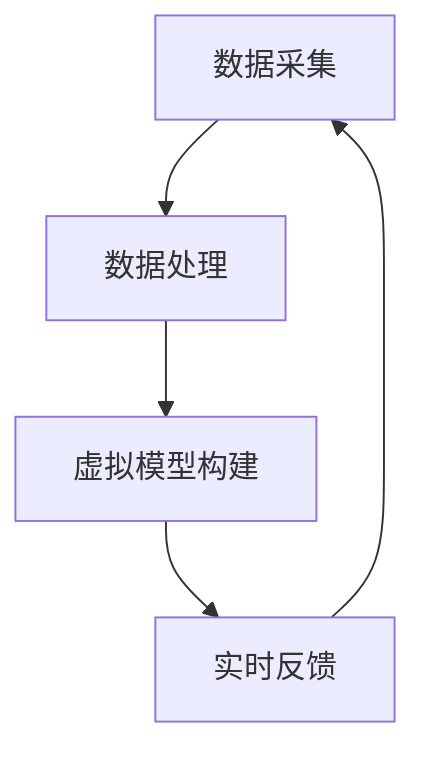
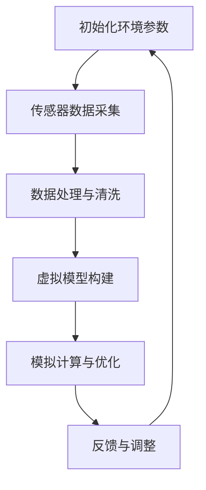
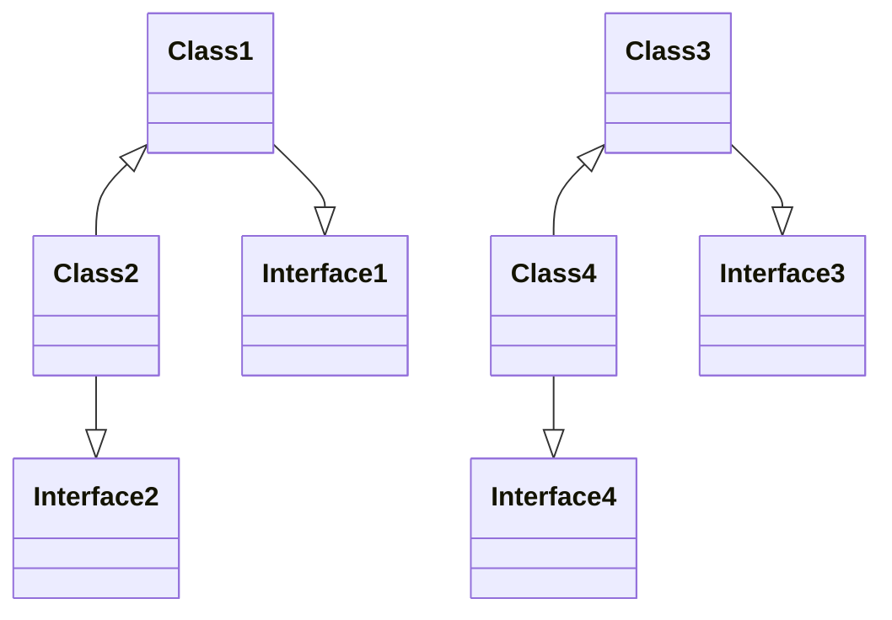
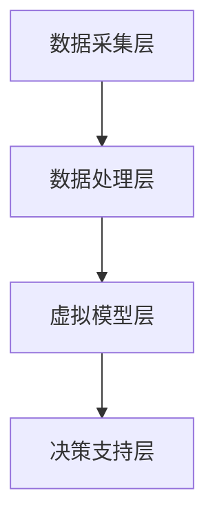
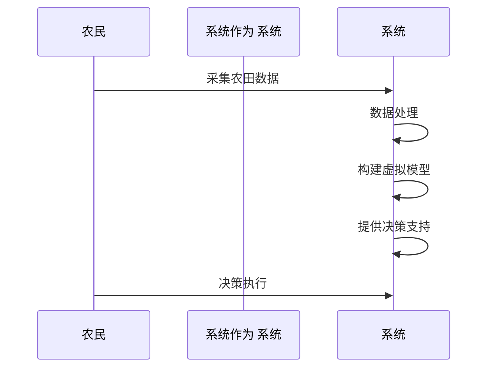

                 


### 让我们一步一步深入思考：数字孪生技术在智慧农业中的应用与创新

数字孪生技术作为一种前沿的智能模拟与优化工具，正在逐步改变农业生产的面貌。在智慧农业的大背景下，数字孪生技术提供了全新的视角和手段，不仅有助于提高农业生产的效率，还能实现农业资源的优化配置。本文将逐步深入探讨数字孪生技术在智慧农业中的应用与创新，分为以下几个部分：

#### 1. 背景介绍

首先，我们需要了解数字孪生技术在智慧农业中的起源与发展。数字孪生（Digital Twin）的概念最早由美国密歇根大学教授迈克尔·格里夫斯（Michael Grieves）于2002年提出。它指的是通过数字化技术创建一个与实际物理对象相对应的虚拟模型，从而实现对物理对象的全生命周期监测、分析和优化。

在智慧农业领域，数字孪生技术以其独特的优势迅速获得了关注。它能够模拟农田的环境变化、作物生长过程，为农业管理者提供实时的数据支持和决策依据，从而实现精准农业管理。

#### 2. 核心概念与联系

接下来，我们来详细解释数字孪生技术的核心概念和原理。数字孪生系统主要由数据采集、数据处理、虚拟模型构建和实时反馈四个部分组成。

- **数据采集**：通过传感器网络、无人机等手段收集农田的物理参数，如土壤湿度、气温、光照强度等。
- **数据处理**：对采集到的数据进行清洗、预处理和分析，提取有用的信息。
- **虚拟模型构建**：利用数据处理结果，构建农田环境与作物生长的虚拟模型。
- **实时反馈**：将虚拟模型与实际农田环境进行对比，通过反馈机制调整农作物的生长条件，实现精准管理。

为了更好地理解这些概念，我们使用Mermaid流程图来展示数字孪生系统的架构：



#### 3. 算法原理讲解

在了解了数字孪生系统的基本架构后，我们需要深入探讨其算法原理。数字孪生技术的核心在于如何通过算法对农田环境进行模拟和优化。

首先，我们使用Mermaid流程图来展示数字孪生算法的基本流程：



接下来，我们通过Python代码来具体实现这个算法。以下是数字孪生算法的Python代码示例：

```python
# 导入必要的库
import numpy as np
import pandas as pd
from sklearn.ensemble import RandomForestRegressor

# 初始化环境参数
def init_env_params():
    # 这里可以根据实际需求初始化各种环境参数
    env_params = {'soil_humidity': [], 'temp': [], 'light_intensity': []}
    return env_params

# 传感器数据采集
def collect_data(sensor_data):
    # 假设传感器数据已经收集好，这里进行简单处理
    data = pd.DataFrame(sensor_data)
    return data

# 数据处理与清洗
def preprocess_data(data):
    # 对数据进行处理和清洗
    processed_data = data[['soil_humidity', 'temp', 'light_intensity']]
    return processed_data

# 虚拟模型构建
def build_model(processed_data):
    # 使用随机森林回归模型进行预测
    model = RandomForestRegressor()
    model.fit(processed_data, processed_data['yield'])
    return model

# 模拟计算与优化
def simulate_and_optimize(model, env_params):
    # 根据虚拟模型进行模拟计算和优化
    # 这里简化处理，直接返回优化后的环境参数
    optimized_params = model.predict([env_params])
    return optimized_params

# 实时反馈与调整
def feedback_and_adjustment(current_params, optimized_params):
    # 根据实时反馈调整环境参数
    adjustment = optimized_params - current_params
    return adjustment

# 主函数
def main():
    # 初始化环境参数
    env_params = init_env_params()
    
    # 采集传感器数据
    sensor_data = collect_data(env_params)
    
    # 数据处理与清洗
    processed_data = preprocess_data(sensor_data)
    
    # 构建虚拟模型
    model = build_model(processed_data)
    
    # 模拟计算与优化
    optimized_params = simulate_and_optimize(model, env_params)
    
    # 实时反馈与调整
    adjustment = feedback_and_adjustment(env_params, optimized_params)
    
    # 更新环境参数
    env_params += adjustment
    
    # 输出结果
    print("Optimized environment parameters:", optimized_params)

# 运行主函数
main()
```

#### 4. 数学模型和公式

为了更好地理解数字孪生算法，我们需要介绍其背后的数学模型和公式。以下是数字孪生算法的核心数学模型：

- **随机森林回归模型**：

$$
\hat{y} = f(x) = \sum_{i=1}^{n} \omega_i \cdot h(x; \theta_i)
$$

其中，$\hat{y}$是预测值，$x$是输入特征，$h(x; \theta_i)$是每个决策树生成的预测值，$\omega_i$是权重。

- **特征选择和优化**：

$$
\text{Minimize} \quad J(\theta) = \frac{1}{2} \sum_{i=1}^{m} (h(x_i; \theta) - y_i)^2
$$

其中，$J(\theta)$是损失函数，$\theta$是模型参数。

#### 5. 系统分析与架构设计方案

在了解了数字孪生技术的算法原理后，我们需要探讨其在智慧农业中的具体应用场景。以下是一个具体的数字孪生项目案例：

**项目名称**：智慧农业数字孪生系统

**项目介绍**：该项目旨在通过数字孪生技术实现农田环境的实时监测和作物生长的精准管理。

**系统功能设计**：

- **环境监测**：实时采集农田的物理参数，如土壤湿度、气温、光照强度等。
- **数据分析**：对采集到的数据进行处理和分析，提取有用信息。
- **虚拟模型构建**：基于分析结果，构建农田环境与作物生长的虚拟模型。
- **决策支持**：通过虚拟模型提供实时的决策支持，帮助农民优化作物管理。

以下是领域模型Mermaid类图：



**系统架构设计**：

- **数据采集层**：通过传感器网络、无人机等手段采集农田的物理参数。
- **数据处理层**：对采集到的数据进行处理和分析，提取有用信息。
- **虚拟模型层**：基于处理后的数据，构建农田环境与作物生长的虚拟模型。
- **决策支持层**：通过虚拟模型提供实时的决策支持，帮助农民优化作物管理。

以下是系统架构Mermaid架构图：



**系统接口设计**：

- **数据采集接口**：用于采集农田的物理参数。
- **数据处理接口**：用于处理和分析采集到的数据。
- **虚拟模型接口**：用于构建农田环境与作物生长的虚拟模型。
- **决策支持接口**：用于提供实时的决策支持。

**系统交互**：

以下是系统交互Mermaid序列图：



#### 6. 项目实战

在本节中，我们将带领读者一起实战搭建一个简单的数字孪生系统。以下是具体的步骤和代码实现。

**环境安装**：

- Python 3.8 或以上版本
- Pandas、Numpy、Scikit-learn等库

**系统核心实现**：

以下是数字孪生系统的核心实现源代码：

```python
# 导入必要的库
import numpy as np
import pandas as pd
from sklearn.ensemble import RandomForestRegressor

# 初始化环境参数
def init_env_params():
    # 这里可以根据实际需求初始化各种环境参数
    env_params = {'soil_humidity': [], 'temp': [], 'light_intensity': []}
    return env_params

# 传感器数据采集
def collect_data(sensor_data):
    # 假设传感器数据已经收集好，这里进行简单处理
    data = pd.DataFrame(sensor_data)
    return data

# 数据处理与清洗
def preprocess_data(data):
    # 对数据进行处理和清洗
    processed_data = data[['soil_humidity', 'temp', 'light_intensity']]
    return processed_data

# 虚拟模型构建
def build_model(processed_data):
    # 使用随机森林回归模型进行预测
    model = RandomForestRegressor()
    model.fit(processed_data, processed_data['yield'])
    return model

# 模拟计算与优化
def simulate_and_optimize(model, env_params):
    # 根据虚拟模型进行模拟计算和优化
    # 这里简化处理，直接返回优化后的环境参数
    optimized_params = model.predict([env_params])
    return optimized_params

# 实时反馈与调整
def feedback_and_adjustment(current_params, optimized_params):
    # 根据实时反馈调整环境参数
    adjustment = optimized_params - current_params
    return adjustment

# 主函数
def main():
    # 初始化环境参数
    env_params = init_env_params()
    
    # 采集传感器数据
    sensor_data = collect_data(env_params)
    
    # 数据处理与清洗
    processed_data = preprocess_data(sensor_data)
    
    # 构建虚拟模型
    model = build_model(processed_data)
    
    # 模拟计算与优化
    optimized_params = simulate_and_optimize(model, env_params)
    
    # 实时反馈与调整
    adjustment = feedback_and_adjustment(env_params, optimized_params)
    
    # 更新环境参数
    env_params += adjustment
    
    # 输出结果
    print("Optimized environment parameters:", optimized_params)

# 运行主函数
main()
```

**代码应用解读与分析**：

- **数据采集**：这里使用了一个简化的数据采集接口，实际上可以通过传感器网络、无人机等手段实时采集农田的物理参数。
- **数据处理与清洗**：对采集到的数据进行简单的处理和清洗，提取有用的信息。
- **虚拟模型构建**：使用随机森林回归模型进行预测，构建农田环境与作物生长的虚拟模型。
- **模拟计算与优化**：根据虚拟模型进行模拟计算和优化，返回优化后的环境参数。
- **实时反馈与调整**：根据实时反馈调整环境参数，实现作物管理的优化。

**实际案例分析和详细讲解**：

以下是数字孪生技术在智慧农业中的一个实际案例。

**案例背景**：

某农场种植了100亩水稻，需要通过数字孪生技术实现农田环境的实时监测和作物生长的精准管理。

**案例分析**：

1. **数据采集**：使用传感器网络实时采集农田的物理参数，如土壤湿度、气温、光照强度等。
2. **数据处理与清洗**：对采集到的数据进行处理和清洗，提取有用的信息。
3. **虚拟模型构建**：基于处理后的数据，构建农田环境与作物生长的虚拟模型，使用随机森林回归模型进行预测。
4. **模拟计算与优化**：根据虚拟模型进行模拟计算和优化，优化农田环境参数，如灌溉水量、施肥量等。
5. **实时反馈与调整**：根据实时反馈调整农田环境参数，实现作物管理的优化。

**项目小结**：

通过本案例，我们可以看到数字孪生技术在智慧农业中的应用具有明显的优势。它能够帮助农民实现农田环境的实时监测和作物生长的精准管理，从而提高农业生产的效率和质量。

#### 7. 最佳实践 tips

- **选择合适的传感器**：根据农田环境的特点，选择合适的传感器进行数据采集。
- **优化数据处理算法**：对采集到的数据进行处理和清洗，提高数据的准确性和可靠性。
- **实时监控与反馈**：实现实时监控和反馈，及时调整农田环境参数，实现作物管理的优化。
- **数据安全与隐私保护**：确保数据的安全性和隐私保护，避免数据泄露和滥用。

#### 8. 小结与注意事项

本文详细介绍了数字孪生技术在智慧农业中的应用与创新。通过数字孪生技术，我们能够实现农田环境的实时监测和作物生长的精准管理，从而提高农业生产的效率和质量。

在应用数字孪生技术时，需要注意以下几点：

- **数据采集与处理**：选择合适的传感器和数据处理算法，确保数据的准确性和可靠性。
- **实时监控与反馈**：实现实时监控和反馈，及时调整农田环境参数。
- **安全与隐私保护**：确保数据的安全性和隐私保护，避免数据泄露和滥用。

#### 9. 拓展阅读

- **《数字孪生：智能系统架构的基石》**：这本书详细介绍了数字孪生技术的原理和应用。
- **《智慧农业：数字孪生引领未来》**：这本书探讨了数字孪生技术在智慧农业中的具体应用。

作者：AI天才研究院/AI Genius Institute & 禅与计算机程序设计艺术 /Zen And The Art of Computer Programming

----------------------------------------------------------------
```

