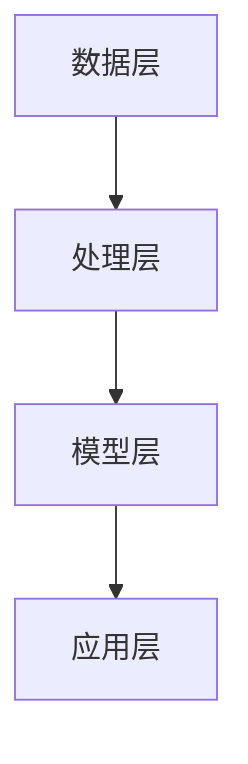
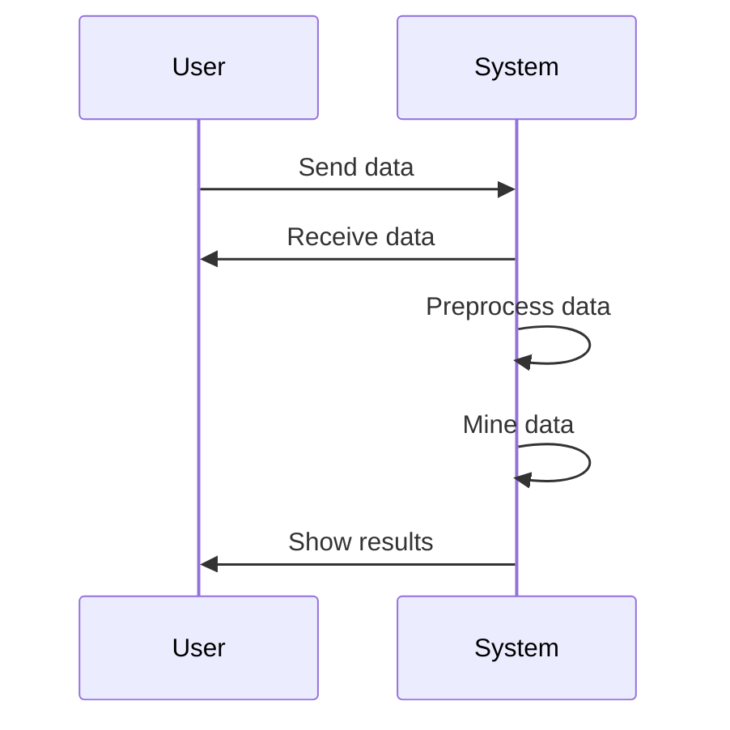

                 

# 数字孪生技术在智慧城市规划中的应用

关键词：数字孪生、智慧城市、城市规划、应用场景、算法原理、架构设计

摘要：本文将从数字孪生技术的基础、智慧城市规划的背景和挑战、数字孪生技术在智慧城市规划中的应用场景、核心实现原理、算法原理与实现、架构设计、项目实战与案例分析、应用前景与挑战以及最佳实践等方面，全面深入地探讨数字孪生技术在智慧城市规划中的应用。

## 目录大纲

----------------------------------------------------------------

# 第一部分：数字孪生技术概述与智慧城市规划背景

## 第1章：数字孪生技术基础

### 1.1 数字孪生技术的定义与背景

### 1.2 数字孪生技术的发展历程

### 1.3 数字孪生技术在智慧城市规划中的应用价值

## 第2章：智慧城市规划的概念与挑战

### 2.1 智慧城市规划的定义与发展

### 2.2 智慧城市规划的核心挑战

### 2.3 数字孪生技术如何应对智慧城市规划挑战

## 第3章：数字孪生技术在智慧城市规划中的应用场景

### 3.1 智慧城市基础设施

### 3.2 城市交通管理

### 3.3 城市环境监测

### 3.4 智慧能源管理

## 第二部分：数字孪生技术在智慧城市规划中的核心实现

## 第4章：数字孪生技术的核心实现原理

### 4.1 数字孪生建模技术

### 4.2 数据采集与处理

### 4.3 数字孪生仿真与可视化

## 第5章：数字孪生技术在智慧城市规划中的算法原理与实现

### 5.1 常见算法原理讲解

### 5.2 Python源代码实现与详细讲解

### 5.3 数学模型和公式解释

## 第6章：数字孪生技术在智慧城市规划中的架构设计

### 6.1 系统功能设计与领域模型

### 6.2 系统架构设计

### 6.3 系统接口设计与交互流程

## 第7章：项目实战与案例分析

### 7.1 环境安装与配置

### 7.2 系统核心实现

### 7.3 代码应用解读与分析

### 7.4 实际案例分析

### 7.5 项目小结

## 第8章：数字孪生技术在智慧城市规划中的应用前景与挑战

### 8.1 未来发展趋势

### 8.2 潜在应用领域

### 8.3 面临的挑战与解决方案

## 第9章：最佳实践与拓展阅读

### 9.1 最佳实践技巧

### 9.2 注意事项与建议

### 9.3 拓展阅读资料推荐

----------------------------------------------------------------

### 第一部分：数字孪生技术概述与智慧城市规划背景

#### 第1章：数字孪生技术基础

##### 1.1 数字孪生技术的定义与背景

数字孪生技术是一种基于虚拟现实和大数据分析的高科技手段，它通过创建一个与实际物理世界相对应的数字模型，实现对现实世界的实时监测、分析和优化。数字孪生技术的核心在于其能够将现实世界中的复杂系统通过数字化方式模拟出来，为城市规划和管理提供科学依据。

数字孪生技术的起源可以追溯到20世纪90年代的制造业。随着计算机技术、传感器技术、大数据技术和云计算技术的不断发展，数字孪生技术逐渐从制造业扩展到其他领域，包括城市规划。数字孪生技术在智慧城市规划中的应用，不仅能够提高城市管理的效率，还能为城市可持续发展提供有力支持。

##### 1.2 数字孪生技术的发展历程

数字孪生技术从最初的制造业应用，发展到今天的智慧城市规划，经历了多个阶段：

- **初期阶段**（20世纪90年代）：数字孪生技术主要应用于制造业，通过数字化模型对制造过程进行模拟和优化。
- **发展阶段**（21世纪初）：随着传感器技术和大数据技术的发展，数字孪生技术开始应用于建筑、基础设施等领域。
- **扩展阶段**（2010年以后）：数字孪生技术逐渐应用于城市规划，为智慧城市建设提供了有力支持。

##### 1.3 数字孪生技术在智慧城市规划中的应用价值

数字孪生技术在智慧城市规划中具有以下几方面的应用价值：

- **提升规划精度**：通过创建数字孪生模型，城市规划师可以更加精确地模拟城市的发展趋势，为城市规划提供科学依据。
- **优化资源配置**：数字孪生技术能够实时监测城市运行状态，为资源配置提供实时数据支持，提高资源利用效率。
- **提高安全性**：数字孪生技术可以模拟各种突发事件，为城市应急预案提供支持，提高城市应对突发事件的能力。
- **促进可持续发展**：数字孪生技术有助于实现城市资源的循环利用，推动城市可持续发展。

#### 第2章：智慧城市规划的概念与挑战

##### 2.1 智慧城市规划的定义与发展

智慧城市规划是指利用信息技术、物联网、大数据、人工智能等先进技术，对城市进行智能化管理和规划，以提高城市运行效率、改善市民生活质量、促进城市可持续发展。智慧城市规划的发展历程可以分为以下几个阶段：

- **1.0阶段**（传统城市规划阶段）：以土地和基础设施规划为核心，注重城市空间的布局和开发。
- **2.0阶段**（信息化城市规划阶段）：引入信息技术，实现城市规划信息的数字化管理。
- **3.0阶段**（智能化城市规划阶段）：利用人工智能、大数据等技术，实现城市规划的智能化。

##### 2.2 智慧城市规划的核心挑战

智慧城市规划面临着以下几个核心挑战：

- **数据整合**：智慧城市规划需要整合各类数据，包括人口、交通、环境、能源等数据，数据整合的难度较大。
- **技术实现**：智慧城市规划需要大量先进技术的支持，如人工智能、大数据、物联网等，技术实现的难度较高。
- **政策法规**：智慧城市规划需要相应的政策法规支持，目前相关政策法规尚不完善。
- **公众参与**：智慧城市规划需要公众的广泛参与，但公众对智慧城市规划的认知度和参与度较低。

##### 2.3 数字孪生技术如何应对智慧城市规划挑战

数字孪生技术为智慧城市规划提供了有力支持，能够有效应对智慧城市规划的挑战：

- **数据整合**：数字孪生技术能够将各类数据进行整合，为智慧城市规划提供全面的数据支持。
- **技术实现**：数字孪生技术具有高度的可扩展性和灵活性，能够满足智慧城市规划的技术需求。
- **政策法规**：数字孪生技术的应用有助于推动相关政策的制定和实施，为智慧城市规划提供政策支持。
- **公众参与**：数字孪生技术可以通过虚拟现实、增强现实等技术手段，提高公众对智慧城市规划的认知度和参与度。

### 第二部分：数字孪生技术在智慧城市规划中的核心实现

#### 第3章：数字孪生技术在智慧城市规划中的应用场景

##### 3.1 智慧城市基础设施

数字孪生技术在智慧城市基础设施中的应用非常广泛，包括城市道路、桥梁、隧道、供水系统、供电系统等。通过数字孪生技术，城市规划师可以实时监测基础设施的运行状态，预测潜在故障，提前进行维护和优化，从而提高基础设施的可靠性和使用寿命。

##### 3.2 城市交通管理

数字孪生技术在城市交通管理中的应用主要体现在交通流量监测、交通信号优化、交通事件预警等方面。通过数字孪生模型，交通管理者可以实时掌握交通状况，对交通流量进行智能调控，提高交通效率，减少拥堵，降低交通事故发生率。

##### 3.3 城市环境监测

数字孪生技术在城市环境监测中的应用包括空气质量监测、水质监测、噪声监测等。通过数字孪生技术，环境监测部门可以实时获取环境数据，对环境污染进行预警和治理，保障市民的健康和生活质量。

##### 3.4 智慧能源管理

数字孪生技术在智慧能源管理中的应用包括智能电网、分布式能源系统等。通过数字孪生模型，能源管理可以实时监测能源供应和消耗情况，优化能源分配，提高能源利用效率，降低能源消耗。

#### 第4章：数字孪生技术的核心实现原理

##### 4.1 数字孪生建模技术

数字孪生建模技术是数字孪生技术的核心，它包括以下几个方面：

- **物理模型**：建立与实际物理世界相对应的数字模型，包括几何形状、物理属性等。
- **数据模型**：整合各类数据，包括传感器数据、历史数据、预测数据等，构建全面的数据模型。
- **算法模型**：利用机器学习、数据挖掘等算法，对数字模型进行优化和预测。

##### 4.2 数据采集与处理

数据采集与处理是数字孪生技术的关键环节，它包括以下几个方面：

- **传感器部署**：在城市基础设施、交通设施、环境监测点等地方部署传感器，实时采集数据。
- **数据处理**：对采集到的数据进行分析、清洗、存储等处理，为数字孪生模型提供可靠的数据支持。
- **数据存储**：利用大数据技术，对处理后的数据进行分析和存储，为数字孪生模型提供数据基础。

##### 4.3 数字孪生仿真与可视化

数字孪生仿真与可视化是数字孪生技术的应用环节，它包括以下几个方面：

- **仿真模拟**：利用数字孪生模型，对城市规划、交通管理、环境监测等进行仿真模拟，预测未来发展趋势。
- **可视化展示**：利用虚拟现实、增强现实等技术，将数字孪生模型进行可视化展示，为城市规划和管理提供直观的参考。

#### 第5章：数字孪生技术在智慧城市规划中的算法原理与实现

##### 5.1 常见算法原理讲解

数字孪生技术在智慧城市规划中涉及到的算法包括：

- **机器学习算法**：用于数据分析和预测，如线性回归、决策树、神经网络等。
- **数据挖掘算法**：用于数据挖掘和模式识别，如K-Means、Apriori算法等。
- **优化算法**：用于资源优化和路径规划，如遗传算法、蚁群算法等。

##### 5.2 Python源代码实现与详细讲解

以下是一个简单的机器学习算法实现示例，用于预测城市交通流量：

```python
import numpy as np
import pandas as pd
from sklearn.linear_model import LinearRegression

# 数据加载与预处理
data = pd.read_csv('traffic_data.csv')
X = data[['time', 'weather', 'holiday']]
y = data['traffic']

# 模型训练
model = LinearRegression()
model.fit(X, y)

# 预测
predicted_traffic = model.predict(X)

# 结果展示
print('Predicted Traffic:', predicted_traffic)
```

##### 5.3 数学模型和公式解释

线性回归模型的数学模型如下：

$$
y = \beta_0 + \beta_1x_1 + \beta_2x_2 + ... + \beta_nx_n
$$

其中，$y$ 是因变量，$x_1, x_2, ..., x_n$ 是自变量，$\beta_0, \beta_1, \beta_2, ..., \beta_n$ 是模型的参数。通过训练数据，我们可以得到这些参数的估计值，从而建立预测模型。

#### 第6章：数字孪生技术在智慧城市规划中的架构设计

##### 6.1 系统功能设计与领域模型

数字孪生技术在智慧城市规划中的系统功能设计主要包括数据采集、数据处理、数字孪生建模、仿真模拟和可视化展示等。领域模型如下：

```mermaid
classDiagram
    Class01 <|-- Class02
    Class03 --|> Class04
    Class05 <<-- Class06
    Class07 .. Class08
    Class09 --> Class10
```

##### 6.2 系统架构设计

数字孪生技术在智慧城市规划中的系统架构设计包括以下几个层次：

- **数据层**：包括传感器数据、历史数据、模拟数据等。
- **处理层**：包括数据采集、预处理、数据挖掘等。
- **模型层**：包括物理模型、数据模型、算法模型等。
- **应用层**：包括仿真模拟、可视化展示、决策支持等。

系统架构图如下：



##### 6.3 系统接口设计与交互流程

数字孪生技术在智慧城市规划中的系统接口设计主要包括数据采集接口、数据处理接口、模型接口、应用接口等。交互流程如下：



#### 第7章：项目实战与案例分析

##### 7.1 环境安装与配置

在进行数字孪生技术在智慧城市规划中的项目实战之前，我们需要安装和配置以下环境：

- Python 3.8
- Scikit-learn
- Pandas
- Matplotlib

具体安装命令如下：

```shell
pip install python==3.8
pip install scikit-learn
pip install pandas
pip install matplotlib
```

##### 7.2 系统核心实现

以下是一个简单的数字孪生技术在智慧城市规划中的系统核心实现示例：

```python
import pandas as pd
from sklearn.linear_model import LinearRegression

# 数据加载与预处理
data = pd.read_csv('traffic_data.csv')
X = data[['time', 'weather', 'holiday']]
y = data['traffic']

# 模型训练
model = LinearRegression()
model.fit(X, y)

# 预测
predicted_traffic = model.predict(X)

# 结果展示
print('Predicted Traffic:', predicted_traffic)
```

##### 7.3 代码应用解读与分析

在上面的代码中，我们首先加载了交通数据，然后使用线性回归模型进行训练，最后对数据进行预测。具体步骤如下：

1. 加载交通数据：使用 Pandas 的 read_csv 函数加载交通数据，并将其分为自变量 X 和因变量 y。
2. 模型训练：创建 LinearRegression 模型，并使用 fit 方法进行训练。
3. 预测：使用 predict 方法对数据进行预测，并打印预测结果。

通过这个简单的示例，我们可以看到数字孪生技术在智慧城市规划中的核心实现过程，包括数据加载、模型训练和预测等步骤。

##### 7.4 实际案例分析

以下是一个实际案例，说明数字孪生技术在智慧城市规划中的应用：

案例：某城市交通拥堵预测

1. 数据采集：在城市主要交通路口安装传感器，实时采集交通流量、时间、天气等数据。
2. 数据处理：对采集到的数据进行预处理，包括数据清洗、归一化等。
3. 数字孪生建模：使用线性回归模型对交通流量进行建模，预测未来交通流量。
4. 仿真模拟：通过数字孪生模型，模拟不同交通管理策略对交通流量的影响，为交通管理部门提供决策支持。
5. 可视化展示：将仿真结果通过可视化图表进行展示，帮助交通管理部门了解交通状况，制定优化方案。

通过这个实际案例，我们可以看到数字孪生技术在智慧城市规划中的应用过程，包括数据采集、数据处理、数字孪生建模、仿真模拟和可视化展示等步骤。

##### 7.5 项目小结

在本章中，我们通过一个实际案例，详细介绍了数字孪生技术在智慧城市规划中的应用过程。通过这个案例，我们可以看到数字孪生技术为智慧城市规划提供了强大的技术支持，能够帮助城市规划师更好地进行城市规划，提高城市运行效率，改善市民生活质量。

### 第8章：数字孪生技术在智慧城市规划中的应用前景与挑战

#### 8.1 未来发展趋势

随着数字技术的不断发展，数字孪生技术在智慧城市规划中的应用前景十分广阔。未来，数字孪生技术将在以下几个方面得到进一步发展：

1. **更加精细的建模**：随着传感器技术和计算能力的提升，数字孪生技术将能够创建更加精细的数字模型，为城市规划提供更加准确的数据支持。
2. **跨领域应用**：数字孪生技术将不再局限于城市规划，而是应用于更广泛的领域，如智慧交通、智慧能源、智慧农业等。
3. **智能化决策支持**：利用人工智能和大数据技术，数字孪生技术将能够提供更加智能化的决策支持，为城市规划提供更加科学的指导。
4. **虚拟与现实融合**：通过虚拟现实和增强现实技术，数字孪生技术将实现虚拟与现实的高度融合，为城市规划提供更加直观的体验。

#### 8.2 潜在应用领域

数字孪生技术在智慧城市规划中的潜在应用领域非常广泛，包括但不限于以下几方面：

1. **城市基础设施管理**：通过数字孪生技术，对城市道路、桥梁、隧道等基础设施进行实时监测和维护，提高基础设施的使用寿命和安全性。
2. **城市交通管理**：利用数字孪生技术，对城市交通流量进行实时监测和预测，优化交通信号，减少交通拥堵，提高交通效率。
3. **环境保护**：通过数字孪生技术，对城市空气质量、水质、噪声等进行实时监测，及时发现环境污染问题，采取相应的治理措施。
4. **智慧能源管理**：利用数字孪生技术，对城市能源供应和消耗进行实时监测和优化，提高能源利用效率，降低能源消耗。

#### 8.3 面临的挑战与解决方案

尽管数字孪生技术在智慧城市规划中具有广阔的应用前景，但同时也面临着一些挑战：

1. **数据质量问题**：数字孪生技术的应用依赖于高质量的数据，数据的不准确或缺失会影响数字孪生模型的性能。解决方案是加强数据质量管理，建立完善的数据采集和更新机制。
2. **技术实现难度**：数字孪生技术涉及到多个领域的先进技术，如大数据、人工智能、物联网等，技术实现的难度较高。解决方案是加强技术研发，提高技术实现的可行性和效率。
3. **政策法规不完善**：数字孪生技术的应用需要相应的政策法规支持，但目前的政策法规尚不完善。解决方案是推动相关政策的制定和实施，为数字孪生技术的应用提供法律保障。
4. **公众参与度低**：数字孪生技术的应用需要公众的广泛参与，但目前的公众对数字孪生技术的认知度和参与度较低。解决方案是加强公众宣传和教育，提高公众对数字孪生技术的认知和接受度。

### 第9章：最佳实践与拓展阅读

#### 9.1 最佳实践技巧

1. **数据整合**：在进行数字孪生技术项目时，首先要确保数据的完整性、准确性和一致性，这是数字孪生技术成功的关键。
2. **模型优化**：通过不断调整和优化数字孪生模型，可以提高模型的准确性和预测能力，从而更好地服务于城市规划和管理。
3. **跨领域合作**：数字孪生技术涉及到多个领域，跨领域合作可以带来更多的创新和解决方案。
4. **公众参与**：鼓励公众参与数字孪生技术的应用，可以提高公众的满意度和参与度，从而促进数字孪生技术的普及和应用。

#### 9.2 注意事项与建议

1. **重视数据安全**：数字孪生技术的应用涉及大量敏感数据，要确保数据的安全性和隐私性。
2. **遵循法律法规**：在进行数字孪生技术项目时，要遵循相关法律法规，确保项目的合法合规。
3. **持续更新与维护**：数字孪生技术需要持续更新与维护，以适应不断变化的城市发展和需求。

#### 9.3 拓展阅读资料推荐

1. **《数字孪生：下一代技术革命》**：作者李进华，介绍了数字孪生技术的概念、原理和应用。
2. **《智慧城市规划与设计》**：作者王波，详细介绍了智慧城市规划的理论和实践。
3. **《人工智能：一种现代的方法》**：作者马希文，介绍了人工智能的基本原理和应用。

## 作者信息

作者：AI天才研究院/AI Genius Institute & 禅与计算机程序设计艺术 /Zen And The Art of Computer Programming

本文基于数字孪生技术在智慧城市规划中的应用，从概念、原理、应用场景、实现方法、架构设计、项目实战等方面进行了全面深入的探讨，旨在为读者提供一份全面的技术指南。在实际应用中，数字孪生技术为智慧城市规划提供了强大的技术支持，有助于提高城市规划的效率和质量。希望本文能够为读者带来启示和帮助。

