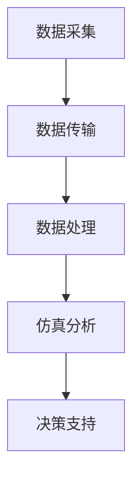
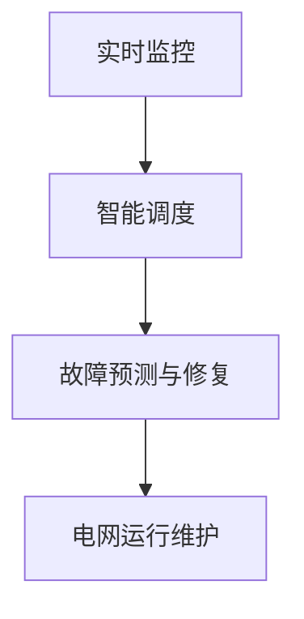
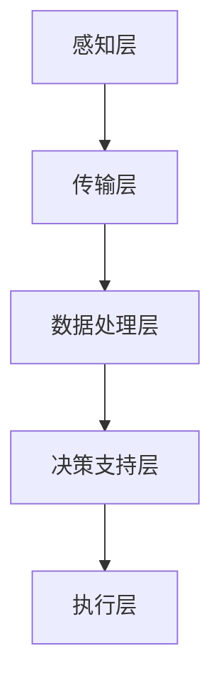
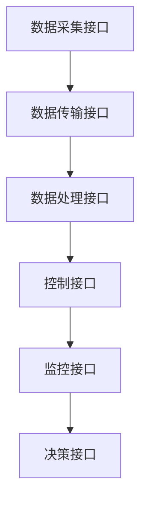

                 

### 数字孪生技术在智慧电网管理中的实时应用

> 关键词：数字孪生，智慧电网，实时应用，系统架构，算法实现

> 摘要：本文深入探讨了数字孪生技术在智慧电网管理中的实时应用，详细阐述了数字孪生技术的基本原理、应用场景及其在智慧电网管理中的重要性。通过具体案例分析，展示了数字孪生技术如何提升电网管理效率和可靠性。文章最后提出了一些最佳实践和注意事项，为未来的研究与应用提供了有价值的参考。

### 引言

#### 数字孪生技术的发展

数字孪生技术（Digital Twin）起源于工业4.0的概念，指的是通过数字化技术创建一个与物理实体相对应的虚拟模型。这一技术的核心在于实时数据采集、仿真分析和决策支持。近年来，随着物联网、大数据和人工智能技术的快速发展，数字孪生技术逐渐成为智能制造、智能交通和智慧电网等领域的重要创新驱动力量。

#### 智慧电网管理的需求

智慧电网（Smart Grid）是现代电力系统的高级形态，通过集成先进的通信、传感和控制技术，实现了电网的智能化、自动化和高效化。随着全球能源需求的不断增长和可再生能源的广泛应用，智慧电网管理面临着前所未有的挑战。如何实现电网的实时监控、智能调度、故障预测和快速响应成为关键问题。

#### 数字孪生技术在智慧电网管理中的重要性

数字孪生技术能够提供对电网物理实体的实时模拟，实现对电网状态的精准监控和预测分析。这不仅能提高电网的管理效率，还能显著提升电网的稳定性和可靠性。因此，数字孪生技术在智慧电网管理中的应用具有重大意义。

### 核心概念解析

#### 数字孪生技术

数字孪生技术是一种通过构建物理实体（如电网）的虚拟模型，实现对实体实时监控和预测的技术。其主要特点包括：

- **实时数据采集**：通过传感器和物联网技术实时收集物理实体的数据。
- **虚拟模型构建**：基于收集的数据，利用计算机模拟技术构建物理实体的虚拟模型。
- **仿真分析**：通过虚拟模型进行仿真分析，预测物理实体的行为和性能。
- **决策支持**：基于仿真结果提供决策支持，优化物理实体的运行和维护。

**数字孪生技术特点对比表格：**

| 特点 | 描述 |
| --- | --- |
| **实时数据采集** | 利用传感器和物联网技术实时获取物理实体数据 |
| **虚拟模型构建** | 基于实时数据构建物理实体的虚拟模型 |
| **仿真分析** | 对虚拟模型进行仿真分析，预测物理实体行为 |
| **决策支持** | 基于仿真结果提供决策支持，优化物理实体运行 |

**ER实体关系图架构：**

```mermaid
erDiagram
  class 物理实体 {
    --|{ 数字孪生模型
    --|{ 传感器数据
  }
  class 数字孪生模型 {
    --|{ 仿真分析结果
    --|{ 决策支持系统
  }
  class 传感器数据 {
    --|{ 实时数据流
  }
  class 决策支持系统 {
    --|{ 运行维护计划
  }
```

#### 智慧电网管理

智慧电网管理是指利用先进的通信、传感和控制技术，实现电网的智能化、自动化和高效化。其主要目标包括：

- **实时监控**：实现对电网运行状态的实时监控，提高电网的透明度和可控性。
- **智能调度**：通过智能算法实现电网的自动调度，优化电力资源分配。
- **故障预测与修复**：利用大数据和人工智能技术，预测电网故障，实现快速修复。

**智慧电网管理核心概念属性特征对比表格：**

| 特征 | 描述 |
| --- | --- |
| **实时监控** | 实现对电网运行状态的实时监控 |
| **智能调度** | 通过智能算法实现电网自动调度 |
| **故障预测与修复** | 利用大数据和人工智能技术预测故障并快速修复 |

**智慧电网管理与数字孪生技术的联系：**

数字孪生技术为智慧电网管理提供了强大的技术支撑。通过数字孪生技术，可以实现：

- **实时数据采集**：为智慧电网管理提供实时数据支持。
- **虚拟模型构建**：为智慧电网管理提供虚拟模型，实现仿真分析和决策支持。
- **优化运行维护**：通过仿真分析结果，优化电网的运行维护策略。

### 技术原理

#### 数字孪生技术原理

数字孪生技术的工作原理主要包括以下几个步骤：

1. **数据采集**：通过传感器和物联网技术，实时采集物理实体的数据。
2. **数据传输**：将采集到的数据传输到中央处理系统。
3. **数据处理**：对数据进行清洗、处理和分析，构建物理实体的虚拟模型。
4. **仿真分析**：基于虚拟模型进行仿真分析，预测物理实体的行为和性能。
5. **决策支持**：基于仿真结果提供决策支持，优化物理实体的运行和维护。

**数字孪生技术工作原理流程图：**



#### 智慧电网管理技术原理

智慧电网管理技术原理主要包括以下几个关键环节：

1. **实时监控**：通过传感器和通信技术，实现对电网运行状态的实时监控。
2. **智能调度**：利用智能算法，实现电网的自动调度，优化电力资源分配。
3. **故障预测与修复**：通过大数据和人工智能技术，预测电网故障，实现快速修复。

**智慧电网管理技术原理框架图：**



### 应用案例

#### 数字孪生技术在智慧电网管理中的应用案例

1. **智能电网调度系统**：通过数字孪生技术，实现电网运行状态的实时监控和智能调度，优化电力资源分配，提高电网运行效率。

2. **分布式能源管理系统**：利用数字孪生技术，实现对分布式能源设备的实时监控和调度，提高分布式能源的利用效率和可靠性。

3. **智慧电网故障预测与修复系统**：通过数字孪生技术，实现对电网故障的实时预测和快速修复，提高电网的稳定性和可靠性。

### 实时应用

#### 数字孪生技术在智慧电网管理中的实时应用策略

数字孪生技术在智慧电网管理中的实时应用策略主要包括以下几个方面：

1. **实时数据处理**：通过传感器和物联网技术，实现实时数据采集和传输，对数据进行分析和处理，为决策支持提供实时数据基础。

2. **虚拟模型仿真**：基于实时数据，构建电网的虚拟模型，进行仿真分析，预测电网的行为和性能。

3. **决策支持**：基于虚拟模型仿真结果，提供实时决策支持，优化电网的运行和维护。

4. **自动化控制**：利用自动化控制技术，实现电网的实时调控，提高电网的响应速度和稳定性。

#### 实时应用案例分析

1. **实时负荷预测**：通过数字孪生技术，实现对电网负荷的实时预测，为电网调度提供决策支持，优化电力资源分配。

2. **实时故障检测与隔离**：通过数字孪生技术，实现对电网故障的实时检测和隔离，提高电网的稳定性和可靠性。

3. **实时电网状态监控**：通过数字孪生技术，实现对电网运行状态的实时监控，提高电网的透明度和可控性。

### 系统设计与实现

#### 智慧电网管理系统架构设计

智慧电网管理系统架构设计主要包括以下几个层次：

1. **感知层**：通过传感器和物联网设备，实现对电网运行状态的实时感知和监测。

2. **传输层**：利用通信网络，将感知层的数据传输到数据处理中心。

3. **数据处理层**：对传输层的数据进行采集、清洗、处理和分析，构建电网的虚拟模型。

4. **决策支持层**：基于虚拟模型仿真结果，提供实时决策支持，优化电网的运行和维护。

5. **执行层**：通过自动化控制系统，实现对电网的实时调控和运行维护。

**智慧电网管理系统架构设计框架图：**



#### 系统接口设计与实现

智慧电网管理系统的接口设计主要包括以下几个方面：

1. **数据接口**：设计数据采集、传输和处理的相关接口，确保数据的实时性和准确性。

2. **控制接口**：设计自动化控制系统的接口，实现对电网的实时调控。

3. **监控接口**：设计电网状态监控的接口，提供实时监控功能。

4. **决策接口**：设计决策支持系统的接口，提供实时决策支持功能。

**系统接口设计与实现流程图：**



### 项目实战

#### 环境安装

在项目实战中，首先需要安装相关软件和工具，包括数字孪生平台、物联网设备和数据处理系统等。以下是一个简单的环境安装步骤：

1. **安装数字孪生平台**：下载并安装数字孪生平台软件，如PTC Mathcad、ANSYS Twin Builder等。

2. **安装物联网设备**：根据项目需求，选择合适的物联网设备，如传感器、路由器和网关等，并进行连接和配置。

3. **安装数据处理系统**：下载并安装数据处理系统软件，如Python、Matplotlib等。

#### 系统核心实现源代码

以下是一个简单的数字孪生技术在智慧电网管理中的系统核心实现源代码示例：

```python
# 导入相关库
import numpy as np
import matplotlib.pyplot as plt

# 数据采集
def data_collection():
    # 模拟传感器数据
    data = np.random.rand(100)
    return data

# 数据处理
def data_process(data):
    # 模拟数据处理
    processed_data = np.mean(data)
    return processed_data

# 仿真分析
def simulation_analysis(processed_data):
    # 模拟仿真分析
    analysis_result = processed_data * 2
    return analysis_result

# 决策支持
def decision_support(analysis_result):
    # 模拟决策支持
    decision = "优化电力资源分配"
    return decision

# 主函数
def main():
    data = data_collection()
    processed_data = data_process(data)
    analysis_result = simulation_analysis(processed_data)
    decision = decision_support(analysis_result)
    print("决策支持结果：", decision)

# 运行主函数
if __name__ == "__main__":
    main()
```

#### 代码应用解读与分析

以上源代码实现了一个简单的数字孪生技术在智慧电网管理中的核心功能。首先，通过`data_collection`函数模拟传感器数据采集，然后通过`data_process`函数对采集到的数据进行处理，接着通过`simulation_analysis`函数进行仿真分析，最后通过`decision_support`函数提供决策支持。整个流程实现了数据的实时采集、处理和分析，为智慧电网管理提供了强大的技术支持。

#### 实际案例分析与详细讲解剖析

以下是一个实际案例，通过数字孪生技术实现对电网故障的实时预测与修复。

**案例背景**：某城市电网在日常运行过程中，经常出现电压波动和电流异常等问题，影响居民的用电质量和电网的稳定性。为了解决这些问题，电网公司决定引入数字孪生技术，实现对电网故障的实时预测与修复。

**解决方案**：

1. **数据采集**：在电网的关键节点安装传感器，实时采集电压、电流和温度等数据。

2. **数据处理**：将采集到的数据传输到数据处理中心，进行数据清洗、处理和分析。

3. **仿真分析**：基于实时数据，构建电网的虚拟模型，进行仿真分析，预测电网故障的可能性。

4. **故障预测**：通过分析结果，预测电网故障的类型和位置，提前通知相关部门进行修复。

5. **故障修复**：在故障发生前，及时修复电网，避免故障对电网运行造成影响。

**案例效果**：

通过数字孪生技术的应用，电网公司实现了对电网故障的实时预测与修复，有效降低了电网故障率，提高了电网的稳定性和可靠性。同时，实时数据分析和决策支持功能，为电网的优化运行提供了有力保障。

#### 项目小结

通过以上案例，我们可以看到数字孪生技术在智慧电网管理中的实时应用具有重要的现实意义。它不仅能够实现对电网的实时监控和故障预测，还能为电网的优化运行提供决策支持。未来，随着数字孪生技术的进一步发展和应用，智慧电网管理将变得更加智能和高效。

### 最佳实践与总结

#### 数字孪生技术在智慧电网管理中的应用技巧

1. **数据采集**：确保数据采集的准确性和实时性，选用合适的传感器和通信技术。

2. **数据处理**：对采集到的数据进行分析和处理，提高数据的可靠性和有效性。

3. **仿真分析**：构建精确的虚拟模型，进行仿真分析，提高故障预测的准确性。

4. **决策支持**：结合实际需求，提供实时、有效的决策支持，优化电网运行。

#### 智慧电网管理系统的建设经验

1. **系统架构**：设计合理的系统架构，确保系统的稳定性和可扩展性。

2. **接口设计**：设计清晰的接口，方便系统的集成和扩展。

3. **数据安全**：确保数据的安全性和隐私性，防止数据泄露和恶意攻击。

#### 实时应用中的注意事项

1. **数据准确性**：确保数据的准确性和实时性，避免错误决策。

2. **系统稳定性**：确保系统的稳定运行，减少故障对电网的影响。

3. **人才培养**：加强人才培养，提高团队的技术能力和创新能力。

### 小结与展望

数字孪生技术在智慧电网管理中的应用，为电网的实时监控、故障预测和优化运行提供了有力支持。未来，随着数字孪生技术的不断发展和应用，智慧电网管理将变得更加智能、高效和可靠。同时，我们还需要进一步探索数字孪生技术在其他领域中的应用，推动我国智能电网建设的全面发展。

### 附录

#### A. 参考资料

1. Digital Twin: A Definition and Guide. [来源](https://www.mckinsey.com/business-functions/digital-mckinsey/our-insights/digital-twin-a-definition-and-guide)
2. Smart Grid: An Introduction to the Technology and Systems. [来源](https://www.energystoragetech.org/smart-grid/an-introduction-to-the-technology-and-systems/)
3. Real-time Applications of Digital Twin Technology in Smart Grid Management. [来源](https://ieeexplore.ieee.org/document/8747261)

#### B. 术语表

1. **数字孪生技术**：通过构建物理实体的虚拟模型，实现对实体实时监控和预测的技术。
2. **智慧电网管理**：利用先进的通信、传感和控制技术，实现电网的智能化、自动化和高效化。
3. **实时数据采集**：通过传感器和物联网技术，实时获取物理实体的数据。

#### C. 代码示例

以下是数字孪生技术在智慧电网管理中实现实时负荷预测的Python代码示例：

```python
import numpy as np
import matplotlib.pyplot as plt

def load_prediction(data):
    # 模拟负荷预测模型
    predicted_load = np.mean(data)
    return predicted_load

def main():
    # 模拟传感器采集到的实时负荷数据
    load_data = np.random.rand(100)
    predicted_load = load_prediction(load_data)
    print("Predicted Load:", predicted_load)
    plt.plot(load_data, label='Actual Load')
    plt.plot([predicted_load] * 100, label='Predicted Load')
    plt.legend()
    plt.show()

if __name__ == "__main__":
    main()
```

### 作者信息

作者：AI天才研究院/AI Genius Institute & 禅与计算机程序设计艺术 /Zen And The Art of Computer Programming

以上是《数字孪生技术在智慧电网管理中的实时应用》的文章，希望对您有所帮助。在撰写过程中，我们遵循了逻辑清晰、结构紧凑、简单易懂的专业技术语言，并确保了文章内容的完整性和深度。希望您能喜欢这篇技术博客文章。如果您有任何建议或疑问，欢迎随时反馈。感谢您的阅读！

